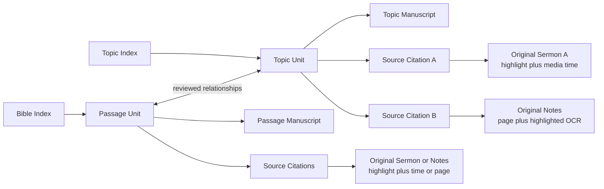

# Functional Specification: Exegesis and Topic Repository

## 1. Purpose

The Exegesis and Topic Repository reorganizes Dr. Wang's notes, lectures, sermons, and generated manuscripts into a durable reader-facing knowledge collection. It is not organized primarily by teaching event, conference, Lecture, or Project. Instead, it presents the same reviewed canonical units through two complementary indexes:

1. a Bible index from Genesis through Revelation; and
2. a theological topic index containing concepts such as dispensationalism, the deity of Christ, justification, faith, and hermeneutics.

Every published unit contains a readable manuscript and one or more traceable links to the exact source fragments from which the manuscript was derived. A source link must open the original sermon transcript or notes source, position the reader at the relevant fragment, and highlight that fragment. Opening only the top of a complete source document does not satisfy this requirement.

## 2. Problem Statement

Dr. Wang's teaching frequently combines verse-by-verse exegesis, theological synthesis, applications, historical comments, questions, and personal examples in a non-linear order. The same argument may be repeated, extended, corrected, or illustrated in several lectures. Preserving lecture order therefore produces unnecessary repetition and weakens the logic of a reader-facing manuscript.

The repository solves three related problems:

* **Editorial structure**: preserve Dr. Wang's thought without preserving the accidental sequence of a live lecture.
* **Dual discovery**: let readers begin with either a biblical passage or a theological topic.
* **Source traceability**: let readers inspect the exact sermon or notes fragment supporting a unit, including its original context and media time when available.

## 3. Product Principles

### 3.1. Canonical unit, not lecture, is the reading unit

A Project remains the production, review, and audit boundary. A canonical unit is the long-term editorial and reader-facing unit. One Project may create several canonical units, and one canonical unit may combine evidence from several Projects, lectures, dates, or venues.

### 3.2. Bible and topic views are indexes over the same repository

The Bible index and topic index must not create duplicate manuscripts. A unit has one authoritative manuscript and can appear in multiple index locations.

### 3.3. Exegesis may contain theology

Passage units may include theology necessary to explain the passage. Topic units synthesize arguments that cross passages or recur across multiple sources. The distinction is organizational, not a rule that theology must be removed from exegesis.

### 3.4. Source links are fragment-level citations

Both passage units and topic units use the same citation capability:

* original sermon transcript with highlighted text;
* audio or video positioned at the relevant start time;
* original notes page with the relevant OCR text highlighted; and
* enough surrounding context to evaluate the quotation or argument.

### 3.5. Repetition is consolidated, not erased

When a later lecture repeats an existing idea without adding substance, the existing canonical unit remains unchanged and the repeated source may be recorded as an additional occurrence. When the later lecture adds Scripture, reasoning, qualification, or correction, the canonical unit is extended and both sources remain visible.

### 3.6. Editorial decisions are reviewable

AI may propose unit boundaries, topic assignments, duplicate relationships, and source fragments. Publication requires human review. Low-confidence classification or unresolved source mapping must remain visible rather than being silently accepted.

## 4. Users and Permissions

### Reader

* Browses by Bible passage or topic.
* Reads the canonical manuscript.
* Opens related passage and topic units.
* Opens exact source fragments and their surrounding context.
* Seeks sermon media to the cited time.

### Editor

* Reviews candidate canonical units.
* Confirms whether a unit is passage-led or topic-led.
* Confirms Bible references and topic taxonomy assignments.
* Reviews, adjusts, adds, or removes source citations.
* Resolves stale or ambiguous citations.
* Publishes units and refreshes repository indexes.

### Administrator

* Manages repository builds and source-map jobs.
* Reviews failed or stale source mappings.
* Controls access to unpublished transcripts and notes.
* Can rebuild derived indexes without changing manuscripts or editorial decisions.

## 5. Scope

### Included in the initial release

* Global repository independent of an individual Series page.
* Bible and topic indexes over shared canonical units.
* Passage and topic unit detail pages.
* Manuscript, Sources, and Related Units views.
* Multiple source citations per unit.
* Transcript paragraph highlighting and media time positioning.
* Notes page selection and highlighted OCR text.
* Local relationship visualization centered on the selected unit.
* Editorial source review and publication gating.
* Migration of the existing Matthew seed catalog and transcript Projects.

### Explicitly out of scope for the initial release

* Replacing the existing Series, Lecture, or Project production workflow.
* Automatically publishing AI-proposed units without editor review.
* Displaying a single global graph containing every unit and source.
* Requiring image-coordinate highlighting on handwritten notes in the first release. The first release shows the correct source image beside highlighted OCR text. Image overlay coordinates may be added later.
* Treating a generated manuscript or Google Doc as an original source. These are derived editorial artifacts and do not satisfy the source requirement.

## 6. Domain Concepts

### 6.1. Canonical unit

A reviewed editorial article with a stable ID, title, manuscript, classifications, and sources.

Required properties:

* stable unit ID;
* title;
* unit type: `passage` or `concept`;
* publication status;
* authoritative manuscript location;
* primary Bible references, if applicable;
* zero or more topic taxonomy paths;
* related unit relationships; and
* at least one approved source citation or an explicit approved exception.

### 6.2. Passage unit

A unit whose primary organizing question is the interpretation of a sustained biblical passage. It may contain necessary theological significance and application.

### 6.3. Topic unit

A unit whose primary organizing question crosses passages, lectures, or occasions. A topic unit may cite many sermon and notes fragments and must have the same highlight and media-positioning behavior as a passage unit.

### 6.4. Source document

An original sermon transcript, sermon recording, or notes source. Source documents have stable IDs and version hashes.

### 6.5. Source fragment

A precise region within a source document. For transcripts this includes paragraph identity, exact highlighted text, and time information. For notes it includes the source page, exact OCR text, and text range.

### 6.6. Citation

A stable, shareable record connecting a source fragment to one or more canonical units. A citation records what the fragment supports, not merely where the source document is stored.

### 6.7. Unit relationship

A reviewed connection between two canonical units. Initial relationship types are:

* `related_topic`;
* `related_passage`;
* `explains`;
* `supported_by`;
* `background_for`;
* `contrasts_with`; and
* `supersedes`.

## 7. Information Architecture

## 8. Reader Workflows

### 8.1. Browse by Bible

1. The reader opens **按聖經**.
2. The reader selects a book and chapter.
3. The UI lists passage units in canonical verse order.
4. Each result displays passage range, title, related-topic count, source count, and publication state.
5. Selecting a result opens the canonical unit page.

Books or chapters with no published material remain visible and display an empty state rather than disappearing from the biblical canon.

### 8.2. Browse by topic

1. The reader opens **按主題**.
2. The reader expands the reviewed two-level taxonomy.
3. The UI lists units assigned to the selected topic.
4. A unit may appear under more than one topic path without creating a duplicate manuscript.
5. Selecting a result opens the same canonical unit page used by Bible browsing.

### 8.3. Read a canonical unit

The unit page provides three primary views:

* **Manuscript**: the readable article, retaining `釋經`, `神學意義`, `生活應用`, and `附錄` only when they contain substantive content.
* **來源與證據**: approved source fragments grouped by source document and ordered by editorial role or teaching date.
* **關聯單元**: related passage and topic units.

The page header displays the unit type, Bible references, topic paths, source count, and publication state.

### 8.4. Inspect a sermon source

1. The reader selects a sermon citation.
2. The sermon page opens or a source drawer appears.
3. The UI scrolls to the cited transcript paragraph.
4. The exact cited text is highlighted.
5. One preceding and one following paragraph are available as context.
6. If media timing exists, the player seeks to the citation start time but does not autoplay without user action.
7. The reader may expand to the complete sermon.

### 8.5. Inspect a notes source

1. The reader selects a notes citation.
2. The notes reader opens the correct scanned page.
3. The source image is displayed beside or above its OCR text.
4. The cited OCR text is highlighted and scrolled into view.
5. The reader may view adjacent pages.

### 8.6. Explore relationships

The relationship view is centered on the selected unit. It shows only direct passage, topic, and source relationships. It must not render the complete repository as an unreadable graph.

Selecting a related-unit node opens that unit. Selecting a source node opens the citation preview.

## 9. Editorial Workflows

### 9.1. Create or update a canonical unit

1. A checked-in Project or approved cross-lecture integration produces candidate units.
2. The system retains the evidence IDs assigned to each unit.
3. The repository builder maps those evidence IDs to original source fragments.
4. The editor reviews title, type, references, topic paths, relationships, manuscript location, and citations.
5. The editor approves or revises the candidate.
6. Publication writes the approved repository record and rebuilds derived indexes.

### 9.2. Review source citations

For every proposed citation, the editor sees:

* source title, date, venue, and source type;
* the exact highlighted text;
* surrounding context;
* paragraph and media time, or notes page and OCR range;
* evidence IDs and the claim or role supported;
* source version status; and
* actions to adjust, approve, reject, or replace the fragment.

### 9.3. Consolidate repeated teaching

When a later source overlaps an existing unit, the editor chooses among:

* **additional occurrence**: manuscript remains unchanged; source is added;
* **extension**: manuscript and source list are expanded;
* **correction**: manuscript is updated while both the earlier and corrective source remain visible;
* **exact duplicate**: no repeated prose is added, but the occurrence may remain in provenance; or
* **new related unit**: the material has a distinct organizing question and becomes a separate unit.

### 9.4. Publish

A unit may be published only when:

* its manuscript points to a checked-in `final.md` section or an approved repository manuscript;
* its unit type and index assignments are reviewed;
* every attached citation resolves against its recorded source version;
* at least one source citation is approved, unless an editor-approved exception includes a reason; and
* no required citation is stale or unresolved.

Publishing a unit does not overwrite Project manuscripts. Refreshing repository indexes does not rerun manuscript generation.

## 10. UI Requirements

### 10.1. Repository home

Required navigation:

* **按聖經**;
* **按主題**;
* **關係圖**; and
* full-text search when the existing sermon search integration is enabled.

The existing Series page remains available as **按講次／場合** browsing and may link into the repository with Series filters.

### 10.2. Bible index

* Preserve canonical book order.
* Sort units by OSIS start reference, not title.
* Distinguish primary passage from supporting cross-references.
* Show empty books and chapters without implying missing data is an error.

### 10.3. Topic index

* Use the reviewed taxonomy and alias groups.
* Support a unit assigned to multiple topic paths.
* Display source count and related passage count.
* Allow filtering by unit title, alias, argument, passage, or source title.

### 10.4. Unit page

* Use a single URL for the unit regardless of discovery path.
* Preserve manuscript heading anchors.
* Show sources in a dedicated tab or panel; source access must not require finding links inside prose.
* Optional inline source markers may be added later, but they do not replace the Sources panel.

### 10.5. Source citation component

Each citation displays:

* source label and teaching date or notes page;
* short exact excerpt;
* supported role or claim;
* start time for timed media;
* source-version warning when stale; and
* **查看原始內容** action.

### 10.6. Responsive and accessible behavior

* Desktop may use manuscript plus source drawer or split view.
* Mobile uses stacked tabs and a full-width source sheet.
* Highlighting must use semantic `<mark>` behavior and must not rely on color alone.
* Opening a citation moves keyboard focus to the highlighted fragment.
* All source links remain shareable URLs.

## 11. Citation Requirements

### 11.1. Transcript citation

A valid transcript citation contains:

* stable citation and source IDs;
* transcript workflow stage;
* source checksum;
* paragraph identity;
* exact highlighted substring;
* occurrence or character offsets when the substring is not unique;
* start and end time when present;
* evidence IDs; and
* supported claim or argument role.

### 11.2. Notes citation

A valid notes citation contains:

* stable citation and source IDs;
* Project and source-page identity;
* source checksum;
* exact highlighted OCR substring;
* page-relative OCR line or character range;
* evidence IDs; and
* supported claim or argument role.

### 11.3. Version behavior

If the current source checksum differs from the citation checksum, the citation becomes stale. The UI must not silently highlight a different passage. The system may propose a remap using stable paragraph identity and exact quotation, but an ambiguous remap requires editor review.

## 12. Integration with Existing Workflows

### Notes to Manuscript

Existing Project generation, theological review, Check In, and `final.md` remain authoritative. The repository consumes checked-in manuscript sections and source lineage; it does not replace Project editing.

### Transcript to Manuscript

Evidence Inventory and Manuscript Plan already retain source ranges and evidence assignments. New generation must additionally retain exact highlight anchors so repository citations can be built deterministically.

### Cross-Lecture Integration

Merge proposals and integration applications must carry source lineage with every evidence disposition and patch. Merging prose without merging source lineage is invalid.

### Topic and Search Index

The repository's reviewed Bible and topic indexes become the preferred navigation source. Sermon search continues to index manuscript text and uses repository unit IDs and citation IDs when returning source results.

## 13. Migration Plan

### Pilot

Use three representative Matthew units:

1. a passage unit: the Transfiguration;
2. a cross-passage topic unit: the meaning of `小信`; and
3. a repeated multi-source topic: dispensationalism and the Scofield tradition.

The pilot must exercise transcript timing, multiple lecture sources, notes pages, passage relationships, topic relationships, and stale-source handling.

### Matthew migration

After the pilot passes:

1. import reviewed units from the Matthew seed catalog;
2. resolve candidate and duplicate-review items;
3. build source maps for published notes and transcript Projects;
4. approve citations in batches;
5. publish Matthew repository indexes; and
6. compare repository coverage with all checked-in Matthew Projects.

### Remaining sermons

Process the wider corpus incrementally. New sermons enter the same evidence, continuity, canonical-unit, citation-review, and publication workflow. The repository must not wait for all 200-plus sermons to be processed before publishing reviewed units.

## 14. Non-Functional Requirements

### Traceability

Every published source link resolves to exact original content or clearly reports why it is unavailable.

### Stability

Unit and citation URLs remain stable when titles change. Titles must never be used as the sole identifier.

### Integrity

Derived indexes are rebuilt atomically. A failed build must not replace the active repository.

### Performance

Repository index pages should respond within one second for the expected corpus. Citation resolution and source preview should normally respond within one second on local infrastructure.

### Security

Public readers may access only source stages and notes assets authorized for publication. Draft, reviewed-only, or raw sources require editor access.

### Observability

Repository builds report unit, relationship, citation, stale-citation, and unresolved-citation counts. Every published snapshot records input hashes and generation time.

## 15. Acceptance Criteria

### Shared unit behavior

* The Bible and topic indexes can point to the same unit URL.
* A unit has one authoritative manuscript regardless of how the reader discovered it.
* Both passage and topic units display source citations.

### Transcript source behavior

* Selecting a transcript citation opens the correct sermon.
* The cited paragraph scrolls into view and the exact text is highlighted.
* The media player seeks to the citation start time when timing exists.
* The reader can inspect surrounding context and the complete sermon.

### Notes source behavior

* Selecting a notes citation opens the correct page.
* The relevant OCR text scrolls into view and is highlighted.
* The original scanned page remains visible.

### Multi-source topic behavior

* A topic unit can list sources from multiple lectures and notes Projects.
* Each source opens its own exact highlighted fragment.
* Repeated teaching does not create repeated manuscript prose.

### Editorial behavior

* An editor can adjust and approve a citation.
* A changed source checksum marks affected citations stale.
* A unit with unresolved required citations cannot be published.
* Repository refresh does not overwrite Project manuscripts.

### Pilot examples

* The Transfiguration passage unit links to its relevant lecture fragment.
* The `小信` topic unit links to each relevant Matthew passage and source occurrence.
* The dispensationalism/Scofield topic unit consolidates repeated prose while preserving separately highlighted third- and fourth-lecture sources.

## 16. Rollout Sequence

1. Build source registry and source maps.
2. Build citation records and validation.
3. Implement transcript and notes source readers.
4. Implement canonical unit APIs and editorial citation review.
5. Implement repository Bible, topic, unit, and local relationship views.
6. Migrate and approve the three-unit pilot.
7. Migrate Matthew 1–17 and validate coverage.
8. Extend the workflow incrementally to the full sermon corpus.
