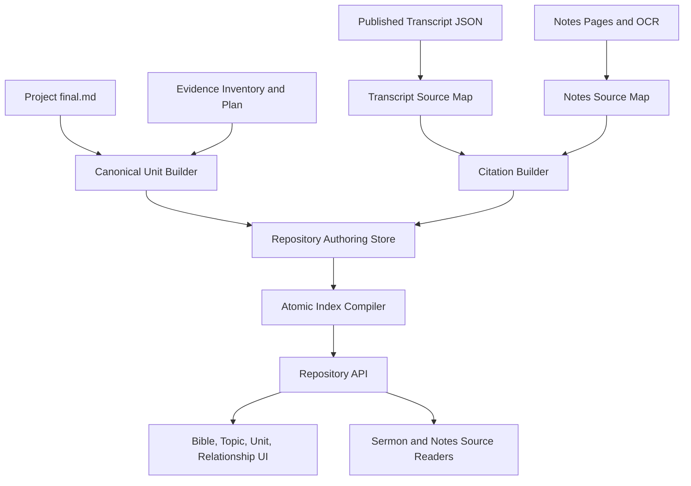

# Technical Specification: Exegesis and Topic Repository

## 1. Architecture Overview

The Exegesis and Topic Repository is a new read and editorial layer over the existing Notes to Sermon and Transcript to Manuscript workflows. It does not replace Series, Lecture, Project, `final.md`, Evidence Inventory, theological review, or sermon transcript storage.

The architecture separates four responsibilities:

1. **Production artifacts**: existing Project files used to create and review manuscripts.
2. **Repository authoring records**: reviewed canonical units, source documents, citations, and relationships.
3. **Compiled repository indexes**: atomically generated Bible, topic, lookup, and search projections.
4. **Source readers**: public or authenticated pages that resolve a citation and highlight original content.



## 2. Existing Components to Reuse

### Manuscript production

* `data/notes_to_surmon/{project_id}/final.md`
* `data/transcripts_to_manuscript/{project_id}/final.md`
* Project `meta.json`
* `evidence_inventory.json`
* `manuscript_plan.json`
* draft/final chunk metadata
* cross-lecture continuity proposals and integration applications

### Topic and Bible seed catalog

The existing `backend/pipeline/seed_catalog` output is the migration seed, not the final public store:

* `canonical_units.json`
* `bible_index.json`
* `topic_taxonomy.json`
* `topic_aliases.json`
* `duplicate_candidates.json`
* `review_needed.json`

Seed records remain `candidate_requires_review` until approved.

### Transcript source metadata

Published transcript JSON already contains:

* paragraph `index`;
* `start_index` and `end_index`;
* `start_time` and `end_time`;
* `start_timeline`; and
* paragraph text and type.

### Notes source metadata

Notes Projects already contain:

* ordered source pages in `meta.json.pages`;
* page markers in `unified_source.md` using `<!-- Page: ... -->`;
* per-page OCR Markdown under the shared raw OCR store; and
* source images served by the notes image endpoint.

### Public navigation and search

The existing `TopicNavigator`, topic index, `ScriptureMarkdown`, and sermon search are reused or adapted. The existing topic index currently links to manuscript heading anchors; repository citations add original-source links without removing manuscript links.

## 3. Storage Layout

The repository uses filesystem JSON as the reviewable source of truth and compiles an atomic read model for public requests.

```text
DATA_BASE_DIR/
  canonical_repository/
    repository_manifest.json
    units/
      {unit_id}.json
    sources/
      {source_id}.json
    source_maps/
      {source_id}.json
    citations/
      {citation_id}.json
    relationships/
      relationships.json
    reviews/
      unit_reviews.json
      citation_reviews.json
    builds/
      {build_id}/
        repository.sqlite3
        bible_index.json
        topic_index.json
        build_manifest.json
    active.json
```

`active.json` points to the last fully validated build. A compiler writes to a new build directory, validates it, and atomically replaces `active.json`. Failed builds remain diagnostic artifacts and never become public.

The initial implementation may serve small index responses directly from compiled JSON. Point lookups and filtered queries use `repository.sqlite3` so the design scales beyond the Matthew pilot.

## 4. Identifiers

IDs must not depend on editable titles.

### Canonical unit ID

* Existing reviewed seed IDs such as `CU-SEED-c6138b9864f3` are retained.
* New units use `CU-{stable-hash}` derived from the approved unit lineage, not the title alone.
* A title change does not change the ID.

### Source document ID

`SD-{stable-hash(source_type, origin_id)}`

Examples of `origin_id`:

* sermon transcript filename without `.json`;
* notes Project ID plus source page collection identity.

### Citation ID

`CIT-{random-or-content-independent-id}`

Citation IDs remain stable when an editor adjusts a locator. The citation record stores revision and source hashes.

### Relationship ID

`REL-{stable-hash(from_unit_id, to_unit_id, relationship_type)}`

## 5. Data Models

### 5.1. CanonicalUnit

```json
{
  "schema_version": 1,
  "unit_id": "CU-SEED-c74b23f20a7e",
  "title": "「人子」稱號、但以理書七章與耶穌的神性",
  "unit_type": "concept",
  "status": "published",
  "primary_bible_refs": [
    {"osis": "Matt.16.28-Matt.17.8", "display": "太 16:28–17:8"}
  ],
  "topic_assignments": [
    {
      "topic_ids": ["christology", "deity-of-christ"],
      "path": ["基督論", "耶穌的神性與權柄"],
      "role": "primary"
    }
  ],
  "manuscript": {
    "project_id": "17_章_登山變像_醫治鬼附之子",
    "project_type": "transcript",
    "heading_title": "二、「那個人子」所指的是誰？",
    "heading_anchor": "二-那個人子-所指的是誰",
    "final_sha256": "..."
  },
  "citation_ids": ["CIT-01J...", "CIT-01K..."],
  "relationship_ids": ["REL-..."],
  "aliases": ["人子", "那個人子"],
  "review": {
    "reviewed_at": "2026-08-04T00:00:00Z",
    "reviewed_by": "editor-id"
  }
}
```

Validation:

* `unit_type` is `passage` or `concept`.
* A passage unit requires at least one primary Bible reference.
* A published unit requires a resolvable manuscript section.
* A published unit requires at least one approved citation or an approved source exception with a reason.

### 5.2. SourceDocument

```json
{
  "schema_version": 1,
  "source_id": "SD-4ef32a...",
  "source_type": "sermon_transcript",
  "origin_id": "2016 NYSC 專題：馬太福音釋經（五）4",
  "title": "馬太福音釋經（五）第四講",
  "source_stage": "published",
  "public_url": "/resources/sermons/2016%20NYSC%20...4",
  "media": {
    "kind": "video",
    "url": "/web/video/2016%20NYSC%20...4.mp4"
  },
  "source_sha256": "...",
  "updated_at": "2026-08-04T00:00:00Z",
  "access": "authenticated_reader"
}
```

`source_type` values:

* `sermon_transcript`;
* `scanned_notes`; and
* future types may be added only with an implemented source reader.

Derived manuscripts and Google Docs are not original source types.

### 5.3. SourceMap

The source map connects Project-source line ranges used by Evidence Inventory to the original source representation.

Transcript entry:

```json
{
  "source_line_start": 3,
  "source_line_end": 3,
  "paragraph_key": "31",
  "paragraph_position": 2,
  "paragraph_text_sha256": "...",
  "start_time": 99.0,
  "end_time": 236.0,
  "start_index": 31,
  "end_index": 103
}
```

Notes entry:

```json
{
  "source_line_start": 8,
  "source_line_end": 22,
  "page_file": "notes_main/chapter16/22.jpg",
  "page_position": 1,
  "ocr_line_start": 1,
  "ocr_line_end": 15,
  "page_ocr_sha256": "..."
}
```

Source maps are generated when a source is imported or rebuilt and are versioned by both Unified Input and original source checksums.

### 5.4. Citation

```json
{
  "schema_version": 1,
  "citation_id": "CIT-01J...",
  "source_id": "SD-4ef32a...",
  "source_sha256": "...",
  "locator": {
    "kind": "transcript",
    "paragraph_keys": ["31"],
    "highlight_text": "教授早年接受 Scofield 体系，后来转向专攻释经。",
    "highlight_text_sha256": "...",
    "occurrence": 1,
    "char_start": 120,
    "char_end": 168,
    "start_time": 99.0,
    "end_time": 236.0
  },
  "evidence_ids": ["E003", "E004"],
  "role": "historical_background",
  "supports_claim": "教授由 Scofield 体系转向以释经为根基的神学训练。",
  "status": "approved",
  "revision": 2,
  "reviewed_at": "2026-08-04T00:00:00Z",
  "reviewed_by": "editor-id"
}
```

`locator.kind` is `transcript` or `notes`.

Notes locator fields:

* `page_file`;
* `page_position`;
* `highlight_text`;
* `occurrence`;
* `ocr_char_start` and `ocr_char_end`; and
* optional future `image_regions` containing normalized bounding boxes.

Citation status values:

* `candidate`;
* `approved`;
* `rejected`;
* `stale`;
* `unresolved`; and
* `restricted`.

### 5.5. UnitCitationLink

Citation IDs may appear directly on the unit for simple lookup. The compiled database also stores an explicit many-to-many table:

```json
{
  "unit_id": "CU-SEED-c74b23f20a7e",
  "citation_id": "CIT-01J...",
  "display_order": 1,
  "role": "primary_evidence",
  "claim_anchor": null
}
```

`claim_anchor` is optional in the initial release. The required UI is a unit-level Sources panel. Future inline manuscript citation markers may reference the same citation IDs.

### 5.6. UnitRelationship

```json
{
  "relationship_id": "REL-...",
  "from_unit_id": "CU-passage-...",
  "to_unit_id": "CU-topic-...",
  "relationship_type": "related_topic",
  "status": "approved",
  "reason": "The passage contributes the primary narrative example for the topic."
}
```

## 6. Evidence and Citation Pipeline

### 6.1. New evidence schema requirement

The Evidence Inventory schema is extended with an exact source anchor:

```json
{
  "verbatim_source_excerpt": "an exact substring copied from the source",
  "source_ranges": [{"start_line": 3, "end_line": 3}]
}
```

The excerpt is not necessarily displayed as a quotation in the manuscript. It exists to identify the source fragment. Validation rejects an excerpt that is not an exact substring of the declared source range.

For existing Evidence Inventories without this field, migration initially uses the complete mapped paragraph or OCR range and may run an assisted exact-substring proposal. Every assisted proposal remains `candidate` until reviewed.

### 6.2. Transcript source-map generation

When a transcript is imported:

1. resolve the preferred source stage (`published`, `reviewed`, then `raw`);
2. retain every non-comment transcript paragraph and its original metadata;
3. create `unified_source.md` as today;
4. create a deterministic mapping from Unified Input line numbers to transcript paragraph keys;
5. record source and Unified Input hashes; and
6. save the source map beside repository source metadata.

Existing transcript Projects are migrated by aligning normalized Unified Input paragraphs with normalized transcript paragraphs in order. Ambiguous or missing matches are reported and never silently guessed.

### 6.3. Notes source-map generation

When notes pages are assembled:

1. parse each `<!-- Page: ... -->` marker;
2. map subsequent Unified Input lines to that page until the next marker;
3. align the page block with its raw OCR Markdown;
4. store page and OCR checksums; and
5. report edited text that can no longer be mapped exactly.

### 6.4. Citation building

For each canonical unit:

1. load the unit's evidence IDs;
2. collect their source ranges and exact source excerpts;
3. resolve ranges through the source map;
4. merge adjacent fragments only when they belong to the same source paragraph or page and support the same claim;
5. create candidate citations;
6. validate exact text and timing/page identity; and
7. require editor approval before public publication.

### 6.5. Cross-lecture lineage

Continuity decisions, Series Draft operations, and Integration Application patches must copy:

* source document ID;
* evidence IDs;
* source ranges;
* exact source excerpts; and
* any existing citation IDs.

An operation that updates manuscript prose but loses source lineage fails validation.

## 7. Repository Compiler

The compiler consumes reviewed authoring records and produces:

* canonical unit rows;
* Bible reference rows;
* topic assignment rows;
* unit relationship rows;
* source document rows;
* citation rows;
* unit-citation link rows;
* Bible index JSON;
* topic index JSON; and
* a build manifest.

### Build validation

Before activation the compiler verifies:

* unique IDs;
* referenced units, sources, and citations exist;
* manuscript project and heading anchors resolve;
* source hashes match for approved citations;
* highlighted text resolves exactly;
* passage units have primary references;
* topic paths exist in the reviewed taxonomy;
* published units satisfy source requirements; and
* no public record points to a restricted source.

The build manifest includes counts for units, passage units, topic units, relationships, citations, stale citations, unresolved citations, and source documents, plus every input checksum.

## 8. SQLite Read Model

Recommended tables:

```text
repository_builds
canonical_units
unit_manuscripts
bible_references
unit_bible_references
topics
topic_aliases
unit_topics
unit_relationships
source_documents
source_fragments
citations
unit_citations
```

Required indexes:

* `canonical_units(status, unit_type)`;
* `unit_bible_references(book_order, chapter_start, verse_start)`;
* `unit_topics(topic_id, role)`;
* `unit_relationships(from_unit_id)` and `unit_relationships(to_unit_id)`;
* `citations(source_id, status)`;
* `unit_citations(unit_id, display_order)`; and
* full-text search over unit title, aliases, manuscript text, arguments, and source title.

The repository compiler may reuse parsing and OSIS normalization from sermon search, but the authoring records remain independent of the search index so search reindexing cannot alter editorial decisions.

## 9. API Design

All browser-facing calls use the Next.js API proxy. Paths below describe backend FastAPI routes.

### 9.1. Public repository endpoints

#### `GET /canonical-repository/status`

Returns active build ID, generated time, unit counts, source counts, and availability.

#### `GET /canonical-repository/bible-index`

Returns books, chapters, passage units, empty-state metadata, and canonical ordering.

Optional filters:

* `book`;
* `chapter`;
* `series_id`; and
* `status` for authenticated editors.

#### `GET /canonical-repository/topic-index`

Returns the reviewed topic tree, aliases, and unit summaries.

#### `GET /canonical-repository/units/{unit_id}`

Returns:

* unit metadata;
* manuscript Markdown;
* Bible and topic assignments;
* approved citation summaries;
* direct relationships; and
* source-access state.

#### `GET /canonical-repository/citations/{citation_id}`

Resolves the citation against the active source version and returns:

* source metadata;
* locator;
* exact highlight;
* bounded context;
* media timing or notes page;
* deep-link URL; and
* `valid`, `stale`, `restricted`, or `unresolved` state.

The endpoint never silently substitutes a different fragment.

#### `GET /canonical-repository/units/{unit_id}/relationships`

Returns only the selected unit and direct related units/sources for local graph rendering.

### 9.2. Admin endpoints

#### `POST /admin/canonical-repository/source-maps/rebuild`

Payload:

```json
{
  "project_ids": [],
  "source_ids": [],
  "force": false
}
```

Creates or refreshes source maps and reports exact, ambiguous, missing, and stale mappings.

#### `POST /admin/canonical-repository/units/import-candidates`

Imports candidate canonical units from a seed catalog or checked-in Project lineage. It never publishes them.

#### `PATCH /admin/canonical-repository/units/{unit_id}`

Updates reviewed title, type, references, topic assignments, status, relationships, and manuscript mapping. Uses optimistic concurrency with `revision` or `If-Match`.

#### `POST /admin/canonical-repository/units/{unit_id}/citations`

Creates a candidate citation from evidence IDs and a selected source range.

#### `PATCH /admin/canonical-repository/citations/{citation_id}`

Adjusts locator, exact highlight, role, supported claim, review status, and revision.

#### `POST /admin/canonical-repository/citations/{citation_id}/remap`

Attempts deterministic remapping after a source version change. Ambiguous results remain unapproved.

#### `POST /admin/canonical-repository/build`

Queues a complete validated build. Only one build runs at a time.

#### `GET /admin/canonical-repository/build`

Returns `idle`, `queued`, `running`, `completed`, or `failed`, plus validation counts and messages.

#### `POST /admin/canonical-repository/units/{unit_id}/publish`

Validates the unit and its citations, records the editorial decision, and queues or requires a repository build. It does not change Project `final.md`.

## 10. Frontend Design

### 10.1. Routes

Proposed routes:

```text
/resources/wang-repository
/resources/wang-repository/units/{unitId}
/resources/sermons/{sermonId}?citation={citationId}
/resources/notes-sources/{sourceId}?citation={citationId}

/admin/canonical-repository
/admin/canonical-repository/units/{unitId}
/admin/canonical-repository/citations/{citationId}
```

The public repository route name may be changed before implementation; stable IDs and query behavior must not depend on the localized page title.

### 10.2. Reusable components

Recommended components:

* `RepositoryNavigator`
* `BibleIndexView`
* `TopicIndexView`
* `CanonicalUnitReader`
* `UnitSourcesPanel`
* `SourceCitationCard`
* `SourceCitationDrawer`
* `UnitRelationshipView`
* `TranscriptSourceReader`
* `NotesSourceReader`
* `CitationReviewEditor`

### 10.3. Transcript rendering

`SermonDetailView` currently flattens transcript paragraphs into one Markdown string. It must retain segment metadata and render each paragraph inside a stable container such as:

```html
<section id="sermon-segment-31" data-paragraph-key="31">...</section>
```

On citation load:

1. request the citation resolver;
2. find the target segment;
3. verify citation state;
4. render the exact range with `<mark>`;
5. scroll and focus the segment; and
6. seek the media player to `start_time`.

Highlighting is performed from resolved citation data, not directly from untrusted query-string offsets.

### 10.4. Notes rendering

The notes source reader displays:

* the source image endpoint for the selected page;
* raw OCR Markdown rendered as text;
* exact `<mark>` highlighting in the OCR text; and
* adjacent-page navigation.

Future `image_regions` are normalized coordinates between 0 and 1 and render as accessible overlays on the source image.

### 10.5. Relationship visualization

The API returns a bounded one-hop graph for the selected unit. The frontend limits node count and groups excess sources by source document. It must not fetch or lay out the complete repository graph by default.

## 11. Source Resolution and Highlighting

### Exact resolution

When `source_sha256` matches:

1. locate the recorded paragraph or notes page;
2. confirm `highlight_text` at the stored occurrence or offsets;
3. return bounded context; and
4. mark the result `valid`.

### Source changed

When the source hash differs:

1. attempt the same stable paragraph key or page file;
2. search for the exact highlight string;
3. if exactly one match exists, return a remap proposal to editors;
4. if no or multiple matches exist, mark `stale` or `unresolved`; and
5. do not change the approved citation automatically.

### Context limits

Public citation responses return the complete cited paragraph plus at most one adjacent paragraph on each side by default. The full source remains available through its normal authenticated page.

## 12. Authentication and Authorization

* Published canonical units may be public or follow the site's existing manuscript access policy.
* Public citation resolution requires an approved citation and an allowed source stage.
* Raw and reviewed-only sermon transcripts are editor-only.
* Notes images follow the same access policy as their associated Project or repository unit.
* Admin mutations require `editor` or `admin` role.
* The API rejects path traversal and never accepts filesystem paths from public requests.

## 13. State and Invalidation Rules

### Manuscript changed

If a referenced `final.md` checksum changes:

* the unit's manuscript mapping becomes stale;
* repository publication remains on the last active build;
* editors see a rebuild/review warning; and
* no canonical unit text is overwritten automatically.

### Source changed

If a source checksum changes:

* affected citations become stale in the authoring view;
* the active build continues to serve the last valid approved snapshot until a new build is activated;
* new builds reject stale required citations; and
* remapping requires validation and, when ambiguous, editor approval.

### Taxonomy changed

Topic assignments whose IDs no longer exist become invalid. Alias changes do not change unit IDs.

### Relationship changed

Relationship edits affect only the repository authoring records and compiled navigation; they do not edit manuscript Markdown.

## 14. Observability

Structured build and source-map logs include:

* job ID and stage;
* source documents scanned;
* exact, ambiguous, missing, and stale source mappings;
* candidate and approved citation counts;
* unit validation failures;
* compiled row counts;
* input and output hashes; and
* activation result.

Admin UI summaries must link every failure to the affected unit, citation, Project, or source.

## 15. Testing Strategy

### Unit tests

* stable ID generation;
* transcript line-to-paragraph mapping;
* notes line-to-page mapping;
* exact highlight and occurrence resolution;
* citation stale detection;
* canonical Bible sorting;
* topic alias and multi-path assignment;
* publication gate validation; and
* atomic build activation.

### API tests

* public unit and index responses;
* citation access by source stage and role;
* stale and unresolved citation responses;
* optimistic concurrency on editorial updates;
* concurrent build rejection; and
* path traversal rejection.

### Frontend tests

* Bible and topic views link to the same unit;
* citation drawer displays exact excerpt and context;
* sermon page scrolls, highlights, and seeks correctly;
* notes page opens the correct page and highlights OCR text;
* keyboard focus reaches highlighted content;
* mobile source sheet works without horizontal overflow; and
* stale citations display a warning rather than a misleading highlight.

### Migration tests

Use the three-unit pilot:

* Transfiguration passage unit;
* `小信` cross-passage topic unit; and
* dispensationalism/Scofield multi-source topic unit.

The Scofield test must confirm that one manuscript unit retains separate third- and fourth-lecture citations, each opening its own highlighted transcript and time range.

## 16. Implementation Phases

### Phase 1: Provenance foundation

* Implement repository models and filesystem store.
* Generate transcript and notes source maps.
* Extend Evidence Inventory with exact source excerpts.
* Implement citation builder and validator.

### Phase 2: Source readers

* Preserve paragraph metadata in sermon rendering.
* Add citation resolver and transcript highlighting.
* Connect media seeking.
* Add notes source reader and OCR highlighting.

### Phase 3: Repository authoring and public UI

* Import candidate seed units.
* Implement unit and citation review.
* Implement Bible, topic, unit, and local relationship pages.
* Implement validated atomic builds.

### Phase 4: Workflow integration

* Carry citation lineage through generation and cross-lecture integration.
* Connect Check In and repository refresh without coupling their writes.
* Add repository source links to sermon search results.

### Phase 5: Migration

* Complete the three-unit pilot.
* Migrate reviewed Matthew units.
* Resolve duplicate and low-confidence candidates.
* Expand incrementally to the full sermon corpus.

## 17. Deployment and Rollback

* Repository schema version is recorded in every authoring record and build manifest.
* New builds are created beside the active build.
* Activation is a single atomic pointer update.
* Rollback changes `active.json` to the previous validated build.
* Project manuscripts, transcripts, notes images, and earlier builds are not deleted during activation or rollback.

## 18. Technical Acceptance Criteria

* Every published unit resolves to exactly one authoritative manuscript section.
* Every required approved citation resolves to exact original text at build time.
* Passage and topic units use the same citation resolver.
* Transcript citations expose valid segment identity and timing when available.
* Notes citations expose valid page identity and highlighted OCR text.
* A source hash mismatch cannot silently produce a valid response.
* A topic unit can retain citations from multiple lectures without duplicating manuscript prose.
* Cross-lecture integration preserves evidence and citation lineage.
* Repository builds are atomic and rollback-capable.
* Existing Project generation, audit, Check In, and `final.md` behavior remain unchanged unless explicitly extended by this specification.

## 19. Implementation Status

Phase 1 foundation is now represented in code under `backend/api/canonical_repository`:

* typed canonical unit, source, source-map, citation, relationship, and resolution records;
* atomic JSON authoring storage;
* deterministic transcript paragraph/line/time mapping and notes page/OCR mapping;
* exact-substring citation creation with stale-source detection;
* public lookup and admin rebuild/edit/build endpoints;
* atomic compiled Bible/topic JSON and SQLite read models; and
* automatic best-effort source-map refresh when a transcript is imported or notes Unified Input is rebuilt.
* an admin preview list at `/admin/canonical-repository`, with candidate-only seed import, passage/topic views, status badges, filtering, source counts, and manuscript Project links.
* a unit review page for title/type/reference/topic editing, citation approval, deterministic source-map citation creation, publish validation, and preview-before-apply merges;
* a public Bible/topic repository shell that reads only an activated build and never exposes candidates;
* a notes source reader showing the exact scanned page beside highlighted OCR, with stale-source warnings and authenticated-reader gating;
* exact `verbatim_source_excerpt` generation and validation in new Transcript Evidence Inventories, with safe full-range compatibility for legacy inventories; and
* cross-lecture integration patches that retain evidence IDs, source ranges, verbatim excerpts, source document IDs, and citation IDs.

The Matthew pilot migration is implemented by `backend/pipeline/canonical_repository_pilot.py`. It attaches multi-lecture citations to the Amen, dispensationalism, and Transfiguration units, and creates a separate cross-passage `小信` concept unit related to—rather than replacing—the individual passage units.

The sermon reader accepts a citation deep link, highlights the exact original excerpt, scrolls it into view, and seeks authenticated audio/video to the citation start time. The remaining release gate is editorial: pilot citations must be reviewed and approved, units moved to `published`, and an active build created from the admin repository page. Wider corpus migration remains incremental because notes without Evidence Inventory ranges require human source selection rather than guessed provenance.
