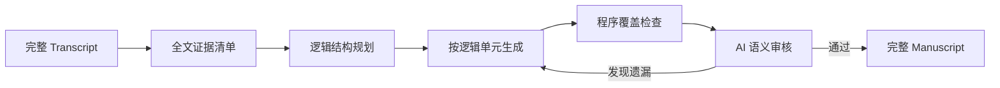

# Functional Specification: Notes to Sermon Transformation System

## 1. Introduction
The "Notes to Sermon" system is a specialized AI-powered workflow designed to transform raw, handwritten, or structured lecture notes into fully developed spoken manuscripts (sermons). It leverages a team of specialized AI agents to ensure theological accuracy, exegetical depth, and rhetorical flow.

The system also supports a separate **Transcript to Manuscript** transaction type for Dr. Wang's recorded lectures. Although both transaction types share the same Series → Lecture → Project presentation, their prompts, generation stages, storage roots, and review gates are intentionally different.

## 2. User Personas
*   **The Preacher/Pastor**: The primary user. They provide raw notes and expect a draft that sounds like them—conversational, passionate, and doctrinally sound—without needing to write every word from scratch.
*   **The Editor**: A staff member who reviews the AI generation, manages project metadata, and refines the final text.

## 3. Core Features

### 3.1. Project & Series Management
*   **Series Hierarchy**: Projects (individual sermons/chapters) are organized into "Lectures" and "Series".
*   **Contextual Awareness**: The system understands the broader theme of the Series and the specific focus of the current Lecture when generating content.

### 3.2. Multi-Agent Generation Workflow
The generation process is not a "black box" but a visible collaboration between distinct AI personas:
1.  **Exegetical Scholar**:
    *   **Input**: Raw verses and notes.
    *   **Action**: Conducts deep philological research (Greek/Hebrew word studies).
    *   **Output**: Detailed "Exegetical Notes" artifact.
2.  **Theologian**:
    *   **Input**: Source notes + Exegetical findings.
    *   **Action**: Checks for doctrinal consistency and aligns with the Series theme.
    *   **Output**: "Theological Analysis" artifact.
3.  **Illustrator**:
    *   **Input**: Core message and theological points.
    *   **Action**: Brainstorms 3-5 vivid, modern metaphors or stories.
    *   **Output**: "Illustration Ideas" artifact.
4.  **Architect (Structuring Specialist)**:
    *   **Input**: Enriched notes.
    *   **Action**: Intelligently splits the content into "Macro-Beats" (logical sections).
    *   **Output**: Visualized "Beat Cards" showing the sermon's structure.
5.  **Homiletician (Drafter)**:
    *   **Input**: All previous research + specific beat.
    *   **Action**: Writes the *spoken* manuscript for one beat at a time.
    *   **Goal**: "Speak to the people," avoiding bullet points or academic summary.
6.  **Critic**:
    *   **Input**: Drafted beat.
    *   **Action**: Reviews against strict criteria (No "In summary", no bullet points).
    *   **outcome**: PASS (proceed) or FAIL (rewrite request).

### 3.3. Live Generation Dashboard
A real-time interface (`/generation`) allowing users to:
*   **Monitor Progress**: See which agent is currently active via status indicators.
*   **View Artifacts**: Click on agent icons (when green) to read their specific outputs in a rich Markdown modal.
*   **Inspect Logs**: Watch a live stream of agent "thoughts" and system actions.

### 3.4. Output Visualization
*   **Rich Markdown**: All agent outputs differ from standard text; they support:
    *   **Scripture Tooltips**: Hovering over references (e.g., `John 3:16`) shows the full text.
    *   **Collapsible Alerts**: Beats and notes are wrapped in collapsible sections (`> [!NOTE]`) for better readability.

### 3.5. Reliability Features
*   **Resumability**: If the process stops (e.g., browser close), it resumes from the last completed agent step.
*   **Restart Capability**: A "Restart" button allows users to wipe progress and re-run the workflow from scratch (useful for testing different prompts).

### 3.6. Transcript to Manuscript Workflow

#### Project organization
*   One reviewed sermon transcript corresponds to one manuscript Project.
*   A Project may be assigned to an existing Lecture and Series; no additional hierarchy is required.
*   Transcript projects are displayed alongside notes projects in the same Series administration and public manuscript presentation.

#### Generation pipeline
The transcript workflow operates on the complete transcript rather than first dividing it into arbitrary text chunks:

1. **Full-transcript evidence inventory**: records questions, direct answers, Scripture citations, reasoning, theology, applications, appendices, and exact source ranges.
2. **Logical manuscript plan**: reorganizes Dr. Wang's non-linear teaching into question → answer → supporting evidence order while preserving the relationship to the original transcript.
3. **Manuscript generation**: writes each logical unit in calm, readable prose without flattening Scripture evidence or adding unsupported answers.
4. **Whole-document Coverage Audit**: compares the complete manuscript with the evidence inventory and transcript.

There is no user-facing Unit Split stage. Generated units are implementation artifacts used for resumability and lineage, not separate Projects.

#### Manuscript format
Every logical unit follows the established notes-to-manuscript Markdown conventions and uses only the categories that have substantive content:

* `### 釋經`
* `### 神學意義`
* `### 生活應用`
* `### 附錄`

AI-created subheadings are allowed to repair the loose structure of the spoken lecture. Duplicate category headings are not allowed.

#### Editorial fidelity
* Dr. Wang's emphatic spoken tone is normalized into calm prose, but his actual claims and cited biblical evidence must remain identifiable.
* The editor may reorder material for comprehension, but may not invent an answer Dr. Wang did not give.
* When a question is only partially answered, the manuscript explicitly narrows the answered question and records the unanswered portion without supplying a new answer.
* Human-edited draft chunks are authoritative. Coverage Audit is read-only and must never rebuild the draft from older generated-unit artifacts.

### 3.7. Transcript Review and Check In

Transcript projects use two distinct review gates:

1. **Coverage Audit (required pass)**
   * Runs against the whole draft.
   * Checks omissions, unsupported additions, unanswered questions, evidence classification, logic gaps, and required Markdown structure.
   * Editing a draft chunk marks the Coverage Audit stale; it must be rerun and pass before final review begins.

2. **Theological Boundary Review (required completion)**
   * Begins after the editor selects **Start Theological Review**, which creates the final-text review copy.
   * Reviews every final Review Chunk for high-confidence exegetical errors, factual errors, overstatement, or major structural problems.
   * Findings remain visible for the editor's judgment. Findings do not automatically prevent Check In.
   * Editing a final chunk invalidates only that chunk's theological review.

**Check In is enabled only when:**

* Coverage Audit has passed and is not stale;
* the final review copy exists; and
* every final Review Chunk has completed theological review without an audit execution error.

Fidelity Audit is hidden for transcript projects because whole-document Coverage Audit already performs the source-fidelity check. The existing Fidelity Audit remains available for notes projects.

## 4. User Stories
*   *As a Pastor, I want to see the "Exegetical Notes" before the draft is written, so I can trust the biblical foundation.*
*   *As an Editor, I want to restart the generation if the "Architect" splits the beats incorrectly, so I can get a better structure.*
*   *As a User, I want to see a progress bar for each beat being drafted, so I know how long the remaining process will take.*
*   *As an Editor, I want a transcript manuscript to preserve every cited biblical argument while presenting Dr. Wang's teaching in a logical order.*
*   *As an Editor, I want theological findings to remain visible without allowing the AI to make the final editorial decision for me.*
*   *As an Editor, I want saved manual changes to remain authoritative when I rerun an audit.*

## 5. Non-Functional Requirements
*   **Latency**: The full workflow can take 2-5 minutes depending on note length; the UI must handle this without timing out (using async polling).
*   **Persistence**: All state is saved to disk (`json` files), ensuring no work is lost on server restart.
*   **Audit Safety**: Audit-only operations are read-only with respect to manuscript text.
*   **Traceability**: Transcript evidence and planned units retain source line ranges and evidence IDs.
