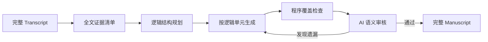
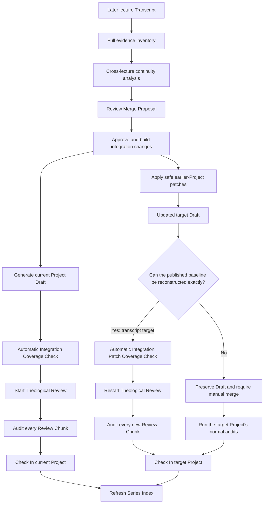

# Functional Specification: Notes to Sermon Transformation System

## 1. Introduction
The "Notes to Sermon" system is a specialized AI-powered workflow designed to transform raw, handwritten, or structured lecture notes into fully developed spoken manuscripts (sermons). It leverages a team of specialized AI agents to ensure theological accuracy, exegetical depth, and rhetorical flow.

The system also supports a separate **Transcript to Manuscript** transaction type for Dr. Wang's recorded lectures. Although both transaction types share the same Series → Lecture → Project presentation, their prompts, generation stages, storage roots, and review gates are intentionally different.

## 2. User Personas
*   **The Preacher/Pastor**: The primary user. They provide raw notes and expect a draft that sounds like them—conversational, passionate, and doctrinally sound—without needing to write every word from scratch.
*   **The Editor**: A staff member who reviews the AI generation, manages project metadata, and refines the final text.

## 3. Core Features

### 3.1. Project & Series Management
*   **Series Hierarchy**: Projects (individual sermons/chapters) are organized into "Lectures" and "Series".
*   **Contextual Awareness**: The system understands the broader theme of the Series and the specific focus of the current Lecture when generating content.

### 3.2. Multi-Agent Generation Workflow
The generation process is not a "black box" but a visible collaboration between distinct AI personas:
1.  **Exegetical Scholar**:
    *   **Input**: Raw verses and notes.
    *   **Action**: Conducts deep philological research (Greek/Hebrew word studies).
    *   **Output**: Detailed "Exegetical Notes" artifact.
2.  **Theologian**:
    *   **Input**: Source notes + Exegetical findings.
    *   **Action**: Checks for doctrinal consistency and aligns with the Series theme.
    *   **Output**: "Theological Analysis" artifact.
3.  **Illustrator**:
    *   **Input**: Core message and theological points.
    *   **Action**: Brainstorms 3-5 vivid, modern metaphors or stories.
    *   **Output**: "Illustration Ideas" artifact.
4.  **Architect (Structuring Specialist)**:
    *   **Input**: Enriched notes.
    *   **Action**: Intelligently splits the content into "Macro-Beats" (logical sections).
    *   **Output**: Visualized "Beat Cards" showing the sermon's structure.
5.  **Homiletician (Drafter)**:
    *   **Input**: All previous research + specific beat.
    *   **Action**: Writes the *spoken* manuscript for one beat at a time.
    *   **Goal**: "Speak to the people," avoiding bullet points or academic summary.
6.  **Critic**:
    *   **Input**: Drafted beat.
    *   **Action**: Reviews against strict criteria (No "In summary", no bullet points).
    *   **outcome**: PASS (proceed) or FAIL (rewrite request).

### 3.3. Live Generation Dashboard
A real-time interface (`/generation`) allowing users to:
*   **Monitor Progress**: See which agent is currently active via status indicators.
*   **View Artifacts**: Click on agent icons (when green) to read their specific outputs in a rich Markdown modal.
*   **Inspect Logs**: Watch a live stream of agent "thoughts" and system actions.

### 3.4. Output Visualization
*   **Rich Markdown**: All agent outputs differ from standard text; they support:
    *   **Scripture Tooltips**: Hovering over references (e.g., `John 3:16`) shows the full text.
    *   **Collapsible Alerts**: Beats and notes are wrapped in collapsible sections (`> [!NOTE]`) for better readability.

### 3.5. Reliability Features
*   **Resumability**: If the process stops (e.g., browser close), it resumes from the last completed agent step.
*   **Restart Capability**: A "Restart" button allows users to wipe progress and re-run the workflow from scratch (useful for testing different prompts).

### 3.6. Transcript to Manuscript Workflow

#### Project organization
*   One reviewed sermon transcript corresponds to one manuscript Project.
*   A Project may be assigned to an existing Lecture and Series; no additional hierarchy is required.
*   Transcript projects are displayed alongside notes projects in the same Series administration and public manuscript presentation.

#### Linking and importing the sermon transcript

When creating a Transcript Project, or later from **Edit Project Info**, the editor may enter a **Sermon Transcript ID**. The ID is the transcript filename without the `.json` suffix, for example `2016 NYSC 專題：馬太福音釋經（五）4`.

Linking and importing are separate actions:

* **Save** records the link without changing Unified Input.
* **Import to Unified Input** loads the linked transcript into `unified_source.md`.
* During Project creation, the editor may choose to link and import in one step.
* Source resolution prefers Published, then Reviewed, then Raw (`script_published` → `script_review` → `script_patched`).
* An import never silently replaces meaningful Unified Input. The editor must explicitly confirm replacement.
* Importing a new source invalidates prior Coverage and theological-review status; the manuscript pipeline must be rerun against the new source.

#### Generation pipeline
The transcript workflow operates on the complete transcript rather than first dividing it into arbitrary text chunks:

1. **Full-transcript evidence inventory**: records questions, direct answers, Scripture citations, reasoning, theology, applications, appendices, and exact source ranges.
2. **Logical manuscript plan**: reorganizes Dr. Wang's non-linear teaching into question → answer → supporting evidence order while preserving the relationship to the original transcript. It distinguishes reader-facing main units from supporting appendices and records which unit each appendix expands.
3. **Manuscript generation**: writes each logical unit in calm, readable prose without flattening Scripture evidence or adding unsupported answers.
4. **Whole-document Coverage Audit**: compares the complete manuscript with the evidence inventory and transcript.

#### Scripture citation presentation

Scripture evidence must retain both its argumentative role and its intended presentation. The evidence inventory distinguishes:

* **Direct quotation**: show the compact reference (for example, `太 16:25`), place the transcript's exact biblical wording in a Markdown blockquote, and explain its evidential role in a separate paragraph.
* **Paraphrase**: keep the paraphrase in prose, identify it as a paraphrase, and retain the reference; do not turn it into a quotation.
* **Reference only**: retain the reference and its role without inventing biblical wording absent from the transcript.

This follows the established notes-to-manuscript reading pattern of **reference → quoted Scripture → explanation**. Generation performs a deterministic check before accepting each unit. Coverage Audit repeats the check against the current human-edited Draft and lists the affected unit, Evidence ID, problem, and recommended correction. Coverage Audit is read-only and never applies the correction automatically.

For an already reviewed manuscript, a verified **presentation- or navigation-only migration** may retain its existing Coverage pass. This exception covers Scripture presentation changes described above, consecutive unit numbering, and contextual links to already-existing appendices. It must not add or remove an argument, change an Evidence disposition, rewrite an interpretation, or alter the four-way classification. If any substantive content changes, Coverage becomes stale under the normal rule.

The migration must update both **Generated Draft** and **Master Text** so that the editor does not review two different manuscripts. Because Master Text and its Review Chunks changed, the theological-review results are reset even though Coverage remains valid.

There is no user-facing Unit Split stage. Generated units are implementation artifacts used for resumability and lineage, not separate Projects.

#### Manuscript format
Every logical unit follows the established notes-to-manuscript Markdown conventions and uses only the categories that have substantive content:

* Main units use consecutive Chinese numbering: `## 一、單元標題`, `## 二、單元標題`, and so on.
* Supporting appendix units use a separate sequence: `## 附錄一：附錄標題`, `## 附錄二：附錄標題`, and so on.
* Every appendix must support at least one main or earlier unit. At the most relevant sentence in that unit, the manuscript explains the relationship and provides a clickable internal Markdown link to the appendix, for example `[附錄一：啟示錄文體](#附錄一-啟示錄文體)`. An isolated list of appendix links at the end of the unit is not sufficient.

* `### 釋經`
* `### 神學意義`
* `### 生活應用`
* `### 附錄`

AI-created subheadings are allowed to repair the loose structure of the spoken lecture. Duplicate category headings are not allowed.

#### Editorial fidelity
* Dr. Wang's emphatic spoken tone is normalized into calm prose, but his actual claims and cited biblical evidence must remain identifiable.
* The editor may reorder material for comprehension, but may not invent an answer Dr. Wang did not give.
* When a question is only partially answered, the manuscript explicitly narrows the answered question and records the unanswered portion without supplying a new answer.
* Human-edited draft chunks are authoritative. Coverage Audit is read-only and must never rebuild the draft from older generated-unit artifacts.

### 3.7. Transcript Review and Check In

Transcript projects use two distinct review gates:

1. **Coverage Audit (required pass)**
   * Runs against the whole draft.
   * Checks omissions, unsupported additions, unanswered questions, evidence classification, logic gaps, and required Markdown structure.
   * Editing a draft chunk marks the Coverage Audit stale; it must be rerun and pass before final review begins.

2. **Theological Boundary Review (required completion)**
   * Begins after the editor selects **Start Theological Review**, which creates the final-text review copy.
   * Reviews every final Review Chunk for high-confidence exegetical errors, factual errors, overstatement, or major structural problems.
   * Findings remain visible for the editor's judgment. Findings do not automatically prevent Check In.
   * Editing a final chunk invalidates only that chunk's theological review.

**Check In is enabled only when:**

* Coverage Audit has passed and is not stale;
* the final review copy exists; and
* every final Review Chunk has completed theological review without an audit execution error.

Fidelity Audit is hidden for transcript projects because whole-document Coverage Audit already performs the source-fidelity check. The existing Fidelity Audit remains available for notes projects.

### 3.8. Publication and Series Index Refresh

Checking in a manuscript publishes `final.md`, but chapter/topic navigation and manuscript search are derived indexes and must be refreshed after manuscript content changes.

The Series administration page provides a **Refresh Index** action. It:

1. extracts or reuses cached chapter and theological-topic entries for the selected Series;
2. merges those entries into the global topic index; and
3. rebuilds manuscript search while preserving semantic embeddings when they are already enabled.

The action runs in the background and displays queued, running, completed, or failed status. Only one global refresh may run at a time because the topic and search indexes are shared resources.

Series may contain both notes and transcript projects. Index discovery therefore filters on each Project's `project_type`, not on the Series transaction type.

#### Scripture scope for transcript projects

`bible_verse` is optional project metadata. It may provide an editor-supplied scope hint, but transcript indexing does not require it and does not infer scope from the Project title.

When a transcript has no explicit scope, the topic extractor derives passage topics from the manuscript content itself:

* sustained explanation of a Matthew passage may become a `passage` topic;
* supporting references from Matthew or other biblical books remain cross-references;
* editorial titles are not treated as biblical evidence; and
* concept-only material remains searchable without being assigned to a chapter.

Topic-cache reuse includes scripture-scope state. Changing or removing an explicit scope causes the transcript to be re-extracted instead of reusing an incompatible cached result.

### 3.9. Cross-Lecture Continuity and Series Manuscript

A transcript Project remains the source, evidence, and audit unit. The final reader-facing manuscript is a Series-level editorial work and is not constrained by lecture boundaries.

Before integrating a later transcript, the system compares its evidence inventory with earlier checked-in manuscripts in the same Series order. Comparison is based on manuscript content, Scripture references, and argument function; Project titles are not evidence of duplication.

Each current evidence item must receive exactly one editorial disposition:

* `new`: create a new logical unit;
* `duplicate`: omit the repeated expression and point to the existing canonical location;
* `extension`: merge the new Scripture, qualification, example, or reasoning into the existing unit;
* `correction`: update the existing unit while preserving the fact and substance of the correction;
* `related_qa`: place the question and actual answer at the appropriate exegetical, theological, or application location;
* `tangential_qa`: preserve substantive but off-mainline material in the appendix;
* `non_substantive`: omit classroom logistics, banter, or repetition with no new substance.

Coverage at this layer means that every evidence item is **accounted for**, not that every repeated statement must be written again. An omitted item must retain a reason and, for duplication, the earlier manuscript location that already represents it.

**跨讲整合** first produces a Merge Proposal for editorial review and does not modify any manuscript. After the editor approves that proposal, **批准并建立 Series Draft** applies only the approved dispositions to a separate Series-level review draft:

* unchanged canonical units are copied without regeneration;
* extensions and corrections update their matched canonical unit;
* new material creates a new main unit;
* substantive tangents become appendix units;
* exact duplicates and non-substantive classroom material are recorded in the evidence registry without being repeated in the prose; and
* every current evidence ID must have exactly one recorded disposition before the draft can be saved.

The Series Draft is review-only. Building it never overwrites a Project `final.md`, never changes a public resource page, and never refreshes the public index. Publication remains a separate future editorial action.

The editor reviews a **本次整合变更** view rather than reading the complete combined Series manuscript. It lists changed existing units and newly proposed main/appendix units with their target Project, evidence IDs, change summary, and expandable generated content. The complete Series snapshot remains available only as a secondary diagnostic preview.

After reviewing the change set, **生成整合后 Manuscript** materializes the later lecture safely:

* new main and appendix units become the current transcript Project's editable `draft_v1.md`;
* updates to earlier manuscripts are stored as pending replacement patches and do not overwrite any earlier `final.md`;
* all evidence dispositions are copied into the current Project's Integration Application so Coverage Audit can distinguish local text, earlier represented content, pending patches, exact duplicates, and non-substantive omissions; and
* an existing human-edited current draft or a changed patch target causes generation to stop instead of overwriting work based on a stale proposal.

The editor may then choose **应用安全补丁**. Before changing an earlier Project, the system compares the reviewed `final.md` hash, locates the exact reviewed unit, and verifies that the corresponding text in `draft_v1.md` still matches that published baseline. A safe patch replaces only that unit in the earlier Project Draft. It never changes `final.md`, and it invalidates the target Project's previous audits so the updated Draft must pass its own review and check-in workflow. If the target Draft contains human edits, the patch is marked **需要手动合并** and is left untouched; other safe patches can still proceed.

For a transcript target, patch application creates a deterministic **Integration Patch Coverage Check** only when reversing every applied patch reconstructs the complete published baseline exactly. This proves that the approved patches are the only Draft changes and allows the editor to proceed directly to **Restart Theological Review**. Restarting review explicitly replaces the old review copy with the updated Draft and resets all theological audit chunks; the published site remains unchanged until Check In. If reconstruction fails, Coverage remains stale and no automatic pass is granted.

Standalone **Generate Manuscript** is blocked after an Integration Application exists because it would ignore cross-lecture dispositions and reintroduce lecture repetition.

The successful materialization records an automatic **Integration Coverage Check** as passed. It is based on the approved proposal, per-operation evidence coverage, exact one-disposition-per-evidence validation, patch-target hash validation, and Project-local chunk lineage. The ordinary AI Coverage Audit remains available as an optional rerun; it becomes required again only if the editor changes the generated Draft and therefore makes the earlier integration check stale.

#### Cross-lecture editor workflow

The editor's operating sequence is:

1. Run **跨讲整合** for the later transcript and review every proposed destination, existing-unit title, change summary, and Evidence assignment.
2. Approve the proposal and build the integration changes.
3. Select **生成整合后 Manuscript**. New main and appendix content is written only to the later lecture's Draft.
4. Select **应用安全补丁**. Open **查看全部补丁** to see `已应用到 Draft`, `可安全应用`, and `需要手动合并` states and links to each target Project.
5. For the later lecture, review the Draft, start theological review, audit every Review Chunk, and Check In. Its deterministic Integration Coverage Check is sufficient unless the Draft is edited afterward.
6. For each updated transcript target, select **Restart Theological Review**, audit every regenerated Review Chunk, and Check In. The restart button appears only after the automatic patch coverage proof succeeds.
7. For a notes target, follow its existing Fidelity Audit and Check In workflow.
8. For a conflict, compare the published unit, current human-edited Draft unit, and proposed patch; merge intentionally, then complete the target Project's normal audits.
9. After all intended Projects are checked in, use **Refresh Index** on the Series page so public chapter/topic navigation and search reflect the changes.

`final.md` and public navigation do not change merely because a patch is generated or applied to a Draft. The explicit review, Check In, and index-refresh steps remain separate editorial decisions.

## 4. User Stories
*   *As a Pastor, I want to see the "Exegetical Notes" before the draft is written, so I can trust the biblical foundation.*
*   *As an Editor, I want to restart the generation if the "Architect" splits the beats incorrectly, so I can get a better structure.*
*   *As a User, I want to see a progress bar for each beat being drafted, so I know how long the remaining process will take.*
*   *As an Editor, I want a transcript manuscript to preserve every cited biblical argument while presenting Dr. Wang's teaching in a logical order.*
*   *As an Editor, I want theological findings to remain visible without allowing the AI to make the final editorial decision for me.*
*   *As an Editor, I want saved manual changes to remain authoritative when I rerun an audit.*
*   *As an Editor, I want to refresh a Series index after publication and see when the new manuscript is available in chapter, topic, and search navigation.*
*   *As an Editor, I want later lectures to enrich or correct the best existing manuscript location without forcing readers to encounter classroom repetition.*
*   *As an Editor, I want safe cross-lecture updates applied to earlier Drafts while preserving published manuscripts and protecting any human-edited unit from automatic replacement.*

## 5. Non-Functional Requirements
*   **Latency**: The full workflow can take 2-5 minutes depending on note length; the UI must handle this without timing out (using async polling).
*   **Persistence**: All state is saved to disk (`json` files), ensuring no work is lost on server restart.
*   **Audit Safety**: Audit-only operations are read-only with respect to manuscript text.
*   **Traceability**: Transcript evidence and planned units retain source line ranges and evidence IDs.
*   **Index Integrity**: Index refreshes must not silently exclude transcript Projects or replace content-derived passage scope with assumptions from editorial titles.
*   **Continuity Integrity**: Cross-lecture analysis must account for every current evidence ID exactly once and may never classify a new Scripture argument as an exact duplicate merely because the conclusion is familiar.
