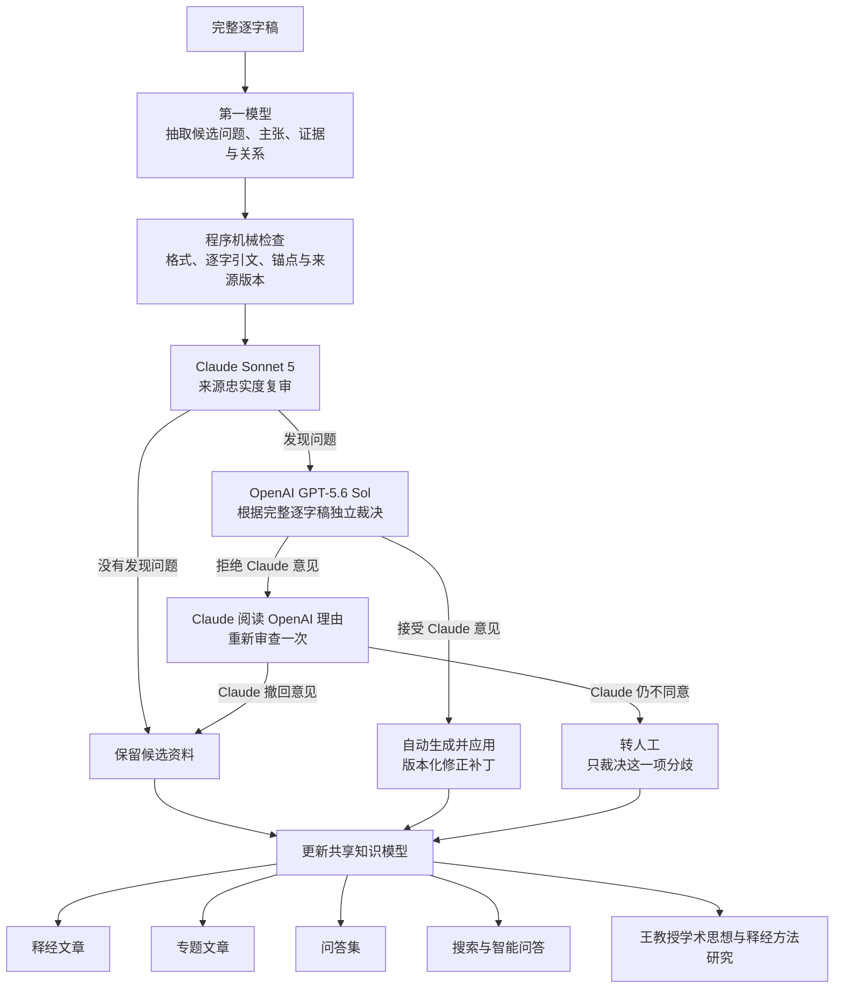
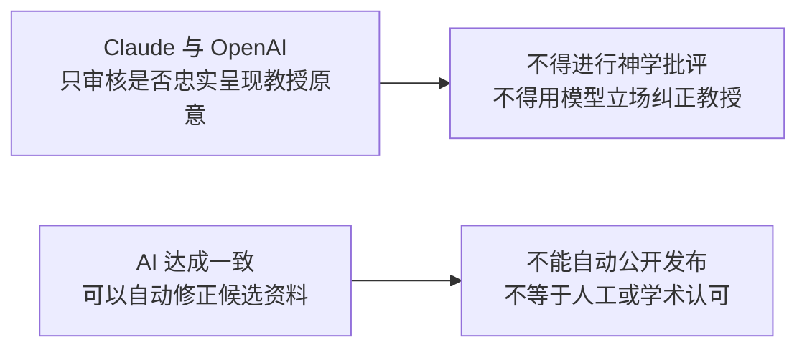

# 独立 AI 复审、双模型仲裁与人工分歧处理 v1

> 状态：已实现并以第三、第四讲真实数据验证的内部质量控制流程。它只检查来源忠实度，不进行神学批评或事实核查，也不拥有人工批准权。

## 一、为什么采用双模型仲裁

205 篇讲道会产生数千条候选主张。若同工逐条从头审阅，人工产能会成为瓶颈；若直接相信第一次抽取，又会把听众发言、反方立场、截断引文或编辑推论误作教授主张。

第一次模型负责抽取，Claude 重新阅读完整逐字稿复核候选；OpenAI 再依据相同完整来源裁定 Claude 的非 pass 意见。双方一致时自动修改候选层；双方不一致时让 Claude 阅读 OpenAI 的反驳再审一次；只有 Claude 仍坚持时才转人工。



贯穿整个流程的两项权限边界：



## 二、严格的工作范围

Claude 逐条检查：

1. 教授、听众、反方、引用对象和戏剧化代言是否混淆；
2. anchors 是否足以支持主张；
3. 是否遗漏必要限定、经文、答案或反驳转折；
4. 主张是否过宽、混合不同结论，或与输入中任何一条主张实质重复（按章节分段抽取时，同一结论会在各章节重复出现，因此比对必须跨章节）。重复必须在 `duplicate_of_claim_id` 中指名对方，这是仲裁与合并唯一会读的字段。大包分批送审时，每一批都带上本包其余主张的 id 与 statement：批次只切分谁被复审，不切分谁可以被指名为重复对象；
5. 关系的方向与含义是否与来源一致——关系类型的取值由程序按 schema 验证，复审不判断词汇表；
6. 产品路由是否存在明确错误；
7. 来源内部是否有未解决的张力或编辑推论。

两个模型都必须确认 `source_fidelity_only_no_theological_critique`。它们不得判断教授是否“正统／错误／偏离主流”，不得以宗教改革传统、通行神学、某位学者或自己的知识创造问题。即使模型不同意教授，也只能判断候选是否忠实呈现逐字稿。事实核查、文本批判和与学界比较属于后续独立阶段。

## 三、状态机

| 状态 | 含义 | 后续动作 |
|---|---|---|
| `ai_reviewed` | Claude 未发现来源忠实度问题 | 保持 candidate，可进入内部综合 |
| `human_spot_check` | Claude 判定 pass，但被随机抽样 | 进人工队列，核对 AI 复审本身是否可靠 |
| `auto_applied` | OpenAI 重新核对来源后接受 Claude 意见 | 写入版本化 override，并重建共享知识包 |
| `withdrawn` | OpenAI 拒绝，Claude 看过反驳后撤回 | 不修改原候选，不转人工 |
| `human_confirmation_required` | Claude 判定来源本身无法裁定（`human_review_required`），即使 OpenAI 接受该意见 | 补丁写入 `pending_patches` 等待人工，不自动应用 |
| `human_disagreement_required` | OpenAI 拒绝，Claude 再审后仍坚持 | 人工只裁决这一条明确分歧 |

合并没有自己的仲裁状态：两个模型都认定本条与另一条重复时，仲裁结果仍是 `auto_applied`，补丁带的是 `superseded_by_claim_id`。`superseded` 是 `knowledge_consensus_applier` 写在 claim 上的 `review_status`——锚点并入留下的那条，本条留在包内不删除。仲裁 artifact 的 `results[].status` 只会出现上表五种。

读取知识包的模块一律经 `knowledge_package.live_claims()` 取 claim——包括复审自己的输入（`corpus_ai_review_runner._normalize_claim_layer`）、批次切分与合并，以及共享知识包的投影；`superseded_by` 的那几条不参与覆盖率裁决、主题分组、跨章节与跨讲关系、产品候选，也不进入交给撰写者的经文切片。它们留在档案里只作为合并发生过的纪录；`summary.active_claim_count` 是活跃数，`claim_count` 仍是档案总行数。

两个模型一致只能解决“来源怎么读”的问题。当第一轮明确说明来源本身不足以裁定（归属高风险、编辑判断、无法从逐字稿解决），第二模型同意并不能消除当初要求人工的理由，因此这类补丁一律等待人工确认，不进入 `claim_statement_overrides_v1.json`。

OpenAI 不得盲目接受 Claude。它看到完整逐字稿、候选主张、锚点和 Claude 理由，逐条给出 `accept/reject`。`accept` 必须给出可执行的有界补丁；`reject` 不得夹带修改。忠实度仲裁不得借机改变“释经／专题／方法”等产品路由，除非原问题明确是 `route_error`。

任何结果都写入 `approval_status=not_human_approved`。这里的“无需人工审阅”是指：双方一致的来源忠实度补丁可直接写入候选层，不再逐条排队等待同工确认；它不表示 AI 可以自行通过产品出版闸门。双方一致授权的是修正候选数据，不是人工批准、神学认可或自动公开发布。

## 四、自动补丁与历史保留

`$DATA_BASE_DIR/wang-knowledge-platform/staging/claim-layer/claims.json` 保留原始抽取，不被静默覆盖。双方一致的修改写入：

- `$DATA_BASE_DIR/wang-knowledge-platform/staging/claim-layer/ai_adjudication_v1.json`：双方判断、理由、再审结果和最终状态；
- `$DATA_BASE_DIR/wang-knowledge-platform/staging/claim-layer/claim_statement_overrides_v1.json`：可执行候选覆盖；
- `$DATA_BASE_DIR/wang-knowledge-platform/staging/claim-layer/adjudication-generations/`：旧世代归档。

当前补丁可以替换 statement／claim kind／经文引用，排除弱或错误 anchor，添加逐字存在于 canonical transcript 的新 anchor，并移除被复审明确判定错误的 `ClaimRelation`。新增 anchor 必须通过 transcript、source index 和逐字子串验证；关系移除必须引用当前 package 中存在且与被审主张有关的 relation ID。共享知识构建器读取 override，把新增 anchor 提升为一等 `SourceFragment` 与 `EvidenceStep`；原始机器抽取仍可回溯。

补丁遵守最小修正规则：错误在哪一种对象，就修正哪一种对象。若问题只是主张关系错误，OpenAI 应移除或更正关系，不能扩大 Claim 的含义来迁就错误关系。若补丁 schema 尚不能表达需要的动作，必须先扩展 schema 或转后续处理，不能用语义更大的替代补丁制造“已解决”的假象。

结构性备注可以保存，但不得代替补丁。拆分、合并等动作若无法表达为有界补丁，OpenAI 不可把它伪装成 accept。

## 四之二、人工在哪里看到结果

`/admin/thought-review` 的共享知识区默认只显示人工队列：`human_spot_check`、`human_confirmation_required`、`human_disagreement_required`，以及没有 AI 复审纪录或已经没有合格证据的主张。其余主张标为「AI 已复审」，不占用同工的逐条审核工作量，但仍可随时展开覆核。

工作台按主张读取 `independent_ai_review_v1.json` 与 `ai_adjudication_v1.json`，显示两轮意见、问题类型和最终状态；被一致排除的 anchor 以 `withheld_ai_consensus` 呈现，不再计入合格证据，也不能用来通过批准闸门；一致补入的 anchor 标为「AI 仲裁补入的来源」。工作台读取的是应用 override 之后的候选（共享知识包），而不是 `claims.json` 里的原始抽取——同工审核的必须是产品实际会使用的那一版。

## 五、可审计与可重现

Claude 复审指纹绑定上游抽取/package、prompt、model ID、token 限额和 schema。复审文件还保存 Claude 实际看到的完整 `reviewed_claims` 有序快照。OpenAI 仲裁开始前必须重新计算当前 package SHA256；若与 Claude 审阅时的 hash 不同，流程立即停止并要求重跑 Claude，不能拿旧意见修改新数据。OpenAI 的锚点序号也只在该快照内解释。

OpenAI 仲裁指纹再绑定 Claude review fingerprint、OpenAI prompt/model/reasoning effort、Claude 再审 prompt/model 和 schema。任何一个组成改变都会形成新世代，旧结果先归档。

Claude 必须恰好审每一个输入 claim；OpenAI 必须恰好裁定每一个非 pass claim；Claude 必须恰好再审每一个 OpenAI rejection。程序拒绝重复、遗漏、越界 anchor、非逐字新增引文、无补丁的 accept，以及没有 `route_error` 却改变产品路由的结果。OpenAI 只能排除 Claude 在对应 issue 中明确点名的 anchor，不能借仲裁扩大修改范围。

## 六、代码与运行

- Claude prompt：`backend/pipeline/prompts/corpus_independent_ai_review.md`
- Claude schema/runner：`backend/pipeline/corpus_ai_review.py`、`corpus_ai_review_runner.py`
- OpenAI 仲裁与 Claude 再审 prompts：`corpus_openai_adjudication.md`、`corpus_claude_reconsideration.md`
- 仲裁 schema/runner：`backend/pipeline/corpus_ai_adjudication.py`、`corpus_ai_adjudication_runner.py`
- 测试：`backend/tests/test_corpus_ai_review.py`、`test_corpus_ai_adjudication.py`

单篇逐句详细知识整理、通用共识补丁应用及 `011WSR01` 试运行见 [逐句详细知识整理与双模型复审流程 v1](../10-extraction/detailed_knowledge_extraction_workflow_v1.md)。

第三、第四讲先做不调用模型的检查，再运行仲裁和重建：

```bash
PYTHONPATH=. .venv/bin/python -m backend.pipeline.corpus_ai_review_runner \
  --claim-layer-package "$DATA_BASE_DIR/wang-knowledge-platform/staging/claim-layer/shared_knowledge_pilot_v1.json" --dry-run

PYTHONPATH=. .venv/bin/python -m backend.pipeline.corpus_ai_adjudication_runner --dry-run
PYTHONPATH=. .venv/bin/python -m backend.pipeline.corpus_ai_adjudication_runner
PYTHONPATH=. .venv/bin/python -m backend.pipeline.shared_knowledge_pilot
```

默认使用 `gpt-5.6-sol` medium 仲裁、`claude-sonnet-5` 复审／再审。Sonnet 5 调用不发送旧版 temperature 与 disabled-thinking 参数，使用模型默认 adaptive thinking；复审 runner 的输出预算为 32,000 tokens，因为 thinking 与最终 JSON 共用 `max_tokens`，旧的 10,000 上限会在模型输出 JSON 前耗尽。

第三、第四讲以最终 Sonnet 5 配置和有序快照重新运行：30 条主张中 Claude 提出 5 条来源忠实度问题；OpenAI 逐条接受并自动应用 5 条；需要 Claude 再审 0 条；持续分歧与人工队列均为 0。修改包括补足精确引文、排除概念错置或过短 anchor，以及移除没有逐字稿依据的经文引用。

早期兼容性试跑曾产生 12 条非 pass、7 条接受、5 条撤回的结果；它属于已归档世代，不再作为当前候选数据。样本中人工队列为 0 不代表以后永远无需人工裁决；它只说明人工被限定在两个模型复议后仍未解决的真实分歧。

## 七、质量门槛

扩大运行前至少验证：

1. 已知说话者、反方和坏锚点错误能被任一模型发现；
2. 新增 anchor 必须逐字、可定位并成为下游一等证据；
3. 双方一致的修改只能进入版本化 override，不能覆盖原抽取；
4. 持续分歧必须明确进入人工队列，不能由任一模型单方面批准；
5. 抽样监督要测量两个模型共同漏报的风险；
6. AI-reviewed 或 auto-applied candidate 未经产品出版闸门不得公开。

这套流程把人工从“Claude 一报风险就必须看”缩小为“两个模型基于同一来源仍无法一致时才裁决”。双模型一致不能证明神学正确，也不能取代出版责任。
