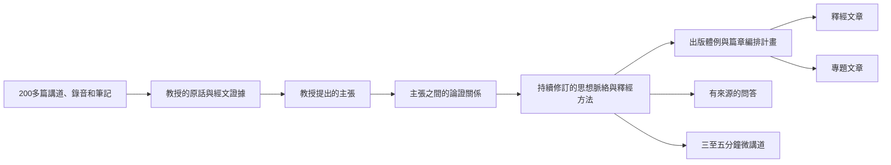
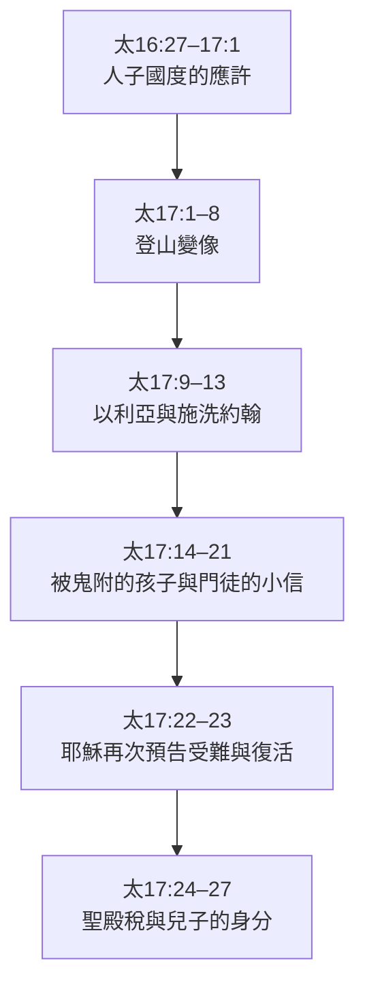
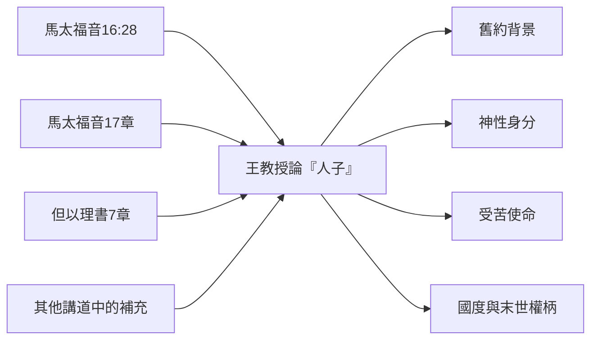
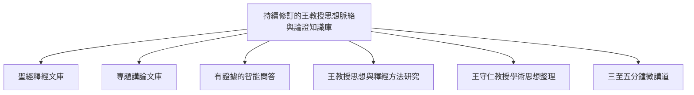

# 王守仁教授釋經與專題講論文庫

## Project Mission Statement

> **讀者**：普通基督徒與教會同工。本文不需要任何技術背景，也不使用系統內部術語。
> **類型**：規範——本計畫的目的與底線。
> **狀態**：當前。
> **權威範圍**：本計畫做什麼、不做什麼，以及忠實與署名的底線。其他設計文檔可以比本文更細，但不得與本文衝突。

完整的知識平台、雙軸文庫、原文校譯、智能問答與演化規則，見[知識平台總體設計](./knowledge_platform_design.md)。

### 目錄

| 節 | |
| --- | --- |
| [一、執行摘要](#一執行摘要) | 四個問題四句話說完本計畫 |
| [二、為什麼「傳出去」不只是把檔案放上網](#二為什麼傳出去不只是把檔案放上網) | 這些材料本來的樣子有什麼難處 |
| [三、我們的使命](#三我們的使命) | 要一步步整理出什麼 |
| [四、什麼是「教授的思想」？](#四什麼是教授的思想) | 「思想」在本計畫裡的確切含義 |
| [五、這個知識庫怎樣使用？](#五這個知識庫怎樣使用) | 釋經、專題、問答、方法研究、微講道五種用法 |
| [六、本計畫不做什麼？](#六本計畫不做什麼) | 七條紅線 |
| [七、最終形成什麼？](#七最終形成什麼) | 六種公開成果 |
| [八、我們必須堅持的原則](#八我們必須堅持的原則) | 六條不可讓步的原則 |
| [九、一句話使命宣言](#九一句話使命宣言) | |

### 一、執行摘要

#### 為什麼做？

王守仁教授是神忠心的僕人。他留下的兩百多篇講道、錄音、逐字稿和筆記，包含豐富的釋經與神學內容。**我們有責任把教授留下的寶貴資料保存下來，並傳出去。**

保存不等於存檔。同一主題常分散在不同年份、場合和經文中：若只按講道時間保存，讀者很難看見教授思想之間的關係；若只把逐字稿改寫成文章，又容易把講課現場的散亂順序一同保留下來。

#### 整理什麼？

本計畫不只整理教授「說了什麼」，也要保存他「為什麼這樣說」：教授提出的問題與主張、引用的聖經經文、推論過程、反對的解釋，以及在不同講道中反覆出現的釋經原則。

#### 怎樣保證忠實？

每項重要主張都要連回原始講道、逐字稿、筆記或錄音時間；並清楚區分教授明說、從教授論證直接得出的結論、編輯者的跨講道歸納，以及尚未解決的問題。AI 只提出候選結果。準備公開的文章、答案或研究成果，必須先由人審核它實際使用的主張、論證與來源；同一批講道中尚未被使用的候選材料，可以留待後續處理，不必阻塞本次交付。

#### 最後產生什麼？

經過審核的材料將形成一個可查證、可修訂的思想脈絡與論證知識庫。

文章不是知識圖自動排版的結果，而是編輯按照使用者批准的出版體例和逐篇編排計畫，選擇並組織知識材料後完成的新著作。同一個知識基礎還要驅動：

- 按聖經次序組織的**釋經文章**；
- 跨講道的**專題論述**；
- 有來源依據的**智能問答**；
- 三至五分鐘的**微講道**；
- 經文與原文**搜索**；
- 思想發展**比較**與**課程**；
- 王教授**釋經方法研究**，以及對其學術思想整體結構與發展過程的系統整理。

這些文章**以本教會的名義發布**，由本教會承擔作者與編纂責任；王教授是思想和講授材料的來源，不應被署名為他未曾逐章撰寫的作品作者。以《馬太福音》為例，第一至二十八章是讀者需要的經文導航骨架，不是二十八篇必須填滿的文章配額。只有教授真正講透、且來源與論證足以支持的段落才正式成篇；材料薄弱處可以只保存短注、來源索引、編輯說明或暫不出版。

### 二、為什麼「傳出去」不只是把檔案放上網

要把教授的資料傳出去，難處不在存放，在於這些材料本來的樣子：

- 教授講課比較隨性，經常在釋經、神學、生活應用和回答問題之間來回跳動；
- 同一個重要主題，可能在不同年份、不同教會和不同經文中反覆出現；
- 一篇講道可能同時包含幾個不完全相關的題目；
- 教授的重要思想，未必正好出現在講道標題中；
- 如果只按照講道時間排列，讀者很難看見不同講道之間的關係；
- 如果只是把逐字稿改寫成文章，又容易把原來的散亂結構一同保留下來。

因此，這個計畫不是簡單地把兩百多篇講道「整理得更漂亮」，而是要回答一個更重要的問題：

> 王教授怎樣理解聖經？他提出了哪些重要主張？他為什麼這樣認為？這些主張彼此之間有什麼關係？

### 三、我們的使命

本計畫要以王教授的原始講道、錄音、逐字稿和筆記為根據，一步一步整理出：

1. 教授實際說過什麼；
2. 教授提出了什麼主張；
3. 教授用什麼經文和理由支持這些主張；
4. 同一個主張在哪些講道中反覆出現；
5. 不同主張怎樣連接成較完整的思想；
6. 這些思想如何用於釋經文章、專題文章、問題解答和三至五分鐘微講道；
7. 這些主張、方法與發展如何構成可查證、可修訂的教授學術思想研究。

本計畫採用明確的上下游次序。先由完整語料建立共享知識模型，再進行全庫綜合與結構級人工審核；釋經、專題、問答等 use cases 用來驗證這個共同基礎，而不是各自發明一套資料。驗證若發現缺陷，必須回到上游修訂模型或全庫歸組，不能只在某個產品畫面裡打補丁。

這不是要求在產生任何成果之前逐條審完全庫所有候選記錄。這裡的「全庫綜合與人工審核」是指：全庫已先被普查，候選主幹與分類邊界經過結構級審核；具體成果再按其使用的最小知識子圖完成內容級審核。為完成這些工作而較早建立的**內部審核工作台**只是基礎設施，不等於已經進入最後一層的公開產品 UI。

### 四、什麼是「教授的思想」？

「思想」不是一句特別深奧的話，也不是我們替教授設計出來的一套神學體系。

在這個計畫中，教授的思想是：

> 教授在不同經文和不同問題中，反覆採用的一組核心判斷、聖經證據、論證方式和解釋原則。

例如，教授在不同講道中可能分別討論：

- 什麼是信心；
- 亞伯拉罕為什麼被算為義；
- 門徒為什麼不能趕鬼；
- 屬靈權柄從哪裡來；
- 人應該怎樣回應神的應許。

這些內容表面上屬於不同題目，但教授的回答可能反覆指向一個共同方向：

> 信心不是人的心理力量，屬靈權柄也不是人可以獨立使用的能力；它們都建立在人對神的信靠和順服之中。

如果這一思路在多篇講道中反覆出現，我們便可以提出一個候選的思想框架：

> 「人與神的合宜關係」可能是王教授理解信心、**成義（而非他所反對的純宣告式“稱義”）**、順服和屬靈能力的重要基礎。

但是，系統和編輯工作必須清楚區分四種內容：

| 類型 | 含義 |
| --- | --- |
| **教授明確主張** | 教授直接說出的判斷 |
| **論證結論** | 可以從教授給出的前提直接推出，但教授未必以同一句話說出 |
| **編輯歸納** | 編輯者綜合多篇講道後提出的解釋框架 |
| **待研究問題** | 教授尚未回答、證據不足、存在多種解釋或不同講道之間仍有張力 |

編輯者的總結不得冒充教授的原話；教授沒有回答的問題，也不得由系統擅自補成答案。

### 五、這個知識庫怎樣使用？

#### 1. 生成完整的釋經文章

釋經文章按照聖經經文的順序來寫，而不是按照教授某一次講道的現場順序來寫。

以馬太福音十七章為例：

寫到登山變像時，可以簡要說明相關思想：

- 「人子」與但以理書第七章；
- 雲彩表示神的臨在；
- 摩西與以利亞在敘事中的作用；
- 榮耀與受苦之間的關係；
- 門徒為什麼必須聽從耶穌。

但是，釋經文章不能因為討論「人子」而離開馬太福音十七章太遠。需要深入研究的內容，應連結到專門的「人子」主題文章。

#### 2. 生成完整的專題文章

專題文章不受某一次講道順序的限制，而是把教授在不同地方講過的相關材料集中起來。

例如，「人子」專題可以包括：

最後形成的不是幾段重複講道，而是一篇完整論述：

> 王守仁教授論「人子」：舊約背景、神性身分、受苦使命與末世權柄

#### 3. 回答讀者的問題

讀者可能會問：

> 王教授認為門徒為什麼不能趕出那個鬼？

系統不能只找出包含「趕鬼」兩個字的段落，而應根據經過審核的論證回答：

1. 門徒已經領受權柄；
2. 所以問題不是完全沒有權柄；
3. 「小信」也不是完全沒有信心；
4. 問題是他們沒有正確理解信心與權柄；
5. 屬靈權柄必須在倚靠神的關係中運用。

讀者還可以繼續查看教授的原話、相關經文、逐字稿高亮、錄音或錄像的時間位置，以及這個答案屬於教授明說、直接推論還是編輯綜合。

#### 4. 發現教授反覆使用的釋經方法

講道標題不一定能顯示教授最重要的思想。例如，教授可能在不同地方反覆使用以下方法：

> 先辨認聖經文體，再解釋其中的形象和記號。

他可能使用這一原則解釋啟示錄、比喻、預言、象徵性語言、新耶路撒冷和哈米吉多頓。如果這一原則在許多不同經文中反覆出現，我們便可以確認：這不只是一次講道中的一句話，也是教授重要的釋經方法。

#### 5. 製作三至五分鐘的微講道

微講道不是把一小時講道隨意截短，也不是把長篇文章改寫成幾句口號。它每篇只回答一個讀者真正會問的問題，保留理解答案所需的最小完整論證，並連回完整講道、逐字稿高亮、相關釋經或專題。

它可以採用兩種形式：一是選取語境完整的王教授原聲片段；二是由編輯根據已審核的跨講道主張，寫成清楚標示為「根據王守仁教授講道整理」的短講。兩者都必須使用同一共享知識與來源，不可另建一套短影音神學資料。完整規範見[微講道：三至五分鐘短篇教導 Use Case](../50-micro-sermon/micro_sermon_product_use_case.md)。

### 六、本計畫不做什麼？

- 不按照編輯者預設的神學體系給教授的講道分類；
- 不把 AI 生成的總結或推論當作教授原話；
- 不為了文章流暢而刪除重要證據、限制條件或不同意見；
- 不把教授沒有回答的問題擅自補成答案；
- 不宣稱兩百多篇講道包含教授全部的思想；
- 不以整理後的文章取代原始講道、錄音、逐字稿和筆記；
- 不以「出現次數多」作為思想重要性的唯一標準。

一項主張是否重要，還要考慮它出現於多少篇不同講道、跨越多少時間和場合、是否支持多個不同論證、教授是否明確強調，以及後期表述是否保持一致。

### 七、最終形成什麼？

#### 聖經釋經文庫

按照聖經書卷、章、節組織內容，使讀者可以從創世記到啟示錄閱讀教授的釋經。

#### 專題講論文庫

按照「人子」「信心」「因信成義而非因信稱義」「耶穌的神性」「時代論」等主題，集中教授在不同講道中的相關論述。

#### 有證據的智能問答

每個答案都可以追溯到教授原話、經文、逐字稿及錄音位置。

#### 思想與釋經方法研究

在材料累積到一定程度後，說明教授經常提出哪些核心主張、使用哪些釋經原則、如何從經文形成神學判斷、反對哪些解釋，以及思想是否在不同年代有所發展。

#### 王守仁教授學術思想整理

在釋經與專題成果之上，系統研究多個主題背後共同的核心判斷、證據標準、論證習慣、學術對話與時間發展。這不是替教授建造封閉的神學體系；每項跨講歸納都要與教授原話分開署名，說明所覆蓋的語料、反例、張力與成熟度，並能回到原始講道核對。完整規範見 [王守仁教授學術思想整理：核心 Use Case](./scholarly_thought_reconstruction_use_case.md)。

#### 三至五分鐘微講道

以一個中心問題和一條最小完整論證為單位，提供王教授原聲片段或清楚署名的編輯綜合短講，幫助注意力有限的讀者先理解一個重點，再進入完整講道、釋經和專題內容。

### 八、我們必須堅持的原則

#### 忠於來源

每個重要結論都應盡可能連接到原始講道、逐字稿、筆記和錄音時間。

#### 保存論證

不只記錄教授得出了什麼結論，也要保存他怎樣從經文和理由得到這個結論。怎樣保存，見 [Claim 設計](../20-knowledge/claim_design.md)。

#### 區分教授原話與編輯歸納

教授明確說過的、從論證直接推出的，以及編輯者綜合出來的，必須清楚標明。

#### 保留人工審核

AI 可以協助尋找材料、整理主張和生成初稿，但不能替教會和編輯者決定教授最終的神學立場。人工審核應圍繞具體交付物和風險排序，讓有限的同工時間先用在真正影響公開內容的證據鏈上。

這一條的方向是：**能自動化的一律自動化，實在無法自動化的才轉為人工。** 人是忠實性的最終裁決者，這一點不可取消；可以壓縮的是請他決定的次數和每次的代價。本條不等於「凡事都要人看」——兩百多篇講道會產生上萬條候選記錄，逐條看完既不可能也無必要。分工的細節見 [Solution Architecture 第 5 節](./solution_architecture.md#5-运营谁在用同工做什么)。

#### 允許分階段完成

文庫不必等兩百多篇講道全部處理完成才開始產生成果。已審核的局部成果可以先發布；尚未整理的材料應明確標示為「尚未整理」，不能誤寫成「教授沒有講過」。內部候選材料不得在公開頁面冒充已批准內容。

#### 允許持續修正

每加入一篇新講道，已有理解都可能得到新的支持、補充、限制或修正。這個思想脈絡與論證知識庫必須能夠持續生長。

### 九、一句話使命宣言

> 把王守仁教授兩百多篇講道整理成一個可查證、可持續修訂的知識基礎——每一句都能回到教授的原話和他所引的經文——並據此寫成釋經文章、專題論述、有來源的問答與微講道。

展開一點說：本計畫以教授的講道、錄音、逐字稿和筆記為原始依據，保存他實際表達的主張、經文依據和論證過程，逐步辨識其在不同經文與主題中反覆出現的思想脈絡和釋經方法；並在清楚區分教授明說、直接推論、編輯歸納和待研究問題的前提下，讓這個知識基礎可以被審核、被修訂。

