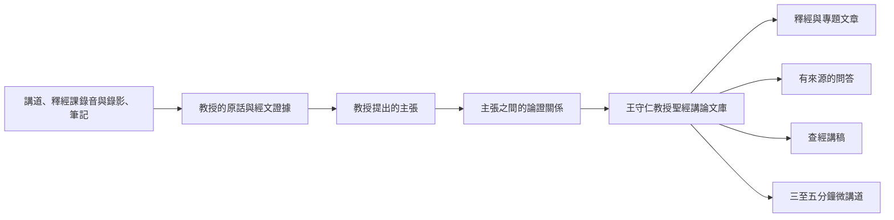

# 王守仁教授聖經講論文庫

## Project Mission Statement

> **讀者**：普通基督徒與教會同工。本文不需要任何技術背景，也不使用系統內部術語。
> **類型**：規範——本計畫的目的與底線。
> **狀態**：當前。
> **權威範圍**：本計畫做什麼、不做什麼，以及忠實與署名的底線。其他設計文檔可以比本文更細，但不得與本文衝突。

### 目錄

| 節 | |
| --- | --- |
| [一、為什麼做](#一為什麼做) | 教授留下什麼，我們的責任是什麼 |
| [二、目前的進展](#二目前的進展) | 逐字稿放上網之後，還有四個問題答不了 |
| [三、我們的使命](#三我們的使命) | 要一步步整理出什麼 |
| [四、什麼是「教授的思想」？](#四什麼是教授的思想) | 「思想」在本計畫裡的確切含義 |
| [五、產出什麼](#五產出什麼) | 七種產出，以及誰署名 |
| [六、本計畫不做什麼？](#六本計畫不做什麼) | 七條紅線 |
| [七、我們必須堅持的原則](#七我們必須堅持的原則) | 六條不可讓步的原則 |
| [八、一句話使命宣言](#八一句話使命宣言) | |

### 一、為什麼做

王守仁教授是神忠心的僕人。他一生的工作是把聖經講清楚——他所講的不是自己的意見，是神的話語。他留下大量講道、釋經課的錄音與錄影，以及筆記。

**這些是主藉他託付給教會的。我們有責任把它們保存下來，傳揚出去。**

### 二、目前的進展

**目前的做法是：把教授的錄音、錄影和釋經筆記做成逐字稿，放在網上。**

逐字稿是後面一切工作的基礎。但停在這一步，有四個問題答不了：

**一、教授到底有哪些觀點？**

重要的釋經與神學判斷散在各處，沒有系統的整理。他主張什麼、反對哪些說法、哪些是他獨特的看法——現在說不出來。

**二、不容易跟得上。**

教授在課堂上講得隨性，來回跳躍：釋經、神學、生活應用和回答問題交錯出現，一篇逐字稿讀下來，很難把一條論證從頭跟到尾。

**三、很難系統而準確地回答問題。**

有人問「教授怎麼看因信成義」，現在只能靠關鍵字檢索，找出一堆含這幾個字的段落；答不出他的看法是什麼、憑什麼這樣看、在別處有沒有補充或限定。

**四、幫不上查經和講道。**

同工要預備一段經文或一個題目，需要的是「教授在這段經文上講過什麼、怎麼講的」，而不是逐篇去翻。

這一條和前三條不同：前三條是要給讀者看的成果，這一條是**同工自己要用的工具**。

這四個問題，正是這個計畫要解決的。

### 三、我們的使命

逐字稿保存了教授說過的話，卻沒有保存這些話所構成的東西。

本計畫以教授釋經講道的錄音、錄影和筆記，以及由它們校對而成的逐字稿為根據，整理出**王守仁教授聖經講論文庫**。文庫收錄：

1. 他提出了什麼主張，反對哪些主張；
2. 他用哪些經文和理由支持這些主張——每一條都連得回他講道的原話；
3. 不同主張怎樣連成完整的論證鏈。

在這個基礎上，寫出釋經與專題文章、有來源的問答、查經講稿和微講道（見[第五節](#五產出什麼)）。

**文庫收錄的是教授的講論，寫出的文章與講稿是我們的。** 同工用文庫預備查經，講的仍是他自己領受的信息；文庫供給有來源的材料，不代替他在神面前的預備。

### 四、什麼是「教授的思想」？

不是一句特別深奧的話，也不是我們替他設計的一套神學體系。在本計畫中：

> 教授的思想，是他在不同經文和不同問題中反覆採用的一組核心判斷、聖經證據、論證方式和解釋原則。

例如他講信心、講亞伯拉罕被算為義、講門徒為什麼不能趕鬼，題目不同，回答卻可能反覆指向同一個方向：信心不是人的心理力量，屬靈權柄也不是人可以獨立使用的能力。這種反覆出現的方向，就是要整理出來的東西。

整理時必須分清四種內容：

| 類型 | 含義 |
| --- | --- |
| **教授明確主張** | 他直接說出的判斷 |
| **論證結論** | 從他給出的前提可以直接推出，但他未必這樣說過 |
| **編輯歸納** | 編輯綜合多篇講道後提出的框架 |
| **待研究問題** | 他尚未回答、證據不足，或不同講道之間仍有張力 |

編輯的歸納不得冒充教授的原話；他沒有回答的問題，不由系統補成答案。

### 五、產出什麼

同一個文庫，七種產出。前兩項是進入同一批材料的兩條路，不是兩個文庫。

| 產出 | 是什麼 |
| --- | --- |
| **按經卷的釋經** | 按聖經書卷、章、節組織，使讀者可以從創世記到啟示錄讀教授的釋經。文章按經文次序寫，不按某一次講道的現場順序 |
| **按主題的專論** | 按「人子」「因信成義」「耶穌的神性」等主題，集中他在不同講道中的相關論述 |
| **有來源的問答** | 每個答案都能追溯到教授原話、經文和錄音位置；答不了的說答不了，不用一般知識補齊 |
| **查經講稿** | 給同工預備用。文庫供給有來源的材料，講章仍是他自己領受的 |
| **三至五分鐘微講道** | 一個中心問題、一條最小完整論證。或用教授原聲，或由編輯署名寫成短講 |
| **釋經方法與思想研究** | 材料積累到一定程度後，說明他常用哪些釋經原則、如何從經文形成判斷、反對哪些解釋、不同年代有無發展 |
| **按經文與主題重排的原聲** | 讀者看到的仍是教授本人的錄音錄影，只是按經文與主題重新排過。**不產出任何新的文字。** 名義上是馬太福音釋經，實際講到一處經文時常跳去講別的題目，講完再跳回來；現場聽是自然的，事後按經文找就不是。價值在次序，不在內容 |

前六種都產出新的文字，**以本教會的名義發布**，由本教會承擔作者與編纂責任。王教授是思想和材料的來源，不署名為他未曾逐章撰寫的作品作者。

第七種不同：它一個字都不新增，只把教授的原話換一個次序呈現，因此不存在署名問題。它的邊界在**有沒有錄音**——釋經課筆記生成的逐字稿（母本）本來就沒有錄音錄影，這一種產出覆蓋不到它們。

以《馬太福音》為例：第一至二十八章是讀者需要的經文骨架，不是二十八篇必須填滿的配額。只有教授真正講透、來源與論證足以支持的段落才成篇；材料薄弱處只保存短注、來源索引或暫不出版。

### 六、本計畫不做什麼？

- 不按照編輯者預設的神學體系給教授的講道分類；
- 不把 AI 生成的總結或推論當作教授原話；
- 不為了文章流暢而刪除重要證據、限制條件或不同意見；
- 不把教授沒有回答的問題擅自補成答案；
- 不宣稱已整理的部分就是教授全部的思想；
- 不以整理後的文章取代原始講道、錄音、錄影、筆記和逐字稿；
- 不以「出現次數多」作為思想重要性的唯一標準。

一項主張是否重要，還要考慮它出現於多少篇不同講道、跨越多少時間和場合、是否支持多個不同論證、教授是否明確強調，以及後期表述是否保持一致。

### 七、我們必須堅持的原則

1. **忠於來源**——每個重要結論都連得回原始講道、筆記或錄音位置。
2. **保存論證**——不只記結論，也記他怎樣從經文和理由得到它。
3. **分清誰說的**——教授明說的、從他的論證推出的、編輯綜合的，必須分別標明。
4. **人作最終判斷**——AI 只提出候選；教授的神學立場由人決定。
5. **分階段完成**——已審核的先發布；未整理的標明「尚未整理」，不寫成「教授沒有講過」。
6. **持續修正**——新材料可能補充或推翻已有理解，文庫必須能持續生長。

### 八、一句話使命宣言

> 把王守仁教授留下的大量講道整理成一個可查證、可持續修訂的知識基礎——每一句都能回到教授的原話和他所引的經文——並據此寫成釋經文章、專題論述、有來源的問答與微講道。

展開一點說：本計畫以教授的講道、釋經課錄音與錄影和筆記為原始依據，保存他實際表達的主張、經文依據和論證過程，逐步辨識其在不同經文與主題中反覆出現的思想脈絡和釋經方法；並在清楚區分教授明說、直接推論、編輯歸納和待研究問題的前提下，讓這個知識基礎可以被審核、被修訂。

