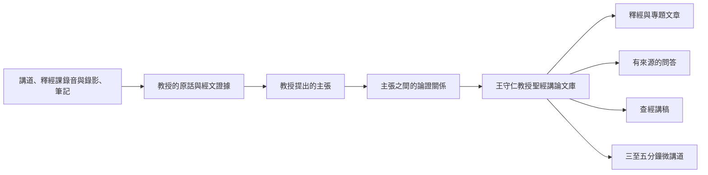

# 王守仁教授聖經講論文庫

## Project Mission Statement

> **讀者**：普通基督徒與教會同工。本文不需要任何技術背景，也不使用系統內部術語。
> **類型**：規範——本計畫的目的與底線。
> **狀態**：當前。
> **權威範圍**：本計畫做什麼、不做什麼，以及忠實與署名的底線。其他設計文檔可以比本文更細，但不得與本文衝突。

### 目錄

| 節 | |
| --- | --- |
| [一、執行摘要](#一執行摘要) | 四個問題四句話說完本計畫 |
| [二、目前的進展](#二目前的進展) | 逐字稿放上網之後，還有四個問題答不了 |
| [三、我們的使命](#三我們的使命) | 要一步步整理出什麼 |
| [四、什麼是「教授的思想」？](#四什麼是教授的思想) | 「思想」在本計畫裡的確切含義 |
| [五、產出什麼](#五產出什麼) | 六種產出，以及誰署名 |
| [六、本計畫不做什麼？](#六本計畫不做什麼) | 七條紅線 |
| [七、我們必須堅持的原則](#七我們必須堅持的原則) | 六條不可讓步的原則 |
| [八、一句話使命宣言](#八一句話使命宣言) | |

### 一、執行摘要

#### 為什麼做？

王守仁教授是神忠心的僕人。他一生的工作是把聖經講清楚——他所講的不是自己的意見，是神的話語。他留下大量講道、釋經課的錄音與錄影，以及筆記。

**這些是主藉他託付給教會的。我們有責任把它們保存下來，傳揚出去。**

也正因為所傳的是神的話，忠實就不只是做學問的謹慎，而是本分：不可加添，不可刪減，不可把我們的意思放進他口中。

保存不等於存檔。同一主題常分散在不同年份、場合和經文中：若只按講道時間保存，讀者很難看見教授思想之間的關係；若只把逐字稿改寫成文章，又容易把講課現場的散亂順序一同保留下來。

#### 整理什麼？

本計畫不只整理教授「說了什麼」，也要保存他「為什麼這樣說」：教授提出的問題與主張、引用的聖經經文、推論過程、反對的解釋，以及在不同講道中反覆出現的釋經原則。

#### 怎樣保證忠實？

忠實是這件事的底線，不是做得漂不漂亮的問題。每項重要主張都要連回原始講道、逐字稿、筆記或錄音時間；並清楚區分教授明說、從教授論證直接得出的結論、編輯者的跨講道歸納，以及尚未解決的問題。AI 只提出候選結果。準備公開的文章、答案或研究成果，必須先由人審核它實際使用的主張、論證與來源；同一批講道中尚未被使用的候選材料，可以留待後續處理，不必阻塞本次交付。

#### 最後產生什麼？

**王守仁教授聖經講論文庫**，以及在它之上寫成的釋經與專題文章、有來源的問答、查經講稿和微講道。文章不是知識圖自動排版的結果，而是編輯選擇、組織材料後寫成的新著作。

### 二、目前的進展

**目前的做法是：把教授的錄音、錄影和釋經筆記做成逐字稿，放在網上。**

逐字稿是後面一切工作的基礎。但停在這一步，有四個問題答不了：

**一、教授到底有哪些觀點？**

重要的釋經與神學判斷散在各處，沒有系統的整理。他主張什麼、反對哪些說法、哪些是他獨特的看法——現在說不出來。

**二、不容易跟得上。**

教授在課堂上講得隨性，來回跳躍：釋經、神學、生活應用和回答問題交錯出現，一篇逐字稿讀下來，很難把一條論證從頭跟到尾。

**三、很難系統而準確地回答問題。**

有人問「教授怎麼看因信成義」，現在只能靠關鍵字檢索，找出一堆含這幾個字的段落；答不出他的看法是什麼、憑什麼這樣看、在別處有沒有補充或限定。

**四、幫不上查經和講道。**

同工要預備一段經文或一個題目，需要的是「教授在這段經文上講過什麼、怎麼講的」，而不是逐篇去翻。

這一條和前三條不同：前三條是要給讀者看的成果，這一條是**同工自己要用的工具**。

這四個問題，正是這個計畫要解決的。

### 三、我們的使命

要回答上面那四個問題，逐字稿本身不夠——它保存了教授說過的話，卻沒有保存這些話所構成的東西。

本計畫以教授釋經講道的錄音、錄影和筆記，以及由它們校對而成的逐字稿為根據，系統地整理出**王守仁教授聖經講論文庫**。文庫收錄：

1. 教授提出了什麼主張，以及他反對哪些主張；
2. 他用哪些經文和理由支持這些主張，而每一條都連得回他講道的原話——**可回溯**；
3. 不同主張怎樣連接成完整的論證鏈。

在這個基礎上，產出：

1. 忠於教授思想、可溯源的**釋經與專題文章**，以及**有來源的問答**；
2. 結合個人領受的**查經講稿**，和**三至五分鐘的微講道**。

這裡有一條界線要守住：**文庫收錄的是教授的講論，產出的文章與講稿是我們寫的。** 同工用文庫預備一堂查經，講的仍是他自己領受的信息；文庫供給的是有來源的材料，不代替他在神面前的預備。

**釋經、專題、問答用的是同一個文庫，不各自另建一套。** 在某個產品上發現的缺陷，要回去修那個共同的基礎，不能只在那一個畫面裡打補丁——否則同一個錯誤會在別的產品上再出現一次。

### 四、什麼是「教授的思想」？

「思想」不是一句特別深奧的話，也不是我們替教授設計出來的一套神學體系。

在這個計畫中，教授的思想是：

> 教授在不同經文和不同問題中，反覆採用的一組核心判斷、聖經證據、論證方式和解釋原則。

例如，教授在不同講道中可能分別討論：

- 什麼是信心；
- 亞伯拉罕為什麼被算為義；
- 門徒為什麼不能趕鬼；
- 屬靈權柄從哪裡來；
- 人應該怎樣回應神的應許。

這些內容表面上屬於不同題目，但教授的回答可能反覆指向一個共同方向：

> 信心不是人的心理力量，屬靈權柄也不是人可以獨立使用的能力；它們都建立在人對神的信靠和順服之中。

如果這一思路在多篇講道中反覆出現，我們便可以提出一個候選的思想框架：

> 「人與神的合宜關係」可能是王教授理解信心、**成義（而非他所反對的純宣告式“稱義”）**、順服和屬靈能力的重要基礎。

但是，系統和編輯工作必須清楚區分四種內容：

| 類型 | 含義 |
| --- | --- |
| **教授明確主張** | 教授直接說出的判斷 |
| **論證結論** | 可以從教授給出的前提直接推出，但教授未必以同一句話說出 |
| **編輯歸納** | 編輯者綜合多篇講道後提出的解釋框架 |
| **待研究問題** | 教授尚未回答、證據不足、存在多種解釋或不同講道之間仍有張力 |

編輯者的總結不得冒充教授的原話；教授沒有回答的問題，也不得由系統擅自補成答案。

### 五、產出什麼

同一個文庫，六種產出。前兩項是進入同一批材料的兩條路，不是兩個文庫。

| 產出 | 是什麼 |
| --- | --- |
| **按經卷的釋經** | 按聖經書卷、章、節組織，使讀者可以從創世記到啟示錄讀教授的釋經。文章按經文次序寫，不按某一次講道的現場順序 |
| **按主題的專論** | 按「人子」「因信成義」「耶穌的神性」等主題，集中他在不同講道中的相關論述 |
| **有來源的問答** | 每個答案都能追溯到教授原話、經文和錄音位置；答不了的說答不了，不用一般知識補齊 |
| **查經講稿** | 給同工預備用。文庫供給有來源的材料，講章仍是他自己領受的 |
| **三至五分鐘微講道** | 一個中心問題、一條最小完整論證。或用教授原聲，或由編輯署名寫成短講 |
| **釋經方法與思想研究** | 材料積累到一定程度後，說明他常用哪些釋經原則、如何從經文形成判斷、反對哪些解釋、不同年代有無發展 |

寫成的文章**以本教會的名義發布**，由本教會承擔作者與編纂責任。王教授是思想和材料的來源，不署名為他未曾逐章撰寫的作品作者。

以《馬太福音》為例：第一至二十八章是讀者需要的經文骨架，不是二十八篇必須填滿的配額。只有教授真正講透、來源與論證足以支持的段落才成篇；材料薄弱處只保存短注、來源索引或暫不出版。

### 六、本計畫不做什麼？

- 不按照編輯者預設的神學體系給教授的講道分類；
- 不把 AI 生成的總結或推論當作教授原話；
- 不為了文章流暢而刪除重要證據、限制條件或不同意見；
- 不把教授沒有回答的問題擅自補成答案；
- 不宣稱已整理的部分就是教授全部的思想；
- 不以整理後的文章取代原始講道、錄音、錄影、筆記和逐字稿；
- 不以「出現次數多」作為思想重要性的唯一標準。

一項主張是否重要，還要考慮它出現於多少篇不同講道、跨越多少時間和場合、是否支持多個不同論證、教授是否明確強調，以及後期表述是否保持一致。

### 七、我們必須堅持的原則

#### 忠於來源

每個重要結論都應盡可能連接到原始講道、逐字稿、筆記和錄音時間。所傳的是神的話，經教授講解；我們不可在其上加添，也不可刪減。

#### 保存論證

不只記錄教授得出了什麼結論，也要保存他怎樣從經文和理由得到這個結論。只保存結論，讀者就無從判斷它站不站得住，也不知道他反對的是哪一種說法。

#### 區分教授原話與編輯歸納

教授明確說過的、從論證直接推出的，以及編輯者綜合出來的，必須清楚標明。把我們的歸納冒充成他的話，是對讀者不誠實，也是對他不公。

#### 保留人工審核

AI 可以協助尋找材料、整理主張和生成初稿，但不能替教會和編輯者決定教授最終的神學立場。人工審核應圍繞具體交付物和風險排序，讓有限的同工時間先用在真正影響公開內容的證據鏈上。

這一條的方向是：**能自動化的一律自動化，實在無法自動化的才轉為人工。** 人是忠實性的最終裁決者，這一點不可取消；可以壓縮的是請他決定的次數和每次的代價。本條不等於「凡事都要人看」——這些講道會產生上萬條候選記錄，逐條看完既不可能也無必要。同工看的是機器判不了、又真正影響公開內容的那些。

#### 允許分階段完成

文庫不必等全部材料處理完成才開始產生成果。已審核的局部成果可以先發布；尚未整理的材料應明確標示為「尚未整理」，不能誤寫成「教授沒有講過」。內部候選材料不得在公開頁面冒充已批准內容。

#### 允許持續修正

每加入一篇新講道，已有理解都可能得到新的支持、補充、限制或修正。這個思想脈絡與論證知識庫必須能夠持續生長。

### 八、一句話使命宣言

> 把王守仁教授留下的大量講道整理成一個可查證、可持續修訂的知識基礎——每一句都能回到教授的原話和他所引的經文——並據此寫成釋經文章、專題論述、有來源的問答與微講道。

展開一點說：本計畫以教授的講道、釋經課錄音與錄影和筆記為原始依據，保存他實際表達的主張、經文依據和論證過程，逐步辨識其在不同經文與主題中反覆出現的思想脈絡和釋經方法；並在清楚區分教授明說、直接推論、編輯歸納和待研究問題的前提下，讓這個知識基礎可以被審核、被修訂。

