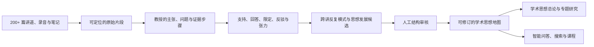

# 王守仁教授学术思想整理：核心 Use Case

> **读者**：神学编辑
> **类型**：说明
> **状态**：当前
> **与代码对齐**：不适用
> **权威范围**：学术思想整理这一 use case 的目标与约束。不表示候选资料已全部通过人工审核。

> 状态：产品目标与设计约束。本文定义“整理王教授学术思想”如何使用共享知识模型；它不是对教授思想内容的预设分类，也不表示当前候选资料已经全部通过人工审核。

本 use case 的观点身份、跨讲 membership、ArgumentRoute、覆盖披露、时间 revision 与产品消费规则，以 [Canonical Viewpoint Registry 与跨讲论证路径设计 v1](../20-knowledge/canonical_viewpoint_design.md) 为 architecture authority。

## 一、目标

本 use case 的目的不是把专题文章汇编成一本书，也不是替教授制造一套整齐、封闭的神学体系。它要根据王守仁教授留下的大量讲道、释经课录音与录影，以及笔记，逐步重建：

1. 教授反复提出哪些核心主张；
2. 他根据什么经文、原文、文体、历史背景和逻辑形成这些主张；
3. 不同主张怎样互相支持、限定、解释或产生张力；
4. 他反对或修正哪些解释与学术立场；
5. 他习惯怎样提出问题、判断证据和解释圣经；
6. 这些主张和方法是否在不同时期得到延续、扩展、调整或改变。

这里的“学术思想”包括教授的神学结论，也包括他反复采用的释经方法、证据标准、论证习惯、重要概念及其发展过程。对一位长期从事新约研究和教学的学者而言，论证结构不只是思想的容器，也是思想本身的一部分。

## 二、它与专题文章有什么不同？

专题文章通常回答一个限定问题，例如“人子是什么意思”或“因信成义如何理解”。学术思想整理则要观察这些专题背后的共同结构。

例如，教授可能在信心、亚伯拉罕成义、门徒赶鬼和顺服等不同题目中，反复强调人与神的合宜关系。单篇专题分别解释这些题目；学术思想整理则进一步研究：

- “关系”是否构成教授反复采用的解释原则；
- 它与约、恩典、信、义及顺服怎样相连；
- 这个连接是教授明确说出的，还是编辑跨讲归纳出的；
- 它在多少讲道、哪些时期和哪些经文中出现；
- 是否存在例外、限制、张力或后期修订。

因此，专题是思想体系的一个纵向切面；学术思想整理研究的是多个切面之间的结构。

## 三、知识形成过程

这条流程不能倒过来。系统不得先写一篇“王教授神学思想”，再回头从文章中猜测教授的主张和依据。

## 四、共享资料模型怎样支持它？

| 需要回答的问题 | 主要资料对象 |
|---|---|
| 教授在哪里说过？ | `SourceDocument`、`SourceFragment` |
| 教授主张什么？ | `Claim` |
| 哪些来源主张属于同一个稳定观点？ | `CanonicalViewpoint`、`ViewpointClaimLink` |
| 他怎样得出结论？ | `Observation`、`EvidenceStep`、`KnowledgeRelation` |
| 同一结论有哪些不同论证路线？ | `ArgumentRoute`、source-local `RouteAttestation` |
| 他回答什么问题？ | `Question`、`answers` relation |
| 他反对什么？ | `PositionNode`、`ClaimRelation: refutes` |
| 不同主张怎样相连？ | `ClaimRelation` |
| 编辑发现了什么跨讲模式？ | `EditorialSynthesis` |
| 这项理解怎样发展？ | `ThoughtMapRevision` 与时间范围 |
| 资料应该进入哪类成果？ | `KnowledgeRoute` |
| 学术思想总论怎样编排？ | `CompositionPlan`、`CompositionDecision` |

目前正式 canonical store 已能保存来源局部共享对象、编辑综合、知识去向与篇章计划；Canonical Viewpoint Registry 的正式 schema、审核和 active-build 流程仍属于后续实现。它完成后，`ThoughtMapRevision` 应消费 SHA-bound `ViewpointKnowledgeProjection`，而不是从 EditorialSynthesis 标题反推观点身份。

`CanonicalViewpoint` 解决观点身份，`ArgumentRoute` 解决论证路径，`EditorialSynthesis` 解决编辑叙述，`ThoughtMapRevision` 解决思想地图的产品版本。若这些对象完成真实实现与消费验证后，仍不足以表达一个经过审核的学术思想全貌，再考虑增加 `ScholarlyThoughtProfile`；在此之前不为名称完整而冻结新的产品级 schema。

## 五、归属与忠实性

学术思想整理最容易把编辑的聪明总结误写成教授自己的体系，因此必须区分：

| 层次 | 定义 | 对外表达方式 |
|---|---|---|
| 教授明确主张 | 教授直接说出的判断 | “王教授指出……” |
| 直接论证结论 | 可从教授给出的前提直接推出 | “依照这段论证，可以得出……” |
| 编辑跨讲归纳 | 综合多篇材料发现的共同模式 | “本项目根据目前语料归纳……” |
| 发展或张力候选 | 不同时期材料之间可能存在变化 | “目前材料显示……仍待进一步审核” |
| 外部事实核查 | 与教授思想归属不同的研究任务 | 独立标明核查结论，不静默改写教授 |

每一项编辑综合至少要保留：所依据的 claims、来源范围、时间范围、反例或张力、编辑者、审核状态和版本。

## 六、时间是组织轴，不只是冲突处理

十五年以上的语料不能只用 `supersedes` 处理矛盾。系统需要区分：

- **延续**：同一主张在不同时期保持稳定；
- **扩展**：后来加入新的经文、理由或应用；
- **限定**：后来说明早期说法的适用范围；
- **重述**：用不同术语表达相近思想；
- **张力**：材料之间尚不能协调；
- **改变**：教授明确修正先前立场；
- **自述发展**：教授直接说明自己的学术经历或立场转变。

系统不得因为一条材料年代较晚，就自动判定它取代较早材料。

## 七、预期成果

这一 use case 可以逐步产生：

1. **学术思想概览**：用普通读者能理解的方式说明主要关切和整体结构；
2. **核心思想地图**：显示主要概念、主张和论证关系；
3. **释经方法研究**：原文、文体、上下文、历史与逻辑怎样进入解释；
4. **重要立场研究**：教授接受、修正或反对哪些解释及其理由；
5. **思想发展时间线**：呈现延续、扩展、限定、张力与改变；
6. **学术思想专论**：针对约、成义、人子、神国等核心结构进行跨讲研究；
7. **课程与研究工具**：按主题、经文、方法或时期组织教学；
8. **证据型智能问答**：回答“王教授如何理解某问题，以及依据是什么”。

每项成果必须允许读者返回原始讲道、逐字稿高亮或录音时间点核对。

## 八、审核与发布策略

不需要等 205 篇的每一条候选主张全部审核后，才能交付任何成果。正确方式是：

1. 全库普查先提供总体形状和检索范围；
2. 为一个明确成果冻结最小所需知识子图；
3. 审核该子图中的来源、主张、关系、反方立场和编辑综合；
4. 记录未覆盖语料、反例、张力与成熟度；
5. 依据实际审核产能决定下一批范围；
6. 新资料加入时，产生可预览的思想地图修订，而不是静默改写旧成果。

## 九、完成标准

一个“王教授学术思想”成果只有同时满足以下条件，才可以公开：

- 每项核心判断都能追溯到经过审核的来源；
- 教授明说、直接推论和编辑归纳在文字与资料中可区分；
- 反方立场不会被误标为教授自己的主张；
- 重要反例、张力和语料缺口没有被隐藏；
- 时间范围和所覆盖语料明确；
- 文章有独立的篇章编排计划及审核记录；
- 读者能够查看支撑结论的原始讲道、文字高亮或录音时间点；
- 后续资料可以扩展或修订现有结构，而不破坏历史版本。

## 十、核心表述

> 本项目不仅整理王守仁教授讲过哪些题目，也要依据可定位的原始材料，重建他如何从圣经、原文、文体、历史与逻辑形成判断；这些判断怎样彼此支持、限定或产生张力；以及其释经方法和神学理解如何在不同时期延续、扩展或改变。所有跨讲归纳均须与教授原话分开署名、经过人工审核并保留来源，使“王守仁教授学术思想”成为一套可查证、可讨论、可持续修订的研究成果，而不是由 AI 拼成的封闭体系。
