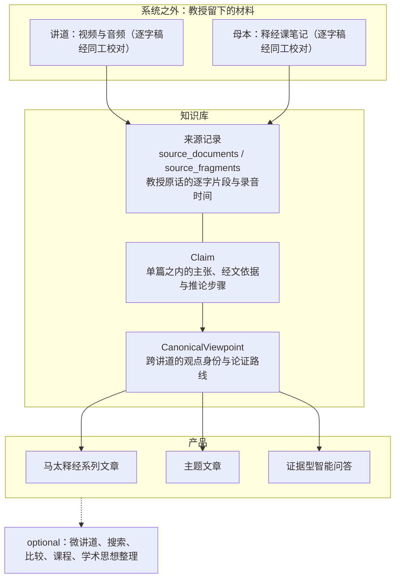

# 王守仁教授知识平台 Solution Architecture

> **读者**：教会同工与 Solution architect。同工要参与审阅，必须能读懂本文——知道这件事为什么这样做，以及自己该做什么、不该做什么。全文不使用系统内部术语；出现的英文名词在首次出现处解释。
> **类型**：规范
> **状态**：当前
> **与代码对齐**：不适用（本文不描述实作细节）
> **权威范围**：分层理由、约束、产品优先级与掉头条件。下游设计与本文冲突时，先改本文并记录决定，不在下游打补丁。

## 目标

> **系统整理王教授的观点和论证，每一条都可查证、可回溯。**

「整理」是本计划自己的词——使命图的中心节点就是「整理、保存並重建教授的思想」，同工问的也是「有没有人整理一下」。它比「记录」重：**记录只是把话写下来，整理要认出同一个观点的反复、保留不同场合的侧重、把他分散讲出的论证连起来。** 太 16:18–19 那个例子（[第 4 节](#4-结构以及每一块少了会怎样)）就是整理，不是记录。

**但整理不是建构。** 整理的对象只能是他讲过的东西：不替他补答案，不按编辑者预设的神学体系给他分类，编辑归纳必须与教授原话分开署名（[第 7](#7-最大风险误述教授)、[8 节](#8-明确不做)）。

这一句是本平台的全部目的。它有三段，知识库的三个 component 各承担一段（[第 4 节](#4-结构以及每一块少了会怎样)）；三个目标产品——马太福音释经系列文章、主题文章、证据型智能问答——都是它的用途（[第 6 节](#6-三个目标产品其余-optional)）。

其余各节都在回答同一个问题：**为什么必须这样做，这句话才成立。**

### 目录

- [目标](#目标)
- [0. 这份文档为什么存在](#0-这份文档为什么存在)
- [1. 要解决的是什么问题](#1-要解决的是什么问题)
- [2. 谁在用，各自拿到什么](#2-谁在用各自拿到什么)
- [3. 同工做什么，以及不做什么](#3-同工做什么以及不做什么)
- [4. 结构，以及每一块少了会怎样](#4-结构以及每一块少了会怎样)
- [5. 四条约束](#5-四条约束)
- [6. 三个目标产品，其余 optional](#6-三个目标产品其余-optional)
- [7. 最大风险：误述教授](#7-最大风险误述教授)
- [8. 明确不做](#8-明确不做)
- [9. 接受了什么代价](#9-接受了什么代价)
- [10. 什么情况该掉头](#10-什么情况该掉头)

## 0. 这份文档为什么存在

在它之前，这套系统的结构只存在于各人脑子里，而私人的心智模型不会自己暴露错误——它会变成某个人的假设，再变成代码。

已经付过的代价有实例。母本与讲道走两条不同的抽取 prompt，没有任何文档写下这个分叉；于是母本那条 prompt 从未要求建立 observation → evidence_step 的关系，四份母本 package 的关系数全是 0，两条路径的测试都「通过」（#86）。缺的不是测试，是**没人写下这里有两条路**。

同一类问题在写本文的过程中又出现了四次，每一次都是把结构想错、而不是笔误：把两类来源的区别当成「审没审过」（实际两者都经同工校对，区别在形态）；把 Claim 与 CanonicalViewpoint 当成两层（它们是同一个知识库里的两个 component）；把来源记录当成一层（它的作用是追踪知识与来源的连接）；以及给已有的「知识库」另造一个词叫「知识层」。

这些如果没被当面纠正，就会照原样进入下游设计和 prompt。所以本文的用处不是好看，是**让结构可以被指着反驳**。

它要能承受这样的追问：这一块到底存在吗？它是层还是 component？少了它会怎样？——第 4 节的写法就是为了让这些问题有地方问。

## 1. 要解决的是什么问题

教会同工提出过两个问题，原话记录在[同工反馈到产品需求与验收标准](./stakeholder_feedback_to_requirements_v1.md)：

> 我们都说教授讲得好，可是教授讲了什么、到底好在哪里，没人说得出来。
>
> 平常经常听教授讲因信成义，有没有人总结一下？

这两个问题有一个共同点，它决定了整个架构：

> **它们都是跨讲道的问题。任何单篇讲道里都答不出来。**

「好在哪里」拆开是：问题是否说清楚、证据如何使用、推论是否完整、如何处理原文与译本、**不同讲道之间是否形成稳定的方法**。最后一项本身就是跨篇的。「有没有人总结因信成义」更是——教授在多年多处讲过，没有哪一篇是「那一篇」。

所以本平台不是把讲道整理得更好看的流水线。它要建立一个能承载跨讲道提问的知识基础，并由它驱动读者实际拿到的成果。

## 2. 谁在用，各自拿到什么

| 角色 | 他今天的处境 | 平台给他什么 |
| --- | --- | --- |
| **外教会的基督徒** | 从搜索或链接落到某一页，跟王教授没有关系，没有信任前提 | 成篇可读的释经与主题文章；每一句重要主张都能当场看到它出自哪篇讲道的哪一段，以及录音的哪个时间 |
| **本教会同工** | 说得出「教授讲得好」，说不出好在哪里 | 能回答开头那两个问题；能参与审核，而**不需要承担神学裁决**——他判断的是「这句是不是教授说的」，不是「教授说得对不对」 |
| **负责人** | 是这项工作的主力，也是唯一能做终审的人 | 每交付一篇成果，需要他本人做的决定尽可能少 |

内容以**本教会的名义**发布。新写成的文章由编辑部承担作者与编纂责任；王教授是思想与讲授材料的来源，不署名为他未曾逐章撰写的作品作者。对一个不认识他的读者，这条署名边界和来源可追溯合起来，就是他判断「这是不是教授真讲的」的全部依据——所以它们是**读者页面上的产品功能**，不只是内部审计机制。

## 3. 同工做什么，以及不做什么

同工是这套系统的审阅人。这一节说清楚会有什么递到你面前、你要判断什么、什么不归你判断，以及为什么这样分。

### 你会拿到什么

**不是全部候选材料。** 两百多篇讲道会产生上万条候选记录，逐条看完是不可能的，也不必要。递到你面前的只有两类：

1. **两个 AI 谈不拢的地方。** 系统用两个不同的模型互相独立复核。程序能直接判死的先判死；两个模型看法一致的直接通过；只有它们意见不同、又没有客观依据能裁决的，才留给人。
2. **一份成果发布前的终审。** 是对整篇文章的一次确认，不是对它用到的每一条主张各确认一次。

### 你要判断什么

每一条都对着摆在你面前的原话、经文和录音位置回答，不需要你去别处查：

| 你回答的问题 | 例子 |
| --- | --- |
| 这句是不是教授说的？ | 对照逐字稿高亮和录音时间 |
| 经文引用记录得准不准？ | 章节、译本、教授实际读的字句 |
| 从前提到结论，中间有没有缺步骤？ | 结论是否真的从他给的理由推得出来 |
| 这条属于哪一类？ | 教授明确说的 / 从他论证直接推出的 / 编辑归纳的 / 还没解决的问题 |
| 两条内容该合并、分开，还是标为彼此延伸？ | 同一个意思的两次表达，还是两件事 |

### 你不需要判断什么

> **教授说得对不对，不归你判断，也不归系统判断。**

这不是客气，是分工。本平台记录教授教导了什么，不裁定他是否正确（见第 7、8 节）。你判断的是**忠实性**——这句话是不是他说的、有没有被歪曲——不是**真理性**。

这条边界让审阅工作可以分给更多人：判断忠实性需要的是对照原始材料的耐心，不需要神学裁决的权柄。

### 为什么这样分

人的时间是这个平台最稀缺的东西。所以设计上的次序是：**能程序判的先判死，两个模型一致的直接过，实在判不了的才转人工。** 你看到的每一条，都是前面几道都过不了的。

由此有一条你可以据以反馈的标准：

> **如果一条递到你面前的判断，需要你离开当前页面去别处研究才能回答，那是系统的缺陷，请报告它。**

正常情况下，一条判断应该在几秒到几分钟内、凭眼前的证据就能答。做不到，说明证据没有备齐，或者这条根本不该转人工——两种都要回头改系统，而不是要求你多花时间。

## 4. 结构，以及每一块少了会怎样

教授留下的材料在**系统之外**。系统里是两样：**知识库**和**产品**。

知识库要做的就是开头那句话——**系统整理王教授的观点和论证，每一条都可查证、可回溯**。它内部恰好三个 component，因为这句话有三段：

| 这一段 | 由谁承担 |
| --- | --- |
| **观点** | `CanonicalViewpoint`——跨讲道的观点身份 |
| **论证** | `Claim` 的推论步骤与经文依据（单篇之内），以及 `ArgumentRoute`（同一观点在不同讲道里的论证路线） |
| **可查证、可回溯** | 来源记录——逐字片段与它在录音里的时间 |

少任何一段，这句话就不成立：没有观点，只有一堆彼此相关的主张；没有论证，只剩结论，读者不知道他凭什么这样讲；没有来源记录，谁也无法核对这是不是他说的。

### 为什么不能只放一堆文档

最省事的做法是把两百多篇逐字稿放上网，加全文搜索。**这是做不到上面那句话的**，缺口不是功能少，是种类不对：

| 问题 | 一堆文档能做到吗 |
| --- | --- |
| 「教授对因信成义的看法是什么？」 | **不能。** 搜索给你的是含这几个字的段落，不是一个可以指着说「这就是他的看法」的东西。而这正是同工问的第二个问题 |
| 「他凭什么这样讲？」 | **不能。** 论证藏在口语里，跨着好几段，还常常在别的讲道里补充。文件之间没有连接 |
| 「这句是他说的，还是编辑归纳的？」 | **不能。** 文档里没有归属这个字段，读者只能看到一段连贯的文字 |
| 新讲道进来 | **只能全部重读一遍。** 文件之间没有连接，接不上已有的东西 |

### RAG 试过一年，主要毛病是回答不完整

那换成让 AI 直接读这堆文档（RAG）呢？**这条路本项目走过**：向量索引从 2024 年 5 月的 36 MB 长到 2025 年 5 月的 952 MB（`vector_store/smart_answer.tensor`），配套的路由实验留在 `routing.ipynb`。结论是不行。

**主要毛病不是编造，是回答不完整。** 机制很直接：检索取回最相似的前几段，而教授的一个观点常常散在多篇讲道里。上面那个例子里，「磐石不是彼得」有 11 条 Claim、分布在 6 篇来源——top-K 覆盖不全，剩下的够不着。漏掉的那几段里，可能正是他的**限定**：比如「捆绑释放的标准已先由神在天上决定」。

**这比编造更麻烦，因为答案读起来是完整的。** 少了一个限定的答案没有任何一句是假的，却已经不是教授的意思了。**遗漏和编造一样是误述教授**（第 7 节），只是遗漏不会被人一眼看出来。

另外两条毛病同源：

- **无法核对**。答案当场生成，没有稳定的对象可以指认、可以人工批准、可以在下次追问时给出同一个答案。
- **留不下东西**。这一次的推理不会沉淀，下一个问题从零开始，第 5.1 条要压的那个数一次也没降。

**现有设计里有几样东西正是冲着这一条来的**，看起来像多余的复杂度，其实是这一年的结论：

- 问答必须区分**完整回答／只能部分回答／现有语料未回答**三种状态；只能部分回答时**须明说尚缺哪一部分，不得用一般知识补齐**（见[独立问答产品验证](../40-qa-search/qa_product_validation_v1.md)）。
- `answer_state` 与 `argument_link_state` 分开：论证图里找到回答连线，不等于内容上已经回答；复合问题要逐个子问题检查。
- 回答契约明确要求包含「**不同讲道中的扩展或限定**」（见[知识库详细设计 §7.3](./knowledge_platform_design.md)）。

删掉其中任何一条，就退回到那个读起来完整、实际漏掉限定的答案。

知识库与一堆文档的区别，一句话：**文档保存的是他说过的话，知识库保存的是这些话构成的观点与论证，并且每一条都指得回原话。** 前者可以搜索，后者可以回答问题、可以被人批准、可以增量生长。

### 一个真实的例子：太 16:18–19

这不是设想。以下取自当前 Registry（2026-08-25 快照）。

教授讲过多次「磐石不是彼得」，系统把它记成**一个观点**：

```
CV-e3366d7c10f42b26ff15
  「馬太福音16:18的磐石不是彼得本人，教會也不是建立在彼得本人身上」
  11 条 Claim · 出现在 6 篇来源 · 2 条 ArgumentRoute
     2016 NYSC 專題：馬太福音釋經（四）1 / 2 / 3 / 4
     S 220206
     notes_manuscript:16章釋經
```

「他反复讲过这件事」因此成为**可以陈述、可以核对的事实**——6 篇来源列得出来，11 条 Claim 各自指回原话。一堆文档里，这只是六段读起来很像的文字，没有任何东西说它们是同一回事。

而**重复不等于相同**。同样是太 16:19，教授区分了两种用法，系统保留成两个各自独立的观点，没有合并：

```
CV-fffd7d580d5b2d3a0e28   「捆綁」可用于事，表示禁止某事
CV-e6254d8e2fcb59bd558e   「释放」可用于人，表示准其进入天国
```

再加上限定这两者的第三个观点：

```
CV-d8e50d04e164c2e6c750
  「捆绑、释放、赦罪、留罪及相关行动的标准或条件，已先由神在天上决定」
  8 条 Claim · 出现在 4 篇来源 · 1 条 ArgumentRoute
```

**这三条如果被揉成一段「教授论捆绑与释放」，教授的意思就被改了。** 检索式问答在这里只有两条路：返回六段近似文字让读者自己拼，或者生成一段读起来通顺、却把「用于事」和「用于人」的区别抹平的话。前者答不了问题，后者是第 7 节里最坏的结果。

知识库做的是第三件事：**认出重复，保留侧重，两者都指得回原话。**



| | 它保存什么 | 少了它会怎样 |
| --- | --- | --- |
| **知识库** · 来源记录 | 每一段教授原话的逐字文字、它在录音里的时间、内容哈希 | 无法回答「你怎么知道教授这样说」。这是使命层的底线，不可谈判 |
| **知识库** · Claim | 单篇之内：他在回答什么问题、提出什么主张、引什么经文、怎样从经文推到结论、反对哪种解释 | 只能从来源直接写文章。那样无法回答「他别处讲过吗」，文章会变成唯一权威，问答只能从文章里反猜主张 |
| **知识库** · CanonicalViewpoint | 跨讲道：**观点本身**，以及它在不同讲道里各自的论证路线 | 只能说「这 12 条主张彼此相关」，不能说「教授对因信成义的看法是」。而第 1 节那两个问题只能用后者回答 |
| **产品** | 文章、主题论述、问答 | —— |

三个 component 的细节见[知识库详细设计](./knowledge_platform_design.md)。

### 来源记录：追踪知识与来源的连接

教授的视频、音频和释经课笔记在系统之外。这个 component 保存的是**知识与那些材料之间的连线**：

| collection | 它保存什么 |
| --- | --- |
| `source_documents` | 这是哪一份来源、什么类型、内容哈希是多少。**没有正文字段** |
| `source_fragments` | **教授原话的逐字片段**、它在录音里的**时间位置**、锚定是否成功 |

**正文不在知识库里。** 逐字稿 JSON 与母本 Markdown 是文件系统上的文件，抽取时按 `transcript_id` 现读（`backend/pipeline/knowledge_source.py`，找不到即 `FileNotFoundError`）。知识库里有的只是：**认得出是哪一份**（`source_id`）、**验得出它没被改过**（`source_sha256`）、以及**被引用到的那些片段的逐字副本**。

它不独立被消费——每一次读取都是从一条主张或一个证据步骤顺着 `fragment_id` 找过来的。它存在的意义就是让另外两个 component 里的每一句都能落回教授的原话。

**这是一条真实的运营依赖，写在这里以免被当成实现细节。** 知识库依赖一批它不拥有的文件。哈希能查出文件被改动或丢失，但查出来之后没有正文可用，只剩已被引用过的 `verbatim_excerpt`。后果分两半：

- 已发布文章的**读者核对不受影响**——片段是副本，自带录音时间；
- 但**重新抽取做不了**，新的观点归并也做不了。原件没了就是没了。

所以那批文件是这套系统的一部分，需要与数据库同等的备份对待，不是「外部细节」。

第 2 节承诺给外教会读者的「每一句都能当场看到它出自哪里」，兑现在这里：逐字片段加录音时间，就是他核对用的东西。

**它虽然是 component，却要单独识别得出来**，因为它和另外两个的性质不同：

> **来源记录是「他说过这句话」的事实；Claim 与 CanonicalViewpoint 是「这句话是什么主张」的解释。**

弄错来源是**数据错误**——逐字比对、比对哈希，机器就能查出来。弄错解释需要**判断**。这条界线直接决定什么能自动化、什么必须转人工（第 5.3 条）。

### 两类来源，都经过同工校对

- **讲道**——教授视频与音频的逐字稿，同工校对过。
- **母本**——教授**释经课笔记**生成的逐字稿，同工也校对过。

**区别不在可信度，两者都校对过；区别在内容的形态。** 讲道是口语：重复、跳转、离题、现场问答混在一起，论证结构要从话里重建。母本来自教授备课时写下的笔记，表述本来就是组织过的。

架构上的后果是两条路径分叉：母本按 Markdown 的空行切块，讲道走逐字稿 JSON，**两者使用不同的抽取 prompt**；段落编号与来源哈希共用，所以下游看到的是同一种东西。

**这个分叉有代价，而且已经付过一次。** 母本那条 prompt 从未要求建立 observation → evidence_step 的关系，结果四份母本 package 的关系数全是 0（见[来源逐句对帐](../10-extraction/source_to_claim_layer_ledger_v1.md) 与 #86）。由此得到一条对所有按来源类型分叉的处理都成立的要求：

> **凡按来源类型分叉，就必须按类型分别验收。** 否则一条路径上的缺陷不会被另一条路径的测试发现——两条都「通过」，而其中一条根本没在做该做的事。

### Claim 与 CanonicalViewpoint

| | **Claim** | **CanonicalViewpoint** |
| --- | --- | --- |
| 范围 | **单篇之内** | **跨讲道** |
| 一句话 | 「某篇讲道里的一次表达」 | 「他的观点」 |

同一个观点在五篇讲道里出现，就是 **1 个 CanonicalViewpoint 和 5 条 Claim**。

只有 Claim 没有 CanonicalViewpoint，新讲道进来时无处可挂，只能重新归组一遍——这与第 5.2 条（语料是增量的）直接冲突。

**两者的可信度不同，必须分开标注**：Claim 直接对应来源里的句子；CanonicalViewpoint 是跨讲归纳的产物，它可以是「教授明确主张」，也可以是「从他的论证直接推出」或「编辑归纳」。这四种归属不能混（第 7 节）。

### 为什么是 registry 式 MDM

「同一样东西在很多地方出现过，得有个地方说清楚哪个是准的、以及凭什么」——这在业界叫 **master data management（主数据管理，MDM）**。教授的观点正是这样的东西：一个观点散在多篇讲道里，必须有个地方能指着说「这就是他的看法」。所以这一层不是自创的结构，是一个成熟模式。

MDM 有两种做法，本平台**只能用后一种**：

| | 合并式（consolidation） | **registry 式** |
| --- | --- | --- |
| 做法 | 从多个来源挑出或拼出一条「黄金记录」，来源退居其次 | 来源全部原样保留，在它们**之上**维护一层身份 |
| 用在姓名地址上 | 合理——选一个最完整的地址即可 | |
| 用在教授的话上 | **不行**。等于把他某一次的措辞提升成「标准原话」，其余抹掉——这就是误述教授（第 7 节） | 正确 |

CVP 设计文档写得很明确：「采用 provenance-preserving registry MDM，而不是把来源主张合并成一条新的『黄金原文』」；「registry 的 mastered proposition 是审核过的编辑归一化文字，**来源 Claim 全部保留**」（见 [Canonical Viewpoint Registry 设计 §3](../canonical_viewpoint_registry_design_v1.md)）。

三个 component 与 MDM 的标准三分正好对应：

```
Claim  ──→  ViewpointClaimLink  ──→  CanonicalViewpoint
source-record      crosswalk         master-identity
```

**这解释了两件事。**

一是太 16:18–19 里「捆綁用于事」和「释放用于人」为什么没被合并：registry 式本来就不合并，它只判断身份，不改写来源。

二是这一层为什么看起来重。**重的是 MDM 的重量**——身份判定（两条主张是不是同一个观点）、修订与 supersede 链、ChangeSet 与 apply、审核状态与人工批准，这些是主数据治理的标准零件，不是为这个项目发明的复杂度。要评估它值不值，得按第 5.1 条那个数来评（每篇成果要负责人做几次决定），而不是按设计文档有多少行。

## 5. 四条约束

这四条不是偏好。任何新方案都要说明它对这四条的影响；说不通的方案就不做，无论它别处多好。

### 5.1 负责人是瓶颈，也是单点

同工可以帮助，但终审只有一个人能做。因此衡量设计好坏的数不是模型准确率，是：

> **每发布一篇成果，需要负责人本人做几次决定。**

这个数越小越好，其他一切让位于它。[知识库详细设计](./knowledge_platform_design.md) 已经把「编辑产能是一级系统约束」写成原则，本文把它变成一个可以互相比较的数——两个方案哪个好，比这个数，而不是比谁听起来更周全。

### 5.2 语料是增量的

现有两百多篇讲道之外，还有大量笔记尚未整理。因此：

- **任何「新材料进来要重跑全库」的设计出局。** 新讲道必须能增量挂接到已有观点上。
- 由此得到一条可以直接用来否掉方案的标准：

> **每新进一篇讲道所需的人工决定次数，必须趋近于零，而不是保持常数。**

一个「每进一篇新讲道就产生若干条待负责人裁决」的设计，在材料还会不断增加的前提下是不成立的：处理得越多，积压越多。

### 5.3 自动化是默认，转人工是需要理由的例外

实在无法自动化的才转为人工处理。人只应拿到两样东西：

1. **两个 AI 真的谈不拢的**——程序按规则判不了，两个模型也不一致；
2. **发布前对交付物的一次终审**——而且是每份交付物一次，不是每条主张一次。

其余全部由机器判掉：能按规则判的先判，一旦不符合规则就直接拒绝而不是放行（宁可挡住，不可放过）；两个模型看法一致的直接通过。

这和使命层的「保留人工审核」不矛盾。人是**忠实性的裁决者**，这一点不可取消；能压的是他要决定几次、每次多贵。现有文档中把「保留人工审核」读成「凡事都要人看」的表述，方向是反的。

### 5.4 AI 不得发明新观点

模型的工作是**挑选和组织**，不是产生内容主张。文章的**文字**可以是新的，**主张**必须条条落回已批准的来源。

这条最要紧的性质是：**它可以被机器查出来，不必靠人一句句审。**

做法是：模型每输出一条内容，必须同时标明它用的是交给它的哪一条材料（哪一条主张、哪一个观点、原文的哪一段）。凡是标不出来、或者标的东西根本不在交给它的材料里，程序直接拒绝——这是机械比对，不需要判断力。

所以「不许发明」不是一条要靠人力去守的纪律，而是一道应该自动化的闸。它和上一条（5.3 自动化优先）互相加强：最危险的失误，恰恰是最容易被机器抓住的那一种。

## 6. 三个目标产品，其余 optional

| | 产品 | 状态 |
| --- | --- | --- |
| 1 | 马太福音释经系列文章 | **目标** |
| 2 | 主题文章 | **目标** |
| 3 | 证据型智能问答 | **目标** |
| | 微讲道、经文与主题搜索、思想发展比较、课程、学术思想整理 | optional |

「讲座」是这三样成果的口头叫法，交付物就是**文章**：读者在网页上读文字，配教授原声片段。

两点必须分清：

- **检索是智能问答的基础设施，必须有；「搜索」作为独立的读者产品是 optional。** 结论是：建检索，不建搜索 UI。
- 下游契约按 optional 产品预留的复杂度，应当重新评估。跨讲身份层的消费契约是按九个下游设计的，实际只需撑三个。

optional 不等于错误或废弃。它们的设计文档继续保留，只是不与三个目标产品并列，也不构成任何取舍的理由。

## 7. 最大风险：误述教授

最坏的结果不是系统不好用，是它**替教授说了他没说过的话**——尤其面对一个不认识他、无从核对的外教会读者。

每一块各挡一种失误：

| 层 | 它挡住什么 |
| --- | --- |
| **知识库** · 来源记录 | 「他到底有没有说过」——每条主张连回原话、笔记页码或录音时间 |
| **知识库** · Claim | 「这是他说的，还是从他的话推出来的，还是编辑归纳的」——四种归属必须分开标注：教授明确主张、论证结论、编辑归纳、待研究问题 |
| **知识库** · CanonicalViewpoint | 「把两个不同的观点误合成一个」——归并需要证据；宁可分开并标记张力，不做表面调和 |
| **产品** | 「文章为了流畅删掉限制条件或不同意见」——出版体例与程序化审计 |

知识库挡的两种失误方向相反：Claim 那一格防的是**把编辑的话说成教授的**，CanonicalViewpoint 那一格防的是**把教授的两个意思揉成一个**。所以它们不能合并成一道检查。

**本平台不做神学判断。** 它记录教授教导了什么，不裁定他是否正确。教授没有回答的问题，不由系统补成答案。

## 8. 明确不做

- 不按编辑者预设的神学体系给讲道分类；
- 不把 AI 生成的总结或推论当作教授原话；
- 不为文章流畅而删除重要证据、限制条件或不同意见；
- 不把教授没有回答的问题擅自补成答案；
- 不宣称两百多篇讲道包含教授全部思想；
- 不以整理后的文章取代原始讲道、录音、逐字稿和笔记。

## 9. 接受了什么代价

诚实记录，便于日后判断值不值：

1. **多了一层跨讲身份，就多了一类判断**：两条主张是不是同一个观点。这类判断部分需要人。换来的是跨讲提问可回答，以及新讲道能增量挂接而不必重跑全库。
2. **三个产品优先，六个延后**。延后的那些不会自己变好，恢复它们时要重新评估契约。
3. **不做神学判断**，意味着系统永远不会替读者结论「教授是对的」。这是有意的，也意味着平台的价值上限是「让人看清他怎么讲、凭什么这样讲」。
4. **出版形态暂不确定**。成书体例作为 profile 保留，代价很小，不因此为纸质优化。

## 10. 什么情况该掉头

写下来，免得日后只能凭感觉争论：

- **跨讲身份层**：如果每新进一篇讲道所需的人工决定次数不下降，这一层没有兑现它在第 4 节给出的理由，应当重新论证或退役。
- **同样地**，如果三个目标产品都能在不使用跨讲身份层的情况下按质交付，这一层是多余的。
- **人机分工**：如果同工无法在「不做神学判断」的前提下清空他那部分队列，说明分工划错了，要改的是分工，不是要求同工承担神学裁决。
- **自动化边界**：如果转人工的比例长期不降，说明 5.3 只是愿望，不是设计。
- **信任叙事**：如果外教会读者在页面上仍然无法自行核对一条主张的出处，第 2 节承诺的东西就没有交付，无论内部数据多完整。

## 相关文档

- [Project Mission Statement](./project_mission_statement.md)——本计划为什么存在，忠实与署名的底线
- [知识库详细设计](./knowledge_platform_design.md)——知识对象、问答设计、审核机制的细节
- [共享知识模型](./shared_knowledge_model_v1.md)——对象的意义与边界
- [Canonical Viewpoint Registry 设计](../canonical_viewpoint_registry_design_v1.md)——跨讲身份层的架构权威
