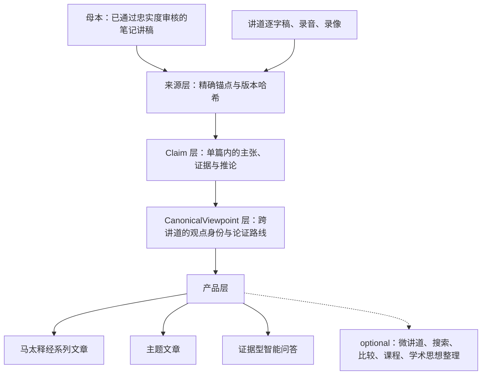

# 王守仁教授知识平台 Solution Architecture

> **读者**：教会同工与 Solution architect。同工要参与审阅，必须能读懂本文——知道这件事为什么这样做，以及自己该做什么、不该做什么。全文不使用系统内部术语；出现的英文名词在首次出现处解释。
> **类型**：规范
> **状态**：当前
> **与代码对齐**：不适用（本文不描述实作细节）
> **权威范围**：分层理由、约束、产品优先级与掉头条件。下游设计与本文冲突时，先改本文并记录决定，不在下游打补丁。

### 目录

- [1. 要解决的是什么问题](#1-要解决的是什么问题)
- [2. 谁在用，各自拿到什么](#2-谁在用各自拿到什么)
- [3. 同工做什么，以及不做什么](#3-同工做什么以及不做什么)
- [4. 四层，以及不要它会怎样](#4-四层以及不要它会怎样)
- [5. 四条约束](#5-四条约束)
- [6. 三个目标产品，其余 optional](#6-三个目标产品其余-optional)
- [7. 最大风险：误述教授](#7-最大风险误述教授)
- [8. 明确不做](#8-明确不做)
- [9. 接受了什么代价](#9-接受了什么代价)
- [10. 什么情况该掉头](#10-什么情况该掉头)

## 1. 要解决的是什么问题

教会同工提出过两个问题，原话记录在[同工反馈到产品需求与验收标准](./stakeholder_feedback_to_requirements_v1.md)：

> 我们都说教授讲得好，可是教授讲了什么、到底好在哪里，没人说得出来。
>
> 平常经常听教授讲因信成义，有没有人总结一下？

这两个问题有一个共同点，它决定了整个架构：

> **它们都是跨讲道的问题。任何单篇讲道里都答不出来。**

「好在哪里」拆开是：问题是否说清楚、证据如何使用、推论是否完整、如何处理原文与译本、**不同讲道之间是否形成稳定的方法**。最后一项本身就是跨篇的。「有没有人总结因信成义」更是——教授在多年多处讲过，没有哪一篇是「那一篇」。

所以本平台不是把讲道整理得更好看的流水线。它要建立一个能承载跨讲道提问的知识基础，并由它驱动读者实际拿到的成果。

## 2. 谁在用，各自拿到什么

| 角色 | 他今天的处境 | 平台给他什么 |
| --- | --- | --- |
| **外教会的基督徒** | 从搜索或链接落到某一页，跟王教授没有关系，没有信任前提 | 成篇可读的释经与主题文章；每一句重要主张都能当场看到它出自哪篇讲道的哪一段，以及录音的哪个时间 |
| **本教会同工** | 说得出「教授讲得好」，说不出好在哪里 | 能回答开头那两个问题；能参与审核，而**不需要承担神学裁决**——他判断的是「这句是不是教授说的」，不是「教授说得对不对」 |
| **负责人** | 是这项工作的主力，也是唯一能做终审的人 | 每交付一篇成果，需要他本人做的决定尽可能少 |

内容以**本教会的名义**发布。新写成的文章由编辑部承担作者与编纂责任；王教授是思想与讲授材料的来源，不署名为他未曾逐章撰写的作品作者。对一个不认识他的读者，这条署名边界和来源可追溯合起来，就是他判断「这是不是教授真讲的」的全部依据——所以它们是**读者页面上的产品功能**，不只是内部审计机制。

## 3. 同工做什么，以及不做什么

同工是这套系统的审阅人。这一节说清楚会有什么递到你面前、你要判断什么、什么不归你判断，以及为什么这样分。

### 你会拿到什么

**不是全部候选材料。** 两百多篇讲道会产生上万条候选记录，逐条看完是不可能的，也不必要。递到你面前的只有两类：

1. **两个 AI 谈不拢的地方。** 系统用两个不同的模型互相独立复核。程序能直接判死的先判死；两个模型看法一致的直接通过；只有它们意见不同、又没有客观依据能裁决的，才留给人。
2. **一份成果发布前的终审。** 是对整篇文章的一次确认，不是对它用到的每一条主张各确认一次。

### 你要判断什么

每一条都对着摆在你面前的原话、经文和录音位置回答，不需要你去别处查：

| 你回答的问题 | 例子 |
| --- | --- |
| 这句是不是教授说的？ | 对照逐字稿高亮和录音时间 |
| 经文引用记录得准不准？ | 章节、译本、教授实际读的字句 |
| 从前提到结论，中间有没有缺步骤？ | 结论是否真的从他给的理由推得出来 |
| 这条属于哪一类？ | 教授明确说的 / 从他论证直接推出的 / 编辑归纳的 / 还没解决的问题 |
| 两条内容该合并、分开，还是标为彼此延伸？ | 同一个意思的两次表达，还是两件事 |

### 你不需要判断什么

> **教授说得对不对，不归你判断，也不归系统判断。**

这不是客气，是分工。本平台记录教授教导了什么，不裁定他是否正确（见第 7、8 节）。你判断的是**忠实性**——这句话是不是他说的、有没有被歪曲——不是**真理性**。

这条边界让审阅工作可以分给更多人：判断忠实性需要的是对照原始材料的耐心，不需要神学裁决的权柄。

### 为什么这样分

人的时间是这个平台最稀缺的东西。所以设计上的次序是：**能程序判的先判死，两个模型一致的直接过，实在判不了的才转人工。** 你看到的每一条，都是前面几道都过不了的。

由此有一条你可以据以反馈的标准：

> **如果一条递到你面前的判断，需要你离开当前页面去别处研究才能回答，那是系统的缺陷，请报告它。**

正常情况下，一条判断应该在几秒到几分钟内、凭眼前的证据就能答。做不到，说明证据没有备齐，或者这条根本不该转人工——两种都要回头改系统，而不是要求你多花时间。

## 4. 四层，以及不要它会怎样

| 层 | 它保存什么 | 不要它会怎样 |
| --- | --- | --- |
| **来源** | 原始讲道、笔记、媒体、逐字稿，以及每条内容的精确位置与版本哈希 | 无法回答「你怎么知道教授这样说」。这是使命层的底线，不可谈判 |
| **Claim** | 单篇之内：教授在回答什么问题、提出什么主张、引什么经文、怎样从经文推到结论、反对哪种解释 | 只能从来源直接写文章。那样就无法回答「他别处讲过吗」，文章会变成唯一权威，问答只能从文章里反猜主张。详见[知识层详细设计 §1.2](./knowledge_platform_design.md) |
| **CanonicalViewpoint** | 跨讲道：**观点本身**，以及它在不同讲道里各自的论证路线 | 只能说「这 12 条主张彼此相关」，不能说「教授对因信成义的看法是」。而第 1 节那两个问题恰恰只能用后者回答 |
| **产品** | 文章、主题论述、问答 | —— |

### 来源层有两条路径，信任级别不同

这是架构级的区别，不是流程细节：

- **母本**——已经通过忠实度审核的笔记整理讲稿，以 `verified_notes_manuscript` 身份**直接进入结构抽取**，不重复生成讲稿，也不重复执行同一轮忠实度审核。
- **讲道**——录音、录像与逐字稿，进入详细抽取与来源审核。

两者最终汇入同一个 Claim 层，在主张层做重复、补充、限定与张力对齐。区别在于**母本已经有人审过**，讲道没有。由于人工是本平台最稀缺的资源（第 5 节），这个区别直接决定成本，必须显式建模，不能把两者当成同一种输入。

### Claim 与 CanonicalViewpoint 的区别

一句话：**Claim 是「某篇讲道里的一次表达」，CanonicalViewpoint 是「他的观点」本身。**

同一个观点在五篇讲道里出现，就是 1 个 CanonicalViewpoint 和 5 条 Claim。没有这一层，「教授对 X 的看法」这个句子在系统里没有对应的东西可指。

## 5. 四条约束

这四条不是偏好。任何新方案都要说明它对这四条的影响；说不通的方案就不做，无论它别处多好。

### 5.1 负责人是瓶颈，也是单点

同工可以帮助，但终审只有一个人能做。因此衡量设计好坏的数不是模型准确率，是：

> **每发布一篇成果，需要负责人本人做几次决定。**

这个数越小越好，其他一切让位于它。[知识层详细设计](./knowledge_platform_design.md) 已经把「编辑产能是一级系统约束」写成原则，本文把它变成一个可以互相比较的数——两个方案哪个好，比这个数，而不是比谁听起来更周全。

### 5.2 语料是增量的

现有两百多篇讲道之外，还有大量笔记尚未整理。因此：

- **任何「新材料进来要重跑全库」的设计出局。** 新讲道必须能增量挂接到已有观点上。
- 由此得到一条可以直接用来否掉方案的标准：

> **每新进一篇讲道所需的人工决定次数，必须趋近于零，而不是保持常数。**

一个「每进一篇新讲道就产生若干条待负责人裁决」的设计，在材料还会不断增加的前提下是不成立的：处理得越多，积压越多。

### 5.3 自动化是默认，转人工是需要理由的例外

实在无法自动化的才转为人工处理。人只应拿到两样东西：

1. **两个 AI 真的谈不拢的**——程序按规则判不了，两个模型也不一致；
2. **发布前对交付物的一次终审**——而且是每份交付物一次，不是每条主张一次。

其余全部由机器判掉：能按规则判的先判，一旦不符合规则就直接拒绝而不是放行（宁可挡住，不可放过）；两个模型看法一致的直接通过。

这和使命层的「保留人工审核」不矛盾。人是**忠实性的裁决者**，这一点不可取消；能压的是他要决定几次、每次多贵。现有文档中把「保留人工审核」读成「凡事都要人看」的表述，方向是反的。

### 5.4 AI 不得发明新观点

模型的工作是**挑选和组织**，不是产生内容主张。文章的**文字**可以是新的，**主张**必须条条落回已批准的来源。

这条最要紧的性质是：**它可以被机器查出来，不必靠人一句句审。**

做法是：模型每输出一条内容，必须同时标明它用的是交给它的哪一条材料（哪一条主张、哪一个观点、原文的哪一段）。凡是标不出来、或者标的东西根本不在交给它的材料里，程序直接拒绝——这是机械比对，不需要判断力。

所以「不许发明」不是一条要靠人力去守的纪律，而是一道应该自动化的闸。它和上一条（5.3 自动化优先）互相加强：最危险的失误，恰恰是最容易被机器抓住的那一种。

## 6. 三个目标产品，其余 optional

| | 产品 | 状态 |
| --- | --- | --- |
| 1 | 马太福音释经系列文章 | **目标** |
| 2 | 主题文章 | **目标** |
| 3 | 证据型智能问答 | **目标** |
| | 微讲道、经文与主题搜索、思想发展比较、课程、学术思想整理 | optional |

「讲座」是这三样成果的口头叫法，交付物就是**文章**：读者在网页上读文字，配教授原声片段。

两点必须分清：

- **检索是智能问答的基础设施，必须有；「搜索」作为独立的读者产品是 optional。** 结论是：建检索，不建搜索 UI。
- 下游契约按 optional 产品预留的复杂度，应当重新评估。跨讲身份层的消费契约是按九个下游设计的，实际只需撑三个。

optional 不等于错误或废弃。它们的设计文档继续保留，只是不与三个目标产品并列，也不构成任何取舍的理由。

## 7. 最大风险：误述教授

最坏的结果不是系统不好用，是它**替教授说了他没说过的话**——尤其面对一个不认识他、无从核对的外教会读者。

每一层对这个风险各有分工：

| 层 | 它挡住什么 |
| --- | --- |
| 来源 | 「他有没有说过」——每条主张连回原话、页码或录音时间 |
| Claim | 「这是他说的，还是从他的话推出来的，还是编辑归纳的」——四种归属必须分开标注：教授明确主张、论证结论、编辑归纳、待研究问题 |
| CanonicalViewpoint | 「把两个不同的观点误合成一个」——归并需要证据，宁可分开保留张力，不做表面调和 |
| 产品 | 「文章为了流畅删掉限制条件或不同意见」——出版体例与程序化审计 |

**本平台不做神学判断。** 它记录教授教导了什么，不裁定他是否正确。教授没有回答的问题，不由系统补成答案。

## 8. 明确不做

- 不按编辑者预设的神学体系给讲道分类；
- 不把 AI 生成的总结或推论当作教授原话；
- 不为文章流畅而删除重要证据、限制条件或不同意见；
- 不把教授没有回答的问题擅自补成答案；
- 不宣称两百多篇讲道包含教授全部思想；
- 不以整理后的文章取代原始讲道、录音、逐字稿和笔记。

## 9. 接受了什么代价

诚实记录，便于日后判断值不值：

1. **多了一层跨讲身份，就多了一类判断**：两条主张是不是同一个观点。这类判断部分需要人。换来的是跨讲提问可回答，以及新讲道能增量挂接而不必重跑全库。
2. **三个产品优先，六个延后**。延后的那些不会自己变好，恢复它们时要重新评估契约。
3. **不做神学判断**，意味着系统永远不会替读者结论「教授是对的」。这是有意的，也意味着平台的价值上限是「让人看清他怎么讲、凭什么这样讲」。
4. **出版形态暂不确定**。成书体例作为 profile 保留，代价很小，不因此为纸质优化。

## 10. 什么情况该掉头

写下来，免得日后只能凭感觉争论：

- **跨讲身份层**：如果每新进一篇讲道所需的人工决定次数不下降，这一层没有兑现它在第 4 节给出的理由，应当重新论证或退役。
- **同样地**，如果三个目标产品都能在不使用跨讲身份层的情况下按质交付，这一层是多余的。
- **人机分工**：如果同工无法在「不做神学判断」的前提下清空他那部分队列，说明分工划错了，要改的是分工，不是要求同工承担神学裁决。
- **自动化边界**：如果转人工的比例长期不降，说明 5.3 只是愿望，不是设计。
- **信任叙事**：如果外教会读者在页面上仍然无法自行核对一条主张的出处，第 2 节承诺的东西就没有交付，无论内部数据多完整。

## 相关文档

- [Project Mission Statement](./project_mission_statement.md)——本计划为什么存在，忠实与署名的底线
- [知识层详细设计](./knowledge_platform_design.md)——知识对象、问答设计、审核机制的细节
- [共享知识模型](./shared_knowledge_model_v1.md)——对象的意义与边界
- [Canonical Viewpoint Registry 设计](../canonical_viewpoint_registry_design_v1.md)——跨讲身份层的架构权威
