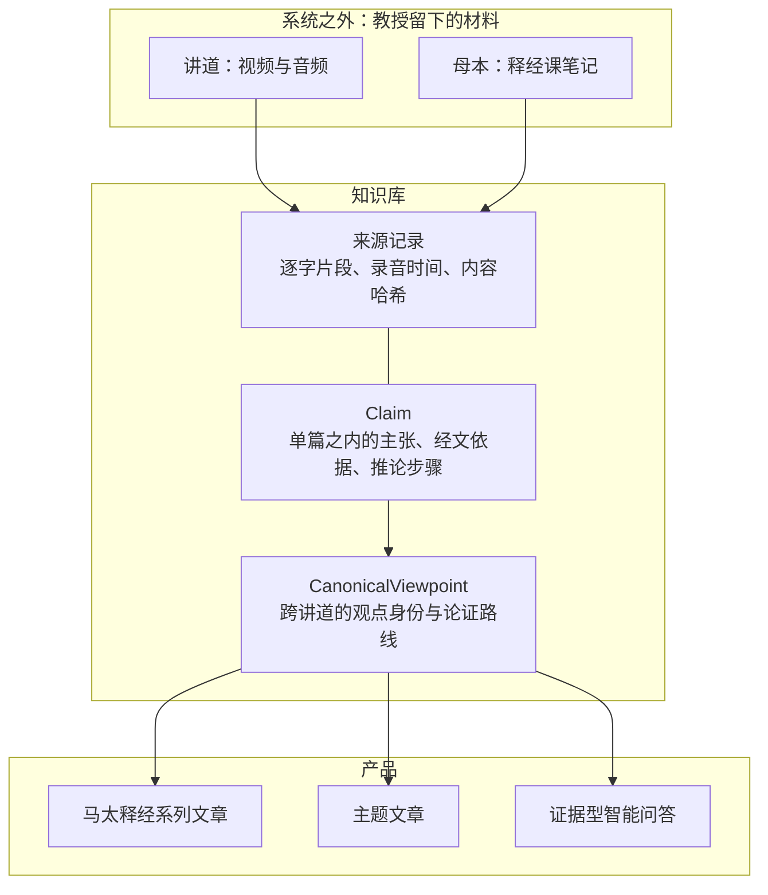

# 王守仁教授知识平台 Solution Architecture

> **读者**：教会同工与 Solution architect。同工要参与审阅，必须能读懂本文。全文不用系统内部术语；英文名词在首次出现处解释。
> **类型**：规范
> **状态**：当前
> **与代码对齐**：2026-08-25（第 4 节 D1／D2 引用的数字取自当日 Registry 快照与仓库）
> **权威范围**：第 4 节的关键决策与第 2 节的质量属性。下游设计与本文冲突时，先改本文并记录决定，不在下游打补丁。

## 目标

> **系统整理王教授的观点和论证，每一条都可查证、可回溯。**

「整理」是本计划自己的词——使命图的中心节点是「整理、保存並重建教授的思想」，同工问的也是「有没有人整理一下」。它比「记录」重：记录只是把话写下来；整理要认出同一个观点的反复、保留不同场合的侧重、把他分散讲出的论证连起来。

**但整理不是建构。** 整理的对象只能是他讲过的东西：不替他补答案，不按编辑者预设的神学体系给他分类，编辑归纳必须与教授原话分开署名。

## 术语

全文只用这十个词。左边是本文和同工之间的说法，右边是它在代码与数据库里的名字——两边指的是同一样东西，同工不必记右边，developer 照右边找。

| 术语 | 定义 | 代码与数据里 |
| --- | --- | --- |
| **讲道** | 教授视频与音频的逐字稿，同工校对过 | `source_type = sermon_transcript`（26 篇） |
| **母本** | 教授**释经课笔记**生成的逐字稿，同工也校对过。与讲道的区别不在可信度，在形态：讲道是口语，母本本来就是组织过的 | `source_type = notes_manuscript`（9 篇） |
| **来源记录** | 对来源的记录：教授原话的逐字片段、它在录音里的时间、这份来源的内容哈希。**原件（逐字稿与笔记文件）在系统之外的文件系统上** | `source_documents`／`source_fragments` |
| **主张** | 教授在**某一篇**里提出的一个判断，连同他引的经文，和从经文推到结论的步骤 | `Claim`／`evidence_steps` |
| **观点** | **「他的观点」本身**，跨讲道。同一个观点在五篇讲道里讲过，就是 1 个观点、5 条主张 | `CanonicalViewpoint` |
| **论证路线** | 同一个观点在某一篇讲道里的论证方式。一个观点可以有多条路线 | `ArgumentRoute` |
| **知识库** | 上面三样合起来。它做的事就是[目标](#目标)那句话 | PostgreSQL `wang_knowledge` |
| **归属** | 每条内容必须标明是四类里的哪一类：**教授明确主张／论证结论／编辑归纳／待研究问题**。四类不能混 | `attribution` |
| **程序化审计** | 发布前机器跑的一轮机械检查：正文每个实质段落能否映射回主张、经文或明示的编辑声音；来源锚点是否仍指向正确版本。**不判断文笔**，不代替编辑的阅读判断 | Program Audit |
| **主数据管理（MDM）** | 一个通用做法的名字：同一样东西在很多地方出现过时，得有个地方说清楚**哪个是准的、以及凭什么**。教授的观点正是这样的东西 | 见 [D1](#d1观点身份用-registry-式-mdm不用合并式) |

### 目录

| 节 | |
| --- | --- |
| [术语](#术语) | 十个关键词的定义，以及它们在代码里的名字 |
| [1. 背景与驱动](#1-背景与驱动) | 为什么做这件事，以及语料的实际状况 |
| [2. 质量属性](#2-质量属性) | 四项可度量目标，以及现在测没测 |
| [3. 架构总览](#3-架构总览) | 知识库的三个 component，以及它依赖什么 |
| [4. 关键决策](#4-关键决策) | D1–D6，每条含备选与否决理由 |
| [5. 运营：谁在用，同工做什么](#5-运营谁在用同工做什么) | 三类使用者；同工会拿到什么、判断什么、不判断什么 |

## 1. 背景与驱动

教会同工提出过两个问题，原话记录在[同工反馈到产品需求与验收标准](./stakeholder_feedback_to_requirements_v1.md)：

> 我们都说教授讲得好，可是教授讲了什么、到底好在哪里，没人说得出来。
>
> 平常经常听教授讲因信成义，有没有人总结一下？

**这两个问题都是跨讲道的，任何单篇讲道里都答不出来。** 这一点决定了整个架构。「好在哪里」拆开是：问题是否说清楚、证据如何使用、推论是否完整、如何处理原文与译本、**不同讲道之间是否形成稳定的方法**——最后一项本身就是跨篇的。

语料的实际状况，同样是约束：

| | |
| --- | --- |
| 材料 | 两百多篇讲道的视频与音频（逐字稿经同工校对），以及教授释经课笔记生成的逐字稿（母本，也经校对） |
| 增量 | **还有大量笔记未整理。**这不是一个会做完的存量 |
| 人力 | 负责人为主，同工帮助。**负责人是瓶颈，也是单点** |
| 交付 | 放在网上。出版形态暂不确定 |

## 2. 质量属性

本平台的成败不按模型准确率衡量。四项可度量目标：

| 属性 | 定义 | 目标 | 现状 |
| --- | --- | --- | --- |
| **可追溯** | 公开文章中每条实质主张能解析到来源片段与录音位置的比例 | 100%，达不到不发布 | 已在执行：发布前有一轮**程序化审计**，机器逐条核对正文每个实质段落能否映射回教授的主张、经文或明示的编辑声音，以及引用的来源锚点是否仍指向正确版本；不通过不发布。它不判断文笔（见[释经初稿的程序化审计流程](../30-authoring/editorial_draft_audit_workflow_v1.md)） |
| **可审核** | 同工判断一条所需时间 | 几秒到几分钟，凭眼前证据 | **未测** |
| **增量成本** | 每新增一篇讲道，需要负责人做几次决定 | **趋近于零**，而不是保持常数 | **未测，无基线** |
| **人工成本** | 每发布一篇成果，需要负责人做几次决定 | 逐篇下降 | **未测，无基线** |

后三项没有基线。**在有基线之前，任何「这样更省事」的判断都没有依据**，包括本文第 4 节的部分理由。建立基线是已知欠账，负责人已定为较低优先级。

「增量成本趋近于零」是可以直接否决方案的判据：一个「每进一篇新讲道就产生若干条待负责人裁决」的设计，在材料还会不断增加的前提下不成立——处理得越多，积压越多。

## 3. 架构总览

教授留下的材料在**系统之外**。系统里是两样：**知识库**和**产品**。

知识库要做的就是目标那句话。它内部三个 component，因为那句话有三段：

| 这一段 | 由谁承担 | 少了它会怎样 |
| --- | --- | --- |
| **观点** | [观点](#术语) | 只能说「这 12 条主张彼此相关」，不能说「教授对因信成义的看法是」 |
| **论证** | [主张](#术语)与[论证路线](#术语) | 只剩结论，读者不知道他凭什么这样讲 |
| **可查证、可回溯** | [来源记录](#术语) | 谁也无法核对这是不是他说的 |

三个 component 的内部细节见[知识库详细设计](./knowledge_platform_design.md)与 [Canonical Viewpoint Registry 设计](../canonical_viewpoint_registry_design_v1.md)。

### 知识库依赖它不拥有的文件

来源文档记录里**没有正文字段**。逐字稿 JSON 与母本 Markdown 是文件系统上的文件，抽取时按 `transcript_id` 现读（`backend/pipeline/knowledge_source.py`，找不到即 `FileNotFoundError`）。知识库里只有三样：认得出是哪一份、验得出它没被改过、以及被引用片段的逐字副本。

后果分两半：**已发布文章的读者核对不受影响**（片段是副本，自带录音时间）；但**重新抽取做不了**，新的观点归并也做不了。那批文件需要与数据库同等的备份对待。

## 4. 关键决策

每条格式相同：决策、备选、为什么否、后果。

### D1　观点身份用 registry 式 MDM，不用合并式

观点身份是一个 [MDM](#术语) 问题，所以这一层不是自创结构，是一个成熟模式。MDM 有两种做法，本平台只能用后一种。

**决策**：观点身份分三层记录——来源里的**主张**、把主张挂到观点上的**连接记录**、**观点**本身。来源主张全部原样保留，不改写。

**备选**：合并式 MDM——从多个来源挑出或拼出一条「黄金记录」，来源退居其次。

**为什么否**：合并等于把教授某一次的措辞提升为「标准原话」，其余抹掉。用在姓名地址上合理（挑一个最完整的地址即可），用在他的话上就是误述教授。观点层保存的是审核过的编辑归一化文字，**它不冒充教授原话**，来源主张一条不少地留着。

**后果**：这一层看着重，重的是 MDM 的重量——判断两条主张是不是同一个观点、观点改写时保留旧版并指明由谁取代、成批写入前先验证再一次性生效、每条记录带审核状态。这些是主数据治理的标准零件，不是为本项目发明的复杂度。**是否值得，按第 2 节的人工成本评，不按设计文档有多少行评。**

**证据**：太 16:19 中「捆綁可用于事」与「释放可用于人」是两个各自独立的观点，没有被合并；限定二者的第三个观点（标准已先由神在天上决定）也独立保留。合并式做不到这一点。

### D2　不做检索直答

**决策**：问答从审核过的观点与论证生成，不从检索到的原文段落直接生成。

**备选**：把两百多篇逐字稿做成向量索引，检索后交模型作答（RAG）。

**为什么否**：**本项目走过这条路**——向量索引从 2024 年 5 月的 36 MB 长到 2025 年 5 月的 952 MB（`vector_store/smart_answer.tensor`），路由实验留在 `routing.ipynb`。主要毛病不是编造，是**回答不完整**：检索取回最相似的前几段，而一个观点常散在多篇讲道里（「磐石不是彼得」有 11 条主张、分布在 6 篇来源），只取最相似的前几段必然覆盖不全，漏掉的可能正是他的限定。

**这比编造更麻烦，因为答案读起来是完整的。** 少一个限定的答案没有一句是假的，却已不是教授的意思。遗漏与编造一样是误述教授，只是遗漏不会被一眼看出来。

**后果**：问答必须区分**完整回答／只能部分回答／现有语料未回答**；部分回答须明说缺什么，不得用一般知识补齐。「论证图里找到了一条回答连线」与「内容上真的回答了」要分开记录，不能用前者冒充后者。回答契约必须包含「不同讲道中的扩展或限定」。**删掉其中任何一条，就退回到那个读起来完整、实际漏掉限定的答案。**

### D3　母本与讲道分两条抽取路径

**决策**：母本按 Markdown 空行切块，讲道走逐字稿 JSON，两者使用不同的抽取 prompt；段落编号与来源哈希共用。

**备选**：一条路径处理两类来源。

**为什么否**：两者形态不同。讲道是口语——重复、跳转、离题、现场问答混在一起，论证结构要从话里重建；母本来自教授备课时写下的笔记，表述本来就是组织过的。**注意区别不在可信度，两者都经同工校对。**

**后果与已付代价**：母本那条 prompt 从未要求建立 observation → evidence_step 的关系，四份母本 package 的关系数全是 0，而两条路径的测试都「通过」（#86）。由此得到一条通用要求：

> **凡按来源类型分叉，就必须按类型分别验收。** 否则一条路径上的缺陷不会被另一条路径的测试发现。

### D4　自动化是默认，转人工是需要理由的例外

**决策**：实在无法自动化的才转人工。人只拿两样：模型之间的真分歧，以及每份交付物发布前的一次终审。

**备选**：凡涉及忠实性的判断都由人复核。

**为什么否**：负责人是瓶颈也是单点（第 1 节）。上万条候选记录逐条人看，项目会停在审核积压。

**后果**：这不与使命层的「保留人工审核」冲突——人是**忠实性的最终裁决者**，这点不可取消；可压缩的是请他决定的次数和每次的代价。现有文档中把该原则读作「凡事都要人看」的表述，方向是反的，已更正。

### D5　AI 不得发明新观点，并且这条由机器执行

**决策**：模型的工作是挑选和组织，不产生内容主张。文章的**文字**可以是新的，**主张**必须条条落回已批准的来源。

**备选**：靠人工审阅拦截编造。

**为什么否**：靠人拦是最贵也最不可靠的做法，与 D4 冲突。

**后果**：模型每输出一条内容，必须同时标明它用的是交给它的哪一条材料（哪条主张、哪个观点、原文的哪一段）。标不出、或标的东西不在输入里，程序直接拒绝——机械比对，不需要判断力。**最危险的失误恰恰是最容易被机器抓住的那一种**，所以 D4 与 D5 互相加强而非互相拉扯。

### D6　三个目标产品，其余延后

**决策**：马太福音释经系列文章、主题文章、证据型智能问答是目标。微讲道、搜索、比较、课程、学术思想整理为 optional。

**备选**：九个方向并列推进。

**为什么否**：人力只够三个。并列会让读者与实现者分不出主次。

**后果**：跨讲身份层的对外契约是按九个下游设计的，实际只需撑三个。为 optional 产品预留的那部分复杂度——覆盖率披露的档次、证据合格度的分级、按篇编译的知识切片——应据此重新评估。另外：**检索是问答的基础设施必须有，「搜索」作为读者产品是 optional——建检索，不建搜索 UI。** optional 不等于错误，其设计文档继续保留，只是不与三个目标并列。

## 5. 运营：谁在用，同工做什么

| 角色 | 他今天的处境 | 平台给他什么 |
| --- | --- | --- |
| **外教会的基督徒** | 从搜索或链接落到某一页，跟王教授没有关系，没有信任前提 | 成篇可读的文章；每一句重要主张都能当场看到出自哪篇讲道的哪一段、录音的哪个时间 |
| **本教会同工** | 说得出「教授讲得好」，说不出好在哪里 | 能回答第 1 节那两个问题；能参与审阅，而**不承担神学裁决** |
| **负责人** | 是主力，也是唯一能做终审的人 | 每交付一篇成果，需要他本人做的决定尽可能少 |

内容以**本教会的名义**发布。新写成的文章由编辑部承担作者与编纂责任；王教授是思想与材料来源，不署名为他未曾逐章撰写的作品作者。对不认识他的读者，署名边界加上来源可追溯，就是他判断「这是不是教授真讲的」的全部依据——所以那是**读者页面上的产品功能**，不只是内部审计机制。

### 同工会拿到什么

**不是全部候选材料。** 两百多篇讲道会产生上万条候选记录，逐条看完不可能也不必要。递到同工面前的只有两类：

1. **两个 AI 谈不拢的地方。** 程序按规则能判的先判；两个模型看法一致的直接通过；只有它们不一致、又没有客观依据可裁决的，才留给人。
2. **一份成果发布前的终审。** 对整篇文章确认一次，不是对它用到的每条主张各确认一次。

### 同工要判断什么

每一条都对着眼前的原话、经文和录音位置回答，不需要去别处查：

| 判断 | 例 |
| --- | --- |
| 这句是不是教授说的 | 对照逐字稿高亮与录音时间 |
| 经文引用记录得准不准 | 章节、译本、他实际读的字句 |
| 从前提到结论有没有缺步骤 | 结论是否真能从他给的理由推出 |
| 这条属于哪一类 | 教授明确说的／从他论证直接推出的／编辑归纳的／还没解决的 |
| 两条该合并、分开，还是彼此延伸 | 同一个意思的两次表达，还是两件事 |

### 同工不判断什么

> **教授说得对不对，不归同工判断，也不归系统判断。**

这是分工，不是客气。平台记录他教导了什么，不裁定他是否正确（第 5 节最后）。同工判断的是**忠实性**——是不是他说的、有没有被歪曲——不是**真理性**。这条边界让审阅可以分给更多人：判断忠实性需要对照原始材料的耐心，不需要神学裁决的权柄。

### 同工可以据此反馈

> **一条递到面前的判断，如果需要离开当前页面去别处研究才能回答，那是系统的缺陷，请报告。**

正常情况下一条判断应在几秒到几分钟内、凭眼前证据答完。做不到，说明证据没备齐，或这条根本不该转人工——两种都要回头改系统，而不是要求同工多花时间。

## 相关文档

- [Project Mission Statement](./project_mission_statement.md)——本计划为什么存在，忠实与署名的底线
- [知识库详细设计](./knowledge_platform_design.md)——知识对象、双轴组织、问答设计、审核机制
- [共享知识模型](./shared_knowledge_model_v1.md)——对象的意义与边界
- [Canonical Viewpoint Registry 设计](../canonical_viewpoint_registry_design_v1.md)——跨讲身份层的架构权威
