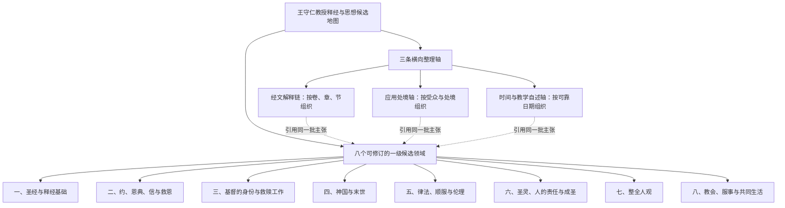

# 王守仁教授释经与思想候选基线 v3

> **读者**：神学编辑
> **类型**：记录
> **状态**：当前
> **与代码对齐**：不适用
> **权威范围**：205 篇普查后于 2026-08-07 批准的 8 个候选领域与 3 条轴。这是候选结构，不是已批准专题。

> 状态：`candidate baseline v3`。结构由项目负责人于 2026-08-07 批准，依据 205 篇 published + reviewed transcript 的第一遍普查和 17 个跨讲道候选归组审核建立。这里批准的是候选目录结构，不是内部 3,752 条 candidate claims，也不是神学事实核查结论。

## 一、v3 的意义

v3 不把机器生成的 17 个候选归组平铺成 17 条思想。它将释经方法、神学思想、具体经文解释、教会实践、生活应用和时间自述重新分层。

与 v2 相比，本版有三项正式决定：

1. 新增“教会、服事与共同生活”为第八个一级**候选**领域；
2. 拆开机器归组中的“整全人、罪、成圣”：人论归第七领域，罪的关系破坏归第二领域，成圣归第六领域；
3. 教学使命与证据纠偏自述暂留时间轴，不把少量自述提前写成教授思想发展的历史结论。

八个一级领域仍然可以随新证据和人工审核新增、合并、拆分或改名。“八”不是教授本人提出的教义数目。

## 二、总体结构

三条横向轴不是另外三套知识。一个经过审核的主张可以属于某个候选领域，同时被经文、应用处境和时间索引引用。

## 三、八个一级候选领域

### 一、圣经与释经基础

#### 1.1. 圣经默示、正典认出与规范性权威

- 圣经被理解为神所默示的话；
- 教会认出使徒书卷的权威，而不是赋予它们权威；
- 基督及使徒见证在启示中的终极性；
- 因为圣经具有规范权威，解释者不能任意把自己的意思读进经文。

“圣经为什么有权威”是神学问题；“怎样准确解释”是方法问题。两者相连但不能混同。

#### 1.2. 证据式综合释经

- 从作者向原初读者传达的意义和文本证据出发；
- 综合上下文、平行经文、篇章结构、历史背景和逻辑；
- 区分观察、推论桥和解释结论；
- 反对断章取义、预设体系、主观亮光或无证据断言代替释经。

#### 1.3. 原文、结构、文体、历史与意义—应用边界

- 重视希伯来文、亚兰文和希腊文；
- 经常检讨和合本及其他译文；
- 使用语法、语义、篇章结构、历史文化和救赎历史位置限制解释；
- 按叙事、比喻、预言、书信和启示文学等文体阅读；
- 经文意义须受文本约束，应用可以多样，却不能反过来制造多个原意。

### 二、约、恩典、信与救恩

#### 2.1. 先行恩典、约关系与顺服回应

宗主国—附庸国之约是教授反复采用的重要框架：宗主先施恩并建立关系，随后提出约中要求；人的顺服是关系中的回应，而不是赚取关系的功劳。

#### 2.2. 证据性的信、关系性的义与相称行动

- 信心不是人的心理力量或反理性盲信，而是按证据接受、信托并行动；
- “义”首先涉及人与神及人与人的合宜关系；
- 义行是促进或符合这种关系的行动；
- 罪会破坏这种合宜关系。

#### 2.3. 独立核心论证：因信成义，而非因信称义

教授在多篇讲道中明确主张：`δικαιόω` 应理解为“成义／成为义”，而不是把本来不义的人仅仅“称作义”或宣告无罪。

本论证不得被上位“义、信与关系”标题遮蔽。系统分别保存：

1. 原文及翻译判断；
2. “人因信真实成为义”的正面主张；
3. 被反对的单纯法庭宣告观点；
4. `δικαιόω`、`λογίζομαι`、语态、亚伯拉罕和上下文等证据步骤；
5. 忠实呈现审核与独立事实核查状态。

#### 2.4. 普世救恩预备、条件性回应与群体性拣选

- 基督是否为所有人预备救恩；
- 实际接受救恩的条件；
- 拣选与预定是个人结局、救赎历史角色还是在基督里的群体；
- 神的主动、人的回应和持续信从怎样彼此关联；
- 教授反对的预定论观点必须与其正面主张分开保存。

#### 2.5. 持续信靠、背弃警告、悔改归回与保守确据

这部分目前保留张力：持续信靠和忠心被关联到最终得救，同时也出现神保守属神儿女的确据语言。系统不得自动消解，而要保存经文范围、受众、条件、后果和教授在各处反对的观点。

### 三、基督的身份与救赎工作

#### 3.1. 神性身份与权柄

- 句首 `Amen` 的宣告权柄；
- “那个人子”与但以理书七章；
- 父子关系、赦罪、安息日和解释律法的权柄；
- 旧约互文、使徒见证和道成肉身。

这些是不同论证入口，不能因为都支持基督神性就被压缩成一个论据。

#### 3.2. 君王、受苦使命与救赎工作

- 弥赛亚君王与受苦仆人的使命；
- 基督主动受死；
- 赎价、挽回和代赎；
- 身体复活；
- 受死、复活与救恩／成义的关系。

### 四、神国与末世

#### 4.1. 神国作为神的统治

- 神国首先表示神作王；
- 耶稣的身份与神国降临；
- 登山变像预尝荣耀国度。

#### 4.2. 已然—未然、来世生命与救恩阶段

- 神国和来世生命已经开始；
- 救恩福分现在真实临到，却尚未完全；
- 完全得胜、身体复活和终局仍在将来。

#### 4.3. 再临与末后完成

- 基督再临作为公开、完整事件；
- 复活、审判和最终得胜；
- 历史灾难、预言和终局怎样区分。

马太福音二十四章、但以理书九章、圣殿毁坏和两阶段再临争论属于经文解释链，与本领域链接但不取代本领域。

### 五、律法、顺服与伦理

#### 5.1. 摩西律法、基督律法与规范性重叠

- 摩西律法的时期和约内范围；
- 新约信徒在基督律法之下；
- 两者可有规范性重叠却不可混同；
- 圣灵帮助信徒顺服。

#### 5.2. 不变原则、处境判断与关系性伦理

- 从原始细则辨认不变原则；
- 保存原始受众、历史文化和命令对象；
- 在目标处境中考虑关系益处、见证、避免绊倒和两难中的较小之恶；
- 婚姻、饮食、政治和教会交通等个案不能互相直接类推。

本分支同时进入应用处境轴；每项应用保留条件和牧养风险。

### 六、圣灵、人的责任与成圣

#### 6.1. 圣灵与恩典真实赋能

- 圣灵赐生命、胜罪和服事能力；
- 恩典使人能够回应和顺服；
- 圣灵的工作不能与父和子割裂。

#### 6.2. 理性、学习、操练与责任

- 圣灵赋能不取消人的理性、选择和责任；
- 信徒需要学习、操练、警醒、抵挡罪并实际顺服；
- 外显经验或特殊能力不能自动证明成熟或圣灵充满。

#### 6.3. 成圣状态与持续成长

- 成圣的定义和可能性；
- 爱神爱人与圣洁生活；
- 已有的成圣状态与持续成长如何区分；
- 罪的分类、关系破坏和救恩后果须在本领域与第二领域之间建立明确关系，而不是合成一条命题。

### 七、整全人观

- 活着的人被理解为不可分割的整体；
- “灵、魂、体、心、里面的人、外面的人”等用语按各处经文判断，不自动构成固定三分或二分模型；
- 死亡时的暂时状态与复活时重新合一需要分别说明；
- 整全人观不能与罪论或成圣论仅因都谈论“人”而合并。

当前保留“整全人”与死亡—复活阶段中里面人／外面人的限定张力，不提前压成固定模型。

### 八、教会、服事与共同生活

本领域根据三组跨讲道材料升格为一级候选。名称刻意不直接称“完整教会论”，因为当前证据同时包含神学判断、经文解释和具体教会实践。

#### 8.1. 真理教导、领袖与恢复性治理

- 教会受圣经真理和天上标准约束，不能任意决定；
- 领袖资格、品格、准确教导和受限权柄；
- 辨识异端和保护群体；
- 管教、责备、悔改、赦免与恢复；
- 分别保存会众、领袖、教导者、受纪律者和外部听众的角色。

#### 8.2. 恩赐、共同造就与聚会秩序

- 恩赐为共同益处和教会造就；
- 不同恩赐用于服事，不作个人优越标志；
- 特殊能力不等于属灵成熟；
- 方言、发言、审查、女性角色和聚会秩序按各自经文及处境保存限定。

#### 8.3. 团契、慈惠、安慰与圣餐共同生活

- 团契以同属基督为根基，并落实为彼此帮助；
- 患难中的安慰和担当；
- 甘心慷慨、慈惠、财务公开和问责；
- 圣餐的记念、省察、悔改和再来盼望。

这些子题共享教会共同生活，却不能彼此替代。

## 四、三条横向整理轴

### 1. 经文解释链

按书卷、章、节组织教授对同一经文问题在不同讲道中的观察、原文判断、推论、结论、限定和未回答问题。它不是神学目录，也不是一篇文章的大纲。

### 2. 应用处境轴

按受众、处境、原则、行动和限制组织婚姻、家庭、教会秩序、伦理选择、患难、服事与群体生活等材料。同一应用仍链接其经文和神学主张。

### 3. 时间与教学自述轴

保存教授的教学使命、自我纠偏和学术立场自述。只有具可靠讲道日期，并能比较同一问题前后立场时，才可提出思想发展、限定或取代关系。

## 五、当前必须保留的张力

1. 持续信心、背弃警告与神保守确据；
2. 普世救恩预备、拣选定义与持续接受条件；
3. 整全人观与死亡—复活中的里面人／外面人；
4. 可达成圣状态与持续成长；
5. 关系中顺服与救恩非功德性；
6. 马太福音二十四章中的历史灾难、再临与启示文体。

这些张力进入审核队列，不为目录整齐而自动解决。

## 六、版本与审核边界

- 本版结构决定来源：[17 个候选归组结构审核 v1](../archive/candidate_group_review_205_v1.md)；
- 205 篇设计压力测试：[总体设计验证 v1](../archive/full_corpus_205_design_validation_v1.md)；
- 原始机器综合：`$DATA_BASE_DIR/wang-knowledge-platform/staging/corpus-survey/synthesis/full-corpus-205/full-corpus-thought-map-candidate-v1.json`；
- v2 保留为历史版本，不被删除；
- 结构批准不改变 claims 的 `candidate` 状态；
- 进入文章、问答或公开目录的实际主张，仍按交付物建立最小审核子图。
