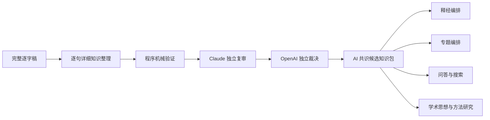
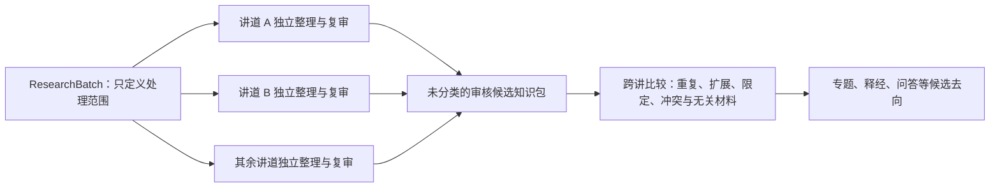

# 逐句详细知识整理与双模型复审流程 v1

> **读者**：Developer
> **类型**：流程
> **状态**：当前
> **与代码对齐**：未核对
> **权威范围**：逐句详细知识整理与双模型复审的执行步骤。

> 状态：已完成代码实现，并以 `011WSR01` 的完整逐字稿进行真实试运行。本流程建立可审核的候选知识，不进行神学批评，也不自动批准或出版内容。

## 一、这一步解决什么问题

第一遍全库普查回答“二百多篇讲道大致讲了什么、哪些材料值得优先处理”。它提供广度，却不能直接承担出版、问答或思想研究所需的精确证据。

逐句详细知识整理回答另一组问题：

- 教授正在回答什么问题？
- 哪些话是教授自己的主张，哪些是听众发言或教授准备驳斥的观点？
- 教授用了哪些经文、原文、历史背景和推理步骤？
- 一条结论由哪些证据支持，主张之间又有什么关系？
- 每项内容能否回到逐字稿中的确切原话和时间位置？

它不是把讲道直接改写成文章，而是先建立一份可由释经、专题、问答、搜索和学术思想研究共同使用的候选知识子图。



## 二、模型选择

| 工作 | 默认模型 | 设置 | 原因 |
|---|---|---|---|
| 逐句详细知识整理 | `gpt-5.6-sol` | medium，32,000 output tokens | 需要长上下文、严格 JSON、精确归属和复杂论证关系；medium 是质量与成本的默认平衡点 |
| 独立来源忠实度复审 | `claude-sonnet-5` | 模型默认 adaptive thinking | 使用不同模型家族减少同源盲点；只审来源忠实度，不做神学批评 |
| OpenAI 仲裁 | `gpt-5.6-sol` | medium | 必须重新阅读同一来源，不能盲从 Claude |
| Claude 再审 | `claude-sonnet-5` | 同上 | 仅在 OpenAI 拒绝 Claude 意见时运行 |

只有来源异常复杂、模型持续分歧或结构判断特别困难时，才把单篇或单项升级为更高推理档位；不能把最高成本设置当作全库默认。

## 三、数据对象

一次详细整理产生以下对象。模型生成的 `CL001`、`E001` 只是一次响应内的序号，不能证明跨次抽取的对象身份。存储前必须用「来源稳定键 + model-generation fingerprint + 规范化模型输出 SHA256」组成的 generation namespace 将所有对象和关系 ID 全局化：同一模型输入、同一输出的精确重跑得到同一组 ID；输入或输出不同就得到互不相交的一代 ID，绝不能用相同序号更新旧语义并继承它的 review/CVR 状态。物理 JSON 的 SHA 只是读取时审计信息，不能因 editor comment 改动而制造一代新的教授主张。

cross-section 是第二次模型调用，不能借用第一遍 extraction 的 generation namespace。它的 relation ID 使用「父 extraction generation + cross-section 输入 fingerprint + 规范化 cross-section 模型输出 SHA256」组成的子代 namespace；因此两次不同回答里的 `XER001` 也绝不会被解释为同一条边。

- `Question`：教授或听众实际提出的问题；
- `PositionNode`：教授转述并赞同、限定或反驳的立场；
- `Observation`：经文、原文、文体、上下文、历史文化等观察；
- `EvidenceStep`：教授论证中的证据或推理步骤；
- `Claim`：教授明确提出或由其论证直接支持的候选主张；
- `EvidenceRelation`：证据步骤之间的支持、回答、限定和反驳；
- `ClaimRelation`：主张之间的支持、解释、限定、反驳和发展关系；
- `SourceFragment`：绑定来源版本、段落版本和逐字引文的精确锚点。

所有模型输出默认是 `candidate`。AI 共识修正后的结果仍是 `not_human_approved`，不能因此自动公开出版。

## 三点五、第一遍抽取的单位是章节，不是整篇

### 为什么改

整篇一次读完，模型做的是**取舍**，不是**穷举**。太16:21–23 母本在 #86 修复之后，132 句实质散文只有 66 句进入论证层（50%）；输出用了 32,000 上限中的约 18,000，所以不是被截断，是它自己选的。

试过两种做法：

| | 调用次数 | 实质散文 | 生产机械校验 |
|---|---:|---:|---|
| 整篇一次问 | 1 | 50% | — |
| 滑动窗口（5 段一块，曾实作） | 26 | 98% | PASS |
| **`##` 章节 + 逐句自检** | **4** | **100%** | **PASS** |

**起作用的不是把材料切碎，是把问题问死。** 整块 1391 字一次给模型仍是 100%——「整理出论证层」是开放问题，无法从内部验证；「这 42 句，一句一句交代」有答案，而且答案可以核对。滑动窗口那一整套切碎、重叠、归属去重、跨窗口补边的机器，解决的是一个列句子清单就能解决的问题，因此退场。

### 为什么以 `##` 作为分组边界

`##` 是 editorial structure，不是教授原话；它只为模型标示分组边界，不进入来源句子、locator、anchor 或 SourceFragment。对已有编辑结构的母本，笔记管线一个 `##` 生成一个 unit（`stage1_units.json` 记录本母本四个 unit，正好是四个 `##`），实测也印证：抽取产出的 264 条关系，**0 条跨 `##`**。

`###` 以下不是边界，是单元**内部**的编辑骨架——釋經 / 神學意義 / 生活應用 / 附錄。20 条远距离关系**全部**跨 `###`：编辑把事实放在「釋經」，把由它推出的一步放在「神學意義」。按 `###` 切，切的正是 `load_bearing` 要保住的那条边。

### 逐句自检

- prompt 末尾列出本章节每一句，各带一个 ID；schema 的 `sentence_audit` 每句恰好一条。
- `extracted` 必须有**锚点落在这一句上**；`not_extracted` 必须写理由。
- **「意思相近、已被别处涵盖」不算 `extracted`。** 这条是实测出来的：Opus 自报 4 句 `extracted`，理由写「已由 O7/E4 涵蓋」「與 E5 同義」——它答的是「这材料在不在」，ledger 问的是「锚点落没落在这句上」。只有后者是下游每一道闸门看得见的，所以只认后者。
- 程序逐句核对自报与锚点，不符即整次失败退回重试。

### 合并

章节不重叠，所以合并就是拼接：`combine_sections` 加上各章节的 ID 前缀，没有归属规则、没有跨度匹配、没有去重。`load_bearing` 校验也不再延后——章节内含它所推出的那一步，完整合约在单次调用内就能判。

### Subscription transport 分片

一次 Codex subscription 调用的 900 秒上限是每个 section 的边界，不是整篇讲道的边界。实测 125 句的 section 约四分钟完成，而 162 句的 section 用满 900 秒仍未返回。批次因此对 subscription extraction 使用 125 句 fallback guard；这不是内容阈值，也不改变教授讲了什么。runner 先用原 plan 验证既有完整 package：若 artifact、fingerprint 與 coverage 均 current，直接 skip，guard 不得使成功历史失效；只有新来源、stale 或损坏的 package 才启用分片。

guard 只处理超限 section，顺序固定：先使用已有 `###` 边界；不足时使用 spoken body row 边界；若一个存储 row 自己仍超限，才在该 row 的逐句 audit 序列上建立不重叠的内部 sentence range。后两种都是 **internal transport split**，不写入 subtitle、不修改 source JSON、body SHA、S locator 或 editorial-structure SHA，也不得显示成教授的篇章划分。正常 section 没有发生分片时，plan identity 与既有 extraction fingerprint 必须保持完全相同。

sentence-range 分片可能落在同一个 S locator 内，因此新分片 package 的 SourceFragment 另记 `extraction_section_index`。这只是产生该对象的调用归属，不是 source coordinate。跨 section runner 优先用它区分分片，旧 package 没有该字段时仍按 paragraph position 读取；由此同一个 source row 的两个分片可以补关系，而不会把重复的 S locator 误判成同一 extraction section。

### 没有 `##` 的来源

115 份已发布逐字稿有 90 份完全没有标题。这些由抽取管线自己调用编辑器已有的加小标题功能取得边界。

已发布的逐字稿继续提供教授正文与音视频时间码，不能写入；同一 `transcript_id` 的 `script_review` 提供并保存编辑结构。runner 必须分别解析这两份投影，再按稳定的正文段落坐标把 review 标题叠加到 published 正文给模型；不能因为 published 的目录优先级更高就跳过标题检查，也不能为了读取标题而把缺少时间码的 review 工作副本冒充 published 来源。明确传入 `--write-back-generated-subtitles` 时，runner 核对 review 的旧 SHA，保存标题并重新加载，再与 published 正文组合后开始抽取。若同一正文已有冻结的 generated section plan，写回必须复用其中已经冻结的 `##` 边界和标题，不得再调一次模型产生第二套切分；没有可复用 plan 时才生成新的一级、二级 insertion。

设计约束：

- **写回必须由 operator 明确要求。** 本机 pipeline 不冒充网页用户，也不改变讲道认领状态；只有同时传入 `--write-back-generated-subtitles` 与 `--subtitle-user-id`，并通过讲道 ACL，才可修改 `script_review`，其他来源拒绝写回。加小标题是 editor 权限，不要求该讲道已被该 editor 认领；reader 仍无权写入。
- **原有 row 逐列不变。** 保存后移除本次新增的 subtitle rows，剩余内容必须与写入前逐列、逐序完全相同；任何正文或既有标题差异都在抽取前失败。
- **所有 `script_review` 写入都必须 compare-and-swap。** API 只接受 `scripts` / `slides` 两种明确类型，不能用近似 type 绕过；`scripts` 从路由、service 到最底层 writer 都必须携带读取时的文件 SHA。编辑器的 debounce 请求按顺序等待，后一笔只能使用前一笔成功返回的 SHA；换讲道或重新加载会使旧队列失效。
- **开头也必须有标题。** 只在后半篇看见一个 `##` 不算完成标题流程；否则标题前的正文仍会成为匿名 extraction section。批次 preflight 与单篇 runner 都必须在模型调用前挡住这种来源。
- **标题不是来源。** `type=subtitle` 可以与正文存在同一个 `script_review` JSON，但它属于 editorial structure；comment 也属于编辑数据。两者都不得取得 S 编号、source locator、SourceFragment、证据 anchor 或来源正文身份。标题只以明确标记为「不是教授原话」的分组 context 进入模型。
- **published 与 review 只按相同正文组合。** 模型与 anchor 使用的正文 row、时间码和 body SHA 全部来自 published；review 只贡献标题的 boundary、level 与 text。两份文件的有序段落 `index/end_index` 骨架或去除 soft deletion 后的正文不一致时都在模型调用前失败，不能猜测标题应落在哪一段，也不能让过期工作副本的标题进入当前正文。
- **写回后分开计算身份。** 保存后重新读取档案；物理文件 SHA 与 editorial-structure SHA 会改变，来源 body SHA 和 S 编号必须保持不变。标题或模型输入呈现改变会使 model-generation fingerprint 和 section cache 失效，但不能使来源正文或已有 anchor 变成另一份教授原话；comment-only 改动两者都不失效。

旧 package 不做 locator 重绑。只有 source body、每个逐字 excerpt、原始 source index、section plan、模型输入 contract 与 generation fingerprint 都能按当前规则验证时，才可作为同一代模型输出复用；任一证明失败就重新抽取。程序不得通过改写 locator 或 SourceFragment 来让旧 package 看似 current。重抽取的到达和旧代退休必须在同一个数据库事务内完成。
旧的物理行 locator 与 `spoken_body_v1` 不得混用：新 SourceDocument 必须同时携带 `source_body_sha256` 和显式 `locator_space=spoken_body_v1`；缺任一项都失败。旧 SourceDocument 一旦对应的 JSON 含 subtitle 或 comment，就只能完整重抽，`source_anchor_binding` 也不得只补 metadata 后把旧 `S` 编号冒充为 body locator。同 ID 的 review/status 更新不破坏引用；只有将对象退休时，current CVR/ArgumentRoute 对它的 live reference 才必须在同一 ChangeSet 中迁移或退休。历史 CompositionPlan/CompositionDecision 不再是下游影响权威；draft-first 产品由 ProductDependency 失效机制保护。

未开启写入模式时，Markdown 来源仍可按来源雜湊使用内部 section plan。受治理的讲道来源无论正文来自 published 还是 review，只要开头没有 editor 标题，都必须在任何模型调用前失败，不能静默借用内部生成路径。

### 每次抽取自带计分板

抽取完成后，runner 直接对刚写出的包跑一次 ledger，结果存进 `package["coverage"]`，并打印一行：

```json
{"coverage": "notes_manuscript:16_章_-_彌賽亞，捨己", "prose_represented": 128,
 "prose_total": 132, "prose_pct": 97.0, "sentences": 208, "unprocessed": 65,
 "fragments_unplaced": 0}
```

ledger 是对包的算术，不调模型、不批准任何东西，所以可以每次都跑，不必事后手工重算。

**它报告，不设闸。** ledger 自己的设计文件写着：一个通向排不干的队列的红灯，一个月内就会被关掉。谁有权拿这个分数挡住流程，是另一个决定，不由抽取 runner 代做。

计分板出错也不会让抽取失败——程序先在私有临时文件上计算，算不出来就记 `{"available": false, "reason": ...}`，再将带完整计分板与 artifact self-hash 的 package 一次性原子写入 current 路径。current 路径不会短暂暴露一份 fingerprint 已匹配、coverage 却尚未完成的半成品。

### 模型

预设 `gpt-5.6-sol`（medium）。整份太16:21–23 母本、完整生产规则下的实测：

| | obs | step | claim | 载重 | 孤儿 | 实质散文 | 需重送 | 繁/简 | 成本 |
|---|---:|---:|---:|---:|---:|---:|---:|---|---:|
| `gpt-5.6-sol` | 75 | 105 | 61 | 69 | 0 | **129/132** | **0** | 繁430/简29 | **$0.64** |
| `claude-opus-5` | 58 | 87 | 39 | 52 | 0 | 128/132 | 65¹ | 繁344/简22 | 约 $2.4 |
| `deepseek-v4-pro` | — | — | — | — | — | 第一节持平 | — | 繁简摇摆 | 约 gpt 的 1/3 |

¹ Opus 那份是加排除记录之前跑的；65 句挂在「没人交代」是因为当时判决没进包，不是抽取漏了。

gpt 在每一项上不低于 Opus，成本约四分之一。它还让复审恢复原本的前提——`corpus_ai_review` 用 Claude 读**另一个家族**的产出，那正是它存在的理由。

> **选型要用你真正会上线的那份 prompt。** 更早一次对比得出的结论是 Opus 更好，那次用的是删减版 prompt：没有 `load_bearing` 必须建关系、没有关系表边界、没有繁体要求。规则不全时强模型会自己补上，所以看起来赢；规则写进 prompt 之后，排序反过来了。

DeepSeek v4 pro 作备用（`--model deepseek-v4-pro`），约 gpt 的三分之一价，但繁简输出不稳（锚点是繁體、statement 却是简体），且几乎不标 `load_bearing`。

> **不要只看覆盖率。** 实测过一组「覆盖率 100% 但品质最差」的产出：关闭推理后 DeepSeek 覆盖率 100%，但 `load_bearing` 孤儿率 67%（过不了机械校验）、claim 从 13 条掉到 7 条、statement 转成简体而锚点仍是繁體。覆盖率量的是「句子有没有被锚点碰到」，量不出「有没有想明白这句支撑什么」。

## 四、程序机械闸门

在任何 AI 复审之前，程序先拒绝：

1. 不是逐字稿原文的 anchor；
2. 无法解析的段落定位；
3. 重复、缺失或悬空的对象 ID；
4. 指向不存在节点的关系；
5. 把听众、反方或非断言内容标成可支持教授主张的证据；
6. 没有证据的主张；
7. 来源、prompt、模型、生成设置或 schema 世代不一致的 cache。

抽取有两层身份。section-generation fingerprint 包含来源 body SHA256、editorial-structure SHA256、模型输入呈现 SHA256、prompt SHA256、模型 ID、reasoning effort、token budget、schema 版本及 response schema SHA256；artifact fingerprint 再加入 package compiler 版本和可选的 `--only-sections` 范围。后两项变化只重编译 package、复用逐 section 已验证响应，不重复付模型 token。标题首次从已冻结的内部 plan 持久化到 review 时，editorial provenance 会改变；只有旧、新每个 section 的完整模型输入 SHA 以及其余生成控制逐项相同，才可复用旧 response cache 并生成新 package identity，否则重新调用模型。物理来源文件 SHA 保存在 artifact 内作读取审计，但不进入任一语义 fingerprint；否则同一个 JSON 里的 editor comment 会使全篇 claim/evidence 假换代。局部 section 探针必须标记 `complete=false`，其 artifact identity 与完整运行不同；cross-section、review、merge 与 ingest 不得接受它。旧结果按 artifact 内容 SHA 归档，不能把不同抽取世代静默混合。

“fingerprint 相同”只是 cache 候选，不是完整性证明。跳过模型或进入下游阶段前仍须逐跳验证 current JSON 的 graph、完整性标记与 artifact self-hash、review 的逐 claim 覆盖与 deterministic routing、adjudication 与 override 的机械一致性。override 还必须绑定它所裁决的 exact package SHA；缺失的纯派生 sidecar 可从已经验证的主 artifact 恢复，不能借同一个 fingerprint 接受残缺、被改写或配错上游的 current 文件。合法 JSON 若顶层不是该阶段要求的 object 也视为损坏 cache，不能因 `.get()` 异常中止整个批次。逐字稿 loader 保留物理 JSON，soft deletion、正文过滤与 editorial structure 分离只由统一 source projection 执行一次。

Consensus override 若新增、移除或迁移 source fragment，reviewed candidate 必须从最终 graph 与同一 SHA-bound source 重新计算 coverage；不得沿用 extraction package 的 `anchored_spans` 或 sentence reconciliation 摘要。重算只更新派生报告，不把 editorial rows 放回来源分母。

数据库 ChangeSet 的 identity 还必须绑定 planning 时每项 operation 的 before/after SHA 与 revision。只按 package fingerprint 判断“已经执行过”是不够的：同一 package 在数据库后来发生合法变化后再次执行，必须产生针对新 before-state 的计划，不能误报 `already_applied`。精确重跑若计划为零 operation，则在打开数据库连接、run ledger 或 artifact writer 前直接返回 `unchanged`。

## 五、双模型复审与最小修正规则

Claude 必须重新阅读完整来源，并逐条检查说话者、立场、锚点、限定、遗漏和关系。Claude 的工作不是评论教授的神学是否正确。

Claude 提出的每项问题由 OpenAI 依据同一完整逐字稿独立裁决：

- OpenAI 接受：产生有界、可执行的版本化补丁并自动应用；
- OpenAI 拒绝：Claude 阅读其理由再审；
- Claude 撤回：保留原候选；
- Claude 仍坚持：只把这一项真实分歧交给人工。

补丁必须遵守**最小修正规则**：错误发生在哪一种对象，就修改哪一种对象。例如一条 `ClaimRelation` 错误时，应删除或更正该关系，不能为了保留错误关系而扩大教授的 Claim。补丁语言必须覆盖被审对象；无法用有界补丁表达的拆分、合并或编辑构思不得伪装成自动接受。

整个过程保留三层记录：原始抽取、独立复审与仲裁记录、应用共识补丁后的新候选包。任何一层都不静默覆盖上一层。

## 六、011WSR01 真实试运行

`011WSR01` 的原始逐句详细整理得到：

| 对象 | 数量 |
|---|---:|
| Source Fragment | 66 |
| Question | 8 |
| Position | 4 |
| Observation | 20 |
| Evidence Step | 37 |
| Claim | 17 |
| Evidence Relation | 26 |
| Claim Relation | 11 |

候选内容包括“那人子”的定冠词、但以理七章与神性身份、司提反异象、耶稣受死时间、逾越节、圣餐、新约及宗主国—附庸国之约等论证。

Claude 最终提出三项来源忠实度问题，OpenAI 全部独立接受并自动应用最小补丁：

1. 从一条主张中排除与亚那／该亚法无关的错误 anchor，并补入确切历史背景原话；
2. 删除一条错误的 `qualifies` 主张关系，而不扩大原主张；
3. 为逾越节杯与唱诗的陈述补入实际支持它的逐字来源。

结果为：3 项 `auto_applied`，0 项撤回，0 项持续分歧，0 项转人工。这个结果只说明本样本的来源忠实度分歧已解决，不表示其内容已经获得人工批准、神学认可或出版许可。

应用三项共识补丁后，审核候选包包含 68 个 `SourceFragment`、39 个 `EvidenceStep`、17 条 `Claim`、26 条证据关系和 10 条主张关系。增加的片段和证据来自两项来源修复；减少的一条主张关系是模型一致同意删除的错误关系。原始抽取包、复审记录、仲裁记录、补丁和审核候选包均分别保留。

### 接入共享知识模型

审核候选包已经接入 `shared_knowledge_pilot_v1.json`，不是停留在单篇讲道的孤立输出中。当前共享包包括：

- 2016 NYSC 第三、第四讲的既有详细论证资料；
- `011WSR01` 的双模型共识候选资料；
- 共 3 个来源、47 条候选主张、182 个证据步骤、151 条证据关系和 17 条主张关系。

17 条主张全部进入独立的 `CP-matthew-26-1-30-011` 释经编排：正文按太26:1–30的经文顺序处理受难预告、领袖密谋、伯大尼膏抹、犹大出卖、逾越节筵席、背叛预告和圣餐；约论进入背景附录，司提反异象所引出的救恩论主张明确转介其他专题，不强塞进正文。`DK-f0eac41a4244-CL001` 与 `DK-f0eac41a4244-CL002` 同时连接到“那人子”专题，其中第一条服务 `CD-SON-001` 与 `CD-SON-002`。这验证了同一主张可以同时服务释经和专题，却分别保存编排决定。

审核 UI 会显示这些新增主张、AI 复审结论、精确时间链接、证据关系、主张关系及专题编排去向。AI 已无分歧的项目标记为 `ai_cleared`；这只减少人工来源忠实度复核，不等于自动批准出版。

## 七、运行方式

生成单篇详细知识包：

```bash
PYTHONPATH=. .venv/bin/python -m backend.pipeline.detailed_knowledge_extraction_runner \
  --ids 011WSR01
```

預設的 `--backend api` 保持既有行為，按 `--model` 的 family 使用 OpenAI、Anthropic
或 DeepSeek API。從 Codex 中發出 `Extract <source>`，若要讓本次 runner 原由 OpenAI
承擔的抽取與必要的段落標題生成改用本機 ChatGPT subscription，必須明確加入：

```bash
PYTHONPATH=. backend/.venv/bin/python -m backend.pipeline.detailed_knowledge_extraction_runner \
  --ids 011WSR01 \
  --backend codex-subscription \
  --model gpt-5.6-sol
```

subscription 模式在第一個真正的模型 call 前執行 `codex login status`，只接受
`Logged in using ChatGPT`。傳給 `codex` 子程序的環境會移除 `OPENAI_API_KEY` 等可切換
到 API 計費的憑據；登入失效、額度不足、transport 或結構化輸出失敗都會停止該來源，
不會 fallback 到 OpenAI API。完整 generation fingerprint 或 section cache 命中時不啟動
Codex。產物的 `extraction.backend` 為 `codex_subscription`，並繼續保存 source、prompt、
schema、model、generation fingerprint 與輸出 SHA 的既有審計鏈。

這個選項只替換本次 detailed extraction workflow 的 OpenAI 角色。後續明確執行的
Claude 獨立複審仍使用 Anthropic provider，仍可能產生 Anthropic API 費用；它不會因
`--backend codex-subscription` 改走 Codex。

对仍在 `script_review` 的无标题讲道，先由 pipeline 通过正式服务写入标题，再抽取：

```bash
PYTHONPATH=. backend/.venv/bin/python -m backend.pipeline.detailed_knowledge_extraction_runner \
  --transcript-dir /opt/homebrew/var/www/church/web/data/script_review \
  --ids "S 220206" \
  --write-back-generated-subtitles \
  --subtitle-user-id <有该讲道写权限的用户 email> \
  --backend codex-subscription \
  --model gpt-5.6-sol
```

这个命令不会自动认领讲道。它先在 audit 目录备份写回前原稿，正文逐列不变且保存后 SHA 可重载验证时才开始知识抽取。

切分层级可以调，且**必须靠 ledger 分数来调，不靠改措辞**。改动前后各跑一次 `sentence_ledger_runner`，比较 `by_category.prose.represented_pct`：

```bash
PYTHONPATH=. .venv/bin/python -m backend.pipeline.detailed_knowledge_extraction_runner \
  --ids 011WSR01 --section-level 2 --dry-run

PYTHONPATH=. .venv/bin/python -m backend.pipeline.sentence_ledger_runner \
  --source <来源文件> --package <抽取包>
```

合并之后补回跨章节关系（章节边界从包里的 `section_plan` 读出，不必指定）：

```bash
PYTHONPATH=. .venv/bin/python -m backend.pipeline.cross_section_relation_runner \
  --package <抽取包> --output <补关系后的包>
```

用 Claude 审阅指定候选包：

```bash
PYTHONPATH=. .venv/bin/python -m backend.pipeline.corpus_ai_review_runner \
  --claim-layer-package "$DATA_BASE_DIR/wang-knowledge-platform/staging/claim-layer/detailed-extractions/011WSR01-f0eac41a4244.detailed-knowledge.json" \
  --claim-layer-output "$DATA_BASE_DIR/wang-knowledge-platform/staging/claim-layer/detailed-extractions/011WSR01-f0eac41a4244.independent-review.json" \
  --spot-check-percent 0
```

随后运行 OpenAI 仲裁，并把共识补丁应用为新候选包：

```bash
PYTHONPATH=. .venv/bin/python -m backend.pipeline.corpus_ai_adjudication_runner \
  --package "$DATA_BASE_DIR/wang-knowledge-platform/staging/claim-layer/detailed-extractions/011WSR01-f0eac41a4244.detailed-knowledge.json" \
  --review "$DATA_BASE_DIR/wang-knowledge-platform/staging/claim-layer/detailed-extractions/011WSR01-f0eac41a4244.independent-review.json" \
  --output "$DATA_BASE_DIR/wang-knowledge-platform/staging/claim-layer/detailed-extractions/011WSR01-f0eac41a4244.adjudication.json" \
  --overrides "$DATA_BASE_DIR/wang-knowledge-platform/staging/claim-layer/detailed-extractions/011WSR01-f0eac41a4244.overrides.json"

PYTHONPATH=. .venv/bin/python -m backend.pipeline.knowledge_consensus_applier \
  --package "$DATA_BASE_DIR/wang-knowledge-platform/staging/claim-layer/detailed-extractions/011WSR01-f0eac41a4244.detailed-knowledge.json" \
  --overrides "$DATA_BASE_DIR/wang-knowledge-platform/staging/claim-layer/detailed-extractions/011WSR01-f0eac41a4244.overrides.json" \
  --output "$DATA_BASE_DIR/wang-knowledge-platform/staging/claim-layer/detailed-extractions/011WSR01-f0eac41a4244.reviewed-candidate.json"
```

## 八、中立 ResearchBatch：批次不是专题

当多篇讲道因为检索词、经文或研究问题而被选中时，系统先把它们登记为 `ResearchBatch`。`ResearchBatch` 只是一次可恢复的处理队列，不是神学分类，也不表示其中材料必然属于同一专题。

例如“约与律法”验证批次目前包括五篇讲道。选择它们只说明这些材料值得一起比较；系统不得预先写入“约”这个 canonical topic。每篇讲道必须先独立完成逐句详细知识整理、Claude 来源忠实度复审、OpenAI 仲裁和共识补丁应用，然后才把审核候选合并为一个**尚未分类**的研究包。



批次 schema 强制：

- `semantic_assumption` 必须为 `none`；
- 不允许预先填写 `topic_id`、`target_topic_id` 或类似语义归属；
- 必须允许材料保持 `unassigned`，也允许一条主张进入多个候选专题；
- 合并结果的 `topic_candidates` 与 `knowledge_routes` 初始为空；
- 只有后续跨讲比较才能提出候选去向，候选去向仍不等于人工批准。

当前中立批次配置位于 `backend/pipeline/research_batches/covenant_law_validation_01.json`。执行计划可先 dry-run，不调用任何模型：

```bash
PYTHONPATH=. .venv/bin/python -m backend.pipeline.research_batch_runner \
  --batch backend/pipeline/research_batches/covenant_law_validation_01.json \
  --dry-run
```

批次中若同时包含母本、`script_review` 与不可变的 `script_published` 讲道，可明确让详细
抽取走 subscription，并只对 `script_review` 成员执行 ACL 检查后的标题写回：

```bash
PYTHONPATH=. backend/.venv/bin/python -m backend.pipeline.research_batch_runner \
  --batch <research-batch.json> \
  --transcript-dir /opt/homebrew/var/www/church/web/data/script_review \
  --transcript-dir /opt/homebrew/var/www/church/web/data/script_published \
  --extraction-backend codex-subscription \
  --write-back-generated-subtitles \
  --subtitle-user-id <有写权限的用户 email> \
  --dry-run
```

`--dry-run` 只显示逐成员命令，不调用模型或写档。正式运行时，母本照常抽取；已发布讲道
只使用内部 section plan；只有仍在 review 区且没有可用标题的讲道会进入 governed save。

实际执行可用 `--stage extract|review|adjudicate|apply|merge` 分阶段恢复，也可使用默认 `all`。抽取、复审与仲裁都以来源、prompt、模型和 schema 指纹判断是否可以跳过；相同世代不会重复消耗模型调用。`--force` 只应用于明确要求重做的抽取与 Claude 复审。

代码现在已经覆盖到“生成未分类审核候选研究包”以及“跨讲主张比较与双模型归并”。后者只建立 `duplicate / supports / extends / qualifies / contrasts / supersedes / unrelated` 关系，并允许材料保持 `unassigned`；它仍不自动建立专题目录。完整规则与五篇实测见 [跨讲道主张比较与双模型归并流程 v1](../20-knowledge/cross_sermon_relation_workflow_v1.md)。专题候选归纳、产品路由、篇章编排与出版审核是更下游的独立流程，不能由批次名称偷渡完成。

## 九、代码位置

- 抽取 schema 与验证：`backend/pipeline/detailed_knowledge_extraction.py`
- 抽取 runner：`backend/pipeline/detailed_knowledge_extraction_runner.py`
- 章节切分与合并：`backend/pipeline/extraction_sections.py`
- 跨章节关系：`backend/pipeline/cross_section_relation.py`、`cross_section_relation_runner.py`
- 跨章节关系 prompt：`backend/pipeline/prompts/cross_section_relation_discovery.md`
- 抽取 prompt：`backend/pipeline/prompts/detailed_knowledge_extraction.md`、`detailed_notes_knowledge_extraction.md`
- 章节测试：`backend/tests/test_extraction_sections.py`、`test_cross_section_relation.py`
- Claude 复审：`backend/pipeline/corpus_ai_review.py`、`corpus_ai_review_runner.py`
- OpenAI 仲裁：`backend/pipeline/corpus_ai_adjudication.py`、`corpus_ai_adjudication_runner.py`
- 共识补丁应用：`backend/pipeline/knowledge_consensus_applier.py`
- 中立批次 schema 与合并：`backend/pipeline/research_batch.py`
- 中立批次 runner：`backend/pipeline/research_batch_runner.py`
- 首个验证批次：`backend/pipeline/research_batches/covenant_law_validation_01.json`
- 跨讲关系 schema 与共识应用：`backend/pipeline/cross_sermon_relation.py`
- 跨讲关系 runner：`backend/pipeline/cross_sermon_relation_runner.py`
- 跨讲关系测试：`backend/tests/test_cross_sermon_relation.py`
- 接入共享模型与产品路由：`backend/pipeline/shared_knowledge_pilot.py`
- 太26释经编排：`$DATA_BASE_DIR/wang-knowledge-platform/staging/claim-layer/composition_plan_matthew_26_1_30_011.json`
- 审核 API：`backend/api/thought_review.py`
- 测试：`backend/tests/test_detailed_knowledge_extraction.py`、`test_corpus_ai_review.py`、`test_corpus_ai_adjudication.py`
