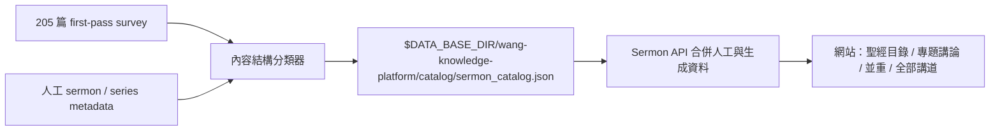

# 講道目錄、內容分類與 ingestion 邊界

> **讀者**：Solution architect
> **類型**：規範
> **狀態**：當前
> **與代碼對齊**：未核對
> **權威範圍**：講道目錄導航、內容分類與跨講歸組三者的邊界。

## 目的

205 篇講道首先需要一個方便讀者瀏覽的入口，但「網站導航位置」、「單篇內容的組織方式」與「教授思想的跨講歸組」是三個不同問題，不能共用一個標籤取代彼此。

- **網站導航位置**回答：讀者可以從哪卷書、哪一章或哪個歷史系列找到這篇講道？
- **內容組織方式**回答：這一講主要沿連續經文推進，還是由一個問題／主題帶領？
- **跨講思想歸組**回答：這一講的主張應與哪些其他講道合併、比較或保留張力？這屬於共享知識平台，不由講道目錄決定。

內容組織方式目前保留三類：

- **經卷釋經**：主要沿一段經文、同一章或相鄰上下文逐步解釋。
- **專題講論**：主要圍繞一個問題或觀念，使用多處經文形成論證。
- **釋經與專題並重**：兩種組織方式都有實質篇幅，不能誠實地壓成其中一類。

這不是品質等級，也不表示專題講論不做釋經。王教授的專題常以大量經文解釋建立論證；判斷的關鍵是「文章由連續經文還是由問題／主題帶領」。同樣，一篇歷史上屬於《馬太福音十九章系列講道》的講道，可能用大量篇幅解釋馬太福音第五章；這不是資料錯誤，而是王教授非線性講授方式的真實反映。目錄應改善導航，不應為了得到單一分類而改寫講道內容。

## 資料位置

所有供網站讀取的資料都放在 `DATA_BASE_DIR` 下：

- 人工講道 metadata：`$DATA_BASE_DIR/config/sermon.json`
- 人工系列 metadata：`$DATA_BASE_DIR/config/sermon_series.json`
- 可重建目錄：`$DATA_BASE_DIR/wang-knowledge-platform/catalog/sermon_catalog.json`

`sermon_catalog.json` 是 read model。分類器不得改寫 `config/sermon.json`，以免覆蓋人工標題、摘要、發布狀態與核心經文。

### 原始來源正規化

歷史資料的 `source` 欄位同時容納網址、資料提供者姓名和空值，因此不能單靠這個欄位判斷聚會歸屬。目錄建置時必須同時讀取系列 metadata，保留原始媒體來源，並投影為互不混淆的欄位：

- `source_organization`：講道所屬機構或聚會；
- `source_provider`：提供檔案的人；
- `source_url`：原始媒體網址；
- `source_category`：供篩選使用的穩定類別；
- `source_raw`：`config/sermon.json` 的原始值，供追查與日後修訂。

現階段採用以下已確認規則，順序由上而下；系列所明示的聚會歸屬優先於媒體網址：

| 系列／`source` 條件 | `source_category` | 顯示／保存方式 |
|---|---|---|
| 系列代號或系列標題明確含 `NYSC` | `nysc` | 紐約靈命進深會；YouTube 或其他播放網址仍另存 `source_url` |
| 空值或 `null` | `dallas_hlc` | 達拉斯聖道教會 |
| 包含 `bctcnj.org` | `nysc` | 紐約靈命進深會；網址另存 `source_url` |
| `Ruxin Zhang` | `external_church` | 其他教會（名稱未記錄）；`Ruxin Zhang` 只作資料提供者 |
| 其他非空值 | `other` | 原值照實保留，不推定為達拉斯聖道教會 |

若某篇普查记录根本不存在于 `config/sermon.json`，则标为 `unknown`／「来源待确认」。这与网站 metadata 中明确存在、但 `source` 留空的达拉斯讲道不同。

來源只回答「材料從哪裡來」，不得決定講道覆蓋哪一章，也不得決定其主張歸入哪個專題。

### 馬太福音全範圍統一來源地圖

`backend.pipeline.matthew_source_coverage_runner` 會把全庫第一遍普查與「馬太福音釋經」
notes-to-manuscript 系列合併為 `$DATA_BASE_DIR/wang-knowledge-platform/catalog/matthew_source_coverage.json`，並同步產生供同工
閱讀的 `$DATA_BASE_DIR/wang-knowledge-platform/catalog/matthew_source_coverage.md`。這是馬太福音
第一至二十八章檢索範圍內的統一來源清冊與編輯研究資料，不是出版目錄或完成度宣告。某章有來源，不等於材料已足以成篇；某章材料薄弱，也不構成必須補寫的配額：

- 講道只以普查中的 `content_clusters.scripture_refs` 與 `candidate_claims.scripture_refs` 建立章節歸屬；
- 第一至十六章的筆記轉講稿，以 Project `meta.json` 的 `bible_verse` 建立章節歸屬；
- `project_type=transcript` 的 Project 不進入筆記轉講稿來源；其所連結的講道仍由原始講道／逐字稿來源管線進入，避免同一份口述材料重複計證；
- 若 `bible_verse` 缺失或不完整，只有在已審核 `final.md` 中某一馬太福音章至少出現三次、且占全部明確馬太引用 60% 以上時，才以該正文主導章補足範圍；混合材料仍留待人工定章；
- 沒有明確章節範圍的全書結構、登山寶訓結構等 Project，不會消失，而是列在 `book_level_sources` 並標為待補章節範圍；
- `source_directory` 是去重後的全部來源總表；每個來源只出現一次，並列出 `assigned_chapters`。逐章使用時則讀 `chapters[].sources`；
- 保留候選主張、逐字引文錨點、歷史系列及正規化來源；
- 同一講道若實際處理多章，可以出現在多個章節；
- 講道標題、系列名稱和來源機構不得自動建立章節覆蓋；
- `anchored_candidate_claims` 只表示已有可回查的候選主張，不表示已完整解釋該章；
- `material_role` 只按可回查主張数机械分流为 `multi_claim_candidate`、`single_claim_candidate` 或 `cluster_reference_only`。段落长度不再当作重要性代理，因为一段很长的离题讨论也可能只顺带引用该章；
- 每筆材料初始仍為 `needs_detailed_extraction`，須經詳細知識提取、跨講整合與篇章編排；只有達到成篇門檻的段落才進入正式釋經文章，其餘材料保留為短注、來源索引、專題／問答路由或待補來源。

## 可重跑流程



执行：

```bash
.venv/bin/python -m backend.pipeline.sermon_catalog_runner
PYTHONPATH=. .venv/bin/python -m backend.pipeline.matthew_source_coverage_runner
```

分類使用第一遍普查的段落功能、經文集中度與跨經文分布。標題或系列名稱中的「釋經」只能作輔助訊號，不能單獨決定分類。每筆記錄保留分類理由、信心、來源 hash 與分類器版本，以便重跑和抽樣審閱。

## 網站導航規則

目前網站使用多個互補入口，而不是把每篇講道硬塞進一個主題：

1. 頁面預設進入**聖經目錄**；上方入口依次為「聖經目錄、專題講論、釋經與專題並重、全部講道」。
2. 聖經目錄先顯示**書卷卡片**，不在初始畫面展開所有章節。讀者點開書卷後，才看見「章 → 講道」兩層內容。
3. 書卷順序採**新約在前、舊約在後**，兩約內各按聖經正典次序排列；公開 UI 只顯示中文書卷名，不顯示 `MATT`、`DAN` 等內部代碼。
4. 同一章可以顯示多篇講道，每篇保留自己的標題、日期、歷史系列名稱與系列講次，不合併成一張代表性卡片。
5. 一篇講道以 `catalog_primary_passage` 決定主要目錄位置；若它實質展開其他章節，則以 `substantial_passages` 顯示「重點展開」並可在相關章節提供交叉入口。這是多入口導航，不是重複建立講道。
6. 講道詳情页与系列页保留「上一講／下一講」及「查看完整系列」，讓讀者從聖經目錄進入後仍能回到教授原始授課次序。
7. 桌面版左側保留系列、主題、年份、來源與書卷篩選；手機版隱藏整個左側欄，避免篩選器先於主要內容佔滿畫面。

因此，聖經目錄是**尋找講道的索引**，不是對整篇講道內容的排他性判決。歷史系列表示講道原本在哪個場合與次序出現；主要經文表示預設從哪裡找到它；內容分類表示該講如何推進。三者可以同時存在。

例如，一篇属于《罗马书释经》系列的讲道，若实际论述跨越多卷经书并围绕「约」推进，仍可归为「专题讲论」，同时仍可按其主要经文出现在圣经目录。系列表示讲道历史归属，目录位置表示读者入口，分类表示该篇内容如何组织，三者不得互相覆盖。

## 运行时刷新

目录使用临时文件加原子替换写入。后端 watcher 必须同时处理 `modified`、`created` 和 `moved` 事件；否则文件虽然已经更新，运行中的 API 仍可能保留旧 catalog。API 在每次加载时将 Wang platform catalog 区域的 `sermon_catalog.json` 与 `$DATA_BASE_DIR/config/sermon.json` 按 `transcript_id` 合并。

若 production 没有出现新分类，先检查：

```bash
test -f "$DATA_BASE_DIR/wang-knowledge-platform/catalog/sermon_catalog.json"
python -m json.tool "$DATA_BASE_DIR/wang-knowledge-platform/catalog/sermon_catalog.json" >/dev/null
```

随后确认 API 返回的 `organization_mode`、`series_title`、`scripture` 和 `topic` 字段；不应通过复制文件到 repo 或修改 `config/sermon.json` 解决。

## 与共享知识库的边界

目錄分類只决定讲道如何浏览，不批准主张，也不建立跨讲道专题结论。进入共享知识库仍需经过：

1. 详细知识提取；
2. 来源、说话者与立场资格检查；
3. 与现有主张图比较；
4. 合并、扩展、张力或新主张的可重复判定；
5. 独立 AI 复核及必要时仲裁。

因此，可以先完成全站目录，而不把目录标签误当成最终思想体系。
