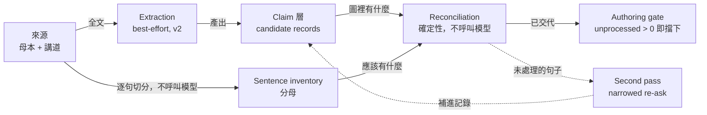

# 來源逐句對帳與 claim 層完整性 v1

> **讀者**：Developer
> **類型**：規範
> **狀態**：當前
> **與代碼對齊**：未核對
> **權威範圍**：逐句對帳與 claim 層完整性的定義。本文是該設計的 canonical source。

> 本文件是本設計的 **canonical source**。另有一份排版後的網頁版供分享使用，內容以本文件為準：
> https://claude.ai/code/artifact/53b1eba7-0b59-4626-a2c5-809396fd076a

## 一、目的

回答一個至今沒有任何地方回答過的問題：

> **來源裡的材料，有沒有全部進到論證圖裡？**

本文件定義 source → claim 層的目標流程（Sentence Ledger），使這個問題成為**機械可判定**，並使缺口成為**可收斂的佇列**而非靜默流失。

適用範圍為全部講道與筆記講稿來源，不限於《馬太福音》。與[《馬太福音釋經：來源進入論證層與跨來源整合流程 v1》](../30-authoring/matthew_source_to_argument_workflow_v1.md)的關係：該文件定義來源如何進入論證層，本文件定義**如何驗證它進得完整**。

## 二、問題

### 2.1 全庫現況

PostgreSQL 實測（2026-08-17）：

```
observations 總數:                430
其片段被任何 evidence_step 引用:    55  (12%)
完全沒進論證層:                   375  (87%)

原文觀察 (observation_type='original_language'):
  36 條，其中只有 4 條進入論證層 (11%)
```

11% 是**低估**。`observation_type` 曾有 246 種取值，其中 68 種在描述原文觀察，`= 'original_language'` 只撈到 36／約 138 條。度量不了就治不了。

### 2.2 後果：gate 的視野等於系統的現實

下游每一個環節——編排複審、contract、grounding gate、Program Audit——**只讀 claim 層**。因此材料沒進圖，gate 的視野裡就沒有它，「教授說過但沒抽到」與「教授根本沒說過」在系統內是**同一個狀態**。

2026-08-18 重生成 `DRAFT-M16-002-V1`，grounding gate 以「無材料支撐」刪掉一句：

> 君王與祭司的職分在制度上分開，不可集於一身

該句在母本 `notes_manuscript:16章釋經` 第 91、113 行逐字出現兩次。

**gate 判斷完全正確。它在自己的視野內資訊是完整的，錯的是那個視野。**

相鄰那句「受膏者涵蓋三種職分」倒是成了 step：前提收進來，結論留在外面。

### 2.3 為什麼現有做法止不住

**抽取的驗證是自指的。** v2 的硬性規則（`argument_role=load_bearing` 卻沒有 `evidence_relations` 即整次失敗）只能約束模型**已經吐出來**的 observation。375 條裡絕大多數不是標錯 `argument_role`，是從未被 emit。抽取是 recall 問題，而 schema validation 結構上無法覆蓋 recall。

**逐案提升是治標。** #45 修好 φρονέω，下一篇講道換一個詞再來一次。

**對帳工具已經存在，但沒有一個是 gate。**

| 工具 | 涵蓋 | 輸出 |
|---|---|---|
| `base_contract_coverage.py` | 母本，確定性，按經文引用 | `staging/reports/` |
| `observation_argument_coverage.py` | 抽取內部覆蓋率 | `staging/reports/` |

`matthew_exposition_authoring.py` 確實 import 了前者，但只取 `parse_passage_range()`、`load_bearing_flags()` 等工具函式，用來替 reviewer 切 exegetical slice。**沒有任何覆蓋率數字擋住任何東西。**

2026-08-17 的報告已逐句列出全部 26 句承重缺口；08-18 重生成照樣撞上其中一句。**報告靠人讀，人會漏；gate 不會。** 這是本設計與既有工具唯一但決定性的差別。

## 三、核心原則

> **以來源為分母做對帳，不以抽取結果為分母。**

一旦計數來自「抽到了什麼」，這個度量就再也看不見抽取漏了什麼。

因此不要試圖把抽取做到完整——那是無界的努力且沒有驗收標準。改成讓**每一句來源為自己交代**：抽取維持 best-effort，完整性由 ledger 保證。

> **但要先分辨 recall 與 bug。** 上述判斷對講道路徑成立；母本路徑另有一個具體且可修的缺陷——它走另一份 prompt，而那份 prompt 從未要求建立 observation → evidence_step 關係，因此四份母本 package 的關係數皆為 0。見 §4.3 與 #86。
>
> **先修 bug，再談 recall。** Ledger 是通用防線，不是迴避可修缺陷的藉口。

## 四、流程



虛線是本設計的全部重點：對帳無法讓抽取變完整，但它能指名**哪幾句還沒交代**，並且只把那幾句交回模型。

### 八個 stage

| # | Stage | Epic | 狀態 |
|---|---|---|---|
| 0 | Source registration | E01 | 已有 |
| 1 | Sentence inventory | E01 | 新建（#83） |
| 2 | Extraction | E02 | 已有，**刻意不動** |
| 3 | Reconciliation | E02 | 新建（#84） |
| 4 | Targeted second pass | E02 | 擴充既有修復迴圈（#84） |
| 5 | Exclusion adjudication | E02 | 新建 record（#84） |
| 6 | Store write | E02 | 已有 |
| 7 | Authoring gate + 失敗分流 | E04 | 新建（#85） |

### 4.1 Source registration（stage 0）

`KnowledgeSourceDocument` 帶 `source_sha256`，母本（`notes_manuscript`）與講道逐字稿皆同。已存在且正確，本設計不改。

### 4.2 Sentence inventory（stage 1）

逐句列出來源，key 為 `(source_id, segment_index, sentence_sha256)`，ordinal 僅用於區分逐字重複的句子。

**用內容雜湊而非序號當 key**：母本改一個字，只有被改到的那句失效，其餘狀態全部延續；若用序號，任何一次插入都會位移其後所有句子，把下游記錄整批孤兒化。這同時就是句子粒度的來源變更偵測。

先於一切抽取執行，只從來源文字導出，不呼叫模型。

### 4.3 Extraction（stage 2）

`detailed_knowledge_extraction_runner` 對整份來源執行，v2 schema，沿用既有修復迴圈。產出 observation／evidence_step／claim／relation，一律 `candidate`。

**講道路徑刻意不動。** 抽取是 recall 問題，從內部無法否證；在本設計下完整性不是它的職責。

**母本路徑則另有缺陷，須先修（#86）。** `detailed_knowledge_extraction_runner.py:442` 依來源類型選 prompt：

```python
prompt_path = NOTES_PROMPT_PATH if source_rows else PROMPT_PATH
```

主 prompt（4.6 KB）含 `argument_role` 與「`load_bearing` 必須連到它所支撐的 step」規則；notes prompt（2.2 KB）**原本完全沒有這一段**，只把 relations 定義為 evidence_step 與 claim 之間的關係。v1 實測：

```
講道逐字稿 package（20 份）: 每份 5–37 條 knowledge_relations
母本 notes_manuscript      :  0 、 0 、 0 、 0   （共 68 條 observation）
```

模型不是漏掉這些連結，是從未被要求建立。這就是 #64 的機械成因。

**且 v2 原本並未關掉它。** schema 共用而 prompt 不共用：母本路徑會拿到一個 prompt 從未解釋的必填 `argument_role`，模型最可能整份填 `background`，於是沒有任何 `load_bearing`、硬性規則永不觸發、驗證通過、關係仍為 0。v2 的保證在母本路徑上是 vacuous 的，且無處回報。

> **97% `load_bearing` 是母本的正確讀法，不是紅旗。** 母本是釋經課筆記經 AI 整理並人工審核的產物，背景材料在抽取之前就已濾除。#62 的判準針對講道校準，不適用於此。見 §13.2。

> **注意這是推理，不是量測。** 既有四份母本 package 全為 v1，`argument_role` 欄位當時不存在，68 條 observation 皆為 `None`。「模型會整份填 `background`」從未被任何一次真實執行證實過。

**修復狀態（2026-08-19，#86）：** notes prompt 已補上對等的 `argument_role` 與 `evidence_relations` 規則，並額外加入一條母本特有的規則——事實與其推論可能被編輯分置於不同標題或次序顛倒，關係按論證依賴建立而非段落先後。四項測試已加入 `backend/tests/test_observation_argument_role.py`，其中 `test_marking_everything_background_is_not_how_the_notes_path_passes` 證明硬性規則在母本路徑上非空，`test_both_prompts_state_the_same_test_for_load_bearing` 要求兩份 prompt 帶有逐字相同的判準字串，防止再次分岔。以還原後的 prompt 執行，正是這兩項失敗。

**但 prompt 本身可能不足。** `observation_type` 的合規率呈反向關係——主 prompt 一直明列六個取值並禁止自創，notes prompt 從未提及：

```
sermon_transcript（prompt 有列舉）: 41 / 321 = 13%
notes_manuscript （prompt 未列舉）: 26 /  68 = 38%
```

**列出規則的那一條路徑反而更不合規。** 因此第一次 v2 執行若出現非零關係數，只能說明模型不再結構性地無法遵守，不等於規則生效。

### 4.4 Reconciliation（stage 3）

對每一句 inventory，判定它在論證圖裡的狀態。確定性，不呼叫模型。

`represented` **必須由精確 span 包含判定**。`excerpt_match_score`（SequenceMatcher）降級為「提議候選連結」——給人看、給 second pass 用——**永遠不得用來下 `represented` 的結論**。相似度門檻的意思是「大致像就算數」，那正是本工具要消滅的靜默流失，不能建在它上面。

### 4.5 Targeted second pass（stage 4）

只把 `unprocessed` 的句子送回模型，附上所在 segment 的逐字原文，每句問一個封閉問題，只有三個合法答案：

1. 教授據此推論 → 產出 observation + evidence_step + `supports` relation
2. 這句本身就是斷言 → 產出 claim
3. 兩者皆非 → 提議一筆排除並附 reason code

然後重跑 stage 3。這就是迴圈。

**大部分已經建好。** `run_source()` 已具備保留前一版候選、把涉及段落逐字引回（`_validation_feedback()`）、來源前綴 cache 不重複計費。要改的只有觸發條件（改由對帳觸發，而非 schema 錯誤）與提問方式。

沒有這一段，gate 就是一盞沒有轉綠路徑的紅燈，一個月內會被關掉。

**要設計防範的壓力**：三個答案裡「排除」是最省事的收斂路徑，而回答的模型正是當初漏掉那句的模型。§七的分級是配重。

### 4.6 Exclusion adjudication（stage 5）

見§七的 reason code 分級與§五的記錄型別。

### 4.7 Store write（stage 6）

`knowledge_store_runner`，change set，Active Snapshot。Reconciliation 與 exclusion record 走與其他記錄相同的寫入路徑，因此可改版、可稽核不需另建機制。

### 4.8 Authoring gate（stage 7）

在 **authoring packet 建立時**執行，而非發布時：一次擋下只花幾秒，不是一整輪 authoring + review。

範圍用 `mark_passage_relevance()` 取，**按經文引用，不按章節標題**。按標題取正是 #32／#52 的成因：002 有 25 句太16:19 的釋經落在 `base_source.section_anchor` 之外。範圍內任一句 `unprocessed` 即不開工，阻擋訊息必須列出是哪幾句，不能只給數字。

**同時是 grounding 失敗的分流器：**

| 鄰近來源句的對帳狀態 | 判讀 | 處置 |
|---|---|---|
| `represented`，但稿件宣告的 `claim_ids` 未涵蓋 | 稿件缺陷：寫了教授沒說的話 | 現行流程，修稿 |
| `unprocessed` | **上游缺陷**：教授說了，claim 層沒收到 | 記為 E02 缺口，不要刪掉那句真話 |

第二種正是 #64。今天它的結局是刪掉一句在母本裡逐字出現兩次的話，而且沒有任何地方記下缺陷。

### 4.9 抽取驗收條件改判（stage 2）

由「schema 通過」改為「對帳通過」，重試信號來自對帳而非 schema 錯誤。抽取的 prompt **刻意不動**。

## 五、記錄型別

以下為建議形狀，欄位可在實作時調整，但三條約束不可放寬：**皆繼承 `EvolvingKnowledgeRecord`**（因而帶 `review_status`／`revision`／`content_sha256`／object_id）、**皆可單獨審核與退場**、**皆不得降級為 payload 內的陣列元素**。

### 5.1 `SentenceInventoryRecord`（E01，#83）

```python
class SentenceInventoryRecord(EvolvingKnowledgeRecord):
    sentence_id: str          # f"{source_id}:{segment_index}:{sentence_sha256[:12]}"
    source_id: str
    segment_index: int        # canonical segmentation 的索引（見 §十二）
    ordinal: int              # 僅用於區分同 segment 內逐字重複的句子
    text: str
    sentence_sha256: str
    char_start: int           # 在該 segment 文字內的 span，供精確包含判定
    char_end: int
```

### 5.2 `SentenceReconciliationRecord`（E02，#84）

```python
class SentenceReconciliationRecord(EvolvingKnowledgeRecord):
    sentence_id: str
    status: str               # represented | excluded | unprocessed
    represented_by: list[str] # evidence_step_id / observation_id
    match_kind: str           # exact_span | proposed_link | none
    exclusion_id: str | None
    triage_flags: list[str]   # 原文觀察／交叉經文／推論橋梁——僅供人工排序，見 §九
    reconciled_against: str   # 對帳當時的 snapshot 或 change set id
```

`match_kind` 必須顯式區分：只有 `exact_span` 可使 `status=represented`；`proposed_link` 是待確認，不是結論。

### 5.3 `ExclusionRecord`（E02，#84）

```python
class ExclusionRecord(EvolvingKnowledgeRecord):
    exclusion_id: str
    sentence_id: str
    reason_code: str                     # duplicate_of | not_exegesis | background_only | deferred
    rationale: str                       # 不得為空，不得由模型套用制式句
    duplicate_of_record_id: str | None   # reason_code=duplicate_of 時必填且必須可解析
    decided_by: str | None               # 人工核准者；AI 提議時為 None
```

終局性由 `reason_code` 與 `review_status` 共同決定，見§七。

## 六、三個終局狀態

範圍內每一句必須恰好落在其中一個，否則 stage 7 擋下：

| 狀態 | 意義 |
|---|---|
| `represented` | 有 claim 的證據解析到這一句 |
| `excluded` | 有排除記錄說明它為何不承載論證，以及誰決定的 |
| `unprocessed` | 兩者皆非。**不是判決，是還沒有人回答的問題** |

這個結構把 open-ended 的 recall 問題變成**可收斂**問題：不需要抽取完美，只需要保證每一句都被處理過，哪怕結論是「刻意不用」。#64 懸而未決的「002 那 53 句範圍外的句子該不該進論證層」因此不必一次回答完，它變成一個可以慢慢清空的佇列。

## 七、排除的終局性分級

若不分級，設計會死鎖：每句都要終局狀態、每筆排除都要人工核准、而編輯只有一個人——不是 gate 卡在人力上，就是候選排除被當成終局，於是**漏掉材料的模型反過來成為宣告該材料不重要的權威**。

分級依據是「這筆排除**能不能被檢查**」，不是「這句話看起來重不重要」：

| Reason code | 終局性 | 理由 |
|---|---|---|
| `duplicate_of` | **自動** | 可驗證，不需判斷：指名的記錄要嘛涵蓋這段內容，要嘛沒有 |
| `not_exegesis` | 批次核准 | 單筆成本低、錯誤可見（問安就是問安）。一次核准數百筆，介面見 #63 |
| `background_only` | **一律人工** | 「他說了但沒據以推論」正是 #64、#53 判錯的那一步。任何信心度都不下放 |
| `deferred` | 一律人工 | 編輯排程決定，非事實判斷 |

兩個高流量的 code 剛好是兩個便宜的，佇列因此由一個人清得動，而真正造成過生產故障的判斷無條件人工。

## 八、不變式

1. **分母永遠是來源文字，不是抽取結果。** 其餘全部建立在這一條上。
2. **每句恰好一個終局狀態，否則擋下。** 完整性門檻，不是品質門檻。結論可以是「刻意不用」，不可以是「沒有結論」。
3. **凡是 gate 讀的東西，必須是 record。** 要有 `review_status`、`revision`、`content_sha256`、object_id。#68 的教訓：`RequiredArgumentStep` 是普通 pydantic `BaseModel`，因此無法被單獨審核、改版或退場——它腐爛是因為沒有主人。**排除清單若做成 payload 裡的陣列，兩年後就是第二份無主清單。**
4. **AI proposes, humans approve——下放依可驗證性，不依外觀。** 漏掉某句的模型，永遠不是宣告該句可以退場的權威。
5. **抽取維持 best-effort。** 完整性來自 ledger，不來自 prompt。這同時擋住 #62 指出的風險：模型為通過驗證而過度標記 `load_bearing`，或為避免失敗而保守標成 `background`——ledger 對帳的是模型無法操弄的來源文字。

## 九、已否決的方案

排除的終局性**不得**依 `load_bearing_flags()` 分級（帶 原文觀察／交叉經文／推論橋梁 旗標者需人工，不帶者可停在 candidate）。記錄於此，因為這是個很有吸引力、而且一定會再被提出的想法。

以真實故障案例測試：

```
NO FLAG   []                                  值得注意的是，猶太人的君王不可兼任祭司⋯   ← #64
NO FLAG   []                                  猶太制度中，君王與祭司的職分是嚴格分開的⋯  ← #64
NO FLAG   []                                  受膏者涵蓋先知、祭司、君王三種職分。
NO FLAG   []                                  教師需要先將自己的程度降低到與學生相近⋯   ← #53
FLAGGED   ['原文觀察','交叉經文','推論橋梁']    太16:23的φρονέω被說明為關心、重視。      ← #45
```

**grounding gate 在 08-18 實際刪掉的兩句都不帶旗標。** 在該分級下它們會是候選排除即終局——漏掉它們的模型把它們退場，無人複核。φρονέω 之所以受保護，只因為它含一個希臘文字。

成因是結構性的，不是調參問題：`load_bearing_flags()` 是三組關鍵字加一個希臘／希伯來字元類，設計用途是替人工報告**排序候選**，那是正確用法；它的 recall 不足以當授權邊界。**把排序啟發式提升為閘門，正是原始缺陷的成因。**

已立為常設測試：`backend/tests/test_base_contract_coverage.py::test_load_bearing_flags_do_not_gate_exclusion`。

## 十、失敗模式對照

| 失敗的環節 | 今天 | 有 ledger 之後 |
|---|---|---|
| 材料被漏掉 | 靜默，與「材料不存在」無法區分 | 該句停在 `unprocessed`，被指名 |
| 作者仍據以寫作 | grounding gate 以無支撐刪除該段 | 不會發生——上游已擋下 |
| 評審為結果打分 | 因論證橋樑缺席而扣分，分數卡關 | 評審看得到材料，因為材料進了 claim 層 |
| 需要有人察覺 | 靠人讀 `staging/reports/` 的覆蓋率報告 | 不需要任何人察覺，gate 不會忘 |
| 修復方式 | 逐案提升，一次一個詞 | 對指名殘餘跑 second pass，收斂 |

## 十一、重用與新建

大部分已經存在。缺的不是零件，是接線。

| 元件 | 狀態 | 位置 |
|---|---|---|
| 句子切分、經文範圍判定、excerpt 比對、triage flags | 已有 | `base_contract_coverage.py`（比對與 flags 僅供提議） |
| 修復迴圈：段落逐字引回、前綴 cache、保留前一版候選 | 已有 | `detailed_knowledge_extraction_runner.py` |
| 版本化 record、review status、change set、Active Snapshot | 已有 | `knowledge_models.py`、`knowledge_store_runner.py` |
| 受控 `observation_type` 詞彙與 migration | 已有 | `observation_type_vocabulary.py` |
| 持久化 sentence inventory | 新建 | — |
| `SentenceReconciliationRecord`、`ExclusionRecord` | 新建 | — |
| second pass 的提問與觸發 | 新建 | — |
| gate 接入 packet 建立與 grounding 分流 | 新建 | — |
| 講道側逐句切分 | 新建 | S 編號 segment 使成本較低 |
| 單一 canonical segmentation | 新建 | 精確 span 判定的硬前置 |
| 既有 fragment 重新錨定 | 新建 | 沿用 `source_anchor_binding.py` 的形狀；99.9% 可唯一定位 |
| 排除的批次核准 CLI | 新建 | store runner 目前無任何核准命令 |
| v2 重抽 | 尚未執行且**不在關鍵路徑** | 24 份 package 中 0 份為 v2 |

## 十二、前置條件

### 12.1 單一 canonical segmentation（屬 E01，硬前置）

兩側各有一套切法：`markdown_blocks()`（抽取側，按空行切）與 `split_segments()`（覆蓋率側，逐行切並保留標題／區塊結構）。

**實測（2026-08-19，兩份太16母本）差距遠小於預期：**

```
16_章_-_榮耀、信心 : split_segments 146 segs / markdown_blocks 146 blocks / 逐位置文字相同 138
16_章_-_彌賽亞，捨己: split_segments 117 segs / markdown_blocks 117 blocks / 逐位置文字相同 105
```

segment 數量與順序一致，`segment_index` 實際上是對齊的。唯一的系統性差異是**引用區塊的 `> ` 前綴**：`split_segments` 去掉，`markdown_blocks` 保留。

```
split_segments : '當下、耶穌囑咐門徒、不可對人說他是基督。（太 16:20）'
markdown_blocks: '> 當下、耶穌囑咐門徒、不可對人說他是基督。（太 16:20）'
```

因此本項是**正規化，不是重新設計**——把兩側收斂到同一個 `> ` 處理方式即可。但仍是硬前置，原因有二：差異落在經文引用區塊上，而那正是 `parse_scripture_refs()` 與交叉經文判定工作的地方；且只要有一個 `> ` 之差，逐字 excerpt 就不是子字串，精確 span 判定即失效。

尚未量測：講道逐字稿一側（走 S 編號 segment，路徑不同），以及既有 24 份 package 的 anchor 在收斂後的存活率。皆列為 Phase 0（見 #83）。

### 12.2 動 segmentation 會踩到的地雷

`extraction_identity()` 的 fingerprint 由 `source_sha256`（raw bytes）+ prompt + model + reasoning_effort + max_output_tokens + schema 組成，**不含 segmentation**；而模型實際看到的輸入是 `_transcript_for_prompt()` 從 segment 組出來的。

改了 segmentation 之後：模型輸入變了，fingerprint 沒變，`run_source()` 比對到相同 fingerprint 就 `return "skipped"`，**不會重抽**。詳見 #83。

### 12.3 既有記錄可確定性重新錨定（實測，2026-08-19）

原本假設：v2 之前的記錄「錨點寬鬆，只能走提議路徑」，因此 Ledger 開張時多數句子只能是「候選連結、未確認」。**實測推翻了這個假設。**

全部 24 份 package、1,712 條 `source_fragment`：

```
verbatim_excerpt 逐字存在於來源原文        : 1,710 / 1,712  (100%)
在其自報的 source_segment_index 上解析成功 :   334          (20%)
以內容搜尋可唯一定位                      : 1,289 / 1,290  (99.9%，僅 1 條有歧義)
```

意思是：**壞掉的是索引，不是文字。** 而且索引偏移不是常數——notes manuscript 的 package 偏移為 `+0`（本來就對齊），講道來源的 package 則是分散的大偏移（−165、−1036、−714⋯），因為它們走 S 編號體系，`markdown_blocks` 會把它折疊掉。

因此既有 fragment 可以**確定性地重新錨定**到 canonical segmentation：逐字子字串搜尋，不呼叫模型，不用相似度門檻。既有機制可直接沿用形狀——`source_anchor_binding.py` 的 `build_anchor_binding_package()` 已經是「產生更新後的 fragment 包 → `store.ingest_package(source_kind=..., apply=...)` → 保留 `unresolved` 清單」這個模式。

**兩個後果：**

1. Ledger 不必在降級模式下開張。Phase 3 量到的殘餘是真實數字，不是舊錨點造成的雜訊。
2. **v2 重抽移出關鍵路徑。** staging 目前 24 份 package 中 v2 為 0 份，v2 的硬性規則從未經過真實模型呼叫（#62 記錄的風險仍在），但那是獨立工作，不再阻擋 Ledger。

### 12.4 排除的核准路徑目前不存在

§七要求 `background_only` 與 `deferred` 一律人工核准、`not_exegesis` 批次核准。但 `knowledge_store_runner` 的子命令只有 `migrate / status / ingest-package / ingest-reviewed-relations / compile / compile-active / export-plan / ingest-plan / sync-review-state / bind-source-anchors`——**沒有任何核准命令**。`sync-review-state` 只是讀取 legacy `review_state.json` 的遷移相容路徑，不是核准機制。

今日的人工核准只經由 `/admin/thought-review` 工作台，而該工作台審核的是 claim 與 relation，不是句子層級的排除。

因此「把太16 清到 `unprocessed = 0`」目前**沒有可走的流程**：第一筆 `background_only` 就會卡住。實作時必須一併提供最小核准路徑（列出待核准排除 → 依 reason code 篩選 → 批次核准／退回的 CLI 即可）。完整審核介面見 #63，但不必等它。

## 十三、未決問題

### 13.1 講道的句子粒度 —— 已解答（2026-08-19）

原本的顧慮是口語 false start 與自我修正會產生大量非命題殘餘。**實測後這個顧慮不成立**：`script_published/` 的 115 份逐字稿是**已編輯的散文**，不是生語音轉寫。

全部 115 份、56,052 個句子：

| 類別 | 數量 | 佔比 |
|---|---:|---:|
| 完全無中英數內容（markdown／標點碎片，如 `~~`、`**`） | 581 | 1.0% |
| 純語氣詞（好。×100、對。×44、嗯。×10⋯） | 176 | 0.3% |
| 其他短句（< 12 字）但為真實文字 | 11,560 | 20.6% |
| 實質句子 | 43,735 | 78.0% |

**結論：句子是正確的粒度，不需要改用 segment。** 需要機械處理的雜訊只有 1.3%，且處理方式已由設計決定——不是在 inventory 階段靜默過濾（那會變成無記錄的排除，正是本設計要防的），而是：

- 無內容碎片（1.0%）：切分器不應產出它們，這不是判斷，它根本不是文字
- 語氣詞（0.3%）：照常進 inventory，由 second pass 自動提議 `not_exegesis`，落在批次核准層

20.6% 的短句需要人看，但它們是真實文字，本來就該被交代。

### 13.2 backlog 量測 —— 已解答，且結論改變了上線範圍（2026-08-19）

以現有 24 份抽取 package 量測「句子未被任何 source_fragment 涵蓋」的比例：

**全來源（整份文件為範圍）**

| 來源類型 | 來源數 | 合格句 | 已涵蓋 | 未處理 |
|---|---:|---:|---:|---:|
| `notes_manuscript` | 3 | 656 | 212 | **444（67.7%）** |
| `sermon_transcript` | 19 | 7,898 | 1,417 | **6,481（82.1%）** |

外推至 115 份逐字稿全庫，未處理句約 **44,000 條**。

**按經文範圍（母本，即 gate 實際會執行的範圍）**

| 篇章 | 範圍內 | 已涵蓋 | 未處理 | 其中帶承重旗標且未覆蓋 |
|---|---:|---:|---:|---:|
| 太16:1–12 | 41 | 22 | **19（46%）** | 7 / 16 |
| 太16:13–20 | 74 | 33 | **41（55%）** | 14 / 35 |
| 太16:21–23 | 24 | 7 | **17（71%）** | 6 / 9 |

三篇合計 77 條未處理、27 條承重未覆蓋——與 #64 記錄的 26 句承重缺口互相印證。

**兩種來源的期望終局分布不同，不可用同一把尺。**

母本是釋經課筆記經 AI 整理、再經人工審核的產物——**背景材料在抽取看到它之前就已經被濾掉了**。因此：

| 來源 | 期望的終局分布 | `unprocessed` 偏高代表 |
|---|---|---|
| 母本（已蒸餾、已審核） | 絕大多數 `represented`，少量 `excluded` | **真實的抽取缺口** |
| 講道（原始講道） | 相當比例 `excluded`（`not_exegesis`） | 多半是合法的非釋經材料 |

這條同時解釋了 v2 重抽的 97% `load_bearing`（見 §4.3）：那不是模型為通過驗證而亂標，是母本的正確讀法。#62 的「接近 100% 是紅旗」判準是針對講道校準的，套到母本上會誤判。

**結論，直接影響上線範圍：**

- **按篇上線可行。** 每篇約 20–40 條未處理，一個人清得動
- **全庫上線不可行。** 相差兩到三個數量級。44,000 條即使批次核准，也不是一人份的佇列；而且 second pass 要為每一條做一次模型判斷，成本可觀

因此 gate **以經文範圍為單位上線，全庫覆蓋不列為目標**。這也是為什麼殘餘率本身不是壞消息：一篇講道本來就包含大量合法地非釋經的材料（例證、重複、牧養性稱呼、離題），它們的正確終局是 `excluded`，不是 `represented`。

### 13.3 全庫 280 條待判定

`same_paragraph_unpaired`（165）與 `paragraph_has_no_evidence`（115）來自 paragraph-scoped 的結構代理，其 docstring 自承會誤判跨段論證——太16:19 的 future perfect 在 S0063、推論在 S0068，被判為 `paragraph_has_no_evidence`，而論證層其實完整。

以來源為分母的對帳**取代**該指標。在取代之前付錢請模型裁決它，是買雜訊。

### 13.4 #52／#53 的定位

兩者仍值得先做，但定位改變：不是終點，而是**攢出第一批排除判例**。驗收條件應由「產出候選清單」改為「產出候選清單**並寫入 exclusion record**」。先用三篇把「哪些句子確實該排除」的判準跑通，再開 gate。

## 十四、Epic 與實作卡

| Epic | 範圍 | 實作卡 |
|---|---|---|
| [WKP-E01](https://github.com/junyang168/smart-answer/issues/3) | stage 0–1：來源註冊、sentence inventory、canonical segmentation | #83 |
| [WKP-E02](https://github.com/junyang168/smart-answer/issues/4) | stage 2–6：抽取、對帳、second pass、排除、寫入 | #84 |
| [WKP-E04](https://github.com/junyang168/smart-answer/issues/6) | stage 7：packet 階段 gate 與 grounding 失敗分流 | #85 |

依賴順序為 **#83 → #84 → #85**，皆為硬依賴。

## 十五、實施順序

> **Phase 0 已完成（2026-08-19）**，結論見 §13.1、§13.2：句子是正確粒度；gate 按經文範圍上線，全庫不列為目標。

| Phase | 內容 | Issue |
|---|---|---|
| **前置** | **修母本抽取 prompt 的關係缺陷，並以 v2 重跑一份太16母本**。比 Ledger 小得多，且能在建任何對帳機制之前回收大部分母本缺口 | **#86** |
| 0 | 講道句子粒度實測（13.1）、殘餘量測（13.2）。**0a 錨點存活率已完成，見 §12.3** | — |
| 1 | Canonical segmentation：母本收斂 `> ` 處理；講道走 S 編號，是另一條路徑。含 fingerprint 修正 | #83 |
| 2 | Sentence inventory + **既有 1,290 條 fragment 的確定性重新錨定** | #83 |
| 3 | Reconciliation，**僅報告模式**，讀 PostgreSQL store 而非 staging 匯出 | #84 |
| 4 | Exclusion record + second pass + **最小批次核准 CLI**（§12.4） | #84 |
| 5 | Gate 與 grounding 失敗分流 | #85 |
| 之後 | 太16 範圍的 v2 重抽——v2 硬性規則的首次真實測試，不在關鍵路徑上 | — |

兩個決策點：**Phase 0 之後**（粒度是否正確）與 **Phase 3 之後**（殘餘是否清得動）。Phase 3 若顯示殘餘無法由一人清完，正確的反應是縮小範圍——按篇上線，或先只做母本——而不是繼續推進到 Phase 5。

**Phase 4 必須早於 Phase 5，不可調換。** 沒有可運作的清空迴圈，gate 就是一盞沒有轉綠路徑的紅燈。

## 十六、上線建議

先在**報告模式**跑完太16章對帳，量出 residue 大小，再決定 gate 按篇上線還是全庫上線。

**gate 一開就是幾百條 `unprocessed` 而沒人清得動，是這個設計最可能的死法。**
