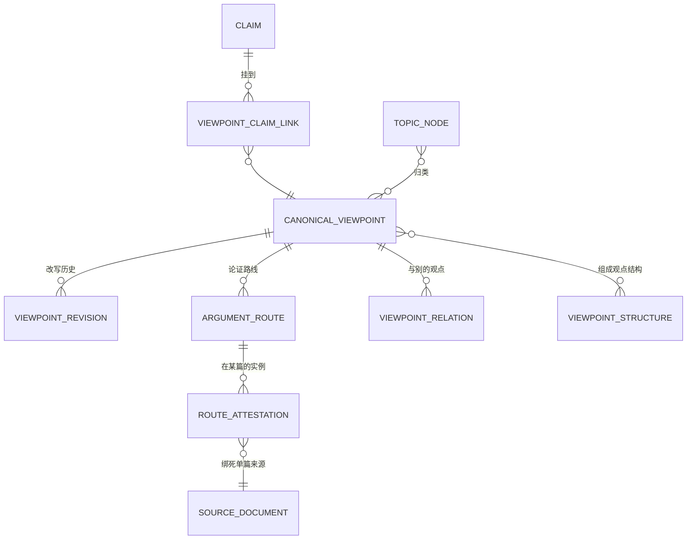
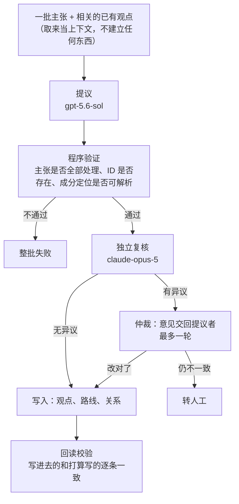
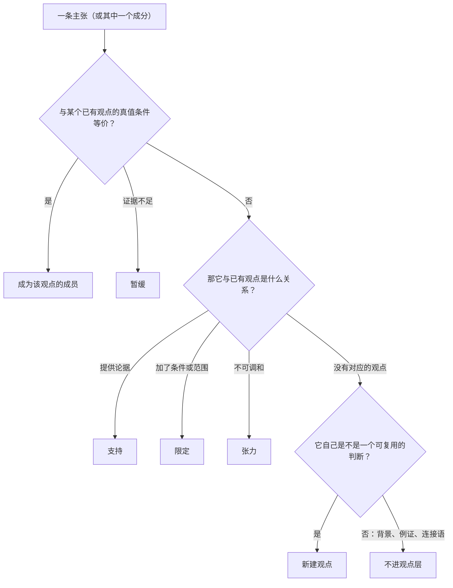

# CanonicalViewpoint 设计

## 目标

> **观点记录「教授对某件事的看法」本身，跨讲道，并说清楚这个看法由哪些主张支撑、他用过哪几条论证路线。**

它是[知识库](../00-overview/solution_architecture.md#3-架构总览)三个 component 里管「观点」的那一个。单篇之内的判断由 [Claim](./claim_design.md) 承担。

## 术语

本文用到的词，凡是这个项目里已经在用的就照用；下面五个是本文新引入的，先定义再使用。已有的词(论证路线、反方立场、真值条件、推理骨架)不在此列。

| 本文的说法 | 定义 | 代码里 |
| --- | --- | --- |
| **观点修订** | 一个观点在某一时刻的表述与适用范围。改写会产生新修订，旧的保留并注明由谁取代 | `viewpoint_revisions` |
| **成员连接** | 把一条主张挂到一个观点上的记录，并说明是哪一种关系 | `viewpoint_claim_links` |
| **路线实例** | 某一条论证路线在**某一篇讲道里实际出现的那一次**，带该篇的证据步骤 | `argument_route_attestations` |
| **成分定位** | 当一条主张里只有一部分与观点等价时，指出是哪一段的结构化位置 | `component_locator` |
| **观点结构** | 一组观点围绕一个中心怎样组织 | `viewpoint_structures` |

### 目录

| 节 | |
| --- | --- |
| [术语](#术语) | 本文新引入的五个词 |
| [1. 观点是什么](#1-观点是什么) | 一个真实例子，以及它不是什么 |
| [2. 数据模型](#2-数据模型) | 图，以及每个对象的白话解释 |
| [3. 观点怎样产生](#3-观点怎样产生) | 流水线的图，人在哪一步出现 |
| [4. 怎样判断两条主张是同一个观点](#4-怎样判断两条主张是同一个观点) | 这一层最难的判断 |
| [5. 论证路线](#5-论证路线) | 同一个结论，他用过几种讲法 |
| [6. 观点之间的关系](#6-观点之间的关系) | 为什么不是一棵树 |
| [7. 审核与公开资格](#7-审核与公开资格) | 六种状态各管一件事 |
| [8. 不变量](#8-不变量) | 机器可查的规则 |
| [9. 谁读观点](#9-谁读观点) | 文章、问答怎样取用 |
| [10. 明确不做](#10-明确不做) | |

## 1. 观点是什么

**一个观点是教授对某件事的一个看法，和他在哪一篇讲的无关。**

同一个看法在五篇讲道里讲过，就是 **1 个观点 + 5 条主张**。观点回答「他怎么看」，主张回答「他在这一篇里怎么说的」。

库里的真实例子：

```
CV-e3366d7c10f42b26ff15
  「馬太福音16:18的磐石不是彼得本人，教會也不是建立在彼得本人身上」
  11 条主张 · 出现在 6 篇来源 · 2 条论证路线
     2016 NYSC 專題：馬太福音釋經（四）1 / 2 / 3 / 4
     S 220206
     notes_manuscript:16章釋經
```

**「他反复讲过这件事」因此成为可以陈述、可以核对的事实**——六篇列得出来，十一条主张各自指回原话。

**它不是什么：**

| | |
| --- | --- |
| 不是教授的原话 | 观点的文字是编辑归一化的表述，记录里明确标着 `not_a_direct_quote`。原话在主张的来源片段里 |
| 不是主题 | 「因信成义」是主题，「教授认为成义不是宣告式的称义」是观点。主题是分类，观点是判断 |
| 不是别人的立场 | 教授引用或反驳的外部说法存成独立的反方立场，不能混进他自己的观点 |
| 不是一棵树上的节点 | 见[第 6 节](#6-观点之间的关系) |

## 2. 数据模型



图里有两个框不属于本层，是它连接的另外两个 component（定义见 [Claim 设计](./claim_design.md)）：

| 对象 | 它是什么 | 代码里 |
| --- | --- | --- |
| **来源文档** | **一份完整的讲道或母本，一份一条记录，不切分。** 正文在系统之外的文件里，库里只有标题、类型、文件路径和整份文件的内容哈希 | `source_documents` |
| **主张** | 教授在**某一篇**里提出的一个判断，连同他引的经文和推到结论的步骤 | `claims` |

本层自己的对象：

| 对象 | 它是什么 | 代码里 |
| --- | --- | --- |
| **观点** | 教授的一个看法。只有身份和状态，文字在修订里 | `canonical_viewpoints` |
| **观点修订** | 这个看法当前的表述与适用范围。改写会产生新修订，旧的保留 | `viewpoint_revisions` |
| **成员连接** | 把一条主张挂到一个观点上，并说明是哪一种关系 | `viewpoint_claim_links` |
| **论证路线** | 到达这个结论的一种讲法。同一个观点可以有几条 | `argument_routes` |
| **路线实例** | 这条讲法在某一篇里实际出现的那一次，带该篇的证据步骤 | `argument_route_attestations` |
| **观点关系** | 两个观点之间：限定、特化、延伸、张力、后期修正 | `viewpoint_relations` |
| **观点结构** | 一组观点围绕一个中心怎样组织 | `viewpoint_structures` |
| **主题** | 分类与导航用的主题身份，不是观点的父节点 | `topic_nodes` |

**为什么身份和文字分开存。** 观点记录只有 ID 和状态；它的文字在修订里。教授的看法被重新表述时，产生新修订、旧修订保留并注明由谁取代——这样「这句话是什么时候改的、原来怎么写的」永远答得出来。

**为什么路线实例要绑死单篇。** 一条实例的所有证据步骤、来源片段必须来自同一篇来源。**不能把不同讲道的证据步骤拼成一条完整论证**——那会造出教授从没讲过的推理。

## 3. 观点怎样产生

这是 [Solution Architecture D4](../00-overview/solution_architecture.md#d4最小化人工提议--复核--仲裁--转人工) 四步在这一层的落地。



要点：

1. **不做候选配对，也不做分块。** 取材只是把相关的已有观点拿来给提议模型看，它**不能建立任何成员、关系或观点**。身份一律由提议与复核在整批材料上判定。
2. **整批失败，不放行一半。** 一条验证不过，整批不写。宁可重跑，不可写进半套。
3. **最多一轮改正。** 不设第二轮、不加临时审查阶段。
4. **写完要回读。** 从库里读回来逐条比对，不一致就是失败。

## 4. 怎样判断两条主张是同一个观点

这是这一层最难、也最容易出错的判断。

**判据是真值条件，不是措辞。** 两条主张说法不同但真假总是一致，就是同一个观点；共用一节经文、或者词句相似，都不算。

递给模型的问题是这样分岔的：



**只有「等价」才算成员。** 支持、延伸、限定、应用、张力都不算——它们是关系，不是身份。这条防的是**为了让一个观点显得反复出现，把相关材料都算成它的成员**。

| 连接类型 | 含义 | 算成员 |
| --- | --- | --- |
| `equivalent_full` | 整条主张与观点真值条件等价 | 是 |
| `equivalent_component` | 主张里某个明确成分与观点等价，必须能定位到那一段 | 是 |
| `supports` | 提供论据，但结论不是同一个命题 | 否 |
| `extends` | 保留核心但加了会改变真值条件的内容 | 否 |
| `qualifies` | 加条件、范围或防误解的边界 | 否 |
| `applies` | 用到具体对象或行动上 | 否 |
| `tension_evidence` | 为未解决的张力提供材料 | 否 |
| `superseding_evidence` | 为后期明确修正提供材料 | 否 |

**成分定位必须是结构化的**，不能只凭模型说「这条里包含同一个观点」。定不稳就先记成 `extends`，或退回上游把主张拆细，**不得硬塞成成员**。

**一条完整主张最多属于一个观点**(以 `equivalent_full` 计)。复合主张可以有多个成分各属不同观点，但每个成分要有互不冒充的定位。

## 5. 论证路线

同一个结论，教授在不同讲道可能用不同的讲法。每一种讲法是一条**论证路线**。

**路线的身份不是「引了同一节经文」。** 两篇都引加拉太书，一篇从 `παιδαγωγός` 的历史职能论证阶段性，另一篇从「后裔」单数和期限论证——**这是两条路线**，不是一条。判断依据是推理骨架：前提、推理步骤、结论是否实质等价。

**多条路线不互相吞并。** 各自维护自己的实例、完整度、经文投影和适用时段。所以文章和问答可以说「结论相同，但教授在不同讲道用了三条路线」，而不是把所有证据步骤摊平成一条虚构的超长论证。

**实例分完整与部分。** 一篇里把这条路线的必需步骤都讲全了，是完整实例；缺步骤或有含糊的，只能记部分实例。**部分实例不计入「这条路线反复出现」的次数。**

## 6. 观点之间的关系

**观点不是一棵树，不设父节点。** 一个较具体的观点可能同时：特化一个较广的观点、限定另一个观点、应用到某个具体伦理问题、归入多个主题、与另一时期的材料形成张力。

单父树装不下这些，硬装就会丢掉其中几条。所以关系是**有类型的图**:限定、特化、延伸、蕴含、张力、后期修正。

界面可以从这张图生成树状的阅读视图，但**那是可重建的导航，不是身份依据**。

主题(`topic_nodes`)负责分类与层级导航，它**不是观点的父节点**——两个观点属于同一主题，不构成合并它们的理由。

## 7. 审核与公开资格

**不要用一个 `status` 同时表示进度、审核、身份状态和可见性。** 六种状态各管一件事：

| 状态 | 管什么 | 值 |
| --- | --- | --- |
| 生成状态 | 这一轮跑完了没有 | `generated / validated / failed` |
| 审核状态 | 谁认可了 | `candidate / ai_consensus / system_approved / human_approved / rejected` |
| 批准依据 | 凭什么认可的 | `deterministic / dual_model_consensus / human_exception_review` |
| 身份状态 | 这个观点还是不是它自己 | `active / redirected / split / merged / retired` |
| 可见性 | 谁能看到 | `internal / active_snapshot_eligible / public` |
| 依赖状态 | 用了它的产品还有效吗 | `current / invalidated / withdrawn / rebuilt` |

**`system_approved` 不等于同工看过。** 它表示两个模型一致且属于低风险，界面上不得显示成人工批准。批准依据这一栏就是用来防止这种混淆的。

当前实际状态(2026-08-25):32 条修订全部是 `system_approved` / `internal`——**没有一条对外**。

## 8. 不变量

机器可查，不依赖判断力：

1. 所有 ID 唯一；`current_revision_id` 必须属于同一个观点。
2. 引用的主张、证据步骤、来源、关系必须都能解析；**指定版本的主张不存在时，不得自动改指最新版本**。
3. 建立、合并、拆分或退役一个观点，**不得删除或修改来源主张**。
4. 每个成员连接保留主张 ID、指定版本、出现位置与身份判定记录。
5. 一条完整主张最多一个 `equivalent_full` 成员资格；复合主张的每个成分定位必须稳定且互不冒充。
6. 一条路线只有一个结论观点。
7. 路线实例的主张、证据步骤、来源片段必须来自**同一篇**指定版本的来源；跨来源拼接直接失败。
8. 完整实例必须覆盖该路线声明的全部必需步骤；缺失或含糊只能记部分实例。
9. 结论相同不足以证明两条路线是同一条。
10. 观点修订里不得内嵌成员、路线、关系或覆盖数组——它们是各自独立的记录。
11. 同样的输入必须编译出同样的结果：语义修订、覆盖范围与编译器版本相同时，产出的内容哈希必须一致。

## 9. 谁读观点

**消费端可以直接读 Registry。** 观点、修订、路线实例上都带着审核状态、可见性和身份状态，消费端按这几个字段自己过滤即可。

早先的设计要求所有消费端只读编译好的投影、不得直接读 Registry。**这一条已删除。** 投影是便利与性能手段，不是准入闸门；门在记录自己的状态字段上。

| 谁 | 取什么 |
| --- | --- |
| 文章 | 编排计划指定用哪些观点与路线；正文每个实质段落要能映射回其中一条 |
| 问答 | 答案按观点组织，并带上该观点在不同讲道里的**限定与扩展**——遗漏限定是[最坏的失误](../00-overview/solution_architecture.md#d2不用-rag) |
| 界面 | 只读浏览已编译的身份、路线、关系、覆盖与历史 |

三者都要能顺着成员主张回到教授原话。**观点的文字不得成为唯一可见的来源。**

## 10. 明确不做

- 不建立一棵「王教授思想唯一层级树」;
- 不用观点替代主题，也不因两个观点同属一个主题就合并；
- 不用编辑归一化的文字替代教授逐字原话；
- 不把外部立场复用为教授自己的观点；
- 不因为成分重复、向量相似或共享经文就自动合并；
- 不把不同来源的证据步骤拼成一条虚构的完整论证；
- 不把出现次数当作重要性。

## 待定

**复杂论证体系可能需要扩展。** 当前模型是「观点 + 论证路线 + 观点关系」。多层嵌套的论证、几个观点联合才成立的结论、有条件才成立的结论，现有对象是否够用，尚未论证。本文不擅自扩展模型，记录为公开问题。

## 关于本文档

> **读者**:Solution architect、Developer。同工不需要读本文；同工要知道的在 [Solution Architecture](../00-overview/solution_architecture.md)。
> **类型**:规范
> **状态**:当前。取代 `canonical_viewpoint_design.md`。
> **与代码对齐**:2026-08-25。第 1、7 节的数字取自当日的 PostgreSQL 快照。
> **权威范围**:观点、论证路线、观点关系的语义、身份判定与消费边界。
