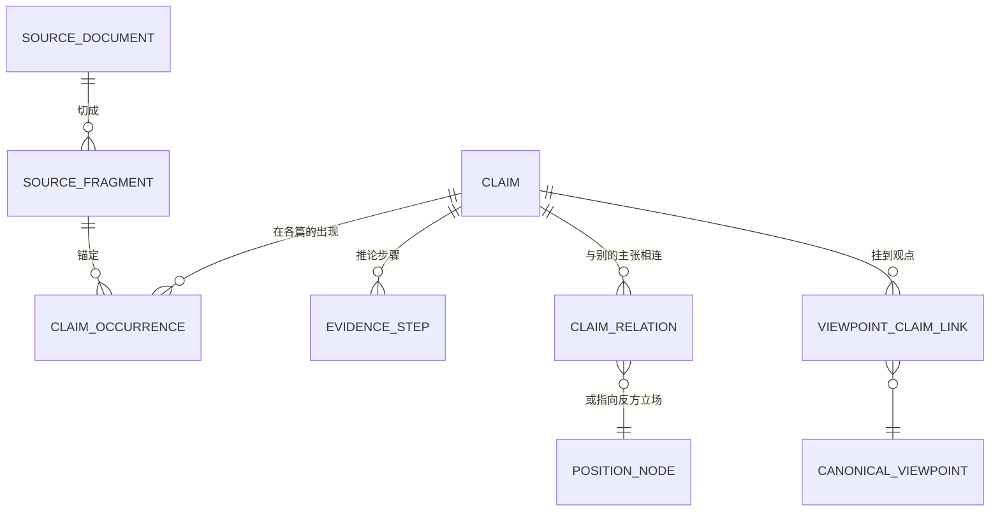
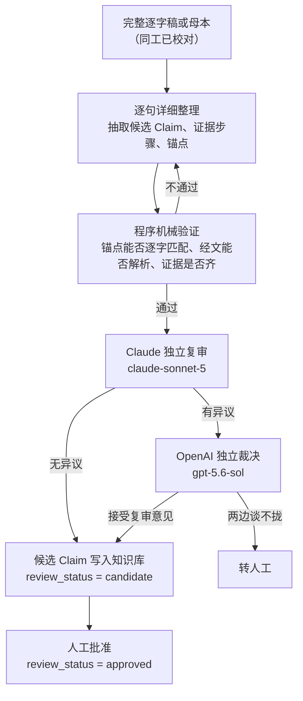

# Claim 设计

## 目标

> **Claim 记录教授在某一篇讲道里提出的一个判断，连同他引的经文和从经文推到结论的步骤。**

它是[知识库](../00-overview/solution_architecture.md#3-架构总览)三个 component 里管「论证」的那一个（单篇之内的部分）。跨讲道的部分由[观点](./canonical_viewpoint_design.md)承担。

### 目录

| 节 | |
| --- | --- |
| [1. Claim 是什么](#1-claim-是什么) | 一句话，以及它不是什么 |
| [2. 数据模型](#2-数据模型) | 图，以及每个对象的白话解释 |
| [3. Claim 怎样产生](#3-claim-怎样产生) | 流水线的图，以及人在哪一步出现 |
| [4. Claim 的字段](#4-claim-的字段) | 库里实际存的东西 |
| [5. Claim 与证据步骤](#5-claim-与证据步骤) | 为什么是多对多，为什么「有证据」不等于「可批准」 |
| [6. 归属、类型与成熟度](#6-归属类型与成熟度) | 三套分类，各管什么 |
| [7. 谁读 Claim](#7-谁读-claim) | 观点层、文章、问答各取什么 |
| [8. 不变量](#8-不变量) | 机器可查的规则 |
| [9. 设计与实际不符之处](#9-设计与实际不符之处) | 已核实的差距，不粉饰 |

## 1. Claim 是什么

**一条 Claim 是一个可以被支持、反对、限定或应用的最小判断。**

「最小」是关键：它不是一个段落，也不是一段总结。判断标准是——**能不能对它单独说「我支持这条」或「这条被那条限定了」**。如果一句话里有两个可以分别被反驳的判断，那是两条 Claim。

举一条库里的真实记录：

> 時代論的致命問題是把各時代描述成神改換彼此割裂的救恩方法；加3:17 表明後來的律法不能廢掉先前的應許

它出现在第 3 讲和第 4 讲，共 8 处，每一处都带着教授当时的原话、录音时间和逐字稿行号。

**它不是什么：**

| | |
| --- | --- |
| 不是文章段落 | 文章是编辑写的新著作，Claim 是从教授的话里抽出的判断 |
| 不是跨讲道的观点 | 同一个判断在五篇里出现，是 5 条 Claim、1 个[观点](./canonical_viewpoint_design.md) |
| 不是对错判断 | 平台记录他教导了什么，不裁定他是否正确 |
| 不是教授的逐字原话 | 原话在来源记录的逐字片段里；Claim 的 `statement` 是抽取出的判断表述 |

## 2. 数据模型



每个对象一句话：

| 对象 | 它是什么 | 代码里 |
| --- | --- | --- |
| **来源文档** | 哪一份讲道或母本。只有元数据和内容哈希，**正文在系统外的文件里** | `source_documents` |
| **来源片段** | 教授原话的一段逐字文字，带它在录音里的时间 | `source_fragments` |
| **Claim** | 教授的一个判断 | `claims` |
| **出现** | 这个判断在某一篇的某一处被讲到，带原话高亮、行号、录音时间 | `claims.occurrences[]` |
| **证据步骤** | 从经文或观察走到结论的一步。一条 Claim 可以有多步 | `evidence_steps` |
| **主张关系** | 两条 Claim 之间的关系：支持、解释、印证、反驳等 | `claim_relations` |
| **反方立场** | 教授引用、质疑或驳斥的**别人的**观点。必须独立成节点，不能混进他自己的主张 | `position_nodes` |
| **观点连接** | 把这条 Claim 挂到某个跨讲道观点上 | `viewpoint_claim_links` |

**为什么「出现」是 Claim 的一部分，而不是另一张表**：同一个判断在不同讲道里讲过，仍然是同一条 Claim；每次讲到就多一个 occurrence。这样「他讲过几次、在哪几篇」是这条记录自己就能回答的问题。

## 3. Claim 怎样产生

这是 [Solution Architecture D4](../00-overview/solution_architecture.md#d4最小化人工提议--复核--仲裁--转人工)「提议 → 复核 → 仲裁 → 转人工」在 Claim 这一层的落地。



四点值得注意：

1. **机械验证在模型复核之前。** 锚点匹配不上、经文解析不了这类问题，不该占用模型和人的注意力。
2. **复审与裁决是两个不同厂商的模型。** 同一个模型自己复核自己等于没核。
3. **只有真分歧才转人工**——这就是 D4 第 4 步的出口。
4. **写入知识库不等于批准。** 通过流水线的 Claim 是 `candidate`；`approved` 需要人。目前 1,789 条里 6 条批准（见[第 9 节](#9-设计与实际不符之处)）。

**注意角色分配与观点层相反。** 观点层是 `gpt-5.6-sol` 提议、`claude-opus-5` 复核；这里是 Claude 复审、OpenAI 裁决。这个不对称目前没有写下来的理由，可能是历史形成的。

## 4. Claim 的字段

以下是库里实际存的形状（2026-08-25，1,789 条）。按用途分组：

**身份与内容**

| 字段 | 说明 |
| --- | --- |
| `claim_id` | 稳定 ID |
| `statement` | 判断本身。抽取出的表述，不是教授逐字原话 |
| `claim_type` | 这是哪一类判断，见[第 6 节](#6-归属类型与成熟度) |
| `attribution` | 这是教授说的，还是编辑推出的 |
| `scripture_refs` | 他引的经文 |
| `opposes` | 这条判断反对的说法（自由文本） |

**来源与证据**

| 字段 | 说明 |
| --- | --- |
| `occurrences[]` | 在各篇的出现。每处带 `anchors[]`：行号、录音时间、逐字稿段落、`proposed_highlight`（原话与字符范围） |
| `lectures[]` / `cross_lecture` / `recurrence` | 出现在哪几讲、是否跨讲、共几处 |
| `evidence_step_ids` | 全部推论步骤 |
| `eligible_evidence_step_ids` | 其中**够格支持这条判断**的 |
| `context_evidence_step_ids` | 只作上下文、不承担支持功能的 |
| `withheld_evidence_step_ids` | 明确扣下不用的 |

**治理**

| 字段 | 说明 |
| --- | --- |
| `review_status` / `reviewed_by` / `reviewed_at` / `review_note` | 审核状态与经手 |
| `maturity` | 成熟度 |
| `visibility` | 可见范围 |
| `revision` | 版本 |
| `corpus_scope` | 属于哪一轮语料范围 |
| `extraction_fingerprints` | 由哪一代抽取产生，便于重跑比对 |

**编排辅助**

`topic_ids`、`group_id`、`metrics`（出现频次、产品相关性、中心度候选）。`metrics.frequency_note` 自己写着：「只表示在本次材料中出現的頻率，不等於重要性。」

## 5. Claim 与证据步骤

**多对多，不是一对多。** 同一段教授原话可能同时承担具体释经、方法论示范和神学推论；不能用单一 `topic` 字段强迫一段证据只归属一条 Claim。

**「有证据」不等于「可批准」。** 每条 Claim 必须至少连接一个证据步骤，但只有说话者、立场、原始锚点和引文完整度都合格的，才能承担支持功能。这就是为什么证据步骤分四个桶：全部、够格的、只作上下文的、扣下的。

批准一条 Claim 时看的是 `eligible_evidence_step_ids`，不是 `evidence_step_ids`。

## 6. 归属、类型与成熟度

三套分类，各管一件事，**不能互相替代**：

| 分类 | 回答什么 | 值 |
| --- | --- | --- |
| **`attribution` 归属** | 这话是谁的 | `professor`（教授说的）／`editorial_inference`（编辑推出的） |
| **`claim_type` 类型** | 这是哪一种判断 | 解经判断、推论结论、明确主张、生活应用、释经方法等 |
| **`maturity` 成熟度** | 审到哪一步了 | AI 候选 → 来源已定位 → 忠实表述已审核 → 本次出版已批准 |

**归属独立于审核状态。** 批准一条编辑归纳，确认的是这条归纳在编辑上有用，**不会把它变成教授的明确主张**。

这三套的实际填充情况见[第 9 节](#9-设计与实际不符之处)——目前远未用满。

## 7. 谁读 Claim

| 谁 | 取什么 |
| --- | --- |
| [观点层](./canonical_viewpoint_design.md) | 判断哪些 Claim 是同一个观点；挂上去之后，观点的论证路线由这些 Claim 的证据步骤构成 |
| 文章 | 编排计划指定用哪些 Claim；正文每个实质段落必须能映射回其中一条 |
| 问答 | 答案的每一节列出所依据的 `claim_ids`；直接回答只能用回答类，背景说明才可以用上下文类 |

三者都**只读**已批准的部分，且都要能顺着 `occurrences[].anchors` 回到教授原话。

## 8. 不变量

机器可查，不依赖判断力：

1. 每条 Claim 至少有一个 occurrence，每个 occurrence 至少有一个 anchor。
2. 每个 anchor 的 `proposed_highlight` 必须能在指定来源的指定位置逐字匹配上。
3. 每条 Claim 至少连接一个证据步骤；`eligible` ⊆ `evidence_step_ids`，三个分桶互不重叠。
4. `scripture_refs` 里的经文引用必须可解析。
5. 反方立场不得存成 `attribution = professor` 的 Claim。
6. 已被取代的 Claim 保留，`review_status = superseded`，不删除。

## 9. 设计与实际不符之处

已核实，2026-08-25。**这一节不粉饰，因为下游按哪个形状写代码取决于它。**

**（一）技术规范里的 `ClaimRecord` 与库里存的不是一个东西。** 只有 10 个字段两边一致：

| 只在规范里 | 只在库里 |
| --- | --- |
| `bible_refs`、`citation_ids`、`source_local_ids`、`incoming/outgoing_relation_ids`、`scope_qualifiers`、`supersedes_claim_ids` | `scripture_refs`、`occurrences`、`evidence_step_ids` 及三个分桶、`corpus_scope`、`cross_lecture`、`lectures`、`recurrence`、`group_id`、`opposes`、`metrics` |

**以库里的为准**，[技术规范的 5.8 节](./repository-tech-spec/data-models.md)需要相应修订。

**（二）枚举值也对不上。** 规范列出的 `opposed_view`、`editorial_synthesis`、`open_question`、`non_substantive` **一条实例都没有**；而实际最多的 `interpretive_judgment`（695 条）规范里根本没提。另有 24 条带中文值（`解經判斷` 13、`方法論` 6、`神學` 5），是早期抽取轮次的遗留。

**（三）治理字段几乎没用起来：**

```
attribution     professor 1788 · editorial_inference 1     四类归属实际只用了一个
maturity        candidate 1789                             四级成熟度一级都没进
review_status   candidate 1753 · superseded 30 · approved 6
visibility      internal 1789                               没有一条对外
```

**1,789 条 Claim 里只有 6 条批准。** 这不是数据质量问题，是这一层的人工审核还没有铺开——[Solution Architecture 第 2 节](../00-overview/solution_architecture.md#2-质量属性)里那两个「未测」的数，量的正是这件事。

在归属与成熟度真正被填之前，任何依赖它们做过滤的下游逻辑（例如「只用教授明说的主张写文章」）**实际上过滤不到东西**，必须显式处理这种情况，不能假设字段有值。

## 待定

**复杂论证体系可能需要扩展。** 当前模型是「Claim + 证据步骤 + 主张关系」。多层嵌套的论证、跨观点的联合论证、有条件才成立的结论，现有对象是否够用，尚未论证。本文不擅自扩展模型，记录为公开问题。

## 关于本文档

> **读者**：Solution architect、Developer。同工不需要读本文；同工要知道的在 [Solution Architecture](../00-overview/solution_architecture.md)。
> **类型**：规范
> **状态**：当前
> **与代码对齐**：2026-08-25。第 4、6、9 节的字段与数字取自当日的 PostgreSQL 快照（1,789 条 Claim）。
> **权威范围**：Claim 对象的语义、字段、不变量与消费边界。与[技术规范 5.8](./repository-tech-spec/data-models.md) 冲突时以本文为准，并按第 8 节修订该规范。
