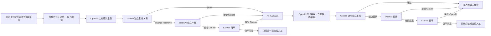

# 跨讲道主张比较与双模型归并流程 v1

> **读者**：Developer
> **类型**：流程
> **状态**：当前
> **与代码对齐**：未核对
> **权威范围**：跨讲道主张比较与双模型归并的执行步骤。

> 状态：已完成代码实现，并以“约与律法”五篇讲道的 88 条详细主张真实运行。这里的“归并”只建立主张之间的可审核关系，不改写或删除原主张，也不把处理批次预设成一个专题。

## 一、为什么这一步必须写成程序

单篇逐句详细整理产生的是各自独立、有来源锚点的主张。多篇讲道放在一起以后，还要回答：

- 两条主张是不是在说同一件事；
- 一条是否为另一条增加论据；
- 一条是否扩展或限定另一条；
- 两条是否形成对照，或后一条明确修正前一条；
- 两条是否只是共享“约”“律法”“义”“信”等词，实际并不相关；
- 暂时证据不足的材料是否应保持未归组。

这不是一次性的人工搬运。随着新讲道加入，旧关系可能增加、失效或需要重审，因此必须有可重复运行的程序、稳定 ID、输入与模型指纹、分代归档和双模型审核记录。

程序与 AI 的分工如下：



因此有两种不同的“合并”：

1. **机械合并**：把多篇知识包放进同一研究批次，解决 ID、来源和世代问题；不作语义判断。
2. **语义归并**：保存跨讲道主张之间的关系；不把原主张熔成一条，也不自动建立 canonical topic。

## 二、关系数据结构

每一条关系候选至少保存：

- `candidate_id`：由两端主张与关系类型产生的稳定 ID；
- `source_claim_id`、`target_claim_id`：关系两端；
- `relation_type`：关系类型；
- `source_evidence_step_ids`、`target_evidence_step_ids`：分别属于两端主张的实际证据；
- `reason`、`confidence`：提出关系的理由和置信度；
- 复核、仲裁和再审的逐轮决定；
- 最终 `review_status`，以及是否需要人工。

关系类型的严格含义是：

| 类型 | 含义 |
|---|---|
| `duplicate` | 两条主张的命题内容实质相同；对称关系 |
| `supports` | source 为 target 提供额外论据 |
| `extends` | source 保留 target 的核心判断并增加内容 |
| `qualifies` | source 为 target 增加限制、条件或适用边界 |
| `contrasts` | 两条主张形成值得保留的对照，但不足以说后来取代先前 |
| `supersedes` | 有明确内容与时间证据，表明后来修正或取代先前；不得只因日期较晚使用 |
| `unrelated` | 表面共享关键词或经文，实际回答不同问题；作为防止未来误合并的负面记录 |

每一条输入主张必须满足二者之一：至少参加一项跨讲比较，或明确列入 `unassigned_claim_ids`。`unassigned` 不表示无价值，只表示本批材料不足以建立跨讲关系。

## 三、机械闸门

模型结果必须通过以下检查，失败会携带上一版完整 JSON 自动重试：

1. 关系两端必须存在并来自不同讲道；
2. 两端不得是同一主张；
3. 同一对主张只能有一个最准确的比较判断；
4. 两端证据 ID 必须真实存在，并分别属于对应主张；
5. 所有主张必须进入某项比较或明确保持未归组；
6. Claude 必须逐条覆盖全部候选；
7. OpenAI 必须覆盖 Claude 的全部 `change/remove`；
8. Claude 再审必须覆盖 OpenAI 拒绝的全部意见；
9. 只有两个模型持续分歧才进入人工队列。

这里审核的是**来源忠实度与关系结构**，不是教授的神学是否正确。

## 四、可重现、可恢复运行

每个生成世代的指纹包括：

- 输入知识包 SHA256；
- prompt SHA256；
- 模型 ID；
- reasoning effort 与 temperature；
- response schema SHA256；
- pipeline schema version。

指纹相同即跳过模型调用。旧产物在覆盖前进入 `generations/`。Claude 独立复核按 12 条关系分批保存，避免一次长请求失败后丢失全部审核；程序最后仍机械验证全局候选是否被恰好覆盖一次。

运行命令：

```bash
PYTHONPATH=. .venv/bin/python -m backend.pipeline.cross_sermon_relation_runner \
  --knowledge "$DATA_BASE_DIR/wang-knowledge-platform/staging/claim-layer/research-batches/RB-COVENANT-LAW-VALIDATION-01/merged/research-batch-knowledge.json" \
  --output-dir "$DATA_BASE_DIR/wang-knowledge-platform/staging/claim-layer/research-batches/RB-COVENANT-LAW-VALIDATION-01/cross-sermon-relations"
```

更换批次时只替换输入和输出路径；不得用批次名称当作专题归属。`--force` 只在明确要求重做同一世代时使用。

## 五、五篇讲道实测

输入是五篇讲道独立整理和双模型来源复审后形成的中立研究包：

- 88 条 Claim；
- 184 条 EvidenceStep；
- 批次 `semantic_assumption = none`；
- 初始 `topic_candidates` 与 `knowledge_routes` 均为空。

真实运行结果：

| 项目 | 数量 |
|---|---:|
| OpenAI 关系候选 | 52 |
| 双模型共识正向关系 | 47 |
| 防误配的 `unrelated` 记录 | 4 |
| 双模型同意删除的错误候选 | 1 |
| 明确保留为未归组的主张 | 16 |
| 持续分歧、转人工 | 0 |

47 条正向关系包括：10 条 `duplicate`、16 条 `supports`、16 条 `extends`、4 条 `qualifies`、1 条 `contrasts`。

本轮出现 4 项 Claude 修改／删除建议：OpenAI 接受 3 项、拒绝 1 项；Claude 再审该分歧后接受 OpenAI 的原判断。因此没有为了消除分歧而盲从任何一方，也没有不必要的人工任务。

几项可解释的结果：

- 不同讲道反复出现的“宗主国先施恩、再提出要求；遵守要求维持而非建立关系”被识别为重复主张；
- 新讲道增加基督律法、圣灵帮助或具体经文依据时，保存为扩展、支持或限定，不把所有材料压成一条；
- “神的义”与罗马书 8:4 的“律法的义”因回答不同问题，被保存为 `unrelated`，防止日后只凭“义”字误合并；
- 一条只因共享“理性、证据、原文”等词而产生的错误方法论关联，经 Claude 提议、OpenAI 接受后删除。

## 六、输出与下一步边界

输出目录包含：

- `discovery.json`：OpenAI 原始关系候选；
- `review-parts/*.json`：Claude 分批独立复核；
- `independent-review.json`：合并并验证后的完整复核；
- `adjudication.json`：OpenAI 对修改／删除建议的仲裁；
- `reconsideration.json`：Claude 对被拒意见的再审；
- `reviewed-relations.json`：最终 AI 共识关系与仅含真实分歧的人工队列。

`reviewed-relations.json` 不是流程终点。通过复核的关系必须经由统一整合程序回写 PostgreSQL authoring store；否则后续释经、专题、问答、搜索和微讲道仍看不到这批跨讲知识。整合程序负责：

1. 验证每条关系的起点、终点和证据是否存在；
2. 把双模型共识与持续分歧分流；
3. 生成关系增量包与候选合并快照，供写入前审计；
4. 以 ChangeSet 写入同一个主库，并保留既有人工审核状态；
5. 以内容指纹保证同一批资料可安全重跑。

```bash
PYTHONPATH=. .venv/bin/python \
  -m backend.pipeline.knowledge_store_runner \
  ingest-reviewed-relations \
  "$DATA_BASE_DIR/wang-knowledge-platform/staging/claim-layer/research-batches/RB-COVENANT-LAW-CORE-NINE-01/cross-sermon-relations/reviewed-relations.json" \
  --base-package \
  "$DATA_BASE_DIR/wang-knowledge-platform/staging/claim-layer/research-batches/RB-COVENANT-LAW-CORE-NINE-01/merged/research-batch-knowledge.json" \
  --output-dir \
  "$DATA_BASE_DIR/wang-knowledge-platform/staging/claim-layer/research-batches/RB-COVENANT-LAW-CORE-NINE-01/integration" \
  --apply
```

`candidate-shared-knowledge.json` 是审计 artifact，不是另一个主库；`incremental-package.json` 是关系写入载体；真正的编辑权威仍是 PostgreSQL。AI 共识关系写入后保持候选状态，只有通过批准与完整性门槛的对象才会进入 Active Snapshot。

关系图本身仍然**不是专题目录**。关系审核完成后，`candidate_projection_runner.py` 以共识关系图和共享主张为输入，提出彼此独立的释经候选与专题候选。OpenAI 先建立候选编排，Claude 按候选逐项独立复核；有修改意见时由 OpenAI 仲裁，若 OpenAI 不接受，再交 Claude 复审。只有两个模型持续不同意的单项候选进入人工队列。

复核采用逐项、可恢复运行，而不是把全部主张和全部主题一次交给模型。这样可以避免长请求把输出额度全部耗在推理中，也使一项失败不会丢掉整批结果。每项结果按计划指纹保存在 `candidate-projection/plan-reviews/`，同一输入可以安全续跑。

候选投影仍不改写原始主张。一条主张可以同时进入释经和专题产品；释经轴必须直接服务目标经文，专题轴必须围绕跨讲问题，不能因同批处理或共享关键词而强行合并。

运行命令：

```bash
PYTHONPATH=. backend/.venv/bin/python \
  -m backend.pipeline.candidate_projection_runner --apply
```

`--apply` 将 AI 共识候选写入 PostgreSQL authoring store；不代表人工批准或可以出版。管理员 UI `/admin/thought-review/candidates` 直接从数据库读取这些 `ProductPlan`、`CompositionDecision`、`KnowledgeRoute` 与 `EditorialSynthesis`。

本轮五篇讲道实测得到：

| 项目 | 数量 |
|---|---:|
| 进入逐项复核的候选计划 | 16 |
| Claude 直接通过原案 | 15 |
| Claude 建议改轴且 OpenAI 接受 | 1 |
| 持续分歧、转人工 | 0 |
| 最终释经候选 | 9 |
| 最终专题候选 | 7 |

被调整的一项原本把同一篇罗马书讲道的四条主张列为跨讲专题；Claude 指出它实际集中解释罗马书 3:25，OpenAI 接受并改为释经候选。这说明双模型复核能够纠正“有神学主题就自动变成专题”的归轴错误。

## 七、代码位置

- 关系 schema、规范化、验证与共识应用：`backend/pipeline/cross_sermon_relation.py`
- 可恢复 runner：`backend/pipeline/cross_sermon_relation_runner.py`
- 四个模型 prompt：`backend/pipeline/prompts/cross_sermon_relation_*.md`
- 测试：`backend/tests/test_cross_sermon_relation.py`
- 候选投影 schema 与稳定 ID：`backend/pipeline/candidate_projection.py`
- 候选投影双模型 runner：`backend/pipeline/candidate_projection_runner.py`
- 候选投影 prompts：`backend/pipeline/prompts/candidate_projection_*.md`
- 候选投影测试：`backend/tests/test_candidate_projection.py`

## 八、关系图之后：自动发现专题层级

跨讲关系只是“哪些主张彼此重复、支持、扩展、限定或相反”，不能直接当作专题目录。为避免再次要求同工手工发现“母题—子专题—篇章段落”，关系整合后增加独立的结构发现阶段：OpenAI 根据共享主张图提出候选层级，Claude 按母题复核，OpenAI 仲裁，Claude 对分歧再审；只有持续分歧才转人工。

该阶段强制每条主张恰好有一个主要专题归宿或明确保持未归组，且所有标题与段落安排都标为编辑候选。核心九篇实测及完整流程见 [母题—子专题—篇章段落自动发现与双模型复核 v1](./topic_structure_discovery_workflow_v1.md)。
