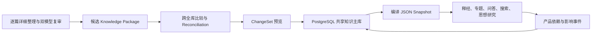

# PostgreSQL 共享知识主库 v1

> **读者**：Solution architect
> **类型**：规范
> **状态**：当前
> **与代码对齐**：未核对
> **权威范围**：谁是编辑权威，ChangeSet 如何验证与写入。

## 一、为什么现在需要数据库

`shared_knowledge_pilot_v1.json` 证明了共享知识模型能够同时支撑释经、专题、问答、搜索和学术思想整理，但它不适合作为 205 篇讲道长期协作的主库：

- 一个大型 JSON 文件无法安全处理两位同工同时审核；
- 每批讲道若各自产生一个“合并结果”，批次很快会变成互不相认的资料岛；
- 主张修订、AI 复审、人工决定及产品撤回需要追加历史，而不是覆盖原文件；
- 导入数百或数千对象时必须全部成功或全部失败；
- 必须能反查一条主张影响了哪些释经、专题、问答和搜索结果。

因此 PostgreSQL 从本版本开始承担 **authoring authority**。JSON 不会消失：它继续作为可重复生成的交换包、审核 artifact 和现有 UI 的只读 compiled snapshot。



`ResearchBatch` 只负责“这一轮选择哪些讲道一起处理”，不拥有独立主题身份，也不成为第二个知识库。

## 二、为什么不是十九张固定业务表

共享模型已经有来源、片段、问题、观察、证据、主张、关系、主题、篇章计划、依赖和影响事件等十九类对象，而且模型仍在演进。现在把每个可选研究字段都固化成关系栏位，会让 schema migration 反过来拖慢知识整理。

第一版采用 **关系型骨架 + JSONB 内容**：

- `objects`：所有当前对象，主键为 `collection + object_id`；
- `object_versions`：每次修订的不可变历史；
- `edges`：把证据关系、主张关系和负约束投影成可查询的 directed graph；
- `change_sets` / `change_operations`：批次写入、幂等性和完整审计；
- `review_events`：AI、人工和系统审核的追加式决定；
- Pydantic 模型仍负责每类对象的内容验证。

这不是“把 JSON 塞进数据库”而放弃关系。稳定身份、版本、事务、关系索引、审核和变更传播都由 PostgreSQL 管理；仍在变化的研究字段保留在经过 schema 验证的 JSONB 中。将来某个字段稳定且查询量大时，可以无损提升为正式栏位或物化视图。

## 三、ChangeSet 合并规则

每次导入先产生 ChangeSet，不直接写库：

1. 依据 `collection + stable ID` 找到现有对象；
2. 比较不含 revision 的 semantic SHA256；
3. 分成 create、update、unchanged；
4. 已由人工审核的 review fields 不会被新的 AI candidate 静默覆盖；
5. 只有显式 `--apply` 才在一个事务中写入全部对象、版本、边和操作记录；
6. 并发期间对象发生变化时，before hash 不一致，整个事务拒绝；
7. 相同来源包再次运行，以 ChangeSet fingerprint 判定为 `already_applied`；
8. 主张变更时，引用旧 revision 的 `ProductDependency` 标成 invalidated，并建立 `ImpactEvent`。

跨讲比较的正向共识进入 `claim_relations`。`unrelated` 不会被丢弃，而会变成 `claim_relation_constraints`，防止以后模型再次把两条不相关主张误合并。

## 四、当前资料如何进入主库

推荐环境变量：

```bash
export KNOWLEDGE_DATABASE_URL='postgresql:///smart_answer_knowledge'
```

执行迁移：

```bash
.venv/bin/python -m backend.pipeline.knowledge_store_runner migrate
```

所有导入默认只预览：

```bash
.venv/bin/python -m backend.pipeline.knowledge_store_runner \
  ingest-package "$DATA_BASE_DIR/wang-knowledge-platform/staging/claim-layer/shared_knowledge_pilot_v1.json"
```

审核预览后显式应用：

```bash
.venv/bin/python -m backend.pipeline.knowledge_store_runner \
  ingest-package "$DATA_BASE_DIR/wang-knowledge-platform/staging/claim-layer/shared_knowledge_pilot_v1.json" --apply
```

研究批次先作为未分类的增量对象进入同一主库，再写入经过双模型审核的跨讲关系。跨讲关系不能只停留在批次目录，也不能直接修改一个大型 JSON；正式程序会先验证关系两端、证据 ID、关系 ID 冲突和自指关系，再生成可审计的增量包、候选快照、人工队列及整合报告：

```bash
.venv/bin/python -m backend.pipeline.knowledge_store_runner \
  ingest-reviewed-relations \
  "$DATA_BASE_DIR/wang-knowledge-platform/staging/claim-layer/research-batches/RB-COVENANT-LAW-CORE-NINE-01/cross-sermon-relations/reviewed-relations.json" \
  --base-package \
  "$DATA_BASE_DIR/wang-knowledge-platform/staging/claim-layer/research-batches/RB-COVENANT-LAW-CORE-NINE-01/merged/research-batch-knowledge.json" \
  --output-dir \
  "$DATA_BASE_DIR/wang-knowledge-platform/staging/claim-layer/research-batches/RB-COVENANT-LAW-CORE-NINE-01/integration" \
  --apply
```

`--apply` 以两个独立 ChangeSet 完成工作：先把研究批次中的来源、问题、观察、证据、主张及讲内关系写入 PostgreSQL，再写入通过双模型共识的跨讲关系。持续分歧的项目只进入 `human-review-queue.json`，不会写入主库。两次写入都以内容指纹保证幂等；相同输入重跑应返回 `already_applied`。

整合目录包含：

```text
integration/
├── incremental-package.json          # 可写入主库的共识关系增量
├── candidate-shared-knowledge.json   # 供审查和比较的候选合并结果
├── human-review-queue.json           # 仅含双模型持续分歧
└── integration-report.json           # 验证、计数与数据库变更预览
```

2026-08-12 核心九篇实测：67 条共识关系全部写入（59 新增、8 更新），1 条持续分歧留在人工队列；相同基础包与关系包再次执行均返回 `already_applied`。这些关系进入 authoring store 后仍是 AI 共识候选，不会自动进入 approved-only Active Snapshot。

为内部工具编译完整的兼容包（包含候选资料，不可直接公开）：

```bash
.venv/bin/python -m backend.pipeline.knowledge_store_runner \
  compile "$DATA_BASE_DIR/wang-knowledge-platform/compiled/shared_knowledge_active.json"
```

把现有人工审核状态迁入 PostgreSQL（可重复执行）：

```bash
.venv/bin/python -m backend.pipeline.knowledge_store_runner \
  sync-review-state "$DATA_BASE_DIR/wang-knowledge-platform/staging/claim-layer/review_state.json"
```

把来源片段绑定到当前人工校订逐字稿版本。此程序只接受逐字相符的引文；不相符的片段保留为 unresolved，不用模糊匹配猜测：

```bash
.venv/bin/python -m backend.pipeline.knowledge_store_runner \
  bind-source-anchors /opt/homebrew/var/www/church/web/data/script_published --apply
```

## 五、Authoring Store 与 Active Snapshot

二者职责不同：

- **PostgreSQL Authoring Store** 是编辑主库，保存候选、退回、批准、拒绝、版本、审核事件及关系；
- **Active Snapshot** 是从主库生成的只读 JSON，只包含可以安全提供给产品读取的已批准知识；
- Active Snapshot 是 build artifact，不是第二个主库，也不能反向覆盖 PostgreSQL；
- 新 build 失败时，`active.json` 指针保持指向上一个成功版本，公开消费者不会读到半成品。

Active Snapshot 的发布门槛：

1. Claim 必须经过人工批准；
2. 至少有一项 eligible evidence；
3. Evidence 必须指向已经绑定逐字稿版本的 SourceFragment；
4. 相关来源必须存在；
5. 已失效的产品依赖会阻止重新发布；
6. Relation、Topic、Route、Question、Composition Plan 也只有批准后才进入快照。

命令行建立快照：

```bash
.venv/bin/python -m backend.pipeline.knowledge_store_runner \
  compile-active "$DATA_BASE_DIR/wang-knowledge-platform/compiled/active-snapshots"
```

输出结构：

```text
$DATA_BASE_DIR/wang-knowledge-platform/compiled/active-snapshots/
├── active.json                         # 原子更新的当前版本指针
└── builds/<build_id>/
    ├── manifest.json                   # build ID、hash 与计数
    └── shared_knowledge.json           # 已批准的只读知识子图
```

`/admin/thought-review` 仍是原来的思想与篇章审核工作台，并没有新造一套管理员 UI。现在它：

- 从 PostgreSQL 读取当前编辑记录；
- 把审核决定写入 PostgreSQL 的版本与审核事件；
- 暂时同步旧 `review_state.json`，供迁移期间的旧代码兼容；
- 显示当前编辑主库和 Active Snapshot build；
- 提供“重建对外读取快照”按钮。

证据在工作台中按资格分层显示，不能因为 PostgreSQL 导入了新候选就混淆审核状态：

- **可核查的论证与原始来源**：已经具备支持资格，可计入 Claim 批准门槛；
- **待审核的可定位证据**：已有逐字原文、来源和时间定位，但仍是 candidate，只供核对，不计入批准门槛；
- **对话与反方背景**：用于理解问题和争论背景，不支持教授本人的主张；
- **待补来源或证据不足**：缺少可靠锚点或已被双模型共识扣留。

工作队列也必须区分“自动流程还没跑”和“确实需要同工判断”：

- **待 AI 复核**：尚未执行独立模型审核，不进入人工队列；
- **待证据审核**：主张复核已完成，但可定位来源仍需取得证据资格，不进入人工队列；
- **待 AI 仲裁**：Claude 已提出问题，等待 OpenAI 仲裁，不进入人工队列；
- **需人工处理**：只用于双模型持续分歧、来源本身无法裁定等 AI 无法解决的情形；
- **抽查核对**：对已经通过的 AI 结果进行少量随机质量抽查。

因此，候选状态不等于人工任务；“尚未运行自动流程”更不能用红色人工警告表示。

旧工作台使用 `sources / fragments / relations` 等显示字段，PostgreSQL 使用
`source_documents / source_fragments / knowledge_relations / claim_relations` 等正式表名。
API 负责做显示层兼容映射；这只是 UI 命名转换，不产生第二份统计或语义主库。

工作区索引与对象详情由不同 API 提供。每次 PostgreSQL 工作区刷新后，前端都要同步刷新当前对象详情，即使选中的 `claim_id` 没有改变；否则 React 不会因相同 ID 再次触发请求，会造成左栏有选中项、右栏却空白。当前实现使用工作区 revision 触发详情重载，并以 `AbortController` 取消过期请求；重复点击同一对象也会重载。详情未返回时显示恢复操作，不再静默留白。

公开页面目前尚未切换到 Active Snapshot；应在管理员读取、审核、编译和回滚流程稳定后再切换。

## 六、第一版明确不做什么

- 不引入图数据库；PostgreSQL 的 edge table 足够支持当前 directed graph。
- 不把每个 ResearchBatch 建成独立 schema 或独立 database。
- 不把 transcript、录音和视频复制进数据库；数据库保存身份、hash、定位和审核状态，原文件仍由现有来源系统管理。
- 不立刻切换公开 UI。现有管理员审核页先接 PostgreSQL；公开产品仍待 Active Snapshot 稳定后逐项迁移。
- 不让跨讲 `duplicate` 自动删除任一来源主张。来源主张保持独立，专题归并属于后续编辑综合。

## 七、验收状态

2026-08-11 已在独立临时 PostgreSQL 数据库真实验证：

- migration 可重复执行；
- 当前共享包写入 857 个对象；
- 同一包第二次导入返回 `already_applied`；
- 五篇研究包新增 1,014 个对象；
- 双模型跨讲审核结果新增 47 条正向关系，并保留 4 条负向比较为约束；
- 三次写入形成三个 applied ChangeSet；
- 可重新编译出包含 8 个来源、135 条主张、366 个证据步骤和 135 条主张关系的兼容 JSON snapshot；
- 临时数据库测试后已删除，没有修改网站现有资料。

本机正式 authoring database `smart_answer_knowledge` 已建立并载入当前资料。首个 Active Snapshot 已成功生成：6 条人工批准 Claim、17 条合格 Evidence、17 个已绑定 SourceFragment 与 2 个 SourceDocument。另有 40 个旧片段因原文不完全相符而维持 unresolved；它们没有被猜测性绑定，也没有进入已批准快照。

生产部署仍需决定连接凭证、备份、迁移及公开消费者切换时点；这些部署决定不改变“PostgreSQL 是编辑权威、Active Snapshot 是可回滚只读投影”的边界。
