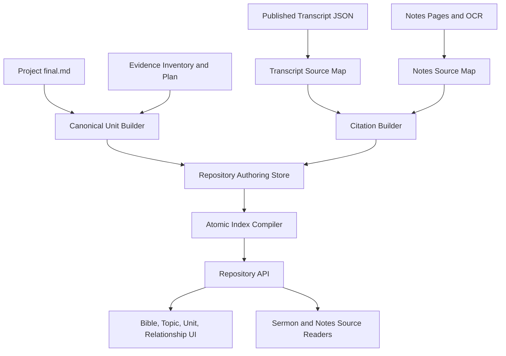
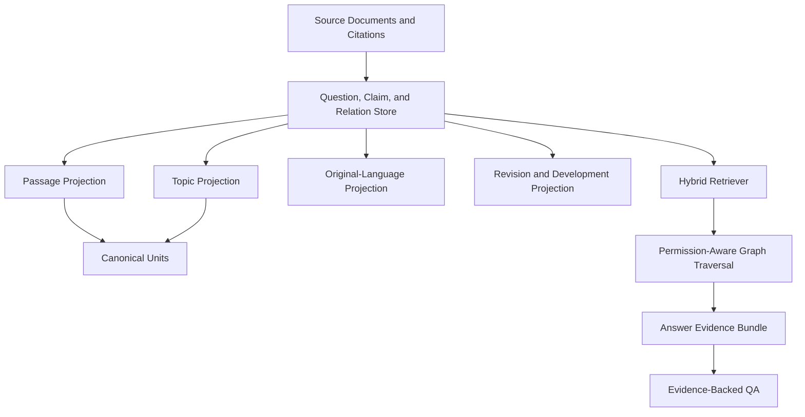

# Technical Specification: Exegesis and Topic Repository

> **读者**：Developer
> **类型**：规范
> **状态**：当前
> **与代码对齐**：未核对
> **权威范围**：Architecture, storage layout and identifiers。本文是《文库 Technical Specification》的一部分。

> This specification implements the goals described in the [Project Mission Statement](../../00-overview/project_mission_statement.md). The Mission Statement is authoritative for why the repository exists and how original teaching, claims, arguments, recurring thought, exegesis, and topic articles relate.
>
> The cross-product claim graph, original-language model, QA contract, permissions, and evolution policy are defined in [王守仁教授释经与思想知识平台设计](../../00-overview/knowledge_platform_design.md).

本规范拆成五个文件：

| 文件 | 内容 |
| --- | --- |
| [Technical Specification: Exegesis and Topic Repository](./README.md) | Architecture, storage layout and identifiers |
| [Data Models](./data-models.md) | Every stored record type in the repository |
| [Evidence Pipeline, Compiler, Read Model and Invalidation](./compiler.md) | How source material becomes queryable state, and what invalidates it |
| [API, Frontend, Source Resolution and Authorization](./api-and-ui.md) | The surfaces this repository exposes |
| [Observability, Testing, Phases, Deployment and Acceptance](./delivery.md) | How the work is verified and shipped |

### Contents

- [1. Architecture Overview](#1-architecture-overview)
- [2. Existing Components to Reuse](#2-existing-components-to-reuse)
- [3. Storage Layout](#3-storage-layout)
- [4. Identifiers](#4-identifiers)

## 1. Architecture Overview

The Exegesis and Topic Repository is a new read and editorial layer over the existing Notes to Sermon and Transcript to Manuscript workflows. It does not replace Series, Lecture, Project, `final.md`, Evidence Inventory, theological review, or sermon transcript storage.

The implemented repository currently separates four responsibilities:

1. **Production artifacts**: existing Project files used to create and review manuscripts.
2. **Repository authoring records**: reviewed canonical units, source documents, citations, and relationships.
3. **Compiled repository indexes**: atomically generated Bible, topic, lookup, and search projections.
4. **Source readers**: public or authenticated pages that resolve a citation and highlight original content.

The target knowledge platform adds two responsibilities without replacing the four above:

5. **Knowledge authoring records**: reviewed questions, claims, evidence steps, inference bridges, claim relations, Scripture and external evidence, original-language judgments, applications, passage interpretation chains, and revisions.
6. **Knowledge services**: permission-aware hybrid retrieval, bounded graph traversal, answer evidence bundles, and product projections for manuscripts, QA, search, comparison, and study tools.



Target extension:




## 2. Existing Components to Reuse

### Manuscript production

* `data/notes_to_surmon/{project_id}/final.md`
* `data/transcripts_to_manuscript/{project_id}/final.md`
* Project `meta.json`
* `evidence_inventory.json`
* `manuscript_plan.json`
* draft/final chunk metadata
* cross-lecture continuity proposals and integration applications

### Topic and Bible seed catalog

The existing `backend/pipeline/seed_catalog` output is the migration seed, not the final public store:

* `canonical_units.json`
* `bible_index.json`
* `topic_taxonomy.json`
* `topic_aliases.json`
* `duplicate_candidates.json`
* `review_needed.json`

Seed records remain `candidate_requires_review` until approved.

### Transcript source metadata

Published transcript JSON already contains:

* paragraph `index`;
* `start_index` and `end_index`;
* `start_time` and `end_time`;
* `start_timeline`; and
* paragraph text and type.

### Notes source metadata

Notes Projects already contain:

* ordered source pages in `meta.json.pages`;
* page markers in `unified_source.md` using `<!-- Page: ... -->`;
* per-page OCR Markdown under the shared raw OCR store; and
* source images served by the notes image endpoint.

### Public navigation and search

The existing `TopicNavigator`, topic index, `ScriptureMarkdown`, and sermon search are reused or adapted. The existing topic index currently links to manuscript heading anchors; repository citations add original-source links without removing manuscript links.


## 3. Storage Layout

The repository uses filesystem JSON as the reviewable source of truth and compiles an atomic read model for public requests.

```text
DATA_BASE_DIR/
  canonical_repository/
    repository_manifest.json
    units/
      {unit_id}.json
    sources/
      {source_id}.json
    source_maps/
      {source_id}.json
    citations/
      {citation_id}.json
    relationships/
      relationships.json
    questions/
      {question_id}.json
    claims/
      {claim_id}.json
    claim_relations/
      relations.json
    scripture_evidence/
      {scripture_evidence_id}.json
    original_language/
      {judgment_id}.json
    applications/
      {application_id}.json
    evidence_steps/
      {evidence_step_id}.json
    inference_bridges/
      {inference_bridge_id}.json
    passage_chains/
      {passage_chain_id}.json
    external_evidence/
      {external_evidence_id}.json
    publication_profiles/
      {profile_id}.json
    composition_plans/
      {plan_id}.json
    composition_decisions/
      {decision_id}.json
    review_scopes/
      {review_scope_id}.json
    review_work_items/
      {work_item_id}.json
    thought_maps/
      {thought_map_id}.json
    revisions/
      {revision_id}.json
    reviews/
      unit_reviews.json
      citation_reviews.json
      claim_reviews.json
      relation_reviews.json
      original_language_reviews.json
      publication_profile_reviews.json
      composition_plan_reviews.json
      composition_decision_reviews.json
      capacity_events.jsonl
    builds/
      {build_id}/
        repository.sqlite3
        bible_index.json
        topic_index.json
        original_language_index.json
        thought_map.json
        build_manifest.json
    active.json
```

`active.json` points to the last fully validated build. A compiler writes to a new build directory, validates it, and atomically replaces `active.json`. Failed builds remain diagnostic artifacts and never become public.

The initial implementation may serve small index responses directly from compiled JSON. Point lookups and filtered queries use `repository.sqlite3` so the design scales beyond the Matthew pilot.


## 4. Identifiers

IDs must not depend on editable titles.

### Canonical unit ID

* Existing reviewed seed IDs such as `CU-SEED-c6138b9864f3` are retained.
* New units use `CU-{stable-hash}` derived from the approved unit lineage, not the title alone.
* A title change does not change the ID.

### Source document ID

`SD-{stable-hash(source_type, origin_id)}`

Examples of `origin_id`:

* sermon transcript filename without `.json`;
* notes Project ID plus source page collection identity.

### Citation ID

`CIT-{random-or-content-independent-id}`

Citation IDs remain stable when an editor adjusts a locator. The citation record stores revision and source hashes.

Argument-layer `SourceFragment` and `EvidenceStep` do not define a second citation identity. A fragment stores `citation_id`, source/paragraph/excerpt hashes and an `anchor_state`; an evidence step stores `citation_ids`. Eligibility and approval require those IDs to resolve through the canonical citation service.

### Topic ID

`TopicNode.topic_id` is the only authoritative thematic identity. `CanonicalUnit.topic_assignments` and `KnowledgeRoute.canonical_topic_ids` are foreign keys to it. Legacy `topic_###` search IDs and analysis-time `TOPIC-*` route targets are retained only in reconciliation metadata or aliases; they are not valid substitutes for a `TopicNode` ID.

### Relationship ID

`REL-{stable-hash(from_unit_id, to_unit_id, relationship_type)}`

### Question, claim, and claim-relation IDs

* `Q-{content-independent-stable-id}` identifies a question across wording edits.
* `CL-{content-independent-stable-id}` identifies a repository-wide claim. Per-Project IDs such as `C001` or `E003` remain source-local lineage and never become global identity.
* `CR-{stable-hash(from_claim_id, to_claim_id, relation_type, relation_lineage)}` identifies a reviewed claim relation.

### Original-language and revision IDs

* `OLJ-{content-independent-stable-id}` identifies one original-language or translation judgment.
* `ES-{content-independent-stable-id}` identifies one evidence observation across wording edits.
* `IB-{content-independent-stable-id}` identifies one attributed inference bridge.
* `PIC-{passage-lineage-id}` identifies one passage interpretation chain across revisions.
* `EE-{content-independent-stable-id}` identifies one external-evidence assertion.
* `TMR-{monotonic-or-content-independent-id}` identifies a thought-map revision.

### Publication and composition IDs

* `PP-{content-independent-stable-id}` identifies a reusable Publication Profile across wording and rule revisions.
* `CP-{content-independent-stable-id}` identifies the editorial plan for one authored work.
* `CD-{content-independent-stable-id}` identifies one material composition decision within a plan.
* `DRS-{content-independent-stable-id}` identifies one versioned deliverable review scope.
* `RWI-{content-independent-stable-id}` identifies one review work item across assignment changes.

Split and merge operations create new IDs and preserve redirects/lineage from earlier records. A title, Chinese wording, topic path, or model-generated summary must never be the sole identity input.
