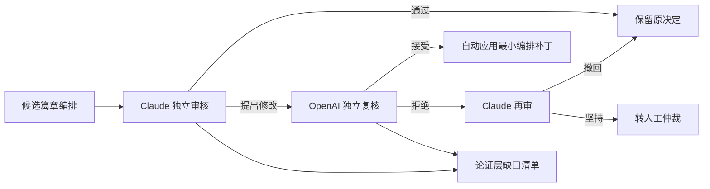
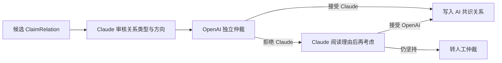

# 篇章编排双模型审核 v1

## 一、目的

篇章编排不是教授原话的机械投影，而是编辑为了某个产品所作的新判断。释经文章要按经文问题推进，专题文章要按跨讲论证推进；即使两者使用同一批共享主张，也不能混成同一份大纲。

本流程同时验证两件事：

1. 编排决定是否忠实、清楚、适合该产品；
2. 现有论证层是否真的足以支撑该编排。

第二点很重要。审核不能只把文章改顺，而把缺少主张、证据或关系的问题藏在编辑文字里。

## 二、审核边界

Claude Sonnet 5 先作独立审核，OpenAI `gpt-5.6-sol` 再逐项复核。两者都被明确限制为：

- 不作神学批评；
- 不用外部注释补写教授没有说过的观点；
- 不把编辑综合冒充教授主张；
- 不因同一主张服务多个产品，就合并不同产品的编排；
- 普查线索不得冒充已经逐句整理和核实的主张。

处理规则：

自动应用不等于人工批准或出版批准。候选计划继续保留 `not_human_approved` 状态。

## 三、数据与可重现性

每次审核保存三份 artifact：

- `*.independent-review.json`：Claude 的逐决定审核及全计划论证层评估；
- `*.adjudication.json`：OpenAI 的接受/拒绝、Claude 再审及最终路由；
- `*.reviewed-candidate.json`：只应用两模型共识补丁后的候选计划。

审核指纹包括计划、共享知识、prompt、模型和 schema 版本。合法 `action` 只能使用系统枚举；专题目标和主张层级有独立结构字段，禁止把“把 action 改成……”这类说明文字写进数据值。

## 四、第一次双轴纵向验证结果

验证对象：

- 经文轴：`CP-matthew-26-1-30-011`，使用 011WSR01 的逐句详细知识；
- 专题轴：`CP-topic-son-of-man`，综合第三讲、第四讲、011WSR01 及全库普查线索。

| 计划 | 决定数 | Claude 直接通过 | 两模型一致修正 | 转人工 | 论证层 |
|---|---:|---:|---:|---:|---|
| 马太 26:1–30 释经 | 9 | 6 | 3 | 0 | 可用但有缺口 |
| 「那人子」专题 | 6 | 2 | 4 | 0 | 可用但有缺口 |

审核揭示的主要价值不是修改数字，而是区分了两类问题：

- **编排问题**：例如专题段落误收登山变像主张、释经段落建立了没有目标的专题链接；
- **论证层问题**：例如跨讲相同主张缺少显式关系、段落层级暗示了尚未登记的关系、赦罪与安息日材料仍只有普查线索。

因此，这次结果支持当前总体模型，但也证明论证层仍不能被称为完整。准确说法是：它已经足以发现和阻止若干编排错误，同时能暴露下一轮详细知识整理的优先任务。

## 五、结构修复不能只停留在篇章备注

当复审指出 `missing_claim_relation`，仲裁接受后必须区分两种结果：

1. 证据确实支持一条正边：写入版本化 `ClaimRelation`（例如跨讲 `corroborates` 或有限的 `contextualizes`）。
2. 两项材料只是共同服务同一段落：写入 `ClaimRelationConstraint`，明确禁止目前不能成立的 `supports`，并在 composition hierarchy 中标为 `parallel_context`。

`$DATA_BASE_DIR/wang-knowledge-platform/staging/claim-layer/claim_relation_consensus_v1.json` 是这类跨篇章、跨来源结构判断的候选交换文件。共享知识构建器负责验证 endpoint、关系类型、重复 ID 和负约束；违反约束时直接停止构建。后续 Composition AI review 输入同时包含正边与负约束，避免第二次复审再次建议同一个错误关系。

## 六、同工如何查看

在 `/admin/thought-review` 选择“篇章编排审核”，再选择计划和编排决定。右侧显示当前采用的编排、Claude 意见、OpenAI 复核、计划级“论证层支撑检查”，以及缺少的主张、关系或证据。

原始计划不被覆盖；共享知识构建器优先读取 `reviewed-candidate`，供后续产品验证使用。

## 七、主张关系也必须独立复审

篇章审核发现的关系缺口，不能只写回段落说明。新增或沿用的 `ClaimRelation` 另走关系级双模型流程：

这里审核的只是“教授的这些主张之间能否建立该结构关系”，不得评价神学真伪。审核 artifact 保存来源、prompt、模型与 schema 指纹；共享知识构建器必须实际套用最终关系类型，而不是只保存审核记录。

专题编排若在两个段落复用同一主张，必须用 `evidence_step_scope` 指明各段使用哪些论证步骤。例如「那人子」专题把定冠词步骤分配给称号段，把但以理异象与司提反用例分配给经文论证段，避免同一主张在成文时重复展开。

来源线索也分成熟度：`source_lead_ids` 只列当前决定实际消费、且已经连接主张的来源；尚待详细整理的讲次放入 `followup_source_lead_ids`。同理，`passage` 只写当前有主张支撑的经文，普查发现但尚未整理的经文写入 `pending_passages`。这可以防止 UI 把“研究方向”显示成“已经完成的覆盖”。

段落之间需要顺畅衔接，不代表两条教授主张之间必然存在论证边。若材料只能支持“编辑决定先谈身份、再考察权柄”这样的产品顺序，应写入带 `editorial_attribution: editor` 的 `editorial_transition`，而不是为了文章流畅制造 `ClaimRelation`。只有教授的材料本身支持关系类型和方向时，才进入主张图。
