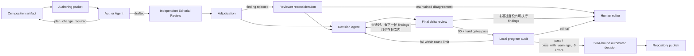

# 馬太福音釋經文章多 Agent 寫作流程 v1

## 1. 原則

這是一條領域專用、以版本化 artifact 交接的工作流，不是通用聊天 Agent，也不恢復已退役的 `backend/api/multi_agent/`。可重複性指同一組輸入契約、角色邊界、審核門檻與交接產物可以反覆執行；它不要求模型每次逐字生成相同文章。

所有模型只讀明确交付给它的 packet，不自行遍历仓库。Author Agent 使用完整 `AuthoringPacket`；Editorial Review Agent 使用独立、受大小预算约束的 `EditorialReviewPacket`，不得复用完整写作 packet。每一个阶段记录输入 hash、prompt、schema、model 与上游 artifact；输入改变即产生新 generation。模型不能自行宣告发布；程序只有在重新计算总分与 hard gates、验证 review 和 audit SHA、确认 Program Audit 零错误后，才生成明确标记为 automated 的发布决定。

## 2. 角色与边界

1. Composition Agent：决定材料进入正文、专題或暂不处理，并给出段落功能；不写最终散文。
2. Author Agent：以 1–16 章的笔记整理稿为母本，写出平实而充实的完整文章；不裁决来源冲突，不更改 composition 意图。
3. Editorial Review Agent：独立判断成文质量、母本保全、普通读者可读性和神学张力；不重做 claim extraction，也不直接改稿。
4. Adjudication Agent：逐条判断 review finding 是否成立、是否可执行；不新增问题，不代替作者写作。
5. Reconsideration Agent：只复核被裁决驳回的 finding；仍有分歧则转人工。
6. Revision Agent：根据已接受 finding 重写完整稿，并逐条报告 resolved/deferred；blocking finding 不可 deferred。
7. Program Audit：在本地读取完整 knowledge snapshot、provenance、manifest、必要经文、链接、音频和机器可验证的不变量；完整知识数据不得发送给写作品质 reviewer，Program Audit 也不判断文章是否写得好。
8. Human Editor：只处理 composition 变更、持续分歧、未决神学张力或自动门槛无法解决的情况；通过全部自动门槛的稿件不再等待人工发布操作。

## 3. 输入契约

每次运行在本地至少需要：

- canonical CompositionPlan 或经共识修订的 reviewed candidate；
- passage knowledge snapshot；
- `base-manuscript-contract.json`，含母本 path/hash、承重步骤、允许的补充操作；
- publication profile；
- writing quality profile；
- 所有实际文本片段。packet 不得只给模型一个本机文件路径。

当 CompositionPlan 明确消费跨讲 `CanonicalViewpoint` 或 `ArgumentRoute` 时，runner 还必须接收按 [Canonical Viewpoint Registry 与跨讲论证路径设计 v1](../canonical_viewpoint_registry_design_v1.md) 编译的 `ViewpointKnowledgeProjection`，并在计划、knowledge snapshot、AuthoringPacket 与 Program Audit manifest 中绑定 projection SHA、viewpoint semantic revision、registry snapshot、实际 Claim/Evidence/Citation dependencies。Author 与 Revision 不读取整份 architecture 文档，也不得自行遍历 registry；它们只读取当前篇章的最小 projection 切片。Editorial Reviewer 继续遵守本文件 3.1/3.2 的独立 packet 边界，不接收 knowledge projection。未使用 viewpoint 层的来源局部文章不因此增加虚假输入。

对马太福音 1–16 章，补充材料只允许 `corroborate`、`extend`、`qualify`、`tension`、`route_out`；不得用补充讲道取代母本框架。契约每个 section 的 `allowed_operations` 与 `ineligible_operations` 由程序执行：author ledger 的 `applied_operations` 必须落在 `allowed_operations` 之内，任何被列为 `ineligible_operations` 的操作（无论申报在 `applied_operations` 还是 `integration_operations`）都直接判交稿失败，不进 review。

宣告 preserved 的母本承重步骤不再只靠作者自报：ledger 的 `preserved_step_anchors` 必须为每条 preserved step 指出承载它的稿件片段，程序以逐字子串比对验证 anchor 确实存在于稿件中；缺 anchor、anchor 不是 exact substring，或 anchor 指向未申报 preserved 的 step，都在 review 之前失败。位置验证只确认承载点存在，不判断推理是否写足，深度仍由 reviewer 按 rubric 校准。

### 3.1 EditorialReviewPacket

初次独立审稿使用 `matthew-exposition-editorial-review-packet.v1`，只包含当前稿件及 SHA、精简后的母本承重步骤、author section ledger（含已验证的 `preserved_step_anchors`，供 reviewer 直接判断该处是推理还是摘要）、writing quality profile 和明确 scope。它不得包含 knowledge records、topic nodes、source fragments、evidence steps、CompositionPlan 或 base manuscript 全文。canonical JSON 硬上限为 40 KiB；超出时在调用模型前失败，不得静默截断。

### 3.2 FinalDeltaReviewPacket

修订后的最终重审使用 `matthew-exposition-final-delta-review-packet.v1`，只包含修改前后段落、变动段落所属的 `changed_section_ids`、前次已验证 review 与 outcome、accepted findings、finding dispositions、受影响维度及其必须复查的 hard-failure ID，以及前稿／现稿 SHA。不得发送完整修订稿或完整 `AuthoringPacket`。

程序按 accepted finding 的维度及显式耦合表选择受影响维度，并与**实际变动段落所属 section** 的维度取并集：Revision Agent 输出的是完整重写稿，段落可能在没有任何 finding 指向的 section 里改动。程序用 author ledger 的 `output_anchor` 把每个 `changed_paragraphs` 定位到 section（记录在 packet 的 `changed_section_ids`），该 section 的散文级维度（`general_reader_readability`、`approved_written_style`、`concision_without_compression`）与 baseline review 曾在该 section 定位的维度都必须重评，不得继承。段落无法定位到任何 section 时保守地把全部 section 视为已变动。Reviewer 只能重评这些维度；其他维度只能从已完成 schema、逐字 anchor、rubric 与 manuscript SHA 校验的 baseline review 继承。模型不计算最终总分，也不决定 hard gate；runner 合并分数后重新计算总分、维度最低线和 hard failures。

### 3.3 每轮一次 Reviewer 调用

初稿只调用一次 Independent Editorial Reviewer。此后每一轮 Revision 只调用一次 Final Delta Reviewer；同一次 delta 响应必须同时完成旧 findings 验收、受影响维度评分、受影响 hard failures 检查，以及在程序重算仍无法通过时提出下一轮可执行 findings。不得在 Delta Review 后追加 Score-Gap Review，也不得把修订稿重新送回完整 Editorial Review。

下一轮直接继承本轮 merged review、程序重算 outcome 与 manuscript SHA，然后进入 Revision。若任一维度未达其 minimum 或 hard gates 未通过，而 Delta Reviewer 在允许范围内没有诚实、可执行的新 finding，runner 安全停止并转人工；不得为了让某一维度跨过门槛而增加另一次 reviewer 调用或制造 finding。所有 reviewer packet 继续受 40 KiB 硬上限约束。

## 4. Agent 状态机



圖中的 rubric `pass` 的判準是：每一個適用維度都達到 quality profile 為它設的 `minimum`（profile revision 4 為各自 weight 的 80%），且沒有宣告任何 hard failure。**沒有總分門檻**——`total_score` 只報給人看，不決定任何事。單一總分曾讓弱維度被其他維度抬過去：已發表的太16:21–23 首輪總分 81/100，其中三個維度是 7、3、3，對應的最低線是 8、4、4。十個維度是十項各自獨立的要求，不是可以互相抵換的分項。

Author Agent 可以把多個 composition decision 組織在同一個讀者小節中；這只是呈現層決定，現有 audit 也允許多對一的 heading 映射。若現有 manifest 要求多處「編輯說明」，作者可先把資料邊界集中成較少、較自然的說明，再由 audit 檢查各 decision 是否仍被覆蓋。只有當作者需要改變 action、claim 集合、coverage、主要順序或張力處置時，才返回 `plan_change_required`，提出具體 change request 後停止；它不能靜默改動 CompositionPlan 的實質意圖。

## 5. 阶段产物

一个 staging output directory 包含：

- `authoring-packet.json`
- `base-manuscript-contract.json`
- `authoring.json` 与 `draft.md`
- `editorial-review-packet.json`
- `independent-editorial-review.json`
- `editorial-adjudication.json`
- `editorial-reconsideration.json`（仅需要时）
- `reviewed-editorial-findings.json`
- `revision-01.json` 与 `revised-draft.md`
- `final-delta-review-packet.json`
- `final-delta-editorial-review.json`
- `round-02/`（仅在上一轮 Delta Review 返回下一轮 findings 时保存）
- `program-audit/editorial-draft-manifest.json`
- `program-audit/program-audit.json`
- `program-audit/publication-editorial-review.json`
- `program-audit/automated-publication-decision.json`

每項使用 `{schema_version, generation, result}`；deterministic 派生檢查可另放同一 envelope 的 `checks`。同一 generation fingerprint 已完成時跳過模型調用；覆蓋前將舊產物移入 `generations/`。

每轮修订后由唯一一次 Final Delta Review 检查修改段落、返回受影响维度分数，并在仍有局部可执行问题时直接返回下一轮 findings；程序合并 baseline 分数、重算总分与 hard gates。下一轮继承这个 SHA 绑定且已验证的 merged review，直接进入 Revision，不生成新的完整 EditorialReviewPacket，也不调用 Score-Gap Reviewer。Editorial gate 通过后，runner 读取既有 editorial manifest 作为模板，按 Author ledger 自动重映射 decision headings，在本地复制完整 knowledge snapshot 并运行 Program Audit；Program Audit 通过且零错误时，runner 生成 `automated-publication-decision.v1`、再次核对稿件／review／audit SHA，并调用 repository publisher。统一成功终态为 `workflow_published`。Author Agent 文章把完整经文集中放在「經文與問題」时，manifest 的所有 required Scripture markers 统一在该完整引文区逐字验证，不要求各读者小节重复引用；decision 的 claim、evidence 与 provenance 仍按各自 heading 独立检查。

单独的模型评分或 Program Audit 都不能触发发布；必须两者共同通过。repository publisher 会在复制前强制核对成稿、editorial review、Program Audit 与 automated publication decision 的 SHA；任何不一致、低于 90、存在 hard failure 或 audit errors 都会拒绝发布。旧的 `human-publication-decision.v1` 继续向后兼容，但新 workflow 不伪造人工批准。

完整自动发布命令应明确提供 Program Audit 模板；repository destination 默认来自 `$DATA_BASE_DIR/wang-knowledge-platform/repository`。仓库内 `output/` 已全部退役并由 `.gitignore` 禁止重新纳入版本控制；runtime／staging data 只能写入 `$DATA_BASE_DIR/wang-knowledge-platform/`：

PostgreSQL 是 authoring authority。`--plan-id` 从 authoring store 读取 CompositionPlan 及其 authoring contract（承重步骤、`allowed_operations` / `ineligible_operations`、`base_source`）：

```bash
PYTHONPATH=. .venv/bin/python -m backend.pipeline.matthew_exposition_authoring_runner \
  --plan-id CP-matthew-16-21-23 \
  --knowledge <knowledge-snapshot.json> \
  --publication-profile backend/config/publication_profiles/PP-matthew-expository-teaching-v1.json \
  --quality-profile backend/config/editorial_quality_profiles/WQ-matthew-exposition-v1.json \
  --output-dir <authoring-output-dir> \
  --program-audit-manifest <existing-editorial-draft-manifest.json> \
  --program-audit-draft-id <draft-id> \
  --auto-accept-maintained-findings \
  --max-revision-rounds 2
```

`--plan` 与 `--base-contract` 是迁移期的本机 JSON 路径，与 `--plan-id` 互斥：

```bash
  --plan <composition-plan.json> --base-contract <base-manuscript-contract.json>
```

承重步骤此前只存在于版本控制之外的 `base-manuscript-contract-input.json`，且自称 `editor_confirmed` 而无从查证；现已迁入 CompositionPlan 并记录 `contract_confirmed_by` / `contract_confirmed_at`。文件路径保留至全部文章迁移完成为止。knowledge snapshot、publication profile 与 quality profile 仍是文件：来源稿件与共享设定不属于 plan 状态。

## 6. 失败与停止条件

- 母本 hash、plan hash、knowledge hash 或 profile hash 不符：运行前失败。
- EditorialReviewPacket 或 FinalDeltaReviewPacket 超过 40 KiB：模型调用前失败。
- 作者漏报 required argument step、使用未知 claim，或修改不可变边界：schema/validator 失败。
- 作者要求 composition change：产出 handoff 后停止，不进入 review。
- blocking finding 未解决、硬门槛失败或超过最多两轮：转人工，不无限循环。
- 低于 90 的 merged review 若没有可执行 delta findings：安全停止并转人工；不得追加 score-gap review，也不得通过同稿完整重评制造新 baseline。
- final review 单次 timeout 必须在 180–300 秒内；transport 或截断 JSON 最多重试一次。返回后才发现的 JSON schema、SHA、维度集合或 anchor 错误直接失败，不再次发起长请求。
- 每次 reviewer 返回后，finding anchor 必须在写 artifact 或进入下游前逐字验证；delta finding 还必须位于本次 `after_paragraphs`。
- 未能生成 SHA 绑定的 `automated-publication-decision.v1`：不得写入 repository；生成条件是每个适用维度都达到 quality profile 中它自己的 `minimum`、无 declared hard failures、Program Audit 通过且零 errors。门槛以 profile 为准，不在此处复述数字。

## 7. 实跑验证与首篇发布

太 16:18 最初作为 golden regression，证明系统能区别「技术审核通过但论证被压扁」与「母本推理完整、书面风格平实」。2026-08-15，太 16:1–12 进一步完成新 final review workflow 的真实验证并发布为第一篇文章：

| 项目 | 结果 |
| --- | ---: |
| 旧 authoring packet envelope | 231,233 bytes |
| 原 authoring packet canonical payload | 172,180 bytes |
| 独立 EditorialReviewPacket | 14,421 bytes |
| FinalDeltaReviewPacket | 12,772 bytes |
| 有效 final delta request 耗时 | 60.174 秒 |
| baseline review | 86 分 |
| 程序合并后的 final review | 90 分，pass |
| delta findings / hard failures | 0 / 0 |
| Program Audit | `pass_with_warnings`，0 errors |
| 公开 slug | `matthew-16-1-12` |

Final delta 只重评 `source_and_exegesis`、`exegetical_reasoning`、`approved_written_style` 与 `pastoral_theological_landing`；其余六项从 SHA 绑定且已验证的 baseline 继承。程序随后重新计算 90 分总分、维度最低线与 hard gates。与同稿完整重审曾出现约 80 分结果相比，这次没有让未修改维度发生无依据的重新评分。

第一次真实 delta 调用还验证了失败策略：模型漏报受影响 hard-failure assessment 后，本地 validator 立即拒绝结果，没有自动再次发起长请求。契约随后新增明确的 `affected_hard_failures` 列表；新 fingerprint 的调用在 60.174 秒内返回合法 JSON 并通过 SHA、维度集合和 anchor 校验。

历史 staging 包已复制到 `$DATA_BASE_DIR/wang-knowledge-platform/staging/claim-layer/matthew-16-1-12-sources/authoring-v1/publication-v1/`；正式发布包位于 repository 区域。发布稿 SHA 为 `c71a6da593b0c8c9093f152282a3b4ee562c60f98754915613ac74ba7173502a`；repository publisher 已核对 manuscript、editorial review、Program Audit 与 human publication decision 的 SHA 后写入 Wang repository runtime。公开读取层可通过 `/resources/wang-repository/articles/matthew-16-1-12` 返回正文，并按四个读者段落呈现六个原声播放器。此次发布只更新 runtime data，没有 push 或 deploy。

## 8. 第三篇全自动续轮验证

太16:21–23 暴露了另一类失败：首轮 baseline 为 81，delta 修订后为 88；若第二轮重新完整评审同一 SHA，模型曾给出 85，重新引入同稿评分漂移。当次诊断曾加入独立 Score-Gap Reviewer，使第二轮 Revision 与 Final Delta Review 后由程序重算为 90 分；这证明 SHA 绑定与分数继承有效，但也暴露了状态机把局部补救误当成独立 review stage 的问题。

正式 runner 现已退役独立 Score-Gap stage：初审一次，此后每轮 revision 只配一次 delta review；delta 必须直接携带下一轮 findings，下一轮不得重新调用初审。自动化测试明确验证两轮 revision 只有三次 Claude reviewer 调用（一次初审、两次 delta），且第二轮不生成 EditorialReviewPacket。上述第三篇的历史 Score-Gap artifact 只保留为诊断记录，不是后续文章的 workflow 范例。

最终稿 SHA 为 `342fa88d5af7c339174bd82a301f0e204f3fd650962029024c01d35c9e97c0d7`。Program Audit 在本地读取完整 knowledge snapshot，检查 4/4 decisions、4 claims、9 evidence steps、9 valid source fragments 与 14/14 provenance paragraphs，结果为 `pass`、0 errors、0 warnings。系统随后生成 `automated-publication-decision.v1`，绑定稿件、90 分 review 与 audit SHA，并发布到 Wang repository；公开 slug 为 `matthew-16-21-23`，读取层返回 4 个原声播放器。

该 workflow 实现已通过 GitHub PR #2 合并到 `main`，merge commit 为 `ba7850527de1432f94016f28195ff56e8449851b`。合并基线上的相关测试为 56 passed。代码合并不等于生产部署：当前 production backend 仍从独立部署目录运行旧版本，在该目录获准更新前，live public UI 不识别 `automated-publication-decision.v1`；不得用伪造 human decision 绕过此版本边界。
