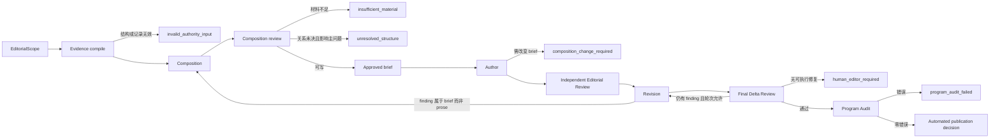

# 神学编辑综合文章流程 v1

> **读者**：神学编辑、Solution architect、Developer
> **类型**：流程
> **状态**：当前
> **与代码对齐**：2026-08-28
> **权威范围**：从审核过的教授材料形成神学编辑综合文章时，编辑判断、运行阶段、artifact 边界、停止状态与验收条件。

## 目录

1. [目标](#一目标)
2. [产品边界](#二产品边界)
3. [两种忠实](#三两种忠实)
4. [角色](#四角色)
5. [Artifact chain](#五artifact-chain)
6. [状态机](#六状态机)
7. [TheologicalEditorialBrief](#七theologicaleditorialbrief)
8. [材料充分性](#八材料充分性)
9. [写作与审核](#九写作与审核)
10. [可重复性](#十可重复性)
11. [“教会的根基”golden case](#十一教会的根基golden-case)
12. [第二主题 smoke run](#十二第二主题-smoke-run)
13. [非目标](#十三非目标)

## 一、目标

这条流程的产品不是逐字稿摘要，也不是把同一主题的来源依次堆在一起。它要让教会编辑在不增加、删减或裁决教授教导的前提下，按读者真正要理解的问题，全面而忠实地阐明教授的释经与神学思想。

POC 的交付物是一条可重复执行的流程。“教会的根基”只是第一项 golden case。流程换到另一个经文或主题时，不得修改通用代码、添加主题专用 prompt 条款，或在流程外手改正文才能完成。

## 二、产品边界

神学编辑综合文章由教会编辑部编纂。教授是思想与讲授材料的来源，但文章的选题、顺序、标题、段落关系和详略是编辑判断，不得伪装成教授逐字说过的目录或句子。

文章可以综合教授在多篇讲道和母本中实际表达的观点，也可以并列多条实际出现过的 `ArgumentRoute`。它不得把不同来源的零散论据拼成教授从未采用过的一条“超级路线”，不得把“反对 A”自动翻转成编辑选择的 B，也不得替教授回答他没有回答的问题。

母本是优先且重要的来源，不自动成为综合文章的目录权威。文章骨架由当前主题的审核过 `ViewpointStructure` 与编辑说明书共同决定；母本中的承重论证、限定和实际路线仍受来源忠实 gate 保护。

## 三、两种忠实

流程分别检查两件事：

1. **来源忠实**：每项实质主张能否回到教授的 Claim、Evidence、来源片段或实际 `ArgumentRoute`；
2. **结构忠实**：标题、导言、小标题、篇幅、顺序和结论是否让教授的正面主张成为读者的理解中心，并保留重要限定、张力和未决关系。

两者都必须通过。来源齐全不能补偿结构失真；结构清楚也不能补偿无来源的编辑推论。

## 四、角色

| 角色 | 负责判断 | 不得做的事 |
| --- | --- | --- |
| Scope Editor | 定义读者问题、经文／主题边界和候选结构 | 先写答案，再寻找支持材料 |
| Evidence Compiler | 从审核过的记录机械编译最小证据包 | 判断神学正误、选择文章立场 |
| Composition Agent | 形成 `TheologicalEditorialBrief` 候选，决定观点角色、顺序、详略和 route-out | 写最终散文、创造新观点或新路线 |
| Composition Reviewer | 判断 brief 是否忠实、完整、可写，材料是否足够 | 用外部神学补洞、代写正文 |
| Author Agent | 严格按通过审核的 brief 和证据包写文章 | 改变中心、静默调和、补无源桥梁 |
| Editorial Reviewer | 判断正面中心、论证清晰度、普通读者可读性与写作质量 | 重做抽取、直接修改稿件 |
| Revision Agent | 只处理已接受 finding，并报告 disposition | 借修订改变 composition 意图 |
| Program Audit | 验证 SHA、来源、段落归属、路线与程序不变量 | 给文笔打分或作神学裁判 |

## 五、Artifact chain

每次运行依次产生以下 artifact：

1. `EditorialScope`：读者问题、产品类型、主题／经文范围、所选 structure revision 和明确排除项；
2. `TheologicalEvidencePacket`：所选 structure、CVP revision、source-local `ArgumentRoute`、Claim、Evidence 与来源片段的最小只读切片；它是本产品自己的输入契约，不依赖 `ViewpointKnowledgeProjection`；
3. `TheologicalEditorialBriefCandidate`：Composition Agent 的结构化编辑方案；
4. `TheologicalEditorialBriefReview`：独立审核结果及正式材料充分性判断；
5. `TheologicalEditorialBrief`：只含已通过或经共识修订的有效说明书；
6. `TopicAuthoringPacket`：brief、证据和产品 profile 的写作切片；
7. manuscript、author ledger、Independent Editorial Review、Revision 与 Final Delta Review；
8. Program Audit 与 automated publication decision。

每项 artifact 都记录 schema version、上游 SHA、生成指纹、prompt、model 和 generation。输入改变产生新 generation，不能覆盖旧判断；相同指纹已经完成时跳过模型调用。

## 六、状态机

停止状态是正式结果，不是异常文字。每项状态必须指出失败阶段、绑定 artifact SHA、reason code、受影响的 viewpoint／route／claim ID，以及下一步需要补材料、改结构还是人工判断。

## 七、TheologicalEditorialBrief

`TheologicalEditorialBrief` 是编辑判断的权威，不是文章草稿。它至少包含：

- `reader_question`：文章要回答的一个主要问题；
- `reader_takeaway`：编辑预计读者读完能复述的正面中心，明确标记为编辑综合；
- 所选 `structure_revision_id` 及其内容 SHA；
- 每个 focal viewpoint 的 revision、结构角色、归属类别、是否进入正文，以及进入正文时承担的 section；
- 每条选中 `ArgumentRoute` 的 revision、source-local attestations 和文章功能；
- `unresolved_items`、不可升级的模态、不可静默调和的张力；
- ordered sections，每节的读者功能、观点、路线、必要限定和禁止承担的功能；
- `route_out`，列出所有不进入正文的相关材料及理由；
- 导言、标题和结论如何共同承载正面中心。

Structure 中的每个 focal viewpoint 必须恰好落入正文 section 或 `route_out`。任何静默遗漏使 brief 无效。`central_claim` 与至少一项适用的 `positive_identification` 必须进入正文；`negative_boundary` 不得成为 reader takeaway；`application` 不得先于其依赖的正面释经；`tension_side` 和 `qualification` 不得被改写为无条件断言。

## 八、材料充分性

Composition Review 在写作前回答“现有材料能不能忠实回答 reader question”。它分别检查：

- structure 是否为 active/current，revision 是否经过允许级别的审核；
- 每个进入正文的 CVP 是否仍是 current revision；
- 每项实质正面识别是否至少有来源 Claim 和合格 Evidence；
- brief 要展开的每条论证是否对应一条真实、source-local 的 `ArgumentRoute`；
- 若无完整路线，brief 是否诚实降级为有限陈述，而不是由编辑补桥；
- 未决关系是否被保留，且不妨碍 reader question 获得诚实的部分回答；
- route-out 是否覆盖已知但不适合本篇的批驳、应用、重复材料和旁支。

材料不足时不调用 Author。`insufficient_material` 可以是成功的研究终态：它证明流程没有把缺口变成散文。

## 九、写作与审核

Author 必须先写正面中心，再使用反方材料限定误读。标题、导言、主要小节和结论应让普通读者能够回答“教授主张什么、为什么”。教授花在批驳上的讲授时长不自动决定文章篇幅。

初稿仍只调用一次 Independent Editorial Review。每轮 Revision 后恰好调用一次 Final Delta Review；同一 delta 响应返回下一轮 finding。不得增加 Score-Gap Review，也不得把修订稿重新送去全文初审。

若 Reader-prose Review 发现问题被 brief 锁定（例如 approved heading 本身静默统一未决关系），Author 不得绕过 brief 修改。流程产生 `composition_change_required`，将 finding 转为 Composition Review finding，正式修订 brief，经过一次 Final Composition Review 后重新生成文章。实跑证明这不是异常边角：golden case 的第一版 brief 就在下游被发现把“信仰告白”与“所领受并传下的真理”合成一个小标题。

Writing quality profile 必须把以下情况列为 hard failure：稿件虽有来源，但负面批驳、争论对象或错误观点取代了 brief 所声明的正面中心。Reviewer 应检查标题、导言、小标题和结论是否共同回答 reader question；不能只在一般 `argument_organization` 说明中顺带提及。

## 十、可重复性

可重复性不要求模型逐字生成同一篇文章，而要求：

- 相同权威输入产生相同 deterministic artifact SHA；
- 相同 generation fingerprint 不重复调用模型；
- 任一 artifact 缺失时可从它的直接上游恢复；
- 输入改变后建立新 generation，旧 artifact 仍可审计；
- 所有停止状态可由机器读取和解释；
- reader-visible prose 只能由正式 Author／Revision 阶段产生，流程外不得手改；
- 换主题时只更换 `EditorialScope` 与权威内容，不改通用代码或 prompt。

Operator runbook 必须说明如何选择 scope、运行、恢复、查看停止状态、处理 composition change，以及如何确认没有使用主题专用 patch。

## 十一、“教会的根基”golden case

Golden case 的 reader question 是：

> 教授认为教会建立在什么根基上，他怎样从太 16:18 及相关经文形成这个判断？

当前审核结构要求 brief 至少保留：磐石不是彼得本人；彼得的基督论认信／所传真理；使徒和先知；“更可能是基督本人”的模态；三项正面识别之间尚未统一的关系；`Petros / petra` 与正典希腊文本的方法边界。

教皇论批驳只能在正面论证完成后承担应用或反方边界。删去这部分，文章仍须能够清楚回答 reader question。若做不到，结构忠实 gate 必须失败，即使所有句子都有来源。

## 十二、第二主题 smoke run

Golden case 通过后，从现有审核结构中选择一个较小、内容不同的主题运行同一 artifact chain。Smoke run 的验收不是必须出版；它可以完成文章，也可以合法停在 `insufficient_material` 或 `unresolved_structure`。

验收重点是：没有修改通用代码、schema 或 prompt，没有增加主题专用条件，所有阶段仍产生同类型 artifact，停止理由能够指向具体权威记录。

## 十三、非目标

- 不判断教授的神学结论是否正确；
- 不建立编辑预设的王教授神学体系；
- 不要求所有相关来源都进入一篇文章；
- 不以出现次数或讲授篇幅计算观点重要性；
- 不用一般神学知识补足教授没有回答的问题；
- 不把 POC 发布等同于部署生产环境。
