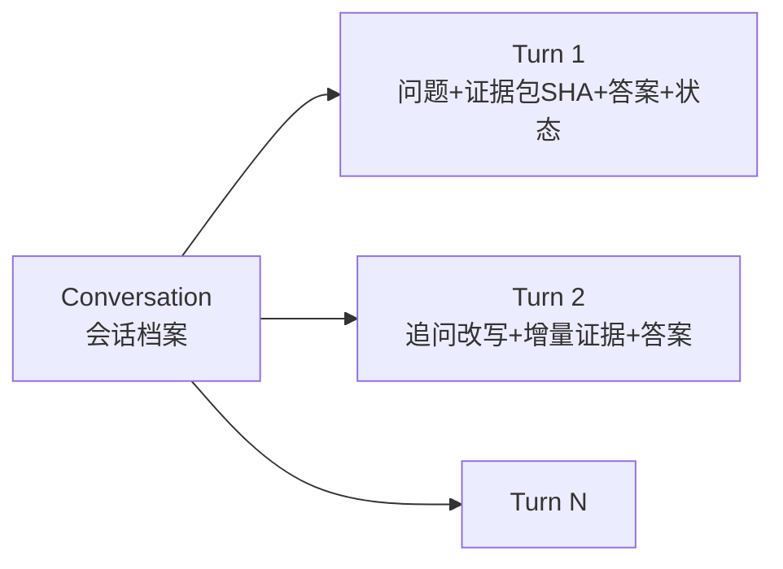
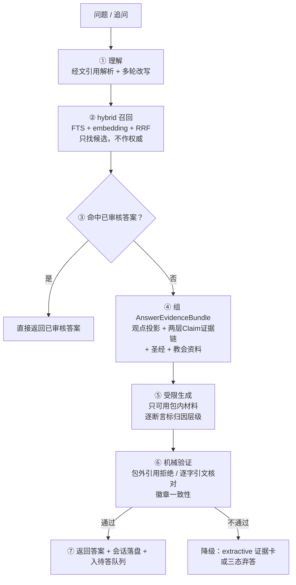

# 证据型智能问答 Solution v1

> **读者**：Solution architect
> **类型**：规范
> **状态**：当前
> **与代码对齐**：未核对
> **权威范围**：证据型智能问答产品（多轮对话、实时生成、归因分层、审批闭环）的整体设计。答案内容契约仍以 [独立问答产品验证 v1](./qa_product_validation_v1.md) 为准；答案质量诊断仍以 [双模型诊断与上游修复协议 v1](./qa_answer_diagnostic_protocol_v1.md) 为准；本文不与它们重复，只引用。

### 目录

| 节 | |
| --- | --- |
| [1. 为什么现在做](#1-为什么现在做) | 现状、已有地基、负责人裁定 |
| [2. 产品定义](#2-产品定义) | 读者看到什么 |
| [3. 归因分层](#3-归因分层) | 五级徽章，资料边界的新裁定 |
| [4. 多轮对话设计](#4-多轮对话设计) | 会话模型、追问改写、证据延续 |
| [5. 运行时架构](#5-运行时架构) | 从问题到答案的七步 |
| [6. 治理与审批闭环](#6-治理与审批闭环) | 批准单位是答案；夜间批 |
| [7. 与既有裁定的关系](#7-与既有裁定的关系) | 遵守什么、扩展什么 |
| [8. 技术选型与复用](#8-技术选型与复用) | 不重写清单、业界对标 |
| [9. 里程碑](#9-里程碑) | M1–M3 |
| [10. 开放问题](#10-开放问题) | 留给负责人裁定 |

## 1. 为什么现在做

站上现在没有可靠的问答。两条在跑的路都是 [Solution Architecture D2](../00-overview/solution_architecture.md#4-key-architecture-decisions)（问答不从检索到的原文段落直接生成）裁定要淘汰的：

- `/rag`：Vertex RAG，检索单元是 Google Drive 文件切块，没有知识层、没有出处偏移，引用只到文件名。
- `/search`：2024–2025 年的旧向量库（998 MB tensor）+ 外部 semantic_search 服务，D2 的证据条目引用的正是它。

D2 说明过 RAG 的病不是编造而是**不完整**：一个观点散在多篇讲道里（「磐石不是彼得」有 11 条 Claim 跨 6 个来源），top-k 检索必然漏，漏掉的可能正是限定语，而答案读起来是完整的。

同时，平台为问答准备的地基已经建好，只是从未拼装成读者产品：

| 地基 | 位置 | 状态 |
| --- | --- | --- |
| `consumer_kind="qa_answer"` 的 SHA 绑定投影 | `backend/api/canonical_repository/viewpoint_runtime_projection.py` `ViewpointRuntimeCompiler.compile_projection` | 已实现，无 HTTP 端点 |
| 三态答案契约与答案投影字段 | [独立问答产品验证 v1](./qa_product_validation_v1.md) | 规范已定，读者产品未建 |
| 双模型忠实性诊断 | [诊断协议 v1](./qa_answer_diagnostic_protocol_v1.md) + `backend/pipeline/qa_answer_diagnostic_runner.py` | runner 与测试已实现 |
| 出处深链 | `/resources/sermons/{id}?citation=` 讲道原文高亮 + 音频定位 | 已上线 |
| 治理层 embedding | `backend/api/semantic_index/`（Claim/观点/论证路线投影，召回专用） | 已实现 |

负责人裁定（2026-09-02，#354）：

1. 读者**自由提问 + 实时生成**——未命中预审答案时由模型基于证据包生成，明确标注未经人工审核。
2. 知识底座**两层**：过 `public_attribution` 资格门的观点出正式引用；candidate Claim 也可用，但明示「初步整理，未经人工批准」。
3. **资料边界扩展**：教授文库没有答案时，可依次使用教会已有的其他资料、圣经本身、模型的神学知识（限福音派正统）——归因严格分层，绝不混淆（见[第 3 节](#3-归因分层)）。
4. 回答必须符合基督教福音派的正统。
5. 必须支持**多轮对话**。
6. 先写本文档，负责人批准后才开实现卡。

## 2. 产品定义

`/resources/qa` 改造为独立问答产品。现有人工维护的信仰问答列表并入答案库，成为「已审核答案」的第一批成员。

读者看到的：

- **提问框**：自由输入，也可从已答问题库浏览进入。会话式界面，可连续追问。
- **答案四段式**（沿用[验证 v1 第二节](./qa_product_validation_v1.md)的契约）：先看结论（1–2 句）→ 完整回答（按论证次序展开，断言带引用 chip）→ 回答边界（现有资料支撑不到什么）→ 来源与依据（可展开的证据卡）。
- **三态诚实**：现有资料足以回答 / 只能部分回答 / 未回答。部分回答必须写明已答哪半、缺什么，不得用一般知识补齐——这是 D2 的后果条款，不是风格选择。
- **引用 chip 挂在断言上**，不是挂在段落末尾。点开引用 chip 展开证据卡（复用编辑 UI 的 SourceEvidenceDisclosure 交互形态）：教授逐字原文、录音时间点，一键跳 `/resources/sermons/{id}?citation=...` 看原文高亮并从该时间点播放；圣经引用跳经文服务。
- **答案级标注**，一眼可辨：`已审核答案`（人工批准过）或 `AI 即时回答 · 未经审核`。
- **弃答不是失败页**：三态之一，写清楚缺什么，并告知「这个问题已记录，整理后会补上答案」。

不做的（Phase 边界，沿用 [D5](../00-overview/solution_architecture.md#4-key-architecture-decisions)）：搜索作为独立读者产品不建；检索只作为问答的内部基础设施存在。

## 3. 归因分层

这是本文相对既有规范的第一个扩展。原有 D2/D3 的世界里答案只有一种来源（教授的治理层知识）；负责人本轮裁定扩展了资料边界，代价是必须让读者永远分得清「这句话是谁说的」。

每个答案段落归属且仅归属以下一层，徽章由程序根据依据类型机械判定，不由生成模型自报：

| 徽章 | 依据 | 资格条件 |
| --- | --- | --- |
| `教授观点 · 已审` | 过 `public_attribution` 资格门的观点投影 | `ViewpointKnowledgeProjection.eligibility == "public_attribution"`，七类 blocker 全空 |
| `教授观点 · 初步整理` | candidate Claim 的证据链 | Claim 有合格来源锚点（verbatim excerpt 可核对），但 `review_status` 未达 approved；UI 明示「未经人工批准」 |
| `圣经经文` | 经文原文 | 引用可被 `reference_slugs` 解析并从经文服务取回 |
| `教会资料` | 站内其他已有资料 | 来源条目在索引中且标明出处（具体清单见[开放问题](#10-开放问题)） |
| `一般教义解答` | 模型的福音派正统神学知识 | 必须明示「此为一般性解答，非王教授观点」；不得与教授观点混排在同一段落 |

两条硬规则：

1. **教授观点两层之间、教授观点与其余三层之间，永远不合并成一段。** 一段一徽章，机械可验。
2. **一般教义解答不得转述为教授的话。** 「教授认为……」只允许出现在前两层。这是[验证 v1](./qa_product_validation_v1.md) 归因陷阱 case（教授引用他反对的观点）的同族问题，机械验证要覆盖。

## 4. 多轮对话设计

### 4.1 会话模型

- 一个 Conversation 由若干 Turn 组成。**每轮独立 grounding**：有自己的证据包依赖清单（SHA）、自己的引用、自己的答案状态（三态是轮级属性，不是会话级）。
- 会话整体落盘存档（问题原文、改写后问题、证据包 SHA、生成参数、答案、验证结果），供审批闭环与诊断协议消费。诊断协议的 fingerprint 机制照用：知识包更新后旧会话答案标记「资料更新后需要重新复核」，不冒充当前。

### 4.2 追问理解：query rewriting

追问往往不完整（「那彼得呢？」「为什么？」）。处理办法是业界多轮检索的标准做法：**用对话历史把追问改写成一个独立完整的问题**，改写后的问题进入与首问完全相同的检索与证据管线。

- 改写是一次轻量模型调用，输出改写后问题 + 是否话题跳转的判定。
- **经文上下文继承**：上一轮在讲太16:19，追问未指明经文时默认同域（改写时把经文范围写进独立问题）。
- **话题跳转**：改写模型判定新问题与会话无关时，重置检索上下文，按首问处理。判定结果记入 Turn 档案，可审计。
- 改写后的问题对读者可见（「我理解你在问：……」样式，可纠正）——改写错了读者一眼能发现，而不是拿到答非所问的结果。

### 4.3 证据延续与边界

- 会话内证据包**可累积复用**：上一轮已拉取的观点投影本轮直接引用（省一次编译），但本轮引用哪些材料仍逐轮独立记录、独立可验。
- 会话长度上限（初值建议 20 轮）；超限后历史压缩为摘要参与改写，但摘要绝不进入证据包——证据包里只有治理层材料。
- 生成模型每轮看到的对话历史只用于**行文连贯**（不重复自我介绍、代词自然），不作为断言依据；断言依据只能来自本轮证据包。这条由机械验证兜底（见 5.6）。

## 5. 运行时架构

各步要点（详细字段契约在实现卡里定，这里只定职责与边界）：

1. **理解**：`reference_slugs()` 抽经文引用；4.2 的多轮改写；问题 embedding。
2. **召回**：新建独立的 `qa_search` 索引（照抄 `sermon_search/index_store.py` 的 SQLite FTS + embedding 混合与原子换库模式，不动 sermon_search 本身）。索引单元四类：已答问题、观点 core_proposition、Claim statement、教会资料条目。RRF 融合；经文引用命中另走 `in_passage()` 直接拉该段 Claim。召回永远只产生候选——这是 D2 在多轮场景下的形状。
3. **命中判定**：候选中存在已审核答案且与改写后问题语义等价（embedding 阈值 + 轻量模型确认）→ 直接返回，不再生成。
4. **证据包**：观点层走 `compile_projection(consumer_kind="qa_answer")`，eligibility 决定「已审」徽章资格；Claim 层经 `evidence_fragment_ids()` 拉全 Claim→EvidenceStep→SourceFragment→SourceDocument 证据链（单/复数两代字段并存，必须用这个 helper）；圣经与教会资料按命中加入。投影完整性遵守[诊断协议 4.0 节](./qa_answer_diagnostic_protocol_v1.md)：单端在包内的 relation 必须投影、远端标 `target_outside_case`——qualifies/tension 边正是「漏限定」检测的原料。
5. **受限生成**：单次调用，prompt 硬约束——只可使用包内材料；每句断言标注归因层级与依据 id；教授观点部分不得用模型知识补桥、不得抹平记录在案的 tension；一般教义部分限福音派正统且自报身份；输出结构化（四段式 + 逐段依据清单），不输出自由散文。
6. **机械验证**（D3 的形状，程序拒绝不靠模型自觉）：每个引用 id 必须在证据包内，否则整段拒绝；`教授观点` 两层的逐字引文与 SourceFragment.verbatim_excerpt 核对；徽章与依据类型一致性校验；对话历史不得被引用为依据。验证不过则降级为 extractive 答案（只列证据卡不写散文）或弃答——**未通过验证的生成文永远不出现在读者面前**。
7. **落盘与入队**：Turn 档案 + 证据包依赖清单落盘；AI 即时回答与未答问题进待答队列。

## 6. 治理与审批闭环

- **批准单位是「一个答案」。** 这是刻意的杠杆选择：Claim 层逐条人工批准进展缓慢（见 [Claim 设计第 9 节](../20-knowledge/claim_design.md)的实测数字），而负责人批准一个四段式答案，一次动作就让一个问题从「AI 即时」升为「已审核」，此后同类问题直接命中。
- admin 新增「问答审批」：待答队列 + AI 即时答案列表，逐个批准 / 修改 / 驳回。批准留 review 痕（谁、何时、基于哪个证据包 SHA）。
- **夜间批**：对高频未答问题，用订阅 CLI 走 D4 三步（gpt 起草 → claude 复核 → 仲裁）预生成候选答案，再走[诊断协议](./qa_answer_diagnostic_protocol_v1.md)的双模型忠实性检查，最后进负责人审批队列。运行时 API 生成与夜间批产物在队列里并排，负责人只看到「候选答案」。
- 诊断发现的缺陷**修上游知识层，不改答案文本**——诊断协议的既有裁定，原样适用。

## 7. 与既有裁定的关系

| 裁定 | 本方案 |
| --- | --- |
| D2 检索不作答 | 遵守。召回只产生候选；答案依据只能是证据包内的治理层材料 |
| D3 机械引用验证 | 遵守并扩展到归因徽章一致性 |
| D4 双模型 + 人终审 | 遵守（夜间批）；运行时生成是 D4 之外的新路径，以「未经审核」标注 + 机械验证 + 事后诊断补偿 |
| 三态答案契约（验证 v1） | 遵守，落到轮级 |
| 诊断协议 v1 | 遵守；会话档案成为它的新输入源 |
| D5 Phase 1 检索要建、搜索 UI 不建 | 遵守 |

**扩展（相当于新裁定，负责人批准本文即生效）**：资料边界扩到教会资料 / 圣经 / 一般正统教义（第 3 节）；candidate 两层展示；多轮对话；「实时生成 + 未经审核标注」作为 D4 终审前的合法读者可见形态。

## 8. 技术选型与复用

**复用清单（不重写）**：

| 组件 | 用途 |
| --- | --- |
| `backend/api/scripture.py` `reference_slugs` / `parse_reference` | 经文引用理解 |
| `backend/pipeline/original_audio_index.py` `in_passage` 等 | 经文段 → Claim 匹配 |
| `knowledge_models.py` `evidence_fragment_ids` | 证据链读取（两代字段兼容） |
| `ViewpointRuntimeCompiler.compile_projection` | 观点投影 + public_attribution 资格门 |
| `backend/api/semantic_index/embeddings.py` | embedding provider（gemini-embedding-2，SHA 绑定工件） |
| `sermon_search/index_store.py` 的 FTS+vector 混合与原子换库模式 | qa_search 索引的实现模板 |
| `SourceEvidenceDisclosure` + `SermonDetailView ?citation=` | 证据卡与出处深链 UI |
| `qa_answer_diagnostic_runner` | 答案忠实性诊断与回归 |

**运行时生成模型**：API 计费（订阅 CLI 只用于夜间批等批处理）。配置化 provider，复用仓库既有的 Stage1 client 工厂形状。建议默认 `claude-sonnet-5`（归因纪律与中文神学行文最稳），备选 `deepseek-v4-pro`（成本约 1/10，sermon_search 已有集成先例）；改写与命中确认用更小档位。每答成本与限流阈值见[开放问题](#10-开放问题)。

**业界对标**（2026 共识，与本方案的映射）：hybrid BM25+dense、RRF 融合、召回/精排分离 → 第 5 节②；引用挂断言、深链到确切段落与时间点、证据弱时可见降级 → 第 2、3 节；abstention（证据不足弃答优于硬答）→ 三态；groundedness/faithfulness 分层把关 → 机械验证 + 诊断协议。中文检索在多语模型上偏弱是已知问题，精排若引入 cross-encoder 须选多语种模型并以 golden set 实测后再上。

## 9. 里程碑

| | 内容 | 前置 |
| --- | --- | --- |
| M1 | ask 全链（单轮+多轮）：理解→召回→证据包→受限生成→机械验证→四段式答案卡（徽章/引用/深链/三态）；会话落盘；`/resources/qa` 新 UI，curated 问答并入已答库 | 本文档批准 |
| M2 | admin 问答审批 + 夜间批 + 已审核答案优先命中 | M1 |
| M3 | 教会其他资料接入索引；评测扩展（golden set 增长、groundedness 抽样报告进 admin）；`/rag`、`/search` 按 D2 退役 | M2、开放问题 1 裁定 |

验收基线：[验证 v1 第五节](./qa_product_validation_v1.md)的验收条目原样适用；golden set 从既有 7 个验证 case 起步（含归因陷阱 case），每个 case 在 M1 全链上跑通并经诊断协议抽查。

## 10. 开放问题

留给负责人裁定，不阻塞 M1：

1. **教会「其他资料」的具体清单与优先级**——哪些站内资料（现有信仰问答之外）进入检索底座，按什么顺序。
2. **会话保存策略**——匿名读者的会话保留多久；登录读者是否可回看自己的历史会话。
3. **成本与限流**——实时生成的每答成本上限、每读者每日问答次数上限、超限后的降级形态（只出证据卡？）。
