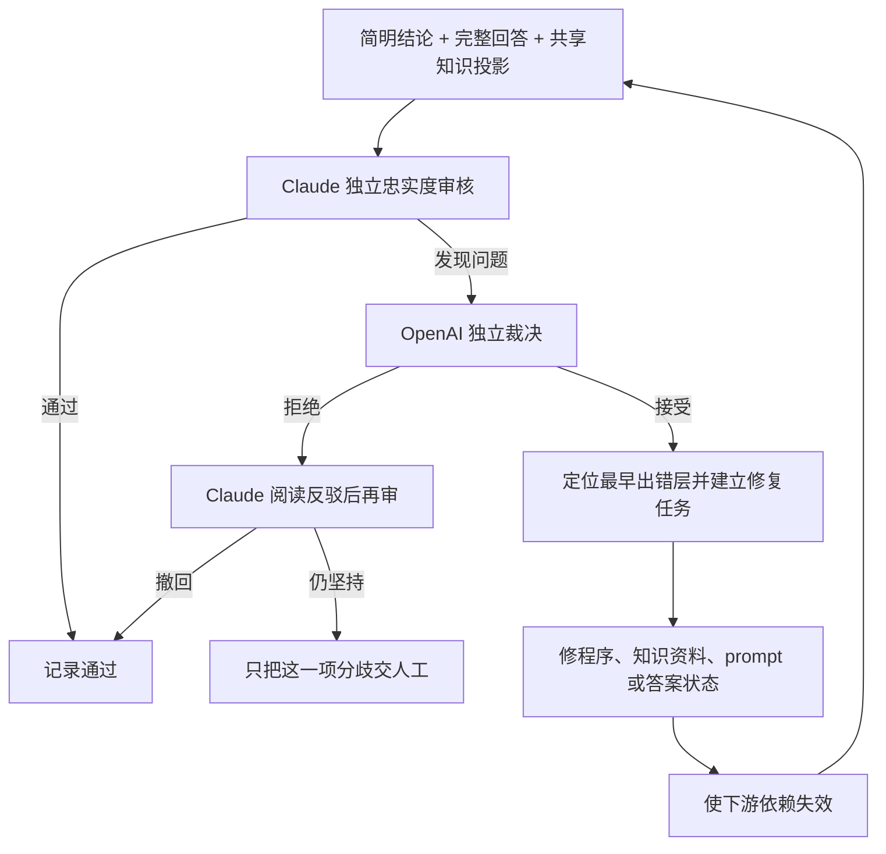

# 问答答案双模型诊断与上游修复协议 v1

> **读者**：Developer
> **类型**：流程
> **状态**：当前
> **与代码对齐**：未核对
> **权威范围**：一个坏答案如何定位到最早出错的那一层，并回写上游。

## 一、为什么不能只修改答案

一个答案不准确，表面上是文字问题，实际最早的错误可能发生在四个不同位置：

1. **程序投影错误**：正确的共享知识没有被完整、正确地送进问答案例；
2. **知识资料错误**：主张、证据、说话者归属或主张关系本身有误；
3. **生成规则错误**：资料正确，但 prompt 让模型夸大、漏掉限定或混淆答案与背景；
4. **来源缺口**：现有讲道根本没有完整回答问题。

因此，系统不得只润色最终答案。它必须找出**最早出错层**，修复上游，再让所有依赖该资料的答案、搜索结果和文章重新计算。

## 二、审核边界

两种模型都必须遵守：

- 不评价王教授的神学观点是否正确；
- 不以外部神学知识补充教授没有讲过的答案；
- 只检查答案是否忠实于输入中的主张、关系、证据与原始引文；
- 区分教授主张、听众发言、反方立场和编辑摘要；
- 同时审核简明结论与完整回答；完整回答写得较长不等于可以引入本题之外的主张；
- OpenAI 不得因为 Claude 提出意见就自动接受；
- 只有双方经过再审仍有真实分歧时才交人工。

## 三、四类修复

| 最早出错层 | 典型症状 | 修复位置 | 验证方式 |
|---|---|---|---|
| `code_projection` | 关系指向未投影的主张；背景被当答案 | backend/frontend 投影 | API 与 UI 回归测试 |
| `knowledge_data` | 错误引文、错误说话者、错误关系 | 共享知识的 Claim/Relation/Evidence | 失效传播后重跑受影响产品 |
| `generation_prompt` | 资料正确但答案夸大或漏限定 | 问答 prompt／模板 | 固定问答回归集重跑 |
| `source_gap` | 现有语料没有直接答案 | 答案状态与后续来源整理队列 | 降级为部分回答／未回答 |

`uncertain` 只用于模型无法判断最早出错层的情况，不得成为逃避诊断的默认类别。

## 四、实现与 artifact

- 诊断 runner：`backend/pipeline/qa_answer_diagnostic_runner.py`
- 候选问答集：`$DATA_BASE_DIR/wang-knowledge-platform/staging/claim-layer/qa_validation_cases_v1.json`
- 当前共享知识：`$DATA_BASE_DIR/wang-knowledge-platform/staging/claim-layer/shared_knowledge_pilot_v1.json`
- 诊断记录：`$DATA_BASE_DIR/wang-knowledge-platform/staging/claim-layer/qa_answer_diagnostics_v1.json`
- 审核 UI：`/admin/thought-review` →「问答验证」

诊断记录保存：来源与知识包哈希、两种模型、三个 prompt 哈希、逐题 Claude 审核、逐项 OpenAI 裁决、必要时的 Claude 再审、最终错误层和修复队列。

**过期判断同时比对问答集与知识包两个哈希。** 一次诊断裁决的是「这一份答案」对「这一份知识」的忠实度，任何一端改动都会使结论失效；只比对知识包会让改过问题或答案措辞之后的旧诊断继续冒充有效。过期的诊断不会把任何问答留在人工队列中——过期的结论不能要求同工行动。

运行指纹绑定问答集哈希、知识包哈希、三个 prompt 哈希、两种模型与 schema 版本。输入与配置都没有变化时 runner 直接重用既有诊断，不再调用模型；`--force` 可强制重跑。被取代的诊断先归档到 `$DATA_BASE_DIR/wang-knowledge-platform/staging/claim-layer/qa-diagnostic-generations/`，与语料复审、篇章复审的世代保存规则一致——它是「AI 当时判过什么」的唯一证据。

模型调用按问答逐题执行，避免长批次让推理耗尽输出额度；runner 输出逐题进度。失败时不覆盖上一份完整 artifact。

### 4.0. 投影必须完整，否则诊断在检查错误的输入

送进模型的投影按问答案例裁剪，但裁剪不得改变知识本身：

- 与本案有关的关系，只要有一端属于本案（含 `opposed_position_ids`）就必须投影，另一端标记 `target_outside_case` 并附标题；
- 只有两端都不在知识包内的关系才丢弃，因为对它无话可说；
- 指向本案之外的 `qualifies`、`tension` 关系，正是 `missing_qualification` 要侦测的对象；把它们过滤掉等于先藏起答案再问模型有没有遗漏；
- `refutes` 指向反方立场的边，是教授反驳该立场的证据，归属类问题完全依赖它。

### 4.1. 诊断记录与同工界面必须分层

诊断 artifact 是给程序审计和开发排错使用的，不应原样显示给没有技术背景的同工。内部记录可以保留 `issue_id`、`eligible_evidence`、`scripture_refs`、错误层、模型理由和修复动作；审核界面的默认层只回答四个问题：

1. 正在检查答案中的哪一句；
2. 问题用普通语言怎么说；
3. 两个模型是否已经达成一致；
4. 同工是否需要处理，以及下一步做什么。

界面使用三种结果：

| 界面状态 | 含义 | 同工动作 |
|---|---|---|
| 两个模型同意修正 | Claude 的意见被 OpenAI 独立接受 | 不必重复裁决；由系统进入上游修复队列 |
| 复核后已撤回 | OpenAI 拒绝后，Claude 再审并撤回 | 无需处理 |
| 需要同工判断 | OpenAI 拒绝后，Claude 再审仍坚持 | 只判断这一项，不重审整篇答案 |

模型原文、内部 ID、字段名和具体 repair action 统一折叠在「查看模型的技术说明」中。共享知识包更新后，页面显示「资料更新后需要重新复核」，不得继续展示旧结论为当前结果。

## 五、发布与人工边界

- AI 达成共识的问题可以自动进入上游修复队列，不需要人工重复裁决；
- 自动修复仍必须经过结构验证、测试和依赖失效机制；
- Claude 撤回的问题不进入修复队列；
- Claude 在阅读 OpenAI 反驳后仍坚持的项目，才进入人工诊断；
- 来源缺口不能由任一模型补写，只能诚实改变答案状态或继续整理新来源。

本协议验证的是问答产品，同时也在验证共享论证层：若同一错误会影响释经、专题、搜索或研究，修复必须发生在共享层，而不是在问答页面建立私有语义。

## 六、第一轮实施记录（2026-08-10）

第一轮以 7 个固定问答案例运行 `claude-sonnet-5` 独立审核和 `gpt-5.6-sol` 仲裁。结果为：3 个案例直接通过；模型共提出 5 项意见，其中 2 项形成双模型修复共识、1 项经再审撤回、2 项仍需同工判断。撤回意见没有进入修复队列，人工队列只保留真正分歧。

后端 `/admin/thought-review` 数据接口会把诊断结果与对应答案摘录、Claude 建议动作合并；前端「问答验证」已按 4.1 的简明信息层显示，并把完整模型理由折叠保存。当前实现通过问答诊断和思想审核后端测试共 18 项，并通过前端 TypeScript 编译检查。
