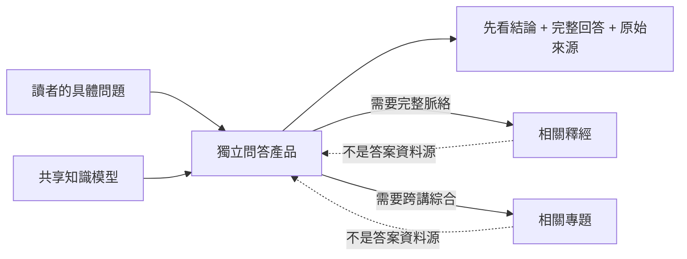

# 獨立問答產品驗證 v1

> **读者**：神学编辑
> **类型**：规范
> **状态**：当前
> **与代码对齐**：不适用
> **权威范围**：问答的三种答案状态与读者要求。观点身份遵从 CVP 设计。

## 一、目的

問答是知識平台的一個獨立產品，不是釋經文章或專題文章的附屬功能。一般讀者通常先瀏覽釋經與專題；當現有文章沒有直接回答他的問題時，才進入問答。因此，問答必須能處理文章目錄沒有預先想到的具體問題。

「獨立」指產品入口、問題組織與回答體例獨立；不表示另建一套知識。答案仍只能引用共享知識模型中的 `Question`、`Claim`、`Relation`、`Position`、`SourceFragment` 和經過核查的來源錨點。

问答若聚合跨讲重复观点、按不同论证路线展开，或比较教授不同时期的教导，必须遵守 [Canonical Viewpoint Registry 与跨讲论证路径设计 v1](../canonical_viewpoint_registry_design_v1.md)。QA runner 不读取该完整 Markdown，而只消费针对当前问题编译并 SHA 绑定的 `ViewpointKnowledgeProjection`；没有该 projection 时，答案继续使用来源局部 Claim，不得自行发明 canonical viewpoint。

## 二、三種回答狀態

1. **現有資料足以回答**：共享主張足以直接回答問題，每個重要句子都能回到教授原話。
2. **現有資料只能部分回答**：教授回答了問題的一部分；系統須明說尚缺哪一部分，不能用一般知識補齊。
3. **現有語料未回答**：可以显示相关背景或教授反对的立场，但必须明确它们不是答案。

这三种状态判断的是**证据是否足以回答**，不是页面上的文字长短。「现有资料足以回答」不能只显示一句摘要；读者版问答必须同时包含：

1. **先看结论**：用一两句话直接回答；
2. **完整回答**：按论证顺序解释教授如何得到结论；
3. **回答边界**：说明现有语料尚不能支持什么；
4. **共享主张与原始来源**：供读者展开核对。

完整回答是问答产品的编辑综合，不是新的教授主张。每一节必须列出所依据的 `claim_ids`；直接答案只能使用 `answer_claim_ids`，背景或边界说明才可以使用 `context_claim_ids`。未回答问题可以解释现有方法与材料缺口，但不得把背景写成答案。回答摘要和完整回答都不冒充教授逐字原话；教授原话、听众问题、反方立场和编辑整理必须分别显示。

原始问题还必须区分两个概念：`argument_link_state` 只说明论证图中是否找到回答连线，`answer_state` 才说明内容上是否已经回答。一个包含多个子问题的复合问题，即使已有 `answers` 连线，也必须逐项检查；只回答一部分时应标为 `partially_answered`，并分别保存已回答和未回答的子问题。

## 三、回答投影规则

- `answer_claim_ids`：唯一可以组成直接答案的共享主张；
- `full_answer_sections`：读者版完整回答；每节保存标题、段落、用途和所依据的共享主张；
- `context_claim_ids`：帮助读者理解问题，但不能冒充答案；
- `opposed_position_ids`：教授所反驳的观点，必须防止反方归属错误；
- `source_question_ids`：保存教授或听众实际提出的问题及来源；
- `argument_link_state`：只记录原始问题在论证图中是否连到回答步骤；
- `answer_state`：记录问题是已回答、部分回答或未回答，不得由单一论证边直接推定完整；
- `related_product_plan_ids`：延伸阅读入口，不是答案来源；
- `limitation`：当前语料范围和答案边界；
- 所有回答主张至少要有一条合格、可核查的教授来源，否则显示质量警告。
- 使用 canonical viewpoint 时，答案必须保存 `viewpoint_revision_id`、`viewpoint_registry_snapshot_id`、`coverage_snapshot_id`、实际 Claim/Evidence/Citation dependencies 和 projection SHA；公开归属只接受 `public_attribution_eligible` projection。

## 四、第一批验证案例

第一版使用《马太福音释经（五）》第三、第四讲及 `011WSR01` 的逐句详细知识，并用全库普查作为待进一步整理的来源线索。案例覆盖：

- 太 16:28 是否指第二次再临；
- 「那人子」与耶稣神性；
- 太 17:1 与路 9:28 的计日差异；
- 门徒为何不能赶鬼；
- 但以理书的人子与福音书称号；
- 教授尚未完整回答的问题；
- 把教授引用的反方说法误当教授立场的归属陷阱。

候选资料位于 `$DATA_BASE_DIR/wang-knowledge-platform/staging/claim-layer/qa_validation_cases_v1.json`；内部审核入口为 `/admin/thought-review` 的「问答验证」页签。

## 五、验收标准

- 问答拥有独立的 UI 和问题列表，不混入释经／专题编排；
- 足以回答、只能部分回答、未回答三种证据状态一眼可辨；
- 可回答的问题同时提供简明结论和连贯的完整回答，而不是让读者自己从证据卡拼答案；
- 未回答问题不会被背景主张自动补答；
- 反方立场和听众发言不会进入直接答案；
- 每个答案主张都能展开原始证据并打开讲道来源；
- 相关文章只标为延伸阅读；
- 问答试验发现的归属、关系或来源缺陷必须回写共享知识层，不得只在答案文字里修饰。

## 六、答案错误诊断

问答答案由 Claude 作独立忠实度审核，再由 OpenAI 逐项独立裁决；OpenAI 拒绝时，Claude 阅读反驳后再审。只有 Claude 仍坚持的真实分歧才交人工。审核不得进行神学批评。

诊断必须定位 `code_projection`、`knowledge_data`、`generation_prompt` 或 `source_gap` 中最早出错的一层，并修复上游；不能只改最终答案。共享知识变化会使旧诊断自动过期。完整流程见[问答答案双模型诊断与上游修复协议 v1](./qa_answer_diagnostic_protocol_v1.md)。

内部工作台不得把模型审计日志直接交给同工。默认界面必须用普通语言显示「正在检查的答案」「问题是什么」「处理结果」和「是否需要同工判断」；内部 ID、字段名、模型长理由及修复指令只放在可展开的技术说明中。这样既保留完整审计链，又不要求同工理解数据结构。

截至 2026-08-10，7 个固定案例已经完成首轮双模型诊断：3 个直接通过，2 项形成修复共识，1 项复核后撤回，2 项保留为单项人工判断。该结果验证了问答不只是展示答案，也能把问题定位回程序投影、共享知识或来源缺口。
