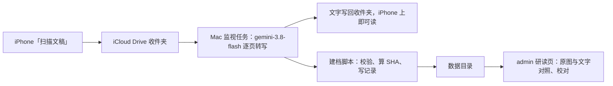

# 参考释经书：Carson 马太福音扫描页的 OCR 与研读

> **读者**：负责人、Solution architect、Developer
> **类型**：规范（待负责人批准）
> **状态**：当前（草案，WKP-F11.01 #379）
> **与代码对齐**：不适用（尚无实现）
> **权威范围**：参考释经书这一类来源的身份、逐页记录、OCR 与校对、存放与访问边界，以及它与教授知识库的分界。不涉及查经讲稿的生成流程。

## 目标

> **负责人用 iPhone 拍下 Carson 的马太福音释经，每一页都变成可校对、可按页码找回的英文文字，永远不和教授的话混在一起。**

周末查经目前只基于王教授的讲道。负责人要加入其他释经材料来丰富查经，第一本是 D. A. Carson 的马太福音释经。这份文档定下这类材料怎样进入系统、放在哪里、谁能读，以及它和教授知识库之间的界线。

### 目录

| 节 | |
| --- | --- |
| [1. 负责人裁定](#1-负责人裁定) | 2026-09-23 已定的四件事 |
| [2. 与既有裁定的关系](#2-与既有裁定的关系) | 使命、Solution Architecture、仓库公开 |
| [3. 来源身份与逐页记录](#3-来源身份与逐页记录) | 一本书、一册、一页各用什么标识 |
| [4. OCR 流程](#4-ocr-流程) | 从拍照到存档的每一步，以及转写规则 |
| [5. 存放与访问边界](#5-存放与访问边界) | 放在哪里，以及不能越过的两条线 |
| [6. 研读界面](#6-研读界面) | admin 页面上看到什么、能改什么 |
| [7. 收编已有的马太福音 18 章](#7-收编已有的马太福音-18-章) | 七月那批 12 张照片怎么处理 |
| [8. 里程碑](#8-里程碑) | 三张实现卡 |
| [9. 开放问题](#9-开放问题) | 需要负责人决定的事 |

## 1. 负责人裁定

| | 裁定 |
| --- | --- |
| 版本 | *The Expositor's Bible Commentary*, Matthew / D. A. Carson，Zondervan 1995 softcover 分册版。v. 1 = *Matthew 1–12*，ISBN 0-310-49961-5；13–28 章在 v. 2 |
| 语言 | 只要英文原文，不译中文 |
| 上传 | iPhone「文件」App 的「扫描文稿」存进 iCloud Drive 收件夹，Mac 自动 OCR，文字写回同一文件夹（负责人 2026-09-23）。不经 Claude Code 会话，不建网页上传 |
| OCR 模型 | Vertex `gemini-3.8-flash`（负责人 2026-09-23）。`gemini-3.1-pro-preview` 太旧，不用 |
| 归属 | 新开 epic WKP-E11（#378），作为一种新的知识来源 |

## 2. 与既有裁定的关系

**使命。** [Project Mission Statement](../00-overview/project_mission_statement.md) 第三节写明「文库收录的是教授的讲论」，第七节原则 3 是「分清谁说的」。Carson 不是教授，所以他的文字**不进文库**：它是文库旁边的一个书架，查经时可以取用，但不会成为教授的主张、观点或论证路线。这样使命不需要修改。

**Solution Architecture 的术语表**只有两种来源：讲道（`sermon_transcript`）和母本（`notes_manuscript`）。本设计**不**新增第三种 `source_type`，而是让 Carson 完全不进 `wang_knowledge`：

| | 做法 | 为什么不用 / 为什么用 |
| --- | --- | --- |
| 其他方案 | 在 `source_documents` 加 `source_type = reference_commentary`，靠字段区分 | 抽取、覆盖率、Program Audit、问答召回都按 `source_documents` 取数。每一处都得记得过滤掉 Carson，漏一处，Carson 的一句话就会被抽成「教授明确主张」 |
| **本设计** | 独立存放，`wang_knowledge` 的任何读取器都读不到它 | 混淆在结构上不可能发生，不靠每个调用方自觉 |

代价是：以后若要在同一段经文下并排显示「教授怎么讲」和「Carson 怎么讲」，需要一个明确的连接层按经文范围取两边。这是查经那一步的设计（见[开放问题 2](#9-开放问题)），现在不做。

**D2（不用 RAG 作答）** 不受影响：本设计不做问答。

**仓库是公开的**（`junyang168/smart-answer` visibility = PUBLIC）。Carson 的文字与照片**一律不进 git**，只存在 §5 的数据目录里。本文档与代码中的示例只引用页码，不抄正文。

## 3. 来源身份与逐页记录

三层身份：

| 层 | 标识 | 例 |
| --- | --- | --- |
| 书 | `work_id` | `carson-ebc-matthew` |
| 册 | `volume_id`，带 ISBN | `carson-ebc-matthew-1995-v1`（ISBN 0-310-49961-5） |
| 页 | `(volume_id, printed_page)` | `carson-ebc-matthew-1995-v1 / p. 123` |

**页码用印刷页码，不用照片序号。** 照片会重拍、会漏拍（七月那批就缺 `IMG_2046`），印刷页码不会变。前言部分的罗马数字页码按原样记（`xii`）。

每一页一条记录：

| 字段 | 含义 |
| --- | --- |
| `printed_page` | 印刷页码 |
| `passage` | 本页讨论的经文范围，如 `Matt 18:3-9`；从页内的节号标题读出 |
| `image` | 原图文件名与 `image_sha256`；来自扫描 PDF 时另记 PDF 文件名与页序。同一页重拍时保留旧图，记录新图为当前 |
| `text` | 转写文字文件名与 `text_sha256` |
| `status` | `ocr`（机器转写，未校对）→ `proofread`（负责人校对过） |
| `gaps` | 转写时标出的缺口：手指遮住、出框、模糊。每条带位置 |
| `revisions` | 每次改文字的时间、改前改后的 SHA、改动来源（`ocr`／`proofread`） |

封面、版权页、目录、缩写表也按页记录（`passage` 为空）。版权页是册身份的证据。

## 4. OCR 流程

| 步骤 | 做什么 |
| --- | --- |
| 扫描 | 在「文件」App 打开收件夹（如 `iCloud Drive/Carson/Matthew/ch21/`），点右上角 ⋯ →「扫描文稿」，逐页翻拍，存成一份多页 PDF。相机照片（HEIC）直接放进收件夹也收。手指不压正文 |
| 同步与触发 | iCloud 把收件夹同步到 Mac；Mac 上一个 launchd 任务监视收件夹，发现新文件就处理。「优化 Mac 存储空间」会把文件留成云端占位，处理前先强制下载。册由收件夹路径决定（`Matthew/ch21` → v. 2），不用每次说明 |
| 转写 | PDF 先逐页拆成图片；每页连同转写规则发给 Vertex `gemini-3.8-flash`，文字直接写进文件。复用 `backend/api/sermon_converter_service.py` 里 notes-to-sermon 已有的 `genai.Client(vertexai=True)` 调用方式，模型名单独配置，不改 notes-to-sermon 的 `OCR_MODEL` |
| 回写 | 每页文字写回收件夹（`page-427.md`），另拼一份按页码排序的 `chapter21.md`，负责人在 iPhone 上直接读。页码读不出或有缺口时写一份 `_problems.md` 在同一文件夹 |
| 建档 | 同一任务把原图与转写文字建档，校验页码不冲突、算 SHA、写页记录。**同一页已存在时不覆盖**，而是追加新版本 |
| 校对 | 负责人在研读页对照原图修正，状态改为 `proofread` |

一次多页时，逐页转写、逐页建档；每张的页码从模型输出的 `<!-- Page N -->` 读出，读不出就列出来等负责人确认，不猜。页码有缺口（如第 20 章从 427 页开始、缺 426）也列出来。遇到 Vertex 429 限流就退避重试。

**为什么不让 Claude 会话转写。** 2026-09-23 第一次试：负责人上传第 20 章的照片，会话每一轮都返回 `API Error: 400 Output blocked by content filtering policy`。Claude 逐字输出受版权保护的书页会被输出过滤拦下；照片留在会话上下文里，之后连「hello」也被拦，整个会话作废。Gemini 的文字直接落盘，不经过 Claude 的输出。这是「模型调用走订阅 CLI」约定的例外，由负责人裁定。

**试跑结果（2026-09-23）。** 第 20 章 10 张 HEIC（`IMG_3822`–`IMG_3831`），印刷页 427–436，10 张全部转出，页码连续无缺口；3 张遇 429 后重试成功；单张 25 秒到 2.5 分钟。负责人看过，认为可用。已知毛病，留给校对：个别经文行被标成了标题（20:20），各页标题层级不一致。

**转写规则**（这些都是能机械核对的版式要求）：

1. **逐字，不纠错。** Carson 的拼写、标点、缩写照原样。书里的错字也照录，最多加 `[sic]`
2. 页眉页脚（书名、章名、页码）不进正文，进页记录
3. 节号小标题（如 `3-4`）、段落、`Notes` 小节、NIV 经文框各自保留结构
4. 希腊文、希伯来文用原文字母；拉丁转写保留斜体
5. 行末连字符断开的词接回（`recon-` + `ciliation` → `reconciliation`）；真正的连字符保留
6. 看不清或被遮住的地方写 `[…]` 并记进 `gaps`，**不补**。上一轮版权页被手指遮住的几处就是这样处理的
7. 双栏页按栏读，先左后右

## 5. 存放与访问边界

负责人 2026-09-23 裁定：这份材料**不需要严格保密**。所以不另设私有目录、不加额外的访问控制，和其他数据一样放在 `$DATA_BASE_DIR` 下。只守两条线：

| 线 | 为什么 |
| --- | --- |
| **不进 git** | 仓库是公开的，提交进去就是把整本书的转写公开发布 |
| **不上公开页面** | 研读页放在 `/admin` 下，不在 `/resources` 或 Wang repository 出现；查经引用见 §5.2 |

### 5.1 存放

- 目录 `$DATA_BASE_DIR/reference-commentary/<volume_id>/`，下分 `images/`、`text/`、`pages.json`。这里是正本；iCloud 收件夹只是投递和阅读用的副本，校对以正本为准
- 读写经后端 API，和其他 admin 工具一样
- 纳入既有备份（见[运维手册](../../operations-runbook.md)）

### 5.2 查经里怎样用

查经材料引用 Carson 时：短引文，标明「D. A. Carson, *EBC Matthew*, v. 1, p. 123」；其余用我们自己的话转述，并同样标明出处。**不把 Carson 的话写成教授的话，也不写成编辑的话。** 具体的生成流程另开卡设计。

## 6. 研读界面

路径 `/admin/reference-commentary`，只有 `editor`／`admin` 可进。

| 视图 | 内容 |
| --- | --- |
| 书架 | 各册、已建档页数、已校对页数、缺页（按印刷页码的空档算出） |
| 按经文 | 马太福音章节列表，点开一段经文看 Carson 讨论它的所有页 |
| 单页 | 左边原图，右边转写文字；`gaps` 在文字里高亮；可编辑文字并标为已校对，每次保存留版本 |
| 搜索 | 在已转写文字里按词搜索（英文、希腊文） |

HEIC 原图在建档时用 macOS `sips` 转一份 JPEG 供浏览器显示，原 HEIC 保留；扫描 PDF 拆出的每页图片直接显示，原 PDF 保留。

## 7. 收编已有的马太福音 18 章

七月那批：12 张 HEIC（`IMG_2043`–`IMG_2055`，缺 `IMG_2046`），一份 `chapter18.md`，内有 `<!-- Page 396 -->` 到 `<!-- Page 407 -->` 共 12 个页标记。

1. 按页标记把 `chapter18.md` 拆成 12 个页文件
2. 逐张读照片上的印刷页码，把照片与页对上。**不按文件名顺序对**：拍摄时间是 11:20–11:25 交错的，文件名顺序不等于页码顺序
3. 页码对上的照片与文字一起建档，状态为 `ocr`
4. 开头的注明说转写从第 396 页中间开始，18:1–2 的开头部分不在其中，大概在第 395 页，记为缺页
5. 这批属于 v. 2（13–28 章）。v. 2 的版权页还没拍，册身份先记为待确认（[开放问题 1](#9-开放问题)）
6. 建档核对无误后，从 `full_article/images/` 移走原文件，免得同一页有两份文字各自被改

## 8. 里程碑

| 卡 | 交付 | 完成标准 |
| --- | --- | --- |
| F11.02 收件夹、OCR 与建档 | iCloud 收件夹 + launchd 监视任务（PDF 与 HEIC 都收）、`gemini-3.8-flash` 转写与回写、`$DATA_BASE_DIR/reference-commentary/`、页记录格式；收编马太福音 18、20 章 | 负责人在 iPhone 扫一章，几分钟内同一文件夹出现逐页文字与整章文件；18、20 章可按印刷页码取回原图与文字 |
| F11.03 研读界面 | 后端读取 + 校对 API、`/admin/reference-commentary` 四个视图 | 负责人能在单页视图里校对一页并看到版本 |
| F11.04 查经取用 | 查经材料按经文范围取 Carson 相关页，引用带册与页码 | 另写设计后再定 |

F11.02 不依赖界面：建档之后，负责人在 F11.03 做好之前就可以直接打开转写出的 Markdown 研读。

## 9. 开放问题

1. **v. 2 的册身份。** 马太福音 18 章那批来自 v. 2，需要 v. 2 的版权页照片确认 ISBN，以及它的页码是否接着 v. 1 往下编
2. **查经怎样并排使用教授与 Carson。** 是查经讲稿里单列「其他释经」一节，还是按经文段落逐段并列。留给 F11.04 的设计
3. **以后的其他释经书。** 本设计按「书／册／页」建模，第二本书只需要新的 `work_id`。是否需要书目以外的分类（注释书、辞典、专著），等第二本出现再定

## 关于本文档

写于 2026-09-23，对应卡 WKP-F11.01（#379），epic WKP-E11（#378）。批准后才开 F11.02。
