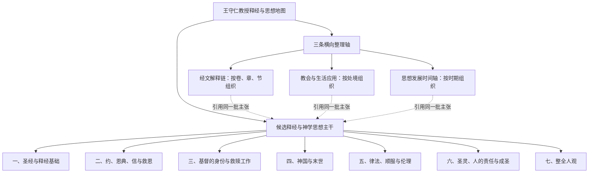

# 王守仁教授释经与思想候选基线 v2

> 状态：`candidate baseline v2`。本文件最初根据 111 篇 published transcript 建立，现已用 205 篇 published + reviewed transcript 完成压力测试。它尚未经过人工正式批准，不代表一套封闭或最终的教授思想体系。
>
> 历史状态：本版已由 205 篇结构审核后的
> [candidate baseline v3](../10-extraction/candidate_baseline_v3.md) 取代；保留本文件用于审计结构如何变化。

## 一、为什么从 v1 更新到 v2

原 `baseline v1` 来自十五篇代表样本，包含七条候选基线：

1. 证据式释经方法；
2. 先行恩典、约关系与顺服；
3. 义、信与人与神的关系；
4. 摩西律法与基督律法；
5. 基督的神性、身份与使命；
6. 神国与已然—未然；
7. 圣灵、恩典、理性与人的责任。

111 篇普查没有推翻这七条，反而为它们增加了跨讲道证据。但是，全语料也发现了圣经权威、成义校译、救恩回应、持守、联合与成圣、整全人观、经文解释链、教会应用和思想发展等材料。

机器综合最初把这些材料列为 20 个候选归组。它们混合了思想主干、二级主题、释经方法、具体经文、应用和发展线索，不能平铺成 20 条同级基线。因此 v2 将内容分成两种不同层级：

1. **候选释经与神学思想主干**：回答教授反复主张什么，以及这些主张怎样彼此连接；
2. **三条横向整理轴**：分别按经文、应用处境和时间发展，重新组织并观看同一批主张。

三条横向整理轴不是额外的一级思想结构，也不会把同一内容复制成另一套知识。一个主张可以属于某条思想主干，同时被经文轴、应用轴或时间轴引用。

v2 当前暂时归纳为七个一级结构。“七”只是本版资料归组后的数量，不是教授自己提出的七条教义，也不是固定体系。随着更多证据接受人工审核，一级结构可以新增、合并、拆分或重新命名。

205 篇综合继续支持这七个候选结构，但也显示“教会治理、真理教导、恩赐秩序与共同生活”已经形成跨讲道的高覆盖材料。它目前进入“是否由应用轴提升为教会与服事候选领域”的人工审核，不再只是等待更多证据的模糊备注。

## 二、总体结构

下图中的候选释经与神学思想主干，与第三节当前列出的一级结构一一对应。下方三条横向整理轴是索引和观察视角，不是额外的思想主干。

## 三、当前候选一级结构

### 1. 圣经与释经基础

这条基线回答两个不同但相关的问题：圣经为什么具有权威，以及教授怎样解释圣经。

#### 1.1. 圣经默示、神的话与规范性权威

- 圣经是神所默示的；
- 圣灵参与圣经的形成；
- 圣经是信仰与生活的规范；
- 正因为圣经具有权威，所以不能任意解释。

#### 1.2. 证据式综合释经

- 从原作者原意和文本证据出发；
- 综合原文、上下文、篇章结构、平行经文、历史背景和逻辑；
- 反对断章取义、预设结论和只凭主观断言；
- 区分文本观察、推论桥和最终解释结论。

#### 1.3. 语言、文体与文化语境

- 重视希伯来文、亚兰文和希腊文；
- 经常检讨和合本的翻译；
- 按叙事、比喻、预言和启示文学的文体解释；
- 不把异象、数字和象征未经论证地化为精确线性日程。

### 2. 约、恩典、信与救恩

这是原“约与顺服”以及“义与信”两条基线的上位整合，但保留各自独立论证。

#### 2.1. 先行恩典、约关系与顺服回应

宗主国—附庸国之约是教授反复使用的核心结构：宗主先施恩并建立关系，随后提出约中要求；人的顺服是关系中的回应，而不是赚取关系的功劳。

#### 2.2. 义、信与人与神的合宜关系

- “义”的中心意义被解释为人与神的好关系，以及促进这种关系的行为；
- 信心不是人的心理力量，而是对神的信靠、接受和忠诚回应；
- 属灵权柄不能脱离与神的关系独立运用；
- 罪会破坏这种合宜关系。

#### 2.3. 核心论证单元：因信成义，而非因信称义

这不是编辑替教授选择的中文术语，而是教授在多篇讲道中明确重复的主张：

> `δικαιόω` 应理解为“成义／成为义”，而不是把本来不义的人仅仅“称作义”或宣告无罪。

系统必须分别保存：

1. `OriginalLanguageJudgment`：教授对 `δικαιόω`、语态及中文译法的判断；
2. `Claim`：人因信真实成为义，与神建立合宜关系；
3. `OpposedView`：称义只是把本来有罪的人宣告为无罪；
4. `EvidenceStep / InferenceBridge`：`δικαιόω`、`λογίζομαι`、亚伯拉罕、被动语态和上下文怎样支持结论；
5. 与教授主张分开的独立事实核查状态。

代表性候选来源：

- `2019-4-14 罗4 1-25 因信成义::C04、C09`；
- `2019-3-17::C15`；
- `2019-7-21::C14`；
- `S_201108::c9`；
- `011WSR03::c11`；
- `2019-7-28::C06`。

#### 2.4. 普世救恩预备、拣选与人的回应

- 基督是否为所有人预备救恩；
- 拣选是个人还是群体；
- 神的主动和人的自由回应；
- 实际领受救恩的条件。

#### 2.5. 持续信靠、关系维持与悔改归回

- 信是否需要持续；
- 橄榄树被砍下的意义；
- 人是否可能离开关系；
- 悔改后是否可以归回；
- 相关警告针对个人、群体、约关系或牧养处境。

这部分仍有待审核的张力，不能提前压成一个简单结论。

### 3. 基督的身份与救赎工作

#### 3.1. 神性权柄、降卑受苦与君王使命

- 句首 `Amen` 所表达的宣告权柄；
- “那个人子”与但以理书七章；
- 赦罪、安息日和律法解释的权柄；
- 人子的神性身份；
- 弥赛亚君王与受苦仆人的使命。

#### 3.2. 基督受死、复活与救赎

- 基督自愿受死；
- 赎价和挽回祭；
- 身体复活；
- 受死、复活与成义／救赎的关系；
- 基督已经得胜，但敌对权势尚待最后毁灭。

### 4. 神国与末世

#### 4.1. 神国作王

- 神国首先表示神的统治；
- 耶稣的身份与神国降临；
- 登山变像预尝荣耀国度。

#### 4.2. 已然—未然

- 神国和救赎已经开始；
- 罪和死亡的权势已经受到决定性打击；
- 救赎的最终完成仍在将来。

#### 4.3. 再临与末后完成

- 基督再临是否为一次公开事件；
- 历史灾难、预言和末后完成如何区分；
- 复活、审判和最终得胜。

具体的马太福音 24 章解释归入经文解释链，再链接本主题。

### 5. 律法、顺服与伦理

#### 5.1. 摩西律法的限期

- 摩西律法针对以色列的历史功能；
- 基督徒是否仍在摩西律法之下；
- 律法、恩典和救恩之间的关系。

#### 5.2. 基督律法下的生活

- 基督的命令；
- 爱神爱人的原则；
- 顺服在约关系中的意义；
- 顺服不是赚取救恩。

#### 5.3. 原则、处境与例外

- 不机械搬用古代细则；
- 辨认不变原则及原处境；
- 处理命令冲突和不可避免的伤害；
- 较小的恶、次优结果和例外边界；
- 例外不能被常规化。

### 6. 圣灵、人的责任与成圣

#### 6.1. 圣灵与恩典赐能

- 圣灵赐生命、理解、顺服和见证的能力；
- 属灵能力来自神；
- 恩典使人能够回应。

#### 6.2. 理性、训练与真实回应

- 圣灵工作不取消人的思考；
- 恩典不取消人的责任；
- 信徒仍需学习、操练、警醒和行动；
- 属灵恩赐不能取代真实准备。

#### 6.3. 与基督联合及成圣

- 与基督同死同复活；
- 罪的统治权势被破坏；
- 信徒仍需抵挡罪；
- 成圣可以成为真实状态；
- 达到之后仍可继续成长；
- 爱成为行为的动机。

“联合与成圣”以后可能升为独立一级结构；当前先作为本基线的重要分支。

### 7. 整全人观

#### 7.1. 灵、魂、体不是机械三分

- “灵”“魂”“身体”必须按上下文解释；
- 同一词在不同经文中可能指整个人或人的不同面向；
- 不能仅凭词汇建立固定的人体结构。

#### 7.2. 肉体与身体的区别

- `σάρξ` 与 `σῶμα` 不可自动视为同义；
- “身体献上”可能指整个人的献上；
- “肉体”有时指受罪支配的存在方式，而非物质身体本身。

#### 7.3. 整全救恩

- 死亡与复活涉及整个人；
- 救恩不是只拯救脱离身体的灵魂；
- 身体、关系、行为和盼望都属于救恩论述。

## 四、其他三条组织轴

### 1. 经文解释链

目前全语料明显形成两条候选链：

- 比喻、渐进明白与回转可能；
- 马太福音 24 章、历史灾难与一次公开再临。

它们按卷、章、节组织，不升格为神学思想主干。以后罗马书 6—8 章、罗马书 11 章等连续材料也可形成 passage interpretation chain。

### 2. 教会与生活应用

- 真理根基、门徒训练与爱中的教会秩序；
- 原则、处境、伦理两难与例外界限；
- 团契、恩赐、共享与彼此顾念。

这些是反复出现的应用结构。205 篇综合进一步识别出真理教导、受限权柄、领袖资格、纪律与恢复、恩赐和聚会秩序等材料；它们可能不只是应用，而是教授关于教会与服事的稳定判断。是否提升为独立一级或二级领域，须审核具体主张及其神学／实践层级，不能仅凭频率决定。

### 3. 思想发展时间轴

- 教授早期接受过哪些释经体系；
- 后来为什么转向注重原文、上下文和证据；
- 他怎样评价司可福、时代论和其他学派；
- 同一问题在不同年代如何重复、扩展、限定或改变。

这是一条研究轴，不是一项神学教义。

## 五、原七条基线的迁移

| Baseline v1 | Baseline v2 candidate 处理 |
|---|---|
| 证据式释经方法 | 保留，进入“圣经与释经基础” |
| 先行恩典、约关系与顺服 | 保留，进入“约、恩典、信与救恩” |
| 义、信与人与神的关系 | 保留，并明确加入“因信成义而非因信称义”核心单元 |
| 摩西律法与基督律法 | 保留并扩展为“律法、顺服与伦理” |
| 基督的神性、身份与使命 | 保留并扩展身份、受苦、君王、受死与复活 |
| 神国与已然—未然 | 保留为独立一级结构 |
| 圣灵、恩典、理性与人的责任 | 保留并扩展“联合与成圣” |
| 整全人观 | 新增候选一级结构 |
| 圣经权威 | 作为“圣经与释经基础”的神学前提 |
| 教会与服事 | 205 篇后进入升格审核；待判断神学主张与处境应用的边界 |

## 六、审核规则

本基线只有在人工审核后才可成为正式 `baseline v2`。审核应逐项决定：

- 名称是否准确；
- 组内主张是否回答同一个核心问题；
- 应保持一级结构、降为二级主题，还是移动到经文／应用／发展轴；
- 不同讲道之间属于重复、扩展、限定、张力还是改变；
- 哪些表述是教授明说、直接推论、编辑归纳或尚待研究；
- 是否错误地用通行神学术语覆盖教授自己的术语和主张强度。

审核基线不等于批准其下全部 1,918 条候选主张。每项正式交付物仍只审核它实际依赖的最小可发布知识子图。
