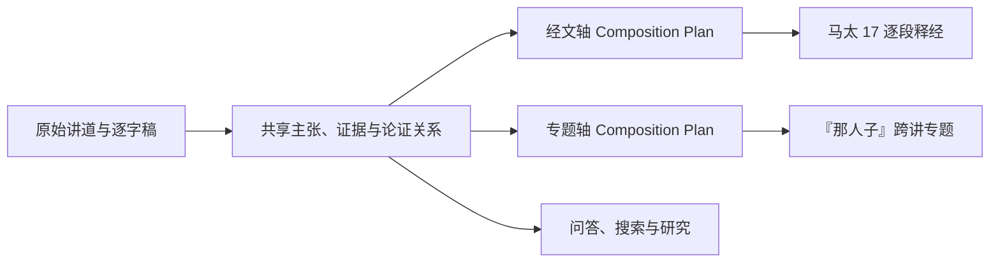

# 双轴纵向验证 v1

> **读者**：Developer
> **类型**：记录
> **状态**：历史记录（2026-08-10 一次验证）
> **与代码对齐**：不适用
> **权威范围**：无。

> 2026-08-10 更新：第一次篇章编排双模型审核已经完成。马太 26:1–30 释经轴 9 项决定中 3 项取得双模型修改共识；“那人子”专题轴 6 项决定中 4 项取得双模型修改共识；没有意见进入人工仲裁。两份计划的论证层均评为“可用但有缺口”。详见 [篇章编排双模型审核 v1](../30-authoring/composition_ai_review_v1.md)。

## 一、验证目的

本轮不以“先写出一篇好文章”为唯一目标，而是检验同一份共享知识能否同时支撑两种自然组织方式：

- **经文轴**：以马太福音第 17 章为范围，决定逐段释经的顺序、详略、专题转介与材料缺口；
- **专题轴**：以“那人子与耶稣身份”为问题，跨年份、跨场合寻找教授反复提出的主张、论证及可能的发展。

两轴共享 `Claim`、`EvidenceStep`、`ClaimRelation` 和精确来源，但分别拥有自己的 `CompositionPlan` 与 `CompositionDecision`。同一条主张可以服务两种产品，却不能因为在一篇文章中已获采用，就自动批准另一篇文章的编排判断。

## 二、实际采用的语料范围

经文轴目前包含两个独立候选计划：第三、第四讲支持马太福音第17章释经；`011WSR01` 支持马太福音26:1–30释经。专题轴则利用205篇普查结果界定“那人子”的跨讲检索范围。`011WSR01` 已完成逐句详细知识整理、Claude独立复审、OpenAI仲裁及共识补丁应用，并已正式合并进同一共享知识包。它既是太26释经来源，也以“定冠词—但以理七章—神性身份—司提反异象”的连续论证支持“那人子”专题，但仍未取得人工批准或出版许可。

来源成熟度必须显示为三类：

1. **已有详细论证资料**：可以进入主张审核；
2. **已有时间定位，待详细整理**：可以指导下一轮整理，不可直接作为批准证据；
3. **普查线索，待回听核实**：只表示值得回到原始讲道核对。

## 三、同一知识模型上的三个正式编排计划

| 轴 | 计划 | 当前决定 | 主要边界 |
|---|---|---:|---|
| 经文 | `CP-matthew-17` | 10 | 不让 Amen、人子、千禧年等专题无限岔开；缺讲经文必须明确留空 |
| 经文 | `CP-matthew-26-1-30-011` | 9 | 按太26:1–30推进；人子、Amen与约论只展开到当前经文所需深度，完整论述另行转介 |
| 专题 | `CP-topic-son-of-man` | 6 | 普查线索不能冒充教授的已审核主张；赦罪、安息日、受苦与再临须分别详细整理后再综合 |

专题计划当前登记 7 个跨讲来源线索，包括 `011WSR01`、2012 年关于赦罪权柄与安息日主权的两讲、2016 年第三讲、2017 年相关讲论、2018 年受苦与赎价材料、2021 年再临材料。

`011WSR01` 的详细候选同时进入释经计划与专题计划：

- `CP-matthew-26-1-30-011` 以9项编排决定覆盖全部17条主张；其中约论进入背景附录，偏离本段主线的救恩论引申明确转介专题；

- `CD-SON-001` 以 `DK-f0eac41a4244-CL001` 为段落主旨，处理定冠词、但以理七章与神性身份；
- `CD-SON-002` 同时使用 `DK-f0eac41a4244-CL001`、`DK-f0eac41a4244-CL002`，并与第三、第四讲的既有主张组成跨讲论证；
- 其他15条新主张服务太26释经、背景附录或明确的专题转介，不能因为同出一篇讲道就自动塞入“人子”专题。

## 四、本轮验证结论

1. **共享模型能够承载双轴。** 同一 Claim 可以同时建立经文产品和专题产品的 `KnowledgeRoute`，无需复制两份“真相”。
2. **编排决定必须分开。** 经文轴决定章内顺序和详略；专题轴决定跨讲范围、论证分段及思想发展检查，两者不能互相替代。
3. **全库普查与逐句详细整理可以分层合作。** 普查提供广度和优先级，逐句详细整理提供可复审、可精确溯源的候选证据。
4. **问答仍是独立产品。** 听众问题及教授的即时回答不会为了专题文章连贯而伪装成教授主动展开的专论。
5. **当前只是设计验证。** “人子”专题尚未达到可出版状态；它已经有全库路线图、一篇新增详细来源及可在审核 UI 查看和审核的正式编排连接，但其他关键讲道仍需逐篇补齐。

## 五、下一轮纵向切片

下一轮依优先级继续详细整理并核实：

1. 2012 NYSC 两讲：赦罪权柄与安息日主权；
2. 2018 NYSC：受苦、服事与赎价；
3. 2021 NYSC：荣耀再临及其与末世论的范围边界。

详细整理完成后，用同一共享子图分别试生成马太 17 释经稿和“那人子”专题稿，并以问答测试检查两种文章编排有没有遗失问题、反方立场或证据限定。

`011WSR01` 的模型、对象数量、三项自动修正及运行命令见 [逐句详细知识整理与双模型复审流程 v1](../10-extraction/detailed_knowledge_extraction_workflow_v1.md)。
