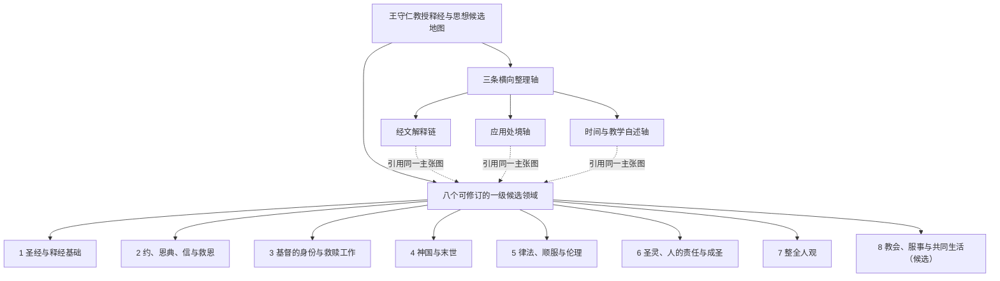

# 205 篇讲道：17 个候选归组结构审核 v1

> 审核性质：编辑结构决定，已由项目负责人于 2026-08-07 批准。它批准候选材料的组织方式，不批准其中每一条教授主张，也不进行神学事实核查。

## 一、审核结论

17 个机器候选归组不能平铺成 17 条“教授思想”。逐项审核后建议：

- 保留 **八个可修改的一级候选领域**；
- 两个方法归组合并到“圣经与释经基础”的不同二级分支；
- 一个具体末世归组保留为经文解释链；
- 三个教会归组合并为新的一级候选领域，但保留三个不同二级分支；
- 一个混合的人论—罪—成圣归组必须拆分；
- 处境伦理归入“律法、顺服与伦理”及应用轴；
- 教学自述暂留时间／自述轴，不能据三条代表材料宣称思想发展。

建议的一级候选领域是：

1. 圣经与释经基础；
2. 约、恩典、信与救恩；
3. 基督的身份与救赎工作；
4. 神国与末世；
5. 律法、顺服与伦理；
6. 圣灵、人的责任与成圣；
7. 整全人观；
8. **教会、服事与共同生活（新增候选）**。

“八”仍然只是当前资料归组后的数量，不是教授自己提出的八条教义。后续可以新增、合并、拆分或改名。

## 二、逐项审核

| # | 候选归组 | 覆盖 | 审核决定 | 建议归属 | 理由 |
|---:|---|---:|---|---|---|
| 1 | 证据、语境与整全经文的释经程序 | 35 篇／43 claim | **接受并合并** | 1.2 证据式综合释经 | 这是高覆盖的方法主张，不是独立神学结论。必须将文本、上下文、平行经文、逻辑排除等保存为不同 `EvidenceStep`。 |
| 2 | 语言、结构、历史语境与意义—应用边界 | 26／43 | **接受并合并** | 1.3 语言、文体、结构与文化语境 | 它是第 1 组的具体操作层；渐进启示作为释经定位规则，不等于由它产生的某项神学结论。 |
| 3 | 先行恩典、守约回应与关系维持 | 21／33 | **接受为二级主干** | 2.1 先行恩典、约关系与顺服回应 | 跨系列反复出现，宗主—附庸约是教授重要解释框架；但不可自动应用到每一项救恩、律法或纪律主张。 |
| 4 | 证据性的信、关系性的义与相称行动 | 23／42 | **接受，但保留独立核心论证** | 2.2 义、信与合宜关系；2.3 因信成义 | 上位归组合理，但“因信成义，而非因信称义”必须保持独立、可检索，不能被宽泛的“关系”标题遮蔽。 |
| 5 | 摩西律法的限期、基督律法与重叠 | 16／35 | **接受为二级主干** | 5.1 摩西律法、基督律法与重叠 | 主张稳定；具体伦理应用仍需经过原处境—不变原则—目标处境的推理，不能从“两种律法不同”直接推出。 |
| 6 | 耶稣的神性权柄、受苦使命与复活工作 | 22／39 | **接受，但内部不得压平** | 3 基督的身份与救赎工作 | “人子”、`Amen`、父子关系、旧约互文、受难和复活是不同论证入口，应分别成链，再由上位基督论连接。 |
| 7 | 圣灵、恩典、理性与真实责任 | 19／37 | **接受，但拆成相关子题** | 6 圣灵、人的责任与成圣 | 圣灵赋能、重生／成圣、恩赐、理性辨识和人的顺服责任相关却不相同，不能变成一个万能解释公式。 |
| 8 | 神国、来世生命与救恩的已然—未然 | 21／40 | **接受为一级领域的核心** | 4 神国与末世 | 跨经卷支持充分；神国定义、救恩阶段、永生、复活和终局应保持方向性关系，不先假定已经形成完整末世体系。 |
| 9 | 橄榄山讲论、圣殿毁坏与单一公开再临 | 9／16 | **接受为经文解释链，不作一级思想** | 经文轴：太 24／但 9／相关经文 | 这是特定经文范围中的解释结论；应链接神国与末世，但不能与一般末世主题混成同一个单元。 |
| 10 | 普世救恩预备、条件性回应与群体性拣选 | 12／32 | **接受为重要二级候选** | 2.4 救恩范围、拣选与回应 | 材料足以独立检索；仍须拆开“为万人预备”“实际接受”“持续持守”和“拣选定义”，并保存被反对观点。 |
| 11 | 圣经默示、正典认出与终极启示 | 4／17 | **接受并合并，暂不单列一级** | 1.1 圣经默示与规范性权威 | 它回答圣经为什么有权威，与“怎样释经”不同；覆盖仍较集中，适合作为一级领域 1 的神学基础分支。 |
| 12 | 整全人、罪的关系破坏与成圣成长 | 8／23 | **拒绝原归组，必须拆分** | 7 整全人观；2 罪与关系；6 成圣 | 三部分没有共同到足以成为一个主题：人论讨论人的构成与死亡—复活阶段；罪讨论关系破坏；成圣讨论恩典、状态与成长。它们只能建立关系，不能合并成文章。 |
| 13 | 真理教导、受限权柄、秩序与恢复性治理 | 22／38 | **接受，合并为新增领域的 8.1** | 8.1 真理教导、领袖与恢复性治理 | 覆盖高、对象明确，包含领袖资格、教导责任、权柄限制、纪律、保护与恢复；仅称“一般应用”会损失教授稳定的教会判断。 |
| 14 | 恩赐、共同造就与聚会秩序 | 10／28 | **接受，合并为新增领域的 8.2** | 8.2 恩赐、造就与聚会秩序 | 恩赐目的、成熟度、方言、聚会秩序和女性角色共享教会处境，但必须按议题和经文保留不同限定。 |
| 15 | 不变原则、处境判断与关系性伦理 | 12／30 | **接受为方法／应用分支，不升一级** | 5.2 处境伦理；应用轴 | 它描述教授如何从规范进入具体处境。婚姻、饮食、政治、教会交通等案例不得互相直接类推。 |
| 16 | 团契、慈惠、安慰与礼仪性共同生活 | 14／35 | **接受，合并为新增领域的 8.3** | 8.3 团契、慈惠、安慰与圣餐共同生活 | 共同主题是教会群体如何分享、扶持、奉献、问责并借圣餐被塑造；慈惠、安慰、财务和礼仪仍需独立子单元。 |
| 17 | 证据纠偏与持续学习的教学自述 | 8／10 | **保留候选，暂缓作为思想发展结论** | 时间／自述轴 | 现有代表证据更多是教学使命和方法自述，尚不足以证明明确的“修正前—修正后”思想变化。需讲道日期和可比较立场。 |

## 三、四项结构性决定的证据检查

### 3.1. “教会、服事与共同生活”可以进入升格审核

这不是仅凭“教会”关键词提出。三个独立归组分别覆盖：

- 治理、真理与恢复：22 篇／38 claim；
- 恩赐、造就与秩序：10 篇／28 claim；
- 团契、慈惠、安慰与礼仪：14 篇／35 claim。

代表主张包括：

- `2016 NYSC 專題：馬太福音釋經（四）2::c13`：教会不可任意决定，必须查验并应用天上已定的标准；
- `S 210704::C22`：监督和长老必须明白真理并善于教导；
- `S 210214::C01`：恩赐的目的在教会中彼此造就；
- `S 210314::C08`：拥有特殊恩赐不等于属灵成熟；
- `S 230219::c9`：团契以同属基督为根基，其实质包含彼此帮助；
- `S 230604::C18`：圣餐的记念使基督过去的死在今日共同体中发挥效用。

因此建议使用保守名称“教会、服事与共同生活”，而不是先宣称已经重建出一套完整“教会论”。

### 3.2. 人论、罪论和成圣论必须拆分

原归组的代表证据实际回答三个不同问题：

- `S 201011 林前2 屬靈人看透::C07`：活着的人是整体，死亡时里面人与身体暂时分离，复活时重新结合；
- `2019-12-01 可3章28-30提前1章13-14羅7章5-8章1犯罪的三層面::C01`：罪是不顺从神并破坏与神的关系；
- `2019-09-01 成圣(II)::C010`：人在恩典中可以达到爱神爱人的成圣状态。

共享“人”或“关系”不足以把它们合并。知识图可以建立 `relates_to`、`qualifies` 或论证关系，但文章和目录必须分开。

### 3.3. 圣经权威应与释经方法相连而不混同

`220-426-110-1134::c1` 和 `S 211017 提後3 14-17 聖經的來源::C001` 支持默示及救恩智慧；`220-426-110-1135::C008` 区分教会认出权威与教会赋予权威。

这些是关于圣经来源和权威的神学主张；“原文、文体和上下文”则是解释圣经的方法。两者的连接应表达为：**因为圣经被视为规范性的神的话，所以解释必须受文本约束**。它不是“文本方法必然推出先行恩典”等神学结论。

### 3.4. 教学自述还不是思想发展时间线

当前代表证据如 `S 200426::c9` 主要说明教授以原文释经寻找圣经真义为使命；`S 210321::C010` 表示他重视按证据修正教导。它们能支持“教学自我理解”，却尚不能说明某项立场在何年由 A 变为 B。

只有在补齐讲道日期，并找到同一问题前后可比较的明确主张后，才能建立 `supersedes`、`qualifies` 或思想发展叙述。

## 四、审核后建议结构

## 五、项目负责人决定

项目负责人已批准：

1. 把“教会、服事与共同生活”列为第八个一级**候选**领域；
2. 将原“整全人、罪、成圣”机器归组拆成三个不同归属；
3. 把“教学使命与证据纠偏自述”暂留时间轴，等日期和前后立场足够后再讨论思想发展。

其余 14 项按本文件建议进入 `candidate baseline v3`。本次决定不等于批准其内部全部 claims。

## 六、证据与复核入口

17 个候选归组的完整摘要、批次主题、全部展开 claim refs、代表性 claim refs、待审问题和覆盖数字位于：

- `output/corpus-survey/synthesis/full-corpus-205/full-corpus-thought-map-candidate-v1.json`
- `output/corpus-survey/synthesis/full-corpus-205/full-corpus-thought-map-candidate-v1.md`

本审核只改变结构建议，不改写上述机器结果。
