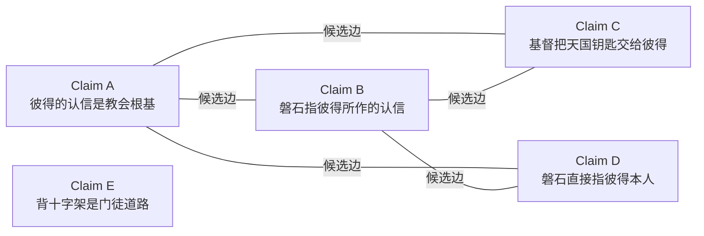
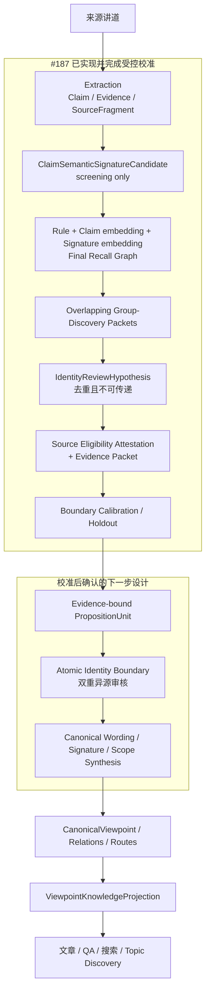
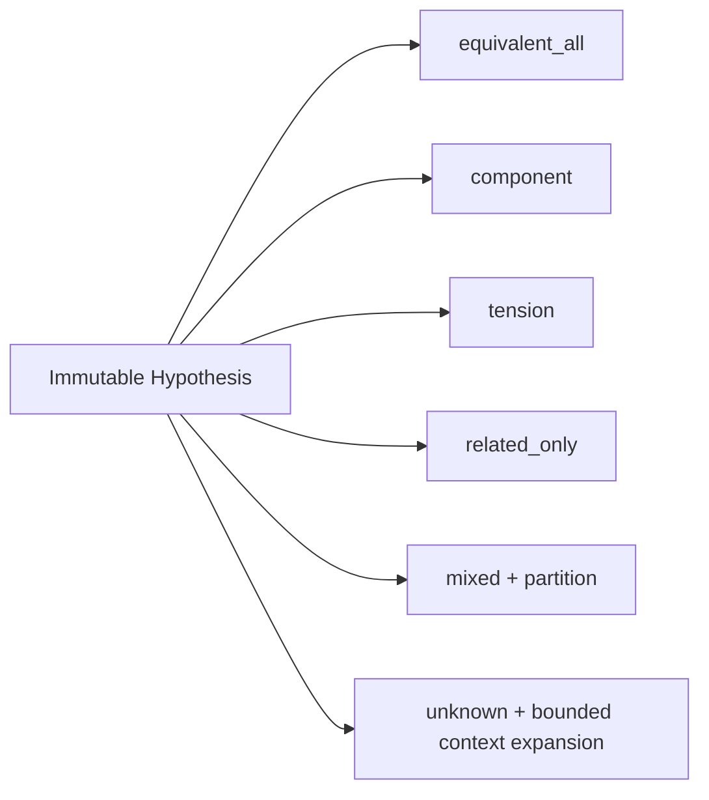
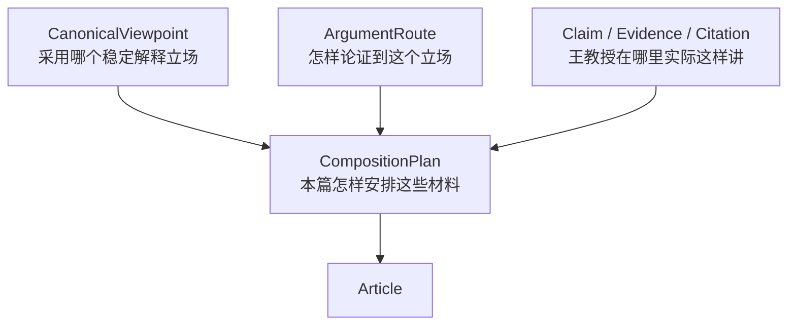

# 一种观点，许多讲道

> Canonical Viewpoint Registry 架构学习版  
> 状态：面向学习和讨论的伴读文档，不是运行时数据源，也不替代正式规范  
> 正式 authority：[Canonical Viewpoint Registry 与跨讲论证路径设计 v1](./canonical_viewpoint_registry_design_v1.md)  
> 学习版对齐基线：#187 commit `b6a00de`（2026-08-22）的设计与校准实现<br>
> 追踪：GitHub issue #189；实现与校准：#187 / PR #191

## 1. 先从一个常见的数据问题说起

假设一位读者在三个系统里留下了三条记录：

- 书店系统：王明，手机号 1234；
- 课程系统：Wang Ming，邮箱 wang@example.com；
- 奉献系统：王弟兄，手机号 1234。

三个系统保存的是三条 source records，但现实中可能只有一个人。Master Data Management（MDM）要解决的，不是删除三条原始记录，而是建立一个稳定的 master identity，并保存它与三条来源记录之间的 crosswalk。

王教授的讲道资料有相似的问题。一项释经判断可能在不同年份、不同讲道、不同经文背景中反复出现：

- 用词不同；
- 论证路线不同；
- 有时说得完整，有时只出现一个组成部分；
- 有时后来增加限定或应用；
- 有时两处材料之间存在尚未解决的张力。

如果每条讲道里的说法都只作为独立 `Claim` 保存，下游文章和问答就很难知道哪些是同一个稳定观点。反过来，如果把相似的 Claim 直接合并，又会丢掉原始语境、论证和差异。

因此，本平台采用 registry MDM：

> 保留每一条来源 Claim，同时在它们上方建立稳定的观点身份。

这个稳定身份就是 `CanonicalViewpoint`。

## 2. 为什么不是直接生成一篇“王教授神学总结”

一篇总结文章是某次写作的结果；`CanonicalViewpoint` 是可以被许多产品重复使用的主数据。

两者的生命周期不同：

| 对象 | 回答的问题 | 是否保留稳定身份 | 是否必须回到来源 |
|---|---|---:|---:|
| `Claim` | 王教授在这一处具体说了什么 | 是，来源局部 | 是 |
| `CanonicalViewpoint` | 多处说法是否属于同一个观点 | 是，跨来源 | 是 |
| `ArgumentRoute` | 王教授怎样论证到这个结论 | 是，跨来源路线 | 是 |
| 文章 | 这一次怎样向读者解释这些材料 | 不是主数据身份 | 是 |
| QA answer | 针对这个问题怎样作答 | 不是主数据身份 | 是 |

文章可以改写、扩写或重排，但不应每次重新发明“哪些 Claim 是同一个观点”。这项判断应在 registry 中完成一次、保存依据，然后被文章、QA 和搜索共同复用。

## 3. Registry MDM 在这里怎样对应

| 通用 MDM 概念 | Wang Knowledge Platform |
|---|---|
| source record | 来源局部 `Claim` |
| master identity | `CanonicalViewpoint` |
| crosswalk | `ViewpointClaimLink` |
| match candidate | `ViewpointIdentityCandidate` |
| match decision | `ViewpointIdentityDecision` |
| mastered attributes | `ViewpointRevision` 中的 core proposition 和 scope |
| source lineage | Claim → EvidenceStep → SourceFragment → Citation |
| stewardship | 自动复核、确定性验证和人工 exception review |

这里与传统客户 MDM 有一个关键差异：系统不从几条来源措辞中挑一条作为“surviving 原话”。`CanonicalViewpoint` 的 core proposition 是编辑归一化，必须明确标记为不是王教授逐字引文；原始措辞仍留在各自 Claim 和来源中。

## 4. 先认识核心对象

### 4.1 Claim：来源局部断言

`Claim` 表示王教授在某一个来源语境中作出的具体主张。它必须能回到 EvidenceStep、原文片段和引用位置。

同一句话在另一篇讲道中再次出现，仍然是另一条 Claim，因为它属于另一个 source context。

### 4.2 ClaimSemanticSignatureCandidate：便于筛选的语义结构

自由文本很难稳定比较，所以系统为每条 source-eligible Claim 最多生成一个 `ClaimSemanticSignatureCandidate`，例如：

```yaml
subject: 磐石
predicate: 指向
object: 彼得所认信的基督与真理
polarity: affirmed
stance: endorsed
modality: asserted
discourse_roles:
  - conclusion
conditions: []
population_scope: []
temporal_scope: []
material_qualifications: []
```

一个 signature 可以包含多个 `SemanticAtomCandidate`，因为一条复合 Claim 可能同时断言几个命题。每个 atom 记录 subject、predicate/object、polarity、stance、modality、scope、conditions、material qualifications 和 discourse roles。

经文引用和 Claim 类型仍保存在 SHA-bound input/projection 上；不会为了让 atom 看起来完整而让模型凭空补写。

signature 的作用是把召回问题拆开：主体是否相近、正反是否可能相关、对象和范围是否值得进一步核对。

它不是最终观点，也不是 identity evidence。当前 schema 强制保存：

```text
screening_only = true
identity_evidence = false
apply_allowed = false
```

模型可以提出 signature；程序检查 exact-once、Claim revision、字段和 SHA。它只用于筛选与召回，不能直接成为正式 `ViewpointRevision.proposition_signature`。

#### SemanticAtomCandidate 与 PropositionUnit 不是一回事

最新校准发现，screening atom 还不足以承担观点身份。下一版设计需要 evidence-bound `PropositionUnit`：

| 对象 | 当前状态 | 用途 | 能否作为 identity 输入 |
|---|---|---|---:|
| `SemanticAtomCandidate` | 已实现 | 低成本拆解语义，帮助 embedding 和 recall | 否 |
| `PropositionUnit` | 最新设计方向，尚未实现 | 把 Claim 中的原子命题绑定到可定位 statement span、EvidenceStep、SourceFragment 和 source revision | 完成双审后可以 |

换句话说，Semantic Atom 像目录卡上的摘要字段；PropositionUnit 像已经用页码和原文定位好的、可审核的最小命题。

### 4.3 Recall Graph：值得比较的候选网络

当前 final graph 的三个基础通道是规则、原 Claim embedding 和 signature embedding；受限的模型 Group Discovery 只在后面为确实缺边的 proposal 增加有 provenance 的 recall extension。



图中的节点是 Claims，边的意思只有：

> 系统认为这两个 Claim 在语义上足够接近，值得交给 identity review 比较。

边不表示两个 Claim 已经是同一个观点。没有边也不表示它们一定不同，只表示当前召回策略没有把它们配成候选对。

规则、embedding 和模型在这一阶段都只有“提名权”，没有“归并权”。它们产生的是工作名单，不是主数据结论。

截至 #187 的受控 cohort，1,212 条 Claim 中有 29 条 source-ineligible disposition，另外 1,183 条生成 signature。原规则／Claim-embedding union 有 13,648 个无向 pairs；signature embedding 找到 10,224 个，其中新增 3,806 个，基础 final graph 为 17,454 个 pairs。Group Discovery 后又以 7 条最小 bridge 形成 17,461-pair overlay。这些数字只描述该次 SHA-bound calibration snapshot，不是长期常量，更不表示存在 17,461 个观点关系。

### 4.4 Candidate Group：一起审核的候选包

Recall graph 中相互连接的 Claims 可以被组织成 bounded candidate group，减少模型调用和人工阅读次数。

Candidate group 只回答：“哪些材料适合放在同一个审核 packet 里？”它不回答：“这些材料是不是一个观点？”

尤其不能把连通性当作等价关系：

```text
A 接近 B
B 接近 C
```

不能推出：

```text
A 与 C 是同一个观点
```

B 可能是一个范围较宽的复合 Claim，分别与 A、C 局部重叠。因此，每个拟议 member 都必须与拟议的 core proposition 单独比较。

当前实现把 final graph 切成有 48-Claim 上限的 overlapping packets。`review edge` 是本 packet 要主动检查的 signature edge，并在全部 packets 中恰好暴露一次；重复出现的局部边只是 `context edge`，帮助模型理解周围结构，不能重复计数。原 graph 中没有进入 signature review 的边作为 `baseline-only fallback` 保留，不能静默删除。

Group Discovery 产生 `ScreeningGroupProposal`，关系只允许 `possible_equivalent`、`component` 或 `tension`。它们全部是 screening proposals，不是 identity decisions。

### 4.5 IdentityReviewHypothesis：去重后的待审核假设

同一个 proposal 可能因为 overlapping packets 出现多次。系统按关系类型、participant Claim 和角色去重，得到不可变的 `IdentityReviewHypothesis`。

这一步有三个重要规则：

- 重复 proposal 只增加 provenance，不增加模型调用；
- 相交 hypotheses 不能被重新连成一个大分量；
- 每个 hypothesis 恰好进入一个 evidence packet，或一个有 closed reason 的 planning exception。

这里的 `participant` 是参加本次比较的 Claim；`participant role` 是它在 screening proposal 中暂时承担的角色，例如 candidate member、component 或 tension side。角色仍是待审核假设，不是 master membership。

### 4.6 Source Eligibility Attestation 与 Evidence Packet

Extraction 层的记录通常保持 `candidate / eligible_candidate`，即使已经过独立复核，也不能被 viewpoint 层批量改写成人工批准。系统改为编译 `IdentitySourceEligibilityAttestation`，证明某条 pinned Claim 具备进入 `viewpoint_identity_review` 的来源条件：

- extraction 和 independent review artifacts 可解析；
- correction 已实际应用；
- Claim revision、source revision 和 SHA 一致；
- EvidenceStep、SourceFragment 与逐字来源有效；
- attribution 和 source-locality 可验证。

Attestation 只授予“可以送审”的资格，并明确保存 `approval_status=not_human_approved`。它不证明两个命题等价。

`Evidence Packet` 则是为一个 hypothesis 编译的最小、SHA-bound 来源包。它提供 reviewer 真正需要的 Claim、Evidence 和 source locator；若 pinned dependency 已过期，系统产生 `stale_dependency` exception，而不是偷偷读取数据库里的 current revision 替代它。

### 4.7 Identity Boundary：先判断成员边界，再写 canonical wording

最新校准后的设计把 identity review 拆成两个阶段；第一阶段 boundary runner 已实现，第二阶段在原子化完成前明确暂停：

1. **Boundary classification**：两位异源 reviewer 只判断完整 participant set 是 `equivalent_all`、`component`、`tension`、`related_only`、`mixed` 还是 `unknown`；
2. **Canonical synthesis**：只有边界一致、成员明确的原子命题，才生成 canonical wording、正式 proposition signature 和 scope。

`mixed` 表示一个多成员 hypothesis 中只有某些子集关系一致。它必须给出覆盖原 participant set 的可验证 partition，并产生新的 immutable successor hypotheses；不能在原 hypothesis 内直接批准一个方便的子集。

`unknown` 表示现有 evidence 不能可靠判断。系统最多自动做一次同来源、有限窗口的 `context expansion`，把锚点前后段落加入新 packet；它不能跨来源补料，也不改变 participants。扩展后仍不确定才进入 exception queue。

### 4.8 CanonicalViewpoint：稳定的观点身份

通过 atomic identity review 后，真值条件等价的 PropositionUnits 可以支持同一个 `CanonicalViewpoint`，并沿稳定 locator 回到各自来源 Claims。现有 registry crosswalk 仍以 pinned Claim 为来源记录，PropositionUnit 接入需要补足 unit locator，不能切断 Claim lineage。

判断至少比较：

- subject；
- predicate 和 object；
- polarity；
- scripture、population 和 temporal scope；
- conditions；
- modality；
- professor 或 external-position attribution；
- 会改变真值条件的 qualification。

结论相似但范围、条件或正面所指不同，通常不是同一个 viewpoint。它们可能是 `extends`、`qualifies`、`applies`、`specializes` 或 `tensions_with`。

`CanonicalViewpoint` 也不是强制层级树。主题的 hierarchy 属于 `TopicNode`；观点之间则使用 typed graph，因为一个观点可以同时 specialize 一个观点、qualify 另一个观点，并与第三个观点形成 tension。

### 4.9 ArgumentRoute：到达同一结论的不同道路

两个 Claim 即使表达同一结论，也可能使用不同论证：

- 一篇讲道从希腊文语义出发；
- 一篇从上下文结构出发；
- 一篇从救赎历史出发。

这些 Claim 可以属于同一个 `CanonicalViewpoint`，但应保存为不同的 `ArgumentRoute`。每条 route 的实际证据仍由 source-local attestation 记录，不能把讲道 A 的前提、讲道 B 的推论和讲道 C 的结论拼成一条教授从未完整讲过的路线。

### 4.10 ViewpointKnowledgeProjection：给下游的最小借阅包

`ViewpointKnowledgeProjection` 不是新的 master identity，而是 compiler 为一个具体 consumer 编译的不可变切片。它把被选择的 viewpoint revision、member Claims、routes、relations、coverage、quality、Evidence 和 Citation 绑定到同一个 SHA。

文章、QA 和搜索只读取这个 scoped projection，不直接遍历 registry，也不读取整份 architecture 文档。

## 5. 完整处理流水线



### 阶段一：Extraction

先从每篇来源中提取 Claim、EvidenceStep、SourceFragment 和 Citation。Extraction layer 的 sentence ledger 防止源文本在抽取前静默消失。

Canonical Viewpoint layer 不替 extraction 修正遗漏，也不能把上游 candidate 自动升级为公开事实。

### 阶段二：Screening Signature

模型把 Claim 的自由文本整理成一个或多个 screening atoms。程序验证：

- 输入 Claim 是否 exact-once；
- ID 和 revision 是否匹配；
- 输出字段是否合法；
- statement 和 source SHA 是否仍是同一版本；
- 失败项是否显式保留。

它的输出只能进入 recall，不能进入 master data。

### 阶段三：Recall

系统使用多种信号寻找“可能值得比较”的无向 pair：

- 确定性规则：共享经文、兼容 topic terms、claim role、已有 reviewed relation；
- embedding：发现用词不同但含义接近的 Claim；
- signature embedding：用结构化 screening atoms 补充跨措辞召回；
- bounded group discovery：在受大小限制的图 packet 中提出可能的 group，并在必要时生成有 provenance 的 recall extension。

结果是带 channel provenance 的无损并集。任何单一通道未命中，都不能否决另一个通道找到的候选。

`directed pair` 是从 focal Claim A 看邻居 B 的调度记录；`undirected pair` 是规范化后的 `{A,B}`。A→B 与 B→A 不能算两项独立语义事实。#187 正是因为发现旧 scheduler 有 20,619 个 directed comparisons、却只有更少的 unique undirected pairs，才停止逐邻居完整分类方案。

### 阶段四：Group Discovery

Scheduler 将候选网络切成 graph-aware、overlapping 且有 item/byte 上限的工作包。模型提出 possible-equivalent、component 或 tension screening groups；未被提出的 Claim 和 edge 继续保持 unresolved，不能被当成 unrelated 或 approved negative。

如果模型提出的 participant group 在 final graph 上不连通，程序只增加使该 group 连通所需的最小 `group_model_discovery` bridge edges。这个 `recall extension` 记录 call、packet、proposal 和相似度 provenance，不扩成 clique，也不是 identity evidence。

### 阶段五：Hypothesis 与 Evidence Planning

系统将 overlapping packet 的 proposals 去重为 immutable hypotheses，然后为每个 hypothesis 编译 evidence packet。当前实现还会机械生成：

- source eligibility attestation；
- distinct source count；
- deterministic blocker codes；
- call eligibility；
- stale dependency 等 closed planning exceptions。

“可送模型审核”与“可自动批准”是两件事。单一来源 hypothesis 可以送审，但会被 `two_independent_sources` risk gate 阻止自动批准。

### 阶段六：Boundary Calibration

两位 reviewer 对同一 evidence packet 独立判断完整 participant set：



旧 schema 同时要求 reviewer 判断 Claim composition、成员边界、canonical wording 和 scope。真实 calibration 显示，即使使用高能力异源模型，复合 Claim 的 `component` 宽度仍不稳定：非重叠 12-item holdout 只有 6/12 exact boundary agreement，并且没有确认的 `equivalent_all` 正例。正式报告因此固定 `full_rollout_recommended=false`。

这是一次有价值的失败：它证明问题不只是模型够不够强，而是 identity 输入粒度不对。

### 阶段七：PropositionUnit 原子化（下一步，尚未实现）

下一版先把复合 Claim 拆成 evidence-bound `PropositionUnit`。每个 unit 必须保存：

- 所属 Claim revision；
- 可验证的 statement span；
- EvidenceStep、SourceFragment 和 source revision；
- `whole_claim / conjunct / qualified_clause` 等结构角色；
- attribution、polarity、scope、conditions 和 qualifications。

Identity reviewer 以后只在这些原子单元之间判断 `equivalent / tension / related / unknown`。`generalizes`、`specializes`、`applies`、`grounds` 和 `supports` 另存 typed relations，不再让模糊的 `component` 同时承担“拆 Claim”和“判断 viewpoint”两个责任。

### 阶段八：Canonical Synthesis 与 Apply

只有两个异源 reviewer 对 evidence-bound PropositionUnits 达成 equivalence，并通过独立来源、provenance、scope 和其他 risk gates 后，系统才生成 canonical wording、正式 signature 和 scope。

审核输出先形成可验证 ChangeSet。程序检查引用、revision、blocker、lineage、覆盖账本和质量报告。通过后才能写入 master data。模型不分配 canonical ID，不直接写数据库，也不能批准自己的输出。

### 阶段九：Compile for Consumers

下游不读取整个 registry，也不读取本设计文档。Compiler 按具体任务生成最小、SHA-bound 的 `ViewpointKnowledgeProjection`，包含：

- 被选择的 viewpoint revision；
- 实际 member Claims；
- 所需 ArgumentRoutes；
- qualifications、tensions 和 coverage disclosure；
- Evidence、Citation 与 dependency manifest；
- resolution ledger 和 quality report 的绑定。

## 6. 贯穿例子：太 16:18 的“彼得与磐石”

以下是架构示例，不在本文中宣布王教授最终 canonical 立场。

假设抽取层得到四条来源局部 Claim：

- Claim A：磐石指彼得本人；
- Claim B：彼得作为认信者和使徒代表构成磐石；
- Claim C：磐石不是彼得个人，而是彼得所认信的基督与真理；
- Claim D：磐石直接指基督。

Claim B 是典型的复合 Claim。它可能至少包含两个 PropositionUnits：

```text
B.1 彼得是认信者
B.2 彼得在这里代表使徒群体
```

如果直接比较整条 Claim B，reviewer 很容易对“它是 A 的 component，还是 A 的 extension”使用不同宽度。先把 B.1、B.2 分别绑定到原文 span 和 Evidence，再比较原子命题，identity 问题就会清楚得多。

因为它们共享太 16:18、彼得、磐石、认信等语义信号，规则或 embedding 很可能把它们放进同一 recall neighborhood。这是正确的：它们确实值得一起比较。

但 identity review 不能因此把四条都合并。可能的审核结果是：

- 两条“彼得本人是磐石”的不同措辞，若真值条件一致，可以成为同一 viewpoint 的 members；
- “彼得代表使徒群体”增加了 population/representative role，可能是 `extends`、`qualifies` 或独立 viewpoint；
- “磐石不是彼得个人”与正向命题 polarity 冲突，不能增加同一 viewpoint 的 recurrence；
- “磐石是彼得所认信的基督与真理”与“磐石直接指基督”可能彼此接近，但 object identity 是否相同仍需审核；
- 无法安全协调的正面解释应保留为 distinct viewpoints 和 `tensions_with`，而不是多数票合并。

这个例子说明了系统最重要的风险不对称：

> 错误拆成两个 viewpoint 以后还可以再 merge；错误合并会让真实的释经差异从所有下游产品中消失。

因此，设计在身份判断上宁可暂时保留两个候选，也不以相似度直接建立 canonical membership。

## 7. 为什么不把全部工作交给大模型

大模型很适合：

- 理解不同措辞；
- 生成 semantic signature；
- 发现跨词汇的语义近邻；
- 比较真值条件；
- 给出 relation proposal 和理由。

但大模型不适合独自负责：

- 证明 1,000 多条 Claim 是否一条都没漏；
- 保证同一输入重跑得到 byte-stable artifact；
- 检查每个 ID、revision 和 SHA 是否真实存在；
- 控制 candidate、packet 和费用上限；
- 保存 split、merge、撤销和影响传播历史；
- 防止一个模型同时提出并批准自己的结论。

因此职责划分是：

> 大模型负责语义判断；程序负责记账、验证、限流和守门。

这不是削弱大模型，而是把它用在最有价值、也最需要语言理解的地方。

当前校准还把两个语义角色分给异源模型：OpenAI 侧 proposal 使用 Codex Subscription，blind review 使用经过验证的 Claude Subscription。子进程移除 API billing credentials；Subscription 验证失败便 fail closed，不能静默改走 API 计费。异源复核的目的不是多数投票，而是暴露 schema、证据和边界定义中的不稳定。

## 8. 怎样保证数据质量

系统使用两本完整性账：

1. Extraction sentence ledger：源文本每句话是否被表示、明确排除或尚未处理；
2. `ViewpointResolutionLedger`：进入观点解析的每个 Claim revision 最终成为 member、新 viewpoint candidate、typed related disposition，还是被明确 deferred/ineligible。

第二本账的关键是 exact-once：输入 manifest 中的每条 Claim 必须恰好有一行，不能因为难以分类就从结果中消失。

此外，质量不是一个可以互相补偿的总分。以下维度分别过关：

- provenance integrity；
- source maturity；
- resolution coverage；
- identity precision；
- candidate recall；
- route fidelity；
- temporal correctness；
- consumer projection integrity。

例如，来源引用全部正确，不能抵消一次错误 merge；召回覆盖很好，也不能抵消 route 跨来源拼接。任一适用维度失败，就阻止相应 approval 或 consumer eligibility。

质量验证还区分三类测试资料：

- `calibration set`：用来调整 schema、prompt 和判断定义；
- `holdout set`：与 calibration 完全不重叠，用来检查调整后的方案是否真的泛化；
- `gold set`：具有人工确认答案的正负例，才能计算有意义的 recall、precision 和 false merge/false split。

如果 gold set 没有 confirmed equivalent positives，就不能因为 negative 或 related 分类看起来稳定而批准 full rollout。`silver calibration` 只表示两个模型在受限样本上形成一致候选，不等于 gold，也不建立正式 master data。

## 9. 怎样减少单人编辑的负担

目标不是让编辑逐条审几万条 pair，而是让自动化先完成大多数低风险工作，只把真正影响身份边界的 exception 交给人。

设计采用：

- 以 candidate group 为审核单位，不逐 pair 弹窗；
- proposal 与独立 semantic review 分离；
- 低风险、双重判断一致且确定性 gates 全过时，可明确标记为 `system_approved`；
- 正面所指冲突、scope/condition 分歧、component 歧义、split/merge/supersedes 等进入人工 exception queue；
- 一次批准 identity boundary，后续文章、QA 和搜索重复使用；
- 新增同类 member 时只审核 delta，不重读整个 viewpoint；
- 未被产品需要的 internal candidate 可以懒审核；
- 用风险抽样监测自动决定，不要求事前逐条人工确认。

`system_approved` 不能显示成 `human_approved`。自动化减少的是重复劳动，不是审计记录。

## 10. 为什么这个方案可以扩展

系统区分两种运行模式。

### Bootstrap：第一次建库

```text
pinned historical Claims
→ rule ∪ embedding ∪ bounded-model recall
→ screening group discovery
→ evidence-bound PropositionUnits
→ bounded atomic identity review
→ initial CanonicalViewpoints
```

目标复杂度是 `O(N × K)`，其中 K 是每个 focal Claim 的候选硬上限。系统不做所有 Claim 的全对全模型判断。

### Incremental：以后加入新讲道

```text
new Claim
→ retrieve top-K active CanonicalViewpoints
→ compare with viewpoint core and representative members
→ ambiguity 时才下钻更多 Claim / Evidence / Route
→ delta ChangeSet
```

日常成本随新增 Claim 数 `ΔN` 增长，而不是每加入一篇讲道就重跑整个历史库。定期 global audit 可以检查 near-duplicate、过宽 viewpoint 和 split/merge 风险，但不阻塞日常增量入库。

## 11. 下游文章怎样使用 CanonicalViewpoint

释经文章需要同时使用三种知识：



`CanonicalViewpoint` 不能替代 Claim grounding。文章可以用 canonical proposition 组织段落，但每个实际观点段落仍须绑定来源局部 Claim 和 Evidence。

这可以避免两个相反错误：

- 只读 Claim：每篇文章重新判断一次观点身份，写法不一致；
- 只读 CanonicalViewpoint：文章有结论却没有教授原声和论证依据。

正确做法是：观点提供一致性，route 提供推理，Claim/Evidence 提供可核验来源，CompositionPlan 决定本篇用途。

## 12. QA 与智能搜索怎样使用

智能搜索和 QA 可以共享 embedding infrastructure，但不应把所有对象塞进一个无类型向量库。建议分层检索：

```text
用户问题
→ CanonicalViewpoint index：找到稳定观点
→ Claim / Evidence index：找到可引用来源
→ ArgumentRoute index：回答“为什么”
→ ViewpointKnowledgeProjection compiler
→ 带引用和 dependency SHA 的答案或搜索卡
```

Embedding score 只用于召回和排序，不建立 registry relation。最终公开引用仍来自 source-local Evidence、Fragment 和 Citation。

## 13. UI 应该让人看到什么

主数据 UI 不应把全库画成一团 graph hairball。一个实用的 viewpoint detail 页面应分层展示：

1. 顶部：canonical proposition、approval、coverage 和 quality；
2. Members：哪些 Claims 被判定为同一观点；
3. Related Claims：supports、extends、qualifies、applies；
4. Routes：有哪些不同论证路线和各自来源 attestation；
5. Tensions：哪些观点不能静默调和；
6. Sources：Claim → Evidence → Citation → media locator；
7. History：revision、merge、split 和 snapshot；
8. Impact：哪些文章、QA 或搜索卡依赖它。

第一版只读。人工决定通过 exception inbox 形成 ChangeSet proposal，再由服务端验证和 apply；浏览器不直接修改 master records。

## 14. 截至 #187，实际做到哪一步

| 能力 | 状态 | 结果或边界 |
|---|---|---|
| Claim signature exact-once index | 已完成 | 1,183 signatures、2,426 screening atoms；全部 `identity_evidence=false` |
| Signature embedding | 已完成 | Gemini embedding 独立 projection/index，支持 0-call checkpoint reuse |
| Lossless final candidate graph | 已完成 | 规则、Claim embedding、signature embedding 并集；17,454 无向 pairs |
| Graph-aware group discovery | 已完成 | 72 个 overlapping packets，791 个 screening proposals |
| Recall extension | 已完成 | 添加 7 条最小 bridge，overlay 为 17,461 pairs；不扩成 clique |
| IdentityReviewHypothesis | 已完成 | 791 proposals 去重为 750 hypotheses；41 个重复只增加 provenance |
| Source eligibility attestation | 已完成 | 1,104 Claims 自动 attested、108 closed exceptions；不冒充人工 approval |
| Evidence packet planning | 已完成 | 684 packets、66 stale exceptions；source gate 后 613 可送审、137 被机械阻断 |
| Boundary calibration 与 holdout | 已完成 | holdout 6/12 exact agreement；正式结论是不得 full rollout |
| Evidence-bound PropositionUnit | 下一步设计 | 用可定位原子命题替代复合 Claim 的模糊 component 判断 |
| 正式 CanonicalViewpoint decisions | 尚未执行 | 当前没有由 #187 创建的 master viewpoint |
| Master-data apply | 尚未执行 | 当前 planning/screening artifacts 禁止 apply，0 master-data mutations |
| Matthew / QA / Search 接入 | 尚未执行 | 仍需正式 eligible projection 和各 consumer gate |

因此，当前最准确的一句话不是“观点库已经生成”，而是：

> 候选发现、来源门禁和 identity schema 校准已经跑通；校准发现 Claim 粒度不适合直接做身份归并，下一步必须先实现 evidence-bound PropositionUnit。

## 15. 名词表

| 名词 | 普通语言解释 | 它不是什么 |
|---|---|---|
| `source universe` | 平台理论上的来源范围 | 不是本轮已经详细抽取或审核的范围 |
| `cohort` | 本轮明确冻结并处理的一组来源／Claims | 不是扫描目录临时猜出的文件集合 |
| `Claim manifest` | 本轮 Claim 分母及其 pinned revision/SHA 清单 | 不是模型已经找到的结果列表 |
| `pinned revision` | 明确固定使用某一历史 revision | 不是运行时自动跟随 current revision |
| `SHA-bound` | artifact 明确绑定输入内容的 SHA-256 | 不是只记录一个可变文件路径 |
| `lineage` | 从派生对象一路回到 Claim、Evidence、Fragment 和来源的谱系 | 不是自然语言写一句“来自某讲道” |
| `invariant` | 无论模型怎样输出都必须成立、可由程序检查的规则 | 不是提示模型“最好这样做” |
| `exact-once` | 分母中的每个对象恰好出现一次：不漏、不重、不多 | 不是“数量大致相等” |
| `source-eligible` | 来源、revision 和结构条件允许进入 screening | 不是“这一定是重要观点” |
| `source-ineligible disposition` | 以 closed reason 记录为何本轮不能进入 | 不是把 Claim 从完整性账本删除 |
| `hard eligibility` | 只检查可程序证明的来源、版本和完整性问题 | 不是判断内容“像不像观点” |
| `semantic prefilter` | 按 claim type、主题或角色预先拒绝观点候选 | 本设计禁止用它排除释经、希腊文或 application |
| `claim_role` | Claim 在召回或产品中的用途分类 | 不是第二套观点 identity |
| `ClaimSemanticSignatureCandidate` | 一条 Claim 的 screening-only 语义结构 | 不是正式 viewpoint signature |
| `SemanticAtomCandidate` | signature 内帮助召回的候选语义原子 | 不是 evidence-bound PropositionUnit |
| `PropositionUnit` | 绑定原文 span 和 Evidence 的最小可审核命题 | 不是已经批准的 CanonicalViewpoint |
| `polarity` | 命题是肯定、否定还是未知 | 不是 reviewer 的好坏评价 |
| `stance` | 王教授支持、反对、仅提出可能性或转述外部立场 | 不是语句本身的正负语法 |
| `scope` | 命题适用的经文、人群、时间和条件范围 | 不是 topic 分类标签 |
| `material qualification` | 若删除就会改变命题真值条件的限定 | 不是可有可无的写作细节 |
| `embedding` | 将检索投影编码为向量以寻找语义近邻 | 不是 identity 判断或 approval |
| `projection` | 为某种索引或 consumer 编译的不可变数据切片 | 不是 master record 本身 |
| `index` | 可供近邻查询的向量或结构化集合 | 不是来源 authority |
| `pair` | 两个待比较对象的规范组合 | 不是已确认关系 |
| `directed pair` | 从 focal A 看 neighbor B 的调度方向 | A→B 与 B→A 不是两个语义事实 |
| `candidate union` | 多个 recall 通道结果的无损并集 | 不是多数投票结果 |
| `lossless union` | 合并通道时保留任一通道提出的 pair 和 provenance | 不是只保留交集或最高分通道 |
| `top-K` | 为每个 focal 最多取 K 个近邻以控制工作量 | 不是 identity 阈值 |
| `Recall Graph` | Claims 为节点、候选 pairs 为边的工作图 | 不是 CanonicalViewpoint graph |
| `connected component` | 通过候选边可以彼此到达的一组节点 | 不是等价类或 candidate viewpoint |
| `clique` | 组内任意两个节点都有边 | 即使是 clique 也不自动证明 identity |
| `mutual-kNN` | A、B 彼此都在对方 top-K 中才保留的近邻图 | 仍可能形成巨大、不可传递的分量 |
| `review edge` | 本 packet 负责主动检查、全计划恰好暴露一次的边 | 不是 reviewed identity edge |
| `context edge` | overlapping packet 中帮助理解局部结构的重复边 | 不是新的候选计数 |
| `baseline-only fallback` | 原 rule/Claim-embedding graph 中保留的其他候选 | 不是被 signature channel 否决的 pair |
| `Group Discovery` | 在 bounded graph packet 中提出可能相关的 Claim 组 | 不是建立 viewpoint |
| `ScreeningGroupProposal` | possible-equivalent/component/tension 的筛选提案 | 不是 identity decision |
| `recall extension` | 为模型发现但图上不连通的 group 增加最小 bridge | 不是把 group 补成 clique |
| `IdentityReviewHypothesis` | 去重、不可变、准备加载证据的审核假设 | 不是可传递的等价类 |
| `participant` | 一个 hypothesis 中被共同比较的 Claim 或 unit | 不是已批准 member |
| `Evidence Packet` | 为一次审核编译的 SHA-bound 最小来源上下文 | 不是整库 dump |
| `Source Eligibility Attestation` | 证明 pinned Claim 的抽取与来源链适合 identity review | 不是观点 equivalence 证明 |
| `stale_dependency` | hypothesis pin 的 revision/SHA 已不再与依赖一致 | 不是自动改读 current revision 的许可 |
| `deterministic blocker` | 程序可证明、无需模型猜测的阻断条件 | 不是低 embedding score |
| `risk gate` | 在语义判断之后检查是否允许自动批准的高风险条件 | 不是候选召回过滤器 |
| `Boundary classification` | 先判断完整 participant set 的关系边界 | 不是 canonical 文案写作 |
| `equivalent_all` | 全部 participants 的原子命题真值条件等价 | 不是“主题差不多” |
| `component` | 在旧 Claim-level schema 中表示严格命题包含 | 校准已证明它不能替代 PropositionUnit 原子化 |
| `related_only` | 有语义关系，但不构成同一 identity | 不是 unrelated |
| `mixed` | participant set 内存在多个不同子关系 | 不是挑一个方便子集直接批准 |
| `unknown` | 当前 evidence 不足以可靠判断 | 不是 negative decision |
| `partition` | 将 mixed hypothesis 完整、互斥地拆成 successor groups | 不是在原 hypothesis 上静默删成员 |
| `context expansion` | 在同一 source revision 内有限扩展锚点上下文 | 不是跨来源补证据 |
| `proposal review` | 第一位模型对 evidence packet 作语义判断 | 不是自己批准自己 |
| `blind review` | 不读取 proposal 结论的异源独立判断 | 不是对 proposal 投赞成票 |
| `adjudication` | 只处理两份判断的具体 delta | 不是反复调用直到同意 |
| `calibration` | 用已知采样检查 schema/prompt 是否可用 | 不是正式 full rollout |
| `holdout` | 与调参样本不重叠的泛化测试 | 不是第二次调参集 |
| `gold / silver` | 人工确认答案／模型共识候选 | silver 不能冒充 gold |
| `generation fingerprint` | 输入、模型、prompt、schema、版本等组成的复用身份 | 不是只看文件名判断能否复用 |
| `checkpoint` | 一次已验证模型调用的可恢复结果 | 不是 master data |
| `0-call reuse` | fingerprint 相同，完全复用 checkpoint 而不再调用模型 | 不是跳过验证 |
| `identity_evidence=false` | artifact 只能用于 screening/recall | 不是“数据无价值” |
| `apply_allowed=false` | 当前 artifact 禁止写入 master data | 不是流程失败 |
| `opaque ID` | ID 不编码标题、topic、日期或当前 members | 不是给人阅读的语义名称 |
| `CanonicalViewpoint` | 经审核的稳定跨来源观点身份 | 不是 TopicNode，也不是教授逐字原话 |
| `ViewpointRevision` | viewpoint 当前经审核的 core proposition、signature 和 scope | 不是当前 member/coverage snapshot |
| `ViewpointClaimLink` | 当前是 viewpoint 与 pinned source Claim 的 crosswalk；PropositionUnit 接入后还须保存稳定 unit locator | 不是删除或覆盖来源 Claim |
| `ArgumentRoute` | 到达同一结论的一种稳定推理骨架 | 不是把多讲证据拼成虚构长论证 |
| `recurrence` | approved occurrence 在独立来源中的机械出现次数 | 不是重要性、正确性或成熟度 |
| `system_approved` | 双重语义判断和全部 gates 通过后的自动批准 | 不是人工读过 |
| `human_approved` | editor 明确审核并批准 | 不能由系统自动冒充 |
| `CoverageSnapshot` | 某次分析看过哪些 source revisions | 不是 Claim resolution 完整性 |
| `ViewpointResolutionLedger` | 每个输入 Claim 的处理归宿账本 | 不是由已生成 viewpoints 反推的统计 |
| `ViewpointQualityReport` | 按维度机械验证 eligibility 的报告 | 不是可互相补偿的总分 |
| `ViewpointKnowledgeProjection` | 给具体文章、QA 或搜索任务的 SHA-bound 最小知识包 | 不是让 runtime model 读取整库 |
| `ChangeSet` | 可预览、验证、审计和 apply 的原子变更包 | 不是浏览器任意直写 master records |

## 16. 用一个比喻收尾

可以把整个系统想成一座图书馆：

- Claim 是一本书中的一张原始卡片；
- Semantic Signature 是卡片上的结构化索引字段；
- Recall Graph 是馆员桌上的“可能相关卡片”工作清单；
- Candidate Group 是一次拿来共同核对的卡片包；
- PropositionUnit 是从卡片所指原页中精确圈出的最小命题；
- CanonicalViewpoint 是跨多本书的稳定主题身份；
- ArgumentRoute 是作者到达同一结论所走的不同论证路径；
- ViewpointKnowledgeProjection 是为某位读者、某篇文章或某个问题临时编好的借阅包。

馆员可以把许多卡片登记到同一个主题，却不会把原书剪碎后粘成一本“标准原著”。这正是 registry MDM 在王教授知识平台中的意义：

> 统一观点身份，但永远保留来源、差异、论证和历史。
