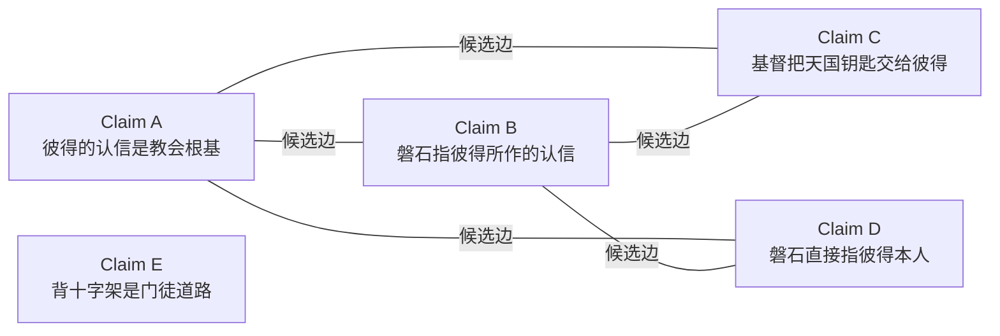
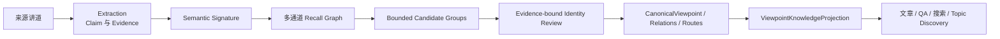
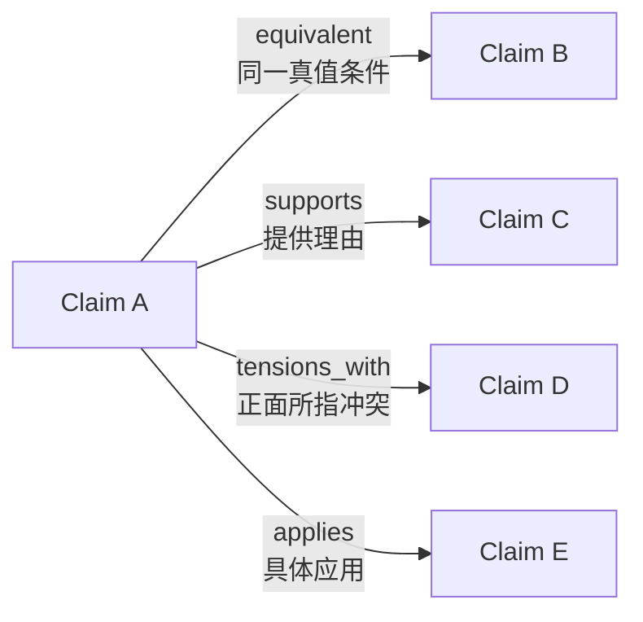
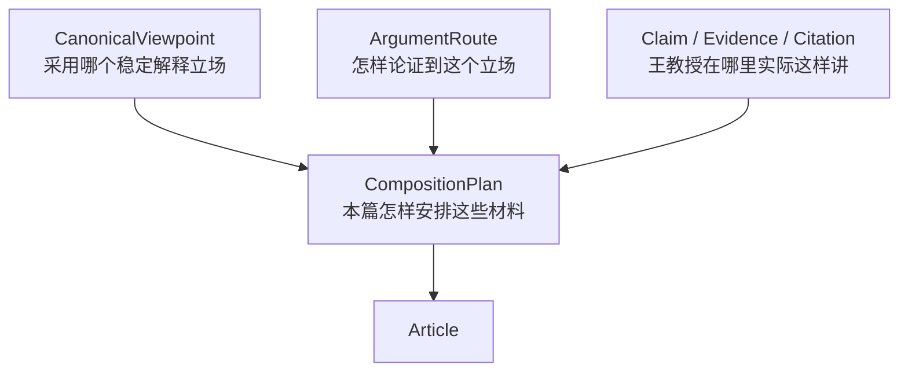

# 一种观点，许多讲道

> Canonical Viewpoint Registry 架构学习版  
> 状态：面向学习和讨论的伴读文档，不是运行时数据源，也不替代正式规范  
> 正式 authority：[Canonical Viewpoint Registry 与跨讲论证路径设计 v1](./canonical_viewpoint_registry_design_v1.md)  
> 追踪：GitHub issue #189

## 1. 先从一个常见的数据问题说起

假设一位读者在三个系统里留下了三条记录：

- 书店系统：王明，手机号 1234；
- 课程系统：Wang Ming，邮箱 wang@example.com；
- 奉献系统：王弟兄，手机号 1234。

三个系统保存的是三条 source records，但现实中可能只有一个人。Master Data Management（MDM）要解决的，不是删除三条原始记录，而是建立一个稳定的 master identity，并保存它与三条来源记录之间的 crosswalk。

王教授的讲道资料有相似的问题。一项释经判断可能在不同年份、不同讲道、不同经文背景中反复出现：

- 用词不同；
- 论证路线不同；
- 有时说得完整，有时只出现一个组成部分；
- 有时后来增加限定或应用；
- 有时两处材料之间存在尚未解决的张力。

如果每条讲道里的说法都只作为独立 `Claim` 保存，下游文章和问答就很难知道哪些是同一个稳定观点。反过来，如果把相似的 Claim 直接合并，又会丢掉原始语境、论证和差异。

因此，本平台采用 registry MDM：

> 保留每一条来源 Claim，同时在它们上方建立稳定的观点身份。

这个稳定身份就是 `CanonicalViewpoint`。

## 2. 为什么不是直接生成一篇“王教授神学总结”

一篇总结文章是某次写作的结果；`CanonicalViewpoint` 是可以被许多产品重复使用的主数据。

两者的生命周期不同：

| 对象 | 回答的问题 | 是否保留稳定身份 | 是否必须回到来源 |
|---|---|---:|---:|
| `Claim` | 王教授在这一处具体说了什么 | 是，来源局部 | 是 |
| `CanonicalViewpoint` | 多处说法是否属于同一个观点 | 是，跨来源 | 是 |
| `ArgumentRoute` | 王教授怎样论证到这个结论 | 是，跨来源路线 | 是 |
| 文章 | 这一次怎样向读者解释这些材料 | 不是主数据身份 | 是 |
| QA answer | 针对这个问题怎样作答 | 不是主数据身份 | 是 |

文章可以改写、扩写或重排，但不应每次重新发明“哪些 Claim 是同一个观点”。这项判断应在 registry 中完成一次、保存依据，然后被文章、QA 和搜索共同复用。

## 3. Registry MDM 在这里怎样对应

| 通用 MDM 概念 | Wang Knowledge Platform |
|---|---|
| source record | 来源局部 `Claim` |
| master identity | `CanonicalViewpoint` |
| crosswalk | `ViewpointClaimLink` |
| match candidate | `ViewpointIdentityCandidate` |
| match decision | `ViewpointIdentityDecision` |
| mastered attributes | `ViewpointRevision` 中的 core proposition 和 scope |
| source lineage | Claim → EvidenceStep → SourceFragment → Citation |
| stewardship | 自动复核、确定性验证和人工 exception review |

这里与传统客户 MDM 有一个关键差异：系统不从几条来源措辞中挑一条作为“surviving 原话”。`CanonicalViewpoint` 的 core proposition 是编辑归一化，必须明确标记为不是王教授逐字引文；原始措辞仍留在各自 Claim 和来源中。

## 4. 六个最重要的对象

### 4.1 Claim：来源局部断言

`Claim` 表示王教授在某一个来源语境中作出的具体主张。它必须能回到 EvidenceStep、原文片段和引用位置。

同一句话在另一篇讲道中再次出现，仍然是另一条 Claim，因为它属于另一个 source context。

### 4.2 Semantic Signature：便于比较的语义结构

自由文本很难稳定比较，所以系统为 Claim 生成结构化的 semantic signature，例如：

```yaml
subject: 磐石
predicate: 指向
object: 彼得所认信的基督与真理
polarity: affirmed
modality: asserted
scripture_scope:
  - Matt.16.18
conditions: []
population_scope: []
attribution_subject: professor
```

signature 的作用是把比较问题拆开：主体是否相同、正反是否相同、对象是否相同、范围和条件是否相同。

它不是最终观点，也不是自动生成的真理。模型可以提出 signature；程序检查字段和引用；正式的 viewpoint revision 仍需要语义审核。

### 4.3 Recall Graph：值得比较的候选网络

候选发现可能来自规则、embedding 或受限的大模型语义发现。三个通道的结果取并集，构成 recall graph。



图中的节点是 Claims，边的意思只有：

> 系统认为这两个 Claim 在语义上足够接近，值得交给 identity review 比较。

边不表示两个 Claim 已经是同一个观点。没有边也不表示它们一定不同，只表示当前召回策略没有把它们配成候选对。

规则、embedding 和模型在这一阶段都只有“提名权”，没有“归并权”。它们产生的是工作名单，不是主数据结论。

### 4.4 Candidate Group：一起审核的候选包

Recall graph 中相互连接的 Claims 可以被组织成 bounded candidate group，减少模型调用和人工阅读次数。

Candidate group 只回答：“哪些材料适合放在同一个审核 packet 里？”它不回答：“这些材料是不是一个观点？”

尤其不能把连通性当作等价关系：

```text
A 接近 B
B 接近 C
```

不能推出：

```text
A 与 C 是同一个观点
```

B 可能是一个范围较宽的复合 Claim，分别与 A、C 局部重叠。因此，每个拟议 member 都必须与拟议的 core proposition 单独比较。

### 4.5 CanonicalViewpoint：稳定的观点身份

通过 identity review 后，真值条件等价的 Claims 可以成为同一个 `CanonicalViewpoint` 的 members。

判断至少比较：

- subject；
- predicate 和 object；
- polarity；
- scripture、population 和 temporal scope；
- conditions；
- modality；
- professor 或 external-position attribution；
- 会改变真值条件的 qualification。

结论相似但范围、条件或正面所指不同，通常不是同一个 viewpoint。它们可能是 `extends`、`qualifies`、`applies`、`specializes` 或 `tensions_with`。

`CanonicalViewpoint` 也不是强制层级树。主题的 hierarchy 属于 `TopicNode`；观点之间则使用 typed graph，因为一个观点可以同时 specialize 一个观点、qualify 另一个观点，并与第三个观点形成 tension。

### 4.6 ArgumentRoute：到达同一结论的不同道路

两个 Claim 即使表达同一结论，也可能使用不同论证：

- 一篇讲道从希腊文语义出发；
- 一篇从上下文结构出发；
- 一篇从救赎历史出发。

这些 Claim 可以属于同一个 `CanonicalViewpoint`，但应保存为不同的 `ArgumentRoute`。每条 route 的实际证据仍由 source-local attestation 记录，不能把讲道 A 的前提、讲道 B 的推论和讲道 C 的结论拼成一条教授从未完整讲过的路线。

## 5. 完整处理流水线



### 阶段一：Extraction

先从每篇来源中提取 Claim、EvidenceStep、SourceFragment 和 Citation。Extraction layer 的 sentence ledger 防止源文本在抽取前静默消失。

Canonical Viewpoint layer 不替 extraction 修正遗漏，也不能把上游 candidate 自动升级为公开事实。

### 阶段二：Semantic Signature

模型把 Claim 的自由文本整理为可比较字段。程序验证：

- 输入 Claim 是否 exact-once；
- ID 和 revision 是否匹配；
- 输出字段是否合法；
- statement 和 source SHA 是否仍是同一版本；
- 失败项是否显式保留。

### 阶段三：Recall

系统并行使用多种信号寻找“可能值得比较”的 pair：

- 确定性规则：共享经文、兼容 topic terms、claim role、已有 reviewed relation；
- embedding：发现用词不同但含义接近的 Claim；
- bounded model discovery：在受大小限制的主题包中寻找规则和 embedding 可能漏掉的关系。

结果是带 channel provenance 的无损并集。任何单一通道未命中，都不能否决另一个通道找到的候选。

### 阶段四：Candidate grouping

Scheduler 将候选网络切成有 item/byte 上限的工作包。分组只是为了控制成本和上下文，不产生观点关系。

### 阶段五：Identity review

审核把 candidate group 中的 Claims 分为：



只有 `equivalent_full`，或具有稳定 component locator 的 `equivalent_component`，才能成为 identity-bearing member。其他关系必须保留为 typed relation 或 route evidence，不能为了提高重复次数而塞进同一观点。

### 阶段六：Apply master data

审核输出先形成可验证 ChangeSet。程序检查引用、revision、blocker、lineage、覆盖账本和质量报告。通过后才能写入 master data。

模型不分配 canonical ID，不直接写数据库，也不能批准自己的输出。

### 阶段七：Compile for consumers

下游不读取整个 registry，也不读取本设计文档。Compiler 按具体任务生成最小、SHA-bound 的 `ViewpointKnowledgeProjection`，包含：

- 被选择的 viewpoint revision；
- 实际 member Claims；
- 所需 ArgumentRoutes；
- qualifications、tensions 和 coverage disclosure；
- Evidence、Citation 与 dependency manifest；
- resolution ledger 和 quality report 的绑定。

## 6. 贯穿例子：太 16:18 的“彼得与磐石”

以下是架构示例，不在本文中宣布王教授最终 canonical 立场。

假设抽取层得到四条来源局部 Claim：

- Claim A：磐石指彼得本人；
- Claim B：彼得作为认信者和使徒代表构成磐石；
- Claim C：磐石不是彼得个人，而是彼得所认信的基督与真理；
- Claim D：磐石直接指基督。

因为它们共享太 16:18、彼得、磐石、认信等语义信号，规则或 embedding 很可能把它们放进同一 recall neighborhood。这是正确的：它们确实值得一起比较。

但 identity review 不能因此把四条都合并。可能的审核结果是：

- 两条“彼得本人是磐石”的不同措辞，若真值条件一致，可以成为同一 viewpoint 的 members；
- “彼得代表使徒群体”增加了 population/representative role，可能是 `extends`、`qualifies` 或独立 viewpoint；
- “磐石不是彼得个人”与正向命题 polarity 冲突，不能增加同一 viewpoint 的 recurrence；
- “磐石是彼得所认信的基督与真理”与“磐石直接指基督”可能彼此接近，但 object identity 是否相同仍需审核；
- 无法安全协调的正面解释应保留为 distinct viewpoints 和 `tensions_with`，而不是多数票合并。

这个例子说明了系统最重要的风险不对称：

> 错误拆成两个 viewpoint 以后还可以再 merge；错误合并会让真实的释经差异从所有下游产品中消失。

因此，设计在身份判断上宁可暂时保留两个候选，也不以相似度直接建立 canonical membership。

## 7. 为什么不把全部工作交给大模型

大模型很适合：

- 理解不同措辞；
- 生成 semantic signature；
- 发现跨词汇的语义近邻；
- 比较真值条件；
- 给出 relation proposal 和理由。

但大模型不适合独自负责：

- 证明 1,000 多条 Claim 是否一条都没漏；
- 保证同一输入重跑得到 byte-stable artifact；
- 检查每个 ID、revision 和 SHA 是否真实存在；
- 控制 candidate、packet 和费用上限；
- 保存 split、merge、撤销和影响传播历史；
- 防止一个模型同时提出并批准自己的结论。

因此职责划分是：

> 大模型负责语义判断；程序负责记账、验证、限流和守门。

这不是削弱大模型，而是把它用在最有价值、也最需要语言理解的地方。

## 8. 怎样保证数据质量

系统使用两本完整性账：

1. Extraction sentence ledger：源文本每句话是否被表示、明确排除或尚未处理；
2. `ViewpointResolutionLedger`：进入观点解析的每个 Claim revision 最终成为 member、新 viewpoint candidate、typed related disposition，还是被明确 deferred/ineligible。

第二本账的关键是 exact-once：输入 manifest 中的每条 Claim 必须恰好有一行，不能因为难以分类就从结果中消失。

此外，质量不是一个可以互相补偿的总分。以下维度分别过关：

- provenance integrity；
- source maturity；
- resolution coverage；
- identity precision；
- candidate recall；
- route fidelity；
- temporal correctness；
- consumer projection integrity。

例如，来源引用全部正确，不能抵消一次错误 merge；召回覆盖很好，也不能抵消 route 跨来源拼接。任一适用维度失败，就阻止相应 approval 或 consumer eligibility。

## 9. 怎样减少单人编辑的负担

目标不是让编辑逐条审几万条 pair，而是让自动化先完成大多数低风险工作，只把真正影响身份边界的 exception 交给人。

设计采用：

- 以 candidate group 为审核单位，不逐 pair 弹窗；
- proposal 与独立 semantic review 分离；
- 低风险、双重判断一致且确定性 gates 全过时，可明确标记为 `system_approved`；
- 正面所指冲突、scope/condition 分歧、component 歧义、split/merge/supersedes 等进入人工 exception queue；
- 一次批准 identity boundary，后续文章、QA 和搜索重复使用；
- 新增同类 member 时只审核 delta，不重读整个 viewpoint；
- 未被产品需要的 internal candidate 可以懒审核；
- 用风险抽样监测自动决定，不要求事前逐条人工确认。

`system_approved` 不能显示成 `human_approved`。自动化减少的是重复劳动，不是审计记录。

## 10. 为什么这个方案可以扩展

系统区分两种运行模式。

### Bootstrap：第一次建库

```text
pinned historical Claims
→ rule ∪ embedding ∪ bounded-model recall
→ bounded Claim-to-Claim review
→ initial CanonicalViewpoints
```

目标复杂度是 `O(N × K)`，其中 K 是每个 focal Claim 的候选硬上限。系统不做所有 Claim 的全对全模型判断。

### Incremental：以后加入新讲道

```text
new Claim
→ retrieve top-K active CanonicalViewpoints
→ compare with viewpoint core and representative members
→ ambiguity 时才下钻更多 Claim / Evidence / Route
→ delta ChangeSet
```

日常成本随新增 Claim 数 `ΔN` 增长，而不是每加入一篇讲道就重跑整个历史库。定期 global audit 可以检查 near-duplicate、过宽 viewpoint 和 split/merge 风险，但不阻塞日常增量入库。

## 11. 下游文章怎样使用 CanonicalViewpoint

释经文章需要同时使用三种知识：



`CanonicalViewpoint` 不能替代 Claim grounding。文章可以用 canonical proposition 组织段落，但每个实际观点段落仍须绑定来源局部 Claim 和 Evidence。

这可以避免两个相反错误：

- 只读 Claim：每篇文章重新判断一次观点身份，写法不一致；
- 只读 CanonicalViewpoint：文章有结论却没有教授原声和论证依据。

正确做法是：观点提供一致性，route 提供推理，Claim/Evidence 提供可核验来源，CompositionPlan 决定本篇用途。

## 12. QA 与智能搜索怎样使用

智能搜索和 QA 可以共享 embedding infrastructure，但不应把所有对象塞进一个无类型向量库。建议分层检索：

```text
用户问题
→ CanonicalViewpoint index：找到稳定观点
→ Claim / Evidence index：找到可引用来源
→ ArgumentRoute index：回答“为什么”
→ ViewpointKnowledgeProjection compiler
→ 带引用和 dependency SHA 的答案或搜索卡
```

Embedding score 只用于召回和排序，不建立 registry relation。最终公开引用仍来自 source-local Evidence、Fragment 和 Citation。

## 13. UI 应该让人看到什么

主数据 UI 不应把全库画成一团 graph hairball。一个实用的 viewpoint detail 页面应分层展示：

1. 顶部：canonical proposition、approval、coverage 和 quality；
2. Members：哪些 Claims 被判定为同一观点；
3. Related Claims：supports、extends、qualifies、applies；
4. Routes：有哪些不同论证路线和各自来源 attestation；
5. Tensions：哪些观点不能静默调和；
6. Sources：Claim → Evidence → Citation → media locator；
7. History：revision、merge、split 和 snapshot；
8. Impact：哪些文章、QA 或搜索卡依赖它。

第一版只读。人工决定通过 exception inbox 形成 ChangeSet proposal，再由服务端验证和 apply；浏览器不直接修改 master records。

## 14. 用一个比喻收尾

可以把整个系统想成一座图书馆：

- Claim 是一本书中的一张原始卡片；
- Semantic Signature 是卡片上的结构化索引字段；
- Recall Graph 是馆员桌上的“可能相关卡片”工作清单；
- Candidate Group 是一次拿来共同核对的卡片包；
- CanonicalViewpoint 是跨多本书的稳定主题身份；
- ArgumentRoute 是作者到达同一结论所走的不同论证路径；
- ViewpointKnowledgeProjection 是为某位读者、某篇文章或某个问题临时编好的借阅包。

馆员可以把许多卡片登记到同一个主题，却不会把原书剪碎后粘成一本“标准原著”。这正是 registry MDM 在王教授知识平台中的意义：

> 统一观点身份，但永远保留来源、差异、论证和历史。

