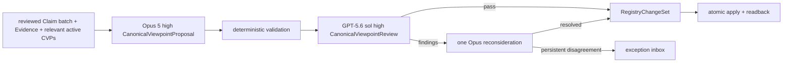
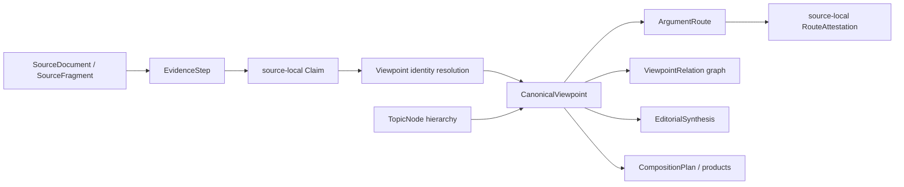
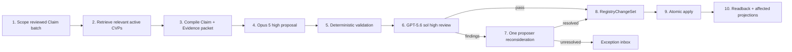
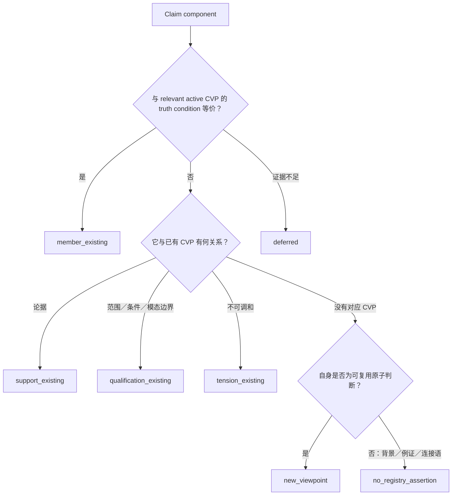
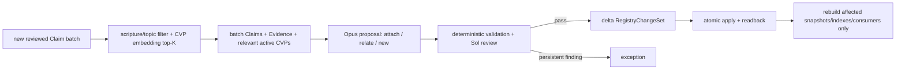
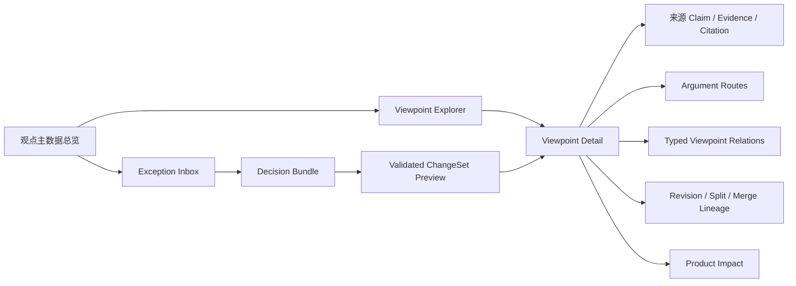

# Canonical Viewpoint Registry 与跨讲论证路径设计 v1

> 状态：Canonical Viewpoint layer 的规范性 architecture authority；基础 schema、projection、只读 UI 与首个太 16:18 master record 已实现。#204 以实际 POC 将后续 batch resolution 的规范主路径简化为 extraction-shaped proposal → deterministic validation → independent review → ChangeSet；旧 recall/signature/atomic promotion artifacts 继续作为历史诊断和兼容输入，不再是每批必经的领域状态。本文件不授权内容生成或部署。
> 版本：v1
> 日期：2026-08-23
> 追踪：GitHub issue #165（WKP-F02.7）、#181（WKP-F02.15 scalability revision）、#204（WKP-F02.21 simplified batch resolution）
> 权威边界：PostgreSQL 继续是 authoring authority；来源局部 `Claim`、`EvidenceStep`、`SourceFragment` 与 Canonical Citation 继续是可追溯事实的权威。

## 1. 决策摘要

“整理王教授释经神学思想”的中心知识操作，是从两百多篇来源局部主张中，解析并持续维护王教授反复表达的观点身份。这个身份层采用 provenance-preserving registry MDM，而不是把来源主张合并成一条新的“黄金原文”。

本设计作出以下决定：

1. `CanonicalViewpoint` 是新的 canonical identity，不是 `EditorialSynthesis` subtype。
2. `CanonicalViewpoint` 本身不建立强制单父层级；它是稳定、opaque 的观点身份，观点之间通过 typed graph 相连。
3. `TopicNode` 继续拥有主题层级；`CanonicalViewpoint` 回答“教授持什么观点”，`TopicNode` 回答“这个观点属于什么研究问题”。
4. 来源局部 `Claim` 永不因观点归并而删除、覆盖或静默熔化。registry 只保存 identity crosswalk、审核决定和 lineage。
5. canonical core proposition 是编辑对多个来源主张的规范化措辞，必须标为 `editorial_normalization`，不得冒充教授逐字原话。
6. 同一结论、同一推理表示为同一 viewpoint 下同一 `ArgumentRoute` 的多个 source-local attestations；同一结论、不同推理表示为同一 viewpoint 下不同 routes。
7. `duplicate` 连通分量只能生成 identity candidate，不能用 union-find 自动建立 canonical membership；`duplicate` 不是可安全传递的等价闭包。
8. 全部篇数、来源数、出现次数、路线数与经文数由结构机械计算，不在自然语言 summary 中维护另一份数字。
9. corpus universe、详细抽取覆盖和观点审核覆盖必须分开记录。当前规划语境为 205+ 篇全语料、最新 20 篇选择中 19 篇成功应用并组成受控详细 cohort、核心九篇拥有冻结的跨讲关系与 Topic Discovery artifact；这些数字不可写死在 viewpoint identity 上，失败的第 20 项不进入 Claim 分母。
10. 每个生产 batch 使用一个 evidence-bound `CanonicalViewpointProposal`、一个独立 `CanonicalViewpointReview` 与一个原子 `RegistryChangeSet`。模型 proposal 不能批准自己；确定性 validator 与独立 reviewer 通过后，低风险结果才可标为 `system_approved`。任何自动批准不得冒充 `human_approved`。
11. 完整性分母是本轮输入 manifest 中的 source-bound Claim revisions。每个 Claim 及其被提议使用的精确 component 必须在 proposal 中有 disposition；coverage、quality、readback 与 SHA 是这三个 artifacts 的 checks／derived reports，不再成为彼此重新绑定的业务阶段。
12. Canonical master data 必须有 `/admin/wang` 内的可视化工作台。默认体验是只读浏览已编译的 identity、route、relation、coverage、quality 与 lineage；人工只从 exception inbox 进入需要判断的 decision bundle。UI 不直接写 PostgreSQL、不从原始 records 临时重算观点，也不把全库绘成无法审核的 graph hairball。
13. `bootstrap` 与 `incremental` 使用同一 batch contract。bootstrap 给 proposer 一个经文／主题一致的 Claim batch 和当前可用的 relevant Registry context；incremental 另外用 scripture scope 与 embedding 取回少量 active CanonicalViewpoints。两种模式都允许在同一次 proposal 中匹配既有 viewpoint、提出新 viewpoint 和保留未决项。
14. 现有 CanonicalViewpoints 必须传给增量 proposer，但它们是开放参考集，不是封闭 taxonomy。proposal schema 必须保留 `new_viewpoint` 出口，并对每个输入 Claim exact-once 交代 `member / support / qualification / tension / new_viewpoint / no_registry_assertion / deferred`。
15. embedding、规则 blocking、SemanticSignature 与 RecallGraph 只负责检索、校准、漏项审计或历史诊断；它们不是 identity evidence，也不是每批生产所需的 durable stage。正常成本随新增 Claims 与 retrieved viewpoints 近似线性增长；定期 blind/global audit 不阻塞日常 ingest。
16. 生产模型策略固定为 Claude Subscription `claude-opus-5` high proposer 与 Codex Subscription `gpt-5.6-sol` high independent reviewer。模型、provider、effort、prompt 或 schema 改变必须形成新 generation fingerprint；不得静默降级或回退 API billing。
17. reviewer 读取 proposal、相关 active viewpoint boundary、精确 Claim components 与必要 source evidence，专门检查 truth-condition identity、polarity、modality、scope、attribution、novelty 和 typed role。reviewer 不是第二次全库 discovery。
18. reviewer findings 只允许触发一次 proposer reconsideration；持续分歧、split/merge/supersedes、无法验证的证据或实质 scope 冲突进入 exception。不得增加 promotion proposal、finalization bundle、score-gap review 或重复 full review 来追求表面一致。

推荐的整体名称是 **Canonical Viewpoint Registry**；中文可称“规范观点注册表”。这里的 canonical 表示平台确认多个来源断言属于同一观点身份，不表示平台裁定该神学观点正确。

### 1.1 规范范围、优先级与下游读取规则

本文件是所有新增或修改 CanonicalViewpoint、ArgumentRoute、观点关系、观点覆盖统计及其产品消费行为的 architecture authority。以下工作在行动前必须读本文件并遵守其对象边界：

- 王教授释经神学思想整理；
- 使用跨讲 canonical viewpoint 的释经文章与专题文章；
- 使用 viewpoint 聚合或 route 展开的 QA、搜索与跨时间比较；
- Topic Discovery、CompositionPlan 或知识 packet 对 viewpoint 层的接入；
- viewpoint registry schema、审核 UI、Active Snapshot 与影响传播实现。

它与既有规范的职责不重叠：

- 来源、Claim、EvidenceStep 与 Citation 的权威规则仍由 shared knowledge、来源对账和 PostgreSQL authoring store 规范决定；
- Matthew exposition 的写作状态机、reviewer-call invariant、Program Audit 与 publication decision 仍由 Matthew authoring workflow 决定；
- QA 的答案完整度、逐项引用与诊断流程仍由 QA 规范决定；
- 本文件新增的约束只决定这些流程怎样读取、归属、版本绑定和呈现 canonical viewpoint。

实现者与负责构造 packet 的 agent 必须读本文件；运行时模型不读取这份完整 architecture 文档。实际消费观点知识的 Composition、Author、Revision 或 QA 角色只接收由程序按本文件编译、受大小和任务范围约束的 `ViewpointKnowledgeProjection` 切片。Editorial Reviewer 是否接收任何派生字段仍由其独立 packet contract 决定；Matthew EditorialReviewPacket 与 FinalDeltaReviewPacket 不接收 knowledge projection。Markdown 文档不是 runtime data source。

### 1.2 #204 简化决策的优先级

本节及第 6.2、10.2、11.1、14 节在 batch resolution 行为上优先于本文件较早记录的实验路径。旧文件和数据库对象不因设计更新而删除；但下列项目不得再被实现者解释为生产 batch 的 mandatory stage：

- `ClaimSemanticSignatureCandidate` 全量生成；
- rule／Claim embedding／signature embedding 的 lossless union；
- Claim-pair 或有向 pair scheduler；
- RecallGraph closure；
- durable `PropositionUnit` master table；
- promotion proposal 与 finalization bundle 分离；
- coverage／ledger／quality artifacts 为了相邻 SHA 而反复 re-bind；
- blind reviewer 在不知道 proposal 的情况下重新做一遍完整 discovery。

这些 artifacts 仍可用于解释 #187/#194 的历史结果、构造 golden fixture、做 periodic blind audit 或帮助检索；任何后续删除、迁移或兼容代码调整必须另开实现 ticket。本卡只改变规范 workflow，不静默改动现有 PostgreSQL records。

新的领域状态机只有三个 durable semantic artifacts：

1. `CanonicalViewpointProposal`：Opus 5 对一个完整 batch 的语义提案；
2. `CanonicalViewpointReview`：GPT-5.6 sol 对 proposal boundary 与 evidence 的独立审核；
3. `RegistryChangeSet`：程序根据通过的 proposal/review 生成的唯一可 apply 变更。

Evidence packet、retrieval result、budget、schema validation、coverage report、quality report、impact preview、transaction receipt 与 readback 都可以持久保存以便审计，但它们是上述 artifacts 的输入、checks 或派生报告，不是让 operator 逐站推动的领域状态。



该流程与 extraction layer 同构：上游 source-bound records 进入模型 proposal，程序验证引用和覆盖，独立模型审核语义质量，只有通过的 package 才写 PostgreSQL。CVP layer 不重做 extraction；只有 reviewer 遇到 modality、复合 Claim、指涉、范围或证据不足时，才沿 EvidenceStep 调出同一来源 revision 的精确 SourceFragment。

## 2. 问题与覆盖边界

### 2.1 三种覆盖范围不得混用

当前平台有三个不同的资料范围：

| 范围 | 当前含义 | 可作什么结论 |
|---|---|---|
| source universe | 平台两百多篇来源；其中 `CORPUS-SURVEY-205-V1` 是 205 篇的封闭历史普查基线，后来来源不得写回该基线 | 当前 source-universe manifest 决定 registry 本轮理论覆盖范围；survey claims 仍是 candidate，不是已审核 Claim |
| detailed extraction coverage | 最新显式选择包含 20 项；其中 19 篇成功应用并组成当前受控 cohort，失败项明确排除 | 19 篇的 pinned Claim revisions 可为观点匹配提供来源局部 Claim；失败项、旧世代与其他 active source 不进入本轮分母 |
| frozen viewpoint POC fixture | 核心九篇 artifact：158 条 Claim、67 条经复核跨讲关系、6 个母题、13 个子专题、55 个篇章段落 | 可做只读 schema 映射与回归；不代表当前全覆盖，也不得推广为 205+ 篇结论 |

“最新 20 项选择、19 篇成功 cohort”是当前运行事实，不是从 staging 文件数推导的权威统计。同一来源可能存在于多个 research batch 或 generation；实现必须由 SHA-bound selection、实际应用的 KCS ChangeSet 与 Claim manifest 计算覆盖，而不是扫描目录或读取 batch 名称。失败项只保留在 selection/discrepancy 记录中，不进入 candidate generation 或 ResolutionLedger Claim 分母。

205 篇 corpus survey 是一次性、已关闭的历史普查基线，不是会随新讲道变化的 source-universe registry。它不能因为 viewpoint registry 建立而被刷新、滚动生成 V2，survey candidate 也不能直接成为 approved viewpoint member。survey 只能帮助候选召回和覆盖缺口说明；当前全平台来源范围另由不可变的 source-universe manifest snapshot 表示。

### 2.2 现有两层为何不够

现有流程已经保留：

- 来源局部 `Claim` 与 occurrence；
- `EvidenceStep`、经文与精确来源；
- `duplicate / supports / extends / qualifies / contrasts / supersedes / unrelated` 跨讲关系；
- `TopicNode`、母题、子专题和篇章段落候选；
- `EditorialSynthesis` 对跨来源模式的编辑描述。

但仍缺少一个稳定对象回答：

- 哪些来源 Claim 是同一个观点的不同表达；
- 同一观点在多少独立来源、哪些时期出现；
- 同一结论有几条不同论证路线；
- 哪些限定、应用和张力不应被误合并为重复；
- 新讲道加入后应匹配既有身份，还是创建新身份；
- 错误归并怎样拆分而不破坏历史产品。

`EditorialSynthesisRecord` 当前只有 synthesis identity、类型、标题、描述、claim IDs 与 corpus scope。它适合表达编辑发现的模式或文章说明，不足以承担稳定 identity、member decision、argument route、时间 lineage、split/merge 与 source-local attestation。

## 3. Registry MDM 架构

### 3.1 与 MDM Registry 的对应

| Registry MDM 概念 | 本平台对象 |
|---|---|
| master identity | `CanonicalViewpoint` |
| source record | 来源局部 `Claim` |
| crosswalk | `ViewpointClaimLink` |
| match candidate | `ViewpointIdentityCandidate` |
| match/merge decision | `ViewpointIdentityDecision` |
| mastered attributes | 当前 approved `ViewpointRevision` 的 core proposition 与 scope |
| source lineage | Claim → EvidenceStep → SourceFragment → Citation |
| survivorship | 哪些 approved member links 支持当前 revision |
| stewardship | 独立复核、风险分级、低风险 system approval、人工 exception、split/merge |
| hierarchy management | `TopicNode`，不是 viewpoint parent pointer |
| temporal history | revision、occurrence timeline、successor relations |

传统 MDM 常为姓名或地址选择 surviving value；这里不能把任一来源 Claim 的措辞静默提升为“教授标准原话”。registry 的 mastered proposition 是审核过的编辑归一化文字，来源 Claim 全部保留。

### 3.2 逻辑分层



各层职责：

- `Claim`：教授在一个来源语境中具体作出的主张。
- `CanonicalViewpoint`：跨来源的观点身份，不储存逐字引文。
- `ArgumentRoute`：到达该观点的一种可区分推理骨架。
- `RouteAttestation`：某一个来源中实际出现的完整或部分论证实例。
- `ViewpointRelation`：观点之间的扩展、限定、应用、蕴含、张力与后期修正。
- `TopicNode`：主题分类及层级导航。
- `EditorialSynthesis`：编辑如何解释、命名和组织一个或多个观点。
- `CompositionPlan`：具体文章或产品怎样呈现观点与证据。

### 3.3 CanonicalViewpoint 不采用强制树

观点之间不是单父树。一个较具体观点可能同时：

- specialize 一个较广观点；
- qualify 另一个观点；
- apply 到一个具体伦理问题；
- 归入多个 TopicNode；
- 与另一时期的材料形成 tension。

因此 `CanonicalViewpoint` 不设 canonical `parent_viewpoint_id`。UI 可以从 typed graph 生成树状阅读投影，但该投影是可重建导航，不是 identity authority。

## 4. 对象语义与归属边界

| 对象 | identity owner | reader-visible wording owner | 可否表示教授自己的观点 | 可否表示外部立场 | 可否建立层级 |
|---|---|---|---|---|---|
| `Claim` | extraction/source layer | 来源局部整理，受原文约束 | 是 | 仅在 attribution 明确时；通常应使用 PositionNode | 否 |
| `CanonicalViewpoint` | viewpoint registry | 编辑规范化，必须显式标记 | 是，表示被来源支持的教授观点身份 | 否 | 否，使用 graph |
| `PositionNode` | argument layer | 来源所呈现的外部立场 | 否 | 是 | 否 |
| `TopicNode` | Canonical Repository | 编辑主题命名 | 否，它是研究主题身份 | 否 | 是 |
| `EditorialSynthesis` | editorial layer | 编辑 | 只能说明它综合了教授哪些观点，不能冒充教授断言 | 可比较多个立场 | 可由产品组织，但不拥有 canonical topic hierarchy |
| `ArgumentRoute` | viewpoint registry | 编辑规范化 route signature | 表示教授实际使用过的推理类型，须有 source-local attestation | 不用于保存外部立场本身 | 否 |

### 4.1 教授归属与编辑措辞必须同时保存

一个 viewpoint 可以归属于教授，同时它的 canonical wording 仍属于编辑归一化：

```json
{
  "attribution_subject": "professor",
  "representation_kind": "editorial_normalization_of_source_claims",
  "not_a_direct_quote": true
}
```

对外表达必须区分：

- 来源 Claim 或精确引文：“王教授在该讲中指出……”；
- canonical wording：“本项目将这些来源主张归纳为……”；
- 尚未批准的 pattern：“目前候选材料可能显示……”；
- `EditorialSynthesis`：“本项目根据当前覆盖范围作出的编辑综合……”。

### 4.2 什么可以成为 viewpoint member

只有命题身份相同的 Claim 或 Claim 内明确可定位的命题成分，才是 identity-bearing member。支持、扩展、限定、应用和张力不能为了增加 recurrence 而算作成员。

建议区分：

| link type | 含义 | 计入 member claim count | 计入 occurrence count |
|---|---|---:|---:|
| `equivalent_full` | 整条 Claim 与 core proposition 真值条件等价 | 是 | 是 |
| `equivalent_component` | 复合 Claim 内一个明确成分与 viewpoint 等价；必须保存 component locator | 是 | 是 |
| `supports` | 为 viewpoint 提供论据，但结论不是同一命题 | 否 | 否 |
| `extends` | 保留核心并增加会改变整条 Claim 真值条件的内容 | 否 | 否 |
| `qualifies` | 增加条件、范围或反误解边界 | 否 | 否 |
| `applies` | 将观点用于具体对象或行动 | 否 | 否 |
| `tension_evidence` | 为未解决张力提供材料 | 否 | 否 |
| `superseding_evidence` | 为后期明确修正提供材料 | 否 | 否 |

`equivalent_component` 解决现有 Claim 有时包含多个命题的问题，但必须引用结构化 component locator。不得仅凭模型摘要声称“其中包含同一观点”。若无法稳定定位，应先保留为 `extends` 或待上游原子化，不得强行成为 member。

## 5. 最小 schema proposal

第一版继续使用 PostgreSQL 的关系骨架加经 Pydantic 验证的 JSONB。以下是逻辑 schema；实际实现可将 identity 与 revision 保存在同一 collection 的 object versions 中，但 API 必须保持二者语义可区分。

### 5.1 CoverageSnapshot

CoverageSnapshot 是不可变 manifest，说明一次观点分析看过哪些来源 revision。它不决定 viewpoint identity。

```json
{
  "coverage_snapshot_id": "CVS-opaque",
  "schema_version": "wang_viewpoint_coverage_snapshot_v1",
  "historical_survey_baseline_id": "CORPUS-SURVEY-205-V1",
  "source_universe_manifest_id": "SUM-opaque",
  "source_universe_manifest_sha256": "...",
  "sources": [
    {
      "source_id": "SRC-...",
      "source_revision_id": "SRCREV-...",
      "source_sha256": "...",
      "roles": [
        "source_universe",
        "detailed_extraction",
        "viewpoint_reviewed"
      ]
    }
  ],
  "sources_sha256": "...",
  "coverage_status": "partial",
  "created_at": "...",
  "review_status": "system_verified",
  "visibility": "internal",
  "revision": 1
}
```

`roles` 第一版只允许 `source_universe`、`detailed_extraction`、`viewpoint_reviewed`；一个 source revision 可以同时拥有多个 roles。`sources` 按 `source_revision_id` 排序后计算 `sources_sha256`，同一个 `source_id` 在同一 snapshot 中最多出现一个 current revision。

机械派生而不存双份真相的字段包括：`source_universe_count`、`historical_survey_baseline_count`、`detailed_source_count` 与 `viewpoint_reviewed_source_count`。若 API 返回这些数字，必须同时返回计算所用 snapshot ID。`historical_survey_baseline_count` 不因后来来源加入而改变；`source_universe_count` 由拥有 `source_universe` role 的 entries 计算。

#### 5.1.1 ViewpointResolutionLedger

CoverageSnapshot 回答“本轮看过哪些 source revisions”，但不能单独证明其中的 Claim 都已处理。观点解析必须另建不可变的 `ViewpointResolutionLedger`，其分母来自 source-bound、revision-pinned 的输入 Claim manifest，不得从已经生成的 viewpoint、member link 或 relation 反推。

```json
{
  "resolution_ledger_id": "VRL-opaque",
  "schema_version": "wang_viewpoint_resolution_ledger_v1",
  "coverage_snapshot_id": "CVS-opaque",
  "input_claim_manifest_sha256": "...",
  "eligibility_policy_version": "viewpoint_source_eligibility_v1",
  "candidate_blocking_version": "viewpoint_candidate_blocking_v1",
  "rows": [
    {
      "claim_id": "DK-...-CL...",
      "pinned_claim_revision": 2,
      "claim_revision_sha256": "...",
      "processing_status": "resolved",
      "resolution_kind": "member_existing",
      "primary_viewpoint_id": "CV-opaque",
      "new_viewpoint_candidate_id": null,
      "viewpoint_claim_link_id": "VCL-opaque",
      "secondary_link_ids": ["VREL-opaque"],
      "source_eligibility_reason_code": null,
      "resolution_reason_code": null,
      "blocker_codes": [],
      "decision_id": "VID-opaque"
    }
  ],
  "statistics": {
    "input_claim_count": 1,
    "resolved_count": 1,
    "source_ineligible_count": 0,
    "deferred_count": 0,
    "unprocessed_count": 0
  },
  "coverage_status": "partial",
  "build_fingerprint_sha256": "...",
  "artifact_sha256": "..."
}
```

`processing_status` 第一版只允许：

- `resolved`：已形成明确 resolution，必须有 decision；
- `source_ineligible`：按版本化 source eligibility policy 排除，例如并非教授立场、非断言或上游证据不合格；必须有 closed reason code，不能用自由文本把难题排除；
- `deferred`：已经检查，但存在明确 blocker；必须有 blocker code 和可重试依赖；
- `unprocessed`：尚未回答，不是语义判断。

当 `processing_status=resolved` 时，`resolution_kind` 只允许：

- `member_existing`：成为现有 viewpoint 的 identity-bearing member；
- `new_viewpoint_candidate`：没有等价 identity，建立单来源或多来源 candidate；
- `related_only`：当前 Claim 只支持、扩展、限定、应用或形成张力，没有资格成为该目标 viewpoint 的 member；必须引用 typed link 和该 disposition 的 decision，不能只因“不像 member”便停止处理；
- `no_registry_assertion`：Claim 经审核后不表达可注册命题；只允许版本化 closed reason code，不允许把“暂时不知道如何归类”写成此项。

字段条件必须由 schema 强制：`member_existing` 要求 `primary_viewpoint_id` 与 `viewpoint_claim_link_id`；`new_viewpoint_candidate` 要求稳定的 `new_viewpoint_candidate_id`；`related_only` 要求至少一个 typed `secondary_link_id`；`no_registry_assertion` 要求 `resolution_reason_code`。非 `resolved` row 的 `resolution_kind` 和 identity/link fields 必须为空，不能一边声称 deferred，一边让下游把它当 member 使用。

一个 Claim 可以是某一 viewpoint 的 member，同时与其他 viewpoints 有多个 typed secondary links；因此“恰好一个”约束作用于 ledger row 和 primary resolution，不删除合法的多边关系。一个完整 Claim revision 仍最多拥有一个 active `equivalent_full` membership。

Ledger statistics 必须从 rows 机械重算。`coverage_status=complete` 要求：input manifest 中每个 Claim revision 恰好出现一次、无额外 Claim、`unprocessed_count=0`，且所有 `resolved` references 可解析。`deferred` 可以存在于完整的“处理覆盖”中，但任何下游 projection 必须显式携带其 blocker；它不计为 identity resolved。`source_ineligible` 只表示不进入观点解析，不表示来源句子可从 extraction sentence ledger 消失。

#### 5.1.2 ViewpointQualityReport

每次 approval 或 consumer projection 都必须绑定一个程序生成的逐维质量报告。报告可以引用语义审核结果，但自身由 validator 根据 artifacts 重算，模型不能直接宣布通过：

```json
{
  "quality_report_id": "VQR-opaque",
  "schema_version": "wang_viewpoint_quality_report_v1",
  "scope_kind": "consumer_projection",
  "scope_ids": ["VKP-opaque"],
  "coverage_snapshot_id": "CVS-opaque",
  "resolution_ledger_id": "VRL-opaque",
  "input_artifact_sha256s": ["..."],
  "dimensions": [
    {
      "dimension": "resolution_coverage",
      "applicable": true,
      "minimum_policy": "exact_once_and_scope_unprocessed_zero",
      "observed": {
        "missing_rows": 0,
        "duplicate_rows": 0,
        "scope_unprocessed": 0
      },
      "status": "pass",
      "evidence_artifact_sha256s": ["..."]
    }
  ],
  "hard_failures": [],
  "eligibility_decision": "pass",
  "validator_version": "...",
  "build_fingerprint_sha256": "...",
  "artifact_sha256": "..."
}
```

`scope_kind` 至少支持 `identity_decision`、`registry_snapshot` 与 `consumer_projection`。每个 scope 只运行适用维度，但必须明确记录 `applicable=false` 及原因，不能删除难以计算的维度。`eligibility_decision` 只由逐维 minimum 与 hard failures 派生，可为 `pass / fail / partial_internal_only`；它不是总分阈值。

为避免 projection 与 quality report 的 SHA 循环，compiler 先生成不含 `quality_report_id`、`quality_report_sha256` 和最终 `projection_sha256` 的 canonical projection payload；quality validator 对该 payload SHA 及其 dependencies 生成报告；compiler 最后把报告 ID/SHA 装入 envelope 并计算最终 projection SHA。任何 payload 字段改变都必须重跑质量报告。

### 5.2 CanonicalViewpoint identity

```json
{
  "viewpoint_id": "CV-opaque",
  "schema_version": "wang_canonical_viewpoint_v1",
  "current_revision_id": "CVR-opaque",
  "identity_status": "active",
  "created_from_candidate_id": "VIC-...",
  "redirect_to_viewpoint_id": null,
  "review_status": "human_approved",
  "visibility": "internal",
  "revision": 1
}
```

规则：

- ID 不包含标题、topic、batch、Claim 集合或日期；
- 标题和 core proposition 改写不改变 identity；
- substantive truth-condition change 不能作为普通文字 revision 偷渡；
- merge 后 losing identity 可 redirect，但历史版本必须仍可解析；
- split 后原 identity 不得被悄悄重新定义为其中一个 successor。

### 5.3 ViewpointRevision

```json
{
  "viewpoint_revision_id": "CVR-opaque",
  "viewpoint_id": "CV-opaque",
  "revision_number": 3,
  "core_proposition": "...",
  "proposition_signature": {
    "subject": "...",
    "predicate": "...",
    "object": "...",
    "polarity": "affirmed",
    "modality": "asserted",
    "temporal_scope": ["..."],
    "conditions": ["..."],
    "population_scope": ["..."]
  },
  "attribution_subject": "professor",
  "representation_kind": "editorial_normalization_of_source_claims",
  "not_a_direct_quote": true,
  "scope": {
    "scripture_scope": ["..."],
    "audience_scope": ["..."],
    "historical_scope": ["..."]
  },
  "provenance": {
    "basis_identity_decision_ids": ["VID-..."],
    "review_artifact_sha256": "..."
  },
  "review_status": "human_approved",
  "approved_by": "...",
  "approved_at": "...",
  "supersedes_revision_id": "CVR-...",
  "revision": 3
}
```

`proposition_signature` 是审核和候选匹配的结构化辅助，不是从文本自动计算出的真理。它与 core proposition 必须在同一 review decision 中一起批准。

`ViewpointRevision` 只保存观点的语义与经审核措辞，不保存当前 member links、relations、routes 或 coverage。新增来源若没有改变 core proposition、scope 或 proposition signature，不产生新的 semantic revision。

措辞变体默认由 member Claim 的原 statement/title 派生，不复制进 revision。只有不对应单一 Claim 的受控 alias 才保存在 `editorial_aliases`，并须标注编辑来源。

### 5.4 ViewpointClaimLink

```json
{
  "viewpoint_claim_link_id": "VCL-opaque",
  "viewpoint_id": "CV-opaque",
  "validated_against_viewpoint_revision_id": "CVR-opaque",
  "claim_id": "DK-...-CL...",
  "pinned_claim_revision": 2,
  "link_type": "equivalent_full",
  "component_locator": null,
  "supporting_relation_ids": ["XSR-..."],
  "occurrence_refs": ["OCC-..."],
  "decision_id": "VID-...",
  "effective_state": "active",
  "review_status": "human_approved",
  "revision": 1
}
```

`component_locator` 用于 `equivalent_component`，至少包含可验证的 statement component、source Claim SHA 及其在 Claim 结构中的稳定定位。仅保存一段模型 summary 不合格。

Claim link 属于稳定 viewpoint identity；`validated_against_viewpoint_revision_id` 记录它最后针对哪个 semantic revision 通过审核。新的 semantic revision 若改变 truth conditions，所有 active member links 必须 invalidated 或重新验证；仅产生新 registry snapshot 不复制 link。

### 5.5 ViewpointOccurrenceRef

当前 occurrence 嵌在 Claim 内，尚无一等稳定 ID。迁移期可机械生成引用键：

```text
OCC = SHA256(
  claim_id,
  pinned_claim_revision,
  source_id or transcript_id,
  sorted(paragraph_key, evidence_step_id, media_time)
)
```

引用记录只保存 locator 与 Claim revision，不复制来源文字：

```json
{
  "occurrence_ref_id": "OCC-opaque",
  "claim_id": "DK-...-CL...",
  "pinned_claim_revision": 2,
  "source_id": "SRC-...",
  "transcript_id": "...",
  "anchor_refs": [
    {
      "paragraph_key": "S0005",
      "evidence_step_id": "DK-...-E011",
      "media_time": 1369
    }
  ],
  "source_revision_sha256": "..."
}
```

长期实现可以把 `ClaimOccurrence` 提升为正式 collection；在此之前，derived occurrence ref 足以防止 staging path 成为身份。

### 5.6 ArgumentRoute

```json
{
  "argument_route_id": "AR-opaque",
  "conclusion_viewpoint_id": "CV-opaque",
  "current_revision_id": "ARR-opaque",
  "route_status": "active",
  "review_status": "human_approved",
  "visibility": "internal",
  "revision": 1
}
```

Route revision 保存编辑规范化的 inferential skeleton：

```json
{
  "argument_route_revision_id": "ARR-opaque",
  "argument_route_id": "AR-opaque",
  "validated_against_conclusion_viewpoint_revision_id": "CVR-opaque",
  "route_label": "以 παιδαγωγός 的阶段性职能论证律法管辖已经结束",
  "route_signature": {
    "premise_roles": ["historical_semantics", "textual_observation"],
    "inference_pattern": "temporary_guardianship_ends_at_christ",
    "conclusion_viewpoint_id": "CV-opaque"
  },
  "representation_kind": "editorial_normalization_of_attested_arguments",
  "review_artifact_sha256": "...",
  "review_status": "human_approved",
  "revision": 1
}
```

`ArgumentRouteRevision` 只保存 inferential skeleton。新增同类 source attestation 不产生 route semantic revision。

### 5.7 ArgumentRouteAttestation

每个 attestation 必须 source-local。严禁从讲道 A 取前提、讲道 B 取推论、讲道 C 取结论，再声称教授在某处给出完整路线。

```json
{
  "argument_route_attestation_id": "ARA-opaque",
  "argument_route_id": "AR-opaque",
  "validated_against_route_revision_id": "ARR-opaque",
  "source_id": "SRC-...",
  "claim_id": "DK-...-CL...",
  "occurrence_ref_id": "OCC-...",
  "ordered_evidence_step_ids": ["DK-...-E010", "DK-...-E011"],
  "terminal_claim_link_id": "VCL-...",
  "completeness": "full",
  "scripture_refs_derived": ["Gal.3.23-Gal.3.25"],
  "review_status": "human_approved",
  "revision": 1
}
```

`completeness` 可为 `full` 或 `partial`。只有 `full` attestation 计入“该来源使用了这条完整论证路线”；partial 仍可展示，但不得抬高 recurring route count。

经文列表从 EvidenceStep 派生。若为了查询物化在 attestation 中，validator 必须逐次重算并拒绝不一致。

### 5.8 ViewpointRelation

```json
{
  "viewpoint_relation_id": "VREL-opaque",
  "source_viewpoint_id": "CV-...",
  "target_viewpoint_id": "CV-...",
  "validated_against_source_viewpoint_revision_id": "CVR-...",
  "validated_against_target_viewpoint_revision_id": "CVR-...",
  "relation_type": "qualifies",
  "reason": "...",
  "supporting_claim_relation_ids": ["CR-..."],
  "supporting_claim_ids": ["DK-...-CL..."],
  "temporal_assertion": null,
  "review_status": "human_approved",
  "revision": 1
}
```

允许的第一版 relation types：

- `generalizes / specializes`：命题范围的上下位关系；
- `entails`：一个观点作为前提或结论蕴含另一观点；
- `extends`：保留核心判断并增加内容；
- `qualifies`：增加限制、条件或适用边界；
- `applies`：将观点用于具体经文、群体或实践；
- `tensions_with`：尚不能安全协调的张力；
- `supersedes`：有内容与时间证据的后期明确修正。

`tensions_with` 为对称关系，ID 需按 canonical pair 生成。`supersedes` 有方向，且必须引用来源日期与教授明确修正的证据；仅因材料较晚不得使用。

现有 `TensionRecord` 可在兼容迁移中增加 endpoint IDs，或由 `ViewpointRelation:tensions_with` 投影出 reader-facing tension。不得维护两套互不核对的张力事实。

### 5.9 ViewpointRegistrySnapshot

`ViewpointRegistrySnapshot` 是某个 CoverageSnapshot 下一个 viewpoint 的不可变 as-of 投影。它把不断增长的来源集合与稳定的 semantic revision 分开：

```json
{
  "viewpoint_registry_snapshot_id": "VRS-opaque",
  "viewpoint_id": "CV-opaque",
  "viewpoint_revision_id": "CVR-opaque",
  "coverage_snapshot_id": "CVS-opaque",
  "active_member_link_ids": ["VCL-..."],
  "active_related_claim_link_ids": ["VCL-..."],
  "active_argument_route_snapshot_ids": ["ARS-..."],
  "active_viewpoint_relation_ids": ["VREL-..."],
  "derived_statistics": {
    "member_claim_count": 0,
    "distinct_source_document_count": 0,
    "source_occurrence_count": 0,
    "argument_route_count": 0,
    "full_route_attestation_count": 0,
    "qualification_count": 0,
    "tension_count": 0
  },
  "derived_statistics_sha256": "...",
  "build_fingerprint": "...",
  "registry_eligibility": "candidate_only",
  "review_status": "system_verified",
  "created_at": "..."
}
```

Snapshot 不改变 viewpoint identity，也不成为新的 authoring authority。其全部 arrays、statistics 和 registry eligibility 由 PostgreSQL 当前记录与明确 coverage 机械编译；相同 fingerprint 必须 byte-stable。`registry_eligibility` 只表达 registry 自身是否 `candidate_only` 或 `approved_evidence_ready`，不替具体产品决定 publication gate。增加一篇来源通常只产生新 CoverageSnapshot、member/route records 和新的 registry snapshot，不产生 `ViewpointRevision`。

### 5.10 ArgumentRouteSnapshot

```json
{
  "argument_route_snapshot_id": "ARS-opaque",
  "argument_route_id": "AR-opaque",
  "argument_route_revision_id": "ARR-opaque",
  "conclusion_viewpoint_revision_id": "CVR-opaque",
  "coverage_snapshot_id": "CVS-opaque",
  "active_attestation_ids": ["ARA-..."],
  "full_attestation_count": 0,
  "distinct_source_document_count": 0,
  "registry_eligibility": "candidate_only",
  "build_fingerprint": "...",
  "review_status": "system_verified"
}
```

Route snapshot 只收录 `validated_against_route_revision_id` 等于当前 route revision、该 route revision 已针对当前 conclusion viewpoint revision 验证、且其 source revision 位于 CoverageSnapshot 的 attestations。新增 attestation 不修改 `ArgumentRouteRevision`；route inferential skeleton 或 conclusion viewpoint truth conditions 改变时，旧 route/attestations 必须等待重新验证。

### 5.11 ViewpointIdentityCandidate 与 Decision

候选与决定是不同对象：

```json
{
  "identity_candidate_id": "VIC-opaque",
  "candidate_claim_ids": ["..."],
  "candidate_viewpoint_ids": ["..."],
  "seed_relation_ids": ["..."],
  "proposed_action": "match_existing",
  "proposed_proposition_signature": {},
  "coverage_snapshot_id": "CVS-...",
  "generation_fingerprint": "...",
  "review_status": "candidate"
}
```

```json
{
  "identity_decision_id": "VID-opaque",
  "identity_candidate_id": "VIC-opaque",
  "decision": "match_existing",
  "resolved_viewpoint_id": "CV-opaque",
  "claim_link_decisions": [
    {"claim_id": "...", "link_type": "equivalent_full"}
  ],
  "reviewer_kind": "human_editor",
  "reviewer_id": "...",
  "reason": "...",
  "input_sha256": "...",
  "created_at": "..."
}
```

允许的 identity decisions 至少包括：`match_existing`、`create_new`、`reject_match`、`defer`、`merge_identities`、`split_identity` 与 `retire_identity`。

### 5.12 简化 batch workflow artifacts

第 5.11 节的 candidate/decision records 仍可作为 PostgreSQL audit projection，但 #204 之后的 runner 不要求 operator 先后创建一串 candidate、promotion 与 finalization 领域对象。三个 durable semantic artifacts 的最小 contract 如下。

#### 5.12.1 `CanonicalViewpointProposal`

```json
{
  "schema_version": "wang_canonical_viewpoint_proposal_v1",
  "proposal_id": "CVP-PROPOSAL-opaque",
  "batch_id": "CVB-opaque",
  "input_claim_manifest_sha256": "...",
  "registry_context_sha256": "...",
  "evidence_packet_sha256": "...",
  "producer": {
    "backend": "claude_subscription",
    "model": "claude-opus-5",
    "reasoning_effort": "high"
  },
  "claim_decisions": [
    {
      "claim_id": "DK-...-CL...",
      "pinned_claim_revision": 2,
      "claim_revision_sha256": "...",
      "components": [
        {
          "component_locator": {
            "start_char": 0,
            "end_char": 10,
            "exact_text": "..."
          },
          "disposition": "member_existing",
          "target_viewpoint_revision_id": "CVR-...",
          "local_new_viewpoint_key": null,
          "evidence_step_ids": ["DK-...-E..."],
          "source_fragment_ids": ["FR-..."],
          "reason": "..."
        }
      ]
    }
  ],
  "new_viewpoint_candidates": [],
  "coverage": {
    "input_claim_count": 0,
    "resolved_claim_count": 0,
    "deferred_claim_count": 0
  },
  "generation_fingerprint_sha256": "...",
  "artifact_sha256": "..."
}
```

`claim_decisions` 对 input manifest exact-once；一个 Claim row 内可以有多个 components。若整条 Claim 只有一个不可再分 truth condition，可以使用覆盖完整 statement 的 locator。`new_viewpoint_candidates` 只使用 batch-local keys；正式 opaque ID 由 ChangeSet builder 分配。

#### 5.12.2 `CanonicalViewpointReview`

```json
{
  "schema_version": "wang_canonical_viewpoint_review_v1",
  "review_id": "CVR-REVIEW-opaque",
  "proposal_id": "CVP-PROPOSAL-opaque",
  "proposal_sha256": "...",
  "review_packet_sha256": "...",
  "reviewer": {
    "backend": "codex_subscription",
    "model": "gpt-5.6-sol",
    "reasoning_effort": "high"
  },
  "change_reviews": [
    {
      "proposal_pointer": "/claim_decisions/0/components/0",
      "decision": "pass",
      "finding_codes": [],
      "reason": "truth condition, modality, scope and evidence agree",
      "correction": null
    }
  ],
  "novelty_review": {
    "status": "pass",
    "missed_claim_ids": []
  },
  "outcome": "pass",
  "artifact_sha256": "..."
}
```

`decision` 允许 `pass / correct / reject / defer`。reviewer 必须覆盖 proposal 中每个 proposed semantic change，不能只给 batch-level 总结。若产生 reconsideration，最终 review envelope 绑定原 proposal、finding dispositions 与修正 proposal SHA；不另造 promotion/finalization artifact。

#### 5.12.3 `RegistryChangeSet`

```json
{
  "schema_version": "wang_registry_changeset_v1",
  "change_set_id": "KCS-opaque",
  "proposal_sha256": "...",
  "review_sha256": "...",
  "deterministic_validation_sha256": "...",
  "approval_basis": "proposal_review_consensus",
  "expected_current_revisions": [],
  "operations": [],
  "impact_preview_sha256": "...",
  "idempotency_key": "...",
  "apply_allowed": true,
  "artifact_sha256": "..."
}
```

ChangeSet builder 只接收 review-pass 的最终 proposal。它可以生成现有 `CanonicalViewpoint`、`ViewpointRevision`、`ViewpointClaimLink`、`ArgumentRoute`、`ViewpointRelation` 与兼容 audit records；这些 master records 仍遵守本文件其余 schema。`apply_allowed` 由程序重算，模型不能输出或修改。

## 6. 怎样判断两个 Claim 是同一观点

### 6.1 Identity rule

两个 Claim 只有在以下条件同时成立时，才可成为同一 viewpoint 的 identity-bearing members：

> 它们对兼容的主体，在兼容的时间、范围、条件和模态下，作出相同核心断言；移除措辞、例证和论证来源差异后，其真值条件等价。

至少比较：

1. subject；
2. predicate 与 object；
3. polarity；
4. population 与 scripture scope；
5. temporal scope；
6. conditions；
7. modality；
8. professor / external-position attribution；
9. 会改变真值条件的 qualification。

论据不同不妨碍 identity 相同；结论相似但条件或范围不同，则通常是 `qualifies`、`extends` 或 `specializes`。

### 6.2 规范 batch resolution process flow



#### 6.2.1 Step 1 — batch scope 与输入分母

batch 以可解释的内容边界切分，不按任意 pair 数切分。优先边界为同一 passage unit、相邻 passage units、同一新增来源 cohort，或一个明确专题 slice。单个 batch 必须在 model context 与 output schema 限额内；超限时按 passage/topic scope 拆成多个完整 batch，不能静默截断 Claim。

程序先冻结 `input_claim_manifest`。每条 row 至少绑定：

- `claim_id`、pinned revision 与 Claim SHA；
- source ID/revision/SHA、attribution 与 scripture scope；
-完整 Claim statement；
- EvidenceStep IDs、statements、support eligibility；
- SourceFragment IDs 与 anchor state。

失败来源、stale revision 或不可解析 evidence 可以在模型调用前机械阻断，但必须保留 closed disposition；不得按 `claim_type`、希腊文、application、背景或“看起来不像观点”做 semantic prefilter。每个可送审 Claim 必须在 proposal 中 exact-once 出现；一个复合 Claim 可以拥有多个 component decisions。

#### 6.2.2 Step 2 — relevant Registry context

增量 batch 必须把相关 active CanonicalViewpoints 传给 proposer。检索顺序为：

1. scripture scope exact/overlap；
2. TopicNode／knowledge classification filter；
3. CanonicalViewpoint embedding top-K；
4. 已批准 relation/negative constraint；
5. operator 明确 pin 的 passage Registry slice。

每个 retrieved viewpoint synopsis 至少含 viewpoint/revision IDs、core proposition、truth-condition signature、scope、modality、material qualifications/tensions、代表性 member components 和 source coverage。它是开放参考集，packet 必须明确声明“Registry 可能不完整”；低 embedding score 或没有 retrieved viewpoint 都不能否决 `new_viewpoint`。

bootstrap 在某 passage 尚无 active Registry 时，relevant viewpoint list 可以为空；Opus 仍直接从完整 batch 发现 CVP candidates。首次建库不要求先构造 Claim-pair graph。

#### 6.2.3 Step 3 — progressive evidence packet

proposal 的默认 packet 包含全部 Claim statements 与 EvidenceStep statements。为避免把同一逐字片段重复数百次，SourceFragment 采用 progressive expansion：

- Claim/Evidence 足以作出明确 proposal 时，保存引用的 fragment IDs；
- 成为 `member`、`support`、`qualification`、`tension` 或 reviewer 标为 ambiguous 的 component，必须在 review 前展开精确 verbatim fragments；
- expansion 只能读取同一 source revision 的有界上下文，不得跨来源拼出一条不存在的论证；
- evidence 不足时输出 `deferred:evidence_insufficient`，不能靠模型常识补齐。

#### 6.2.4 Step 4 — `CanonicalViewpointProposal`

proposal model 固定为 Claude Subscription `claude-opus-5`、high effort。它同时读取本 batch 与 relevant Registry context，一次完成 existing match 和 novelty discovery，不以 pair 为调用单位。

对每个 Claim component，允许的 primary disposition 为：

| disposition | 含义 |
|---|---|
| `member_existing` | component 与一个 active CVP 的 atomic truth condition 等价 |
| `support_existing` | component 是论据，但不与 CVP 同一 |
| `qualification_existing` | component 限定范围、条件、模态或反误解边界 |
| `tension_existing` | component 与 active CVP 形成不能静默调和的张力 |
| `new_viewpoint` | component 表达 Registry 尚无的可复用原子判断 |
| `no_registry_assertion` | 背景、例证、引文或连接语，不形成独立 registry assertion |
| `deferred` | evidence、attribution、scope 或 boundary 当前不足 |

同一复合 Claim 可以按互不冒充的 exact components 获得多个 dispositions。每个 component 必须保存 pinned Claim SHA、exact span／exact text、目标 viewpoint 或 stable local candidate key、role、modality、scope、理由与 evidence refs。模型不得分配正式 CVP ID、revision、approval status 或 derived counts。

每个 `new_viewpoint` candidate 至少包含 conservative canonical wording、atomic truth condition、polarity、modality、scope、attribution、member components、typed related components 与 novelty comparison。它不得因相关 CVP 已传入就把所有剩余 Claim 强行匹配。

#### 6.2.5 Step 5 — deterministic validation

程序在 reviewer 调用前 fail closed 检查：

1. input manifest 每个可送审 Claim exact-once 出现，且无额外 Claim；
2. 所有 ID、pinned revision、SHA、source/evidence/fragment 引用可解析；
3. exact component text 与 pinned Claim statement 的字符切片逐字一致；
4. 引用 evidence 属于该 Claim/source revision，verbatim excerpt 与 anchor 有效；
5. existing target revision 正是 packet pin 的 revision，没有自动跳到 current；
6. new candidate local keys、member/related refs 唯一且可解析；
7. proposal 没有把模型 confidence、embedding score 或 recurrence 当作 identity approval；
8. canonical wording 没有被标成 direct quotation；
9. generation fingerprint 绑定 input manifest、Registry slice、expanded evidence、prompt、schema、model/provider/effort 与 validator version。

这些 checks 可以保存为 proposal envelope 的 validation report，但不生成新的语义 workflow stage。

#### 6.2.6 Step 6 — `CanonicalViewpointReview`

review model 固定为 Codex Subscription `gpt-5.6-sol`、high effort。reviewer 读取 proposal、相关 CVP boundary、全部 proposed components 与展开后的 source evidence；它不重新扫描全库，也不重新做一次无目标 discovery。

reviewer 对每项 proposed change 检查：

- subject、predicate/object 与 polarity；
- scripture/population/temporal scope 与 conditions；
- asserted／possible／probable／normative 等 modality；
- professor attribution 与 external position；
- `member` 是否其实只是 support、qualification、application 或 tension；
- component 是否从复合 Claim 中准确切出，且没有丢失共享限定语；
- `new_viewpoint` 是否与 relevant Registry 重复，或是否把多个 truth conditions 合并；
- evidence 是否真正 entail proposed component，而非只因同段共现；
- proposal 是否把未归入既有 CVP 的 Claim 认真检查为新观点。

membership 使用双向反事实测试：若 Claim component 为真而 CVP 可为假，或 CVP 为真而 component 可为假，则它们不是 identity member。特别是 modality 不同的命题不得通过删除“更可能／可以／应当”等词变成 categorical member。

review 输出逐 change `pass / correct / reject / defer`、finding code、精确理由与必要 correction；它不直接写 master records。

#### 6.2.7 Step 7 — 一次 reconsideration

review 全部通过时不调用 reconsideration。存在 correctable findings 时，原 Opus proposer只接收 proposal、review findings 与相应 evidence，允许一次结构化 reconsideration；不得重跑全 batch discovery或新增 reviewer 问题。程序再次执行同一 deterministic validation，并要求每个 finding 有 `accepted / rebutted / deferred` disposition。

review finding 被接受、且修正严格落在 reviewer 已给出的 correction/acceptance criteria 内时，由 deterministic validator 核对后即可进入 ChangeSet，不再调用 reviewer。proposer 若 rebut finding、提出 reviewer 未预先允许的替代修正，或改变其他语义字段，则不能自动视为解决，直接进入 exception inbox。持续语义分歧、`unknown`、split/merge/supersedes、material scope change 或证据无法验证同样进入 exception。系统不得通过多次重问直到模型同意。

#### 6.2.8 Step 8–10 — ChangeSet、apply 与 readback

只有通过 review 的 decisions 才进入 `RegistryChangeSet`。ChangeSet 包含 expected current revisions、create/update/retire operations、dependency/impact preview、proposal/review SHAs、approval basis 与 idempotency key。正常新增 member 或 evidence 不创建新的 semantic `ViewpointRevision`；只有 canonical truth condition、scope、modality 或 attribution 改变才创建新 semantic revision并触发旧 members/consumers revalidation。

apply 必须使用 PostgreSQL 原子事务。失败不会留下部分 viewpoint/link/relation。commit 后用同一 authority API readback，并验证：

- created/updated records 与 ChangeSet canonical payload 一致；
- rerun 同一 ChangeSet 为 0 operations／already applied；
- affected RegistrySnapshot、embedding projection 与 consumer impact 只重建受影响范围；
- SourceFragment、Claim 与历史 revision 从未被覆盖或删除。

#### 6.2.9 可选 retrieval 与 audit channels

候选召回可以使用：

- 已审核 `duplicate` 边；
- proposition signature 的 exact/compatible fields；
- 相同或相近主体、谓词、经文与概念；
- 版本化 embedding 近邻、survey 线索与受预算约束的模型语义发现，只用于召回，不用于归并；
- `unrelated` constraint、外部 attribution 与明确冲突作为 blocker。

这些通道不是多数投票。增量生产默认只要求 bounded relevant-viewpoint retrieval；规则／signature／RecallGraph 的 lossless union 只在明确的 bootstrap calibration、盲测或漏项审计中运行。任一通道只能扩大“值得给 proposer 看”的 context，不能建立 member、relation、CanonicalViewpoint 或 approval。

#### 6.2.10 历史 bootstrap diagnostics（非规范流程）

以下从 `bootstrap 的受预算语义层` 起至 `PropositionUnit` coverage invariant，记录 #187/#194 如何发现旧 schema 的问题，属于 **historical diagnostics**。它们解释为什么保留现有 artifacts 和 regression fixtures，但不构成 #204 之后的 mandatory process flow。段落中的“必须”只描述当时 artifact 的内部一致性要求，不能覆盖第 6.2.1–6.2.8 节的新 production contract。

bootstrap 的受预算语义层采用“Claim 一次规范化、signature-aware recall、局部 group discovery、evidence-bound identity review”，而不是把 candidate union 中每个有向邻居都交给模型完整分类：

1. 每条 source-eligible Claim 最多生成一个 SHA-bound `ClaimSemanticSignatureCandidate`，抽取 subject、predicate/object、polarity、population/scripture/temporal scope、conditions、modality、attribution 与 material qualification；它是 screening index，不是已批准的 `ViewpointRevision.proposition_signature`，也不是 identity evidence；
2. 每个 Claim signature 形成独立检索投影；规则、原 Claim embedding 与 signature embedding 编译为带完整 channel/rank/score/projection provenance 的无向 final candidate graph。任何通道不能删除另一通道的 pair，同一 pair 只保存一次；
3. group discovery 读取受 48-Claim 上限约束的 overlapping packet；signature edges 恰好作为 review edge 暴露一次，重复出现的局部边只能作为 context edge。模型输出 possible-equivalent、component 或 tension group proposal，未进入 proposal 的 Claim/edge 保持 unresolved，不能被当成 approved negative constraint；
4. group proposal 不要求 clique，也不允许把连通分量直接当作等价类。若模型提出的 participant group 在已有 final graph 上不连通，程序必须先生成最小、带 call/proposal provenance 的 `group_model_discovery` recall extension，并固定扩展图 SHA；未经扩展的 pair 不能进入 identity review；
5. 只有 possible-equivalent、component、tension 或 evidence-insufficient proposal 才加载 source-local Evidence，进入 proposal 与 blind independent review；正式观点措辞和批准后的 proposition signature 只在该 identity decision 中产生；
6. 在 scoped gold set 尚为空时，允许以 proposal/blind 共识建立明确标注的 silver calibration，但不得据此声称 corpus-wide recall。全量执行之前必须先报告 stratified calibration 的漏检、分歧、调用时间与 token 预算；模型名称或 reasoning effort 改变必须建立新 plan/fingerprint。

identity review 之前禁止按 `claim_type`、主题或表面 discourse role 做 semantic prefilter。`interpretive_judgment`、`reasoning_conclusion`、`explicit_claim`、`interpretive_method` 与 `application` 都可能表达稳定、可复用且存在替代理解的教授立场；希腊文翻译、具体 passage interpretation 和 application 不能因同时承担 Evidence、ArgumentRoute premise 或 product-use 角色而失去 viewpoint candidacy。同一 Claim 可以拥有多个下游角色。前置 hard eligibility 只处理可程序证明的来源／版本／完整性问题并保留 closed disposition，例如失败来源、未绑定 source revision 或无效 Claim revision；它不判断“这个内容是否足够像观点”。external attribution 仍可进入 signature/关系发现以保留争议背景，但在 professor-viewpoint membership gate 中是 blocker。是否形成独立 CanonicalViewpoint、作为另一观点的 component/relation，或只作为 route/evidence，必须由后续 evidence-bound identity decision 决定。

真实执行必须把 backend 与 generation config 写入 plan 和 generation fingerprint。当前 OpenAI 侧内容调用使用 `codex_subscription`：子进程必须移除 API billing credentials，并验证本地登录为 ChatGPT；验证失败时 fail closed，不能静默回退到 OpenAI API。独立 blind reviewer 仍需来自不同模型/provider，避免同源自审。

2026-08-22 的 bootstrap 实跑进一步确定了 identity review 的输入契约：group discovery 的 791 个 packet-local proposal 必须先按 `relation_kind + participant Claim/role` 去重为 750 个不可传递的 `IdentityReviewHypothesis`；41 个 overlapping-packet 重复只增加 provenance，不能增加调用，也不能把相交 hypothesis 编成连通分量。每个 hypothesis 恰好进入一个 SHA-bound evidence packet 或一个 closed planning exception。当前 pinned cohort 编译出 684 个 packet 与 66 个 `stale_dependency` exception；后者不得读取当前 DB revision 代替 pinned Claim。

上游 extraction 固定输出 `candidate / eligible_candidate`，即使 independent review 与 correction 已完成也不会伪装成人工批准。Viewpoint 层不得批量改写这些状态；它应编译 consumer-specific `ViewpointSourceEligibilityAttestation`，逐 Claim 绑定 extraction model/backend/fingerprint、独立 reviewer/provider/fingerprint、review input SHA、reviewed-candidate SHA、已应用 correction、Claim revision SHA 及 EvidenceStep/SourceFragment dependency SHA。attestation 只授予 `viewpoint_identity_review` 输入资格，明确保存 `approval_status=not_human_approved`，不创建 master record，也不绕过后续 identity dual review。当前 1,212-Claim manifest 中 1,104 条可由现有 artifact 自动 attested；108 条保留 closed exception（50 stale、31 invalid evidence、16 missing reviewed candidate、6 human review required、5 unapplied change）。

Identity evidence gate 接受两条可审计 provenance path：已批准 Citation，或有效的 source eligibility attestation。两者都必须继续满足 source revision、verbatim fragment、source-locality、attribution 与 Claim SHA 验证；attestation 不能替 identity reviewer 判断 proposition equivalence。接入后，750 个 hypothesis 中 613 个可送 semantic review，137 个被机械门禁阻断。送审资格不等于自动批准资格：其中 314 个只有单一 source，仍会在 `two_independent_sources` risk gate 被阻断。

全量前固定运行 24-item stratified calibration，覆盖 possible-equivalent/component/tension、single/multi-source、pair/multi-member 共 12 个 strata，各 2 项。预算为 24 次 proposal + 24 次 independent blind review，只有存在 delta 才增加 adjudication，最大 72 次调用。OpenAI proposal/delta 使用 Codex Subscription；blind review 使用已验证为 `claude.ai` subscription 的 Claude Code，并从子进程移除 API billing credentials。API credit failure不能触发静默 fallback。模型 raw output 可以做无语义的 canonical list sorting；任何 semantic repair 都必须生成新 prompt/fingerprint，invalid raw 与 recovery artifact 均保留。

该 24-item calibration 已完成：72 次调用、24/24 出现 semantic delta、152 个 delta fields、member-role exact agreement 8/24、action agreement 17/24、两者共同构成的 identity-boundary agreement 8/24；没有任何样本得到两位 reviewer 对全部 participants 均为 `equivalent_full` 的一致判断，delta adjudication 后仍保留 22 条 unresolved findings。正式 `calibration-report` 因此写入 `full_rollout_recommended=false`；不得把当前 combined schema 扩到其余 613 个 eligible hypothesis。

实跑表明必须把 identity review 再拆成两个状态机。第一阶段是 closed whole-hypothesis boundary classification：两位 reviewer 只能对同一 participant set 判断 `equivalent_all / component / tension / related_only / mixed / unknown`，不能一边否定整组等价、一边各自选择不同 subset 创建 viewpoint，也不生成 canonical wording、正式 proposition signature 或 scope。若输出 `mixed`，只能返回可机械验证的 partition proposal，partition 会成为下一轮新的 immutable hypothesis，不能在原 hypothesis 内直接批准。第二阶段只接收第一阶段双审一致且所有成员边界明确的 candidate，再独立生成 canonical wording/signature/scope 并走现有 risk gate。boundary disagreement 与 synthesis wording delta 必须分别计量；不能让措辞差异把边界一致率伪装成失败，也不能让措辞一致掩盖成员边界冲突。

边界判断以质量而非最低调用成本为优化目标。正式 calibration 与 rollout 固定使用当前可用的高能力、异源 reviewer（OpenAI 侧 `gpt-5.6-sol`，独立侧 Claude Opus 5）及 `high` reasoning；降级模型或 reasoning effort 必须产生新 plan/fingerprint 并重新校准，不能静默复用高能力结果。成本控制来自 stratified sample、immutable cache、bounded packet 与 fail-closed early stop，不来自降低 reviewer 能力。2026-08-22 的前三项新 schema smoke 在 medium 配置下仅 1/3 boundary agreement；相同样本切换为 `gpt-5.6-sol high + Claude Opus 5 high` 后达到 3/3（2 component、1 tension），且仍为零 master-data mutation。该小样本只证明可以继续 24-item calibration，不证明可全量运行。

若任一 reviewer 输出 `unknown`，或双审分歧理由可机械归因为现有 excerpt 无法确定所指、范围、条件或上下文，系统不得要求模型凭常识再猜，也不得立即转人工。它应沿当前 EvidenceStep 绑定的 SourceFragment 在同一 source revision 内编译一次 `context-expanded packet`：只取得每个锚点前后有界段落，保存原 source SHA、paragraph/fragment ids、窗口大小、扩展原因、父 packet SHA 与新 packet SHA，原文逐字保留且不得跨来源补料。两位 reviewer 对新 packet 再独立判断；每个 hypothesis 最多一次自动扩展，扩展后仍为 `unknown` 或分歧才进入 exception queue。context expansion 是 evidence retrieval，不改变 hypothesis participant set，也不算 identity evidence 或 approval。

第一阶段的 `component` 必须按 proposition containment 严格解释：至少一个 participant 的 statement/evidence 明确断言整体命题，另一个 participant 的完整断言是其中可识别的子命题。不得通过想象一个未被任何 participant 断言的上位主题，把一般原则与应用、两个平行实例、证据与推论、原因与结果或互补神学面向归成 `component`；这些默认为 `related_only`。若只有 participant 子集满足严格 equivalence 或 containment，完整组应为 `mixed`，以可机械验证的子组及 unassigned 覆盖原集合。24-item high/Opus calibration 的首轮闭集结果为 14/24 exact boundary agreement，10 个分歧中 8 个涉及 reviewer 对 `component` 使用了不同宽度；因此必须先按上述定义只复测分歧集，不能直接扩到 eligible corpus。

严格定义复测使前述 10 个分歧中的 8 个收敛为 `related_only`，但两项在一次正确绑定 source revision 的 context expansion 后仍不一致，故进入 exception queue；不能通过追加 reviewer 回合追求表面 24/24。更关键的是，因为 component 定义是在看到该 24-item set 后调整的，必须使用完全不重叠的 holdout。新的 12-item holdout 仍覆盖 possible-equivalent/component/tension、single/multi-source、pair/multi-member 共 12 strata，各 1 项，使用 `gpt-5.6-sol high + Claude Opus 5 high`。真实结果只有 6/12 exact agreement（relation label agreement 也是 6/12），其中 5 个 disagreement 涉及 composite Claim 的 containment 或 partition；双方对 `equivalent_all` 的一致正例仍为 0。SHA-bound 正式 report `d8a4613eabc7871e064634cc77cef1284371eb4b141be6a9cab50ec98e8dbc85` 因此固定 `full_rollout_recommended=false`，不得执行其余 eligible hypotheses。

该 holdout 否证的不是“高能力模型能否理解中文神学”，而是当前把 Claim composition 与 viewpoint identity 放进同一决策的 schema。下一版必须在 identity 之前建立 evidence-bound atomic `PropositionUnit`：

1. 每个 Claim 显式映射到一个或多个原子命题单元；每个单元绑定 Claim revision、可定位 statement span、EvidenceStep/SourceFragment 与 source revision，不得只保存模型摘要；
2. `Claim → PropositionUnit` 保存 `whole_claim / conjunct / qualified_clause` 等结构角色，解决复合 Claim 包含多个断言的问题，但 PropositionUnit 仍是候选结构，不是 CanonicalViewpoint 或批准；
3. viewpoint identity 只在 PropositionUnit 间判断 `equivalent / tension / related / unknown`，不再要求 reviewer 用宽窄不一的 `component` 替代上游原子化；
4. generalizes、specializes、applies、grounds、supports 等关系另作 typed relation，不能冒充 identity；释经、希腊文判断和 application 都可以成为 PropositionUnit，不做语义 prefilter；
5. 只有两个异源 reviewer 对 evidence-bound 原子单元达成 equivalence，且存在独立来源与全部 risk gates 时，才进入 canonical wording/signature/scope synthesis；
6. 新设计必须先建立含 confirmed equivalent positives 的 gold/holdout。若 calibration 中没有任何 `equivalent` 正例，不能因为 negative/related 分类看似稳定就批准 rollout。

因此现有 signature/embedding/recall graph、750 个 immutable hypotheses、source eligibility attestation 和 evidence packet 仍可复用；需要替换的是 identity 输入粒度和 component 决策，不是重跑 extraction 或丢弃召回层。

`PropositionUnit` 的覆盖 invariant 以 pinned Claim statement 的字符区间为分母。decomposition artifact 必须从字符 0 连续覆盖到 statement 结尾，区间之间不得有 gap 或 overlap；每段只能 closed disposition 为一个或多个 local proposition units，或带明确 reason 的 non-propositional connector／attribution／example label／punctuation。unit 可引用多个不连续 span，以处理共享主语或限定语，但每个 span 的 `exact_text` 必须与 pinned statement 切片逐字相同。每个 unit 还必须至少绑定一个现有、identity-eligible 的 `(EvidenceStep, SourceFragment)` pair。模型只输出顺序 local ids；稳定 `VPU-*` candidate id 由程序根据 Claim revision、source、spans、unit statement 与 evidence bindings 计算。artifact 明确保存 `approval_status=not_human_approved`、`apply_allowed=false` 与零 master-data mutation。

#### 6.2.11 Retrieval infrastructure contract

embedding 输入必须是 SHA-bound、reader-visible text 未被改写的检索投影；索引保存 embedding model/version、projection version、向量维度、构建 manifest 与 artifact SHA。top-K 与最低相似度只控制工作量，不能作为 identity threshold。模型主动发现只读取受大小约束的主题包或 registry synopsis，不自行遍历数据库；其输出必须列出 input 中的 Claim/viewpoint IDs，不能凭记忆创造候选。

启用哪些通道由版本化 `retrieval_policy` 决定。规则 baseline 始终保留；embedding 与模型发现先在 calibration/exploration lane 测量边际召回和成本，只有证明有价值或用于明确的漏项审计时才进入常规运行。policy 必须记录每个通道的 top-K、阈值、预算与 fallback，不能把一次实验配置静默变成永久成本。

#### 6.2.12 释经观点分类与历史规则召回基线

`CanonicalViewpoint` 不只保存跨经卷的神学综合，也保存可跨文章复用、具有稳定真值条件的具体经文解释。两者使用同一个 registry identity，不另建 `ExegeticalViewpoint` master table：

- `passage_interpretation`：回答某段经文在王教授解释中是什么意思，例如太 16:18 的“磐石”所指；
- `theological_judgment`：回答由一处或多处经文形成的稳定神学判断；
- `interpretive_method`、`application` 可成为独立观点的候选，但必须真的表达可复用判断，不能只因它们是 Claim 就自动注册；
- 语法观察、历史背景、引文和推理中间步骤通常进入 EvidenceStep 或 ArgumentRoute，而不是另建 viewpoint。

`claim_role` 是版本化的召回与下游使用分类，不是第二套 identity，也不建立 passage/theology 的 parent-child hierarchy。局部释义可以通过 `supports`、`grounds`、`generalizes` 或 `applies` 等显式关系支撑较广神学观点；相同经文范围不表示同一观点。

下游不得根据标题、页面 badge 或是否含经文引用猜测观点属于释经还是主题。每个 `ViewpointKnowledgeProjection` 的 viewpoint row 必须携带 SHA-bound `knowledge_classification`，至少包含 `knowledge_role`、`processing_phase`、`scripture_scope`、`policy_version` 与 `basis_fields`。`passage_interpretation` 必须同时绑定非空经文范围与已审核的释经判断；它在 UI 显示为“释经观点”，供释经文章按机器字段选择。该分类是版本化的检索／消费 metadata，不参与 viewpoint identity hash，也不产生 hierarchy；分类政策变化只重建 projection，不能静默改写 CanonicalViewpoint。首个太 16:18 pilot 使用 `matthew16_pilot_classification_v1`，由 `proposition_signature.modality=教授的释经判断` 与 `scope.scripture_scope=[Matt.16.18]` 确定性地产生 `knowledge_role=passage_interpretation`、`processing_phase=passage_exegesis`，无法满足条件时 fail closed。

以下 `ViewpointRecallBlockingArtifact` contract 是 #179 留下的**历史诊断 contract**。#204 之后，runner 可在回归、漏项审计或超大 batch retrieval calibration 中生成它，但正式 batch resolution 不以它为前置条件；日常主路径遵守第 6.2.1–6.2.8 节。若选择生成，该 artifact 仍须以 pinned Claim manifest 为唯一分母，并满足：

1. 使用规范化 `topic_terms`、经文章节、claim role、proposition signature、已审核 duplicate 与已有 viewpoint membership 建立有界 recall neighborhood；繁简体归一只改变 blocking key，不改写 Claim statement、教授原话或 canonical wording；
2. 每个 eligible Claim 恰好作为一个 focal Claim 出现一次；neighbor 可在多个 neighborhood 中重复，因为共现只表示“值得比较”；
3. 每个 neighborhood、单个 block、transport item 与 transport bundle 均有显式 item/byte 上限；超过上限的高频泛词或经文章节必须进入 `suppressed_blocks`，不能静默截断；
4. shared keyword、shared scripture、embedding、模型发现或 co-bundling 都不是 identity evidence；它们不能创建 duplicate edge、membership、CanonicalViewpoint 或 approval；
5. 已知 reviewed duplicate 只能作为版本化 regression gold set。报告必须同时给出分母、找回数与适用范围；没有 scope 内正例时写 `recall=null`，不得把旧数据或候选 relation 冒充 gold，也不得把 known-positive recall 宣称为 corpus-wide recall；
6. artifact 报告每个 Claim 的 neighbor 数、uncovered Claims、unique candidate pairs、suppressed blocks、无法解析的经文引用和预计 transport 量，并绑定 normalization/blocking version；
7. semantic shortlist 可以读取 neighbor 的简洁 statement/signals，但正式 identity decision 仍必须为进入 proposal 的比较对象编译 source-local、SHA-bound Evidence packet，并遵守 proposal／proposal-aware independent review／risk gate。

这使 `singleton_discovery` 表示“该 focal Claim 尚无 registry identity”，而不是“不要拿它与别的 Claim 比较”。scheduler 必须把候选并集及其 channel provenance 作为 semantic input 和 reuse fingerprint 的一部分；任一通道 artifact、Claim revision、检索投影或版本改变都使受影响 schedule/reuse 失效。#179 已实现的 deterministic artifact 在 embedding/model-discovery 接入后继续保留，作为覆盖诊断、回归与 fallback，而不是被删除或被误报为完整语义召回。

##### 6.2.12.1 历史 bootstrap 与 incremental lanes

以下 lane 记录旧 recall-first 方案怎样解决冷启动与增量处理，仅用于理解既有 artifacts；新的规范 lane 见第 6.2.1–6.2.8 与 11.1 节。

旧 `bootstrap` 解决“当前 Claim 尚未形成稳定 registry”的冷启动问题：

```text
pinned historical Claim cohort
→ rule ∪ embedding ∪ bounded-model candidate recall
→ Claim-to-Claim semantic shortlist
→ evidence-bound identity review
→ proposed CanonicalViewpoint / member / relation / route ChangeSets
```

它允许 bounded Claim-to-Claim 比较，但复杂度目标是 `O(N × K)`，其中 `K` 是每个 focal Claim 的候选硬上限；禁止退化为 `O(N²)` 全对全。bootstrap 是显式、可恢复的批处理，不因每篇新讲道而重跑。

`incremental` 解决 registry 建立后的日常维护问题：

```text
new reviewed Claim
→ retrieve top-K active CanonicalViewpoint signatures
→ compare Claim with viewpoint core + representative members
→ only on ambiguity load further Claim/Evidence/ArgumentRoute context
→ match / new route / typed relation / candidate new viewpoint
→ delta ChangeSet
```

incremental 的主检索对象是 `CanonicalViewpoint`，不是全部历史 Claim。只有无 active-viewpoint match、候选观点内部边界不清、冲突或 split/merge 风险时，才进入 bounded Claim-to-Claim fallback。每个 viewpoint 的检索投影应包含 core proposition、scope/signature、必要 qualification/tension、代表性 member IDs 与 route synopsis；代表性 member 只帮助检索和证据下钻，不获得高于其他 approved member 的来源权威。

#### 6.2.13 平台级 embedding contract

embedding 不是 viewpoint registry 私有能力。CanonicalViewpoint bootstrap、增量匹配、智能搜索与 QA 共享 provider/client、batch validation、model descriptor、projection manifest、预算和向量 artifact contract，但各知识对象保持独立 projection/index：

| object kind | projection 的语义主体 | 主要 consumer |
|---|---|---|
| `canonical_viewpoint` | core proposition、truth-condition signature、scope、必要 qualification/tension 与编辑别名 | incremental match、Search、QA |
| `claim` | source-local statement、claim type、经文范围与 attribution | bootstrap recall、来源下钻 |
| `claim_signature` | screening-only semantic atoms、polarity/stance、scope、conditions 与 qualifications | bootstrap signature recall；不作为 identity evidence |
| `argument_route` | route label、premise roles、inference pattern 与 SHA-bound conclusion viewpoint revision | “为什么”检索与答案组织 |
| `evidence` | EvidenceStep statement、step/discourse role、经文范围；需要时绑定 source fragment excerpt | 引文／证据召回 |

每个 object kind 使用独立 `EmbeddingProjectionManifest` 和向量 index，不把四类对象拼进同一个无类型集合。projection 保存 object revision、source record SHA、额外 dependency SHAs、reader-visible-derived text SHA 与 projection SHA；plan 再绑定 provider、model、dimensions、provider contract version、`transport_mode`、use case、batch fingerprints 与 token estimation method。provider 返回数量、object IDs、dimensions、finite/non-zero vector 任一不匹配均 fail closed。transport batch、HTTP request 与异步 provider job 是三个不同计数，预算必须分别按所选 endpoint 的真实行为计算，不能把 SDK 接收的 Python list 大小直接当成 provider call 数。

首个 calibration baseline 是稳定版 `gemini-embedding-2`、768 dimensions。bootstrap Claim-to-Claim 使用对称 `sentence similarity` instruction；Search/QA 使用非对称 document/query instructions。Gemini 2 的多个 raw parts 会聚合为一个 vector，因此 adapter 必须把每项包装成独立 Content 或使用明确支持 embedding 的 Batch API，并验证 input/output exact-once；不能只把现有 `gemini-embedding-001` 环境变量改名。Gemini Developer API 的 multi-content/Batch 与 Vertex AI 的 sync endpoint 不是同一 transport contract：当前 Vertex sync 对该模型一次只接受一个 Content，必须使用 `vertex_single_content`、每项原子 checkpoint，或改用另行授权且重新规划的 batch-capable endpoint。模型、维度、endpoint 或 transport mode 改变都会建立新 plan/index artifact，不能原地覆盖旧向量或修改 master-data semantic revision。

### 6.3 关系分类

| 比较结果 | registry 动作 | route 动作 |
|---|---|---|
| 同结论、同真值条件、同推理骨架 | 同 viewpoint member | 同 route 新增 attestation |
| 同结论、同真值条件、不同推理骨架 | 同 viewpoint member | 创建或匹配另一 route |
| Claim 包含该结论并增加另一可分命题 | `equivalent_component` 或 `extends`，取决于能否稳定定位 component | 可成为 route terminal，但不得把额外命题熔入 core |
| 增加适用条件或反误解边界 | 非 member；`qualifies` | 可作为 route/关系证据 |
| 更具体的适用判断 | 非 member；`specializes` 或 `applies` | 独立 route 或 product use |
| 只提供理由 | 非 member；`supports` | 进入 route attestation |
| 尚不能协调 | `tensions_with` | 各自保留 route |
| 后期明确改正 | 新 viewpoint 或 successor；`supersedes` | 保留前后两套 routes 与时间线 |

### 6.4 duplicate component 不是 equivalence class

即使已有 `A duplicate B` 与 `B duplicate C`，也不能机械推出 `A duplicate C`。B 可能较宽，分别与 A、C 局部重叠。

规则：

- duplicate connected component 只生成一个 cluster candidate；
- 每个 member 必须与拟议 core proposition 单独获得 decision；
- active member 之间若存在 `unrelated`、`contrasts`、`qualifies` 或 `supersedes` blocker，candidate 必须失败或进入风险队列；只有不能由既定规则安全拆分的高影响项才转人工；
- component 可能过宽，也可能不完整；语义相同的两个 disconnected components 仍可能解析到同一 viewpoint；
- 不因 recurrence 多就提高重要性、成熟度或批准等级。

## 7. ArgumentRoute 的身份与归属

### 7.1 Route identity

同一 route 不是“引用了同一节经文”或“用了相同关键词”，而是具有兼容的：

- premise roles；
- textual/historical observations；
- inference bridge；
- conclusion viewpoint；
- scope 与关键 qualification。

若两讲都引用加拉太书，但一讲以 `παιδαγωγός` 的历史职能论证阶段性，另一讲以“后裔”单数和期限论证，是否同一 route 必须依 inferential skeleton 审核，不能只看经文相同。

### 7.2 Route 与 EvidenceStep

- `EvidenceStep` 继续保存来源局部论证步骤；
- `ArgumentRoute` 不复制或改写 EvidenceStep；
- `RouteAttestation.ordered_evidence_step_ids` 必须全部可解析；
- EvidenceStep 必须属于该 attestation 的来源与 Claim occurrence；
- 一个 EvidenceStep 可服务多个 Claim 或 route，但每次归属必须显式；
- route 不能拥有来源逐字引文；引用继续由 SourceFragment/Citation authority 提供。

### 7.3 同一结论的多路线不互相吞并

不同 routes 即使共同支持一个 viewpoint，也分别维护：

- route identity 与 revision；
- source-local attestations；
- completeness；
- scripture/evidence projection；
- temporal coverage；
- tensions 与 qualifications。

搜索或专题写作可以展示“结论相同，但教授在不同讲道采用了三条路线”，而不是把全部 EvidenceStep 平铺成一条虚构的超长论证。

## 8. 核心九篇只读 schema 映射示例

本节只读取现有冻结 artifact，不创建正式 ID、不重新调用模型、不把九篇结果推广到当前 19 篇成功 cohort 或 205+ 篇。

### 8.1 候选观点

编辑规范化候选：

> 基督来到以后，新约信徒不再受摩西律法的阶段性管辖。

直接 identity seed：

| Claim | 来源局部表述 | 现有关系 |
|---|---|---|
| `DK-02d0db2fc475-CL006` | 基督来到并成全律法以后，信徒已经脱离摩西律法，不再处于其管辖之下 | duplicate seed |
| `DK-61585a6f4eab-CL007` | 基督来到并完成救赎后，摩西律法的阶段性管辖已经结束 | 与前者 `duplicate` |
| `DK-502c7f478854-CL011` | 因基督完成救赎并赐下圣灵，新约信徒已经脱离摩西律法管辖，但仍靠圣灵遵守基督律法 | 对 `DK-61585a6f4eab-CL007` 为 `extends`；若 component 可稳定定位，可候选 `equivalent_component`，否则保持 extends |

这个例子说明 membership 与 related claims 必须分开：第三条包含核心结论，但也增加圣灵和基督律法，不应把额外内容静默写入 core proposition。

### 8.2 Route A：παιδαγωγός 的阶段性职能

候选 route signature：摩西律法像暂时监管孩童的 `παιδαγωγός`；基督来到后该阶段性监管结束。

至少两个 source-local attestations：

1. `2019-3-31 宗主国与附庸国的约`
   - conclusion Claim：`DK-61585a6f4eab-CL007`
   - EvidenceStep：`DK-61585a6f4eab-E010`（历史背景）、`DK-61585a6f4eab-E011`（加 3:23–25 的原文与阶段性应用）
   - occurrence：`S0005`，media time 1369
2. `2019-09-22 羅馬書7章1-25 向律法死`
   - conclusion Claim：`DK-02d0db2fc475-CL006`
   - EvidenceStep：`DK-02d0db2fc475-E013`（加 3:25、4:4–5）
   - occurrence：`S0030`，media time 1762

两项 attestation 的具体步骤不同但 inferential skeleton 相容；是否归为同一 route 仍需 route review，不由本设计文档宣布批准。

### 8.3 Route B：祭司职任改变要求律法改变

候选 route signature：希伯来书 7:11–12 以祭司职任改变为理由，推出相应律法也必须改变，因此旧制度的管辖不能保持不变。

至少两个 source-local attestations：

1. `2019-3-31 宗主国与附庸国的约`
   - conclusion Claim：`DK-61585a6f4eab-CL007`
   - EvidenceStep：`DK-61585a6f4eab-E014`
   - occurrence：`S0006`，media time 1691
2. `011WSR03`
   - conclusion/extended Claim：`DK-502c7f478854-CL011`
   - EvidenceStep：`DK-502c7f478854-E002`
   - occurrence：`S0002`，media time 24

Route A 与 Route B 指向同一个候选结论，却具有不同 premises 和 inference pattern，因此必须是两个 routes，不能因为结论相同而去重。

### 8.4 本映射验证的设计事实

- 一个观点可以保留多个来源 Claim；
- member、extends 与 route-support claim 必须分开；
- 同一观点可以有多条 route；
- 同一 route 可以有多个 source-local attestation；
- route 可以回到 EvidenceStep、经文、段落和媒体时间；
- POC 无需重新生成任何内容即可验证 schema；
- 所有 ID、出现次数和来源数均可机械核对。

## 9. 机械不变量

本层继承而不重写 extraction layer 的质量事实。详细抽取仍按 [detailed knowledge extraction workflow](./detailed_knowledge_extraction_workflow_v1.md) 以源文本为完整性分母，保存逐字 anchor、sentence audit、speaker/stance 与审核 provenance；跨讲关系仍按 [cross-sermon relation workflow](./cross_sermon_relation_workflow_v1.md) 要求每个候选进入关系判断或明确 unassigned。Viewpoint registry 不得因为自己的 identity review 通过，就把上游 candidate Claim、未批准 exclusion 或无效 anchor 升级为可公开事实。

因此系统有两个不可互相替代的完整性账本：

1. extraction sentence ledger 回答“源文本每句话是否被表示、明确排除或尚未处理”；
2. ViewpointResolutionLedger 回答“进入本轮观点解析的每个 Claim revision 是否成为 member、新 viewpoint candidate、typed related disposition，或被明确暂缓／排除”。

第一本账防止来源内容在抽取前消失，第二本账防止 Claim 在归并时消失。任一本账出现 scope-relevant `unprocessed`，对应下游资格都必须 fail closed；100% 结构覆盖也不能替代 identity、route 与 attribution 的独立语义审核。

### 9.1 引用完整性

1. 所有 viewpoint、revision、Claim link、route、attestation、relation 与 decision ID 唯一。
2. `current_revision_id` 必须属于同一 identity。
3. 所有 Claim、EvidenceStep、source、occurrence、relation、coverage snapshot 与 review artifact 引用必须可解析。
4. pinned Claim revision 不存在时不得自动改指 current revision。
5. eligible/public provenance 最终必须通过 Canonical Citation authority；staging path 不是 citation identity。
6. ViewpointRegistrySnapshot 必须绑定一个 ViewpointRevision 和一个 CoverageSnapshot；RouteSnapshot 同理绑定一个 ArgumentRouteRevision 和同一 coverage。
7. projection 中的 registry/route snapshots 必须共享同一个 CoverageSnapshot，除非 schema 明确标记并解释跨 snapshot 比较模式。
8. RegistrySnapshot 只能收录已经针对其当前 ViewpointRevision 验证的 member links、routes 与 relations；关系的另一端也必须绑定并解析到明确 semantic revision。

### 9.2 来源不丢失

1. 建立、merge、split 或 retire viewpoint 不得删除或修改来源 Claim。
2. 每个 identity-bearing link 必须保留 Claim ID、pinned revision、occurrence refs 与 identity decision。
3. canonical core proposition 不得成为唯一可见来源；消费者必须可展开 member Claims 与精确来源。
4. source revision 改变时，旧 occurrence ref 保留历史，新 revision 重新 reconcile。

### 9.3 成员资格

1. `(viewpoint_id, claim_id, pinned_claim_revision, component_locator)` 在 active state 中唯一；link 另以 `validated_against_viewpoint_revision_id` 记录语义验证版本。
2. 一个完整 Claim revision 最多拥有一个 active `equivalent_full` viewpoint membership。
3. 一个复合 Claim 可拥有多个 `equivalent_component` membership，但每个必须有互不冒充的稳定 component locator。
4. 其他跨观点使用必须通过 typed `ViewpointClaimLink` 或 `ViewpointRelation` 显式表示，不能复制 Claim。
5. active member 与任何已批准 `unrelated` constraint 不得冲突。
6. `duplicate` edge 不能自行建立 membership；必须有 identity decision。

### 9.4 Route 归属

1. route 只能有一个 conclusion viewpoint identity；若一条论证服务多个结论，分别建立 route-to-viewpoint binding 或显式 entailment，不复制虚构步骤。
2. attestation 的 EvidenceStep 必须来自同一个 source context；跨来源拼接失败。
3. terminal Claim link 必须属于 route 的 conclusion viewpoint，或明确标为 related/partial terminal。
4. ordered steps 不得重复未知 ID；顺序是 attestation 的审核事实。
5. `full` attestation 必须覆盖 route revision 声明的 required premise/inference roles。
6. partial attestation 不计入 recurring route count。

### 9.5 Semantic revision 与 snapshot 分离

1. ViewpointRevision 不得内嵌 active member、route、relation、occurrence 或 coverage arrays。
2. ArgumentRouteRevision 不得内嵌 attestation 或 coverage arrays。
3. 新来源只改变 links、attestations 与 snapshots；若 compiler 发现 semantic payload 未变却建立新 semantic revision，ChangeSet 失败。
4. snapshot 是不可变 read projection，不可反向写回或覆盖 PostgreSQL authoring records。
5. 相同 semantic revision、coverage、active link/relation/attestation 集合和 compiler version 必须得到相同 build fingerprint 与 canonical JSON SHA。

### 9.6 Derived counts

以下数字只由 active、指定 coverage snapshot 下的结构计算：

- `member_claim_count`；
- `source_occurrence_count`；
- `distinct_source_document_count`；
- `distinct_transcript_count`；
- `argument_route_count`；
- `full_route_attestation_count`；
- `recurring_route_count`；
- `scripture_reference_count`；
- `qualification_count`；
- `tension_count`；
- earliest/latest attested source dates。

自然语言 summary 中出现数字时，renderer 必须从同一统计对象插值；模型返回的数字不能成为 authority。

`recurrence` 只表示出现次数，不表示思想重要性、正确性、成熟度或出版优先级。

### 9.7 Resolution ledger 完整性

1. 每个 ledger 必须绑定一个 CoverageSnapshot、一个不可变 input Claim manifest 及其 eligibility policy version。
2. input manifest 中每个 `(claim_id, pinned_claim_revision, claim_revision_sha256)` 必须在 rows 中恰好出现一次；不得出现 manifest 之外的 Claim。
3. `resolved` row 必须引用可解析且同 revision 有效的 identity/link/relation decision；`deferred` 必须引用 blocker；`source_ineligible` 与 `no_registry_assertion` 必须使用 closed reason code。
4. `unprocessed` 是唯一表示“尚未回答”的状态，不得被计算为 rejected、unrelated、source ineligible 或 identity resolved。
5. statistics、coverage status 和 unresolved counts 只由 rows 派生；模型不得自报覆盖率。
6. 新增来源只建立新的 ledger/snapshot；不得原地改写旧 ledger 来制造更高覆盖。
7. registry 可以在 partial coverage 上内部工作，但不得向 consumer 声称处理完整；任何进入产品 scope 的 deferred/unprocessed Claim 必须使相应 eligibility fail closed 或产生明确 partial disclosure，具体由第 13 节 consumer gate 决定。

### 9.8 逐维数据质量门

观点层不设置一个可相互补偿的总质量分。每个适用维度必须独立通过自己的 minimum；任一 hard failure 即阻止对应 approval 或 consumer eligibility：

| 维度 | 机械／语义问题 | 最低通过条件 |
|---|---|---|
| provenance integrity | Claim、EvidenceStep、Citation、source revision 是否真实可解析 | 全部 pinned dependencies 可解析，anchor 与归属验证通过 |
| source maturity | 上游对象是否只有 candidate、attribution 是否可用 | 达到当前 consumer 的 source eligibility policy；不得由 viewpoint 层替上游升级 |
| resolution coverage | 输入 Claim 是否有静默遗漏 | ledger exact-once；产品 scope 内 `unprocessed=0`，deferred 被显式阻断或披露 |
| identity precision | 是否把近似、支持、限定或张力误并为同一观点 | truth-condition fields 全部兼容；无 identity blocker；member decision 完整 |
| candidate recall | 是否因规则、embedding 或模型发现漏掉可能等价项 | scoped calibration/gold fixtures 与 mutation tests 达标；unmatched/new candidate 队列可解释，不以已发现 member 为分母 |
| route fidelity | 是否把不同论证压平或跨来源拼接 | ordered source-local attestation、full/partial 与 conclusion binding 全部有效 |
| temporal correctness | 是否把“较晚出现”误写为“取代早期观点” | supersedes 有方向、时间与教授明确修正证据；否则只保留 tension/sequence |
| consumer projection integrity | 下游是否丢掉来源、限定、张力或 blocker | projection、packet、ledger、audit 与 dependency SHA 闭环验证 |

`total_score` 可用于观察趋势，但不得决定 approval。质量报告必须列出每个维度的 applicable minimum、实际结果、evidence artifact SHA 和 hard failures；不能让高 provenance 分数抵消错误 identity merge，也不能让高 precision 掩盖低 coverage。

## 10. Review、approval 与公开资格

### 10.1 状态分离

不要用一个 `status` 同时表示生成进度、审核结果、identity 生命周期和公开可见性。

建议分别保存：

- generation status：`generated / validated / failed`；
- review status：`candidate / ai_consensus / system_approved / human_approved / rejected`；
- approval basis：`deterministic / dual_model_consensus / human_exception_review`；
- identity status：`active / redirected / split / merged / retired`；
- visibility：`internal / active_snapshot_eligible / public`；
- dependency status：`current / invalidated / withdrawn / rebuilt`。

第 5 节 JSON 示例中的 `human_approved` 表示一种已批准实例，不是所有对象的固定门槛；低风险对象可按本节产生 `system_approved`，但必须同时保存 approval basis 与验证 provenance。

### 10.2 Automation-first reviewer workflow

平台只有一位 editor，审核设计必须减少人工次数，而不是把每个 Claim pair、member link 和产品使用分别送给同一个人。默认流程是：

1. Claude Subscription `claude-opus-5/high` 对完整 batch 生成一个 `CanonicalViewpointProposal`；
2. 程序验证 proposal exact Claim coverage、IDs、revisions、component spans 与 evidence lineage；
3. Codex Subscription `gpt-5.6-sol/high` 读取 proposal 和精确 evidence，逐 change 审核 truth-condition identity、role、novelty 与 boundary；
4. 全部通过且命中第 10.3 节低风险条件时，直接生成 `system_approved` ChangeSet decision；
5. 有 finding 时，只允许 Opus proposer 针对 findings reconsider 一次；不重跑 discovery；
6. 修正后通过则生成 ChangeSet；持续分歧或高风险项进入人工 exception queue；
7. editor 的一次决定批准 identity boundary、当前 semantic revision、canonical wording 与明确列出的 member/route/relation 集合，后续产品复用该决定，不逐文章重复批准；
8. 自动与人工决定都保存完整 approval basis、输入 SHA、模型／程序版本、理由和可撤销 lineage。

模型调用 invariant 为：每个 batch 恰好一次 proposer、恰好一次 reviewer；只有存在 reviewer findings 时最多一次 proposer reconsideration。transport/schema failure 可以在同 fingerprint 下做一次无语义 retry，但不能借 retry 修改 prompt、evidence 或结论。不得增加 blind full review、promotion review、finalization review 或其他 ad-hoc stage。`system_approved` 不能显示成同工读过。



### 10.3 风险分级与自动批准边界

低风险 candidate 只有同时满足以下条件才可 `system_approved`：

- proposer 与 independent reviewer 对最终 core proposition、scope signature、每个 component disposition、member role 与 attribution 一致；
- 每个 source-local occurrence 都可解析、revision-pinned、anchor-valid；单一来源可以形成 active candidate，但只有机械统计达到两个独立 sources 时才能称为 recurring；
- `equivalent_component` 必须有 pinned Claim SHA、exact character span/text、完整共享限定语和 reviewer agreement；隐含、无法定位或靠摘要补出的 component 不能自动批准；
- subject、predicate/object、polarity、population、scripture scope、temporal scope、conditions 与 modality 全部兼容；
- candidate subgraph 中没有 `unrelated`、`contrasts`、`qualifies`、`supersedes`、未决 attribution 或 material scope blocker；
- canonical wording 只是保守归一化，不增加因果、范围、重要性、时间发展或神学评价；
- actual Claim/Evidence/Citation dependency 与 coverage disclosure 均可机械编译；
- batch input manifest 在 proposal coverage 中 exact-once，其中没有会改变当前 identity boundary 的遗漏或 deferred；可选 retrieval provenance 只影响 context disclosure，不成为 approval 条件；
- 第 9.8 节全部适用质量维度分别达到 minimum，hard failures 为零；
- 回归测试证明相同输入产生 byte-stable decision 与 snapshot。

以下事项必须进入 human exception queue：

- proposer reconsideration 后，正面所指、scope、condition、modality、member role 或 professor/external attribution仍存在分歧；
- component 无法由 exact span 与 evidence 验证，或共享限定语使其不能独立成立；
- 新 qualification 或 tension 可能改变公开表述；
- `supersedes`、教授立场改变、identity split/merge/retire；
- canonical wording 无法在不增加真值条件的情况下形成；
- 自动 reviewer 持续分歧或任何 deterministic gate 无法验证。

太 16:18 是风险分级的回归样例：“教会不是建立在彼得个人身上”的完整重复可成为低风险自动候选；“磐石直接指基督”与“磐石指彼得的认信／真理”的正面所指冲突必须保留为 `tensions_with` 并进入人工 exception queue，不能靠多数票合并。

### 10.4 单人编辑的工作量控制

人工队列遵守以下规则：

1. **按产品需求懒审核**：未被文章、QA、专题或搜索请求的候选可以长期保持 internal，不为完成全库数字而送人工；
2. **按 identity decision bundle 审核**：一次 packet 同时呈现 core proposition、全部拟议 members、routes、blockers、逐字证据和自动判断差异；不逐 pair 弹出多个任务；
3. **一次批准，多处复用**：同 semantic revision/snapshot 的后续产品只 pin dependency，不再次要求 editor 批准；
4. **只审差异**：新增同类 member 或 route attestation 若自动 gates 全过，生成新 snapshot；不要求 editor 重读既有 viewpoint；
5. **影响排序**：先显示阻塞当前产品、可能撤回公开内容或涉及 split/merge/supersedes 的事项；普通 candidate discovery 不计入人工 backlog；
6. **明确默认动作**：无把握时保持 internal/defer，不把“尚未处理”伪装成 rejected，也不阻塞无关的 source-local 产品；
7. **可批量决策但不可批量失忆**：editor 可一次接受多个相同模式的低风险 exception，但每个 identity decision 仍保留独立理由、输入与 lineage。
8. **抽样监测而非逐条复核**：`system_approved` 不要求 editor 事前逐项点选；系统按风险和版本变更抽取一个有上限的质量样本，重点覆盖新模型／prompt／retrieval policy version、低 reviewer agreement 边界和高 consumer impact。抽样发现系统性 false merge/false split 时，撤销对应 policy version 的自动资格并生成影响事件，而不是要求 editor 回头阅读所有正常记录。

### 10.5 不设置 recurrence 门槛

单一来源也可形成一个 candidate identity，以便未来增量匹配；但消费者只能称其为“反复观点”，当且仅当机械统计显示至少两个独立 source documents 中存在 approved occurrences。

观点是否 active 不由出现次数决定。`system_approved` 或 `human_approved` 都要求逐项满足：

- identity boundary 已审核；
- core proposition 与 proposition signature 已审核；
- attribution 与 wording origin 清楚；
- 每个 active member 有可解析来源；
- hard blockers 为零；
- qualification 与 tension 未被隐藏。

### 10.6 Golden、adversarial 与 mutation tests

自动化质量不能只测“应该合并的重复句”，还必须测最危险的错误合并、错误拆分和下游丢失。fixture 分为两类：

- synthetic minimal fixtures：只表达一个真值条件差异，用来定位 validator 失败原因；
- corpus-pinned regression fixtures：绑定真实 Claim/Evidence/source revision SHA，只证明 pipeline 对已审核测试期望保持稳定，不借测试文件批准正式观点。

太 16:18 的“彼得—磐石”至少固定以下对抗矩阵：

| candidate proposition | 与“彼得本人是磐石”的预期 | 必须验证的字段／行为 |
|---|---|---|
| 彼得本人是磐石 | 可成为 identity candidate 的正样本重复 | subject/object、polarity、scope 一致；不同措辞不能造成 false split |
| 教会不是建立在彼得个人身上 | 不是正向 proposition 的等价 member | polarity 与 predicate 冲突；可形成 contradiction/tension evidence，不能增加 recurrence |
| 磐石是彼得所承认的基督／真理 | distinct viewpoint 或未决 tension，不得自动 merge | 正面所指不同；不能因共享“彼得、磐石、认信”或 embedding 相近而合并 |
| 磐石直接指基督 | distinct viewpoint 或未决 tension，不得自动 merge | object identity 不同；多数来源或多数模型不能覆盖 blocker |
| 彼得因认信代表使徒群体 | `extends`、`qualifies` 或独立 identity candidate，不是自动 member | population、representative role 与新增真值条件必须保留 |

mutation suite 至少包含：

1. 改换 subject、object、polarity、population、condition、modality、temporal scope 中任一项，预期 identity gate 拒绝自动 membership；
2. 删除 tension/qualification edge，预期 quality report 或 projection compiler fail；
3. 将 `equivalent_component` 的 component locator 删除或改成不匹配 Claim SHA，预期 validation fail；
4. 构造 A≈B、B≈C、A≉C，证明 duplicate candidate chain 不产生传递 membership；
5. 从 route attestation 删除中间 EvidenceStep、跨 source 拼接一步或把 `partial` 改报 `full`，预期 route gate fail；
6. 从 ViewpointResolutionLedger 删除一行、重复一行、把 `unprocessed` 伪装成 `source_ineligible`，预期 coverage gate fail；
7. 在 projection 中删除一个 material qualification/tension/blocker，或只保留 canonical wording 不带来源，预期 consumer gate fail；
8. 在 ClaimRelation PostgreSQL round-trip 中互换或丢失 endpoint aliases，预期 compatibility test fail。

每次改变 proposer/reviewer model、prompt、schema、eligibility policy、component locator、review logic 或 projection compiler version，都必须运行适用 fixture。启用或修改可选 retrieval／audit channel 时，再运行该 channel 的 recall fixtures。测试输出保存每个维度的结果与 artifact SHA；不得只保存一个总 pass rate。

除回归 fixture 外，batch workflow 上线前还必须建立一个小型、分层抽样的 calibration set。它至少包含同观点正例、主题相近但真值条件不同的 hard negatives、跨经文/跨词汇正例、polarity/scope/condition/modality 变异、复合 Claim component 和完全无关项；“彼得—磐石”只能是其中一个高难主题，不能代表全部语料。

主路径评估必须分别报告：

- proposer 的 Claim/component exact coverage、false merge、false split、role error、modality loss 与 unsupported novelty rate；
- reviewer 的 finding precision/recall、与 proposer 的 disagreement rate、reconsideration resolution rate 与 exception rate；
- deterministic validator 对 span、evidence、revision、SHA、coverage 与 invalid mutation 的阻断结果；
- passage bootstrap 与 active-Registry incremental batch 分开的指标；
- 每个 batch 的 input/output size、模型调用数、人工 exception 数与 apply/readback failures。

只有某个可选 retrieval/audit channel 实际进入 policy 时，才额外报告该 channel 的 scoped recall/precision、相对当前 context 的 marginal gain、top-K 分布、suppressed/oversize 数与 blind novelty miss rate。不得为了产生这些数字永久强制每批运行 rule、embedding 与 model-discovery 三份通道。

没有足够已审核正例时，recall 必须为 `null` 并报告样本范围；不得用“模型看起来合理”、候选总数增加或下游已发现 member 数替代召回评估。calibration 是一次性建立、后续抽样扩充的系统测量，不是要求单人 editor 审核全部 pair。

## 11. 增量更新与时间序列

### 11.1 新讲道进入



新来源不得要求全库重新生成。系统建立新的 immutable CoverageSnapshot，并只对：

- 新 Claim 与候选 viewpoint；
- 受新 member 影响的 viewpoint registry snapshot；
- 受新 EvidenceStep 影响的 routes；
- 可能变化的 qualification/tension；
- 依赖这些对象的产品

产生增量预览。

增量检索按需逐层展开：

1. `CanonicalViewpoint` 检索层：默认只读取 active viewpoint retrieval projection；
2. representative Claim 层：对 top-K 候选验证真实来源表达与边界；
3. Evidence/ArgumentRoute 层：只在正式 membership、route、冲突或新观点决策时加载；
4. bounded Claim fallback：只处理无匹配或高风险边界，不扫描全部历史 Claim。

每条新 Claim 无论是否匹配都必须进入 proposal coverage。top-K 未命中只表示“当前索引未找到候选”，不能自动证明 `create_new`；同一次 Opus proposal 必须检查 residual Claims 并明确提出 `new_viewpoint / no_registry_assertion / deferred`。GPT reviewer 再检查 proposer 是否因已有 Registry context 而强行归类或漏掉 novelty；不需要为 unmatched Claims 固定增加一次 blind discovery call。

已存在的 CVP context 是增量维护的优势，不是污染。生产默认把它传入；blind discovery 只用于 calibration、prompt/model version 变更后的 holdout、以及 periodic novelty audit。audit 发现系统性漏项时撤销相应 policy version 的自动资格，并重跑受影响 batch，而不是让每个正常 batch 永久支付第二次 discovery。

新增来源处理完成后，只重建受影响 viewpoint/route snapshot、embedding index 条目和产品依赖。旧 CoverageSnapshot、Proposal、Review、ChangeSet 与已发布 consumer pins 保持不可变。

### 11.2 Revision 与 identity change

- 仅措辞澄清且真值条件不变：同 identity 新 revision；
- scope/condition 改变但编辑判断仍是同一观点的更准确表述：新 revision，必须重审全部 active members；
- substantive conclusion 改变：新 viewpoint identity，并用 `supersedes`、`tensions_with` 或 lineage 连接；
- 新 member 或新证据只增加 link、attestation 与 registry/route snapshot：viewpoint 和 route semantic revision 不变；
- 新 application：新增 relation，不修改 core proposition。

### 11.3 Merge

只有确认两个 registry identities 实为同一观点时才 merge：

1. 选择 survivor opaque ID；
2. losing ID 进入 `redirected/merged`，保留全部版本；
3. member links 以新的 decision 重新绑定，不原地改历史；
4. route identities 去重必须另行审核；
5. 所有依赖收到 ImpactEvent；
6. 已发布产品继续解析其 pinned old revision，直到明确 rebuild。

### 11.4 Split

错误过度合并时：

1. 原 identity 标为 `split`，不把它悄悄改成其中一半；
2. 为每个 successor 分配新 opaque ID；
3. 逐一重放 member decisions；
4. route 与 relations 逐项重新归属；
5. 原 identity、revision、产品依赖和 split decision 永久可查；
6. Active Snapshot 与 QA/search cache 失效，待重建后切换。

### 11.5 时间不是简单排序

occurrence timeline 必须区分：continuity、restatement、extension、qualification、tension、change 与 professor self-described development。材料较晚只提供时间事实，不自动产生 `supersedes`。

## 12. 现有流程接入与兼容迁移

### 12.1 cross_sermon_relation 接入

现有 `cross_sermon_relation` 保持来源 Claim 两两关系 authority，不更改其第一版语义：

- `duplicate` → viewpoint identity candidate seed；
- `supports` → route 或 related-claim candidate；
- `extends` → viewpoint member-component 检查或 `ViewpointRelation:extends`；
- `qualifies` → `ViewpointRelation:qualifies`；
- `contrasts` → 对照或 tension candidate；
- `supersedes` → 需要额外时间证据的 successor candidate；
- `unrelated` → identity blocker/constraint。

新增 projection 读取 PostgreSQL 当前 ClaimRelation 图，生成 registry candidates；它不得修改原 `reviewed-relations.json`，也不得把 cross-sermon pair decision 改写成 membership approval。

### 12.2 topic_structure_discovery 接入

Topic Discovery 下一版可以同时读取：

- 原 Claim graph，继续保证来源 Claim 不遗漏；
- approved/candidate viewpoint projection，帮助去除读者看到的重复观点；
- viewpoint relations 与 route summaries，帮助安排论证而非平铺 claim IDs。

兼容规则：

1. 每条 Claim 一个 primary topic home 或 unassigned 的既有守门规则继续存在；
2. viewpoint 不拥有 topic tree；
3. TopicNode ID 不由 viewpoint title 或 member set 生成；
4. 一个 viewpoint 可引用多个 TopicNode，但必须区分 primary research home 与 cross-links；
5. viewpoint coverage 不能代替 Claim coverage；
6. 旧 consumer 不认识 viewpoint 时，仍可从 registry projection 展开回原 Claim IDs。

### 12.3 EditorialSynthesis 接入

`EditorialSynthesis` 不迁移为 viewpoint subtype。兼容扩展可增加：

```json
{
  "viewpoint_ids": ["CV-..."],
  "argument_route_ids": ["AR-..."],
  "coverage_snapshot_id": "CVS-..."
}
```

旧 `claim_ids` 保留，直到所有 consumer 能验证 viewpoint expansion。editorial synthesis 的描述仍明确属于编辑。

### 12.4 PostgreSQL 与 Active Snapshot

后续实现新增 collections：

- `coverage_snapshots`；
- `canonical_viewpoints`；
- `viewpoint_revisions`；
- `viewpoint_claim_links`；
- `viewpoint_identity_candidates`；
- `viewpoint_identity_decisions`；
- `argument_routes`；
- `argument_route_revisions`；
- `argument_route_attestations`；
- `viewpoint_relations`。

这些 authoring records 继续使用 objects/object_versions/edges/change_sets/review_events 关系骨架。`ViewpointRegistrySnapshot`、`ArgumentRouteSnapshot` 与 `ViewpointKnowledgeProjection` 是 compiler 产生的不可变 build artifacts，不作为可手工编辑的 knowledge collections 写回 PostgreSQL；数据库只保存其 build manifest、fingerprint 与产品 dependency references。Active Snapshot 只编译逐项符合资格的 registry 子图；编译失败不替换上一个 active build。

本设计不授权数据库 migration、backfill、Active Snapshot rebuild、正式模型运行或生产部署。

## 13. 消费者行为

### 13.1 ViewpointKnowledgeProjection：唯一运行时读取契约

文章、QA、搜索与 Topic Discovery 不直接遍历 registry，不读取本 Markdown，也不自行拼接 Claim、route 和 coverage。compiler 从 PostgreSQL authoring authority 生成任务范围内的不可变投影：

```json
{
  "schema_version": "wang_viewpoint_knowledge_projection_v1",
  "projection_id": "VKP-opaque",
  "consumer_kind": "composition_plan",
  "consumer_scope": {
    "passage": "...",
    "topic_ids": ["TOPIC-..."]
  },
  "coverage_snapshot_id": "CVS-...",
  "resolution_ledger_id": "VRL-...",
  "quality_report_id": "VQR-...",
  "viewpoints": [
    {
      "viewpoint_id": "CV-...",
      "viewpoint_revision_id": "CVR-...",
      "viewpoint_registry_snapshot_id": "VRS-...",
      "core_proposition": "...",
      "representation_kind": "editorial_normalization_of_source_claims",
      "consumer_eligibility": "composition_eligible",
      "member_claim_links": ["VCL-..."],
      "argument_route_snapshots": ["ARS-..."],
      "viewpoint_relations": ["VREL-..."],
      "required_attribution_template": "editorial_normalization"
    }
  ],
  "claim_revisions": ["DK-...-CL...@2"],
  "evidence_step_ids": ["DK-...-E..."],
  "citation_ids": ["CIT-..."],
  "dependency_manifest_sha256": "...",
  "projection_sha256": "..."
}
```

projection 必须展开实际会交给消费者的 Claim、EvidenceStep、Citation、qualification 与 tension 内容；上例为身份摘要，不表示 runtime packet 只能含 ID。compiler 验证全部引用、资格、coverage 和 attribution 后，才输出 projection SHA。消费者不得在 projection 外另查更“方便”的 candidate summary 补写内容。

### 13.2 Consumer eligibility

consumer eligibility 由 projection compiler 根据 `consumer_kind`、registry eligibility 和该产品现有 gates 机械计算，不由模型或 RegistrySnapshot 自报：

| 等级 | 允许消费者 | 最低条件 | 禁止行为 |
|---|---|---|---|
| `internal_candidate` | registry review、内部 discovery、审核 UI | 引用完整；candidate、ledger 未处理项与 blocker 有清楚标签 | 不得进入公开文字，不得称为教授 canonical viewpoint |
| `composition_eligible` | 内部 CompositionPlan、文章/QA 规划 | ViewpointRevision 已按第 10 节 policy 获得 `system_approved` 或 `human_approved`；RegistrySnapshot 为 `approved_evidence_ready` 且 system verified；所选 member/route 的审核状态和缺口完整传入；产品 scope 内 ViewpointResolutionLedger 与逐维质量报告通过 | 不得仅凭 canonical wording 写正文；不得隐藏 candidate qualification/tension；不得把 `unprocessed` 当作没有相关材料 |
| `public_attribution_eligible` | 可发布文章、公开 QA/search | 满足 composition 条件；实际使用的 Claim revision、EvidenceStep 与 Citation 全部符合该产品的公开资格；零 identity blockers；attribution template 已绑定；projection 保留 ledger/quality SHA | 不得把编辑归一化表述当直接引文；不得把未批准 member 算入公开 recurrence |

`composition_eligible` 只授权使用 viewpoint 进行内部编排，不自动批准文章。文章仍须通过其 authoring、editorial 与 Program Audit gates；QA 仍须通过自己的完整度、引用和诊断 gates。没有接入 viewpoint layer 的既有来源局部文章流程不因本设计被追溯阻断；一旦产品明确引用 canonical viewpoint identity，就必须使用本 projection。

若某项 qualification 或 tension 仍是 candidate，内部 projection 可以带标签返回；public projection 只能选择已批准、可公开的关系集合，或明确把该 viewpoint 标为不具备 `public_attribution_eligible`。compiler 不得静默删除一个会实质改变 core proposition 适用范围的未决 blocker。

### 13.3 Product dependency 与失效

所有消费 viewpoint 的 CompositionPlan、文章、QA answer、搜索卡或课程单元都必须保存 dependency manifest：

```json
{
  "consumer_kind": "qa_answer",
  "consumer_id": "...",
  "viewpoint_revision_ids": ["CVR-..."],
  "viewpoint_registry_snapshot_ids": ["VRS-..."],
  "argument_route_revision_ids": ["ARR-..."],
  "argument_route_snapshot_ids": ["ARS-..."],
  "coverage_snapshot_id": "CVS-...",
  "resolution_ledger_id": "VRL-...",
  "quality_report_id": "VQR-...",
  "quality_report_sha256": "...",
  "claim_dependencies": [
    {"claim_id": "DK-...-CL...", "pinned_claim_revision": 2}
  ],
  "evidence_step_ids": ["DK-...-E..."],
  "citation_ids": ["CIT-..."],
  "projection_sha256": "..."
}
```

失效规则：

- core proposition、scope、signature 或 attribution 产生新 ViewpointRevision：所有 pin 旧 revision 的消费者进入 semantic review，针对旧 revision 验证的 member links、routes 与 viewpoint relations 等待重新验证；旧产品不被静默改写；
- route skeleton 产生新 ArgumentRouteRevision：使用该 route 的消费者进入 route review；
- pinned Claim revision、EvidenceStep 或 Citation 失效：沿用既有 ProductDependency/ImpactEvent 的撤回或重建规则；
- 只增加新 source member 或同 route attestation：生成新 snapshot，但不自动使 pin 旧 snapshot 的已发布产品失效；消费者可在下一次明确 rebuild 时采用新覆盖；
- 新 qualification、tension 或 supersedes relation 若被 reviewer 标记为可能改变旧公开表述：产生 ImpactEvent，要求人工判断是否撤回、加注或重建；
- CoverageSnapshot 改变不能原地更新产品数字；所有显示次数必须来自产品 pinned snapshot。

### 13.4 当前实现差距：设计存在不等于 consumer 已接入

截至本设计版本，现有代码仍是 Claim-first authoring pipeline，不能因为本文件已经定义 `ViewpointKnowledgeProjection`，就把文章、QA 或搜索标记为已消费 CanonicalViewpoint。实现 ticket 必须显式关闭以下差距：

1. `KNOWLEDGE_COLLECTIONS` 尚无 viewpoint、viewpoint revision、member link、argument route revision/attestation 与 viewpoint relation records；
2. `CompositionDecision` 只正式拥有 `claim_ids`，尚无 projection binding 或 viewpoint use contract；
3. store-backed Matthew authoring 调用的通用 `compile_package()` 只按 `retired_at IS NULL` 汇集记录，不计算 viewpoint consumer eligibility；
4. AuthoringPacket 只由 decision `claim_ids` 展开 Claim、EvidenceStep 与 SourceFragment，Author/Revision ledger 也只申报 `claim_ids_used`；
5. Program Audit 与现有 ProductDependency 只验证 Claim 层，不能验证 viewpoint semantic revision、registry/route snapshot、coverage 或 projection SHA；
6. 现有 ClaimRelation 在入库后 canonical endpoint 为 `from_id / to_id`，而部分 packet slicing 仍读取 legacy `source_id / target_id`。实现 viewpoint projection 前必须统一 ingress normalization，并增加 PostgreSQL round-trip regression，禁止关系或张力因 alias 差异静默消失。
7. `/admin/wang` 已有来源覆盖、单来源论证层和健康视图，但没有跨来源 CanonicalViewpoint explorer、route/lineage/impact drill-down 或统一 exception inbox；不得把现有单来源 ArgumentCanvas 直接改名后视为完成主数据 UI。

旧 CompositionPlan 把“跨来源共同结论”“两种正面解释”“不得静默调和”等文字直接写进 decision，是已有文章的显式编辑决定，不是可复用的 canonical identity。不得从这些文字反向声称 registry 已经存在，也不得让下一篇文章复制该段文字来冒充 viewpoint reuse。

### 13.5 Matthew 文章接入契约

释经文章使用 CanonicalViewpoint 决定“本篇采用王教授哪一个稳定解释立场”，但不得只凭 canonical wording 生成正文。核心释义、神学结论和跨文章重复使用的判断来自 eligible CanonicalViewpoint projection；语法观察、历史背景、上下文转折和逐字引文仍绑定 source-local Claim/Evidence，并在 CompositionPlan 中承担 observation、premise、qualification 或 attestation 角色。CanonicalViewpoint 提供解释立场的一致性，ArgumentRoute 提供释经推理，Claim/Evidence 提供可核验的教授原声，CompositionPlan 决定它们在本篇文章中的用途。

#### 13.5.1 CompositionPlan binding

规划分两步，避免 plan 与 projection 循环依赖：先以 passage/topic scope 请求只供选择的 planning preview；Composition 完成 viewpoint/route/relation 选择后，compiler 以 draft plan 和所选实际来源依赖生成 `consumer_kind=matthew_exposition_article` 的最终不可变 projection；finalized CompositionPlan 再固定该 projection。planning preview 不进入 AuthoringPacket，也不能成为产品 dependency。计划至少保存：

```json
{
  "viewpoint_projection_binding": {
    "projection_id": "VKP-...",
    "projection_sha256": "...",
    "coverage_snapshot_id": "CVS-...",
    "resolution_ledger_id": "VRL-...",
    "quality_report_id": "VQR-...",
    "quality_report_sha256": "...",
    "dependency_manifest_sha256": "..."
  },
  "decisions": [
    {
      "decision_id": "CD-...",
      "claim_ids": ["DK-...-CL..."],
      "viewpoint_uses": [
        {
          "viewpoint_revision_id": "CVR-...",
          "viewpoint_registry_snapshot_id": "VRS-...",
          "composition_role": "main_thesis",
          "selected_argument_route_snapshot_ids": ["ARS-..."],
          "required_viewpoint_relation_ids": ["VREL-..."]
        }
      ]
    }
  ]
}
```

`composition_role` 至少区分 `main_thesis`、`corroboration`、`qualification`、`tension`、`application` 与 `route_out`。它说明文章怎样使用观点，不改变 registry 内的观点身份。

迁移期 `claim_ids` 与 `viewpoint_uses` 双写，但 `claim_ids` 必须由所 pin projection 的实际 Claim dependencies 验证，不得由编辑凭记忆另列一组。若二者不一致，计划保存或 packet compilation 失败；不得选择较方便的一边继续。

#### 13.5.2 AuthoringPacket deterministic expansion

当计划的 `viewpoint_uses` 非空时，Matthew packet builder 必须接收并验证该计划 pin 的 projection，而不是调用通用全库 snapshot 后自行重建观点。`matthew-exposition-authoring-packet` 增加独立顶层字段：

```json
{
  "viewpoint_knowledge_projection": {
    "projection_id": "VKP-...",
    "projection_sha256": "...",
    "consumer_kind": "matthew_exposition_article",
    "consumer_eligibility": "composition_eligible",
    "resolution_ledger_id": "VRL-...",
    "quality_report_id": "VQR-...",
    "quality_report_sha256": "...",
    "viewpoints": [],
    "argument_route_snapshots": [],
    "viewpoint_relations": [],
    "coverage_disclosure": {},
    "dependency_manifest_sha256": "..."
  },
  "knowledge": {
    "claims": [],
    "evidence_steps": [],
    "source_fragments": []
  }
}
```

其中 `knowledge` 不是另一份独立选择，而是 projection 中实际依赖的 source-local records 的任务切片。builder 必须机械验证：

- 每个 selected viewpoint use 可在 projection 中解析，revision/snapshot 完全相等；
- 每个 selected route 和 required relation 均属于该 viewpoint revision，并在 projection 中；
- decision `claim_ids` 是 projection 允许该 decision 使用的 Claim 子集；
- Claim revision、EvidenceStep、Citation 与 SourceFragment 均可解析并通过现有锚点／归属门槛；
- 产品 scope 的 ViewpointResolutionLedger exact-once 且 `unprocessed=0`；quality report 的全部适用维度通过并与 packet payload SHA 一致；
- qualification、tension、supersedes 或 coverage gap 只要会改变正文含义，就不得因 packet 大小预算被静默截断；
- legacy relation aliases 只可在 ingress 接受；packet 内部统一使用 canonical `from_id / to_id`，不得同时维护两种 endpoint 语义。

若 packet 超过大小预算，compiler 应缩小 consumer scope 或分离未选择的 routes；不得只留下 core proposition、删除其来源或 blocker。

#### 13.5.3 Author 与 Revision ledger

Author 可以用 core proposition 组织段落，但不能只凭 canonical wording 写正文。每个实际使用 viewpoint 的 section ledger 至少申报：

```json
{
  "section_id": "AS-...",
  "decision_ids": ["CD-..."],
  "viewpoint_revision_ids_used": ["CVR-..."],
  "argument_route_snapshot_ids_used": ["ARS-..."],
  "viewpoint_relation_ids_preserved": ["VREL-..."],
  "claim_ids_used": ["DK-...-CL..."]
}
```

`viewpoint_revision_ids_used` 解释段落的跨讲组织依据，`claim_ids_used` 继续承担逐段 source grounding；前者不能替代后者。若正文呈现 canonical editorial wording，隐藏 provenance 必须绑定 viewpoint revision 和实际 Claim；若逐字引用教授，仍只从 SourceFragment/Citation 取得原话，不从 `core_proposition` 产生引文。

Revision Agent 接收与初稿相同的最小 projection slice。修改涉及未选 route、新 Claim、未包含的 qualification 或改变 viewpoint role 时，必须返回 `plan_change_required`；不得越出 projection 自行查询 registry。

#### 13.5.4 Program Audit、发布与失效

Program Audit 在现有 Claim/Evidence/Fragment 检查之外增加以下 hard gates：

1. plan、AuthoringPacket、稿件 ledger、audit manifest 与 publication dependency manifest 的 projection、ViewpointResolutionLedger、quality report ID/SHA 完全一致；
2. 每个 used viewpoint revision、registry snapshot、route snapshot 与 relation 均在 projection 中且未失效；
3. 发布时每个实际对外归属的 viewpoint use 达到 `public_attribution_eligible`；只有 `composition_eligible` 的计划可以写内部草稿，但不能据此自动发布；
4. 每个 viewpoint paragraph 同时具有实际 Claim grounding，禁止 viewpoint-only provenance；
5. required `tensions_with`、qualification、coverage disclosure 或 supersedes 没有被静默删除或调和；
6. canonical wording 使用 editorial-normalization attribution，未被标成 direct quotation；
7. ProductDependency 同时 pin viewpoint semantic revision、registry/route snapshot、coverage、实际 Claim revisions、Evidence/Citation 与 projection SHA。

任何一项失败都不得退回 legacy Claim-only audit 后继续发布。已发布产品 pin 旧 snapshot 时保持历史可复现；新 snapshot 不自动改写旧文章，只有第 13.3 节定义的语义或 blocker 变化触发 impact review。

#### 13.5.5 Editorial Reviewer 边界保持不变

Independent Editorial Review 与 Final Delta Review 不接收 `ViewpointKnowledgeProjection`、registry records 或完整 dependency manifest。它们只读取现有受限 review packet 中判断写作质量、母本保全和已声明张力所需的最小信息。Program Audit 负责 identity、revision、eligibility、source dependency 与 SHA 验证；不得把这些程序责任转移给写作品质 reviewer。

### 13.6 兼容迁移与 fail-closed 规则

消费者分成两条显式路径：

- `source_local_only`：旧文章只依赖 Claim，不声称消费 canonical viewpoint，现有流程继续运行；
- `canonical_viewpoint_bound`：计划包含 `viewpoint_uses`，上述 projection、ledger、audit 与 dependency fields 全部必需。

不得建立“字段缺失就猜测”的半接入状态。只要 `viewpoint_uses`、viewpoint ID 或 canonical attribution 任一出现，系统必须走 `canonical_viewpoint_bound`；projection 缺失、SHA 不符、eligibility 不足或 dependency 不完整均 fail closed。系统也不得从 Claim duplicate cluster、EditorialSynthesis 标题、CompositionDecision prose 或相似度结果在运行时临时推导 viewpoint identity。

迁移顺序：

1. 修复 ClaimRelation canonical endpoint round-trip，并为现有 Claim-only packet 建立不丢 relation/tension 的回归；
2. 增加 registry records、review workflow 与 compiler；
3. 扩展 CompositionPlan、AuthoringPacket、Author/Revision schema、Program Audit 与 ProductDependency；
4. 以太 16:18“彼得／磐石”作为 golden fixture，验证共同否定观点、两个正面观点及 `tensions_with` 全部进入 packet 且无法被静默删除；
5. 只在上述回归通过后，把某篇新文章显式迁移为 `canonical_viewpoint_bound`；
6. QA、search 与 Topic Discovery 分别接入同一 projection contract，不从文章专用字段反向恢复 registry。

### 13.7 下游 consumer 矩阵

| consumer | 接收内容 | 必须 pin | 关键 gate |
|---|---|---|---|
| Composition | scoped viewpoint/route/relation/coverage projection | projection、viewpoint revision、registry/route snapshot、实际来源依赖 | `composition_eligible`，blocker 不可缺失 |
| Author / Revision | 计划选择后的最小 projection slice 与实际 Claim/Evidence/Fragment | packet SHA 与 projection SHA；ledger 申报实际使用项 | 不得只从 core proposition 写正文；越界则 plan change |
| Editorial Reviewer | 不接收 viewpoint projection | manuscript/review packet SHA | 只审写作质量与已声明张力，不裁决 identity |
| Program Audit / publisher | 完整 dependency manifest 与本地 projection | 所有 semantic/source revisions 与 SHAs | 对外使用须 `public_attribution_eligible`；任一不一致阻断发布 |
| QA | 问题范围内的 projection，可按 route 展开 | answer dependency manifest 与 projection SHA | 回答模式、coverage 与 attribution 完整 |
| Search | viewpoint card projection 与 citation drill-down | card build snapshot 与 projection SHA | 不从相似度临时 merge；次数来自 pinned snapshot |
| Topic Discovery | viewpoint projection 加原 Claim graph | topic build manifest 与两层 coverage | TopicNode 保持层级 owner；Claim coverage 不下降 |

### 13.8 Topic Discovery 与专题写作

专题编排看到的是：

- viewpoint core proposition；
- member Claim/source coverage；
- argument routes；
- qualifications、applications 与 tensions；
- 尚未覆盖的 corpus 范围。

CompositionPlan 必须 pin `ViewpointKnowledgeProjection`、viewpoint semantic revision、registry snapshot 和实际使用的 Claim/Evidence/Citation dependencies。作者不能仅凭 canonical wording 写正文而丢失来源。

### 13.9 Search 与 QA

搜索结果可聚合为一个观点卡，而不是列出一组平铺 claim IDs。观点卡至少显示：

- 编辑规范化的观点表述及其措辞标签；
- “当前覆盖 X，观点审核 Y，出现 Z”的 snapshot-bound 说明；
- 不同 argument routes；
- 每条 route 的来源展开；
- qualifications、tensions 与时间范围；
- 返回原讲道文字高亮或媒体时间点的链接。

QA 回答必须能够选择：简要结论、按 route 展开、跨时间比较或只看某篇来源。若 coverage partial，回答必须显式说明。

### 13.10 跨时间比较

比较的是 occurrence、route 和 viewpoint relation 的时间序列，而不是比较两个 canonical summary 的更新时间。系统应回答：

- 哪个观点在哪些时期持续出现；
- 后来是否增加新经文或新 route；
- scope 是否被限定；
- 是否存在尚未协调的张力；
- 是否有教授明确自述的立场改变。

### 13.11 Reader attribution

reader-facing renderer 必须采用 attribution-aware template：

- direct source wording：可称“王教授指出”，并链接来源；
- canonical editorial wording：称“本项目将这些讲论中的共同观点归纳为”；
- AI-consensus candidate：只在内部显示；
- editorial synthesis：明确称“编辑综合”；
- tension candidate：使用未决语气，不静默调和。

### 13.12 Canonical master data workbench

#### 13.12.1 产品位置与用户目标

工作台属于现有 `/admin/wang` 内部编辑界面，与“健康视图”“论证层”“来源覆盖”“马太进度”使用同一 admin auth、导航和视觉系统。新增导航项建议命名为“观点主数据”，路径为：

- `/admin/wang/viewpoints`：全库观点索引与覆盖总览；
- `/admin/wang/viewpoints/[viewpointId]`：单一 viewpoint 主数据详情；
- `/admin/wang/viewpoint-exceptions`：唯一的人工 exception inbox。

它主要回答五个问题：

1. 系统当前整理出了哪些观点，处于什么 semantic revision 与 approval 状态？
2. 每个观点由哪些来源 Claim 支持，分别采用哪些 ArgumentRoutes？
3. 哪些是 member，哪些只是支持、扩展、限定、应用或张力？
4. 当前 coverage、ResolutionLedger 和逐维质量是否完整，哪里仍未处理？
5. 某项 merge/split/revision 会影响哪些文章、QA、搜索卡或其他产品？

#### 13.12.2 信息架构



总览不是 KPI dashboard，也不维护另一套 master counts。顶部只显示与当前 CoverageSnapshot 绑定的最小状态：source coverage、Claim resolution、active viewpoints、exceptions 和受影响产品；全部数字必须链接到组成它的 records。主要内容采用可排序列表而不是全库力导向图，至少支持按 canonical wording/ID、topic、scripture、approval、quality blocker、coverage 与 source date 查找。

#### 13.12.3 Viewpoint Explorer 与 detail

Explorer 默认一行一个 stable `CanonicalViewpoint` identity，显示：

- editorial-normalized core proposition 与明确的措辞标签；
- identity/revision ID、review status、approval basis；
- snapshot-bound member/source/route/tension counts；
- CoverageSnapshot、ViewpointResolutionLedger 和 ViewpointQualityReport 状态；
- latest attested source date 与 product-impact indicator。

进入 detail 后使用“一个 viewpoint 一个 bounded subgraph”，不能默认载入 205+ 篇全部节点。中心为当前 ViewpointRevision，第一圈只放 identity-bearing members、ArgumentRoutes 和直接 ViewpointRelations；第二圈按用户展开 source-local attestations、Claims、EvidenceSteps 与 Citations。视觉语义必须稳定：

| UI element | 表示什么 | 不能误导成什么 |
|---|---|---|
| viewpoint node | 稳定 identity + 当前 semantic revision | 教授逐字原话 |
| member edge | `equivalent_full/component` identity membership | supports/extends/embedding similarity |
| route branch | 独立 inferential skeleton | 一组平铺经文或跨来源合成论证 |
| source attestation | 单一来源中的 ordered EvidenceSteps | registry 自己生成的证据 |
| typed relation edge | qualifies/extends/applies/tensions/supersedes 等 | membership 或已解决协调 |
| blocker marker | deferred、unprocessed、quality hard failure | 普通提示或可以忽略的 warning |

detail 同时提供四个非图形视图，避免图形成为唯一入口：

1. **来源**：逐 member 展开 Claim、speaker/stance、EvidenceStep、逐字 Citation、媒体时间和上游成熟度；
2. **路线**：按 route 对比 source-local attestations 与 full/partial；
3. **关系与张力**：显示方向、对称性、支持 ClaimRelations、qualification 与 unresolved blockers；
4. **历史与影响**：revision diff、split/merge/redirect lineage、pinned products 和 pending ImpactEvents。

默认标签使用人能读懂的中文；opaque IDs、SHA、validator/model versions 与 raw JSON 放在 provenance drawer，不占据主阅读面，但必须可复制和深链。

#### 13.12.4 Exception inbox 与单人工作流

Exception inbox 只显示第 10 节明确要求人工判断的事项，不把普通 candidate discovery、尚未运行的自动阶段或低风险 `system_approved` 塞进人工 backlog。默认排序：

1. 阻塞当前文章／QA；
2. 可能撤回或改变已公开产品；
3. split/merge/supersedes 与正面所指冲突；
4. 持续 reviewer disagreement；
5. 其余人工 exception。

每个 decision bundle 在一个屏幕内并排呈现 proposal 与 independent review 的分歧字段、逐字证据、当前 graph 邻域、下游影响和系统建议的最小 ChangeSet。editor 只选择 `approve proposal / approve reviewer correction / defer / custom correction` 并填写必要理由；不能逐 pair 重复批准同一 identity decision。

第一版 UI 严格只读，用来验证 projections、graph semantics、覆盖和 drill-down。后续写入版本也不得直接 PATCH master records；它只提交带 expected revision、input SHA 和 editor decision 的 ChangeSet，后端完成 validation、impact preview 与原子 apply。apply 前必须再次显示将创建、失效、redirect 或影响的对象；浏览器不能自行计算这些后果。

#### 13.12.5 API 与 projection boundary

UI 只读取后端编译的 `AdminViewpointProjection`，不能扫描 artifact 目录、直接拼 PostgreSQL collections 或在 TypeScript 中重新判断 eligibility。下列为 backend service paths；浏览器沿用现有 same-origin BFF 形式请求对应的 `/api/admin/wang/...`，不能绕过 Next admin proxy 直接访问 backend。建议的只读 endpoints：

```text
GET /admin/wang/viewpoints/overview?coverage_snapshot_id=...
GET /admin/wang/viewpoints?q=...&topic_id=...&review_status=...&cursor=...
GET /admin/wang/viewpoints/{viewpoint_id}?registry_snapshot_id=...
GET /admin/wang/viewpoints/{viewpoint_id}/lineage
GET /admin/wang/viewpoints/{viewpoint_id}/impact
GET /admin/wang/viewpoint-exceptions?priority=...&cursor=...
GET /admin/wang/viewpoint-exceptions/{decision_bundle_id}
```

所有 response 至少返回 authority kind、as-of IDs、CoverageSnapshot、ResolutionLedger、quality report、projection SHA 和 links；列表采用 cursor pagination，detail graph 按圈层懒加载。不存在或失效的 revision 返回明确错误，不能自动跳到 current revision。

后续 write endpoint 只接受 ChangeSet proposal，不接受任意 master record body：

```text
POST /admin/wang/viewpoint-exceptions/{decision_bundle_id}/changesets
POST /admin/wang/viewpoint-changesets/{changeset_id}/apply
```

apply 必须要求 editor/admin auth、expected current revisions、CSRF protection、idempotency key 与已验证 impact preview SHA；冲突返回重新加载，不做 last-write-wins。

#### 13.12.6 UI 验收条件

1. 从 viewpoint 可在不复制 ID 的情况下 drill down 到 member Claim、EvidenceStep、Citation 和 source media locator，再原路返回。
2. `equivalent`、`supports/extends/qualifies/applies`、route 与 tension 在图形和文本中都不能混用同一种视觉或计数。
3. 选择旧 RegistrySnapshot 时，数字、graph、quality 与来源全部保持同一 as-of，不混入 current records。
4. partial coverage、`unprocessed`、deferred 与 hard failure 在总览、detail 和 exception bundle 中一致，不得被空白或零代替。
5. “彼得—磐石”fixture 同屏显示 distinct propositions 与 tension，不会因关键词相同画成一个 member cluster。
6. first release 没有 mutation controls；后续 release 的每次人工操作只产生可预览、可审计、可重放的 ChangeSet。
7. 浏览器刷新、深链与 back/forward 保留 viewpoint、snapshot、selected node 和 filter context；重要调查状态进入 URL，而不是只存在 React memory。
8. 360px 可完成列表、来源和 exception 阅读；复杂 graph 可要求桌面宽度，但必须提供等价的文本／表格视图和键盘导航。

### 13.13 智能搜索与 QA 的分层 embedding 读取

Search/QA 可以复用第 6.2.3 节的 embedding infrastructure，但不能只从一个扁平向量索引生成答案。默认检索顺序是：

```text
user query
→ CanonicalViewpoint index（稳定观点候选）
→ Claim / Evidence index（source-local 可引用依据）
→ ArgumentRoute index（解释为什么）
→ ViewpointKnowledgeProjection compiler + consumer eligibility
→ answer/search card with citations and dependency SHA
```

不同索引的 score 不直接相加，也不因为同一次查询命中就建立 registry relation。fusion policy 必须保存每层 top-K、filter、score/rank、model/index SHA 与下钻理由；QA 的最终引用仍来自 source-local Evidence/Fragment/Citation，CanonicalViewpoint embedding 只帮助选择稳定解释立场。已有 sermon search 可通过 adapter 复用 shared provider contract，但其旧 SQLite `source_unit_embeddings` 不是 viewpoint/Claim/Evidence index authority，不能因为 provider 相同就混用记录或生命周期。

### 13.14 马太福音 16 章垂直 pilot 与文章验收

本节至 13.14.1 之前是 #194 的**历史实现与验收记录**，保留其 artifact IDs、SHA 与当时的门禁，供 provenance、回归和迁移使用；其中的 PropositionUnit、dual blind review、promotion proposal 与 finalization bundle 不构成 #204 之后的新 batch workflow。未来实现以 13.14.1 的 POC 结论及第 6.2 节为准。

全库 identity holdout 未达到 rollout 门槛后，正式实现不得继续消耗 corpus-wide 模型调用。#194 先以马太福音 16 章作为垂直切片，同时验证 atomic PropositionUnit、CanonicalViewpoint identity、来源追溯、authoring projection 和 reader-visible article coverage。这里的三篇已发布释经文章是**下游 acceptance fixtures**，不是 extraction authority：文章文字不能反向制造 Claim、Evidence 或 viewpoint membership；每个被判为 supported 的承重命题必须沿 `article proposition → ViewpointKnowledgeProjection → CanonicalViewpointRevision → PropositionUnit → Claim → EvidenceStep → SourceFragment` 回到来源。

pilot source universe 由 `matthew_16_source_map_v1.md` 与 coverage catalog 固定为 12 个独立来源；实际 Claim denominator 只取用户指定的“最新 20 项中成功应用的 19 项”selection 与这 12 个来源的交集。缺少最新 detailed extraction 的来源只报 gap，不能偷偷读旧 extraction 代替。Claim scope 分两条 lane：

1. `core`：结构化 scripture refs 与太 16:1–28 重叠，进入首轮 atomic decomposition、identity grouping 与文章语义对齐；
2. `source_context_candidate`：同一 dedicated source 中没有显式太 16 reference 的教授 Claim，保留以防遗漏希腊文、应用、跨经文论证或承重背景，但不自动进入 viewpoint membership。

处理顺序严格为 **释经优先、主题随后**。第一阶段只在六个 passage units 内建立 passage-bound CanonicalViewpoints：经文含义、文学上下文、原文词义、语法、解释判断、论证结论及由该经文直接推出的应用。214 个 `core` Claims 是首轮 denominator（包含跨章单元太 16:28–17:8）；399 个 context candidates 不做 corpus-like 主题归并，只有当文章 proposition、当前 Claim 的 source-local evidence route 或明确的跨经文解释需要它时，才以记录理由的 `on_demand_context` 方式加入当前 passage packet。第二阶段在释经 identity、证据与文章验收稳定后，才从多个 passage viewpoints 派生基督论、教会论、门徒论等主题 projection。主题层复用而不吞并 passage viewpoints，不能以主题措辞反向改写经文解释，也不能因同属一个主题就建立 equivalent membership。

2026-08-22 的确定性实跑 artifact 为 `$DATA_BASE_DIR/wang-knowledge-platform/staging/viewpoint-backfill/matthew16-viewpoint-pilot-scope-v3-2026-08-22/pilot-scope.json`，SHA-256 `46997029c892663e42aead840dd7991dbffb8dc4566116745291d87cf364b9e1`。结果为 12 个 mapped sources；其中 11 个属于 passage-exegesis phase 且全部有 latest detailed extraction，`sermon:220-426-110-1139` 经用户确认是主题来源，明确记为 `thematic_deferred`，不计作释经 completeness gap。11 个释经来源的 613 个当前 pinned Claims 中 214 个为 `core`、399 个为 context candidate；六单元分别有 33、39、50、33、52、31 条 Claim assignments（跨单元 Claim 可重复出现，合计 238 assignments）。三篇已发布文章的 Program Audit 共声明使用 74 个 Claim IDs，但与当前 214 个 core IDs exact overlap 为 0，说明 extraction 版本换代缺少 semantic migration，不说明文章无来源。后续必须做 evidence-bound semantic alignment，不能用 ID equality 直接判 unsupported，也不能把旧 ID 重新写入 current master data。

文章验收分三层，禁止用一个 coverage 百分比掩盖失败：

- **identity availability**：文章承重 proposition 能否对齐到当前 PropositionUnit／CanonicalViewpoint；
- **evidence traceability**：对齐结果能否回到 eligible 的当前 source-local evidence 和逐字 fragment；
- **projection usability**：Matthew runner 能否只读取最小 `ViewpointKnowledgeProjection` 重建其论证、限定、应用与引用，而不扫描 registry 或设计文档。

首个 hard regression 是 Article 2 的句子「君王與祭司的職分在制度上分開，不可集於一身」。当前 core Claims 已覆盖“先知、祭司、君王均为受膏职分”及“耶稣三职集中于一身”，但仍没有 Claim 明确承载“制度上分开、不可集于一身”这一独立真值条件。pilot 若只把相邻 Claim 合成一句看似完整的话，必须判为 invented support；正确结果是 `unsupported_load_bearing_proposition`，回到 extraction gap，而不是在 CanonicalViewpoint 层补写。彼得／磐石、天国钥匙未来完成式、`phroneō`、太 16:28 与登山变像，以及生活应用分别作为 identity、语法、词义、跨章 route 与 application fixtures。

在上述三层全部通过前，pilot artifacts 保持 `apply_allowed=false`、0 master-data mutations；UI 可以只读展示 scope、alignment、gap 与 evidence drill-down，但不能把 pilot candidate 显示为 approved viewpoint。文章不在本卡重新生成或静默修改；真正的 authoring regression 必须由 `backend.pipeline.matthew_exposition_authoring_runner` 消费 SHA-bound projection 后另行运行。

首个 viewpoint 按 WIP=1 原则于 2026-08-23 完成垂直 candidate：`太 16:18 的「磐石」不指彼得本人`。这里的“完整”不是先挑几条看起来相同的 unit 再让模型确认；identity coverage invariant 要求 proposal reviewer（`gpt-5.6-sol/high`）与 blind reviewer（`claude-opus-5/high`）分别对本次 atomic decomposition 的**全部 PropositionUnits 逐项作 disposition**，返回的 unit set 必须与 execution universe exact-equal，任何遗漏、添加、重复、逐项分歧或 `unknown` 都阻断 synthesis。第一版人工预选 6 个 units 的 closed-set review 虽然两模型一致，却因未把 `教會不是建立在彼得本人身上` 送审而在 UI 暴露 false negative，因此作废为历史校准，不得用于 candidate。

随后发现 `DK-3d012c24a542-P01-CL002` 已在原 7-Claim recall group 中，却被 source eligibility builder 按 Claude 初审的 `changes_suggested` 阻断；同一 extraction adjudication 的 OpenAI 反驳已拒绝错误的单目标 merge，Claude reconsideration 也明确 `withdraw`。门禁因此改为同时绑定 independent review fingerprint、adjudication fingerprint、reviewed-candidate consensus fingerprint 与 adjudication artifact SHA，不能由人工 override。重建后的 source-attestation artifact SHA-256 为 `78bd6e75d0a0434fea8d781e716b54551e28c75cbe6cde5c3be50dc8d847e621`，该 Claim 的 decision 为 `changes_suggested_withdrawn`；新的 evidence packet SHA-256 为 `37e0756fa9c407ab126792b7cea34695d6c8825b257a6f90d7096bf19393c972`，7 条 Claims 全部 source-attested 且无 deterministic blocker。

统一 Opus 5/high decomposition 将这 7 条 Claims 完整拆成 19 个 PropositionUnits，其中上述复合 Claim 被拆成“磐石不是彼得这个人”和“磐石是彼得对耶稣有准确认识的信仰”两个独立 truth conditions。atomic execution SHA-256 为 `e115fd427874d45f131fe67a1f2aac58e43185fb2cc67e6a59d380a82c67528a`。两模型随后对 19/19 dispositions 完全一致，确定 8 个 same-truth-condition members、11 个 adjacent non-members、0 disagreements、0 unknowns；boundary run SHA-256 为 `599857be463d04383040e7554f2b47a33a2fcd209941037db66e566f465afddd`。新 candidate 为 `CVP-fe25b29a8a596c9a1f5e`，artifact SHA-256 为 `14a89f459e1a1595ab1aceb3b7129b0fac948dc2623a427c125645115d13eec4`。Article 2 的精确句子 `教會不是建立在彼得這個人身上` 仍验收为 `supported`，但文章仍不是 source authority。

该 candidate 阶段本身仍只是 `dual-model evidence-bound internal candidate`，不是 human approval：pilot `apply_allowed=false`、0 master-data mutations。只读 master promotion proposal 将 19 个 durable `ViewpointPropositionUnitRecord`、8 个 proposed membership links 与 11 个明确 excluded units exact-close，Claim-level membership links固定为 0；它还把 evidence packet、7 个 Claim revisions、source eligibility attestations、dual-model boundary 与 Article acceptance 绑定在同一 artifact 中。proposal SHA-256 为 `17f0a181c236e4053f063c6db79abe42c49b265de1f5e27e1c7952ad7a958182`，targeted recall closure 已通过。

旧 `ViewpointResolutionLedger` 以 Claim revision 为最小 row，不得直接用于 atomic promotion：本例至少一条 Claim 同时包含一个 viewpoint member unit 和一个 adjacent positive-interpretation unit；把整条 Claim标为 `new_viewpoint_candidate` 或建立 `ViewpointClaimLink` 会吸收额外真值条件。#194 因而实现 first-class `ViewpointAtomicCoverageSnapshotRecord`、`ViewpointAtomicResolutionLedgerRecord`、`ViewpointAtomicQualityReportRecord` 与 `ViewpointAutomatedPromotionDecisionRecord`。19-unit denominator 中每个 unit exact-once 记录 member/adjacent disposition、decision/boundary SHA 与 source evidence binding；七项 formal checks 同时验证 atomic ledger、recall closure、consumer projection、文章验收与 master preview exact-equal。

2026-08-23 formal bundle 为 `matthew16-viewpoint-pilot-rock-v13-formal-atomic-gate-2026-08-23/finalization-bundle.json`，SHA-256 `67567c90ef8047936e29cfa9a4f483500bd6e55d773f186e82504368a94ea29a`。正式 IDs 为 `CV-59fdfc87534d1f17fc9f`、coverage `VACS-4493ce20cd0fef96cf44`、ledger `VARL-9260053119bbb3a80cca`、quality `VAQR-4c6e8e2fb1d85106ecb9` 与 automated decision `VAPD-5babb9df047a54dae15e`。`human_approval=false`；这是 programmatic atomic quality gate 的 system approval，不能改写为人工批准。

ChangeSet `KCS-bb9ba52e99ed603be919` 已原子应用：34 create、0 update、0 retire、0 removed fields、0 invalidated dependencies。回读同一 package 得到 0 operations、34 unchanged；master 当前包含 19 个 active PropositionUnits、8 个 active membership links、0 Claim membership links。`/admin/wang/viewpoints` 直接读取 PostgreSQL authority，显示 coverage 6/6、atomic resolution 19/19、1 个 active viewpoint，并在 detail 的来源 tab 展开 exact EvidenceStep/SourceFragment、来源文件名及讲道／母本深链。

下游使用既有标准 `wang_viewpoint_knowledge_projection_v1`，而不是另造一套 Article-only schema。历史 recall-closed shadow projection 位于 `matthew16-viewpoint-pilot-rock-v10-recall-closed-projection-2026-08-23/composition-projection.json`，SHA-256 为 `307a0770d3a0b5e9b149d2b12e19545a3627925af39391bc475b5b41a08898e0`；它仍是 `internal_candidate`，master apply 没有静默升级它。

active-master compiler 现在直接从 PostgreSQL authority、atomic coverage/ledger/quality 与 automated promotion decision 编译 `composition` projection。首个不可变产物位于 `matthew16-viewpoint-pilot-rock-v14-active-composition-projection-2026-08-23/composition-projection.json`，SHA-256 `78ed881b55ac2a6598c25b8a1a89ecedc3f2b9495f760659ab82ed70a7baf701`；它含 1 个 active viewpoint、8 个 member PropositionUnits、7 个 parent Claims、17 个 EvidenceSteps、26 个 SourceFragments、6 个 source documents 与 78 个 SHA-bound dependencies。eligibility 为 `composition`；唯一 blocker `evidence_not_public` 只阻止公开 attribution，不阻止内部文章组合。

Matthew authoring runner 对 `composition/public_attribution` projection 建立强制 consumption ledger：每个 section 都必须输出 `viewpoint_revision_ids_used`（未使用为 `[]`），只能引用 packet 中的精确 revision ID，且 projection 中每个 revision 必须至少被正文某 section 使用一次；初稿、grounding repair 与正式 revision 都执行同一校验。该字段只证明文章实际消费了哪个 canonical semantic boundary，不能替代 `claim_ids_used`，也不能把 CanonicalViewpoint 伪装成 source 或教授逐字引文。无 projection 的既有流程仍输出空数组，保持同一个 strict structured-output schema。

以 authority plan `CP-matthew-16-13-20` 进行无模型 dry-run 已通过，packet SHA-256 为 `183c08a0cfbf184885679ddef794696b40ac46bdcaeaacf7d66c2c563f6a8e94`；receipt 明确记录 `would_call_models=false`、`would_publish=false`、projection eligibility `composition` 与上述 v14 projection SHA。这证明 active master → immutable projection → article packet 的数据闭环已完成；它不表示文章已重新生成、审核或发布。

#### 13.14.1 #204 direct batch POC 与架构结论

#204 对同一“彼得／磐石”fixture 做了两次不写 code、不改 PostgreSQL 的 direct-model POC，以检验前述 formal pipeline 是否可以简化：

1. **定向 identity POC**：给 Opus 5/high 现有 pilot 的 7 条 Claims、EvidenceSteps 与 SourceFragments，但不给现有 CVP、文章、SemanticSignature、RecallGraph 或 PropositionUnit。模型直接生成与 active CVP 等价的 core proposition，找回同一 7/7 Claim set，并把 Petrus/Petra、彼得被责备、弗 2:20 归为 support，把正面所指与 16:19 权柄归为 adjacent。
2. **真正 blind discovery POC**：给 Opus 5/high 六篇太 16:13–19 来源的全部 62 条 core Claims、165 个 EvidenceSteps 与 309 个 SourceFragment mentions；prompt 不出现彼得、磐石、目标观点或现有 CVP。模型自行发现 `磐石不是彼得本人` 为 high-confidence candidate，也分别发现 `磐石是信仰告白`、`磐石是所传真理`、`根基更可能是基督`、`根基不限彼得一人`、钥匙初始授予、权柄扩展、未来完成式与天上先定／地上执行等 distinct truth conditions。

blind POC 找回 active CVP 的原 7 个 member Claims，但额外把 `DK-91b546f25db1-P02-CL009` 的“更可能是基督……而不是彼得个人”切作 categorical negative member。定向 identity POC 则把它正确放在 support。该差异验证了新的 review contract：discovery 能由一个强模型直接完成，但独立 reviewer 必须检查 modality 与复合 Claim；“更可能是基督”可以是 modal positive viewpoint member，而“而不是彼得个人”不能在删除 modality 后自动成为 categorical `磐石不是彼得本人` member。

因此 #194 的 15-stage formal artifacts 证明了 provenance、atomicity、apply 与下游闭环，却不证明这些 stage 都是必要的生产领域对象。#204 的规范结论为：

- 保留现有 active CVP、Claim/Evidence lineage、ArgumentRoute、typed relations、ChangeSet、readback、projection 和 UI；
- 后续 batch 不先生成 durable PropositionUnits 或强制跑 RecallGraph closure；exact component locator 直接保存在 proposal/review 后的 `ViewpointClaimLink`；
- existing relevant CVPs 在生产 batch 中传给 proposer，降低重复 discovery；同一 schema 强制保留 `new_viewpoint`，避免 Registry anchoring；
- Opus 5/high proposal 后由 GPT-5.6 sol/high review proposal boundary，不采用两次互不知情的全量 discovery；
- blind discovery 继续作为 calibration instrument 与 periodic audit，不是永久每批税负。

这两次 POC 是 architecture evidence，不是新的 master approval，也没有保存成 Registry record。正式实施必须以 regression fixture 重现其输入 manifest 与期望 boundary；不能从本段自然语言反向创建 member links。

## 14. 性能与可扩展性

205+ 篇不能每次对所有 Claim 做全对全比较，也不能反复把全库塞给模型。扩展目标按运行模式定义：

| 模式 | 主索引 | 允许的比较 | 复杂度目标 | 触发频率 |
|---|---|---|---|---|
| passage bootstrap | scoped Claim batch | batch-level direct discovery；无 active CVP 时 context 可为空 | `O(N)` model input，按完整 batch 分片 | 初次建立某 passage/topic Registry |
| incremental | active CanonicalViewpoint | new Claim batch + relevant top-K viewpoints | `O(ΔN × Kv)` retrieval，单次 batch proposal/review | 每批新审核来源 |
| global audit | registry/Claim indexes | drift、near-duplicate、split/merge risk | 离线有预算上限 | 定期或 policy/model 变更后 |

`N` 是一个 passage/topic bootstrap batch 的 Claim 数，`ΔN` 是本轮新增或修订 Claim 数，`Kv` 是 retrieved active viewpoints 的配置化上限。模型不是对每个 Claim×viewpoint pair 分别调用；一个 bounded packet 内由 proposer统一作 disposition。实现不得以“模型上下文够大”为理由取消 item/byte/output 上限，也不得为维持历史 pair scheduler 把一次 batch重新展开成数百次语义调用。

执行要求：

1. incremental 用 scripture/topic filters 与 CVP embedding 取得 relevant active viewpoint synopsis；approved constraints 只阻断其明确适用范围内的误配；
2. proposer packet 同时包含新 Claims、EvidenceSteps、必要 fragments 与 relevant CVPs；现有 Registry 不是封闭 taxonomy；
3. 每个 batch 正常调用数为一次 Opus proposal + 一次 Sol review；只有 review findings 才增加一次 Opus reconsideration；
4. generation fingerprint 绑定 Claim/viewpoint revisions、Registry slice、evidence expansion、prompt、model/provider/effort、schema 与 validator version；相同 fingerprint 才能复用；
5. 每次新来源只产生一个 delta ChangeSet；只失效受影响索引条目、snapshot 与 consumer dependency；
6. 模型调用前预算报告列 input Claims、retrieved CVPs、input/output byte/token estimate、最大 packet、reuse 与 oversize/exception；blind-call budget只在明确 audit run 中出现；
7. metrics 分开报告 proposal dispositions、review corrections/rejections、reconsideration、persistent disagreement、novelty audit misses、apply 与 human exceptions；
8. 定期 blind/global audit 检测 Registry anchoring、近义膨胀、过宽观点、低证据 singleton、split/merge risk 与新旧冲突，但不阻塞无关增量 ingest。

性能优化不能降低 identity gate。embedding score、模型置信度、共享经文数、duplicate degree 或某观点已有 member 数都只是召回/排序信号。系统优先减少重复计算和无意义上下文，不以减少证据、隐藏 qualification/tension 或放宽 truth-condition equivalence 换取吞吐量。

### 14.1 历史 recall/signature calibration（非规范主路径）

截至 #185，当前 19 篇成功 cohort 的 Claim manifest 分母为 1,212；其中 29 条 source-ineligible Claim 保留 disposition，另外 1,183 条编译为 SHA-bound projections。projection input 274,547 bytes，保守 token estimate 137,568。#183 曾把 batch size 64 的 19 个 transport batches 同时报为 19 次 provider calls；#185 的首次零结果执行证明该假设不适用于当前 Vertex AI sync endpoint——它在第一批、任何 vector 写入前拒绝 multi-content 请求。第二次零结果执行又证明 endpoint location 也必须进入 provider contract：项目默认的 `us-central1` 当时不能解析或访问该模型。最终授权并执行的 plan 绑定 `gemini-embedding-2`、768 dimensions、`vertex_single_content`、`global` endpoint、1,183 个单项 checkpoint；plan SHA 为 `5f08c7364d5c9427c74a23c9c01ef759984fd0e675e6ab073b2058aa9f143d12`，budget SHA 为 `d5cae2cccd0fdb7372d9e46ec4078f889ffff030fa46032d214980f6de2ac3e2`。1,183 次请求全部成功，index SHA 为 `170c0dda8047c90c0dcbb28df756ac2b75e0d833c762beaf148b60d827fc97a5`；随后恢复验证执行 0 次新请求、复用 1,183 个 checkpoint。任何失败的 multi-content/region 请求都没有写入 vector，也不算完成 embedding。当前 block-matrix exact cosine recall builder 只服务受控 bootstrap/calibration，并在 2,000 records fail closed；更大 cohort 必须接入 bounded ANN index，不能把 exact builder 扩成全库 `O(N²)`。模型、instruction、projection、endpoint、transport mode 或 index algorithm 改变必须重新生成检索计划；它们不要求重建 master semantic revision。

真实 recall artifact 的 embedding top-K 为 12：规则通道产生 5,504 个 unique pairs，embedding 通道产生 9,804 个，二者 overlap 1,660 个，lossless union 为 13,648 个；规则通道原来有 108 条 eligible Claim 无候选，union 后 1,183 条 eligible Claim 全部 covered。该数字表示 candidate coverage，不表示观点等价、precision 或 corpus-wide recall；当前 scoped reviewed positive pair 分母仍为 0，因此 recall 明确为 `null`。candidate union SHA 为 `24ce4f6f8c83ec2b0f45a4af01d597fb4a0a2fd4441259c199c3d0ed0c2ae8a7`，scheduler v3 SHA 为 `d7aa3d5b0d8e9b9d4d63343db0046c069547637e07a21d6c152bec450c8cd974`，包含 1,183 个 scheduled candidates、29 个 source-ineligible exceptions 与 175 个 transport bundles；它们都没有建立 CanonicalViewpoint、member、relation 或 approval。

#187 的语义执行校准进一步证明不能直接把上述 scheduler singleton 当成 identity decision：旧 packet 虽有 1,183 个 singleton focal candidates，却有 20,619 个 directed neighbor comparisons；直接调用既会重复判断 6,971 个无向 pair，也会忽略 neighbor 并错误地产生大量 singleton viewpoints。第一版逐 pair 完整分类在 Codex Subscription 上以 Sol/medium、Luna/medium、Luna/low 对同一 53-pair packet 实测约 140/125/110 秒；两个 possible-equivalent shortlist 一致，但一般关系只分别有 24/53 与 33/53 同 Sol 一致，且没有 gold denominator，不能据此选择全量模型。全量旧计划为 175 calls、12,723,024 input bytes、保守 6,361,551 input tokens；8 个 Sol checkpoint 均通过 SHA/schema 校验，但该 lane 因吞吐与协议缺陷停止，0 master-data mutations。pair-centric compact-output prototype 把分母降为 13,648 unique pairs、143 calls；采用 packet Claim dictionary 后 input 为 12,821,445 bytes、保守 6,410,759 tokens，说明只去除双向 pair 和压缩输出仍不足以支持直接全量。正式下一步因此改为先生成 Claim-level screening signatures，再重新编译和校准小量 evidence review shortlist；这些实验 artifact 不得导入 registry。

#187 随后以 Codex Subscription、`gpt-5.6-sol`、medium reasoning 对全部 1,183 条 source-eligible Claim 执行 25 个 signature packets；exact-once index 包含 2,426 个 semantic atoms、858 条 multi-atom Claims 与 147 条 evidence-insufficient signatures，index SHA 为 `2f0640235a30d19651260e68b0874cb1f747800d482a80bc7b9c58e88807306f`。29 条 source-ineligible Claims 保留 closed disposition；Luna 结果只用于被否决的 calibration，未进入 index。失败原始响应可在 validator 修正后 0-call 恢复，正式 index 与后续 artifact 均保持 `identity_evidence=false`、`apply_allowed=false`。

同卡为 signature 建立 `gemini-embedding-2`、768 dimensions、`vertex_single_content`、global endpoint 的独立 projection/index；1,183 个 checkpoint 全部成功，0-call resume 全部复用，embedding index SHA 为 `acf5cda5a2f3820e65ef0cb0dc7a049e560386e6189c05b1042227deb38ef67b`。top-K 12 的 signature recall 产生 10,224 个 unique pairs，其中与原 rule／Claim-embedding union 重叠 6,418 个、新增 3,806 个；lossless final graph 从 13,648 增至 17,454 个 pairs，SHA 为 `ff0319b577ca0917477e6752572ae733e895ba1692fdd9411650dcccc50c62bb`。本地 field-scoped exact + 2/3-char n-gram TF-IDF 只作为 0-call calibration，不替代正式 Gemini signature channel。

group-discovery plan 使用 graph-aware overlapping packets：72 calls、3,454 Claim occurrences、1,183 unique Claims、10,224 signature review-edge exposures、7,230 baseline-only fallback pairs，input 为 6,183,484 bytes、保守 3,091,759 tokens。mutual-kNN connected components 被明确否决为 identity grouping：即使 similarity 0.90，仍产生 416/221-Claim 巨型分量，证明相似边不可传递。Sol/medium 全量执行产生 791 个 screening proposals，其中 246 possible-equivalent、519 component、26 tension；恢复验证为 0 calls、72 reused，全部仍为 `identity_evidence=false`，不能直接成为 CanonicalViewpoint。`requires_recall_extension` 由程序按 packet 局部图确定性注入，不交给模型计算；18 个 local flags 中有 12 个已由完整 final graph 的 baseline-only paths 覆盖，剩余 6 个 proposals 确实需要 extension。确定性 maximum-similarity spanning bridge 为其增加 7 条 `group_model_discovery` edges，overlay union 为 17,461 pairs、artifact SHA 为 `b0adefda72d40eb88ab85bf460cc7d359f1115d24391bced1e0778a20831a3d2`。extension 绑定 call SHA、packet/local proposal ID、proposal SHA、relation kind 与 signature cosine；它不扩成 clique，也不能绕过后续 evidence-bound identity review。

## 15. 验收映射

| #165 验收项 | 本设计覆盖 |
|---|---|
| 版本化设计、对象边界、归属、生命周期、review/approval | 第 1、3、4、10、11 节 |
| 最小 schema：identity、proposition、scope、members、occurrences、routes、qualifications、tensions、provenance、resolution ledger | 第 5 节 |
| 核心九篇只读映射，重复出现与两条不同路线 | 第 8 节 |
| 无悬空引用、来源不丢失、成员资格、route evidence、resolution coverage 与逐维质量门 | 第 9 节 |
| 增量更新、自动低风险审核、人工 exception、错误 split/merge、对抗测试与历史修订 | 第 10、11 节 |
| cross_sermon_relation 与 topic_structure_discovery 接入、兼容迁移 | 第 12 节 |
| 文章、QA、搜索的 runtime projection、eligibility 与依赖失效 | 第 13 节 |
| Canonical master data UI、exception inbox、API/write boundary 与 UI 验收 | 第 13.12 节 |
| extraction-shaped batch flow、Opus proposal、Sol review、一次 reconsideration 与 ChangeSet | 第 1.2、6.2、10.2、11.1 节 |
| bootstrap/incremental、embedding、blind audit 与复杂度 | 第 6.2、10.6、11、14 节 |
| 实现拆成后续 tickets | 第 16 节 |
| 不调用内容模型、不迁移正式数据、不部署 | 文件状态、2.1、8、12.4 节 |

## 16. 后续实现 tickets

本卡只交付设计。建议按依赖顺序拆分：

实现状态（2026-08-23）：1–4 已由 #167/#169 落地；8 的只读 workbench 由 #171 落地；#173 将 5–7 合并实现为同一个原子数据层，包含 first-class `ArgumentRoute`/attestation/`ViewpointRelation` authoring records、不可变 route/registry snapshots、统一 `ViewpointKnowledgeProjection`、三档 eligibility 与扩展后的 dependency pins。#177–#187 建立 scheduler、blocking、embedding、SemanticSignature、RecallGraph 与 group-discovery calibration；这些 artifacts 继续作为检索／诊断历史，不是 #204 之后的 mandatory production path。#194 已完成第一个 end-to-end 释经 CanonicalViewpoint、PostgreSQL ChangeSet apply、master UI 回读、active-master composition projection 与 Matthew authoring consumption ledger。#204 根据 7-Claim targeted identity POC 与 62-Claim blind discovery POC，把后续 batch 规范改为 Opus 5/high proposal、deterministic validation、GPT-5.6 sol/high review、一次 finding-only reconsideration 与一个 RegistryChangeSet。该设计更新本身不改 code、DB 或已发布 viewpoint。

1. **Viewpoint registry schema 与 store integrity**
   增加 Pydantic records、semantic revision/snapshot 分离、collections、edges、ChangeSet validation、derived occurrence refs、数据库 migration 与 importer/exporter；只用合成 fixture 测试。
2. **CoverageSnapshot、ViewpointResolutionLedger 与逐维质量报告**
   建立 SHA-bound source/Claim manifests、三层来源覆盖统计、Claim exact-once resolution、closed exclusion/blocker vocabulary、逐维 minimum/hard failure report、derived counts 与 active snapshot manifest；禁止目录扫描计数或以生成结果为覆盖分母。
3. **Identity candidate projection**
   从现有 ClaimRelation/constraint 图确定性地产生 candidate seeds，验证 duplicate component 非传递、blocking recall、unmatched/new-viewpoint disposition、blockers 与 stable fingerprints；不调用内容模型。
4. **Viewpoint batch resolution workflow**
   定义 `CanonicalViewpointProposal`、`CanonicalViewpointReview` 与 `RegistryChangeSet`；实现 Opus 5/high proposer、Sol/high proposal-aware reviewer、deterministic exact-coverage/span/evidence gates、一次 finding-only reconsideration、可恢复 runner、风险抽样监测与 machine-readable exception bundles。旧 blind/group/promotion/finalization runners 只作为兼容诊断，不能进入默认状态机。
5. **ArgumentRoute 与 source-local attestation**
   实现 route schema、ordered EvidenceStep validation、full/partial gate 与九篇 fixture 回归。
6. **Split/merge、revision 与 impact propagation**
   建立 lineage、redirect、successor、viewpoint/route snapshot dependency manifest、ProductDependency/ImpactEvent 扩展、search/QA invalidation 与恢复测试。
7. **ViewpointKnowledgeProjection compiler 与 eligibility**
   实现统一 immutable runtime projection、三档 consumer eligibility、ViewpointResolutionLedger/quality report binding、dependency manifest、SHA verification、coverage disclosure 与 fail-closed active build；只使用合成 consumer fixture。
8. **Canonical master data read-only workbench**
   在现有 `/admin/wang` 增加“观点主数据”导航、overview、Explorer、bounded viewpoint subgraph、来源／路线／关系／历史／影响 tabs、provenance drawer 与深链；后端提供 cursor-paginated `AdminViewpointProjection` endpoints。第一版没有写按钮，只用合成和只读 POC fixtures。
9. **Viewpoint exception inbox 与 ChangeSet decisions**
   实现风险排序的唯一人工队列、proposal/reviewer field diff、source evidence、impact preview、editor decision bundle 与 validated ChangeSet submit/apply；禁止浏览器直写 records，并覆盖 auth、CSRF、idempotency、optimistic concurrency 与 audit lineage。
10. **Matthew authoring downstream integration**
   先修复 ClaimRelation `from_id / to_id` PostgreSQL round-trip，再扩展 CompositionPlan binding、AuthoringPacket、Author/Revision ledger、Program Audit、publisher dependency 与太 16:18 golden regression；保持 source-local legacy path 与 Editorial Reviewer packet 边界。
11. **QA、Search 与 Topic Discovery adapters**
   让三类 consumer 使用同一 projection contract；实现 attribution-aware viewpoint card、按 route 展开、时间比较、citation drill-down，并让 Topic Discovery 保留原 Claim coverage 守门，不从相似度临时 merge。
12. **受控十九篇 bootstrap 与风险审核**
   在前述基础设施通过后另行授权，冻结最新 20 项显式选择中实际成功应用的 19 篇 source manifest，运行正式观点解析；失败项不进入 cohort。低风险项按第 10 节自动决定，只有 exception queue 进入人工，不要求单人 editor 逐条审核全部候选；不得作为本设计卡的隐藏步骤。

   实施时不得用数据库 active source 总数、staging 目录、batch 名称或文件时间倒推出这 19 篇。operator 提交的 20 项显式 selection 按 `source_id` 排序且自带 SHA；每个成功成员必须绑定实际应用的 `KCS-*` ChangeSet。preflight 再冻结当前 source revision/SHA，并且只把这 19 个 ChangeSet 实际写入的 Claim revisions 纳入 input Claim manifest。失败而未 ingest 的 batch member 不进入本轮 source universe；同源历史 Claim、旧 argument-layer entry 与数据库中的其他 active source 只进入 discrepancy report，不能进入 candidate generation。

   preflight 是 fail-closed 的只读步骤：它验证 singular/plural `source_fragment_id(s)`、source-local Evidence、Claim denominator 和 lineage，编译 deterministic batch packet 与 relevant active-CVP context，但始终保持 `apply_allowed=false`。packet 中每条 eligible Claim 都须 exact-once 出现；source-ineligible、超大或缺失证据的 Claim 也必须以明确 exception disposition 留在 coverage 分母中。

   正式语义流程按第 6.2 节运行：一个 bounded packet 交给 Opus 5/high proposer；确定性 validator 检查 exact coverage、span、evidence、ID、revision 与 ChangeSet 完整性；GPT-5.6 sol/high 对 proposal 逐项独立复核；只有 reviewer findings 时允许一次 Opus finding-only reconsideration。通过后编译一个原子的 `RegistryChangeSet`，apply 后做 authority readback；持续分歧和高风险 split/merge/supersedes 进入 exception inbox。相同输入、模型配置与 policy version 必须产生可追踪 fingerprint，Claim/CVP revision 或 evidence SHA 改变必须使受影响 reuse key 失效。

   embedding、规则 blocking、SemanticSignature、RecallGraph 和 blind discovery 不再是这 19 篇 bootstrap 的 mandatory gates。batch 超过上下文预算时，embedding/scripture/topic retrieval 只负责选出 relevant active CVPs 与组织 bounded packets；它不裁定 identity。旧 scheduler artifacts 可用于 scoped regression、漏项审计和 periodic blind novelty audit，任何 audit finding 都必须重新进入同一 Proposal → Review → ChangeSet contract，不能直接写 master data。
13. **逐步扩展至 corpus universe**
   先用受控 cohort 完成 bootstrap 并建立 active viewpoint retrieval projection；此后按 viewpoint-first incremental lane 逐批接入新审核来源，只为 `ΔClaims × top-K viewpoints` 产生候选与 delta ChangeSet。定期 global audit 与日常 ingest 分离。不得刷新已关闭的 205 篇 corpus survey，也不得把 survey candidates 直接提升为 viewpoint members。

每张实现 ticket 都必须声明：输入 authority、是否允许模型调用、是否允许 `--apply`、回滚方式、测试 fixture 和不部署边界。生产迁移与部署必须另走 operations ticket，并在执行前阅读 operations runbook。

## 17. 明确不做的事

- 不建立一棵“王教授思想唯一层级树”；
- 不用 viewpoint 替代 TopicNode；
- 不用 canonical wording 替代教授逐字引文；
- 不把 `PositionNode` 复用为教授自己的观点；
- 不把 `EditorialSynthesis` 重命名后冒充 viewpoint identity；
- 不因 duplicate component、embedding score 或共享经文自动 merge；
- 不把不同来源 EvidenceStep 拼成虚构的完整 route；
- 不把 recurrence 当作重要性；
- 不把九篇 POC 当作当前 19 篇成功 cohort 或 205+ 篇覆盖；
- 不刷新封闭 corpus survey；
- 不在本设计卡运行正式模型、迁移数据库、重建正式 Active Snapshot、发布或部署。

## 18. 最终定义

> Canonical Viewpoint Registry 是一层保留来源的跨讲观点身份系统：它把经过审核、真值条件等价的来源局部 Claim 解析到稳定的观点身份，同时保留每条 Claim、occurrence、EvidenceStep、精确引文与历史 revision；它把到达同一结论的不同推理保存为独立 ArgumentRoute，把扩展、限定、应用、张力与后期修正保存为 typed graph。每批语义生产只有 `CanonicalViewpointProposal`、`CanonicalViewpointReview` 与 `RegistryChangeSet` 三个 durable semantic artifacts；CoverageSnapshot、ViewpointResolutionLedger 与 ViewpointQualityReport 由它们和 deterministic checks 编译，分别说明来源范围、逐项归宿与逐维质量，而不是要求 operator 推动的额外阶段。文章、QA、搜索和专题编排只消费绑定这些不可变 facts 的 SHA-bound ViewpointKnowledgeProjection；单人 editor 则通过 `/admin/wang` 的 Canonical master data workbench 浏览同一批 compiled facts，并只在 exception inbox 处理高风险 decision bundles。任何 consumer 都不直接读取 registry 或本设计文档。该 registry 是王教授释经神学思想整理的中心知识层，但其规范措辞始终属于编辑归一化，不冒充教授逐字原话，也不裁定观点的神学正确性。
