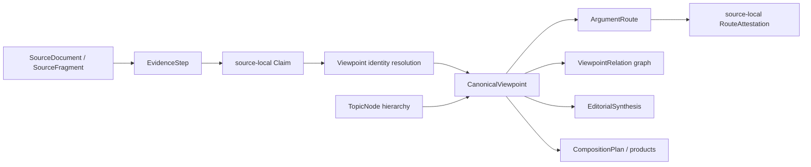
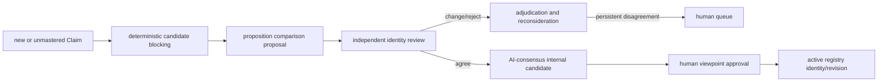
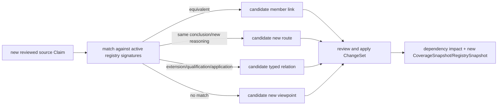

# Canonical Viewpoint Registry 与跨讲论证路径设计 v1

> 状态：Canonical Viewpoint layer 的规范性 architecture authority；实现尚未开始。本文件不创建正式观点、不迁移数据、不调用内容模型，也不授权部署。
> 版本：v1
> 日期：2026-08-22
> 追踪：GitHub issue #165，WKP-F02.7
> 权威边界：PostgreSQL 继续是 authoring authority；来源局部 `Claim`、`EvidenceStep`、`SourceFragment` 与 Canonical Citation 继续是可追溯事实的权威。

## 1. 决策摘要

“整理王教授释经神学思想”的中心知识操作，是从两百多篇来源局部主张中，解析并持续维护王教授反复表达的观点身份。这个身份层采用 provenance-preserving registry MDM，而不是把来源主张合并成一条新的“黄金原文”。

本设计作出以下决定：

1. `CanonicalViewpoint` 是新的 canonical identity，不是 `EditorialSynthesis` subtype。
2. `CanonicalViewpoint` 本身不建立强制单父层级；它是稳定、opaque 的观点身份，观点之间通过 typed graph 相连。
3. `TopicNode` 继续拥有主题层级；`CanonicalViewpoint` 回答“教授持什么观点”，`TopicNode` 回答“这个观点属于什么研究问题”。
4. 来源局部 `Claim` 永不因观点归并而删除、覆盖或静默熔化。registry 只保存 identity crosswalk、审核决定和 lineage。
5. canonical core proposition 是编辑对多个来源主张的规范化措辞，必须标为 `editorial_normalization`，不得冒充教授逐字原话。
6. 同一结论、同一推理表示为同一 viewpoint 下同一 `ArgumentRoute` 的多个 source-local attestations；同一结论、不同推理表示为同一 viewpoint 下不同 routes。
7. `duplicate` 连通分量只能生成 identity candidate，不能用 union-find 自动建立 canonical membership；`duplicate` 不是可安全传递的等价闭包。
8. 全部篇数、来源数、出现次数、路线数与经文数由结构机械计算，不在自然语言 summary 中维护另一份数字。
9. corpus universe、详细抽取覆盖和观点审核覆盖必须分开记录。当前规划语境为 205+ 篇全语料、20 篇已进入详细整理、核心九篇拥有冻结的跨讲关系与 Topic Discovery artifact；这些数字不可写死在 viewpoint identity 上。
10. AI 共识只产生内部 candidate。公开把一项规范表述归属于教授，需要显式的人类观点审核；现有文章自动发布规则不得挪用为观点批准规则。

推荐的整体名称是 **Canonical Viewpoint Registry**；中文可称“规范观点注册表”。这里的 canonical 表示平台确认多个来源断言属于同一观点身份，不表示平台裁定该神学观点正确。

### 1.1 规范范围、优先级与下游读取规则

本文件是所有新增或修改 CanonicalViewpoint、ArgumentRoute、观点关系、观点覆盖统计及其产品消费行为的 architecture authority。以下工作在行动前必须读本文件并遵守其对象边界：

- 王教授释经神学思想整理；
- 使用跨讲 canonical viewpoint 的释经文章与专题文章；
- 使用 viewpoint 聚合或 route 展开的 QA、搜索与跨时间比较；
- Topic Discovery、CompositionPlan 或知识 packet 对 viewpoint 层的接入；
- viewpoint registry schema、审核 UI、Active Snapshot 与影响传播实现。

它与既有规范的职责不重叠：

- 来源、Claim、EvidenceStep 与 Citation 的权威规则仍由 shared knowledge、来源对账和 PostgreSQL authoring store 规范决定；
- Matthew exposition 的写作状态机、reviewer-call invariant、Program Audit 与 publication decision 仍由 Matthew authoring workflow 决定；
- QA 的答案完整度、逐项引用与诊断流程仍由 QA 规范决定；
- 本文件新增的约束只决定这些流程怎样读取、归属、版本绑定和呈现 canonical viewpoint。

实现者与负责构造 packet 的 agent 必须读本文件；运行时模型不读取这份完整 architecture 文档。实际消费观点知识的 Composition、Author、Revision 或 QA 角色只接收由程序按本文件编译、受大小和任务范围约束的 `ViewpointKnowledgeProjection` 切片。Editorial Reviewer 是否接收任何派生字段仍由其独立 packet contract 决定；Matthew EditorialReviewPacket 与 FinalDeltaReviewPacket 不接收 knowledge projection。Markdown 文档不是 runtime data source。

## 2. 问题与覆盖边界

### 2.1 三种覆盖范围不得混用

当前平台有三个不同的资料范围：

| 范围 | 当前含义 | 可作什么结论 |
|---|---|---|
| source universe | 平台两百多篇来源；其中 `CORPUS-SURVEY-205-V1` 是 205 篇的封闭历史普查基线，后来来源不得写回该基线 | 当前 source-universe manifest 决定 registry 本轮理论覆盖范围；survey claims 仍是 candidate，不是已审核 Claim |
| detailed extraction coverage | 当前已有 20 篇进入较详细知识整理 | 可为观点匹配提供来源局部 Claim，但各篇审核成熟度仍须逐项检查 |
| frozen viewpoint POC fixture | 核心九篇 artifact：158 条 Claim、67 条经复核跨讲关系、6 个母题、13 个子专题、55 个篇章段落 | 可做只读 schema 映射与回归；不代表当前全覆盖，也不得推广为 205+ 篇结论 |

“20 篇”是当前规划事实，不是从 staging 文件数推导的权威统计。同一来源可能存在于多个 research batch 或 generation；实现后必须由 SHA-bound source manifest 计算覆盖，而不是扫描目录或读取 batch 名称。

205 篇 corpus survey 是一次性、已关闭的历史普查基线，不是会随新讲道变化的 source-universe registry。它不能因为 viewpoint registry 建立而被刷新、滚动生成 V2，survey candidate 也不能直接成为 approved viewpoint member。survey 只能帮助候选召回和覆盖缺口说明；当前全平台来源范围另由不可变的 source-universe manifest snapshot 表示。

### 2.2 现有两层为何不够

现有流程已经保留：

- 来源局部 `Claim` 与 occurrence；
- `EvidenceStep`、经文与精确来源；
- `duplicate / supports / extends / qualifies / contrasts / supersedes / unrelated` 跨讲关系；
- `TopicNode`、母题、子专题和篇章段落候选；
- `EditorialSynthesis` 对跨来源模式的编辑描述。

但仍缺少一个稳定对象回答：

- 哪些来源 Claim 是同一个观点的不同表达；
- 同一观点在多少独立来源、哪些时期出现；
- 同一结论有几条不同论证路线；
- 哪些限定、应用和张力不应被误合并为重复；
- 新讲道加入后应匹配既有身份，还是创建新身份；
- 错误归并怎样拆分而不破坏历史产品。

`EditorialSynthesisRecord` 当前只有 synthesis identity、类型、标题、描述、claim IDs 与 corpus scope。它适合表达编辑发现的模式或文章说明，不足以承担稳定 identity、member decision、argument route、时间 lineage、split/merge 与 source-local attestation。

## 3. Registry MDM 架构

### 3.1 与 MDM Registry 的对应

| Registry MDM 概念 | 本平台对象 |
|---|---|
| master identity | `CanonicalViewpoint` |
| source record | 来源局部 `Claim` |
| crosswalk | `ViewpointClaimLink` |
| match candidate | `ViewpointIdentityCandidate` |
| match/merge decision | `ViewpointIdentityDecision` |
| mastered attributes | 当前 approved `ViewpointRevision` 的 core proposition 与 scope |
| source lineage | Claim → EvidenceStep → SourceFragment → Citation |
| survivorship | 哪些 approved member links 支持当前 revision |
| stewardship | 独立复核、仲裁、人工批准、split/merge |
| hierarchy management | `TopicNode`，不是 viewpoint parent pointer |
| temporal history | revision、occurrence timeline、successor relations |

传统 MDM 常为姓名或地址选择 surviving value；这里不能把任一来源 Claim 的措辞静默提升为“教授标准原话”。registry 的 mastered proposition 是审核过的编辑归一化文字，来源 Claim 全部保留。

### 3.2 逻辑分层



各层职责：

- `Claim`：教授在一个来源语境中具体作出的主张。
- `CanonicalViewpoint`：跨来源的观点身份，不储存逐字引文。
- `ArgumentRoute`：到达该观点的一种可区分推理骨架。
- `RouteAttestation`：某一个来源中实际出现的完整或部分论证实例。
- `ViewpointRelation`：观点之间的扩展、限定、应用、蕴含、张力与后期修正。
- `TopicNode`：主题分类及层级导航。
- `EditorialSynthesis`：编辑如何解释、命名和组织一个或多个观点。
- `CompositionPlan`：具体文章或产品怎样呈现观点与证据。

### 3.3 CanonicalViewpoint 不采用强制树

观点之间不是单父树。一个较具体观点可能同时：

- specialize 一个较广观点；
- qualify 另一个观点；
- apply 到一个具体伦理问题；
- 归入多个 TopicNode；
- 与另一时期的材料形成 tension。

因此 `CanonicalViewpoint` 不设 canonical `parent_viewpoint_id`。UI 可以从 typed graph 生成树状阅读投影，但该投影是可重建导航，不是 identity authority。

## 4. 对象语义与归属边界

| 对象 | identity owner | reader-visible wording owner | 可否表示教授自己的观点 | 可否表示外部立场 | 可否建立层级 |
|---|---|---|---|---|---|
| `Claim` | extraction/source layer | 来源局部整理，受原文约束 | 是 | 仅在 attribution 明确时；通常应使用 PositionNode | 否 |
| `CanonicalViewpoint` | viewpoint registry | 编辑规范化，必须显式标记 | 是，表示被来源支持的教授观点身份 | 否 | 否，使用 graph |
| `PositionNode` | argument layer | 来源所呈现的外部立场 | 否 | 是 | 否 |
| `TopicNode` | Canonical Repository | 编辑主题命名 | 否，它是研究主题身份 | 否 | 是 |
| `EditorialSynthesis` | editorial layer | 编辑 | 只能说明它综合了教授哪些观点，不能冒充教授断言 | 可比较多个立场 | 可由产品组织，但不拥有 canonical topic hierarchy |
| `ArgumentRoute` | viewpoint registry | 编辑规范化 route signature | 表示教授实际使用过的推理类型，须有 source-local attestation | 不用于保存外部立场本身 | 否 |

### 4.1 教授归属与编辑措辞必须同时保存

一个 viewpoint 可以归属于教授，同时它的 canonical wording 仍属于编辑归一化：

```json
{
  "attribution_subject": "professor",
  "representation_kind": "editorial_normalization_of_source_claims",
  "not_a_direct_quote": true
}
```

对外表达必须区分：

- 来源 Claim 或精确引文：“王教授在该讲中指出……”；
- canonical wording：“本项目将这些来源主张归纳为……”；
- 尚未批准的 pattern：“目前候选材料可能显示……”；
- `EditorialSynthesis`：“本项目根据当前覆盖范围作出的编辑综合……”。

### 4.2 什么可以成为 viewpoint member

只有命题身份相同的 Claim 或 Claim 内明确可定位的命题成分，才是 identity-bearing member。支持、扩展、限定、应用和张力不能为了增加 recurrence 而算作成员。

建议区分：

| link type | 含义 | 计入 member claim count | 计入 occurrence count |
|---|---|---:|---:|
| `equivalent_full` | 整条 Claim 与 core proposition 真值条件等价 | 是 | 是 |
| `equivalent_component` | 复合 Claim 内一个明确成分与 viewpoint 等价；必须保存 component locator | 是 | 是 |
| `supports` | 为 viewpoint 提供论据，但结论不是同一命题 | 否 | 否 |
| `extends` | 保留核心并增加会改变整条 Claim 真值条件的内容 | 否 | 否 |
| `qualifies` | 增加条件、范围或反误解边界 | 否 | 否 |
| `applies` | 将观点用于具体对象或行动 | 否 | 否 |
| `tension_evidence` | 为未解决张力提供材料 | 否 | 否 |
| `superseding_evidence` | 为后期明确修正提供材料 | 否 | 否 |

`equivalent_component` 解决现有 Claim 有时包含多个命题的问题，但必须引用结构化 component locator。不得仅凭模型摘要声称“其中包含同一观点”。若无法稳定定位，应先保留为 `extends` 或待上游原子化，不得强行成为 member。

## 5. 最小 schema proposal

第一版继续使用 PostgreSQL 的关系骨架加经 Pydantic 验证的 JSONB。以下是逻辑 schema；实际实现可将 identity 与 revision 保存在同一 collection 的 object versions 中，但 API 必须保持二者语义可区分。

### 5.1 CoverageSnapshot

CoverageSnapshot 是不可变 manifest，说明一次观点分析看过哪些来源 revision。它不决定 viewpoint identity。

```json
{
  "coverage_snapshot_id": "CVS-opaque",
  "schema_version": "wang_viewpoint_coverage_snapshot_v1",
  "historical_survey_baseline_id": "CORPUS-SURVEY-205-V1",
  "source_universe_manifest_id": "SUM-opaque",
  "source_universe_manifest_sha256": "...",
  "sources": [
    {
      "source_id": "SRC-...",
      "source_revision_id": "SRCREV-...",
      "source_sha256": "...",
      "roles": [
        "source_universe",
        "detailed_extraction",
        "viewpoint_reviewed"
      ]
    }
  ],
  "sources_sha256": "...",
  "coverage_status": "partial",
  "created_at": "...",
  "review_status": "system_verified",
  "visibility": "internal",
  "revision": 1
}
```

`roles` 第一版只允许 `source_universe`、`detailed_extraction`、`viewpoint_reviewed`；一个 source revision 可以同时拥有多个 roles。`sources` 按 `source_revision_id` 排序后计算 `sources_sha256`，同一个 `source_id` 在同一 snapshot 中最多出现一个 current revision。

机械派生而不存双份真相的字段包括：`source_universe_count`、`historical_survey_baseline_count`、`detailed_source_count` 与 `viewpoint_reviewed_source_count`。若 API 返回这些数字，必须同时返回计算所用 snapshot ID。`historical_survey_baseline_count` 不因后来来源加入而改变；`source_universe_count` 由拥有 `source_universe` role 的 entries 计算。

### 5.2 CanonicalViewpoint identity

```json
{
  "viewpoint_id": "CV-opaque",
  "schema_version": "wang_canonical_viewpoint_v1",
  "current_revision_id": "CVR-opaque",
  "identity_status": "active",
  "created_from_candidate_id": "VIC-...",
  "redirect_to_viewpoint_id": null,
  "review_status": "human_approved",
  "visibility": "internal",
  "revision": 1
}
```

规则：

- ID 不包含标题、topic、batch、Claim 集合或日期；
- 标题和 core proposition 改写不改变 identity；
- substantive truth-condition change 不能作为普通文字 revision 偷渡；
- merge 后 losing identity 可 redirect，但历史版本必须仍可解析；
- split 后原 identity 不得被悄悄重新定义为其中一个 successor。

### 5.3 ViewpointRevision

```json
{
  "viewpoint_revision_id": "CVR-opaque",
  "viewpoint_id": "CV-opaque",
  "revision_number": 3,
  "core_proposition": "...",
  "proposition_signature": {
    "subject": "...",
    "predicate": "...",
    "object": "...",
    "polarity": "affirmed",
    "modality": "asserted",
    "temporal_scope": ["..."],
    "conditions": ["..."],
    "population_scope": ["..."]
  },
  "attribution_subject": "professor",
  "representation_kind": "editorial_normalization_of_source_claims",
  "not_a_direct_quote": true,
  "scope": {
    "scripture_scope": ["..."],
    "audience_scope": ["..."],
    "historical_scope": ["..."]
  },
  "provenance": {
    "basis_identity_decision_ids": ["VID-..."],
    "review_artifact_sha256": "..."
  },
  "review_status": "human_approved",
  "approved_by": "...",
  "approved_at": "...",
  "supersedes_revision_id": "CVR-...",
  "revision": 3
}
```

`proposition_signature` 是审核和候选匹配的结构化辅助，不是从文本自动计算出的真理。它与 core proposition 必须在同一 review decision 中一起批准。

`ViewpointRevision` 只保存观点的语义与经审核措辞，不保存当前 member links、relations、routes 或 coverage。新增来源若没有改变 core proposition、scope 或 proposition signature，不产生新的 semantic revision。

措辞变体默认由 member Claim 的原 statement/title 派生，不复制进 revision。只有不对应单一 Claim 的受控 alias 才保存在 `editorial_aliases`，并须标注编辑来源。

### 5.4 ViewpointClaimLink

```json
{
  "viewpoint_claim_link_id": "VCL-opaque",
  "viewpoint_id": "CV-opaque",
  "validated_against_viewpoint_revision_id": "CVR-opaque",
  "claim_id": "DK-...-CL...",
  "pinned_claim_revision": 2,
  "link_type": "equivalent_full",
  "component_locator": null,
  "supporting_relation_ids": ["XSR-..."],
  "occurrence_refs": ["OCC-..."],
  "decision_id": "VID-...",
  "effective_state": "active",
  "review_status": "human_approved",
  "revision": 1
}
```

`component_locator` 用于 `equivalent_component`，至少包含可验证的 statement component、source Claim SHA 及其在 Claim 结构中的稳定定位。仅保存一段模型 summary 不合格。

Claim link 属于稳定 viewpoint identity；`validated_against_viewpoint_revision_id` 记录它最后针对哪个 semantic revision 通过审核。新的 semantic revision 若改变 truth conditions，所有 active member links 必须 invalidated 或重新验证；仅产生新 registry snapshot 不复制 link。

### 5.5 ViewpointOccurrenceRef

当前 occurrence 嵌在 Claim 内，尚无一等稳定 ID。迁移期可机械生成引用键：

```text
OCC = SHA256(
  claim_id,
  pinned_claim_revision,
  source_id or transcript_id,
  sorted(paragraph_key, evidence_step_id, media_time)
)
```

引用记录只保存 locator 与 Claim revision，不复制来源文字：

```json
{
  "occurrence_ref_id": "OCC-opaque",
  "claim_id": "DK-...-CL...",
  "pinned_claim_revision": 2,
  "source_id": "SRC-...",
  "transcript_id": "...",
  "anchor_refs": [
    {
      "paragraph_key": "S0005",
      "evidence_step_id": "DK-...-E011",
      "media_time": 1369
    }
  ],
  "source_revision_sha256": "..."
}
```

长期实现可以把 `ClaimOccurrence` 提升为正式 collection；在此之前，derived occurrence ref 足以防止 staging path 成为身份。

### 5.6 ArgumentRoute

```json
{
  "argument_route_id": "AR-opaque",
  "conclusion_viewpoint_id": "CV-opaque",
  "current_revision_id": "ARR-opaque",
  "route_status": "active",
  "review_status": "human_approved",
  "visibility": "internal",
  "revision": 1
}
```

Route revision 保存编辑规范化的 inferential skeleton：

```json
{
  "argument_route_revision_id": "ARR-opaque",
  "argument_route_id": "AR-opaque",
  "validated_against_conclusion_viewpoint_revision_id": "CVR-opaque",
  "route_label": "以 παιδαγωγός 的阶段性职能论证律法管辖已经结束",
  "route_signature": {
    "premise_roles": ["historical_semantics", "textual_observation"],
    "inference_pattern": "temporary_guardianship_ends_at_christ",
    "conclusion_viewpoint_id": "CV-opaque"
  },
  "representation_kind": "editorial_normalization_of_attested_arguments",
  "review_artifact_sha256": "...",
  "review_status": "human_approved",
  "revision": 1
}
```

`ArgumentRouteRevision` 只保存 inferential skeleton。新增同类 source attestation 不产生 route semantic revision。

### 5.7 ArgumentRouteAttestation

每个 attestation 必须 source-local。严禁从讲道 A 取前提、讲道 B 取推论、讲道 C 取结论，再声称教授在某处给出完整路线。

```json
{
  "argument_route_attestation_id": "ARA-opaque",
  "argument_route_id": "AR-opaque",
  "validated_against_route_revision_id": "ARR-opaque",
  "source_id": "SRC-...",
  "claim_id": "DK-...-CL...",
  "occurrence_ref_id": "OCC-...",
  "ordered_evidence_step_ids": ["DK-...-E010", "DK-...-E011"],
  "terminal_claim_link_id": "VCL-...",
  "completeness": "full",
  "scripture_refs_derived": ["Gal.3.23-Gal.3.25"],
  "review_status": "human_approved",
  "revision": 1
}
```

`completeness` 可为 `full` 或 `partial`。只有 `full` attestation 计入“该来源使用了这条完整论证路线”；partial 仍可展示，但不得抬高 recurring route count。

经文列表从 EvidenceStep 派生。若为了查询物化在 attestation 中，validator 必须逐次重算并拒绝不一致。

### 5.8 ViewpointRelation

```json
{
  "viewpoint_relation_id": "VREL-opaque",
  "source_viewpoint_id": "CV-...",
  "target_viewpoint_id": "CV-...",
  "validated_against_source_viewpoint_revision_id": "CVR-...",
  "validated_against_target_viewpoint_revision_id": "CVR-...",
  "relation_type": "qualifies",
  "reason": "...",
  "supporting_claim_relation_ids": ["CR-..."],
  "supporting_claim_ids": ["DK-...-CL..."],
  "temporal_assertion": null,
  "review_status": "human_approved",
  "revision": 1
}
```

允许的第一版 relation types：

- `generalizes / specializes`：命题范围的上下位关系；
- `entails`：一个观点作为前提或结论蕴含另一观点；
- `extends`：保留核心判断并增加内容；
- `qualifies`：增加限制、条件或适用边界；
- `applies`：将观点用于具体经文、群体或实践；
- `tensions_with`：尚不能安全协调的张力；
- `supersedes`：有内容与时间证据的后期明确修正。

`tensions_with` 为对称关系，ID 需按 canonical pair 生成。`supersedes` 有方向，且必须引用来源日期与教授明确修正的证据；仅因材料较晚不得使用。

现有 `TensionRecord` 可在兼容迁移中增加 endpoint IDs，或由 `ViewpointRelation:tensions_with` 投影出 reader-facing tension。不得维护两套互不核对的张力事实。

### 5.9 ViewpointRegistrySnapshot

`ViewpointRegistrySnapshot` 是某个 CoverageSnapshot 下一个 viewpoint 的不可变 as-of 投影。它把不断增长的来源集合与稳定的 semantic revision 分开：

```json
{
  "viewpoint_registry_snapshot_id": "VRS-opaque",
  "viewpoint_id": "CV-opaque",
  "viewpoint_revision_id": "CVR-opaque",
  "coverage_snapshot_id": "CVS-opaque",
  "active_member_link_ids": ["VCL-..."],
  "active_related_claim_link_ids": ["VCL-..."],
  "active_argument_route_snapshot_ids": ["ARS-..."],
  "active_viewpoint_relation_ids": ["VREL-..."],
  "derived_statistics": {
    "member_claim_count": 0,
    "distinct_source_document_count": 0,
    "source_occurrence_count": 0,
    "argument_route_count": 0,
    "full_route_attestation_count": 0,
    "qualification_count": 0,
    "tension_count": 0
  },
  "derived_statistics_sha256": "...",
  "build_fingerprint": "...",
  "registry_eligibility": "candidate_only",
  "review_status": "system_verified",
  "created_at": "..."
}
```

Snapshot 不改变 viewpoint identity，也不成为新的 authoring authority。其全部 arrays、statistics 和 registry eligibility 由 PostgreSQL 当前记录与明确 coverage 机械编译；相同 fingerprint 必须 byte-stable。`registry_eligibility` 只表达 registry 自身是否 `candidate_only` 或 `approved_evidence_ready`，不替具体产品决定 publication gate。增加一篇来源通常只产生新 CoverageSnapshot、member/route records 和新的 registry snapshot，不产生 `ViewpointRevision`。

### 5.10 ArgumentRouteSnapshot

```json
{
  "argument_route_snapshot_id": "ARS-opaque",
  "argument_route_id": "AR-opaque",
  "argument_route_revision_id": "ARR-opaque",
  "conclusion_viewpoint_revision_id": "CVR-opaque",
  "coverage_snapshot_id": "CVS-opaque",
  "active_attestation_ids": ["ARA-..."],
  "full_attestation_count": 0,
  "distinct_source_document_count": 0,
  "registry_eligibility": "candidate_only",
  "build_fingerprint": "...",
  "review_status": "system_verified"
}
```

Route snapshot 只收录 `validated_against_route_revision_id` 等于当前 route revision、该 route revision 已针对当前 conclusion viewpoint revision 验证、且其 source revision 位于 CoverageSnapshot 的 attestations。新增 attestation 不修改 `ArgumentRouteRevision`；route inferential skeleton 或 conclusion viewpoint truth conditions 改变时，旧 route/attestations 必须等待重新验证。

### 5.11 ViewpointIdentityCandidate 与 Decision

候选与决定是不同对象：

```json
{
  "identity_candidate_id": "VIC-opaque",
  "candidate_claim_ids": ["..."],
  "candidate_viewpoint_ids": ["..."],
  "seed_relation_ids": ["..."],
  "proposed_action": "match_existing",
  "proposed_proposition_signature": {},
  "coverage_snapshot_id": "CVS-...",
  "generation_fingerprint": "...",
  "review_status": "candidate"
}
```

```json
{
  "identity_decision_id": "VID-opaque",
  "identity_candidate_id": "VIC-opaque",
  "decision": "match_existing",
  "resolved_viewpoint_id": "CV-opaque",
  "claim_link_decisions": [
    {"claim_id": "...", "link_type": "equivalent_full"}
  ],
  "reviewer_kind": "human_editor",
  "reviewer_id": "...",
  "reason": "...",
  "input_sha256": "...",
  "created_at": "..."
}
```

允许的 identity decisions 至少包括：`match_existing`、`create_new`、`reject_match`、`defer`、`merge_identities`、`split_identity` 与 `retire_identity`。

## 6. 怎样判断两个 Claim 是同一观点

### 6.1 Identity rule

两个 Claim 只有在以下条件同时成立时，才可成为同一 viewpoint 的 identity-bearing members：

> 它们对兼容的主体，在兼容的时间、范围、条件和模态下，作出相同核心断言；移除措辞、例证和论证来源差异后，其真值条件等价。

至少比较：

1. subject；
2. predicate 与 object；
3. polarity；
4. population 与 scripture scope；
5. temporal scope；
6. conditions；
7. modality；
8. professor / external-position attribution；
9. 会改变真值条件的 qualification。

论据不同不妨碍 identity 相同；结论相似但条件或范围不同，则通常是 `qualifies`、`extends` 或 `specializes`。

### 6.2 发现流水线



候选 blocking 可以使用：

- 已审核 `duplicate` 边；
- proposition signature 的 exact/compatible fields；
- 相同或相近主体、谓词、经文与概念；
- survey 与 semantic retrieval 只用于召回，不用于归并；
- `unrelated` constraint、外部 attribution 与明确冲突作为 blocker。

模型可提出 signature、关系分类和理由，但程序必须验证 ID、来源、范围与 evidence references；模型不得分配 canonical ID 或批准自己的输出。

### 6.3 关系分类

| 比较结果 | registry 动作 | route 动作 |
|---|---|---|
| 同结论、同真值条件、同推理骨架 | 同 viewpoint member | 同 route 新增 attestation |
| 同结论、同真值条件、不同推理骨架 | 同 viewpoint member | 创建或匹配另一 route |
| Claim 包含该结论并增加另一可分命题 | `equivalent_component` 或 `extends`，取决于能否稳定定位 component | 可成为 route terminal，但不得把额外命题熔入 core |
| 增加适用条件或反误解边界 | 非 member；`qualifies` | 可作为 route/关系证据 |
| 更具体的适用判断 | 非 member；`specializes` 或 `applies` | 独立 route 或 product use |
| 只提供理由 | 非 member；`supports` | 进入 route attestation |
| 尚不能协调 | `tensions_with` | 各自保留 route |
| 后期明确改正 | 新 viewpoint 或 successor；`supersedes` | 保留前后两套 routes 与时间线 |

### 6.4 duplicate component 不是 equivalence class

即使已有 `A duplicate B` 与 `B duplicate C`，也不能机械推出 `A duplicate C`。B 可能较宽，分别与 A、C 局部重叠。

规则：

- duplicate connected component 只生成一个 cluster candidate；
- 每个 member 必须与拟议 core proposition 单独获得 decision；
- active member 之间若存在 `unrelated`、`contrasts`、`qualifies` 或 `supersedes` blocker，candidate 必须失败或转人工；
- component 可能过宽，也可能不完整；语义相同的两个 disconnected components 仍可能解析到同一 viewpoint；
- 不因 recurrence 多就提高重要性、成熟度或批准等级。

## 7. ArgumentRoute 的身份与归属

### 7.1 Route identity

同一 route 不是“引用了同一节经文”或“用了相同关键词”，而是具有兼容的：

- premise roles；
- textual/historical observations；
- inference bridge；
- conclusion viewpoint；
- scope 与关键 qualification。

若两讲都引用加拉太书，但一讲以 `παιδαγωγός` 的历史职能论证阶段性，另一讲以“后裔”单数和期限论证，是否同一 route 必须依 inferential skeleton 审核，不能只看经文相同。

### 7.2 Route 与 EvidenceStep

- `EvidenceStep` 继续保存来源局部论证步骤；
- `ArgumentRoute` 不复制或改写 EvidenceStep；
- `RouteAttestation.ordered_evidence_step_ids` 必须全部可解析；
- EvidenceStep 必须属于该 attestation 的来源与 Claim occurrence；
- 一个 EvidenceStep 可服务多个 Claim 或 route，但每次归属必须显式；
- route 不能拥有来源逐字引文；引用继续由 SourceFragment/Citation authority 提供。

### 7.3 同一结论的多路线不互相吞并

不同 routes 即使共同支持一个 viewpoint，也分别维护：

- route identity 与 revision；
- source-local attestations；
- completeness；
- scripture/evidence projection；
- temporal coverage；
- tensions 与 qualifications。

搜索或专题写作可以展示“结论相同，但教授在不同讲道采用了三条路线”，而不是把全部 EvidenceStep 平铺成一条虚构的超长论证。

## 8. 核心九篇只读 schema 映射示例

本节只读取现有冻结 artifact，不创建正式 ID、不重新调用模型、不把九篇结果推广到当前 20 篇或 205+ 篇。

### 8.1 候选观点

编辑规范化候选：

> 基督来到以后，新约信徒不再受摩西律法的阶段性管辖。

直接 identity seed：

| Claim | 来源局部表述 | 现有关系 |
|---|---|---|
| `DK-02d0db2fc475-CL006` | 基督来到并成全律法以后，信徒已经脱离摩西律法，不再处于其管辖之下 | duplicate seed |
| `DK-61585a6f4eab-CL007` | 基督来到并完成救赎后，摩西律法的阶段性管辖已经结束 | 与前者 `duplicate` |
| `DK-502c7f478854-CL011` | 因基督完成救赎并赐下圣灵，新约信徒已经脱离摩西律法管辖，但仍靠圣灵遵守基督律法 | 对 `DK-61585a6f4eab-CL007` 为 `extends`；若 component 可稳定定位，可候选 `equivalent_component`，否则保持 extends |

这个例子说明 membership 与 related claims 必须分开：第三条包含核心结论，但也增加圣灵和基督律法，不应把额外内容静默写入 core proposition。

### 8.2 Route A：παιδαγωγός 的阶段性职能

候选 route signature：摩西律法像暂时监管孩童的 `παιδαγωγός`；基督来到后该阶段性监管结束。

至少两个 source-local attestations：

1. `2019-3-31 宗主国与附庸国的约`
   - conclusion Claim：`DK-61585a6f4eab-CL007`
   - EvidenceStep：`DK-61585a6f4eab-E010`（历史背景）、`DK-61585a6f4eab-E011`（加 3:23–25 的原文与阶段性应用）
   - occurrence：`S0005`，media time 1369
2. `2019-09-22 羅馬書7章1-25 向律法死`
   - conclusion Claim：`DK-02d0db2fc475-CL006`
   - EvidenceStep：`DK-02d0db2fc475-E013`（加 3:25、4:4–5）
   - occurrence：`S0030`，media time 1762

两项 attestation 的具体步骤不同但 inferential skeleton 相容；是否归为同一 route 仍需 route review，不由本设计文档宣布批准。

### 8.3 Route B：祭司职任改变要求律法改变

候选 route signature：希伯来书 7:11–12 以祭司职任改变为理由，推出相应律法也必须改变，因此旧制度的管辖不能保持不变。

至少两个 source-local attestations：

1. `2019-3-31 宗主国与附庸国的约`
   - conclusion Claim：`DK-61585a6f4eab-CL007`
   - EvidenceStep：`DK-61585a6f4eab-E014`
   - occurrence：`S0006`，media time 1691
2. `011WSR03`
   - conclusion/extended Claim：`DK-502c7f478854-CL011`
   - EvidenceStep：`DK-502c7f478854-E002`
   - occurrence：`S0002`，media time 24

Route A 与 Route B 指向同一个候选结论，却具有不同 premises 和 inference pattern，因此必须是两个 routes，不能因为结论相同而去重。

### 8.4 本映射验证的设计事实

- 一个观点可以保留多个来源 Claim；
- member、extends 与 route-support claim 必须分开；
- 同一观点可以有多条 route；
- 同一 route 可以有多个 source-local attestation；
- route 可以回到 EvidenceStep、经文、段落和媒体时间；
- POC 无需重新生成任何内容即可验证 schema；
- 所有 ID、出现次数和来源数均可机械核对。

## 9. 机械不变量

### 9.1 引用完整性

1. 所有 viewpoint、revision、Claim link、route、attestation、relation 与 decision ID 唯一。
2. `current_revision_id` 必须属于同一 identity。
3. 所有 Claim、EvidenceStep、source、occurrence、relation、coverage snapshot 与 review artifact 引用必须可解析。
4. pinned Claim revision 不存在时不得自动改指 current revision。
5. eligible/public provenance 最终必须通过 Canonical Citation authority；staging path 不是 citation identity。
6. ViewpointRegistrySnapshot 必须绑定一个 ViewpointRevision 和一个 CoverageSnapshot；RouteSnapshot 同理绑定一个 ArgumentRouteRevision 和同一 coverage。
7. projection 中的 registry/route snapshots 必须共享同一个 CoverageSnapshot，除非 schema 明确标记并解释跨 snapshot 比较模式。
8. RegistrySnapshot 只能收录已经针对其当前 ViewpointRevision 验证的 member links、routes 与 relations；关系的另一端也必须绑定并解析到明确 semantic revision。

### 9.2 来源不丢失

1. 建立、merge、split 或 retire viewpoint 不得删除或修改来源 Claim。
2. 每个 identity-bearing link 必须保留 Claim ID、pinned revision、occurrence refs 与 identity decision。
3. canonical core proposition 不得成为唯一可见来源；消费者必须可展开 member Claims 与精确来源。
4. source revision 改变时，旧 occurrence ref 保留历史，新 revision 重新 reconcile。

### 9.3 成员资格

1. `(viewpoint_id, claim_id, pinned_claim_revision, component_locator)` 在 active state 中唯一；link 另以 `validated_against_viewpoint_revision_id` 记录语义验证版本。
2. 一个完整 Claim revision 最多拥有一个 active `equivalent_full` viewpoint membership。
3. 一个复合 Claim 可拥有多个 `equivalent_component` membership，但每个必须有互不冒充的稳定 component locator。
4. 其他跨观点使用必须通过 typed `ViewpointClaimLink` 或 `ViewpointRelation` 显式表示，不能复制 Claim。
5. active member 与任何已批准 `unrelated` constraint 不得冲突。
6. `duplicate` edge 不能自行建立 membership；必须有 identity decision。

### 9.4 Route 归属

1. route 只能有一个 conclusion viewpoint identity；若一条论证服务多个结论，分别建立 route-to-viewpoint binding 或显式 entailment，不复制虚构步骤。
2. attestation 的 EvidenceStep 必须来自同一个 source context；跨来源拼接失败。
3. terminal Claim link 必须属于 route 的 conclusion viewpoint，或明确标为 related/partial terminal。
4. ordered steps 不得重复未知 ID；顺序是 attestation 的审核事实。
5. `full` attestation 必须覆盖 route revision 声明的 required premise/inference roles。
6. partial attestation 不计入 recurring route count。

### 9.5 Semantic revision 与 snapshot 分离

1. ViewpointRevision 不得内嵌 active member、route、relation、occurrence 或 coverage arrays。
2. ArgumentRouteRevision 不得内嵌 attestation 或 coverage arrays。
3. 新来源只改变 links、attestations 与 snapshots；若 compiler 发现 semantic payload 未变却建立新 semantic revision，ChangeSet 失败。
4. snapshot 是不可变 read projection，不可反向写回或覆盖 PostgreSQL authoring records。
5. 相同 semantic revision、coverage、active link/relation/attestation 集合和 compiler version 必须得到相同 build fingerprint 与 canonical JSON SHA。

### 9.6 Derived counts

以下数字只由 active、指定 coverage snapshot 下的结构计算：

- `member_claim_count`；
- `source_occurrence_count`；
- `distinct_source_document_count`；
- `distinct_transcript_count`；
- `argument_route_count`；
- `full_route_attestation_count`；
- `recurring_route_count`；
- `scripture_reference_count`；
- `qualification_count`；
- `tension_count`；
- earliest/latest attested source dates。

自然语言 summary 中出现数字时，renderer 必须从同一统计对象插值；模型返回的数字不能成为 authority。

`recurrence` 只表示出现次数，不表示思想重要性、正确性、成熟度或出版优先级。

## 10. Review、approval 与公开资格

### 10.1 状态分离

不要用一个 `status` 同时表示生成进度、审核结果、identity 生命周期和公开可见性。

建议分别保存：

- generation status：`generated / validated / failed`；
- review status：`candidate / ai_consensus / human_approved / rejected`；
- identity status：`active / redirected / split / merged / retired`；
- visibility：`internal / active_snapshot_eligible / public`；
- dependency status：`current / invalidated / withdrawn / rebuilt`。

### 10.2 Reviewer workflow

观点候选可复用现有跨讲关系的 proposal → independent review → adjudication → reconsideration 模式：

1. proposal 提出 identity、member links、core proposition 与 route candidates；
2. independent reviewer 逐项判断 proposition equivalence、scope、attribution 与 route identity；
3. change/reject 进入 adjudication；
4. 被拒意见进入 reconsideration；
5. 持续分歧只把该项送人工；
6. AI 共识保持 `candidate/internal`；
7. 人类 editor 批准 viewpoint identity、当前 revision 和可对外归属的 canonical wording。

本设计不规定模型供应商或调用次数；实现 ticket 必须定义可恢复 generation fingerprint 与 exact reviewer-call invariant。不得把 Matthew exposition article 的 reviewer invariant 或自动 publication decision 直接套用到观点审核。

### 10.3 不设置 recurrence 门槛

单一来源也可形成一个 candidate identity，以便未来增量匹配；但消费者只能称其为“反复观点”，当且仅当机械统计显示至少两个独立 source documents 中存在 approved occurrences。

观点是否 active 不由出现次数决定。批准要求逐项满足：

- identity boundary 已审核；
- core proposition 与 proposition signature 已审核；
- attribution 与 wording origin 清楚；
- 每个 active member 有可解析来源；
- hard blockers 为零；
- qualification 与 tension 未被隐藏。

## 11. 增量更新与时间序列

### 11.1 新讲道进入



新来源不得要求全库重新生成。系统建立新的 immutable CoverageSnapshot，并只对：

- 新 Claim 与候选 viewpoint；
- 受新 member 影响的 viewpoint registry snapshot；
- 受新 EvidenceStep 影响的 routes；
- 可能变化的 qualification/tension；
- 依赖这些对象的产品

产生增量预览。

### 11.2 Revision 与 identity change

- 仅措辞澄清且真值条件不变：同 identity 新 revision；
- scope/condition 改变但编辑判断仍是同一观点的更准确表述：新 revision，必须重审全部 active members；
- substantive conclusion 改变：新 viewpoint identity，并用 `supersedes`、`tensions_with` 或 lineage 连接；
- 新 member 或新证据只增加 link、attestation 与 registry/route snapshot：viewpoint 和 route semantic revision 不变；
- 新 application：新增 relation，不修改 core proposition。

### 11.3 Merge

只有确认两个 registry identities 实为同一观点时才 merge：

1. 选择 survivor opaque ID；
2. losing ID 进入 `redirected/merged`，保留全部版本；
3. member links 以新的 decision 重新绑定，不原地改历史；
4. route identities 去重必须另行审核；
5. 所有依赖收到 ImpactEvent；
6. 已发布产品继续解析其 pinned old revision，直到明确 rebuild。

### 11.4 Split

错误过度合并时：

1. 原 identity 标为 `split`，不把它悄悄改成其中一半；
2. 为每个 successor 分配新 opaque ID；
3. 逐一重放 member decisions；
4. route 与 relations 逐项重新归属；
5. 原 identity、revision、产品依赖和 split decision 永久可查；
6. Active Snapshot 与 QA/search cache 失效，待重建后切换。

### 11.5 时间不是简单排序

occurrence timeline 必须区分：continuity、restatement、extension、qualification、tension、change 与 professor self-described development。材料较晚只提供时间事实，不自动产生 `supersedes`。

## 12. 现有流程接入与兼容迁移

### 12.1 cross_sermon_relation 接入

现有 `cross_sermon_relation` 保持来源 Claim 两两关系 authority，不更改其第一版语义：

- `duplicate` → viewpoint identity candidate seed；
- `supports` → route 或 related-claim candidate；
- `extends` → viewpoint member-component 检查或 `ViewpointRelation:extends`；
- `qualifies` → `ViewpointRelation:qualifies`；
- `contrasts` → 对照或 tension candidate；
- `supersedes` → 需要额外时间证据的 successor candidate；
- `unrelated` → identity blocker/constraint。

新增 projection 读取 PostgreSQL 当前 ClaimRelation 图，生成 registry candidates；它不得修改原 `reviewed-relations.json`，也不得把 cross-sermon pair decision 改写成 membership approval。

### 12.2 topic_structure_discovery 接入

Topic Discovery 下一版可以同时读取：

- 原 Claim graph，继续保证来源 Claim 不遗漏；
- approved/candidate viewpoint projection，帮助去除读者看到的重复观点；
- viewpoint relations 与 route summaries，帮助安排论证而非平铺 claim IDs。

兼容规则：

1. 每条 Claim 一个 primary topic home 或 unassigned 的既有守门规则继续存在；
2. viewpoint 不拥有 topic tree；
3. TopicNode ID 不由 viewpoint title 或 member set 生成；
4. 一个 viewpoint 可引用多个 TopicNode，但必须区分 primary research home 与 cross-links；
5. viewpoint coverage 不能代替 Claim coverage；
6. 旧 consumer 不认识 viewpoint 时，仍可从 registry projection 展开回原 Claim IDs。

### 12.3 EditorialSynthesis 接入

`EditorialSynthesis` 不迁移为 viewpoint subtype。兼容扩展可增加：

```json
{
  "viewpoint_ids": ["CV-..."],
  "argument_route_ids": ["AR-..."],
  "coverage_snapshot_id": "CVS-..."
}
```

旧 `claim_ids` 保留，直到所有 consumer 能验证 viewpoint expansion。editorial synthesis 的描述仍明确属于编辑。

### 12.4 PostgreSQL 与 Active Snapshot

后续实现新增 collections：

- `coverage_snapshots`；
- `canonical_viewpoints`；
- `viewpoint_revisions`；
- `viewpoint_claim_links`；
- `viewpoint_identity_candidates`；
- `viewpoint_identity_decisions`；
- `argument_routes`；
- `argument_route_revisions`；
- `argument_route_attestations`；
- `viewpoint_relations`。

这些 authoring records 继续使用 objects/object_versions/edges/change_sets/review_events 关系骨架。`ViewpointRegistrySnapshot`、`ArgumentRouteSnapshot` 与 `ViewpointKnowledgeProjection` 是 compiler 产生的不可变 build artifacts，不作为可手工编辑的 knowledge collections 写回 PostgreSQL；数据库只保存其 build manifest、fingerprint 与产品 dependency references。Active Snapshot 只编译逐项符合资格的 registry 子图；编译失败不替换上一个 active build。

本设计不授权数据库 migration、backfill、Active Snapshot rebuild、正式模型运行或生产部署。

## 13. 消费者行为

### 13.1 ViewpointKnowledgeProjection：唯一运行时读取契约

文章、QA、搜索与 Topic Discovery 不直接遍历 registry，不读取本 Markdown，也不自行拼接 Claim、route 和 coverage。compiler 从 PostgreSQL authoring authority 生成任务范围内的不可变投影：

```json
{
  "schema_version": "wang_viewpoint_knowledge_projection_v1",
  "projection_id": "VKP-opaque",
  "consumer_kind": "composition_plan",
  "consumer_scope": {
    "passage": "...",
    "topic_ids": ["TOPIC-..."]
  },
  "coverage_snapshot_id": "CVS-...",
  "viewpoints": [
    {
      "viewpoint_id": "CV-...",
      "viewpoint_revision_id": "CVR-...",
      "viewpoint_registry_snapshot_id": "VRS-...",
      "core_proposition": "...",
      "representation_kind": "editorial_normalization_of_source_claims",
      "consumer_eligibility": "composition_eligible",
      "member_claim_links": ["VCL-..."],
      "argument_route_snapshots": ["ARS-..."],
      "viewpoint_relations": ["VREL-..."],
      "required_attribution_template": "editorial_normalization"
    }
  ],
  "claim_revisions": ["DK-...-CL...@2"],
  "evidence_step_ids": ["DK-...-E..."],
  "citation_ids": ["CIT-..."],
  "dependency_manifest_sha256": "...",
  "projection_sha256": "..."
}
```

projection 必须展开实际会交给消费者的 Claim、EvidenceStep、Citation、qualification 与 tension 内容；上例为身份摘要，不表示 runtime packet 只能含 ID。compiler 验证全部引用、资格、coverage 和 attribution 后，才输出 projection SHA。消费者不得在 projection 外另查更“方便”的 candidate summary 补写内容。

### 13.2 Consumer eligibility

consumer eligibility 由 projection compiler 根据 `consumer_kind`、registry eligibility 和该产品现有 gates 机械计算，不由模型或 RegistrySnapshot 自报：

| 等级 | 允许消费者 | 最低条件 | 禁止行为 |
|---|---|---|---|
| `internal_candidate` | registry review、内部 discovery、审核 UI | 引用完整；candidate 与未决项有清楚标签 | 不得进入公开文字，不得称为教授 canonical viewpoint |
| `composition_eligible` | 内部 CompositionPlan、文章/QA 规划 | ViewpointRevision 已 human approved；RegistrySnapshot 为 `approved_evidence_ready` 且 system verified；所选 member/route 的审核状态和缺口完整传入 | 不得仅凭 canonical wording 写正文；不得隐藏 candidate qualification/tension |
| `public_attribution_eligible` | 可发布文章、公开 QA/search | 满足 composition 条件；实际使用的 Claim revision、EvidenceStep 与 Citation 全部符合该产品的公开资格；零 identity blockers；attribution template 已绑定 | 不得把编辑归一化表述当直接引文；不得把未批准 member 算入公开 recurrence |

`composition_eligible` 只授权使用 viewpoint 进行内部编排，不自动批准文章。文章仍须通过其 authoring、editorial 与 Program Audit gates；QA 仍须通过自己的完整度、引用和诊断 gates。没有接入 viewpoint layer 的既有来源局部文章流程不因本设计被追溯阻断；一旦产品明确引用 canonical viewpoint identity，就必须使用本 projection。

若某项 qualification 或 tension 仍是 candidate，内部 projection 可以带标签返回；public projection 只能选择已批准、可公开的关系集合，或明确把该 viewpoint 标为不具备 `public_attribution_eligible`。compiler 不得静默删除一个会实质改变 core proposition 适用范围的未决 blocker。

### 13.3 Product dependency 与失效

所有消费 viewpoint 的 CompositionPlan、文章、QA answer、搜索卡或课程单元都必须保存 dependency manifest：

```json
{
  "consumer_kind": "qa_answer",
  "consumer_id": "...",
  "viewpoint_revision_ids": ["CVR-..."],
  "viewpoint_registry_snapshot_ids": ["VRS-..."],
  "argument_route_revision_ids": ["ARR-..."],
  "argument_route_snapshot_ids": ["ARS-..."],
  "coverage_snapshot_id": "CVS-...",
  "claim_dependencies": [
    {"claim_id": "DK-...-CL...", "pinned_claim_revision": 2}
  ],
  "evidence_step_ids": ["DK-...-E..."],
  "citation_ids": ["CIT-..."],
  "projection_sha256": "..."
}
```

失效规则：

- core proposition、scope、signature 或 attribution 产生新 ViewpointRevision：所有 pin 旧 revision 的消费者进入 semantic review，针对旧 revision 验证的 member links、routes 与 viewpoint relations 等待重新验证；旧产品不被静默改写；
- route skeleton 产生新 ArgumentRouteRevision：使用该 route 的消费者进入 route review；
- pinned Claim revision、EvidenceStep 或 Citation 失效：沿用既有 ProductDependency/ImpactEvent 的撤回或重建规则；
- 只增加新 source member 或同 route attestation：生成新 snapshot，但不自动使 pin 旧 snapshot 的已发布产品失效；消费者可在下一次明确 rebuild 时采用新覆盖；
- 新 qualification、tension 或 supersedes relation 若被 reviewer 标记为可能改变旧公开表述：产生 ImpactEvent，要求人工判断是否撤回、加注或重建；
- CoverageSnapshot 改变不能原地更新产品数字；所有显示次数必须来自产品 pinned snapshot。

### 13.4 Topic Discovery 与专题写作

专题编排看到的是：

- viewpoint core proposition；
- member Claim/source coverage；
- argument routes；
- qualifications、applications 与 tensions；
- 尚未覆盖的 corpus 范围。

CompositionPlan 必须 pin `ViewpointKnowledgeProjection`、viewpoint semantic revision、registry snapshot 和实际使用的 Claim/Evidence/Citation dependencies。作者不能仅凭 canonical wording 写正文而丢失来源。

### 13.5 Search 与 QA

搜索结果可聚合为一个观点卡，而不是列出一组平铺 claim IDs。观点卡至少显示：

- 编辑规范化的观点表述及其措辞标签；
- “当前覆盖 X，观点审核 Y，出现 Z”的 snapshot-bound 说明；
- 不同 argument routes；
- 每条 route 的来源展开；
- qualifications、tensions 与时间范围；
- 返回原讲道文字高亮或媒体时间点的链接。

QA 回答必须能够选择：简要结论、按 route 展开、跨时间比较或只看某篇来源。若 coverage partial，回答必须显式说明。

### 13.6 跨时间比较

比较的是 occurrence、route 和 viewpoint relation 的时间序列，而不是比较两个 canonical summary 的更新时间。系统应回答：

- 哪个观点在哪些时期持续出现；
- 后来是否增加新经文或新 route；
- scope 是否被限定；
- 是否存在尚未协调的张力；
- 是否有教授明确自述的立场改变。

### 13.7 Reader attribution

reader-facing renderer 必须采用 attribution-aware template：

- direct source wording：可称“王教授指出”，并链接来源；
- canonical editorial wording：称“本项目将这些讲论中的共同观点归纳为”；
- AI-consensus candidate：只在内部显示；
- editorial synthesis：明确称“编辑综合”；
- tension candidate：使用未决语气，不静默调和。

## 14. 性能与可扩展性

205+ 篇不能每次对所有 Claim 做全对全比较。实现应分层：

1. deterministic blocking 产生有限候选；
2. approved negative constraints 提前排除已知误配；
3. 先与 active viewpoint signatures 匹配，再考虑 candidate-to-candidate；
4. 只对候选集做语义判断；
5. generation fingerprint 绑定输入 Claim revisions、coverage snapshot、prompt、model、schema 与 pipeline version；
6. 相同 fingerprint 复用结果；
7. 每次新来源只产生 delta ChangeSet；
8. metrics 分别报告 recall queue、review queue 与 human disagreement，不能把“自动阶段尚未运行”显示为人工问题。

性能优化不能降低 identity gate。近邻检索分数、共享经文数或 duplicate degree 都只是候选排序信号。

## 15. 验收映射

| #165 验收项 | 本设计覆盖 |
|---|---|
| 版本化设计、对象边界、归属、生命周期、review/approval | 第 1、3、4、10、11 节 |
| 最小 schema：identity、proposition、scope、members、occurrences、routes、qualifications、tensions、provenance | 第 5 节 |
| 核心九篇只读映射，重复出现与两条不同路线 | 第 8 节 |
| 无悬空引用、来源不丢失、成员资格、route evidence 与 derived counts | 第 9 节 |
| 增量更新、人工复核、错误 split/merge 与历史修订 | 第 10、11 节 |
| cross_sermon_relation 与 topic_structure_discovery 接入、兼容迁移 | 第 12 节 |
| 文章、QA、搜索的 runtime projection、eligibility 与依赖失效 | 第 13 节 |
| 实现拆成后续 tickets | 第 16 节 |
| 不调用内容模型、不迁移正式数据、不部署 | 文件状态、2.1、8、12.4 节 |

## 16. 后续实现 tickets

本卡只交付设计。建议按依赖顺序拆分：

1. **Viewpoint registry schema 与 store integrity**
   增加 Pydantic records、semantic revision/snapshot 分离、collections、edges、ChangeSet validation、derived occurrence refs、数据库 migration 与 importer/exporter；只用合成 fixture 测试。
2. **CoverageSnapshot 与机械统计**
   建立 SHA-bound source manifest、三层覆盖统计、derived counts 与 active snapshot manifest；禁止目录扫描计数。
3. **Identity candidate projection**
   从现有 ClaimRelation/constraint 图确定性地产生 candidate seeds，验证 duplicate component 非传递、blockers 与 stable fingerprints；不调用内容模型。
4. **Viewpoint identity review workflow**
   定义 proposal、independent review、adjudication、reconsideration schemas、可恢复 runner 与人工 approval UI；明确模型调用不变量。
5. **ArgumentRoute 与 source-local attestation**
   实现 route schema、ordered EvidenceStep validation、full/partial gate 与九篇 fixture 回归。
6. **Split/merge、revision 与 impact propagation**
   建立 lineage、redirect、successor、viewpoint/route snapshot dependency manifest、ProductDependency/ImpactEvent 扩展、search/QA invalidation 与恢复测试。
7. **Topic Discovery v2 compatibility projection**
   让 Topic Discovery 同时读取 viewpoint projection 与原 Claim graph，保持 Claim coverage 守门和旧 consumer fallback。
8. **ViewpointKnowledgeProjection 与产品接入**
   实现统一 runtime projection、三档 consumer eligibility、attribution-aware viewpoint card、route 展开、coverage disclosure、文章/QA packet 切片、时间比较与 citation drill-down。
9. **受控二十篇 backfill 与审核**
   在前述基础设施通过后另行授权，冻结当时实际 20 篇 source manifest，运行正式观点解析并人工审核；不得作为本设计卡的隐藏步骤。
10. **逐步扩展至 corpus universe**
    按明确成果冻结最小知识子图并逐批审核；不得刷新已关闭的 205 篇 corpus survey，也不得把 survey candidates 直接提升为 viewpoint members。

每张实现 ticket 都必须声明：输入 authority、是否允许模型调用、是否允许 `--apply`、回滚方式、测试 fixture 和不部署边界。生产迁移与部署必须另走 operations ticket，并在执行前阅读 operations runbook。

## 17. 明确不做的事

- 不建立一棵“王教授思想唯一层级树”；
- 不用 viewpoint 替代 TopicNode；
- 不用 canonical wording 替代教授逐字引文；
- 不把 `PositionNode` 复用为教授自己的观点；
- 不把 `EditorialSynthesis` 重命名后冒充 viewpoint identity；
- 不因 duplicate component、embedding score 或共享经文自动 merge；
- 不把不同来源 EvidenceStep 拼成虚构的完整 route；
- 不把 recurrence 当作重要性；
- 不把九篇 POC 当作当前 20 篇或 205+ 篇覆盖；
- 不刷新封闭 corpus survey；
- 不在本设计卡运行正式模型、迁移数据库、重建正式 Active Snapshot、发布或部署。

## 18. 最终定义

> Canonical Viewpoint Registry 是一层保留来源的跨讲观点身份系统：它把经过审核、真值条件等价的来源局部 Claim 解析到稳定的观点身份，同时保留每条 Claim、occurrence、EvidenceStep、精确引文与历史 revision；它把到达同一结论的不同推理保存为独立 ArgumentRoute，把扩展、限定、应用、张力与后期修正保存为 typed graph，并以 CoverageSnapshot 与不可变 RegistrySnapshot 明示当前只审核了两百多篇语料中的哪一部分。文章、QA、搜索和专题编排只消费 SHA-bound ViewpointKnowledgeProjection，不直接读取 registry 或本设计文档。该 registry 是王教授释经神学思想整理的中心知识层，但其规范措辞始终属于编辑归一化，不冒充教授逐字原话，也不裁定观点的神学正确性。
