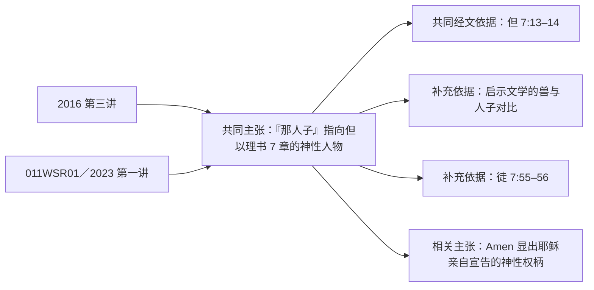

# 王守仁教授讲道语料第一遍普查：代表样本 v1

## 一、这一轮要回答什么

本轮不是根据少数讲道归纳王守仁教授完整的思想体系，而是先用一组有代表性的已发布讲道，验证第一遍普查的方法是否可靠：

1. 能否从一篇讲道中稳定辨认教授明确提出的主张、理由、经文依据、反对意见与释经方法；
2. 能否在不同讲道之间找出同一主张的重复、补充、变化与张力；
3. 能否保留足够精确的原文与时间定位，使每项归纳都可以回到讲道核查；
4. 能否以较低成本处理全部 205 篇讲道，而不在第一遍就过早建立庞大的论证图。

这里的产物称为“候选普查结果”。只有经过人工审核的结果，才可以成为后续论证层的可靠材料。

## 二、样本边界

- **来源范围：**只选自 `script_published`，不使用尚在 `script_review` 或 `script_patched` 的逐字稿。
- **样本数量：**15 篇。
- **选择原则：**兼顾年代、经卷、主题、讲道场合、文本质量、问答干扰程度及跨经文推理难度。
- **刻意保留的重复：**同一主张在不同讲道反复出现，不视为样本浪费；这正是验证“跨讲道思想整理”能力的关键材料。
- **不可据此下的结论：**不能仅凭这 15 篇宣布某项归纳就是教授完整、稳定或最终的神学立场。

## 三、15 篇代表样本

| # | 已发布逐字稿 | 主要覆盖 | 入选理由 |
|---|---|---|---|
| 1 | `Rev Wang-Friday Mar 16 2007.json` | 太 24–25、末世与圣殿被毁 | 较早期讲道；可测试历史语境、末世论争议及长篇连续释经。 |
| 2 | `2011 NYSC 專題：馬太福音釋經（二）2.json` | 登山宝训、新旧约与律法 | 由表面矛盾提出问题，再借“宗主—附庸之约”等背景建立答案，论证链清楚。 |
| 3 | `2016 NYSC 專題：馬太福音釋經（五）3.json` | 太 16:28–17、Amen、人子、但 7 | 已整理材料的基准样本；同时包含原文、跨经文论证、启示文学与讲课跳跃。 |
| 4 | `2016 NYSC 專題：馬太福音釋經（五）4.json` | 太 17 后续、时代论、Scofield、问答 | 教授重复、插问及离题最明显的压力测试；适合检验跨讲次去重与归并。 |
| 5 | `2017 NYSC 專題：馬太福音釋經（六）1.json` | 太 19、婚姻与离婚 | 可测试经文释义、伦理应用、听众互动及现场杂讯的分离。 |
| 6 | `2022年 NYSC 專題 馬太福音釋經（九）王守仁 教授  第二堂.json` | 律法、肉体、圣灵与罗 8 | 名义上属于马太福音系列，却大量跨入保罗书信；适合检验跨经文主题，而非依标题分类。 |
| 7 | `011WSR01.json` | 太 26、“人子”的神性、但 7、Amen | **核心样本。**教授明确反驳“人子只强调耶稣人性”，并以但 7:13–14、启示文学和徒 7:55–56论证“那人子”的神性身份。 |
| 8 | `2019-3-24 罗马书3章21至31节.json` | 神的义、耶稣的血、称义 | 检验保罗神学、救恩论命题与连续经文论证。 |
| 9 | `2019-4-14 罗4 1-25 因信成义.json` | 亚伯拉罕、信心与因信称义 | 可与罗 3 及其他讲道中的“信心”“义”“合宜关系”进行跨讲道聚合。 |
| 10 | `2019-08-18 罗6 與基督聯合.json` | 洗礼、与基督同死同复活、新生命 | 检验一项神学主题如何从经文解释进入生活应用。 |
| 11 | `2019-08-11 圣灵充满与理性.json` | 圣灵、人格与理性 | 主题讲道样本；可测试不依附单一经文段落的系统性论述。 |
| 12 | `2019-09-29 可4章10-12 耶穌恐怕人悔改嗎.json` | 比喻、翻译、语篇结构与难题解答 | 典型“问题—证据—回答”样本，可观察教授如何处理表面上困难的经文。 |
| 13 | `2019-10-20 利17章3-12徒 15章19-21基督徒可以吃血嗎mp4.json` | 利未记、使徒行传与基督徒伦理 | 跨两约及现实问题的高难度样本；检验经文之间的关系是否被准确保存。 |
| 14 | `2019-09-15 施洗约翰与耶稣mp4.json` | 施洗约翰与耶稣的关系 | 检验人物关系、救赎历史及多个福音书材料的综合。 |
| 15 | `S 211017 提後3 14-17 聖經的來源.json` | 圣经来源、默示、希腊文与释经原则 | 直接观察教授怎样理解圣经权威与原文，也是研究其释经方法的重要样本。 |

## 四、特设的跨讲道验证题：“人子的神性”

这一题不只用来确认两篇讲道都出现了“人子”一词，而要检验系统能否识别更深的关系：

普查时至少要区分：

- 两篇讲道完全重复的命题；
- 后一篇新增或展开的证据；
- 表述不同但实际等价的主张；
- 只有词语相同、思想上并不相同的内容；
- 编辑根据多篇材料作出的归纳，不能冒充教授原话。

## 五、样本通过标准

这组样本只有同时达到以下条件，才可以用相同方法扩大到全部已发布讲道，再扩展到其余已审核材料：

1. 每项候选主张都能回到准确的逐字稿片段和时间位置；
2. 经文依据与来源证据分别记录，不混为一谈；
3. 问题、回答、理由、反对意见和应用不会被错误合并；
4. 同一讲道内的重复可以合并，但不删除新增证据；
5. 跨讲道的重复可以聚合，同时保留每一次讲述的来源；
6. 无法确定的归组明确标为待人工确认；
7. 人工审核者能够在合理时间内理解并修正结果。

## 六、下一步

为这 15 篇定义统一的候选普查格式与提示词，然后先处理 `011WSR01`，用它与已经分析过的 2016 年第三讲进行第一次跨讲道对照。此时仍不生成教授完整的“思想体系”；目标是验证抽取和归并方法。
