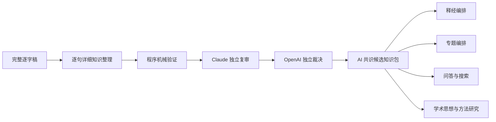
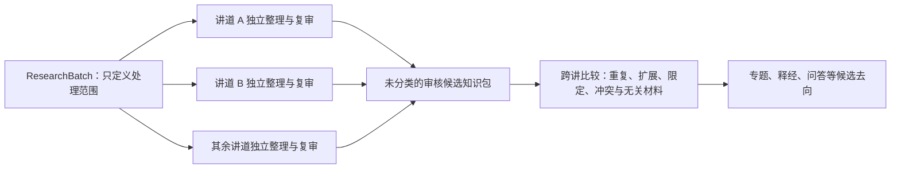

# 逐句详细知识整理与双模型复审流程 v1

> 状态：已完成代码实现，并以 `011WSR01` 的完整逐字稿进行真实试运行。本流程建立可审核的候选知识，不进行神学批评，也不自动批准或出版内容。

## 一、这一步解决什么问题

第一遍全库普查回答“二百多篇讲道大致讲了什么、哪些材料值得优先处理”。它提供广度，却不能直接承担出版、问答或思想研究所需的精确证据。

逐句详细知识整理回答另一组问题：

- 教授正在回答什么问题？
- 哪些话是教授自己的主张，哪些是听众发言或教授准备驳斥的观点？
- 教授用了哪些经文、原文、历史背景和推理步骤？
- 一条结论由哪些证据支持，主张之间又有什么关系？
- 每项内容能否回到逐字稿中的确切原话和时间位置？

它不是把讲道直接改写成文章，而是先建立一份可由释经、专题、问答、搜索和学术思想研究共同使用的候选知识子图。



## 二、模型选择

| 工作 | 默认模型 | 设置 | 原因 |
|---|---|---|---|
| 逐句详细知识整理 | `gpt-5.6-sol` | medium，32,000 output tokens | 需要长上下文、严格 JSON、精确归属和复杂论证关系；medium 是质量与成本的默认平衡点 |
| 独立来源忠实度复审 | `claude-sonnet-5` | 模型默认 adaptive thinking | 使用不同模型家族减少同源盲点；只审来源忠实度，不做神学批评 |
| OpenAI 仲裁 | `gpt-5.6-sol` | medium | 必须重新阅读同一来源，不能盲从 Claude |
| Claude 再审 | `claude-sonnet-5` | 同上 | 仅在 OpenAI 拒绝 Claude 意见时运行 |

只有来源异常复杂、模型持续分歧或结构判断特别困难时，才把单篇或单项升级为更高推理档位；不能把最高成本设置当作全库默认。

## 三、数据对象

一次详细整理产生以下对象，并为模型生成的短 ID 加入讲道命名空间，避免多篇讲道的 `CL001`、`E001` 相互冲突：

- `Question`：教授或听众实际提出的问题；
- `PositionNode`：教授转述并赞同、限定或反驳的立场；
- `Observation`：经文、原文、文体、上下文、历史文化等观察；
- `EvidenceStep`：教授论证中的证据或推理步骤；
- `Claim`：教授明确提出或由其论证直接支持的候选主张；
- `EvidenceRelation`：证据步骤之间的支持、回答、限定和反驳；
- `ClaimRelation`：主张之间的支持、解释、限定、反驳和发展关系；
- `SourceFragment`：绑定来源版本、段落版本和逐字引文的精确锚点。

所有模型输出默认是 `candidate`。AI 共识修正后的结果仍是 `not_human_approved`，不能因此自动公开出版。

## 四、程序机械闸门

在任何 AI 复审之前，程序先拒绝：

1. 不是逐字稿原文的 anchor；
2. 无法解析的段落定位；
3. 重复、缺失或悬空的对象 ID；
4. 指向不存在节点的关系；
5. 把听众、反方或非断言内容标成可支持教授主张的证据；
6. 没有证据的主张；
7. 来源、prompt、模型、生成设置或 schema 世代不一致的 cache。

抽取指纹包含来源 SHA256、prompt SHA256、模型 ID、reasoning effort、token budget、schema 版本及 response schema SHA256。旧结果在覆盖前归档，不能把不同抽取世代静默混合。

## 五、双模型复审与最小修正规则

Claude 必须重新阅读完整来源，并逐条检查说话者、立场、锚点、限定、遗漏和关系。Claude 的工作不是评论教授的神学是否正确。

Claude 提出的每项问题由 OpenAI 依据同一完整逐字稿独立裁决：

- OpenAI 接受：产生有界、可执行的版本化补丁并自动应用；
- OpenAI 拒绝：Claude 阅读其理由再审；
- Claude 撤回：保留原候选；
- Claude 仍坚持：只把这一项真实分歧交给人工。

补丁必须遵守**最小修正规则**：错误发生在哪一种对象，就修改哪一种对象。例如一条 `ClaimRelation` 错误时，应删除或更正该关系，不能为了保留错误关系而扩大教授的 Claim。补丁语言必须覆盖被审对象；无法用有界补丁表达的拆分、合并或编辑构思不得伪装成自动接受。

整个过程保留三层记录：原始抽取、独立复审与仲裁记录、应用共识补丁后的新候选包。任何一层都不静默覆盖上一层。

## 六、011WSR01 真实试运行

`011WSR01` 的原始逐句详细整理得到：

| 对象 | 数量 |
|---|---:|
| Source Fragment | 66 |
| Question | 8 |
| Position | 4 |
| Observation | 20 |
| Evidence Step | 37 |
| Claim | 17 |
| Evidence Relation | 26 |
| Claim Relation | 11 |

候选内容包括“那人子”的定冠词、但以理七章与神性身份、司提反异象、耶稣受死时间、逾越节、圣餐、新约及宗主国—附庸国之约等论证。

Claude 最终提出三项来源忠实度问题，OpenAI 全部独立接受并自动应用最小补丁：

1. 从一条主张中排除与亚那／该亚法无关的错误 anchor，并补入确切历史背景原话；
2. 删除一条错误的 `qualifies` 主张关系，而不扩大原主张；
3. 为逾越节杯与唱诗的陈述补入实际支持它的逐字来源。

结果为：3 项 `auto_applied`，0 项撤回，0 项持续分歧，0 项转人工。这个结果只说明本样本的来源忠实度分歧已解决，不表示其内容已经获得人工批准、神学认可或出版许可。

应用三项共识补丁后，审核候选包包含 68 个 `SourceFragment`、39 个 `EvidenceStep`、17 条 `Claim`、26 条证据关系和 10 条主张关系。增加的片段和证据来自两项来源修复；减少的一条主张关系是模型一致同意删除的错误关系。原始抽取包、复审记录、仲裁记录、补丁和审核候选包均分别保留。

### 接入共享知识模型

审核候选包已经接入 `shared_knowledge_pilot_v1.json`，不是停留在单篇讲道的孤立输出中。当前共享包包括：

- 2016 NYSC 第三、第四讲的既有详细论证资料；
- `011WSR01` 的双模型共识候选资料；
- 共 3 个来源、47 条候选主张、182 个证据步骤、151 条证据关系和 17 条主张关系。

17 条主张全部进入独立的 `CP-matthew-26-1-30-011` 释经编排：正文按太26:1–30的经文顺序处理受难预告、领袖密谋、伯大尼膏抹、犹大出卖、逾越节筵席、背叛预告和圣餐；约论进入背景附录，司提反异象所引出的救恩论主张明确转介其他专题，不强塞进正文。`DK-f0eac41a4244-CL001` 与 `DK-f0eac41a4244-CL002` 同时连接到“那人子”专题，其中第一条服务 `CD-SON-001` 与 `CD-SON-002`。这验证了同一主张可以同时服务释经和专题，却分别保存编排决定。

审核 UI 会显示这些新增主张、AI 复审结论、精确时间链接、证据关系、主张关系及专题编排去向。AI 已无分歧的项目标记为 `ai_cleared`；这只减少人工来源忠实度复核，不等于自动批准出版。

## 七、运行方式

生成单篇详细知识包：

```bash
PYTHONPATH=. .venv/bin/python -m backend.pipeline.detailed_knowledge_extraction_runner \
  --ids 011WSR01
```

用 Claude 审阅指定候选包：

```bash
PYTHONPATH=. .venv/bin/python -m backend.pipeline.corpus_ai_review_runner \
  --claim-layer-package "$DATA_BASE_DIR/wang-knowledge-platform/staging/claim-layer/detailed-extractions/011WSR01-f0eac41a4244.detailed-knowledge.json" \
  --claim-layer-output "$DATA_BASE_DIR/wang-knowledge-platform/staging/claim-layer/detailed-extractions/011WSR01-f0eac41a4244.independent-review.json" \
  --spot-check-percent 0
```

随后运行 OpenAI 仲裁，并把共识补丁应用为新候选包：

```bash
PYTHONPATH=. .venv/bin/python -m backend.pipeline.corpus_ai_adjudication_runner \
  --package "$DATA_BASE_DIR/wang-knowledge-platform/staging/claim-layer/detailed-extractions/011WSR01-f0eac41a4244.detailed-knowledge.json" \
  --review "$DATA_BASE_DIR/wang-knowledge-platform/staging/claim-layer/detailed-extractions/011WSR01-f0eac41a4244.independent-review.json" \
  --output "$DATA_BASE_DIR/wang-knowledge-platform/staging/claim-layer/detailed-extractions/011WSR01-f0eac41a4244.adjudication.json" \
  --overrides "$DATA_BASE_DIR/wang-knowledge-platform/staging/claim-layer/detailed-extractions/011WSR01-f0eac41a4244.overrides.json"

PYTHONPATH=. .venv/bin/python -m backend.pipeline.knowledge_consensus_applier \
  --package "$DATA_BASE_DIR/wang-knowledge-platform/staging/claim-layer/detailed-extractions/011WSR01-f0eac41a4244.detailed-knowledge.json" \
  --overrides "$DATA_BASE_DIR/wang-knowledge-platform/staging/claim-layer/detailed-extractions/011WSR01-f0eac41a4244.overrides.json" \
  --output "$DATA_BASE_DIR/wang-knowledge-platform/staging/claim-layer/detailed-extractions/011WSR01-f0eac41a4244.reviewed-candidate.json"
```

## 八、中立 ResearchBatch：批次不是专题

当多篇讲道因为检索词、经文或研究问题而被选中时，系统先把它们登记为 `ResearchBatch`。`ResearchBatch` 只是一次可恢复的处理队列，不是神学分类，也不表示其中材料必然属于同一专题。

例如“约与律法”验证批次目前包括五篇讲道。选择它们只说明这些材料值得一起比较；系统不得预先写入“约”这个 canonical topic。每篇讲道必须先独立完成逐句详细知识整理、Claude 来源忠实度复审、OpenAI 仲裁和共识补丁应用，然后才把审核候选合并为一个**尚未分类**的研究包。



批次 schema 强制：

- `semantic_assumption` 必须为 `none`；
- 不允许预先填写 `topic_id`、`target_topic_id` 或类似语义归属；
- 必须允许材料保持 `unassigned`，也允许一条主张进入多个候选专题；
- 合并结果的 `topic_candidates` 与 `knowledge_routes` 初始为空；
- 只有后续跨讲比较才能提出候选去向，候选去向仍不等于人工批准。

当前中立批次配置位于 `backend/pipeline/research_batches/covenant_law_validation_01.json`。执行计划可先 dry-run，不调用任何模型：

```bash
PYTHONPATH=. .venv/bin/python -m backend.pipeline.research_batch_runner \
  --batch backend/pipeline/research_batches/covenant_law_validation_01.json \
  --dry-run
```

实际执行可用 `--stage extract|review|adjudicate|apply|merge` 分阶段恢复，也可使用默认 `all`。抽取、复审与仲裁都以来源、prompt、模型和 schema 指纹判断是否可以跳过；相同世代不会重复消耗模型调用。`--force` 只应用于明确要求重做的抽取与 Claude 复审。

代码现在已经覆盖到“生成未分类审核候选研究包”以及“跨讲主张比较与双模型归并”。后者只建立 `duplicate / supports / extends / qualifies / contrasts / supersedes / unrelated` 关系，并允许材料保持 `unassigned`；它仍不自动建立专题目录。完整规则与五篇实测见 [跨讲道主张比较与双模型归并流程 v1](./cross_sermon_relation_workflow_v1.md)。专题候选归纳、产品路由、篇章编排与出版审核是更下游的独立流程，不能由批次名称偷渡完成。

## 九、代码位置

- 抽取 schema 与验证：`backend/pipeline/detailed_knowledge_extraction.py`
- 抽取 runner：`backend/pipeline/detailed_knowledge_extraction_runner.py`
- 抽取 prompt：`backend/pipeline/prompts/detailed_knowledge_extraction.md`
- Claude 复审：`backend/pipeline/corpus_ai_review.py`、`corpus_ai_review_runner.py`
- OpenAI 仲裁：`backend/pipeline/corpus_ai_adjudication.py`、`corpus_ai_adjudication_runner.py`
- 共识补丁应用：`backend/pipeline/knowledge_consensus_applier.py`
- 中立批次 schema 与合并：`backend/pipeline/research_batch.py`
- 中立批次 runner：`backend/pipeline/research_batch_runner.py`
- 首个验证批次：`backend/pipeline/research_batches/covenant_law_validation_01.json`
- 跨讲关系 schema 与共识应用：`backend/pipeline/cross_sermon_relation.py`
- 跨讲关系 runner：`backend/pipeline/cross_sermon_relation_runner.py`
- 跨讲关系测试：`backend/tests/test_cross_sermon_relation.py`
- 接入共享模型与产品路由：`backend/pipeline/shared_knowledge_pilot.py`
- 太26释经编排：`$DATA_BASE_DIR/wang-knowledge-platform/staging/claim-layer/composition_plan_matthew_26_1_30_011.json`
- 审核 API：`backend/api/thought_review.py`
- 测试：`backend/tests/test_detailed_knowledge_extraction.py`、`test_corpus_ai_review.py`、`test_corpus_ai_adjudication.py`
