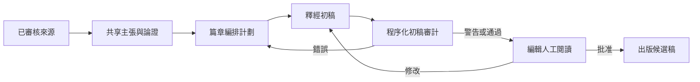
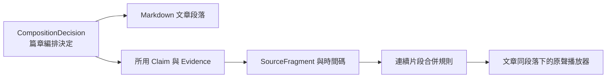

# 釋經初稿的程序化審計流程 v1

**狀態**：已實作並以《馬太福音》16:1–12 完成端到端驗證
**里程碑日期**：2026-08-14

## 一、目的

釋經文章不是共享知識庫的機械輸出，而是編輯部根據已審核來源、共享主張與篇章編排計劃完成的新作品。因此，文章可以有編輯判斷，卻不能在寫作過程中脫離已核查的論證與來源。

本流程在「篇章編排計劃」與「人工閱讀初稿」之間增加一個可重跑的程序化審計階段，回答六個基本問題：

1. 編排計劃要求處理的每個段落，是否真的進入初稿；
2. 初稿使用的每條共享主張，是否仍存在於指定的知識快照；
3. 每條主張是否至少有一項可支持教授立場的合格證據；
4. 文章引用的來源錨點是否仍可回到正確版本的筆記講稿或逐字稿；
5. 正文每個實質段落是否都能反向映射到教授主張、聖經原文或明示的編輯聲音；
6. 文章結構是否符合由系統中央維護的 Publication Profile，而不是由本稿自行指定審核項目。

它不判斷文筆是否優美，也不代替編輯對神學表述、詳略、邏輯與生活應用的閱讀判斷。

## 二、在整體流程中的位置



這是第一個完整跑通的流程閉環：

> `CompositionPlan → Draft → 論證與來源程序化審計 → UI 審閱`

## 三、輸入

審計器只讀明確指定的資料，不依靠文章標題相似度猜測：

- `editorial-draft-manifest.json`：初稿、編排計劃、知識快照與 `publication_profile_id` 的明確綁定；Manifest 只能選擇 Profile，不能自行定義必備或可選章節；
- `backend/config/publication_profiles/<profile_id>.json`：由系統中央維護的出版結構、逐段歸屬政策與可接受的編輯標籤；
- `material_dispositions`：记录未进入正文的实质材料为何被转附录、转专题、仅保留来源或明确排除；尚未认证的材料可绑定带内容指纹的 staged knowledge record，但必须进入人工认证队列；
- 篇章編排計劃：穩定的 `decision_id`、標題映射與 `source_claim_ids`；
- 共享知識快照：Claim、EvidenceStep、SourceFragment、KnowledgeRoute；
- Markdown 初稿：保留核心出版结构，并按材料选择生活应用与附录。

Manifest 中必須明確列出每項編排決定在初稿中對應的 Markdown 標題。系統不得以模糊比對推斷「大概已經寫了」。

## 四、程序化檢查

### 4.1 文章結構

文章結構由中央 Publication Profile 決定，不得由被審核稿件自己的 Manifest 決定。目前《馬太福音》釋經 Profile 要求初稿包含：

- `經文與問題`
- `釋經`
- `神學意義`

`經文與問題` 是编辑导读层，必须交代经文范围和本文实际回答的问题，并明确标示编辑归属，不能伪装成教授原话。

`生活應用` 与 `附錄` 是可选结构：只有存在合格、相关的材料时才收入，不得为了栏目齐整生成填充文字。未收入文章的实质材料仍必须具有明确的 `material_disposition`。

若 Manifest 出現 `required_top_level_sections` 或 `optional_top_level_sections`，審計直接報錯 `manifest_publication_structure_override`。這防止寫作方同時決定「交甚麼答案」和「考甚麼項目」。Profile 的修訂必須獨立版本化並接受設計審核。

### 4.2 編排覆蓋

- 每個要求成文的 `CompositionDecision` 必須有穩定 ID；
- 每個 ID 必須映射到一個實際存在的 Markdown 標題；
- 缺少段落、重複映射或無法定位時，審計失敗。

### 4.2.1 經文引文與原文資料

凡正文實際解釋、比較或用作論據的經文，必須在相應小節就近引出經文內容，不能只留下章節號讓讀者另行查找。Manifest 以 `required_scripture_quotations` 登記每個小節必須出現的經文標記；小節不存在或引文標記缺失時，分別產生 `missing_scripture_quote_scope` 或 `missing_scripture_quotation` 錯誤。

王教授有來源支持的希臘文詞義、文法、定冠詞與翻譯判斷，是其釋經方法的重要部分，應優先保留希臘文形式、教授的解釋及其論證功能。編輯不得為了文字流暢刪去，也不得自行補造教授未講過的字義或文法結論。

### 4.3 主張完整性

- 編排計劃引用的每個 `claim_id` 必須存在於指定知識快照；
- 不能因為文章讀起來順暢，就靜默略過計劃中的主張；
- 無法解析的主張 ID 是錯誤，不是警告。

### 4.4 證據資格

每條進入文章的主張，至少需要一項符合以下條件的支持證據：

- 說話者與立場可確認；
- `support_eligibility` 允許支持教授主張；
- 引文及來源錨點有效；
- 來源版本未過期。

背景、聽眾提問、反方立場等 `contextual_only` 材料可以同時存在，但不能單獨支撐教授主張。這項規則避免把「有上下文」誤當成「有證據」。

### 4.5 來源版本與錨點

每個被使用的 `SourceFragment` 必須通過：

- canonical source 存在；
- paragraph 存在；
- paragraph hash 與綁定版本一致；
- 引文仍為原文中的逐字片段；
- char offset 與重新定位結果一致。

若逐字稿或筆記講稿後來被修改，舊錨點不能因為「仍可顯示某段文字」而被視為有效。

### 4.6 段內歸屬與編輯聲音

「整個小節掛有合格主張」不等於「小節裡的每一個解釋性句子都由這些主張支持」。審計必須把兩件事分開：

1. 小節所採用的教授主張是否有合格證據；
2. 為交代經文次序、補足銜接或說明材料缺口而加入的編輯推論，是否明示為編輯部的聲音。

審計不再等待寫作方申報 `editorial_boundary.required = true`。它按照 Publication Profile，對 `經文與問題 / 釋經 / 神學意義 / 生活應用 / 附錄` 中的**每一個實質段落**進行無條件反向檢查。每段之前必須有機器可讀的來源標記，並符合三類之一：

- `professor`：必須列出實際存在的 `claim_ids`；
- `scripture`：必須列出本段直接引用的 `scripture_refs`；
- `editor`：正文中必須同時顯示 Profile 允許的編輯標籤，例如「編輯說明」「編輯導讀」「編者按」或「資料說明」。

沒有來源標記、教授段落沒有主張、引用段落沒有經文編號，或編輯段落沒有可見標籤，都是硬錯誤。篇章計劃中的 `editorial_boundary` 仍可補充某一節的特殊標籤和理由，但它只是額外約束，不再是啟動審查的前提。

讀者至少必須能分辨三種聲音：

- 教授在來源中明確提出的釋經或神學主張；
- 聖經經文本身所說的內容；
- 編輯部為篇章完整性所作的摘要、銜接或推論。

太16:2–4 是本規則的首個回歸案例。教授在現有材料中誦讀了「天色」經文，卻沒有展開「人有觀察和推理能力」這項解釋。原初稿雖在同一小節使用了兩條有證據的主張，但兩條主張只支持「耶穌拒絕表演式神蹟」及「約拿的神蹟」，不能回頭支撐關於天色的編輯推論。修訂稿因此刪除這項沒有來源的解釋，只以明示的「編輯說明」交代材料邊界，保留經文本身，然後轉入教授確實展開的論述。

這項回歸不依賴太16:2–4 被預先登記為特殊案例；同類型的未映射段落無論出現在哪一章，都會由相同規則攔截。

#### 4.6.1 溯源標記的儲存與顯示邊界

`<!-- provenance: {...} -->` 是供審計器讀取的內部機器標記，不是文章正文。它必須保存在 Markdown 源文件中，讓系統能逐段核對教授主張、聖經引文與編輯聲音；但管理端閱讀預覽、公開頁面、Word/PDF 匯出及其他面向讀者的呈現，都不得把這段原始標記顯示為文字。

兩個層次不得混淆：

- **機器歸屬**：由隱藏的 provenance 註解保存 `attribution`、`claim_ids` 或 `scripture_refs`；
- **讀者可見歸屬**：編輯補充仍須在正文中明示「編輯說明」「編輯導讀」「編者按」或「資料說明」，不能以隱藏註解代替。

因此，閱讀介面在交給 Markdown renderer 之前，必須只從顯示副本中移除 provenance 註解，不得修改或覆寫原始 Markdown。回歸測試至少要確認：頁面看不到 `<!-- provenance:`，而其後的編輯導讀、經文與正文仍正常顯示。

### 4.6.2 生活應用推論鏈

`生活應用` 不是必備欄目。若文章保留此欄目，Manifest 必須在 `application_chains` 中逐項登記：

```text
經文處境
  → 教授解釋（claim IDs）
  → 不變原則
  → 今日處境
  → 應用與限制
```

任何一步缺失，或引用了不存在的教授主張，均為硬錯誤。若現有材料沒有形成完整且與本段高度相關的推論鏈，正確處理是省略生活應用，而不是讓 AI 生成一段看似合理的勸勉；未採用的來源材料仍按 `material_dispositions` 保存，不得從知識庫消失。

### 4.7 專題轉介

若初稿把深入內容轉介至專題，審計器檢查 `KnowledgeRoute` 和目標連結：

- 已存在且可解析：通過；
- 明確保留的 placeholder：警告；
- 計劃要求轉介但完全沒有路由：錯誤。

## 五、結果分級

| 狀態 | 意義 | 下一步 |
| --- | --- | --- |
| `pass` | 所有程序化條件通過 | 進入編輯閱讀 |
| `pass_with_warnings` | 核心論證與來源合格，但仍有明確待辦 | 可閱讀與修改，不可忽略警告 |
| `fail` | 缺段落、缺主張、無合格證據或來源失效 | 返回上游修復 |

程序化審計的通過，不等於文章取得出版批准。

## 六、《馬太福音》16:1–12 驗證結果

首個驗證稿為：

- Draft：`DRAFT-M16-001-V1`
- 經文：太16:1–12
- 結果：`pass_with_warnings`

| 檢查項 | 結果 |
| --- | ---: |
| 編排決定 | 6 / 6 已定位 |
| 共享主張 | 14 條 |
| 證據步驟 | 25 條 |
| 來源片段 | 27 條 |
| 有效來源片段 | 27 條 |
| 實質正文段落 | 32 段 |
| 已通過反向歸屬檢查 | 32 段 |
| 教授觀點段落 | 17 段 |
| 經文引文段落 | 7 段 |
| 編輯聲音段落 | 8 段 |
| 錯誤 | 0 |
| 警告 | 2 |

兩項警告都是尚未完成的專題連結：

1. 「小信」專題；
2. 「神蹟、聖經與信仰判斷」專題。

這表示初稿的每個實質段落都已通過反向歸屬檢查，段落、主張、支持證據和來源版本已形成完整可追溯鏈；同時，文章所遵循的必備與可選結構已由中央 Publication Profile 驗證。專題產品尚未完成，正文目前只能保留明確的待辦轉介。

## 七、文章與原聲講解的同序投影

讀者若想直接聽王教授的原始講解，不應離開文章後再從一小時講道中自行尋找，也不應面對一串按 citation 切碎的幾秒鐘音訊。原聲呈現必須服從與文章相同的篇章編排：文章讀到哪一節，該節下方就提供支撐同一編排決定的原聲片段。



### 7.1 資料歸屬

- 每個 `CompositionDecision` 可保存一組 `source_presentations`，記錄來源、逐字稿、起訖時間、來源片段、證據步驟和主張 ID；
- `editorial-draft-manifest.json` 以 `presentation_package_path` 把文章綁定到同一份共享知識包；
- Manifest 已有的 `decision_id → markdown_heading` 映射，同時決定原聲播放器應出現在哪個文章段落；
- 資料庫保存穩定來源 ID 與時間範圍，不保存容易變動的部署 URL；API 在讀取時解析目前有效的 audio/video URL。

原聲投影不是新的知識層，也不能建立一套只供播放器使用的私有語義。它只是把同一篇章決定已採用的可核查來源，轉成讀者可以播放的呈現方式。

### 7.2 片段完整性規則

1. 同一講道中相鄰或重疊、共同支持同一文章段落的證據，合併成一段有完整語意的連續播放範圍；
2. 若同一段文章必須由講道中數處不連續材料共同支持，保留為小型 `segment_group`，依原講道時間順序播放；
3. 不得把不連續的原聲剪接成看似教授一次連續說出的話；
4. 不採用「一條 citation 一個播放器」的碎片化呈現；片段邊界以一個完整解釋動作為準，而不是越短越好；
5. 只有筆記整理講稿、沒有可播放媒體的段落，明確標示暫無原聲，不得生成或假造音訊；
6. 原聲只證明教授在來源中說了什麼；文章的順序、標題與詳略仍屬編輯部的篇章安排。

### 7.3 太16:1–12 的實作結果

首個示範已把 `2016 NYSC 專題：馬太福音釋經（四）1` 的原聲投影到 `DRAFT-M16-001-V1`：

| 項目 | 結果 |
| --- | ---: |
| 編排決定 | 6 |
| 有可播放原聲的編排決定 | 4 |
| 播放時間範圍 | 6 |
| 只有筆記講稿、暫無原聲的編排決定 | 2 |

其中太16:8–10 需要三段不連續原聲共同支持，UI 依原講道次序列出，不把它們偽裝成一段連續錄音。文章仍是主要閱讀入口；「聽王教授原聲講解」放在對應段落內，讓讀者在不離開文章邏輯的情況下核對和聆聽教授本人。

## 八、仍須由編輯判斷的內容

程序不應替代以下判斷：

- 問題是否被清楚回答；
- 六個經文單元之間的邏輯是否容易理解；
- 「神蹟與聖經」的神學說明是否過長或過短；
- 撒都該人背景是否只保留正文必需的一句；
- 「籃子／筐子」是否只作跨章短注並轉介到五餅二魚的主要段落；
- 生活應用是否真的由本段釋經推出；
- 語氣是否平和，且沒有把編輯綜合寫成教授原話。

## 九、執行方式

```bash
PYTHONPATH=. .venv/bin/python -m backend.pipeline.editorial_draft_audit_runner \
  --manifest output/claim-layer/matthew-16-notes/sermon-4-1-comparison/editorial-draft-manifest.json \
  --draft-id DRAFT-M16-001-V1
```

產物：

```text
output/claim-layer/matthew-16-notes/sermon-4-1-comparison/editorial-draft-audit.json
```

管理員 UI 在打開初稿時會即時計算一次，避免展示與當前 Markdown、編排計劃或知識快照不一致的舊報告。

## 十、可重用性與邊界

這不是太16:1–12 的一次性腳本。後續經文單元只需建立同一格式的 manifest、編排決定和標題映射，即可使用相同 runner 與 UI。

《馬太福音》工程不得另外建立私有論證資料；初稿審計只能讀共享 Claim、Evidence、SourceFragment、Route 和 CompositionPlan。若審計發現主張或來源錯誤，修復共享知識；若只是文章順序、詳略或措辭問題，修復篇章計劃或初稿。
