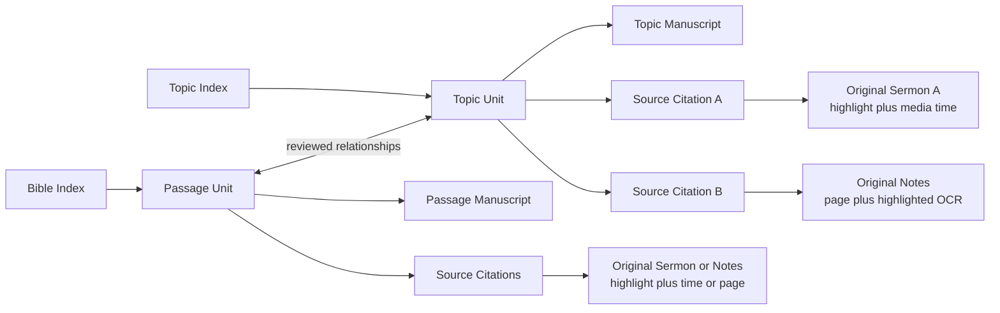

# Functional Specification: Exegesis and Topic Repository

> Project mission and plain-language explanation: [王守仁教授釋經與專題講論文庫 Mission Statement](./project_mission_statement.md)
>
> Cross-product knowledge architecture, argument graph, original-language records, QA contract, permissions, and evolution rules: [王守仁教授释经与思想知识平台设计](./knowledge_platform_design.md)

## 1. Purpose

The Exegesis and Topic Repository reorganizes Dr. Wang's notes, lectures, sermons, and generated manuscripts into a durable reader-facing knowledge collection. Its larger mission is not merely to reformat more than 200 sermons, but to preserve what Dr. Wang said, reconstruct how his Scripture evidence and reasoning support his claims, identify recurring interpretive patterns, and use that reviewed foundation to create coherent exegesis, topic studies, and evidence-backed answers. It is not organized primarily by teaching event, conference, Lecture, or Project. Instead, it presents the same reviewed canonical units through two complementary indexes:

1. a Bible index from Genesis through Revelation; and
2. a theological topic index containing concepts such as dispensationalism, the deity of Christ, justification, faith, and hermeneutics.

Every published unit contains a readable manuscript and one or more traceable links to the exact source fragments from which the manuscript was derived. A source link must open the original sermon transcript or notes source, position the reader at the relevant fragment, and highlight that fragment. Opening only the top of a complete source document does not satisfy this requirement.

The repository is also the reviewed knowledge foundation for evidence-backed QA, original-language search, thought-development comparison, and future study tools. Canonical manuscripts are publication projections over reviewed claims and evidence; they are not the only machine-readable representation of Dr. Wang's teaching.

## 2. Problem Statement

Dr. Wang's teaching frequently combines verse-by-verse exegesis, theological synthesis, applications, historical comments, questions, and personal examples in a non-linear order. The same argument may be repeated, extended, corrected, or illustrated in several lectures. Preserving lecture order therefore produces unnecessary repetition and weakens the logic of a reader-facing manuscript.

The repository solves three related problems:

* **Editorial structure**: preserve Dr. Wang's thought without preserving the accidental sequence of a live lecture.
* **Dual discovery**: let readers begin with either a biblical passage or a theological topic.
* **Source traceability**: let readers inspect the exact sermon or notes fragment supporting a unit, including its original context and media time when available.

## 3. Product Principles

### 3.1. Canonical unit, not lecture, is the reading unit

A Project remains the production, review, and audit boundary. A canonical unit is the long-term editorial and reader-facing unit. One Project may create several canonical units, and one canonical unit may combine evidence from several Projects, lectures, dates, or venues.

### 3.2. Bible and topic views are indexes over the same repository

The Bible index and topic index must not create duplicate manuscripts. A unit has one authoritative manuscript and can appear in multiple index locations.

### 3.3. Exegesis may contain theology

Passage units may include theology necessary to explain the passage. Topic units synthesize arguments that cross passages or recur across multiple sources. The distinction is organizational, not a rule that theology must be removed from exegesis.

### 3.4. Source links are fragment-level citations

Both passage units and topic units use the same citation capability:

* original sermon transcript with highlighted text;
* audio or video positioned at the relevant start time;
* original notes page with the relevant OCR text highlighted; and
* enough surrounding context to evaluate the quotation or argument.

### 3.5. Repetition is consolidated, not erased

When a later lecture repeats an existing idea without adding substance, the existing canonical unit remains unchanged and the repeated source may be recorded as an additional occurrence. When the later lecture adds Scripture, reasoning, qualification, or correction, the canonical unit is extended and both sources remain visible.

### 3.6. Editorial decisions are reviewable

AI may propose unit boundaries, topic assignments, duplicate relationships, and source fragments. Publication requires human review. Low-confidence classification or unresolved source mapping must remain visible rather than being silently accepted.

### 3.7. Knowledge graph before product projection

Questions, claims, opposed views, Scripture evidence, original-language judgments, qualifications, applications, and cross-sermon relations are stored independently of any one article. Passage manuscripts, topic manuscripts, QA answers, search results, timelines, and study materials are projections over that shared reviewed knowledge.

### 3.8. QA is claim-grounded, not transcript-only RAG

Keyword, passage, and vector retrieval may discover candidate evidence. A public answer must use approved claim relationships to distinguish Dr. Wang's position from a quoted opposing view, connect questions to answers, include later qualifications, and resolve citations to exact sources. When approved evidence is insufficient, the system reports that limitation rather than supplying an answer from general model knowledge.

### 3.9. The thought map remains open

The current candidate thought trunks do not constrain later sermons. Editors may add, extend, promote, demote, split, merge, mark tension, or supersede nodes. Every change preserves evidence, reason, prior revision, and review state.

## 4. Users and Permissions

### Reader

* Browses by Bible passage or topic.
* Reads the canonical manuscript.
* Opens related passage and topic units.
* Opens exact source fragments and their surrounding context.
* Seeks sermon media to the cited time.
* Asks passage, topic, source-location, original-language, and comparison questions.
* Sees whether an answer is Dr. Wang's explicit claim, a reasoning conclusion, an editorial synthesis, fact-check pending, or evidence insufficient.

### Editor

* Reviews candidate canonical units.
* Confirms whether a unit is passage-led or topic-led.
* Confirms Bible references and topic taxonomy assignments.
* Reviews, adjusts, adds, or removes source citations.
* Resolves stale or ambiguous citations.
* Publishes units and refreshes repository indexes.
* Reviews candidate questions, claims, relations, original-language judgments, and thought-map revisions.
* Separates faithful representation of Dr. Wang's claim from later language, history, or theological fact checking.

### Administrator

* Manages repository builds and source-map jobs.
* Reviews failed or stale source mappings.
* Controls access to unpublished transcripts and notes.
* Can rebuild derived indexes without changing manuscripts or editorial decisions.

## 5. Scope

### Included in the initial release

* Global repository independent of an individual Series page.
* Bible and topic indexes over shared canonical units.
* Passage and topic unit detail pages.
* Manuscript, Sources, and Related Units views.
* Multiple source citations per unit.
* Transcript paragraph highlighting and media time positioning.
* Notes page selection and highlighted OCR text.
* Local relationship visualization centered on the selected unit.
* Editorial source review and publication gating.
* Migration of the existing Matthew seed catalog and transcript Projects.

### Included in the knowledge-platform target

* A reviewed question, claim, relation, Scripture-evidence, original-language, application, and revision store.
* Claim-aware passage and topic projections.
* Evidence-backed public QA and a clearly marked internal research mode.
* Original-language and translation-criticism browsing.
* Cross-sermon repetition, extension, qualification, tension, and development views.
* Reusable knowledge projections for study guides and future course tools.

### Explicitly out of scope for the initial release

* Replacing the existing Series, Lecture, or Project production workflow.
* Automatically publishing AI-proposed units without editor review.
* Displaying a single global graph containing every unit and source.
* Requiring image-coordinate highlighting on handwritten notes in the first release. The first release shows the correct source image beside highlighted OCR text. Image overlay coordinates may be added later.
* Treating a generated manuscript or Google Doc as an original source. These are derived editorial artifacts and do not satisfy the source requirement.

## 6. Domain Concepts

### 6.1. Canonical unit

A reviewed editorial article with a stable ID, title, manuscript, classifications, and sources.

Required properties:

* stable unit ID;
* title;
* unit type: `passage` or `concept`;
* publication status;
* authoritative manuscript location;
* primary Bible references, if applicable;
* zero or more topic taxonomy paths;
* related unit relationships; and
* at least one approved source citation or an explicit approved exception.

### 6.2. Passage unit

A unit whose primary organizing question is the interpretation of a sustained biblical passage. It may contain necessary theological significance and application.

### 6.3. Topic unit

A unit whose primary organizing question crosses passages, lectures, or occasions. A topic unit may cite many sermon and notes fragments and must have the same highlight and media-positioning behavior as a passage unit.

### 6.4. Source document

An original sermon transcript, sermon recording, or notes source. Source documents have stable IDs and version hashes.

### 6.5. Source fragment

A precise region within a source document. For transcripts this includes paragraph identity, exact highlighted text, and time information. For notes it includes the source page, exact OCR text, and text range.

### 6.6. Citation

A stable, shareable record connecting a source fragment to one or more canonical units. A citation records what the fragment supports, not merely where the source document is stored.

### 6.7. Unit relationship

A reviewed connection between two canonical units. Initial relationship types are:

* `related_topic`;
* `related_passage`;
* `explains`;
* `supported_by`;
* `background_for`;
* `contrasts_with`; and
* `supersedes`.

### 6.8. Question

A source-grounded interpretive, theological, audience, or editorial question. It records who asked it, the source anchor, applicable passages/topics, answer status, and the claim IDs that answer it. Important unanswered questions remain visible.

### 6.9. Claim

The smallest reviewable proposition that can be supported, opposed, qualified, applied, repeated, extended, or placed in tension. Claim types distinguish explicit claims, reasoning conclusions, interpretive methods, opposed views, applications, editorial syntheses, and open questions. Claims have stable repository-wide IDs and do not inherit identity from a manuscript heading.

### 6.10. Claim relationship

A reviewed directed relation between claims. Supported types include `supports`, `answers`, `opposes`, `qualifies`, `applies`, `repeats`, `extends`, `tension`, `supersedes`, and `editorial_inference`. The relation records its reason, sources, review state, and revision.

### 6.11. Original-language judgment

A structured record of Dr. Wang's Hebrew, Aramaic, or Greek argument and any translation criticism. It preserves the biblical reference, source-language form, grammatical or semantic issue, target translation, Dr. Wang's proposed rendering, reasons, interpretive effect, exact source, representation review, and separate fact-check state.

### 6.12. Thought-map revision

An auditable change that adds, extends, promotes, demotes, splits, merges, marks tension, or supersedes a thought node. Superseded records remain available for history and rollback.

### 6.13. Answer evidence bundle

The bounded, permission-filtered collection used to answer one question. It contains selected question/claim IDs, traversed relationships, approved citations, attribution labels, unresolved issues, and related units. The generated prose is not itself the evidence bundle.

## 7. Information Architecture

## 8. Reader Workflows

### 8.1. Browse by Bible

1. The reader opens **按聖經**.
2. The reader selects a book and chapter.
3. The UI lists passage units in canonical verse order.
4. Each result displays passage range, title, related-topic count, source count, and publication state.
5. Selecting a result opens the canonical unit page.

Books or chapters with no published material remain visible and display an empty state rather than disappearing from the biblical canon.

### 8.2. Browse by topic

1. The reader opens **按主題**.
2. The reader expands the reviewed two-level taxonomy.
3. The UI lists units assigned to the selected topic.
4. A unit may appear under more than one topic path without creating a duplicate manuscript.
5. Selecting a result opens the same canonical unit page used by Bible browsing.

### 8.3. Read a canonical unit

The unit page provides three primary views:

* **Manuscript**: the readable article, retaining `釋經`, `神學意義`, `生活應用`, and `附錄` only when they contain substantive content.
* **來源與證據**: approved source fragments grouped by source document and ordered by editorial role or teaching date.
* **關聯單元**: related passage and topic units.

The page header displays the unit type, Bible references, topic paths, source count, and publication state.

### 8.4. Inspect a sermon source

1. The reader selects a sermon citation.
2. The sermon page opens or a source drawer appears.
3. The UI scrolls to the cited transcript paragraph.
4. The exact cited text is highlighted.
5. One preceding and one following paragraph are available as context.
6. If media timing exists, the player seeks to the citation start time but does not autoplay without user action.
7. The reader may expand to the complete sermon.

### 8.5. Inspect a notes source

1. The reader selects a notes citation.
2. The notes reader opens the correct scanned page.
3. The source image is displayed beside or above its OCR text.
4. The cited OCR text is highlighted and scrolled into view.
5. The reader may view adjacent pages.

### 8.6. Explore relationships

The relationship view is centered on the selected unit. It shows only direct passage, topic, and source relationships. It must not render the complete repository as an unreadable graph.

Selecting a related-unit node opens that unit. Selecting a source node opens the citation preview.

### 8.7. Ask an evidence-backed question

1. The reader asks a passage, topic, original-language, comparison, application, or source-location question.
2. The system identifies question intent, Bible references, topic terms, time comparison, and requested answer depth.
3. Retrieval finds candidate units, claims, original-language judgments, and source occurrences.
4. The system traverses approved relationships to collect answers, supporting reasons, opposed views, qualifications, tensions, and exact citations.
5. Access control removes restricted material before answer generation.
6. Sources and direct claims appear before or while answer prose streams.
7. The response distinguishes Dr. Wang's explicit claim, reasoning conclusion, editorial synthesis, pending fact check, different expression, and insufficient evidence.
8. The reader may open the exact highlighted source, related passage unit, or topic study.

The answer must not infer Dr. Wang's position from a topically similar transcript fragment alone. If a candidate fragment is an opposed view, unanswered question, or non-substantive classroom exchange, it cannot become the answer without a reviewed relationship establishing its role.

### 8.8. Browse original-language and translation judgments

The reader or authorized researcher can browse by Bible reference, source-language term, target translation, sermon, theological effect, and fact-check state. Each record displays:

* the source-language form and transliteration when available;
* the Chinese translation under discussion;
* Dr. Wang's proposed rendering;
* his lexical, grammatical, contextual, and cross-reference reasons;
* the interpretive or theological conclusions affected;
* exact source fragments and media time; and
* a separately labeled independent fact-check result, when one exists.

Faithful representation approval does not imply independent linguistic correctness.

### 8.9. Compare teaching across time

The reader or researcher selects a claim or topic and sees occurrences ordered by date. The comparison distinguishes stable repetition, added evidence, extension, qualification, application, unresolved tension, and supersession. Frequency is displayed as evidence, not as the sole measure of importance.

## 9. Editorial Workflows

### 9.1. Create or update a canonical unit

1. A checked-in Project or approved cross-lecture integration produces candidate units.
2. The system retains the evidence IDs assigned to each unit.
3. The repository builder maps those evidence IDs to original source fragments.
4. The editor reviews title, type, references, topic paths, relationships, manuscript location, and citations.
5. The editor approves or revises the candidate.
6. Publication writes the approved repository record and rebuilds derived indexes.

### 9.2. Review source citations

For every proposed citation, the editor sees:

* source title, date, venue, and source type;
* the exact highlighted text;
* surrounding context;
* paragraph and media time, or notes page and OCR range;
* evidence IDs and the claim or role supported;
* source version status; and
* actions to adjust, approve, reject, or replace the fragment.

A citation must contain substantive source prose. A Markdown heading by itself is navigation metadata, not evidence, and must not appear as a transcript or notes citation. Existing heading-only citations may be detached from units without deleting their stored citation records.

### 9.3. Review repository units from a sermon

When an editor opens an original sermon page, the right rail displays every canonical unit citing that sermon, including `candidate`, `reviewed`, `published`, and `archived` units. The list is divided into **釋經單元** and **主題單元**. Each item shows its current review status and links directly to the canonical-unit review page.

This view answers two editorial questions without requiring a search through the repository:

* which passage units have already been extracted from this sermon; and
* which cross-passage topic units currently use this sermon as a source.

The list is available only to users with repository editing permission. Public sermon readers do not see unpublished repository units.

### 9.4. Consolidate repeated teaching

When a later source overlaps an existing unit, the editor chooses among:

* **additional occurrence**: manuscript remains unchanged; source is added;
* **extension**: manuscript and source list are expanded;
* **correction**: manuscript is updated while both the earlier and corrective source remain visible;
* **exact duplicate**: no repeated prose is added, but the occurrence may remain in provenance; or
* **new related unit**: the material has a distinct organizing question and becomes a separate unit.

### 9.5. Publish

A unit may be published only when:

* its manuscript points to a checked-in `final.md` section or an approved repository manuscript;
* its unit type and index assignments are reviewed;
* every attached citation resolves against its recorded source version;
* at least one source citation is approved, unless an editor-approved exception includes a reason; and
* no required citation is stale or unresolved.

Publishing a unit does not overwrite Project manuscripts. Refreshing repository indexes does not rerun manuscript generation.

### 9.6. Review questions, claims, and relations

For each candidate claim, the editor reviews:

* exact wording and attribution;
* whether the professor states it, argues to it, quotes it as an opposed view, or leaves it unanswered;
* Scripture evidence and the role of each reference;
* source citations and surrounding context;
* incoming and outgoing argument relations;
* relation to passage and topic units;
* maturity, visibility, and fact-check state; and
* duplicate, extension, qualification, tension, or supersession candidates.

Approval of a claim does not automatically publish an article. Publication of an article does not automatically approve every editor-generated synthesis in its prose.

### 9.7. Review original-language judgments

The editor first approves whether the record faithfully states Dr. Wang's argument. Independent language review is a separate action with a separate reviewer, status, notes, and evidence. A fact-check result may confirm, qualify, dispute, or leave the claim unresolved but cannot overwrite the professor's recorded position.

### 9.8. Evolve the thought map

When new sermons alter the current map, the editor previews the affected nodes and chooses add, extend, promote, demote, split, merge, mark tension, or supersede. The UI requires a change reason and shows the resulting effects on passage projections, topic projections, QA answers, and related units before activation.

## 10. UI Requirements

### 10.1. Repository home

Required navigation:

* **按聖經**;
* **按主題**;
* **關係圖**; and
* full-text search when the existing sermon search integration is enabled.

The existing Series page remains available as **按講次／場合** browsing and may link into the repository with Series filters.

### 10.2. Bible index

* Preserve canonical book order.
* Sort units by OSIS start reference, not title.
* Distinguish primary passage from supporting cross-references.
* Show empty books and chapters without implying missing data is an error.

### 10.3. Topic index

* Use the reviewed taxonomy and alias groups.
* Support a unit assigned to multiple topic paths.
* Display source count and related passage count.
* Allow filtering by unit title, alias, argument, passage, or source title.

### 10.4. Unit page

* Use a single URL for the unit regardless of discovery path.
* Preserve manuscript heading anchors.
* Show sources in a dedicated tab or panel; source access must not require finding links inside prose.
* Optional inline source markers may be added later, but they do not replace the Sources panel.

Current release behavior:

* the admin review page renders the linked manuscript section as Markdown so editors can compare the edited article with its original evidence;
* the public unit page is temporarily source-first and hides the manuscript behind a feature flag until the editorial team approves public manuscript presentation; and
* this temporary hiding affects presentation only—the manuscript locator and manuscript Markdown remain part of the canonical unit.

### 10.5. Source citation component

Each citation displays:

* source label and teaching date or notes page;
* short exact excerpt;
* supported role or claim;
* start time for timed media;
* source-version warning when stale; and
* **查看原始內容** action.

For sermon sources, the audio or video player appears immediately above the highlighted excerpt and seeks to the citation start time. Both the source title and **打开完整讲道与逐字稿** open the complete sermon in a new browser tab.

Citation excerpts are rendered as Markdown in the admin review page. A pure Markdown heading is suppressed at citation-generation time because it provides no evidentiary text and otherwise creates an empty-looking player card at `0:00`.

### 10.6. Responsive and accessible behavior

* Desktop may use manuscript plus source drawer or split view.
* Mobile uses stacked tabs and a full-width source sheet.
* Highlighting must use semantic `<mark>` behavior and must not rely on color alone.
* Opening a citation moves keyboard focus to the highlighted fragment.
* All source links remain shareable URLs.

### 10.7. Knowledge and QA views

Required knowledge-platform views are:

* a claim review view with direct incoming/outgoing relations;
* a question view that shows answer status and answering claims;
* an original-language judgment view;
* a source occurrence timeline;
* a thought-map revision preview and history; and
* a QA result view with direct answer, reasoning, Scripture evidence, qualifications, source cards, and related units.

The default UI renders a bounded local neighborhood, not the complete graph. Internal research mode must be visually distinct from public approved-content mode.

## 11. Citation Requirements

### 11.1. Transcript citation

A valid transcript citation contains:

* stable citation and source IDs;
* transcript workflow stage;
* source checksum;
* paragraph identity;
* exact highlighted substring;
* occurrence or character offsets when the substring is not unique;
* start and end time when present;
* evidence IDs; and
* supported claim or argument role.

### 11.2. Notes citation

A valid notes citation contains:

* stable citation and source IDs;
* Project and source-page identity;
* source checksum;
* exact highlighted OCR substring;
* page-relative OCR line or character range;
* evidence IDs; and
* supported claim or argument role.

### 11.3. Version behavior

If the current source checksum differs from the citation checksum, the citation becomes stale. The UI must not silently highlight a different passage. The system may propose a remap using stable paragraph identity and exact quotation, but an ambiguous remap requires editor review.

## 12. Integration with Existing Workflows

### Notes to Manuscript

Existing Project generation, theological review, Check In, and `final.md` remain authoritative. The repository consumes checked-in manuscript sections and source lineage; it does not replace Project editing.

### Transcript to Manuscript

Evidence Inventory and Manuscript Plan already retain source ranges and evidence assignments. New generation must additionally retain exact highlight anchors so repository citations can be built deterministically.

### Cross-Lecture Integration

Merge proposals and integration applications must carry source lineage with every evidence disposition and patch. Merging prose without merging source lineage is invalid.

### Topic and Search Index

The repository's reviewed Bible and topic indexes become the preferred navigation source. Sermon search continues to index manuscript text and uses repository unit IDs and citation IDs when returning source results.

## 13. Migration Plan

### Pilot

Use three representative Matthew units:

1. a passage unit: the Transfiguration;
2. a cross-passage topic unit: the meaning of `小信`; and
3. a repeated multi-source topic: dispensationalism and the Scofield tradition.

The pilot must exercise transcript timing, multiple lecture sources, notes pages, passage relationships, topic relationships, and stale-source handling.

### Matthew migration

After the pilot passes:

1. import reviewed units from the Matthew seed catalog;
2. resolve candidate and duplicate-review items;
3. build source maps for published notes and transcript Projects;
4. approve citations in batches;
5. publish Matthew repository indexes; and
6. compare repository coverage with all checked-in Matthew Projects.

### Remaining sermons

Process the wider corpus incrementally. New sermons enter the same evidence, continuity, canonical-unit, citation-review, and publication workflow. The repository must not wait for all 200-plus sermons to be processed before publishing reviewed units.

## 14. Non-Functional Requirements

### Traceability

Every published source link resolves to exact original content or clearly reports why it is unavailable.

### Stability

Unit and citation URLs remain stable when titles change. Titles must never be used as the sole identifier.

### Integrity

Derived indexes are rebuilt atomically. A failed build must not replace the active repository.

### Performance

Repository index pages should respond within one second for the expected corpus. Citation resolution and source preview should normally respond within one second on local infrastructure.

### Security

Public readers may access only source stages and notes assets authorized for publication. Draft, reviewed-only, or raw sources require editor access.

### Observability

Repository builds report unit, relationship, citation, stale-citation, and unresolved-citation counts. Every published snapshot records input hashes and generation time.

## 15. Acceptance Criteria

### Shared unit behavior

* The Bible and topic indexes can point to the same unit URL.
* A unit has one authoritative manuscript regardless of how the reader discovered it.
* Both passage and topic units display source citations.

### Transcript source behavior

* Selecting a transcript citation opens the correct sermon.
* The cited paragraph scrolls into view and the exact text is highlighted.
* The media player seeks to the citation start time when timing exists.
* The reader can inspect surrounding context and the complete sermon.
* A heading-only transcript segment is never offered as a source citation.

### Sermon editorial rail behavior

* Editors can see all passage and topic units citing the current sermon.
* Candidate and other unpublished units remain visible to editors and hidden from public readers.
* Selecting a unit opens its repository review page.

### Notes source behavior

* Selecting a notes citation opens the correct page.
* The relevant OCR text scrolls into view and is highlighted.
* The original scanned page remains visible.

### Multi-source topic behavior

* A topic unit can list sources from multiple lectures and notes Projects.
* Each source opens its own exact highlighted fragment.
* Repeated teaching does not create repeated manuscript prose.

### Editorial behavior

* An editor can adjust and approve a citation.
* A changed source checksum marks affected citations stale.
* A unit with unresolved required citations cannot be published.
* Repository refresh does not overwrite Project manuscripts.

### Pilot examples

* The Transfiguration passage unit links to its relevant lecture fragment.
* The `小信` topic unit links to each relevant Matthew passage and source occurrence.
* The dispensationalism/Scofield topic unit consolidates repeated prose while preserving separately highlighted third- and fourth-lecture sources.

### Knowledge-platform behavior

* The same approved claim can support a passage unit, topic unit, search result, and QA answer without duplicating identity or source citations.
* A question whose only matching fragment is an opposed view does not return that view as Dr. Wang's position.
* A significant question with no approved answering claim is returned as unanswered or evidence insufficient.
* Original-language results distinguish faithful representation from independent fact-check status.
* Public QA cannot retrieve candidate claims or restricted source text.
* Internal research QA clearly labels candidates, editorial synthesis, tension, and fact-check-pending material.
* A thought node can be split or superseded without deleting its prior revision or source lineage.
* One new out-of-sample sermon can create a new thought trunk rather than being forced into the current seven candidates.

## 16. Rollout Sequence

1. Build source registry and source maps.
2. Build citation records and validation.
3. Implement transcript and notes source readers.
4. Implement canonical unit APIs and editorial citation review.
5. Implement repository Bible, topic, unit, and local relationship views.
6. Migrate and approve the three-unit pilot.
7. Migrate Matthew 1–17 and validate coverage.
8. Extend the workflow incrementally to the full sermon corpus.
9. Add repository-wide question, claim, relation, Scripture-evidence, original-language, and revision records.
10. Import the fifteen-sample candidate baseline and complete claim-level review.
11. Upgrade search/QA to hybrid retrieval plus reviewed graph traversal.
12. Validate one unseen published sermon against passage, topic, original-language, and QA scenarios before wider migration.
