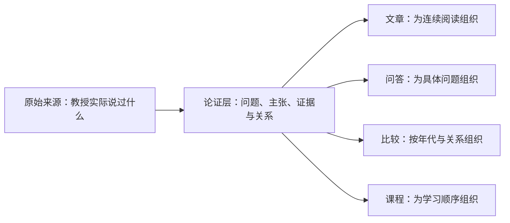
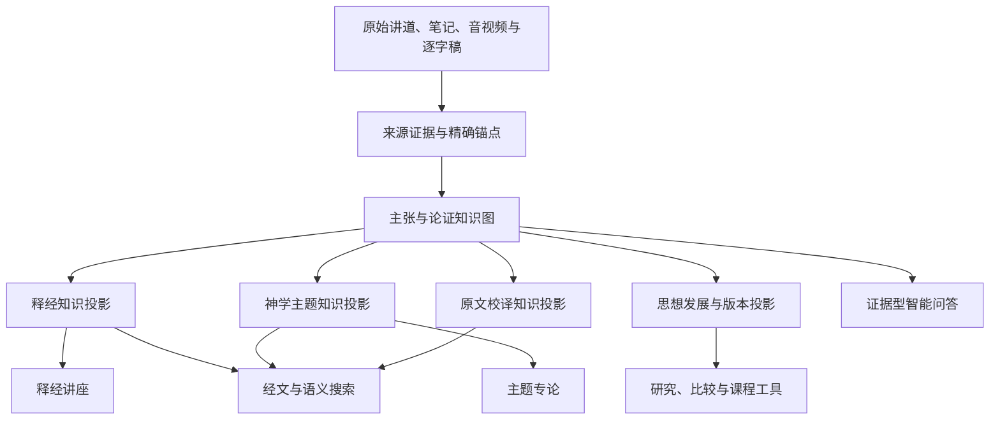

# 王守仁教授释经与思想知识平台设计

> 状态：目标架构与产品设计。本文补充 [Project Mission Statement](./project_mission_statement.md)，并约束 [Exegesis and Topic Repository Functional Specification](./exegesis_topic_repository_functional_spec.md)、[Technical Specification](./exegesis_topic_repository_tech_spec.md) 与 [Sermon Search and QA Specification](./sermon_search_functional_spec.md)。如实现细节与本文的知识边界、来源忠实性或审核原则冲突，应先修订设计并记录决定。

## 1. 产品定位

本项目不是单一的文章生成流水线。它要把王守仁教授两百多篇讲道、录音、逐字稿和笔记整理成一个可溯源、可审核、可演化的释经与思想知识基础，并由同一知识基础驱动：

- 按圣经正典组织的释经讲座；
- 跨讲道的神学主题专论；
- 有来源依据的智能问答；
- 经文、主题、原文和来源搜索；
- 教授思想在不同年代的发展比较；
- 查经课程、学习路径与研究工具；
- 后续独立的语言学、历史与神学事实核查。

文章是知识库的一个经过审核的**出版投影**，不是知识库本身。问答也不是重新阅读文章后自由生成，而是对同一组经过审核的主张、论证关系和来源锚点进行检索与组织。

### 1.1. 为什么需要中间论证层

如果目标只是把一篇讲道润色成一篇文章，中间论证层不是绝对必要；全文提示词和人工编辑也可以得到一篇可读稿。然而本项目还要跨越两百多篇讲道，生成多种文章，回答问题，比较不同时期的教导，并在新资料加入后修订旧结论。在这种范围下，只有“原始片段”和“完成文章”两层是不够的：

| 只保存什么 | 不能可靠解决的问题 |
|---|---|
| 原始逐字稿与高亮片段 | 找得到相似句子，却不知道是教授的结论、被反对的观点、尚未回答的问题还是例子 |
| 完成文章 | 读起来完整，却把多个主张和来源包在段落里，难以复用于另一篇文章或精确问答，也难以知道编辑综合了什么 |
| 主题标签 | 能分类，却不能表达“这个经文怎样支持这个结论”“后来的讲道是重复、扩展还是限定” |

因此需要一个介于来源和文章之间的最小结构：**问题、主张、证据、关系、归属、审核状态与来源锚点**。它把“这句话在哪里”提升为“教授主张什么、凭什么、如何回答问题、与其他主张有什么关系”。



论证层也不是要提前建成一套封闭、完美的系统神学。它只保存当前资料能够支持的最小判断；主题主干与高层综合保持候选和版本化状态。若新讲道推翻既有归组，应修改地图而不是修改证据。

### 1.2. 为什么先普查再定型

只读少数讲道就冻结主题体系，会把样本偏差误认为教授的完整思想。因此采用两阶段策略：

1. **第一遍普查**：从有代表性的已发布讲道中提取经文范围、主要问题、候选主张、原文判断、解释方法、主题和来源锚点；目标是发现形状，不做精细出版。
2. **第二遍精编**：在候选地图稳定后，逐篇建立精确 claim、relation 和 citation，进行人工审核，并生成释经、主题、问答等投影。

十五篇样本和当前七条主干只是 `candidate baseline v1`。它们用于验证数据结构和工作流，不具有封闭后续发现的权力。

## 2. 项目观察如何转化为设计约束

十五篇样本普查显示以下稳定特点。这些观察必须成为数据和工作流约束，而不只是提示词中的风格描述。

| 教学特点 | 系统设计决定 |
|---|---|
| 教授常由问题或经文张力开始 | 问题是独立对象，必须能够连接 `answered_by`，生成后检查重要问题是否得到回答 |
| 经常先复述再反对一种解释 | `opposed_view` 与教授自己的主张分开存储，禁止只靠段落相似度判断立场 |
| 擅长原文释经并反复批评和合本 | 原文校译是第一等对象，保存原词、语法、译本、教授建议、理由、解释影响及核查状态 |
| 大量跨卷经文论证 | 区分主要解释经文、平行经文、背景经文和支持经文；一条主张可以连接多卷圣经 |
| 经常同时保留神的主动与人的责任 | 保存 `qualifies`、`tension` 与双向限定，不为文章简洁删除其中一面 |
| 神学从具体释经逐渐形成 | 释经结论和跨讲道神学综合分开；编辑综合必须标示归属与置信度 |
| 应用常由不变原则进入新处境 | 保存原处境、原则、目标处境和应用推论，不只保存结论 |
| 课堂问答、插话和回旋很多 | 出版顺序由经文或论证结构决定，不复制现场顺序 |
| 同一主张跨讲道重复并逐渐补充 | 支持重复、扩展、限定、应用、张力和取代关系；合并文本但保留全部来源 |
| 语气强烈、常用绝对化表达 | 允许语气正常化，但不得静默降低教授明确主张的强度 |

## 3. 总体架构



架构由四个系统组成部分构成；这里的“组成部分”不等同于教授思想内容的层级：

1. **来源档案**：保存原始讲道、笔记、逐字稿、媒体和版本哈希；
2. **释经与思想知识库**：保存问题、主张、证据、推论、原文判断、应用、张力和版本；
3. **检索与推理服务**：结合经文、关键词、语义检索和图关系遍历；
4. **产品功能**：文章、问答、索引、研究、课程和审核界面。

## 4. 双轴知识组织

### 4.1. 释经轴

释经轴回答：“教授怎样解释这段圣经？”

```text
圣经卷书
└── 章
    └── 经文段落
        ├── 解释问题
        ├── 教授反对的解释
        ├── 原文、文体、历史和上下文证据
        ├── 解释结论
        ├── 必要的神学意义
        ├── 生活应用
        └── 原始来源
```

要求：

- 按正典、章、节排序，不按讲道题目或讲课时间排序；
- 多卷经文单元选择主要解释经文，其他经文以平行、背景或支持角色出现；
- 同一内容可从多卷索引发现，但只保存一份权威记录；
- 释经讲座只展开理解当前经文所需的神学背景，深入内容链接主题专论；
- 同一章的完整讲座从多个 passage unit 组成，不等同于某一堂讲道的改写。

### 4.2. 神学主题轴

主题轴回答：“教授在不同年代和场合怎样论述这个问题？”

```text
思想主干
└── 主题
    ├── 定义
    ├── 核心主张
    ├── 圣经和原文证据
    ├── 反对观点
    ├── 跨讲道重复与扩展
    ├── 限定、张力和变化
    ├── 应用
    └── 全部原始来源
```

当前十五篇样本提出七条候选主干，但它们不是固定 taxonomy。新讲道可以新增、扩展、升降级、拆分、合并、标记张力或取代旧的编辑归纳。

### 4.3. 两轴共享同一主张图

一条主张只保存一次，可同时属于释经和主题投影。例如：

```text
主张：太16:28应验于登山变像
类型：释经结论
释经归属：太16:28–17:8

主张：登山变像预尝将来的荣耀国度
类型：释经结论 + 神学意义
释经归属：太16:28–17:8
主题连接：神国与末世

主张：“那人子”指向但以理书七章的神性人物
类型：跨经文神学主张
主题归属：基督论 › 人子
相关释经：太16:28、太17、太26
```

## 5. 核心知识对象

### 5.1. Source Document 与 Source Fragment

来源记录教授实际说过什么。每个 fragment 必须能够解析到原始文本，并尽可能包含媒体时间或笔记页码。来源证据与教授引用的圣经依据必须分开：前者证明教授说过，后者说明教授为什么这样说。

### 5.2. Question

保存教授提出的解释问题、听众问题或编辑识别出的论证问题。

关键字段：

- `question_id`；
- 问题文字；
- 提问者：教授、听众或编辑；
- 经文和主题范围；
- 来源锚点；
- `answered`、`partially_answered`、`unanswered` 状态；
- 回答该问题的 claim IDs。

### 5.3. Claim

Claim 是可以被支持、反对、限定或应用的最小可审核主张，不是文章段落。

基本类型：

- `explicit_claim`；
- `reasoning_conclusion`；
- `interpretive_method`；
- `opposed_view`；
- `application`；
- `editorial_synthesis`；
- `open_question`；
- `non_substantive`。

每条 claim 保存稳定 ID、文字、归属、经文、来源锚点、审核状态、可见范围、成熟度和版本。

### 5.4. Claim Relation

关系类型至少包括：

- `supports`；
- `answers`；
- `opposes`；
- `qualifies`；
- `applies`；
- `repeats`；
- `extends`；
- `tension`；
- `supersedes`；
- `editorial_inference`。

关系本身也必须可审核，并记录理由和来源。跨讲道不能只凭关键词自动建立 `repeats` 或 `extends`。

### 5.5. Scripture Evidence

记录教授引用的经文及其论证角色：

- `primary_passage`：当前主要解释对象；
- `parallel_passage`：平行叙事或相同事件；
- `historical_background`；
- `lexical_support`；
- `theological_support`；
- `counterexample`；
- `application_basis`。

编辑后加的经文必须标记 `editor_supplied`，不得冒充教授本人使用的证据。

### 5.6. Original Language Judgment

原文校译对象保存：

- 经文；
- 希伯来文、亚兰文或希腊文词形及 lemma；
- 形态、语态、句法或语义问题；
- 和合本或其他目标译本的现有译法；
- 教授提出的译法；
- 教授给出的词义、文法、上下文和跨经文理由；
- 这项校译影响的解释和神学主张；
- 教授原话、讲道时间和高亮来源；
- `unreviewed`、`representation_approved`、`fact_check_pending`、`fact_checked` 或 `disputed` 状态；
- 独立事实核查结论，且与教授原主张分开保存。

### 5.7. Application Reasoning

应用不是一句劝勉，而应保存：

- 原始经文处境；
- 教授辨认的不变原则；
- 目标处境；
- 从原则到应用的推论；
- 适用限制和牧养风险。

### 5.8. Canonical Unit

Canonical unit 是经过编辑的阅读和出版单位。它引用 claim IDs 和 citation IDs，但不是 claim 的唯一容器。一个 claim 可以出现在多个出版投影中；每个投影必须保持相同含义并链接同一来源。

### 5.9. Thought Map Revision

思想地图每次变化必须记录：

- 操作：新增、扩展、升降级、拆分、合并、张力或取代；
- 变化前后的节点；
- 新增证据；
- 修改理由；
- 编辑者与时间；
- 审核状态；
- 前一版本引用。

废弃节点不得物理删除；它应标记为 `superseded` 或 `archived`，使研究者能够追踪编辑理解如何随语料变化。

## 6. 从讲道到知识库的处理流程


### 6.1. 来源规范化

- 选择 published、reviewed、raw 的明确优先级；
- 保留段落、时间、来源阶段和哈希；
- 只纠正能够确认的转录错误，并保留原始版本；
- 不以 Project 标题推断经文范围。

### 6.2. 课堂话语识别

识别教授提问、听众提问、复述他人观点、教授回答、经文引用、个人故事、课堂管理和非实质内容。说话角色和论证角色不得混淆。

### 6.3. 单篇论证重建

恢复“问题—为什么重要—反对解释—经文和原文证据—推论—回答—限定—应用”的顺序。现场顺序只作为来源顺序保留，不直接决定出版顺序。

### 6.4. 跨讲道连续性判断

后续讲道与既有主张比较时，必须选择 `repeats`、`extends`、`qualifies`、`applies`、`tension`、`supersedes` 或 `new_claim`。系统提出候选，人工决定重要关系。

### 6.5. 出版投影

- 释经讲座按正典和段落论证组织；
- 主题专论按定义、主张、证据、反对、限定和应用组织；
- 重复内容合并，扩展和限定保留；
- 来源不因文字合并而丢失；
- 原文校译在正文简要说明，并可链接完整校译记录。

## 7. 智能问答设计

### 7.1. 问答不是普通 manuscript RAG

普通 RAG 只能找到相似片段，无法可靠判断片段是教授立场、被反对观点、未回答问题还是后来的限定。本项目采用混合检索：


向量和全文检索负责召回；审核过的主张图负责立场、关系和证据约束；语言模型负责在约束内组织答案。

### 7.2. 问题类型

系统至少支持：

- 经文解释；
- 神学主题；
- 教授对某观点的立场；
- 原文或译本批评；
- 跨年代比较；
- “在哪里讲过”的来源定位；
- 某章或某卷的覆盖范围；
- 生活应用；
- 资料不足或尚未回答的问题。

### 7.3. 回答契约

回答按需要包含：

1. 直接回答；
2. 教授的主要理由；
3. 相关圣经依据；
4. 不同讲道中的扩展或限定；
5. 未决问题、张力或事实核查状态；
6. 原始讲道、时间位置和高亮；
7. 相关释经单元和主题专论。

每个句段应能追踪到 claim IDs 和 citation IDs。界面不显示内部 ID，但引用卡必须能够解析到原始来源。

### 7.4. 内容归属标签

答案必须区分：

- 教授明确主张；
- 教授的论证结论；
- 跨讲道编辑综合；
- 尚待事实核查；
- 存在不同表述；
- 资料不足。

如果知识库没有充分资料，系统应明确说尚未找到教授的明确主张，不得以一般神学知识替教授补答。外部知识只能在用户明确要求事实核查或比较时加入，并与“教授观点”分区显示。

### 7.5. 公开与内部问答

公开问答默认只使用：

- `approved` claims；
- `approved` citations；
- `published` canonical units；
- 获准公开的来源。

内部研究问答可以在界面明确标示后使用 candidate claims、未发布来源、编辑推论、张力和事实核查队列。权限过滤必须在检索阶段执行，不能只在生成答案后隐藏链接。

## 8. 搜索、研究与学习功能

### 8.1. 经文与主题搜索

搜索结果可以是 passage unit、topic unit、claim、original-language judgment 或 source occurrence。用户应能按经文、主题、年代、场合、内容类型、审核状态和来源类型过滤。

### 8.2. 思想发展比较

时间线显示同一主张的重复、扩展、限定、张力和取代。出现次数只是一个信号；系统同时显示跨年代范围、来源独立性和下游论证扇出。

### 8.3. 学习路径

课程和查经材料是经过人工选择的知识投影，可组合经文单元、主题背景、原文卡片、讨论题和来源片段。生成课程不得改变底层 claim 或 canonical unit。

### 8.4. 事实核查

忠实呈现与事实核查分阶段进行。核查结果通过独立记录连接教授主张，不静默覆盖原主张。明显的圣经引用错误或口误也应保留原始来源，并显示编辑说明。

## 9. 编辑与审核体验

编辑界面需要同时展示：

- 当前释经或主题投影；
- 主张、问题及直接关系；
- 原始讲道、播放器、时间位置和高亮；
- 原文、译本、教授建议和解释影响；
- 跨讲道重复、扩展、限定和张力；
- 当前审核状态、可见范围和版本历史；
- 合并、拆分、升降级、取代或拒绝操作。

AI 可以提出候选，不可自动批准教授最终立场、跨讲道合并、事实核查结论或公开发布。

## 10. 可演化规则

当前七条思想主干是十五篇样本下的候选框架。系统必须允许：

- `add`；
- `extend`；
- `promote`；
- `demote`；
- `split`；
- `merge`；
- `mark_tension`；
- `supersede`。

禁止：

- 强迫新证据进入现有主干；
- 仅凭关键词合并；
- 静默覆盖已审核主张；
- 删除被取代的历史；
- 把编辑推论改写成教授明确主张。

每次变更必须保存 source anchor、change reason、previous revision 和 review status。

## 11. 安全、权限与发布边界

- 原始来源的访问权限优先于 claim、文章和问答可见性；
- public build 只编译可公开的已批准记录；
- 管理员可查看 unpublished 和 candidate 数据，但界面必须明显标示；
- 公共问答不得泄漏 restricted fragment 的文字、标题或媒体 URL；
- 文章发布与 claim 批准是相关但不同的操作；
- 一篇文章可以仍在候选状态，而其部分 claim 已被批准；反之亦然。

## 12. 非功能要求

### 可追溯性

每项公开答案和文章中的实质主张都应能够解析到至少一个批准来源，或明确标明为编辑综合及其构成证据。

### 可重复性

相同的 active knowledge build、查询、权限和模型配置应产生实质等价的证据集合。答案措辞可以变化，来源集合和归属不得无故漂移。

### 可回滚性

知识图、canonical repository 和搜索索引采用版本化 build。新 build 失败不得替换 active build；编辑决定和来源文件不因回滚而删除。

### 性能

交互式问答应先返回来源和直接主张，再流式生成答案。预期两百至四百篇材料下，普通检索目标低于一秒；复杂图遍历和深度比较可以异步或流式返回。

### 可观察性

记录召回的候选、审核过滤、图遍历路径、使用的 claim/citation、模型、prompt 版本和失败原因。公开界面不暴露内部调试信息。

## 13. 验收场景

统一知识结构至少应同时通过以下场景：

1. 从相同数据生成一篇按经文顺序组织的太17释经讲座；
2. 从跨讲道数据生成“那人子与耶稣神性”主题专论；
3. 回答“教授怎样解释小信”，并显示直接答案、理由和精确来源；
4. 回答“教授认为和合本哪些地方翻译有问题”，并区分教授主张与独立核查；
5. 回答“2011与2022对摩西律法的看法有何重复和扩展”；
6. 对没有证据的问题明确返回资料不足；
7. 新讲道能够产生新主干，而不被强迫归入现有七条；
8. 拆分或合并思想节点后，旧版本和来源仍可追踪；
9. public 用户不能检索或间接推断 restricted 来源；
10. 文章、问答、搜索结果和来源播放器引用同一稳定 claim/citation 身份。

## 14. 实施顺序

1. 冻结十五篇样本与当前思想地图作为 `candidate baseline v1`；
2. 实现 question、claim、relation、Scripture evidence、original-language judgment 和 revision 数据模型；
3. 将十五篇样本导入全库唯一 ID 的知识图；
4. 建立 claim/relation/source 审核界面；
5. 让 canonical unit 引用 claim IDs，而不只引用整段 manuscript；
6. 将问答升级为检索加图遍历，并实现公开／内部权限过滤；
7. 用一篇未参与十五篇总结的已发布讲道做盲测；
8. 同时验证释经讲座、主题专论和二十个问答场景；
9. 通过后再按批次扩展到二百余篇讲道。
