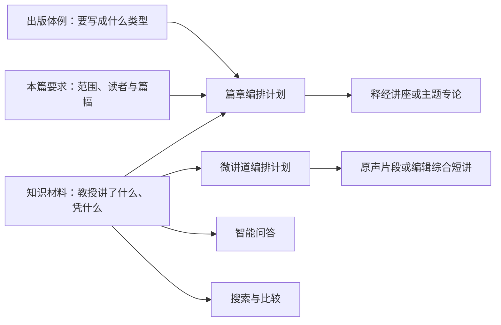
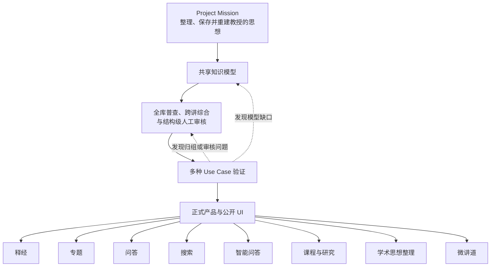
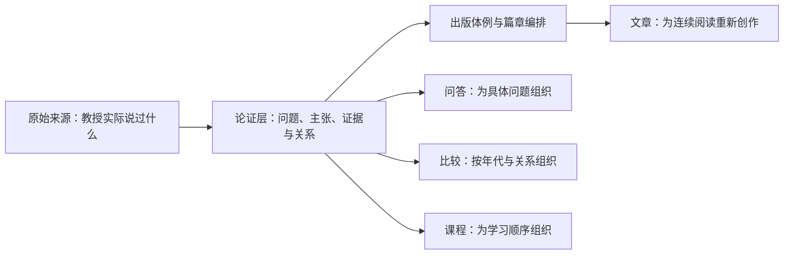
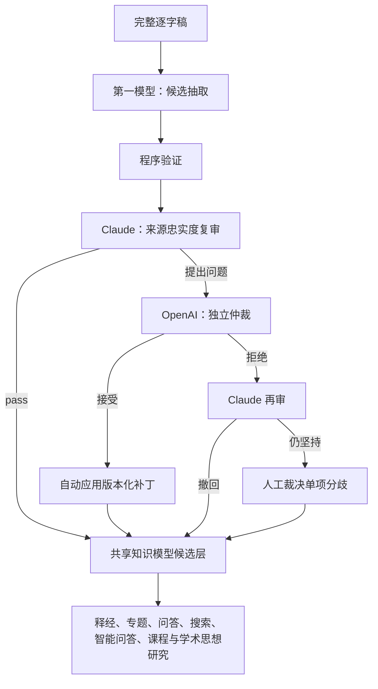
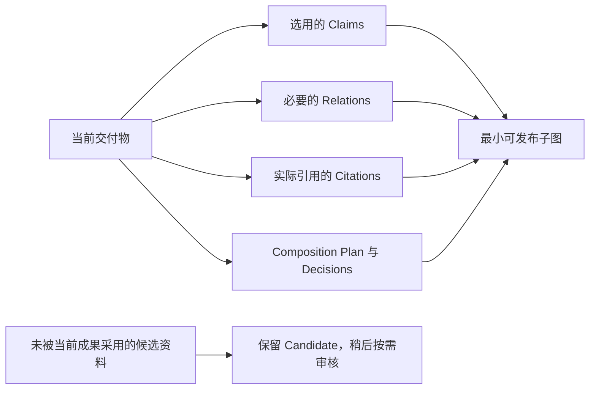
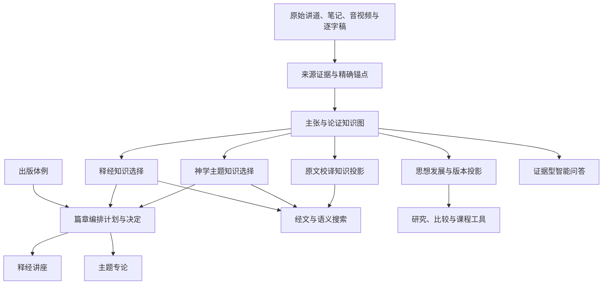
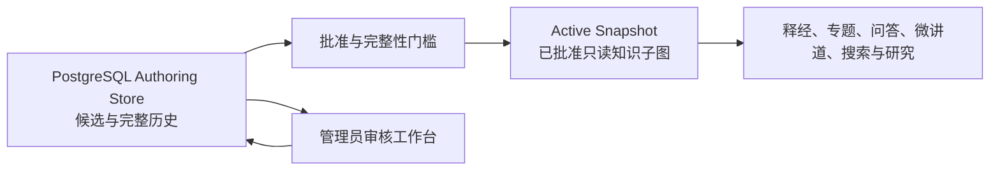
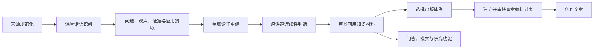

# 王守仁教授释经与思想知识平台设计

> 状态：目标架构与产品设计。本文补充 [Project Mission Statement](./project_mission_statement.md)，并约束 [Exegesis and Topic Repository Functional Specification](./exegesis_topic_repository_functional_spec.md)、[Technical Specification](./exegesis_topic_repository_tech_spec.md) 与 [Sermon Search and QA Specification](./sermon_search_functional_spec.md)。如实现细节与本文的知识边界、来源忠实性或审核原则冲突，应先修订设计并记录决定。

## 1. 产品定位

本项目不是单一的文章生成流水线。它要把王守仁教授两百多篇讲道、录音、逐字稿和笔记整理成一个可溯源、可审核、可演化的释经与思想知识基础，并由同一知识基础驱动：

- 按圣经正典组织的释经讲座；
- 跨讲道的神学主题专论；
- 有来源依据的智能问答；
- 经文、主题、原文和来源搜索；
- 教授思想在不同年代的发展比较；
- 王守仁教授学术思想整体结构、释经方法与发展过程的系统整理；
- 面向社交媒体阅读习惯、每次只讲清一个问题的三至五分钟微讲道；
- 查经课程、学习路径与研究工具；
- 后续独立的语言学、历史与神学事实核查。

文章不是知识图自动排版后的直接投影，也不是知识库本身。它是一部在知识材料约束下、按照用户批准的出版体例和逐篇编排计划写成的新著作。问答则不是重新阅读文章后自由生成，而是对同一组经过审核的主张、论证关系和来源锚点进行检索与组织。

完整关系是：



知识库限定文章可以忠实使用什么；出版体例规定作品应该怎样讲；篇章编排计划决定本篇详略、顺序、转介和资料缺口。三者责任不可互相替代。

### 1.1. 不可倒置的上下游治理顺序

本项目的最高层设计不是“先做一个文章页面，再补它需要的数据”，而是：



这条顺序具有治理效力：

1. **上游约束下游。** 产品不得因某一个页面写起来方便，就把局部标题、文章段落或两讲样本提升为全库分类。
2. **Use case 是验证器，不是知识权威。** 太17释经、“人子”专题和问答链是纵向切片，用来检验同一模型是否足以支持不同成果；它们发现的问题必须形成模型修订或全库结构修订记录。
3. **局部修订不得静默发生。** 若试验需要新增对象、关系或分类，应先写入共享设计和版本化候选基线，再由产品消费新版本。
4. **内部工具与正式产品分开。** 来源审核、主张审核、跨讲综合和篇章计划工作台可以在验证阶段提前建设，因为没有这些工具便无法人工验证；它们是研究与审核基础设施，不是图中最后一层所指的公开产品 UI。
5. **人工审核分两级。** 全库阶段审核候选主干、归组边界、张力和演化规则；交付阶段审核某篇文章或答案实际依赖的完整最小子图。前者防止局部样本定义全局，后者避免等待全部候选逐条变绿。

因此，当前第三、第四讲工作台的正确身份是“共享模型与 use-case 的内部验证工具”。它不能把两讲中的专题线索宣布为教授的完整专题，也不能绕过 205 篇候选基线自行建立新的正式目录。

### 1.2. 为什么需要中间论证层

如果目标只是把一篇讲道润色成一篇文章，中间论证层不是绝对必要；全文提示词和人工编辑也可以得到一篇可读稿。然而本项目还要跨越两百多篇讲道，生成多种文章，回答问题，比较不同时期的教导，并在新资料加入后修订旧结论。在这种范围下，只有“原始片段”和“完成文章”两层是不够的：

| 只保存什么 | 不能可靠解决的问题 |
|---|---|
| 原始逐字稿与高亮片段 | 找得到相似句子，却不知道是教授的结论、被反对的观点、尚未回答的问题还是例子 |
| 完成文章 | 读起来完整，却把多个主张和来源包在段落里，难以复用于另一篇文章或精确问答，也难以知道编辑综合了什么 |
| 主题标签 | 能分类，却不能表达“这个经文怎样支持这个结论”“后来的讲道是重复、扩展还是限定” |

因此需要一个介于来源和文章之间的最小结构：**问题、主张、证据、关系、归属、审核状态与来源锚点**。它把“这句话在哪里”提升为“教授主张什么、凭什么、如何回答问题、与其他主张有什么关系”。



论证层也不是要提前建成一套封闭、完美的系统神学。它只保存当前资料能够支持的最小判断；主题主干与高层综合保持候选和版本化状态。若新讲道推翻既有归组，应修改地图而不是修改证据。

### 1.3. 为什么先普查再定型

只读少数讲道就冻结主题体系，会把样本偏差误认为教授的完整思想。因此采用两阶段策略：

1. **第一遍普查**：先以代表性已发布讲道校准格式，再覆盖当前全部可用的 published + reviewed 讲道，提取经文范围、主要问题、候选主张、原文判断、解释方法、主题和来源锚点；目标是发现形状，不做精细出版。
2. **第二遍逐句详细整理**：在候选地图稳定后，按交付物需要建立精确 Question、Position、Observation、Evidence Step、Claim、Relation 和 Source Fragment；先经程序验证和双模型来源忠实度复审，再按出版依赖进行必要审核，生成释经、主题、问答等成果。

多篇讲道可以因为检索词或研究问题进入同一个 `ResearchBatch`，但批次只定义处理范围，不能预先定义语义归属。系统必须先逐篇独立整理和复审，再合并成未分类候选包，随后才以跨讲比较判断哪些材料重复、扩展、限定、冲突、属于不同经文脉络或暂时无法归类。批次名称、检索词和编辑研究动机都不能自动成为 canonical topic。

截至 2026-08-07，第一遍普查已覆盖当前可用的 205 篇 published + reviewed transcript，共得到 1,580 个内容群、3,752 条候选主张和 6,401 个精确来源锚点。全库综合形成 17 个机器候选归组；人工结构审核没有把它们平铺成 17 条“教授思想”，而是重新分层为可修订的候选基线 v3。它们仍是 `candidate`，用于确定全库形状、分类边界和数据结构，不代表其下 3,752 条主张已经逐条批准，也不构成独立神学事实核查。当前依据见 [205 篇总体设计验证](./full_corpus_205_design_validation_v1.md)、[17 个候选归组结构审核](./candidate_group_review_205_v1.md) 与 [候选基线 v3](./candidate_baseline_v3.md)；111 篇报告只保留为历史阶段记录。

### 1.4. 编辑产能是一级系统约束

本项目不能假设每篇讲道提取出的所有 Question、Claim、Relation、Scripture Evidence、Original Language Judgment 和 Citation 都会在发布前逐条完成审核。两百多篇讲道可能产生上万条候选记录；若任何成果都要等待全库变成已批准，项目会停在审核积压，而不是形成可交付的知识。

因此采用三项原则：

1. **候选可以大量存在**：AI 普查和抽取结果默认是 Candidate，不因尚未审核而阻止其他成果。
2. **按交付物审核**：每篇文章、公开问答集或研究报告只审核它实际依赖的最小知识子图。
3. **部分完成可以发布**：只要范围和资料缺口诚实标示，已完成的经文或主题可以发布，不等待两百多篇全部处理。
4. **独立 AI 复审后进行双模型仲裁**：Claude 直接阅读完整来源复核第一次抽取；OpenAI 再独立核对每条非 pass 意见。OpenAI 接受则自动写入版本化候选 override；OpenAI 拒绝则让 Claude 阅读反驳再审一次；只有 Claude 仍坚持时才转人工。两个模型均被禁止进行神学批评，也不能写入人工批准。



此图描述知识质量控制，不代表自动出版。Claude 与 OpenAI 只判断候选资料是否忠实呈现来源，不进行神学批评；双方一致可以免除候选修正的人工复核，但公开成果仍受各产品的出版闸门约束。



这意味着“重要内容必须人工审核”应解释为：**进入当前公开成果并承担实质论证功能的重要内容必须经过出版闸门**，而不是“全库所有候选记录必须先审核”。为减少人工重复劳动，candidate 先经 Claude 独立复审；非 pass 意见由 OpenAI 依据相同来源仲裁。双方一致时自动应用可追溯候选补丁；OpenAI 拒绝时让 Claude 再审，只有持续分歧才转人工。未发现问题和自动修正后的记录仍只是 `AI reviewed candidate`。详细格式、指纹、补丁和闸门见 [独立 AI 复审、双模型仲裁与人工分歧处理 v1](./independent_ai_review_v1.md)。

## 2. 项目观察如何转化为设计约束

先导样本与 205 篇全语料普查显示以下稳定特点。这些观察必须成为数据和工作流约束，而不只是提示词中的风格描述。

| 教学特点 | 系统设计决定 |
|---|---|
| 教授常由问题或经文张力开始 | 问题是独立对象，必须能够连接 `answered_by`，生成后检查重要问题是否得到回答 |
| 经常先复述再反对一种解释 | `opposed_view` 与教授自己的主张分开存储，禁止只靠段落相似度判断立场 |
| 擅长原文释经并反复批评和合本 | 原文校译是第一等对象，保存原词、语法、译本、教授建议、理由、解释影响及核查状态 |
| 反复强调“因信成义”而非“因信称义” | 在“义、信与关系”上位主题下建立独立核心论证单元；分别保存 `δικαιόω` 校译判断、成义主张、被反对的纯宣告观点及其论证路径，不以通行术语覆盖教授用语 |
| 大量跨卷经文论证 | 区分主要解释经文、平行经文、背景经文和支持经文；一条主张可以连接多卷圣经 |
| 经常同时保留神的主动与人的责任 | 保存 `qualifies`、`tension` 与双向限定，不为文章简洁删除其中一面 |
| 神学从具体释经逐渐形成 | 释经结论和跨讲道神学综合分开；编辑综合必须标示归属与置信度 |
| 应用常由不变原则进入新处境 | 保存原处境、原则、目标处境和应用推论，不只保存结论 |
| 课堂问答、插话和回旋很多 | 出版顺序由经文或论证结构决定，不复制现场顺序 |
| 同一主张跨讲道重复并逐渐补充 | 支持重复、扩展、限定、应用、张力和取代关系；合并文本但保留全部来源 |
| 语气强烈、常用绝对化表达 | 允许语气正常化，但不得静默降低教授明确主张的强度 |

## 3. 总体架构



架构由四个系统组成部分构成；这里的“组成部分”不等同于教授思想内容的层级：

1. **来源档案**：保存原始讲道、笔记、逐字稿、媒体和版本哈希；
2. **释经与思想知识库**：保存问题、主张、证据、推论、原文判断、应用、张力和版本；
3. **检索与推理服务**：结合经文、关键词、语义检索和图关系遍历；
4. **编辑创作与产品功能**：出版体例、篇章编排、文章、问答、索引、研究、课程和审核界面。

## 4. 双轴知识组织

### 4.1. 释经轴

释经轴回答：“教授怎样解释这段圣经？”

```text
圣经卷书
└── 章
    └── 经文段落
        ├── 解释问题
        ├── 教授反对的解释
        ├── 原文、文体、历史和上下文证据
        ├── 解释结论
        ├── 必要的神学意义
        ├── 生活应用
        └── 原始来源
```

要求：

- 按正典、章、节排序，不按讲道题目或讲课时间排序；
- 多卷经文单元选择主要解释经文，其他经文以平行、背景或支持角色出现；
- 同一内容可从多卷索引发现，但只保存一份权威记录；
- 释经讲座只展开理解当前经文所需的神学背景，深入内容链接主题专论；
- 同一章的完整讲座从多个 passage unit 组成，不等同于某一堂讲道的改写。

### 4.2. 神学主题轴

主题轴回答：“教授在不同年代和场合怎样论述这个问题？”

```text
思想主干
└── 主题
    ├── 定义
    ├── 核心主张
    ├── 圣经和原文证据
    ├── 反对观点
    ├── 跨讲道重复与扩展
    ├── 限定、张力和变化
    ├── 应用
    └── 全部原始来源
```

全语料综合提出并经结构审核的 17 个机器候选归组也不是固定 taxonomy。它们已被重分层为候选基线 v3，但人工审核仍可以新增、扩展、升降级、拆分、合并、标记张力或取代旧的编辑归纳；系统不得因为已存在候选目录而强迫新证据归组。

### 4.3. 两轴共享同一主张图

一条主张只保存一次，可同时属于释经和主题投影。例如：

```text
主张：太16:28应验于登山变像
类型：释经结论
释经归属：太16:28–17:8

主张：登山变像预尝将来的荣耀国度
类型：释经结论 + 神学意义
释经归属：太16:28–17:8
主题连接：神国与末世

主张：“那人子”指向但以理书七章的神性人物
类型：跨经文神学主张
主题归属：基督论 › 人子
相关释经：太16:28、太17、太26
```

### 4.4. 学术思想整理是两轴之上的研究投影

“王守仁教授学术思想”不是第三套平行资料库，也不等于把主题目录换一个总标题。它从释经轴与神学主题轴共享的主张图中，进一步审核教授的核心主张、证据标准、释经方法、反对立场及其时间发展，形成可修订的整体研究。

专题回答一个限定问题；学术思想整理回答多个专题和具体释经背后是否存在共同的判断方式、论证结构与发展轨迹。跨讲模式必须保存为 `EditorialSynthesis`，与教授明确主张分开；其新增、扩展、限定、张力或改变通过版本化思想地图修订记录。最终文章仍需独立的 `CompositionPlan`，不能把思想地图直接排版成教授的著作。

本 use case 的目标、归属规则、时间轴、产品形态和完成标准见 [王守仁教授学术思想整理：核心 Use Case](./scholarly_thought_reconstruction_use_case.md)。

### 4.5. 问答是独立产品，不是第三套知识

问答的用户入口和组织方式独立于释经轴与主题轴：读者通常先浏览释经或专题，未找到直接答案时才提出具体问题。但问答不得从已生成文章反向猜测教授的主张，也不得另建私有语义。它直接投影同一共享 `Question → Claim → Relation → SourceFragment` 子图。

问答必须区分现有资料足以回答、只能部分回答和现有语料未回答；这是证据充分度，不是答案篇幅。产品投影必须同时提供「先看结论」和可连续阅读的完整回答，不能要求读者自己从主张与证据卡拼出论证。完整回答属于问答产品的编辑综合，每一节须声明所依据的共享主张；它不能反向变成新的教授主张。背景主张、听众发言及教授所反驳的立场不得冒充答案。释经与专题只能作为延伸阅读链接。第一版验证规则与案例见[独立问答产品验证 v1](./qa_product_validation_v1.md)。

论证图中的 `answers` 边只表示找到了相关回答步骤，不证明整个问题已经完整回答。知识模型须分开保存回答连线状态与回答完整度；复合问题要记录已回答和未回答的子问题，避免系统因一条连线而把半个答案标成完整答案。

### 4.6. 微讲道是短篇产品，不是截短文章

微讲道的用户需求是用三至五分钟听懂一个问题，不是快速浏览一篇长文章的摘要。它从共享知识中选择一个中心问题和一条最小完整论证子图，再建立独立 `CompositionPlan`。系统不得按字数机械截断讲道或 manuscript，也不得为了短而删除改变结论的前提、限定或反例。

微讲道支持两种交付方式：可独立理解的教授原声片段，以及清楚标示编辑归属的跨讲道综合短讲。两者共用正式 Claim、Relation、Citation、ProductDependency 与 Active Snapshot；现有 `micro_sermons.json` 只保存播放和展示 metadata，不成为第四套知识。完整产品与审核规范见[微讲道：三至五分钟短篇教导 Use Case](./micro_sermon_product_use_case.md)。

## 5. 核心知识对象

### 5.1. Source Document 与 Source Fragment

来源记录教授实际说过什么。每个 fragment 必须能够解析到原始文本，并尽可能包含媒体时间或笔记页码。来源证据与教授引用的圣经依据必须分开：前者证明教授说过，后者说明教授为什么这样说。

`SourceFragment` 不拥有一套平行的来源真相。它必须引用 Canonical Citation；逻辑来源 ID、paragraph key、char offset 和模型抽出的引文只是候选定位材料。Canonical Citation 以来源 SHA256、段落 SHA256、精确引文 SHA256 和读取时重新解析来判断 valid/stale/unresolved。这样人工修订逐字稿时不会出现“offset 仍能读取，却已悄悄指向另一句话”的静默错误。

第三、第四讲的迁移实测为：140 个 fragment 中 100 个可精确绑定 Canonical Citation，36 个缺少可解析段落，4 个并非逐字引文。后 40 个被保留为待修资料，但不得承担主张支持；现阶段所有 `eligible` / `eligible_with_label` 证据均有 Canonical Citation。

### 5.2. Question

保存教授提出的解释问题、听众问题或编辑识别出的论证问题。

关键字段：

- `question_id`；
- 问题文字；
- 提问者：教授、听众或编辑；
- 经文和主题范围；
- 来源锚点；
- `answered`、`partially_answered`、`unanswered` 状态；
- 回答该问题的 claim IDs。

### 5.3. Claim

Claim 是可以被支持、反对、限定或应用的最小可审核主张，不是文章段落。

基本类型：

- `explicit_claim`；
- `reasoning_conclusion`；
- `interpretive_method`；
- `opposed_view`；
- `application`；
- `editorial_synthesis`；
- `open_question`；
- `non_substantive`。

每条 claim 保存稳定 ID、文字、归属、经文、来源锚点、审核状态、可见范围、成熟度和版本。

Claim 与 Evidence Step 是多对多关系。同一段教授原话可能同时承担具体释经、方法论示范和神学推论等不同功能；不能用单一 `topic` 字段强迫一段证据只能归属一个 claim group。每条 Claim 必须至少连接一个 Evidence Step，但“有连接”不等于“可以批准”：只有说话者、立场、原始锚点和引文完整度都合格的证据，才能承担支持功能。

### 5.4. Claim Relation

关系类型至少包括：

- `supports`；
- `answers`；
- `opposes`；
- `qualifies`；
- `applies`；
- `repeats`；
- `extends`；
- `tension`；
- `supersedes`；
- `editorial_inference`。

关系本身也必须可审核，并记录理由和来源。跨讲道不能只凭关键词自动建立 `repeats` 或 `extends`。

### 5.4a. TopicNode 与不同粒度的投影

共享知识不等于所有产品读取同一个“万能列表”。不同 use case 使用不同自然粒度，但身份与关系仍来自同一 authoring store：

| Use case | 主要读取层 | 输出粒度 |
|---|---|---|
| 搜索 | SourceFragment、Citation、CanonicalUnit | 命中片段或内容卡 |
| 逐章释经 | Claim、EvidenceStep、CompositionPlan | 经文段落与篇章结构 |
| 跨讲专题 | TopicNode、Claim、ClaimRelation | 主题论证链 |
| 问答 | Question、Claim、Citation | 有来源的回答路径 |
| 微讲道 | Question、Claim、ClaimRelation、Citation、CompositionPlan | 一个问题的 3–5 分钟最小完整论证 |
| 方法与思想研究 | ClaimRelation、EditorialSynthesis、时间版本 | 跨主张模式 |

`TopicNode` 的 ID 由 Canonical Repository 拥有。旧搜索 `topic_###` 是搜索卡 ID，CanonicalUnit 是内容 ID，论证层 `TOPIC-*` 是旧 route target；三者不能互相冒充。显式 reconciliation 保留旧 ID 并建立外键，禁止标题相似度自动合并。

为防止“正式 store 已迁移、交换包仍为空”的双重真相，所有可重建 shared-knowledge package 也必须输出当前 `TopicNode` 集合，并为 `topic_research` route 写入 `canonical_topic_ids`；importer 会验证这些外键实际存在。`sermon_search.canonical_ref` 仅表示 OSIS 经文，不参与主题身份对账。

### 5.4b. PostgreSQL 编辑主库与 Active Snapshot

共享知识的唯一编辑权威是 PostgreSQL authoring store。候选、退回、批准、拒绝、对象版本、审核事件、关系和下游失效状态都保存在主库；批次 JSON、AI 复审文件和历史 `shared_knowledge_pilot_v1.json` 是可重建的交换或审计 artifact，不拥有另一套语义真相。

产品不直接读取仍在编辑的全库，而读取由主库编译的 **Active Snapshot**：



Snapshot 只投影人工批准且具有合格、来源版本已绑定证据的 Claim；Relation、Topic、Route、Question 和 Composition Plan 也必须分别取得批准。编译在新 build 目录完成并验证 hash 后，才原子更新 `active.json` 指针。失败时保留旧指针，因此“候选编辑中”与“当前可供产品读取”不会混成一个状态。

`/admin/thought-review` 是原有审核工作台接入这套主库后的界面，不是另一个数据库或新管理产品。它显示当前 authority 和 active build，审核写操作产生版本与审核事件；“重建对外读取快照”只重新投影批准子图，不会自动批准候选资料。

### 5.5. Scripture Evidence

记录教授引用的经文及其论证角色：

- `primary_passage`：当前主要解释对象；
- `parallel_passage`：平行叙事或相同事件；
- `historical_background`；
- `lexical_support`；
- `theological_support`；
- `counterexample`；
- `application_basis`。

编辑后加的经文必须标记 `editor_supplied`，不得冒充教授本人使用的证据。

第一遍普查必须保留教授实际提到的经文原字符串；紧接着以独立、可重跑的
`wang_corpus_scripture_roles_v2` 伴随记录补充经文角色和规范化 OSIS，不能等到
文章生成时才猜测。这样既不破坏已经完成的 205 篇 v1 普查，也能独立修订分类模型。
只保存“太 17:1”一类原始字符串，最多能形成经文提及索引，不能证明该处是
教授的主要释经对象。只有经过 `primary_passage`、`parallel_passage`、
`lexical_support`、`historical_background`、`theological_support`、
`counterexample` 或 `application_basis` 分类后，才能进入释经覆盖地图。

一条原字符串含多卷书时必须拆开保存；只有可解析为 OSIS 的记录进入经卷、章、节
排序。只有书名、书信集合或约的名称仍保留在证据记录中，但不进入经文覆盖地图。
模型只判断 `role`、理由和置信度，不能生成 OSIS，也不能新增引用。

### 5.6. Original Language Judgment

原文校译对象保存：

- 经文；
- 希伯来文、亚兰文或希腊文词形及 lemma；
- 形态、语态、句法或语义问题；
- 和合本或其他目标译本的现有译法；
- 教授提出的译法；
- 教授给出的词义、文法、上下文和跨经文理由；
- 这项校译影响的解释和神学主张；
- 教授原话、讲道时间和高亮来源；
- `unreviewed`、`representation_approved`、`fact_check_pending`、`fact_checked` 或 `disputed` 状态；
- 独立事实核查结论，且与教授原主张分开保存。

### 5.7. Application Reasoning

应用不是一句劝勉，而应保存：

- 原始经文处境；
- 教授辨认的不变原则；
- 目标处境；
- 从原则到应用的推论；
- 适用限制和牧养风险。

### 5.8. Canonical Unit

Canonical unit 是经过编辑的阅读和出版单位。它引用 claim IDs、citation IDs 和 composition plan，但不是 claim 的唯一容器。一个 claim 可以出现在多部作品中；每部作品必须保持该 claim 的相同含义并链接同一来源。

### 5.9. Publication Profile

Publication Profile 是用户批准、可以重复使用的出版体例，不是教授思想的一部分。它把“Carson style”一类要求转化为可以执行和审核的高层规则，而不是要求模型模仿某位作者的具体措辞或内容比例。

《马太福音》项目采用的正式体例不是纯学术注释，也不是讲道逐字稿，而是：**以经文为主线、以论证为骨架、以神学为深化、以生活应用为落点的释经教学文集**。这部作品由编辑部编纂，王教授是思想与讲授材料来源；第一至二十八章只是连续的阅读与检索骨架，不是要求教授材料平均覆盖全卷的写作配额。正式文章只在材料达到成篇门槛时产生，薄弱章节可以只有短注、来源索引、编辑说明或暂不成篇。完整规范见 [《马太福音释经教学文集：成书体例 v2》](./matthew_exposition_publication_profile_v1.md)。

这套成书体例之下有两条不同的来源处理路径：已经通过忠实度审核的笔记整理讲稿，以 `verified_notes_manuscript` 身份直接进入结构抽取，不重复生成讲稿，也不重复执行同一轮忠实度审核；讲道录音、录像及逐字稿则进入详细抽取与来源审核。两条路径并不等同于固定的前后半卷分工，因为王教授在不同场合讲授的内容可能跨章、重复或补充。它们最终进入同一共享论证层，在主张层进行重复、补充、限定与张力对齐，再由篇章编排决定是否已经足以形成释经正文，或应进入短注、神学专题、生活应用、问答、附录及待补来源状态。完整流程见 [《马太福音》双来源到共享论证层工作流](./matthew_source_to_argument_workflow_v1.md)。

以经文为中心的学术释经体例可以规定：

- 以经文段落及其解释问题为主线；
- 按经文与论证顺序组织，不复制讲课现场顺序；
- 原文、文体、历史背景只在帮助解释经文时展开；
- 神学可以穿插，但不得压过当前经文；
- 深入的跨经文主题转介至主题专论；
- 生活应用由释经结论产生，并保存“经文处境 → 教授解释 → 不变原则 → 目标处境 → 应用与限制”的推论链；它可以有实质篇幅，但不得与当前经文失去可说明的联系；
- 能说明经文、方法或应用的个人经历可进入独立侧栏；无实质内容的课堂闲谈只保留来源；
- 政治与社会观点须区分不变原则和特定时代判断，标明时间与处境，需要事实核查者另行处理；
- 保留重要的不同解释及教授反对它的理由；
- 教授没有讲解或没有讲透的经文可以不成篇；只显示来源、短注、编辑说明或资料状态，不由 AI 假托补写，也不把空缺当作全书未完成的欠债；
- 文章若有讲道录音或录像来源，应在对应正文段落内提供与篇章编排同序的原声讲解；播放器读取该 `CompositionDecision` 已采用的 Claim、Evidence 和 SourceFragment，不得另建媒体专用主张；
- 原声片段以完整解释动作为边界，不采用「一条 citation 一个播放器」的碎片化切法；相邻或重叠片段可以合并，不连续片段必须按原讲道次序分别显示，不得剪接成虚假连续发言；
- 媒体定位保存稳定来源 ID 与时间范围，实际 URL 在读取时解析；只有笔记讲稿而没有媒体的段落明确显示不可播放，不生成或假造教授原声；
- 调整课堂口吻，但不削弱教授明确主张的强度。

Profile 保存稳定 ID、名称、适用产品、规则、默认章节结构、语气、引用方式、版本、批准者和状态。修改 Profile 不自动改写已经出版的文章。

### 5.10. Composition Plan

Composition Plan 是某一篇具体作品的编辑方案，综合：

- 所采用的 Publication Profile；
- 本篇经文或主题范围；
- 目标读者、用途、篇幅和深度；
- 中心问题、文章主旨和段落顺序；
- 选用的 question、claim、citation、original-language judgment 和 application IDs；
- 哪些内容作为核心、简述、附录、链接或暂缓；
- coverage gaps 与待寻找来源；
- 状态、版本、编写者和审核者。

同一知识材料可以因读者和出版目的不同而产生不同的 Composition Plan。计划必须明确显示哪些是用户要求、哪些是编辑判断、哪些是 AI 提案。

### 5.11. Composition Decision

Composition Decision 只记录那些换一位编辑可能作出不同选择的重要判断，不记录每一个连接词。类型至少包括：

- `include_as_core`；
- `include_briefly`；
- `move_to_topic_article`；
- `move_to_appendix`；
- `link_related_unit`；
- `omit_as_repetition`；
- `defer_due_to_missing_evidence`；
- `identify_as_climax`；
- `set_order`。

每项决定保存稳定 ID、作用对象、决定、理由、关联 claims/citations、依据的用户要求或 Profile 规则、状态、版本和审核记录。它属于编辑创作记录，不得标记为教授主张。

### 5.12. Thought Map Revision

思想地图每次变化必须记录：

- 操作：新增、扩展、升降级、拆分、合并、张力或取代；
- 变化前后的节点；
- 新增证据；
- 修改理由；
- 编辑者与时间；
- 审核状态；
- 前一版本引用。

废弃节点不得物理删除；它应标记为 `superseded` 或 `archived`，使研究者能够追踪编辑理解如何随语料变化。

### 5.13. Evidence Step 与 Inference Bridge

一条经文、一项原文观察或一段历史资料，不会自动成为解释结论。系统必须能够显式保存中间的论证步骤：

- `Evidence Step` 保存教授实际采用的文本观察，例如连接词、文体、上下文、平行经文、原文字义或历史事实；
- `Inference Bridge` 保存教授怎样由一项或多项观察推出中间判断或最终结论；
- 每一步记录输入、输出、推论文字、归属、来源、置信度和审核状态；
- 若桥接只是编辑为了重构论证而提出，必须标记 `editorial_inference`，不得改写成教授明确说过的话。

它不是要把所有讲道形式化为逻辑证明，而是解决最容易误读的一段：**教授看见了什么，怎样由此得到该解释。** 对正式文章、公开问答或方法研究中承担关键作用的桥接才进入审核队列。

Evidence Step 还必须保存以下审计字段：

- `claim_group_ids`：允许一条证据归属多个候选主张；
- `speaker`：教授、听众或其他说话者；
- `stance`：教授认同、质疑、转述或驳斥；
- `discourse_role`：自己的论证、听众提问、反方背景、戏剧化代言等；
- `anchor_quality` 与 `support_eligibility`：区分可核查支持、仅作上下文和暂缓使用；
- `local_source_evidence_ids` 与 `canonical_evidence_step_ids`：明确区分讲次内编号和全库编号，禁止依赖运行时猜测前缀。

导出与迁移必须执行结构断言：每个 Claim group 至少出现在一个 Evidence Step 的 `claim_group_ids` 中；所有 canonical ID 必须可解析；缺失时整次 build 失败，不能生成一个在 UI 中标题存在但证据为空的可审批对象。

### 5.14. Passage Interpretation Chain

同一段经文可能在不同讲道中被多次解释：先提出问题，后来补充原文依据，再在另一处形成神学结论或应用。`Passage Interpretation Chain` 将这些跨讲道步骤按经文和论证进展串联，而不把它们误当成同一堂讲道的连续段落。

它保存：

- 主要经文范围及平行经文；
- 解释问题；
- 依次采用的 Evidence Steps、Inference Bridges 和 Claims；
- 后来的重复、扩展、限定、张力或修订；
- 当前仍缺失或未回答的环节；
- 可用于某一 Composition Plan 的已审核子链。

这条链属于知识层，不等于文章大纲。文章仍由 Publication Profile 和 Composition Plan 决定详略、顺序和转介。

### 5.15. External Evidence

教授有时使用教会史、古代背景、学术传统、医学或心理学解释、概率论证和其他非经文材料。它们不能塞进 `Scripture Evidence`，也不能仅作为事实核查备注。`External Evidence` 应保存：

- 证据类型与教授所称来源；
- 教授实际陈述的资料或前提；
- 它支持、反对或限定的 Claim；
- 教授的推论路径和不确定性；
- 精确讲道锚点；
- 忠实呈现审核与独立事实核查两个分离状态。

缺少可核实出处时仍可忠实记录“教授在该讲道如此主张”，但不得把它显示成已经外部核实的事实。

## 6. 从讲道到知识库的处理流程



### 6.1. 来源规范化

- 选择 published、reviewed、raw 的明确优先级；
- 保留段落、时间、来源阶段和哈希；
- 只纠正能够确认的转录错误，并保留原始版本；
- 不以 Project 标题推断经文范围。

### 6.2. 课堂话语识别

识别教授提问、听众提问、复述他人观点、教授回答、经文引用、个人故事、课堂管理和非实质内容。说话角色和论证角色不得混淆。

### 6.3. 单篇论证重建

恢复“问题—为什么重要—反对解释—经文和原文证据—推论—回答—限定—应用”的顺序。现场顺序只作为来源顺序保留，不直接决定出版顺序。

### 6.4. 跨讲道连续性判断

后续讲道与既有主张比较时，必须选择 `repeats`、`extends`、`qualifies`、`applies`、`tension`、`supersedes` 或 `new_claim`。系统提出候选，人工决定重要关系。

### 6.5. 篇章规划与创作

1. 用户或编辑选择已批准的 Publication Profile，并填写本篇范围、读者、用途、篇幅和特殊要求。
2. 系统根据可用知识提出 Composition Plan 和重要 Composition Decisions。
3. 编辑审核中心问题、主旨、段落顺序、详略、转介、附录和 coverage gaps。
4. 释经讲座按正典和段落论证组织；主题专论按定义、主张、证据、反对、限定和应用组织。
5. 重复内容可以合并，但扩展和限定必须保留；来源不因文字合并而丢失。
6. 原文校译在正文按 Profile 规定的深度说明，并可链接完整校译记录。
7. AI 只能在批准的计划和知识材料内起草。计划外的新主张或重大重组必须产生新的候选决定，而不能静默加入正文。

## 7. 智能问答设计

### 7.1. 问答不是普通 manuscript RAG

普通 RAG 只能找到相似片段，无法可靠判断片段是教授立场、被反对观点、未回答问题还是后来的限定。本项目采用混合检索：


向量和全文检索负责召回；审核过的主张图负责立场、关系和证据约束；语言模型负责在约束内组织答案。

### 7.2. 问题类型

系统至少支持：

- 经文解释；
- 神学主题；
- 教授对某观点的立场；
- 原文或译本批评；
- 跨年代比较；
- “在哪里讲过”的来源定位；
- 某章或某卷的覆盖范围；
- 生活应用；
- 资料不足或尚未回答的问题。

### 7.3. 回答契约

回答按需要包含：

1. 直接回答；
2. 教授的主要理由；
3. 相关圣经依据；
4. 不同讲道中的扩展或限定；
5. 未决问题、张力或事实核查状态；
6. 原始讲道、时间位置和高亮；
7. 相关释经单元和主题专论。

每个句段应能追踪到 claim IDs 和 citation IDs。界面不显示内部 ID，但引用卡必须能够解析到原始来源。

### 7.4. 内容归属标签

答案必须区分：

- 教授明确主张；
- 教授的论证结论；
- 跨讲道编辑综合；
- 尚待事实核查；
- 存在不同表述；
- 资料不足。

如果知识库没有充分资料，系统应明确说尚未找到教授的明确主张，不得以一般神学知识替教授补答。外部知识只能在用户明确要求事实核查或比较时加入，并与“教授观点”分区显示。

### 7.5. 公开与内部问答

公开问答默认只使用：

- `approved` claims；
- `approved` citations；
- `published` canonical units；
- 获准公开的来源。

内部研究问答可以在界面明确标示后使用 candidate claims、未发布来源、编辑推论、张力和事实核查队列。权限过滤必须在检索阶段执行，不能只在生成答案后隐藏链接。

### 7.6. 答案诊断必须修最早出错层

答案错误不能一律归咎于生成模型。系统必须区分程序投影、共享知识资料、生成 prompt 和来源缺口，并修复最早出错的一层。Claude 先作独立忠实度审核，OpenAI 不盲从地逐项裁决；被拒绝的意见交 Claude 阅读理由后再审，只有仍无法一致的项目才交人工。两种模型都不得进行神学批评或替教授补答。

修复共享 Claim、Relation 或 Evidence 后，`ProductDependency`／`ImpactEvent` 必须使相关问答、搜索和文章依赖失效；修复程序投影或 prompt 后则重跑固定回归案例。完整协议见[问答答案双模型诊断与上游修复协议 v1](./qa_answer_diagnostic_protocol_v1.md)。

诊断资料有两个不同的阅读层，不能混为一谈：机器审计层保存模型原文、内部 ID、字段、错误层和修复指令；同工决策层只显示被检查的答案摘录、普通语言问题、模型共识状态和需要采取的动作。默认 UI 不得要求同工理解知识图字段。完整技术说明必须保留，但只能按需展开。这个原则同样适用于以后释经、专题、搜索和方法研究的 AI 复核界面。

## 8. 搜索、研究与学习功能

### 8.1. 经文与主题搜索

搜索结果可以是 passage unit、topic unit、claim、original-language judgment 或 source occurrence。用户应能按经文、主题、年代、场合、内容类型、审核状态和来源类型过滤。

### 8.2. 思想发展比较

时间线显示同一主张的重复、扩展、限定、张力和取代。出现次数只是一个信号；系统同时显示跨年代范围、来源独立性和下游论证扇出。

### 8.3. 学习路径

课程和查经材料是经过人工选择的知识投影，可组合经文单元、主题背景、原文卡片、讨论题和来源片段。生成课程不得改变底层 claim 或 canonical unit。

### 8.4. 事实核查

忠实呈现与事实核查分阶段进行。核查结果通过独立记录连接教授主张，不静默覆盖原主张。明显的圣经引用错误或口误也应保留原始来源，并显示编辑说明。

## 9. 编辑与审核体验

编辑界面需要同时展示：

- 当前释经或主题投影；
- 主张、问题及直接关系；
- 原始讲道、播放器、时间位置和高亮；
- 原文、译本、教授建议和解释影响；
- 跨讲道重复、扩展、限定和张力；
- 当前审核状态、可见范围和版本历史；
- 合并、拆分、升降级、取代或拒绝操作。

AI 可以提出候选，不可自动批准教授最终立场、跨讲道合并、事实核查结论或公开发布。

### 9.1. 四级成熟度

| 状态 | 最低条件 | 允许用途 |
|---|---|---|
| `candidate` | AI 或编辑提出，可能尚未定位精确来源 | 内部发现、聚类与规划 |
| `source_anchored` | 已解析到准确来源片段和版本 | 内部搜索、来源核对与编辑参考 |
| `representation_reviewed` | 人工确认忠实表达教授在该来源中的意思 | 内部综合、Composition Plan 与候选文稿 |
| `publication_approved` | 当前公开用途所需的归属、来源、关系和权限均通过 | 指定的公开文章、问答或研究成果 |

成熟度不是简单的全局“质量分数”。`publication_approved` 必须记录批准用于哪一种交付物和版本；一条主张可以适合某篇文章，却尚未足以支持更广泛的公开问答。

### 9.2. 最小可发布子图

每项交付物以其 Composition Plan 或 AnswerEvidenceBundle 为根，计算依赖闭包：

- 被正文实质使用的 claims；
- 将证据连接到结论、回答问题或表达限定所必需的 relations；
- 对应的 exact citations 和 source permissions；
- 使用到的原文判断与应用推论；
- Publication Profile、Composition Plan 和 material Composition Decisions；
- 明确披露的 coverage gaps、张力和未回答问题。

只有这个闭包进入本次发布审核。相似但没有被采用的候选主张、外围关系和其他讲道材料不进入阻塞门槛。

主张审批还受证据资格硬门槛约束：

- 合格证据为 0：UI 停用批准，API 同样拒绝批准，防止绕过界面；
- 合格证据为 1：允许继续人工判断，但必须显示“薄弱证据”警告；若该主张承担主要段落主旨，应补强来源或降低篇章权重；
- 合格证据多于 1：仍不自动批准，继续检查归属、关系和语料范围。

这些数量不是神学重要性分数。`recurrence`、证据数量和篇章重要性必须分开：课堂离题问答可能频繁出现，却不应因此成为经文章节的主要段落。

### 9.3. 审核角色

角色是责任分工，不要求每项工作由不同的人担任。小型志愿团队可以一人兼任，但系统必须记录当时承担的角色。

| 角色 | 主要责任 |
|---|---|
| AI assistant | 提取候选、定位来源、提出关系和编排方案，不得批准 |
| Source verifier | 确认高亮、时间、页码、版本和文字一致 |
| Representation editor | 确认是否忠实表达教授的实际意思及观点归属 |
| Argument editor | 只审核当前成果实际依赖的重要回答、支持、反对、限定和跨讲道关系 |
| Composition editor | 审核出版体例、篇章计划、详略、顺序、转介、缺口和成稿一致性 |
| Language/fact reviewer | 在需要时独立审核原文、历史或神学事实，不覆盖教授原主张 |
| Publisher | 检查发布范围、权限和门槛，激活公开版本 |

### 9.4. 审核队列与产能

审核队列按交付物组织，而不是按数据库对象类型无限堆积。每个队列项目显示：

- 它阻塞哪一项交付物；
- 风险和论证重要性；
- 当前成熟度与目标成熟度；
- 预计审核时间；
- 所需角色；
- 是否可以暂缓而不影响发布；
- 实际处理时间、返工次数和结果。

首批正式交付物必须测量每类记录的中位审核时间、每周可用同工小时、通过率、返工率和积压增长。后续批次大小由真实吞吐量决定，不由模型一次能生成多少候选决定。全语料普查提供发现范围，但不等于 3,752 条候选主张都进入人工审核。

### 9.5. 审不完时公开端显示什么

- 已有的原始讲道和已发布 manuscript 按原有权限继续存在；知识平台不得暗示未整理等于没有教导。
- 文库只显示达到当前公开门槛的单元或明确标示的部分成果。
- 未审核候选不出现在公开综合答案中，也不以数量或标题间接泄漏。
- 某段资料不足时显示“尚未完成整理”或明确 coverage gap，而不是让 AI 补写。
- 内部研究界面可以显示 Candidate 和 Source-anchored 资料，但必须带状态标签。

## 10. 可演化规则

当前候选思想地图是机器辅助的全语料综合，不是固定分类。系统必须允许：

- `add`；
- `extend`；
- `promote`；
- `demote`；
- `split`；
- `merge`；
- `mark_tension`；
- `supersede`。

禁止：

- 强迫新证据进入现有主干；
- 仅凭关键词合并；
- 静默覆盖已审核主张；
- 删除被取代的历史；
- 把编辑推论改写成教授明确主张。

每次变更必须保存 source anchor、change reason、previous revision 和 review status。

### 10.1 非技术同工审核工作台

审核界面必须按人的判断任务组织，而不是按数据库对象或 JSON 文件组织。工作台使用三个区域，避免把任何一种文章误当成知识平台的中心：

1. **共享知识**：审核教授提出的问题、主张、证据步骤和论证关系；这些对象可以同时服务于释经、专题、问答、搜索和研究。
2. **跨讲综合**：审核跨来源的重复、延伸、张力与候选方法模式。局部样本产生的专题只能标为“全库检索线索”，不能提前当作最终思想体系。
3. **设计验证**：用释经讲座、专题检索档案、问答链、微讲道、智能问答和方法研究检验同一知识结构。具体篇章编排只在对应的产品实验内出现。

审核意见必须另存，不覆盖 AI 候选数据或来源。界面不向普通同工暴露内部 ID、哈希、JSON、图数据库术语或命令行操作；技术身份仍保留在数据层以供追踪。第一版入口为 `/admin/thought-review`，操作说明见 [思想与篇章审核工作台](./reviewer_ui_guide.md)。

这里的“工作台 UI”属于验证与治理层的内部工具，不是正式公开产品。它可以早于公开释经文库、专题文库和智能问答上线，但不得因此改变上游顺序：工作台呈现和修改的仍必须是版本化共享知识与全库候选结构；任何局部试验的决定都要明确记录为模型修订、结构修订或篇章编排决定。

工作台必须把影响判断的结构直接呈现，不能只在 API 或 JSON 中保存：

- 每条主张分别显示可核查证据、对话与反方背景、暂缓证据及其原因；
- 显示该主张的 `KnowledgeRoute`，让审核员知道它进入释经、专题、问答、方法研究或思想发展中的哪一处；
- 篇章计划用 `claim_hierarchy` 显示段落主旨、支持论据、神学根据和编排说明，不能把主张平铺后要求审核员自己猜；
- `EditorialCheck` 和 `Tension` 必须出现在设计验证与出版审核界面，不能成为无人看见的后台备注；
- 左侧篇章列表同时显示 `main_section`、`brief_note`、`coverage_gap` 等动作，而不只显示审核状态；
- 页内操作必须有清楚反馈。若按钮在页面下方展开审核区域，点击后应自动定位到目标；不能让非技术同工误以为链接失效。

界面上的可操作性不是装饰。若同工看不到论证层级、知识去向或出版约束，数据模型即使已经保存这些对象，仍视为产品功能未完成。

### 10.2 第三、第四讲试验揭示的设计修正

两讲试验不是只验证内容是否写得好，也用来主动寻找数据模型的失败模式。本轮设计审查形成以下约束：

1. **反方必须独立建模。** 教授转述后立即驳斥的话不能因句子本身具有断言语气而归为教授立场；反方使用 `PositionNode`，教授主张以 `refutes` 指向它。
2. **听众发言只能作上下文。** 即使听众正确引用经文，也不能直接进入“教授的论证证据”。
3. **无锚点与短引文不得伪装成支持。** 缺少原话、时间码或语义不足的 highlight 进入 `withheld_*`，而不是静默显示为可核查来源。
4. **主张之间需要关系。** `EvidenceStep → EvidenceStep` 不能代替 `Claim → Claim`；跨段论证必须保存 `supports`、`explains`、`contextualizes` 或 `refutes`。
5. **每条主张必须有去向。** 未进入当前释经文章的内容也要明确路由到专题、问答、方法研究、思想发展或暂缓队列，不能审核后成为孤儿。
   `KnowledgeRoute` 在资料层保存稳定 ID，但审核 UI 必须把它投影为人可读的产品类型与候选名称，并链接到独立的释经／专题候选工作台。候选工作台同时呈现「已有编排计划」与「已有共享主张但尚待编排」两种成熟度；不得把路由存在误写成文章已经完成，也不得把释经轴和专题轴合并为同一套编排决定。
6. **篇章权重随证据变化。** 太17:14–18 在一条证据因无锚点被撤下后只剩一条合格证据，因此由主要段落降为简短说明；补回精确来源后可以重新审核。
7. **出版问题必须显性阻塞。** 太17:21 文本异文、芥菜种意象的解释张力及摩西／以利亚措辞分层都保存为独立核查项，不让 AI 代替教授补答案，也不能藏在文件中无人看见。
8. **抽取世代必须可重现。** 第一遍普查保存两个层次的指纹：`generation_fingerprint` 识别全语料共享的 prompt、model、generation settings 与 schema；`extraction_fingerprint` 再加入单篇 source SHA256。每条 candidate claim 保存其 extraction fingerprint。cache 只在完整 extraction fingerprint 相同时命中；旧结果在覆盖前进入 `generations/` 归档。跨讲综合拒绝 legacy 或混合 generation 的输入，不能把不同抽取世代静默混成一套语料。综合本身的 batch cache 也纳入 prompt、model、token budget 与 response schema。
9. **AI 仲裁必须绑定审阅快照。** Claude 的忠实度复审保存其实际看到的有序 claim/anchor 快照和 package SHA256。OpenAI 仲裁前必须验证当前 package 仍是同一版本，并仅能修改 Claude 明确点名的 anchor；否则必须重新复审，不能把旧序号补丁套到重建后的新数据。
10. **仲裁补丁必须遵守最小修正规则。** 错误发生在 anchor 就修改 anchor，错误发生在 `ClaimRelation` 就删除或更正该 relation；不得为了保留错误关系而扩大教授的 Claim。补丁语言必须能表达正在审核的对象，否则只能保存结构备注并转入后续处理，不能伪装成已自动修正。
11. **修订必须能够反向追踪。** `KnowledgeRoute` 只回答 claim 可以去哪里；真正出版时还必须建立 `ProductDependency`，固定 consumer、claim ID 和 claim revision。主张被否决或实质修订时产生 `ImpactEvent`，列出受影响的编排计划、专题综合、问答、关系和已发布产品，并要求撤回、重建以及 QA/search cache 失效。

这些修正适用于后续全部讲道，不是马太17的特例。

第三、第四讲只是一组设计验证语料。其对象模型、验收问题和完成定义分别见 [共享知识模型 v1](./shared_knowledge_model_v1.md) 与 [第三、第四讲多用途设计验证规范 v1](./two_lecture_multi_use_validation_spec_v1.md)。

## 11. 安全、权限与发布边界

- 原始来源的访问权限优先于 claim、文章和问答可见性；
- public build 只编译可公开的已批准记录；
- 管理员可查看 unpublished 和 candidate 数据，但界面必须明显标示；
- 公共问答不得泄漏 restricted fragment 的文字、标题或媒体 URL；
- 文章发布与 claim 批准是相关但不同的操作；
- 一篇文章可以仍在候选状态，而其部分 claim 已被批准；反之亦然。
- Publication Profile、Composition Plan 和 Composition Decision 属于编辑记录；公开文章可以显示编辑说明，但不得把这些决定归于教授。
- 发布文章要求其所采用的 Profile 版本和已批准 Composition Plan 固定在发布快照中。

## 12. 非功能要求

### 可追溯性

每项公开答案和文章中的实质主张都应能够解析到至少一个批准来源，或明确标明为编辑综合及其构成证据。每篇公开文章还应能够解析到其 Publication Profile、Composition Plan 和重要 Composition Decisions。

### 可重复性

相同的 active knowledge build、查询、权限和模型配置应产生实质等价的证据集合。答案措辞可以变化，来源集合和归属不得无故漂移。

### 可回滚性

知识图、canonical repository 和搜索索引采用版本化 build。新 build 失败不得替换 active build；编辑决定和来源文件不因回滚而删除。

### 性能

交互式问答应先返回来源和直接主张，再流式生成答案。预期两百至四百篇材料下，普通检索目标低于一秒；复杂图遍历和深度比较可以异步或流式返回。

### 可观察性

记录召回的候选、审核过滤、图遍历路径、使用的 claim/citation、模型、prompt 版本和失败原因。公开界面不暴露内部调试信息。

## 13. 验收场景

统一知识结构至少应同时通过以下场景：

1. 从相同数据生成一篇按经文顺序组织的太17释经讲座；
2. 从跨讲道数据生成“那人子与耶稣神性”主题专论；
3. 回答“教授怎样解释小信”，并显示直接答案、理由和精确来源；
4. 回答“教授认为和合本哪些地方翻译有问题”，并区分教授主张与独立核查；
5. 回答“2011与2022对摩西律法的看法有何重复和扩展”；
6. 对没有证据的问题明确返回资料不足；
7. 新讲道能够产生新主干，而不被强迫归入现有候选系统；
8. 拆分或合并思想节点后，旧版本和来源仍可追踪；
9. public 用户不能检索或间接推断 restricted 来源；
10. 文章、问答、搜索结果和来源播放器引用同一稳定 claim/citation 身份。
11. 同一组太17知识材料可以按批准的学术释经体例生成篇章，而不会把 `Amen` 或“人子”专题无限展开。
12. 太17:22–27 缺少教授资料时，Composition Plan 记录 coverage gap 和暂缓决定，正文不得假托补写。
13. 编辑能够解释为什么某项材料成为核心段落、简述、附录、专题链接或被暂缓，并查看决定版本。
14. 对一个关键释经结论，能够显示“文本观察—推论桥—结论”，并区分教授推论与编辑补出的桥接。
15. 同一段经文在不同讲道中的问题、补充、限定和结论可以组成 passage interpretation chain，而不复制 canonical unit。
16. 教会史、文化背景或医学论证可以作为 external evidence 忠实记录，并与独立事实核查状态分离。
17. 搜索或问答“因信成义”时，系统显示教授明确采用“成义”并反对纯宣告式“称义”的主张、原文理由及多篇来源；不得用通行神学术语自动改写教授用语。
18. 同一 Evidence Step 支持多个 Claim 时，所有归属在导出、API 与 UI 中保持完整，不因单一 topic 字段漏掉其中一条主张。
19. 任何零合格证据的主张不能通过 UI 或直接 API 请求被批准；单一合格证据的主张显示薄弱证据警告。
20. 篇章审核界面显示段落主旨、支持论据、知识去向、出版前核查和解经张力，并能从验证卡片直接定位到审核区域。
21. 修改普查 prompt 或 model 后，不带新 extraction fingerprint 的旧结果不能命中 cache；任一 claim 可追溯到其来源、prompt、model、schema 与生成参数。
22. 否决或实质修改一个已被产品使用的 claim 时，系统产生反向影响清单；带有失效 dependency 的 knowledge-managed unit 不能进入新 build，管理员可以原子撤回受影响的已发布 unit。
23. 微讲道只选择一个中心问题和一条最小完整论证；原声片段保存精确起止时间和语境，编辑综合明确署名，并且两种模式都可由上游 dependency 失效而撤回。
23. 以“约与律法”等检索条件选出的多篇讲道进入同一 ResearchBatch 时，合并包仍无预设 topic 或 product route；只有跨讲比较以后才能提出候选归组，且允许材料保持未归类。
24. 当同工询问“教授讲了什么、好在哪里”时，系统能把至少一个跨讲核心主张呈现为普通语言结论、论证理由、反复采用的释经方法和可核对来源，而不是只返回讲道列表或赞美性摘要。
25. 搜索或浏览“因信成义”时，读者能直接进入明确命名的子专题，理解教授所说的义、信、人神关系，以及“成义／称义”的用词区别；上位主题“义、信与人神关系”不得掩盖该入口。
26. 局部研究批次产生的专题必须显示其语料范围，不得把五篇验证材料写成全库结论；未处理来源应显示为待纳入，而不是教授未曾谈论。
27. 一项面向同工的专题验收，至少要求读者能够复述结论、指出理由，并打开一处原始讲道核对。三项任务不能完成时，不得仅凭结构完整或模型共识判定产品通过。

## 14. 实施顺序

1. **使命与共享模型（已建立）**：冻结知识边界、归属类型、来源锚点、论证关系、审核状态和演化规则；任何产品试验不得另建私有语义。
2. **全库普查与结构审核（当前基线已完成）**：冻结 205 篇普查、来源哈希、模型、prompt 与统计；保存 17 个机器候选归组的审核决定，并以 `candidate baseline v3` 作为可修订上游结构。这里批准的是结构，不是批量批准 3,752 条 claims。
3. **内部审核基础设施（进行中）**：建立 claim/relation/evidence/source、跨讲综合和篇章计划工作台；测量实际审核产能。此 UI 是验证工具，不是公开产品。
4. **中立研究批次（进行中）**：以可审计配置选取待处理讲道，逐篇独立运行详细整理与双模型复审，先形成未分类候选包；不得把选材条件当作专题结论。
5. **多 use-case 纵向验证（进行中）**：用同一共享模型同时验证太17释经讲座、“人子”跨讲专题、证据型问答、搜索与教授释经方法研究；不得只为其中一个用例优化模型。
6. **回写上游修订**：把验证发现转成版本化的模型、候选基线、归属规则或审核门槛变更；不得只在页面组件或生成 prompt 中特殊处理。
7. **篇章编排与最小发布子图**：实现 Publication Profile、Composition Plan 和 Composition Decision；将太17蓝图迁移为正式记录，并按每项交付物审核其完整依赖闭包。
8. **正式产品与公开 UI**：只有在共享模型和相应最小子图通过验证后，才把释经、专题、问答、微讲道、搜索、智能问答、课程与研究作为公开产品发布。
9. **持续扩展**：根据首批实际审核速度确定下一批交付物；让 canonical unit 引用稳定知识 ID 和批准的 Composition Plan；将问答升级为检索加图遍历，并持续增量普查新来源。

### 14.1 中立 ResearchBatch 验证（2026-08-11）

首个批次 `RB-COVENANT-LAW-VALIDATION-01` 选入五篇可能涉及约、律法、义、信及相关经文的讲道。该名称只描述研究动机；配置明确声明 `semantic_assumption: none`，禁止预设 canonical topic，并允许材料保持未归类或进入多个后续候选。

批次 runner 已把每篇讲道分别编排为“逐句详细整理 → Claude 独立复审 → OpenAI 仲裁／Claude 再审 → 共识补丁应用”，最后只合并未分类的审核候选知识。抽取、复审和仲裁均使用包含来源、prompt、模型与 schema 的指纹；相同世代可以恢复执行而不重复调用模型。

机械合并之后另有可重复的跨讲主张比较程序：OpenAI 提出 `duplicate / supports / extends / qualifies / contrasts / supersedes / unrelated` 候选，Claude 分批独立复核，OpenAI 仲裁修改或删除建议，Claude 只重审双方分歧；仍不同意的单项才交给人工。每项关系必须分别引用两端真实证据，所有主张必须参加比较或明确保持 `unassigned`。五篇“约与律法”验证材料的 88 条主张已形成 47 条正向共识关系、4 条负面防误配记录、1 条删除和 16 条未归组主张，0 项持续分歧。这个阶段仍不自动产生 canonical topic、释经路由或篇章编排；专题候选归纳是使用共识关系图的下一阶段。

### 14.2 双轴纵向验证实施记录（2026-08-10）

本轮已把太17释经与“那人子”专题建成两个正式候选 `CompositionPlan`。两轴读取同一组 Claim、EvidenceStep 与 ClaimRelation，但分别保存 Composition Decision；同一 Claim 可以建立多条 KnowledgeRoute，不能用一个产品的编排批准代替另一个产品的审核。

专题轴采用“全库普查定范围、逐句整理与核实定证据”的分层策略。205 篇普查产生的来源线索必须携带成熟度；只有已经回到原始讲道、完成逐句整理和归属审核的材料，才能进入可批准主张。`011WSR01` 已完成 `gpt-5.6-sol` medium逐句详细整理、`claude-sonnet-5`独立复审和OpenAI仲裁：形成17条候选主张，Claude提出的3项问题均由OpenAI独立接受并以最小补丁自动修正，持续分歧与人工队列均为0。修正后的包已合并进共享知识模型，并建立独立的太26:1–30释经编排；其中两条“人子”主张又同时连接到专题编排 `CD-SON-001` / `CD-SON-002`。所有17条主张在释经正文、背景附录或专题转介中都有明确去向，但各产品分别保存编排决定，不能以专题路由取代释经路由。共享包现在包含3个详细来源、47条主张与182个证据步骤，审核界面可显示新增主张的AI状态、来源定位、论证关系和产品去向。所有内容仍是 `not_human_approved`，不能自动出版。问答链仍保持独立产品身份，不为专题文章的流畅性而改写成教授主动论述。

实现与验收详情见 [双轴纵向验证 v1](./dual_axis_vertical_validation_v1.md) 与 [逐句详细知识整理与双模型复审流程 v1](./detailed_knowledge_extraction_workflow_v1.md)。

### 14.3 篇章编排也是论证层的压力测试（2026-08-10）

篇章编排采用独立双模型审核，并同时作为论证层的纵向压力测试。审核不得只问“文章是否顺畅”，还必须检查每个段落所需的主张、证据和主张关系是否真实存在。

- 编排本身可以安全修改时，由 Claude 提议、OpenAI 独立复核；两者同意后才应用最小补丁。
- 缺少主张、关系或证据时，只登记论证层后续任务，不得以编辑桥接句代替教授材料。
- 自动共识候选不取得人工批准或出版批准。
- 原始计划保留不动；下游验证优先使用带审计记录的 reviewed candidate。

首次在马太 26:1–30 释经轴与“那人子”专题轴运行后，两份计划均被评为“可用但有缺口”；审核成功发现了错误主张分派、悬空专题链接、缺少跨讲关系和仍停留在普查层的材料。完整流程及结果见 [篇章编排双模型审核 v1](./composition_ai_review_v1.md)。

### 14.4 问答诊断与同工决策界面（2026-08-10）

独立问答验证已经从「展示完整／部分／未回答状态」推进到可执行的双模型答案诊断。`qa_answer_diagnostic_runner.py` 按题调用 Claude，OpenAI 对每项非 pass 意见独立裁决；被拒绝的意见再交 Claude 阅读理由。第一轮 7 题中，3 题直接通过；5 项意见产生 2 项双模型修复共识、1 项撤回和 2 项单项人工分歧。

诊断已接入 `/admin/thought-review` 的「问答验证」。API 将每项结果与具体答案摘录合并；UI 默认显示普通语言的问题和动作，将模型长理由、内部 ID 与修复指令折叠在技术说明中。该实现证明「AI 审 AI」不仅能减少人工数量，还必须配合面向同工的决策投影；否则完整审计资料反而会成为使用障碍。问答发现的错误仍须回写共享知识或程序层，不得成为问答页面的私有补丁。
