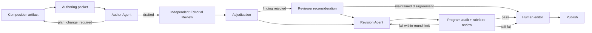

# 馬太福音釋經文章多 Agent 寫作流程 v1

## 1. 原則

這是一條領域專用、以版本化 artifact 交接的工作流，不是通用聊天 Agent，也不恢復已退役的 `backend/api/multi_agent/`。可重複性指同一組輸入契約、角色邊界、審核門檻與交接產物可以反覆執行；它不要求模型每次逐字生成相同文章。

所有模型只讀明确交付给它的 packet，不自行遍历仓库。每一个阶段记录输入 hash、prompt、schema、model 与上游 artifact；输入改变即产生新 generation。人工出版批准不能由 Agent 自授。

## 2. 角色与边界

1. Composition Agent：决定材料进入正文、专題或暂不处理，并给出段落功能；不写最终散文。
2. Author Agent：以 1–16 章的笔记整理稿为母本，写出平实而充实的完整文章；不裁决来源冲突，不更改 composition 意图。
3. Editorial Review Agent：独立判断成文质量、母本保全、普通读者可读性和神学张力；不重做 claim extraction，也不直接改稿。
4. Adjudication Agent：逐条判断 review finding 是否成立、是否可执行；不新增问题，不代替作者写作。
5. Reconsideration Agent：只复核被裁决驳回的 finding；仍有分歧则转人工。
6. Revision Agent：根据已接受 finding 重写完整稿，并逐条报告 resolved/deferred；blocking finding 不可 deferred。
7. Program Audit：检查 provenance、manifest、必要经文、链接、音频和机器可验证的不变量；不判断文章是否写得好。
8. Human Editor：确认 rubric、composition 变更、未决神学张力和最终出版。

## 3. 输入契约

每次运行至少需要：

- canonical CompositionPlan 或经共识修订的 reviewed candidate；
- passage knowledge snapshot；
- `base-manuscript-contract.json`，含母本 path/hash、承重步骤、允许的补充操作；
- publication profile；
- writing quality profile；
- 所有实际文本片段。packet 不得只给模型一个本机文件路径。

对马太福音 1–16 章，补充材料只允许 `corroborate`、`extend`、`qualify`、`tension`、`route_out`；不得用补充讲道取代母本框架。

## 4. Agent 状态机

圖中的 rubric `pass` 必須是總分至少 90，並且所有維度硬門檻與 hard failure 檢查同時通過；89 分及以下不得進入人工發布閘門。

Author Agent 可以把多個 composition decision 組織在同一個讀者小節中；這只是呈現層決定，現有 audit 也允許多對一的 heading 映射。若現有 manifest 要求多處「編輯說明」，作者可先把資料邊界集中成較少、較自然的說明，再由 audit 檢查各 decision 是否仍被覆蓋。只有當作者需要改變 action、claim 集合、coverage、主要順序或張力處置時，才返回 `plan_change_required`，提出具體 change request 後停止；它不能靜默改動 CompositionPlan 的實質意圖。

## 5. 阶段产物

一个 staging output directory 包含：

- `authoring-packet.json`
- `base-manuscript-contract.json`
- `authoring.json` 与 `draft.md`
- `independent-editorial-review.json`
- `editorial-adjudication.json`
- `editorial-reconsideration.json`（仅需要时）
- `reviewed-editorial-findings.json`
- `revision-01.json` 与 `revised-draft.md`
- `program-audit.json`
- `human-publication-decision.json`

每項使用 `{schema_version, generation, result}`；deterministic 派生檢查可另放同一 envelope 的 `checks`。同一 generation fingerprint 已完成時跳過模型調用；覆蓋前將舊產物移入 `generations/`。

目前 v1 runner 只寫 staging，完成首輪修訂後返回非終態 `revised_requires_reaudit`。後半段由既有 manifest 流程接手：提升選定稿、獨立重審、程序 audit，再產生 `human-publication-decision`。repository publisher 會在複製前強制核對成稿、重審與 audit 的 SHA，以及人工發布決定；任何不一致或非通過狀態都會拒絕發布。runner 的非終態仍必須當作待交接，而不是成功出版。

## 6. 失败与停止条件

- 母本 hash、plan hash、knowledge hash 或 profile hash 不符：运行前失败。
- 作者漏报 required argument step、使用未知 claim，或修改不可变边界：schema/validator 失败。
- 作者要求 composition change：产出 handoff 后停止，不进入 review。
- blocking finding 未解决、硬门槛失败或超过最多两轮：转人工，不无限循环。
- `human-publication-decision` 不为 approved：不得写入 repository 的 published/current 位置。

## 7. 太 16:13–20 首个案例

第一轮只以太 16:18 作 golden regression，证明系统能区别「技术审核通过但论证被压扁」与「母本推理完整、书面风格平实」；标准经人工确认后才重写全文。全文完成后依次运行 program audit、独立 Editorial Review Agent、人工确认、repository 发布与 production UI 检查，最后才形成一个 Git 批次。
