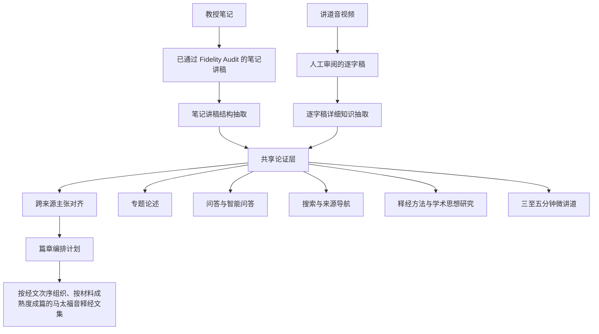

# 馬太福音釋經：來源進入論證層與跨來源整合流程 v1

## 一、目的

本文件定義《馬太福音》釋經教學文集的上游資料流程。第一至二十八章是來源檢索與閱讀導航範圍，不預設每章都必須有一篇文章。它回答四個實作問題：

1. 已由筆記生成、並通過 Fidelity Audit 的第一至十六章講稿，是否還要重做？
2. 分散於不同年份、系列與場地的講道逐字稿，如何進入同一套知識模型？
3. 筆記講稿與講道內容重複、補充或不一致時，如何處理？
4. 論證層如何支援按經文排列、按材料成熟度成篇的釋經文集，而不妨礙專題、問答、搜索、思想研究和微講道？

本流程的核心原則是：

> **先判定來源的信任狀態，再把所有可用來源轉換為同一套共享論證模型；來源已經成為文章，不代表可以繞過論證層。**

本流程的機器可讀來源總表是：

```text
$DATA_BASE_DIR/wang-knowledge-platform/catalog/matthew_source_coverage.json
```

同工可直接閱讀的全範圍來源清單為：

```text
$DATA_BASE_DIR/wang-knowledge-platform/catalog/matthew_source_coverage.md
```

該檔以第一至二十八章為檢索骨架，同時列出兩條來源管線：講道逐字稿，以及「馬太福音釋經」
notes-to-manuscript 系列中非 `project_type=transcript` 的 Projects。`transcript` Project 是由講道逐字稿
生成的編輯視圖，不再作為獨立的「筆記轉講稿」來源；它所連結的講道仍由原始講道來源管線進入。
`source_directory` 是去重後的完整來源清單，
`chapters[].sources` 是按章節使用的來源，`book_level_sources` 則保存尚未明確定章的全書或結構性材料。
這是一份來源地圖，不是出版目錄或完成率報表；某章有來源，也不表示材料已足以成篇。
生成規則與重跑命令見[《講道目錄與來源攝取》](./sermon_catalog_ingestion.md)。

## 二、兩條來源管線

### 2.1 第一至十六章：已審核的筆記講稿

第一至十六章的主要來源是王教授釋經課筆記。現有 `notes → manuscript` 流程已完成內容展開、分類、編輯和 Fidelity Audit。凡 Project 的所有 chunk 均已通過 Fidelity Audit，可視為**可信的編輯來源**。

這類資料不再重做：

- OCR 或筆記擷取；
- notes-to-manuscript 初稿生成；
- 已經完成的逐點 Fidelity Audit；
- 僅為得到另一份措辭相近講稿而進行的全文重寫。

但仍須進行**結構抽取**，因為 Fidelity Audit 與論證層回答的是不同問題：

| 工作 | 回答的問題 |
| --- | --- |
| Fidelity Audit | 這篇講稿是否忠實保留筆記中的內容，沒有重大增刪或立場改寫？ |
| 論證層抽取 | 教授提出了什麼問題、觀察、主張和理由？這些內容彼此如何支持、限定、回答或反駁？ |

因此，通過 Fidelity Audit 的講稿是論證層的**可信結構抽取入口**，不是論證層的替代品。

#### 抽取讀哪一份文字

第一至十六章的整理稿已完成審核，並且**不再修改**。抽取一律讀該 Project 的 `final.md`，不讀 `draft_v1.md`：

- `final.md` 是通過 Fidelity Audit 的那份文字，也是本管線唯一的抽取輸入；
- 系列整合補丁只寫入 `draft_v1.md`，不寫入 `final.md`。因此第十七章以後的講道內容不會沿這條管線混入第一至十六章的筆記主張；
- 「Restart Theological Review」會把 `draft_v1.md` 整份複製成 `final.md`。在本管線上不得對這些 Project 執行該操作，否則講道內容會進入筆記來源；
- 不重跑 Fidelity Audit。`meta.json` 的 `audit_passed` 若因整合流程失效而為 `false`，反映的是 `draft_v1.md` 被改寫，與 `final.md` 的審核狀態無關。

### 2.2 分散講授材料：講道錄音、錄像與逐字稿

王教授關於《馬太福音》的講授分散於紐約靈命進深會、達拉斯聖道教會及其他已確認來源，並不構成一套由教授逐章撰寫的「後半卷註釋」。這些講道也可能與第一至十六章筆記材料重疊。處理順序是：

1. 確認講道身份、系列、日期、來源機構和媒體 URL；
2. 使用人工審閱過的逐字稿；若只有原始逐字稿，先完成逐字稿審閱；
3. 從完整逐字稿抽取問題、觀察、主張、證據步驟、反方立場及關係；
4. 每項證據保留精確引文、段落、時間碼和來源版本；
5. 由獨立模型做來源忠實度復審，再按既定仲裁規則处理分歧；
6. 合格候選進入共享知識模型。

講道中的聽眾發言、教授轉述的反方觀點、戲劇化代言、個人經歷和政治評論必須各自標明話語角色，不能一律當作教授的正式主張或經文證據。

## 三、來源信任與溯源身份

所有來源在抽取前先建立 `SourceDocument`，並記錄來源種類與信任狀態。

### 3.1 已審核筆記講稿

建議保存：

```yaml
source_type: verified_notes_manuscript
source_role: trusted_editorial_derivative
project_id: <notes-to-manuscript project id>
upstream_source_type: professor_notes
fidelity_status: passed
fidelity_artifact: <fidelity_audit.json or canonical audit record>
manuscript_revision: <revision/hash>
```

这表示：

- 内容已按现有流程与笔记核对；
- 可以直接用于结构抽取；
- 它仍是由笔记生成并经审核的派生资料，不应标成逐字讲道原话；
- 对外引用时，应显示「释经课笔记整理讲稿」，并尽可能保留到笔记、Project 和 Fidelity 记录的上游链路。

若某个拆分后的 Project 没有自己的 Fidelity artifact，系统不得仅凭相似标题推断它已通过。应先追查它是否继承自已经通过审核的母 Project，并建立明确的 `derived_from` 记录；无法证明时，状态应为 `audit_lineage_unresolved`，而不是重新假定已审核或未审核。

### 3.2 讲道逐字稿

建议保存：

```yaml
source_type: sermon_transcript
source_role: primary_spoken_source
transcript_id: <transcript id>
sermon_id: <sermon id>
speaker: 王守仁
source_organization: <NYSC / Dallas HLC / other confirmed source>
transcript_review_status: reviewed|published
media_url: <audio/video url>
source_sha256: <transcript version hash>
```

证据片段必须继续保存 `citation_id`、精确引文、段落 hash、字符范围及媒体时间码。逐字稿发生变化时，引用必须重新解析；失效引用不得继续作为合格证据。

## 四、统一的论证层

> **完整性由對帳保證，不由本節保證。** 本節描述來源如何轉換為論證層，但沒有任何機制驗證它轉換得完整。
> 全庫實測：430 條 observation 中 375 條（87%）從未進入論證層。下游每一道 gate 只讀 claim 層，
> 因此沒進圖的材料與教授沒說過的材料在系統內無法區分（#64）。
> 完整性的目標流程見[《來源逐句對帳與 claim 層完整性 v1》](./source_to_claim_layer_ledger_v1.md)。

两条来源管线最终都进入同一组对象，而不是各自建立一套私有语义：

| 对象 | 用途 |
| --- | --- |
| `SourceDocument` | 说明材料来自笔记讲稿还是讲道逐字稿 |
| `SourceFragment` | 保存可核查的具体来源片段 |
| `Question` | 教授或听众提出的问题，以及是否得到回答 |
| `Observation` | 经文、原文、文体、上下文和历史观察 |
| `Claim` | 教授所主张的判断或结论 |
| `EvidenceStep` | 从观察或经文走向主张的论证步骤 |
| `PositionNode` | 教授引用、质疑或驳斥的外部立场 |
| `ClaimRelation` | 支持、回答、限定、解释、反驳、印证、扩展等关系 |
| `KnowledgeRoute` | 主张可进入释经、专题、问答、方法研究、思想发展或微讲道 |

### 4.1 笔记讲稿的结构抽取

对已审核讲稿，应按完整释经单元抽取，而不是把 Markdown 标题直接当作知识对象：

```text
讲稿中的问题
  → 对经文／原文／背景的观察
  → 教授的解释判断
  → 支持该判断的经文与推理
  → 神学结论
  → 生活应用及其推论链
```

现有 `释经 / 神学意义 / 生活应用 / 附录` 分类可作为抽取线索，但不自动决定对象类型。例如「神学意义」段落中仍可能包含经文观察；「释经」段落中也可能包含专题性神学主张。

### 4.2 讲道逐字稿的结构抽取

讲道通常顺序松散，可能先回答问题、转入专题、讲个人经历，再回到经文。抽取时要保存原始顺序和话语角色，但知识层按逻辑关系组织，不把课堂时间顺序误当作最终文章结构。

## 五、跨来源对齐与合并

论证层完成后，系统以**主张为单位**比较笔记讲稿和讲道材料。不能以整篇标题或同章经文自动判定重复。

### 5.1 允许的比较结果

| 关系 | 含义 | 编辑处理 |
| --- | --- | --- |
| `duplicate` / `corroborates` | 两个来源表达实质相同的主张 | 保留两个来源；正文只写一次 |
| `extends` | 后一来源增加新证据、限定、例证或应用 | 将新增内容补到适当位置 |
| `qualifies` | 后一来源缩小、修正或说明原主张适用范围 | 正文呈现限定，不能只保留较强说法 |
| `tension` | 两处表达目前不能简单协调 | 保留张力，进入编辑审核 |
| `notes_only` | 目前只见于笔记讲稿 | 可用于成稿，并清楚显示来源身份 |
| `sermon_only` | 目前只见于讲道 | 评估进入正文、专题、问答、应用或补充材料 |
| `unrelated` | 虽共享词语或经文，却不是同一论证 | 保存负约束，防止以后误合并 |

### 5.2 不可采用的合并方法

- 不按 Project 标题自动合并；
- 不因引用同一节经文就视为同一主张；
- 不用最新讲道覆盖旧材料；
- 不把多个来源改写成一条无法分辨来源的综合段落；
- 不把编辑综合生成的高层结论写成教授明确说过的话。

### 5.3 一个具体例子

假设第十六章笔记讲稿已经说明：

```text
主张 N1：太16:28 的应验与紧接着的登山变像有关。
证据：太16:28 与太17:1 的叙事连接。
```

第三讲又提供：

```text
主张 S1：彼后1:16–18 把使徒所见的基督威荣与“降临”相连，支持登山变像是预尝与保证。
```

正确处理不是保留两段重复解释，也不是让讲道覆盖笔记，而是：

```text
N1  ←corroborates / extends→  S1
```

成稿只形成一个逻辑完整的解释，但读者可分别回到笔记讲稿和第三讲的原始来源。

## 六、篇章编排层

共享论证层回答「教授说了什么、为什么这样说」；篇章编排回答「这一章应当怎样教」。两者不能混为一层。

每项重要取舍保存为 `CompositionDecision`，至少包括：

```yaml
decision_id: <stable id>
product_plan_id: <Matthew chapter plan>
source_claim_ids: [<claim ids>]
action: main_section|brief_note|theological_explanation|application|topic_link|qa|appendix|omit|coverage_gap
reason: <why this treatment fits this chapter>
review_status: candidate|ai_consensus|changes_requested|approved
editorial_owner: <human/editorial role>
```

正文之外还必须保存材料处置记录。`source_only` 不是删除，也不是待补正文；它表示该材料与当前篇章关系不足，故 `article_inclusion=false`，但其 Claim、Evidence 与 SourceFragment 仍保留，并进入 `requires_human_verification`。人工认证前可保存在由 manifest 绑定、带内容指纹的 staged knowledge record 中；认证通过后才并入 active shared knowledge。由同工决定以后是否转入专题、方法研究或仅保留来源。

篇章编排可以决定：

- 经文单元的先后次序；
- 哪条主张是段落主旨，哪些是支持论据；
- 重复材料只写一次；
- 跨经文主题只在本章简要说明，并链接专题；
- 个人经历、政治观点和课堂岔题进入正文、侧栏、附录或不出版；
- 教授没有讲解的经文显示 `coverage_gap`。

这些决定属于编辑，不属于教授。它们必须可审核、版本化，并在新来源加入后进行影响分析。

## 七、从共享知识到多种成果

同一套论证层同时支撑：



任何产品不得另建私有主张或私有主题身份。产品若发现资料缺口、错误关系或归属问题，必须回写共享知识层；若只是文章详略或顺序问题，则修改该产品的篇章编排计划。

## 八、第十六章示范实施顺序

第十六章作为第一项端到端示范，按以下顺序进行：

### 8.1 确认来源谱系

1. 列出所有第十六章 notes-to-manuscript Projects；
2. 确认母 Project 的 Fidelity Audit 结果、讲稿 revision 和上游笔记；
3. 对拆分 Project 建立明确的 `derived_from`，不得凭标题继承审核状态；
4. 收集现有讲道中涉及太16的详细逐字稿和媒体来源。

### 8.2 从已审核讲稿抽取论证层

1. 识别每个问题、观察、主张、证据步骤和应用推论；
2. 保留现有 Markdown 段落、Project、讲稿 revision 和 Fidelity lineage；
3. 为每条主张建立稳定 ID；
4. 生成来源、证据资格和关系验证报告；
5. 不重新生成讲稿，也不重复运行已完成的 Fidelity Audit。

### 8.3 与讲道知识对齐

1. 查询全库中涉及太16的候选主张；
2. 对选定讲道运行详细抽取和独立 AI 复审；
3. 产生 `corroborates / extends / qualifies / tension / unrelated` 候选关系；
4. 通过程序验证和双模型复核后写回共享 authoring store；
5. 保留每一来源的独立证据，不把两者熔成无法追查的摘要。

### 8.4 建立第十六章篇章计划

1. 按经文顺序建立各释经单元；
2. 为每单元指定问题、段落主旨、支持主张、神学意义和应用；
3. 对每个经文单元必须给出且只能给出一项成篇判断：`可正式成篇 / 只适合短注 / 只保留来源 / 材料不足`；不得用「可进入结构抽取」或其他流程状态代替出版判断；
4. 把深入的「人子」、教会、十字架、信心等论述路由到专题，只在章内保留必要说明；
5. 登记教授未处理或材料不足的经文；
6. 由同工审核篇章决定，而不是重新审核所有未被本章使用的候选资料。

### 8.5 生成初稿并执行程序化审计

1. 初稿必须读取已确认的篇章计划与共享知识快照，不得重新从来源临时发明一套私有主张；
2. 每个要求成文的 `CompositionDecision` 必须以稳定 `decision_id` 显式映射到一个 Markdown 标题，不能靠标题相似度猜测是否已覆盖；
3. 程序检查必要栏目、编排覆盖、主张存在性、每条主张至少一项合格支持证据、来源版本与锚点，以及专题转介；
4. 背景、听众提问和反方材料可以作为上下文保留，但不能替代支持教授主张的合格证据；
5. `fail` 返回篇章计划、共享知识或来源层修复；`pass_with_warnings` 和 `pass` 才进入编辑人工阅读；
6. 程序通过不等于出版批准。逻辑、文体、详略、神学表述与应用推论仍由编辑审核。

太16:1–12 已完成验证并于 2026-08-15 发布第一篇文章：6/6 编排决定、14 条共享主张、25 个证据步骤和 27 个来源片段全部可定位，0 错误；两项警告为尚待建立的专题链接。Final Delta Review 经程序合并重算为 90 分并通过 hard gates，发布稿 SHA、editorial review、Program Audit 与 human publication decision 已由 repository publisher 逐项核对。完整规范见[《释经初稿的程序化审计流程 v1》](./editorial_draft_audit_workflow_v1.md)与[《馬太福音釋經文章多 Agent 寫作流程 v1》](./matthew_exposition_multi_agent_authoring_workflow_v1.md)。

### 8.6 生成与文章同序的原声来源投影

原声片段不得另外按逐字稿顺序或 citation 数量组织，而应直接读取已经审核的篇章计划：

1. 对每个 `CompositionDecision` 收集它实际采用的 Claim、Evidence 和带时间码的 SourceFragment；
2. 同一来源中相邻或重叠的材料合并为一个语义完整的连续片段；
3. 不连续但共同支持同一文章段落的材料保留为 `segment_group`，按原讲道时间顺序排列，不做虚假连续剪接；
4. 将 `source_presentations` 写回该编排决定，并由 Draft Manifest 的 `decision_id → markdown_heading` 映射定位到文章段落；
5. API 在读取时通过稳定来源 ID 解析当前 media URL，前端在对应文章段落内显示「听王教授原声讲解」；
6. 只有笔记讲稿而没有录音录像的段落标示为不可播放，不补造原声；
7. 原声呈现必须随 CompositionPlan、Claim、Evidence、SourceFragment 或锚点的修订重新生成并接受影响分析。

太16:1–12 的首轮实现中，6 个编排决定有 4 个可播放，共形成 6 个播放时间范围；另外 2 个段落只有笔记整理讲稿。原声和文章共用一套编排顺序，因此不是另建的媒体产品，也不会把讲道现场的松散顺序重新带回整理后的文章。

## 九、第十六章验收标准

示范完成时，至少满足：

1. 现有已审核讲稿没有被无必要重写；
2. 每条进入正文的重要判断都可回到笔记讲稿或讲道来源；
3. 笔记讲稿的 Fidelity lineage 可见且可验证；
4. 笔记与讲道中的重复主张只写一次，但来源全部保留；
5. 讲道新增的经文、原文、限定、例证和应用没有遗漏；
6. 听众、反方、教授代言和编辑综合没有被误标为教授正式主张；
7. 神学意义由释经推出，深入专题有明确链接；
8. 生活应用保留「经文处境 → 解释 → 原则 → 今日处境 → 应用」链；
9. 每个篇章取舍都有可审查的 `CompositionDecision`；
10. 每项未入文的实质材料都有 `MaterialDisposition`，不会在编排与审计之间静默消失；
10. 同一批知识可以被专题、问答、搜索、思想研究和微讲道复用，而无需再从第十六章文章反向猜测知识。
11. 初稿通过程序化审计：所有成文决定均已定位，所用主张有合格支持证据，来源锚点与版本有效，未完成的专题转介被明确列为警告而非静默忽略。
12. 有媒体来源的正文段落按同一 `CompositionDecision` 显示语义完整的原声片段；不连续片段保持原始时间次序且不伪装为连续录音，只有笔记来源的段落不生成虚假播放器。

## 十、实现边界

本文件定义的是应当实现的 canonical workflow。实现时应优先复用：

- notes-to-manuscript 已有 Project、chunk、Fidelity Audit 和 Markdown 结构；
- Canonical Repository 的 `SourceDocument`、Citation、Claim、Evidence、Relation 和 PostgreSQL authoring store；
- 现有详细知识抽取、独立 AI 复审、跨讲关系整合、Active Snapshot 和影响传播能力。

需要新增或补齐的能力主要是：

1. `verified_notes_manuscript` 来源适配器；
2. Fidelity lineage 和 split-project derivation 的显式记录；
3. 从已审核 Markdown 讲稿抽取共享论证对象的可重复 runner；
4. 笔记讲稿主张与讲道主张的跨来源对齐；
5. 第十六章端到端验收报告。

实现不得另造一套只供《马太福音》使用的知识模型；《马太福音》是共享模型的第一个大型成书工程和压力测试，但「大型」不等于为了形式完整而填满二十八章。
