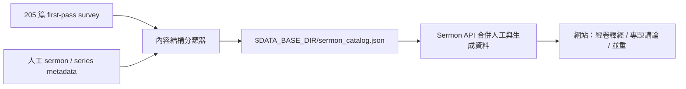

# 講道目錄分類與 ingestion 邊界

## 目的

205 篇講道首先需要一個方便讀者瀏覽的入口，但「網站目錄分類」不等於「教授思想的主題歸組」。本階段只回答一個較窄的問題：每篇講道的篇章主要如何推進？

- **經卷釋經**：主要沿一段經文、同一章或相鄰上下文逐步解釋。
- **專題講論**：主要圍繞一個問題或觀念，使用多處經文形成論證。
- **釋經與專題並重**：兩種組織方式都有實質篇幅，不能誠實地壓成其中一類。

這不是品質等級，也不表示專題講論不做釋經。王教授的專題常以大量經文解釋建立論證；判斷的關鍵是「文章由連續經文還是由問題／主題帶領」。

## 資料位置

所有供網站讀取的資料都放在 `DATA_BASE_DIR` 下：

- 人工講道 metadata：`$DATA_BASE_DIR/config/sermon.json`
- 人工系列 metadata：`$DATA_BASE_DIR/config/sermon_series.json`
- 可重建目錄：`$DATA_BASE_DIR/sermon_catalog.json`

`sermon_catalog.json` 是 read model。分類器不得改寫 `config/sermon.json`，以免覆蓋人工標題、摘要、發布狀態與核心經文。

## 可重跑流程



执行：

```bash
.venv/bin/python -m backend.pipeline.sermon_catalog_runner
```

分類使用第一遍普查的段落功能、經文集中度與跨經文分布。標題或系列名稱中的「釋經」只能作輔助訊號，不能單獨決定分類。每筆記錄保留分類理由、信心、來源 hash 與分類器版本，以便重跑和抽樣審閱。

目前網站使用三個互補入口，而不是把每篇講道硬塞進一個主題：

1. 頁面上方以**篇章組織方式**切換：經卷釋經、專題講論、釋經與專題並重；
2. 左側可按**講道系列、年份與來源**瀏覽歷史資料；
3. 同一篇講道仍可同時帶有多個**聖經書卷與主題 facet**，供交叉篩選。

例如，一篇属于《罗马书释经》系列的讲道，若实际论述跨越多卷经书并围绕「约」推进，仍可归为「专题讲论」。系列表示讲道历史归属，分类表示该篇内容如何组织，两者不得互相覆盖。

## 运行时刷新

目录使用临时文件加原子替换写入。后端 watcher 必须同时处理 `modified`、`created` 和 `moved` 事件；否则文件虽然已经更新，运行中的 API 仍可能保留旧 catalog。API 在每次加载时将根目录的 `sermon_catalog.json` 与 `config/sermon.json` 按 `transcript_id` 合并。

若 production 没有出现新分类，先检查：

```bash
test -f "$DATA_BASE_DIR/sermon_catalog.json"
python -m json.tool "$DATA_BASE_DIR/sermon_catalog.json" >/dev/null
```

随后确认 API 返回的 `organization_mode`、`series_title`、`scripture` 和 `topic` 字段；不应通过复制文件到 repo 或修改 `config/sermon.json` 解决。

## 与共享知识库的边界

目錄分類只决定讲道如何浏览，不批准主张，也不建立跨讲道专题结论。进入共享知识库仍需经过：

1. 详细知识提取；
2. 来源、说话者与立场资格检查；
3. 与现有主张图比较；
4. 合并、扩展、张力或新主张的可重复判定；
5. 独立 AI 复核及必要时仲裁。

因此，可以先完成全站目录，而不把目录标签误当成最终思想体系。
