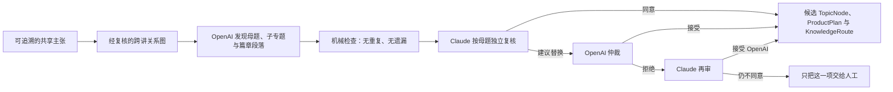

# 母题—子专题—篇章段落自动发现与双模型复核 v1

## 一、要解决的问题

逐篇抽取主张、建立跨讲关系后，系统仍不能要求同工手工先找出“母题—子专题—篇章段落”。那会把项目最困难、也最需要跨 205 篇扩展的思想综合工作重新推回个人经验。

本流程把这项工作定义为共享知识模型上的独立编辑阶段：



它不从讲道标题生成目录，也不读取现有手工文章来反推答案。现有文章只在结果生成后作为外部验证材料，检查系统是否发现了相近的主要议题，并发现人工文章遗漏或无溯源之处。

## 二、三个层级

1. **母题（Topic Family）**：跨多个问题、经文或讲道反复出现的高层研究领域，例如“约、恩典与人与神的关系”。
2. **子专题（Subtopic）**：围绕一个明确中心问题、可以形成独立专题文章的论证范围，例如“关系性义、信与恩典”。
3. **篇章段落（Composition Section）**：为回答中心问题而安排的文章次序，例如提出问题、核心主旨、经文证据、推理、限定、应用和附录。

这三层都是**编辑综合候选**，不是新增的教授主张。教授主张仍由 `Claim` 保存，原始讲道与精确引文仍由 `SourceFragment` 和证据步骤保存。

## 三、硬性守门规则

- `ResearchBatch` 只是处理范围，不得自动成为母题。
- 结构必须优先来自主张及其 `supports / explains / qualifies / refutes / answers` 等关系，不能以讲道标题代替思想分析。
- 每条主张只能有一个主要专题归宿，或者明确进入 `unassigned_claim_ids`；未来可以建立交叉链接，但不能复制主张制造重复知识。
- 替换一个母题时，Claude 必须保存原母题完全相同的 claim ID 集合，防止审核意见偷偷增加或删除教授材料。
- AI 不做神学批评、事实核查或教义裁判；只审核归属、范围、逻辑次序和可追溯性。
- 所有输出保持 `candidate / internal`，双模型共识不等于人工出版批准。
- 来源、prompts、模型、reasoning effort 与 response schemas 都进入生成指纹；旧世代归档，输入相同时可安全复用。

## 四、核心九篇实测（2026-08-12）

输入为核心九篇的已整合共享知识包，包含 158 条主张和 181 条关系。流程没有读取手工文章《血与盟约》的目录。

实跑结果：

| 项目 | 数量 |
|---|---:|
| 自动发现母题 | 6 |
| 自动发现子专题 | 13 |
| 被恰好分配一次的主张 | 158 |
| 未归组主张 | 0 |
| Claude 直接认可的母题 | 5 |
| Claude 建议拆分、OpenAI 接受 | 1 |
| 两轮后仍分歧、转人工 | 0 |

六个候选母题是：

1. 约、恩典与人与神的关系；
2. 摩西律法的完成与基督律法；
3. 基督身份、受难与立约之血；
4. 天国、弥赛亚与门徒品格；
5. 外邦人纳入与教会辨识；
6. 释经方法与研究者本分。

Claude 指出“外邦人纳入与教会辨识”下原来的单一子专题与母题几乎同名，不能呈现材料中的两条不同论证线。OpenAI 接受后拆为“外邦人得救的基础与十字架的和睦”及“地方性禁戒与犹太外邦相处”。这说明审核不是装饰：它确实改变了篇章结构。

`未归组=0` 只说明本批 158 条主张都能找到候选主要归宿，不证明未来批次也必须为零。强迫归组仍被禁止。

## 五、代码与产物

- 数据结构及机械验证：`backend/pipeline/topic_structure_discovery.py`
- 双模型 runner：`backend/pipeline/topic_structure_discovery_runner.py`
- prompts：`backend/pipeline/prompts/topic_structure_*.md`
- tests：`backend/tests/test_topic_structure_discovery.py`
- 核心九篇报告：`output/claim-layer/research-batches/RB-COVENANT-LAW-CORE-NINE-01/topic-structure/topic-structure-report.md`
- 可写入 PostgreSQL 的候选包：同目录 `candidate-package.json`

运行：

```bash
PYTHONPATH=. .venv/bin/python -m backend.pipeline.topic_structure_discovery_runner \
  --batch-root output/claim-layer/research-batches/RB-COVENANT-LAW-CORE-NINE-01
```

默认只生成候选文件。确认要进入管理员审核工作台时才加 `--apply`；`--apply` 也只是写入候选对象，不会自动批准或发布。

## 六、管理员 UI（2026-08-12）

自动发现结果已经接入思想审核的候选工作台：

`/admin/thought-review/candidates?axis=structure`

页面把这一阶段单独显示为“专题结构”，不与已经形成 `ProductPlan` 的“专题候选”混在一起。审核者可以逐层展开：

1. **候选母题**：显示组织问题、形成理由、子专题数、主张数，以及双模型共识／需要同工判断状态；
2. **候选子专题**：显示中心问题、篇章段落数和所覆盖的主张数；
3. **篇章段落**：显示该段落在文章中的作用、安排目的，以及所依据的共享主张。

当前核心九篇的 UI 投影显示 6 个母题、13 个子专题和 158 条恰好分配一次的主张。页面读取的是可重建的 `reviewed-topic-structure.json`，因此它是**结构发现结果的审核投影**，不是另一份私有知识库，也不表示已经取得人工出版批准。

对应实现：

- 后端投影：`backend/api/thought_review.py::_topic_structure_candidates`
- 管理员页面：`web/src/app/admin/thought-review/candidates/page.tsx`
- 守门测试：`backend/tests/test_thought_review.py::test_candidates_show_discovered_topic_hierarchy_as_separate_stage`
